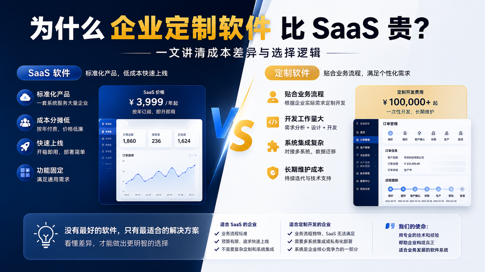

# 为什么企业定制软件比 SaaS 贵？

很多企业在选择软件时，都会遇到一个问题：

> 市面上的 SaaS 软件一年只需要几千元，为什么定制开发一套软件，却可能需要几万、几十万，甚至更高？

很多人的第一反应是：

> “是不是软件开发公司报价太高？”

其实，大多数情况下，并不是简单的“贵”和“便宜”的问题，而是 **SaaS 和定制软件解决的根本不是同一类问题**。

在解释价格之前，我们先把两个概念说清楚。

## 先说清楚：什么是 SaaS，什么是定制软件？

### 什么是 SaaS？

SaaS 的全称是 **Software as a Service**，中文通常叫做 **软件即服务**。

简单来说，就是：

> 软件已经做好了，企业直接按年、按月或者按账号订阅使用。

你可以把它理解成“租软件”。

比如：

- 在线客户管理系统
- 在线表单系统
- 在线考勤系统
- 在线财务工具
- 在线订单管理工具

这些软件通常是标准化的，很多企业都可以直接使用。

SaaS 的特点是：

- 不需要自己开发
- 不需要自己部署服务器
- 通常开通账号就能用
- 功能比较标准
- 价格相对较低
- 上线速度快

它适合那些业务流程比较通用、需求比较标准的企业。

------

### 什么是定制软件？

定制软件，指的是：

> 根据某一家企业自己的业务流程、管理方式和使用场景，专门开发一套软件。

你可以把它理解成“量身定做”。

比如：

- 按照企业自己的审批流程开发系统
- 按照企业自己的报价规则开发系统
- 按照企业自己的生产流程开发系统
- 按照企业自己的仓储规则开发系统
- 按照企业自己的权限体系开发系统

定制软件的特点是：

- 功能是按企业需求设计的
- 可以和企业现有流程深度匹配
- 可以对接内部系统
- 可以做私有化部署
- 灵活性更高
- 开发成本更高
- 开发周期更长

它适合那些业务流程比较特殊、标准 SaaS 无法满足的企业。

------

## 一、SaaS 卖的是一套“通用解决方案”

SaaS 的核心模式是：

> 一套软件，服务很多企业。

例如，一款通用的订单管理 SaaS，可能有以下功能：

- 创建订单
- 修改订单
- 订单审核
- 发货管理
- 数据统计

这些功能可以满足很多企业的基本需求。

SaaS 厂商只需要开发一套系统，然后让大量企业共同使用。

假设一套 SaaS 系统的开发和运营成本为 100 万元：

```text
1000 家企业共同使用
        ↓
共同分摊成本
        ↓
每家企业的使用成本降低
```

这就是 SaaS 能够以较低价格提供服务的原因之一。

对于业务流程比较标准的企业来说，SaaS 通常是一个非常划算的选择。

------

## 二、定制软件解决的是企业自己的问题

但是，企业真正的业务流程往往并没有那么标准。

例如，两个企业都说自己需要一个“订单管理系统”。

但实际流程可能完全不同。

### 企业 A

```text
客户下单
    ↓
订单审核
    ↓
发货
```

### 企业 B

```text
客户询价
    ↓
销售报价
    ↓
客户确认
    ↓
采购
    ↓
生产
    ↓
质检
    ↓
分批发货
    ↓
售后
```

### 企业 C

```text
销售接单
    ↓
客户信用审核
    ↓
财务审核
    ↓
采购
    ↓
生产
    ↓
多仓库调拨
    ↓
分批发货
```

它们都叫“订单管理”，但实际业务流程可能完全不同。

如果强行让所有企业使用同一套流程，就会出现一个常见问题：

> 企业为了适应软件，不得不改变自己的业务流程。

而定制软件的目标恰恰相反：

> **让软件适应企业的业务流程。**

------

## 三、定制软件贵的地方，不只是写代码

很多人会认为：

> 定制软件的价格 = 程序员写代码的时间。

实际上，一个完整的定制软件项目，通常包括：

```text
了解业务
    ↓
梳理流程
    ↓
设计产品
    ↓
设计界面
    ↓
开发系统
    ↓
对接其他系统
    ↓
迁移历史数据
    ↓
测试
    ↓
部署上线
    ↓
培训使用
    ↓
后续维护
```

其中，真正困难的部分往往不是把一个按钮写出来，而是：

> **准确理解企业到底是如何运转的。**

一个系统如果没有真正理解业务，即使代码写得再漂亮，最终也可能没人愿意使用。

------

## 四、软件开发真正昂贵的，往往是“复杂性”

举一个简单的例子。

客户可能会说：

> “我们需要一个订单管理系统。”

这句话听起来非常简单。

但是继续深入之后，可能会发现：

- 一个客户可以有多个联系人
- 一个订单可以分批生产
- 一个订单可以分批发货
- 不同客户有不同价格
- 不同员工只能查看部分订单
- 某些订单需要多级审批
- 订单修改后需要重新审核
- 财务系统需要同步数据
- 库存系统需要同步库存
- 老数据需要导入新系统

这时，真正需要解决的问题就不再是：

> “做几个页面？”

而是：

> **如何把现实世界中复杂的业务规则，准确地转换成一个可以长期运行的软件系统。**

这也是定制软件成本较高的根本原因。

------

## 五、为什么一个看似简单的需求，最后会变复杂？

例如：

> “给订单加一个审核功能。”

看起来只需要增加一个按钮：

```text
审核
```

但实际可能需要考虑：

```text
谁可以审核？
        ↓
什么状态下可以审核？
        ↓
审核失败怎么办？
        ↓
审核后能不能修改？
        ↓
修改后是否需要重新审核？
        ↓
谁可以查看审核记录？
        ↓
是否需要通知相关人员？
```

所以软件开发中经常会出现这样的情况：

> **一个看似简单的功能，背后可能对应一整套业务规则。**

而定制软件需要解决的，正是这些企业独有的规则。

------

## 六、SaaS 和定制软件，应该如何选择？

并不是定制软件越贵，就一定越好。

相反，如果 SaaS 已经能够满足你的业务需求，那么直接使用 SaaS 通常是更好的选择。

### 更适合 SaaS 的情况

如果你的企业：

- 业务流程比较标准
- 不需要复杂定制
- 希望快速上线
- 预算有限
- 不需要和大量内部系统集成

那么 SaaS 通常更加合适。

你需要的是：

> **直接使用一套成熟的解决方案。**

------

### 更适合定制软件的情况

如果你的企业：

- 有独特的业务流程
- 现有 SaaS 无法满足需求
- 需要连接多个内部系统
- 需要私有化部署
- 对数据安全有较高要求
- 软件本身是企业核心业务的一部分

那么定制开发可能更有价值。

你需要的不是：

> “一套别人已经设计好的软件。”

而是：

> **一套真正适合自己业务的软件。**

------

## 七、如果你需要定制，我们可以提供什么帮助？

如果你正在考虑定制开发，我们也可以根据企业的实际情况，提供从需求梳理到系统落地的一整套定制服务。

我们可以做的，不只是“写代码”，而是帮助企业把真实业务流程变成可落地的软件系统。

通常包括：

- 业务需求梳理
- 流程分析与优化建议
- 原型设计与界面设计
- 系统开发与功能实现
- 现有系统对接
- 历史数据迁移
- 测试与上线部署
- 使用培训与后续维护

我们可以定制的系统类型也比较多，例如：

- ERP 系统
- CRM 客户管理系统
- 订单管理系统
- 审批流程系统
- 仓储管理系统
- 生产管理系统
- 项目管理系统
- 内部办公系统
- 行业专用管理系统

如果你的企业现有软件不好用，或者标准 SaaS 无法满足你的业务流程，我们可以根据你的实际需求，评估是否适合定制，并给出更合适的方案。

我们的原则不是一上来就推荐定制，而是先判断：

> **到底是 SaaS 更合适，还是定制开发更合适。**

因为真正适合企业的方案，才是最有价值的方案。

------

## 八、定制软件的价值，不是“功能更多”

很多人认为：

> 定制软件就是比 SaaS 多几个功能。

其实并不是。

真正的区别是：

### SaaS

```text
企业
    ↓
适应软件的标准流程
```

### 定制软件

```text
企业的业务流程
    ↓
设计软件
    ↓
软件适应企业
```

定制软件真正的价值，不在于功能数量，而在于：

> **它能不能准确匹配企业的业务流程。**

如果一个企业每天都要因为软件不支持自己的业务而手工处理数据，那么即使 SaaS 很便宜，企业付出的隐性成本可能反而更高。

------

## 九、软件开发的成本，应该放到企业整体成本中考虑

假设一套 SaaS 每年只需要 5000 元。

但因为它无法满足企业的业务流程，每个月需要员工额外花费 100 个小时整理数据。

那么企业真正付出的成本可能远远不止 5000 元。

反过来，一套定制系统可能需要投入 10 万元，但如果它能够：

- 减少重复录入
- 减少人工统计
- 减少沟通成本
- 减少错误
- 提高业务处理效率

那么它的价值就不能只用“开发价格”来衡量。

真正应该考虑的是：

> **这套软件为企业节省了多少成本，又创造了多少价值。**

------

## 十、所以，企业不应该先问“定制软件贵不贵”

更重要的问题应该是：

> **我的业务到底需不需要定制？**

如果你的需求是：

> “我需要一个标准的客户管理系统。”

那么你完全可以选择成熟的 SaaS。

但如果你的需求是：

> “我们的业务流程和行业标准完全不同，现有系统都无法满足。”

那么问题就变成了：

> **继续让业务迁就软件，还是让软件真正适应业务？**

这才是定制软件真正存在的价值。

## 最后

我们认为，定制开发并不是所有企业的最佳选择。

如果成熟的 SaaS 已经能够解决问题，那么使用 SaaS 往往是成本更低、上线更快的方案。

但当企业拥有独特的业务流程，或者现有软件已经成为业务发展的限制时，定制软件的价值就不再是“多做几个功能”。

它真正解决的是：

> **把企业独特的业务流程，转化为一套真正适合企业长期发展的软件系统。**

如果你正在考虑定制开发，我们也可以根据你的业务场景，帮你判断是否适合定制，并提供相应的开发方案。

选择 SaaS 还是定制开发，没有绝对正确的答案。

真正重要的是：

> **不要为了使用软件而改变自己的业务，也不要为了定制软件而定制软件。**

先理解问题，再选择最适合的解决方案。