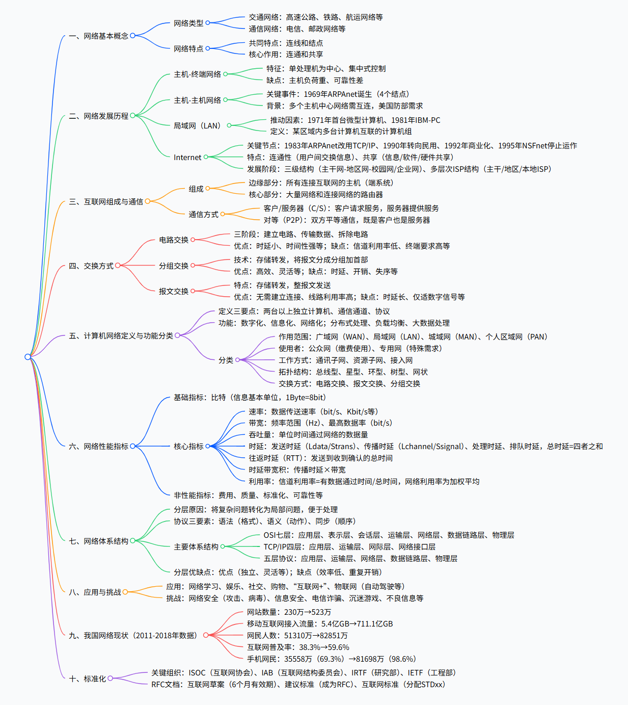
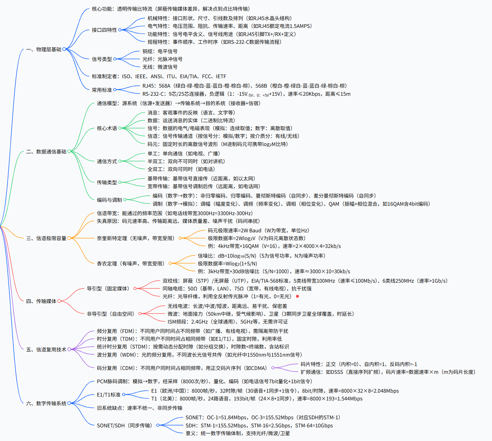
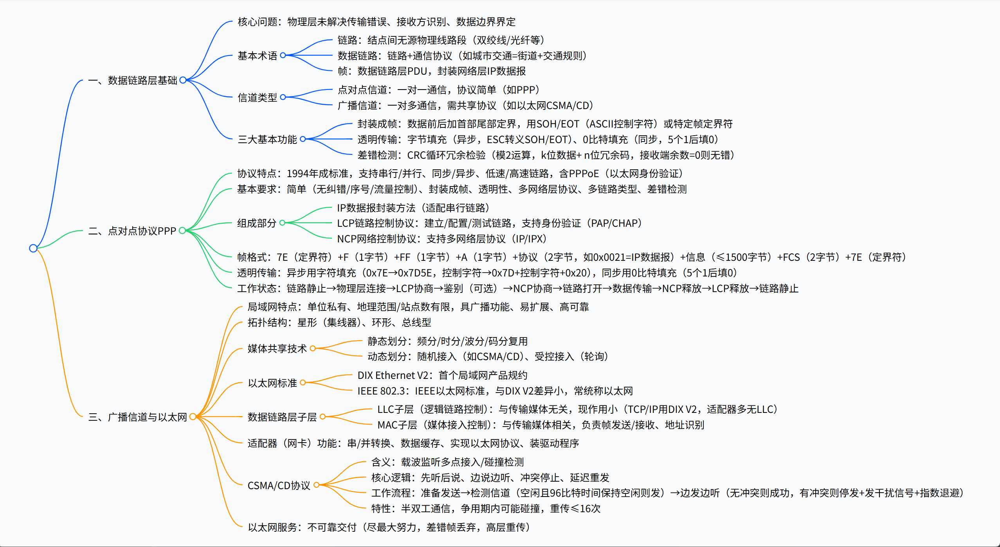
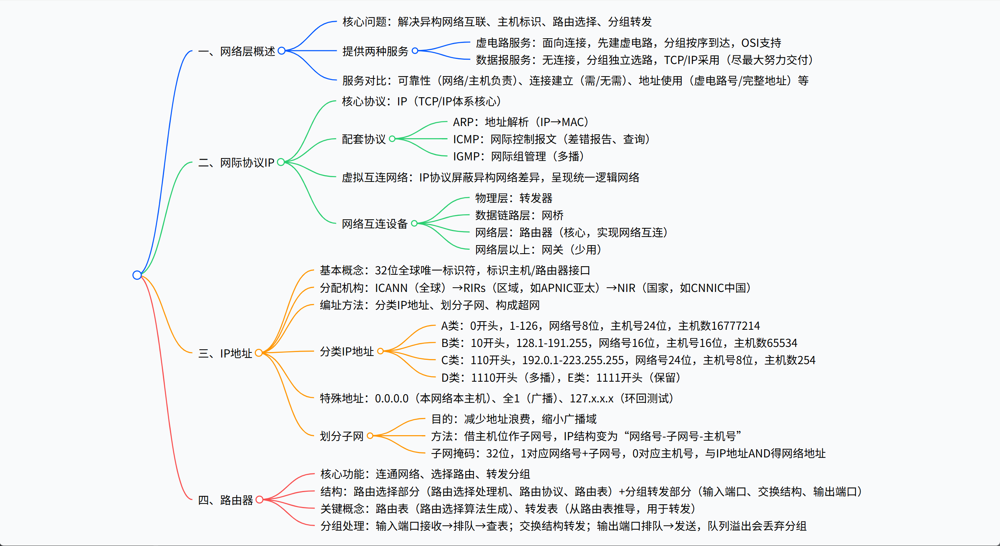
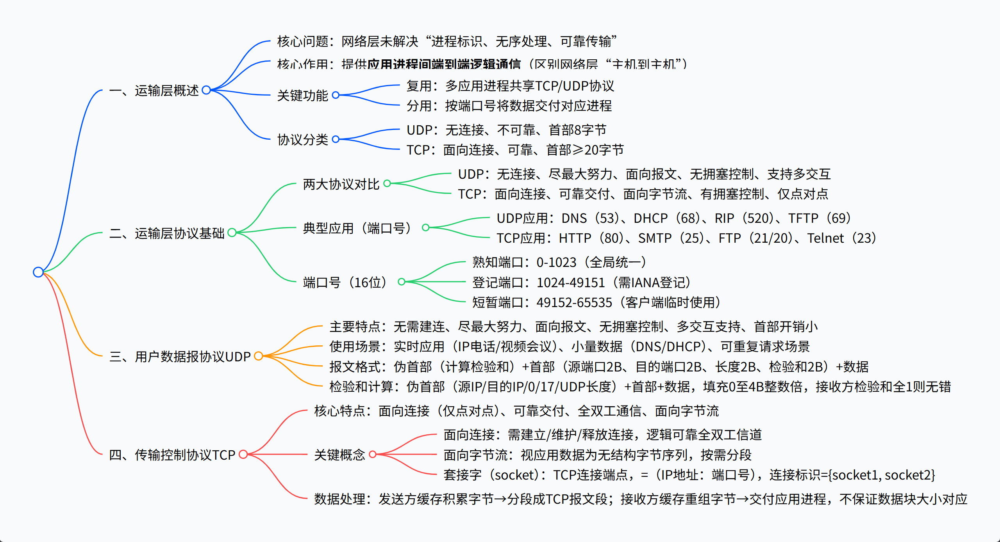
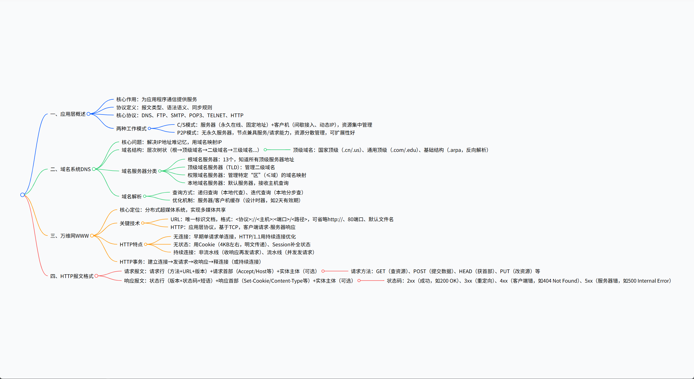

[TOC]

# 一、算机网络概述总结

## 1. 一段话总结

本文围绕计算机网络展开全面介绍，首先阐述了网络的基本概念（含**交通网络、通信网络**等类型，核心特点为**连线和结点、连通和共享**），接着梳理了网络发展历程（从**主机 - 终端网络**、**主机 - 主机网络**（1969 年 ARPAnet 诞生，4 个结点）到**局域网**（1971 年首台微型计算机诞生推动）、**Internet**（1983 年 ARPAnet 改用 TCP/IP 协议，1990 年转向民用，1992 年商业化）），还讲解了互联网组成（**边缘部分**由主机构成，**核心部分**由网络和路由器构成）、交换方式（**电路交换**“建立 - 传输 - 拆除” 三阶段、**分组交换**存储转发技术、**报文交换**）、计算机网络定义（需满足 “两台以上独立计算机、通信通道、协议” 三要点）、性能指标（**速率、带宽、吞吐量、时延**等）、体系结构（**OSI 七层、TCP/IP 四层、五层协议体系结构**）及相关应用与挑战（应用含网络学习、购物等，挑战有网络安全、电信诈骗等）。

------

## 2. 思维导图（mindmap）



## 


------

## 3. 详细总结

### 一、网络基本概念

1. 网络定义与类型
   - 广义网络涵盖交通网络（高速公路网络、铁路运输网络、航运网络等）和通信网络（电信网络、邮政网络等）。
   - 计算机网络是后续介绍的核心，需结合其发展历程逐步理解。
2. 网络核心特点
   - 共同特点：由**连线**和**结点**构成，是网络的基本物理组成要素。
   - 核心作用：实现**连通**（设备间建立连接）和**共享**（资源的交互使用），是网络的核心价值体现。

### 二、计算机网络发展历程

#### （1）主机 - 终端网络阶段

- **产生背景**：随计算机技术发展，早期以大型机、中型机、小型机为主，用户需通过终端共享主机资源。
- **结构特征**：以单处理机为中心的联机网络，采用**集中式控制**。
- **终端概念**：是主机的远程输入 / 输出设备（非自治系统），无计算能力，仅负责信息输入输出，运算处理由主机完成，个人计算机可通过终端仿真程序模拟终端工作。
- **存在缺点**：主机负荷重，所有终端的请求均由主机处理；可靠性差，主机故障会导致整个网络瘫痪。

#### （2）主机 - 主机网络阶段

- **发展需求**：多个以主机为中心的网络需互连（如 17 个防区，64kb/s 需求），网络从 “主机 - 终端” 转向 “主机 - 主机”，主机需同时负责数据处理和通信。
- **关键事件**：1969 年，美国国防部高级研究计划局（ARPA）建立**ARPAnet**，初始仅 4 个结点（斯坦福研究院、犹他大学、加州大学圣巴巴拉分校、加州大学洛杉矶分校）。
- **建立背景**：美国防部担心集中军事指挥中心被摧毁后指挥瘫痪，需设计分散指挥系统，各指挥点通过通信网联系。
- **结构变化**：引入通信控制处理机（CCP），实现主机间的间接连接与数据转发。

#### （3）局域网（LAN）阶段

- 推动因素
  - 1971 年，Intel 发布 4 位微处理器 Intel 4004，首台微型计算机诞生。
  - 1981 年，IBM 推出微型计算机 IBM-PC。
  - 80 年代后，微型计算机迅速发展，近距离设备间需通信和共享资源，催生局域网。
- **定义**：在某一区域内由多台计算机互联成的计算机组，如 1973 年出现的总线型以太网。
- **代表产品**：1976 年苹果相关产品、1984 年长城 0520。

#### （4）Internet 阶段

1. 关键发展节点

   - 70 年代：ARPA 设立项目解决不同局域网互联，采用 TCP/IP 协议，命名为 “Internet”。
   - 1974 年：网际互联协议（IP）和传输控制协议（TCP）问世，IP 是基本通信协议，TCP 保障 IP 可靠传输。
   - 1983 年：ARPAnet 从 NCP 协议切换为 TCP/IP 协议，分为军用 MILNET 和民用 ARPAnet 两部分。
   - 1988 年：美国国家科学基金组织（NSF）的 NSFnet 替代 ARPAnet 成为 Internet 主干网。
   - 1990 年：ARPAnet 解散，Internet 从军用转向民用。
   - 1992 年：IBM、MCI、MERIT 组建高级网络服务公司（ANS），建立 ANSnet，Internet 开始商业化运作。
   - 1995 年 4 月 30 日：NSFnet 停止运作，此时 Internet 骨干网覆盖 91 个国家，主机超 400 万台。

2. Internet 特点

   - **连通性**：上网用户间可交换数据、音频、视频，如同计算机直接连通，但具有虚拟性，无法确定对方身份和位置。
   - **共享性**：实现资源共享，包括信息共享、软件共享、硬件共享，资源使用便捷如在用户身边。

3. **“互连网” 与 “互联网” 区别（依据 RFC1208）**

   | 对比维度       | 互联网（Internet）       | 互连网（internet）                       |
   | -------------- | ------------------------ | ---------------------------------------- |
   | 相似之处       | 均为 “网络的网络”        | 均为 “网络的网络”                        |
   | 覆盖范围与性质 | 覆盖全球的、特定的互连网 | 泛指多个不同类型计算机网络互连而成的网络 |
   | 协议标准       | 仅使用 TCP/IP 协议       | 可使用 TCP/IP 外的其他协议               |
   | 名词属性       | 专用名词，首字母大写     | 通用名词，首字母小写                     |

4. 发展阶段

   - **三级结构**：由主干网、地区网、校园网 / 企业网构成，明确各层级功能与连接关系。
   - **多层次 ISP 结构**：出现互联网服务提供者（ISP），用户缴费后可获取 IP 地址使用权并接入互联网；ISP 分为主干 ISP、地区 ISP、本地 ISP；引入互联网交换中心（IXP），是不同电信运营商连通网络的集中交换平台，国内有北上广 IXP、上海 WeIX、北京 CNISP、CHN-IX 等。

5. 关键里程碑 ——WWW

   - 1989 年：蒂姆・伯纳斯 - 李开发出世界上第一个 Web 服务器和 Web 客户机，12 月正式命名为 World Wide Web（WWW）。
   - 1991 年 5 月：WWW 在 Internet 上首次露面；8 月 6 日，蒂姆开通世界第一个网站[http://info.cern.ch](http://info.cern.ch/)。
   - 浏览器发展：1993 年 NCSA 发布 Mosaic 浏览器（点燃因特网热潮）；1994 年 Marc 发布 Netscape Navigator；1995 年微软发布 Internet Explorer 1；1996 年爆发 Netscape 与 Microsoft 浏览器大战，推动浏览器技术迭代。

### 三、互联网组成与通信

#### （1）互联网组成

| 组成部分 | 构成要素                           | 核心功能                                                     |
| -------- | ---------------------------------- | ------------------------------------------------------------ |
| 边缘部分 | 所有连接在互联网上的主机（端系统） | 用户直接使用，进行通信（传送数据、音频、视频）和资源共享；端系统包括个人电脑、智能手机、大型计算机等，分属个人、单位或 ISP |
| 核心部分 | 大量网络和连接这些网络的路由器     | 为边缘部分提供服务，实现连通性和数据交换；路由器是分组交换的关键构件，负责转发分组 |

#### （2）端系统通信

- **通信本质**：并非 “主机 A 与主机 B 通信”，而是 “主机 A 上的某个进程与主机 B 上的另一个进程通信”，类似 “家庭邮件往来是家庭成员间的通信”。
- 通信方式
  1. 客户 / 服务器（C/S）方式
     - 角色定义：客户是服务请求方，服务器是服务提供方，均指通信中的应用进程。
     - 客户软件特点：被用户调用后运行，主动发起通信，需知道服务器地址；无需特殊硬件和复杂操作系统。
     - 服务器软件特点：专门提供服务，启动后持续运行，被动接受请求，无需知道客户地址；需强大硬件和高级操作系统（如 IIS、Apache、UNIX、Windows Server）。
     - 通信关系：建立连接后，双方可双向发送和接收数据。
  2. 对等（P2P）方式
     - 核心特点：两通信主机无服务请求方与提供方之分，运行 P2P 软件即可平等通信。
     - 本质：仍基于 C/S 方式，每台主机既是客户也是服务器。
     - 优势：可支持上百万对等用户同时工作。

### 四、交换方式

#### （1）电路交换

1. 发展背景
   - 早期电话直接连接需 N (N-1)/2 对电线，成本高；1878 年人工电话交换机出现，需手工接线拆线，容量小、效率低；1891 年史端乔发明步进制电话交换机，实现自动交换。
2. **核心概念**：“交换” 即动态分配传输线路资源，电路交换是电话交换的主要方式，**面向连接**。
3. **主要特点**：发送数据前需建立临时专用物理通路，通路由交换设备和链路逐段连接；建立通路时间长，数据传送延迟短。
4. 三阶段流程
   - 建立电路：建立专用物理通路，保障通信资源不被占用。
   - 传输数据：通信双方可互相传输数据（如通话）。
   - 拆除电路：通信结束后释放专用物理通路及占用资源。
5. **优缺点对比**

| 类别 | 具体描述                                                     |
| ---- | ------------------------------------------------------------ |
| 优点 | 时延小（数据直达，无中间存储转发）；时间性强（通路建立后可随时通信，实时性好）；无失序（按发送顺序传输）；使用面广（适用于模拟信号和数字信号）；控制简单（交换设备及控制逻辑简单） |
| 缺点 | 信道利用率低（通路独占，空闲时也无法供其他用户使用，不适合计算机突发性通信）；终端要求高（数据直达，不同类型、规格、速率终端难通信） |

#### （2）分组交换

1. **技术原理**：采用**存储转发技术**，发送端将长报文分成短的固定长度数据段，每个数据段加首部构成分组（packet），类似邮局拆分超规包裹并贴地址标签。

2. 关键环节

   - **分组发送**：原始报文拆分后，每个分组前添加首部（含地址等控制信息），便于路由转发。
   - **分组首部**：含目的地址和源地址，结点交换机根据首部地址将分组转发到下一个交换机，每个分组可独立选择传输路径。
   - **分组接收**：接收端收到分组后剥去首部，还原成原始报文（假设无差错、无丢弃）。

3. 路由器功能

   - 结构特点：输入和输出端口无直接连线，需通过缓存和转发表实现分组转发。
   - 处理流程：接收分组→放入缓存→查找转发表确定转发端口→将分组送至对应端口转发。
   - 转发示例：主机 H1 发送分组到 H6，路径由路由器协同计算，分组可能经不同路径传输，路由器负责存储转发，最终交付目的主机。

4. **优缺点对比**
   | 类别 | 具体描述 |
   | --- | --- |
   | 优点 | 高效（动态分配带宽，逐段占用通信链路）；灵活（为每个分组独立选择最优路由）；迅速（无需先建立连接即可发送分组）；可靠（分布式多路由，网络生存性好） |
   | 缺点 | 时延（分组在结点存储转发时需排队）；开销（分组首部占用额外数据量）；失序（采用数据报服务时可能出现分组失序、丢失或重复）

#### （3）报文交换

- **技术背景**：20 世纪 40 年代电报通信采用，基于**存储转发原理**，结点接收整个报文后，一次发送完毕（一次一跳）。

- **优缺点对比**
  | 类别 | 具体描述 |
  | --- | --- |
  | 优点 | 无需建立连接，用户可随时发送报文；通信线路利用率高，不同时间分段占用线路 |
  | 缺点 | 时延较长，实时性差，不适合对时延敏感的场景；仅适用于数字信号；报文长度无限制，要求中间转发结点具备较大存储空间 |

#### （4）三种交换方式对比

1. **适用场景差异**：若连续传送大量数据且传送时间远大于连接建立时间，**电路交换**传输速率较快；**报文交换**和**分组交换**无需预先分配带宽，更适合传送突发数据，能提高信道利用率。
2. **效率与灵活性**：分组长度远小于报文长度，因此**分组交换**比**报文交换**时延更小、灵活性更高，更适应计算机网络的突发性数据传输需求。
3. **关键人物**：分组交换理论与技术主要创始人是雷纳德・克兰罗克博士（L.Kleinrock）；1964 年美国兰德公司科学家保罗・巴兰（P.Baran）提出存储转发概念；1966 年英国学者唐纳德・戴维斯（D.Davies）提出分组概念。

### 五、计算机网络的定义、功能与分类

#### （1）定义与核心要点

1. **定义**：利用通信设备和线路将地理位置不同、功能独立的多个计算机系统连接起来，在功能完善的网络软件和协议管理下，实现网络端系统硬件、软件资源共享和信息传递的系统，由结点（node）和链路（link）组成，简单来说即连接两台或多台计算机进行通信、实现资源共享的系统。
2. 三个核心要点
   - 硬件基础：必须有两台或两台以上具有独立功能的计算机自治系统（自治自理，自主决定何时发送数据），目的是实现资源共享。
   - 通信通道：需存在有形或无形的通道，保障计算机之间的信息交换。
   - 协议规则：必须遵守约定或规则才能实现有效信息交换，且网络连接的端系统不限于计算机，还包括各类智能设备。

#### （2）核心功能

- 基础支撑功能：实现**数字化**（将世界信息存储到计算机）、**信息化**（利用数字化信息提升生活、工作、学习效率）、**网络化**（实现数字化与信息化的共享）。
- 进阶处理功能：支持**分布式处理**（同一任务由多台计算机共同完成部分工作）、**负载均衡**（同一任务由多台计算机轮流或同时完成，避免单台设备过载）、**大数据处理**（无需抽样，直接分析所有数据），还可拓展至协同工作、区块链等场景。

#### （3）分类方式

| 分类维度 | 具体类别及描述                                               |
| -------- | ------------------------------------------------------------ |
| 作用范围 | - 广域网（WAN）：覆盖范围几十到几千公里 - 局域网（LAN）：覆盖范围 5-50 公里 - 城域网（MAN）：覆盖城市级区域 - 个人区域网（PAN）：围绕个人设备的小范围网络 |
| 使用者   | - 公众网：用户缴费即可使用，面向大众 - 专用网：满足特殊需求，仅限特定群体使用（如企业内网、军事网络） |
| 工作方式 | - 通讯子网：负责数据传输、交换和通信控制 - 资源子网：提供硬件、软件资源和数据存储服务 - 接入网：用于将用户接入互联网络，是用户与互联网的桥梁 |
| 拓扑结构 | - 总线型：所有设备连接到一条主干总线 - 星型：以中央结点为中心，其他设备均连接至中央结点 - 环型：设备依次连接形成闭合环路 - 树型：层级化结构，类似树形分支 - 网状：任意两个结点间可能存在多条连接，可靠性高 |
| 交换方式 | - 电路交换：基于专用物理通路，如传统电话网络 - 报文交换：基于存储转发，整报文传输 - 分组交换：基于存储转发，拆分报文为分组传输，如互联网主流方式 |

#### （4）局域网与广域网的关键区别

- 结构与传输：局域网可采用广播方式传输，广域网无法广播；局域网通常由单一拥有者管理（同构网络），广域网由多个拥有者的网络构成（一般需两台以上路由器相连）。
- 距离误区：不能简单以距离区分，需看技术标准 —— 采用局域网技术的网络即为局域网（如邻居间通过 WiFi 或网线直接连接），采用广域网技术的网络即为广域网（如邻居间通过不同 ISP 连接通信，虽距离近但属广域网）。

### 六、计算机网络性能指标

#### （1）基础度量单位 —— 比特（bit）

- 起源：1948 年香农在《通信的数学理论》中首次提出 “比特”，成为信息的基本单位，回答一个 “是 / 否” 问题需 1 比特信息。
- 定义：计算机中数据量的基本单位，来源于 “binary digit”，表示二进制数字中的 1 或 0，1 字节（Byte）=8 比特（bit）。

#### （2）核心性能指标

| 指标名称        | 定义与计算                                                   | 关键说明                                                     |
| --------------- | ------------------------------------------------------------ | ------------------------------------------------------------ |
| 速率（比特率）  | 数据传送速率，单位为 bit/s、Kbit/s、Mbit/s、Gbit/s 等，公式示例：4×10¹⁰ bit/s = 40 Gbit/s（按 10³ 进制换算） | 通常指额定速率或标称速率，非实际运行速率；需与存储容量单位区分（存储容量按 2¹⁰进制换算，如 1KB=1024Byte） |
| 带宽            | - 频域含义：信号的频率成分范围，单位为赫（Hz）、千赫（KHz）等，如电话信道带宽为 3100Hz（3400Hz-300Hz） - 时域含义：单位时间内信道能通过的最高数据率，单位为 bit/s，如 100Mbps 接入网络表示最高注入速率为 100Mbps | 两种含义本质相同，频域带宽越宽，时域最高数据率越高；“带宽” 是衡量网络传输能力的核心指标 |
| 吞吐量          | 单位时间内通过某个网络、信道或接口的实际数据量               | 受网络带宽或额定速率限制，用于衡量网络实际传输效率，类似 “港口吞吐量”（单位时间内装卸货物总量） |
| 时延            | 数据从网络一端传送到另一端的时间，总时延 = 发送时延 + 传播时延 + 处理时延 + 排队时延 | - 发送时延（传输时延）：数据帧进入传输媒体的时间，公式：Dtrans = Ldata / Strans（Ldata 为数据长度，Strans 为发送速率） - 传播时延：电磁波在信道中传播的时间，公式：Dprop = Lchannel / Ssignal（Lchannel 为信道长度，Ssignal 为信号传播速率，铜缆中约 200m/μs） - 处理时延：主机或路由器分析分组、提取数据、差错检验、查找路由的时间 - 排队时延：分组在路由器输入输出队列中等待的时间，取决于网络通信量 |
| 时延带宽积      | 链路中可容纳的比特数，公式：时延带宽积 = 传播时延 × 带宽     | 表示链路的 “比特长度”，只有当链路 “充满” 比特时，资源才被充分利用 |
| 往返时延（RTT） | 从发送方发送数据开始，到发送方收到接收方确认的总时间         | 包含往返传播时延、中间结点处理时延、排队时延及转发数据的发送时延，是衡量双向交互效率的关键指标 |
| 利用率          | - 信道利用率：信道有数据通过的时间占总时间的比例 - 网络利用率：所有信道利用率的加权平均 | 公式：D = D₀ / (1 - U)（D 为当前时延，D₀为空闲时延，U 为利用率）；信道利用率并非越高越好，利用率增大时，时延会迅速增加 |

#### （3）非性能指标

包括费用（建设与使用成本）、质量（传输稳定性、差错率）、标准化（是否符合通用标准）、可靠性（抗故障能力）、可扩展性和可升级性（适应规模增长与技术迭代）、易于管理和维护（运维便捷性）等，是评估网络综合价值的重要补充。

### 七、计算机网络体系结构

#### （1）分层的必要性与核心逻辑

- 必要性：计算机网络是复杂系统，相互通信的两台计算机需高度协调，“分层” 可将庞大复杂问题转化为若干小局部问题，降低研究与处理难度。
- 分层逻辑：按功能抽象分层，明确两层核心：一是**层间接口**（定义上层如何调用下层服务、下层提供何种服务）；二是**对等层协议**（对等层间通信需遵循的规则）。

#### （2）协议的概念与三要素

1. **协议定义**：为进行网络中的数据交换而建立的规则、标准或约定，是计算机网络不可缺少的组成部分，类似 “人类社会的法律法规”“教学活动的秩序”。
2. 三要素
   - **语法**：数据与控制信息的结构或格式，解决 “交换信息的格式” 问题，如课堂中教师与学生按中文语法交流。
   - **语义**：需要发出的控制信息、完成的动作及响应，解决 “做什么” 的问题，如交流信息中各字段的具体含义。
   - **同步**：事件实现顺序的详细说明，解决 “先做什么、后做什么” 的问题，如课堂中 “教师讲 - 学生听”“教师问 - 学生答” 的时序。
3. **协议形式**：包括文字描述（便于人理解）和程序代码（便于计算机执行），两种形式需精确解释信息交换过程。

#### （3）分层的原则与优缺点

1. **分层原则**

   | 原则名称 | 具体要求                                                     |
   | -------- | ------------------------------------------------------------ |
   | 层次适度 | 层次过少则单层次功能过多，实现困难；层次过多则功能冗余，开销增大 |
   | 功能确定 | 每个层次有明确分工，且有确定方式完成自身工作                 |
   | 层次独立 | 各层次工作互不影响，层次功能或实现方式变化不波及其他层次     |
   | 层次关联 | 相邻层次间存在工作联系，通过接口实现交互                     |
   | 层次分合 | 可根据实际需求合并、分解或取消层次                           |
   | 层次对等 | 通信双方需有完成相同功能的对等层次                           |
   | 层次协议 | 对等层次需遵守共同的规约（协议）                             |
   | 层次接口 | 相邻层次通过接口交互信息，明确交互规则                       |

2. **分层优缺点**

| 类别 | 具体描述                                                     |
| ---- | ------------------------------------------------------------ |
| 优点 | 各层独立，便于分层优化；灵活性好，可替换某层实现而不影响其他层；结构可分割，便于团队协作开发；易于实现和维护，问题定位更精准；能促进标准化工作，统一接口与协议 |
| 缺点 | 层间交互会降低整体效率；部分功能可能在不同层次重复出现，产生额外开销 |

#### （4）各层核心功能

- **差错控制**：通过校验、重传等机制，确保对等层通信的可靠性。
- **流量控制**：调节发送端速率，避免接收端因处理能力不足导致数据丢失。
- **分段和重装**：发送端将大数据块拆分为小单位（适配下层传输能力），接收端还原为原始数据块。
- **复用和分用**：发送端多个高层会话共享一条低层连接，接收端将低层数据分配到对应高层会话。
- **连接建立和释放**：数据交换前建立逻辑连接，保障通信稳定性；交换结束后释放连接，回收资源。

#### （5）主流体系结构对比

1. **OSI 七层协议体系结构（国际标准）**
   - 层次划分：应用层（7）、表示层（6）、会话层（5）、运输层（4）、网络层（3）、数据链路层（2）、物理层（1）。
   - 现状：概念清晰、理论完整，但复杂且不实用，存在技术缺陷、策略官僚、时机滞后、实现笨重等问题，未广泛推广。
2. **TCP/IP 四层协议体系结构（事实标准）**
   - 层次划分：应用层（如 DNS、HTTP、SMTP）、运输层（TCP 或 UDP）、网际层（IP、ICMP、IGMP、ARP）、网络接口层（设备驱动程序及接口卡，无具体内容）。
   - 发展历程：1974 年 TCP/IP 协议产生并公开；1980 年网间开始采用；1983 年 ARPAnet 接受并采用，1983 年被视为 Internet 诞生时间；创始人包括罗伯特・卡恩（前美国总统科技顾问）和温顿・瑟夫（谷歌全球副总裁）。
3. **五层协议体系结构（折中方案）**
   - 产生背景：综合 OSI 和 TCP/IP 优点，弥补 TCP/IP 网络接口层无具体内容的缺陷。
   - 层次划分：应用层（5）、运输层（4）、网络层（3）、数据链路层（2）、物理层（1），是教学与实践中常用的简化模型。

#### （6）体系结构关键概念

- **体系结构定义**：计算机网络的各层及其协议的集合，是 “功能的精确定义”（抽象），与 “实现”（具体硬件 / 软件）区分，实现需遵循体系结构。
- **协议数据单元（PDU）**：OSI 参考模型中，对等层次间传送的数据单位，物理传输媒体视为第 0 层。
- **实体**：任何可发送或接收信息的硬件或软件进程，协议控制对等实体通信（水平方向），实体通过下层服务向上层提供功能（垂直方向，单向）。
- **服务原语**：上层实体向下层请求服务时的交互信息，包括 “请求（Request）、指示（Indication）、响应（Response）、确认（Confirm）” 四类，如打电话时 “拨号（请求）- 电话响（指示）- 摘机（响应）- 接通（确认）”。
- **服务访问点（SAP）**：同一系统相邻两层实体的交互接口（逻辑接口，下层服务入口），明确上层调用下层服务的 “服务名称、参数” 等规则。
- **服务数据单元（SDU）**：层间交换的数据单位，若下层带宽不足，SDU 可分段（发送端拆分、接收端重装）；若 SDU 过短，可拼接（发送端合并多个 SDU 为一个 PDU，接收端分离），以提高通道利用率。

#### （7）TCP/IP 协议栈特点

- **灵活性**：部分应用程序可直接使用 IP 层或网络接口层，如 ping 应用程序、OSPF 路由选择协议越过运输层使用网络层。
- **沙漏结构**：中间的 IP 层是核心，上层（应用层）协议多样（HTTP、SMTP、DNS、FTP 等），下层（网络接口层）支持多种网络接口，形成 “上宽下宽、中间窄” 的沙漏形状，保障不同网络与应用的兼容性。

### 八、互联网应用与挑战

#### （1）核心应用场景

- 日常服务：网络学习、网络娱乐（听音乐、看视频）、社交活动（微信、QQ）、信息搜索与资料查询、收发电子邮件、网络办公、网络订餐、网络购物、网络订票 / 订酒店、网上银行、股票交易、网络阅读等。
- 产业融合：“互联网 +” 模式，即 “互联网 + 各个传统行业”，利用信息通信技术和互联网平台，实现互联网与传统行业深度融合，提升实体经济创新力和生产力。
- 新兴领域：物联网，将可感知设备、可独立寻址物体互联的网络（接入设备需可寻址以具备唯一身份），应用于自动驾驶、智慧安防、智能家居等场景。

#### （2）主要挑战

- **网络与信息安全**：网络攻击、网络病毒威胁设备与数据安全；窃取机密信息危害个人或国家安全。
- **社会安全风险**：电信诈骗骗取钱财，危害社会稳定；散布流言蜚语、黄色暴力等不良信息，蛊惑人心、危害身心健康。
- **社会与个人问题**：网络游戏易导致沉迷，影响学习与工作；过度依赖网络社交，导致现实中缺乏沟通、人际关系疏远。

### 九、我国互联网发展现状（2011-2018 年数据，来源：中国互联网信息中心）

| 指标名称           | 2011 年                    | 2018 年                    | 变化趋势                             |
| ------------------ | -------------------------- | -------------------------- | ------------------------------------ |
| 网站数量           | 230 万个                   | 523 万个                   | 数量翻倍，网络基础设施持续完善       |
| 移动互联网接入流量 | 5.4 亿 GB                  | 711.1 亿 GB                | 流量激增，移动互联网应用普及         |
| 网民人数           | 51310 万人                 | 82851 万人                 | 网民规模大幅增长，网络渗透范围扩大   |
| 互联网普及率       | 38.3%                      | 59.6%                      | 普及率提升超 20 个百分点，接近 60%   |
| 手机网民           | 35558 万人（占网民 69.3%） | 81698 万人（占网民 98.6%） | 手机成为主流上网设备，移动化趋势显著 |

### 十、互联网标准化

#### （1）标准化的重要性

- 开放性与标准化是互联网成功的关键因素：**开放性**指任何人可参与标准制定、下载标准，符合标准的设备均可接入；**标准化**保障不同厂商、不同类型的网络设备能互联互通，避免因技术壁垒导致的 “孤岛效应”，为互联网的全球化发展奠定基础。

#### （2）核心标准化组织

| 组织名称           | 英文全称                                    | 核心职能                                                     |
| ------------------ | ------------------------------------------- | ------------------------------------------------------------ |
| 互联网协会         | ISOC（Internet Society）                    | 统筹互联网标准化相关工作，推动全球互联网技术与应用的标准化发展 |
| 互联网结构委员会   | IAB（Internet Architecture Board）          | 负责互联网体系结构的规划与指导，协调各标准化部门工作         |
| 互联网研究部       | IRTF（Internet Research Task Force）        | 由研究所组成，专注于长期考虑的互联网理论问题研究，为标准化提供技术支撑 |
| 互联网研究指导小组 | IRSG（Internet Research Steering Group）    | 指导 IRTF 的研究方向，把控长期研究项目的进展与质量           |
| 互联网工程部       | IETF（Internet Engineering Task Force）     | 聚焦短期和中期的互联网工程问题，制定具体的协议标准与技术规范 |
| 互联网工程指导小组 | IESG（Internet Engineering Steering Group） | 指导 IETF 的工程工作，审核协议标准的合理性与可行性           |

#### （3）标准文档（RFC）的发展阶段

- **互联网草案（Internet Draft）**：有效期仅 6 个月，此阶段尚未成为正式 RFC 文档，主要用于技术方案的初步讨论与修订。
- **建议标准（Proposed Standard）**：从该阶段开始成为 RFC 文档，技术方案已较为成熟，进入广泛征求意见与试用阶段。
- **互联网标准（Internet Standard）**：达到正式标准后，每个标准会分配唯一编号（STDxx），成为全球互联网必须遵循的技术规范。
- **简化后阶段**：当前互联网标准制定流程简化为 “建议标准” 和 “互联网标准” 两个核心阶段，减少冗余环节，提高标准化效率。
- **RFC 其他类型**：包括实验性 RFC（用于技术验证）、提供信息的 RFC（含互联网相关的一般、历史、指导信息）、历史 RFC（已被替代或废弃的标准文档）。

### 十一、网络传输工作原理的通俗类比

为帮助理解网络协议的分层逻辑，文档用 “语言翻译” 进行通俗类比：

- 场景：甲乙两人分别只会中文和法文，需通过多层 “翻译协议” 实现交流 —— 第一层为 “中文 - 英文翻译协议”（将 “大家好” 译为 “Hello everyone”），第二层为 “英语主单词分解协议”（将 “Hello everyone” 拆分为 “Hello”“every”“one”），第三层为 “字母传输协议”（逐字母传输拆分后的内容），接收方则按反向协议逐层还原信息。
- 类比意义：不同层次的 “翻译协议” 对应计算机网络中的分层协议，每一层仅负责特定 “翻译” 或 “处理” 任务，通过层间协作实现最终的信息传输，体现了分层体系结构 “分工明确、独立协作” 的核心思想。

### 十二、核心总结与关键人物

#### （1）核心总结

1. **网络发展主线**：从 “集中式”（主机 - 终端网络）到 “分布式”（主机 - 主机网络、局域网、Internet），从 “单一网络” 到 “网络的网络”，核心驱动力是 “资源共享需求” 与 “技术迭代（如微型计算机、TCP/IP 协议、WWW）”。
2. **核心技术逻辑**：互联网由 “边缘部分（主机）” 和 “核心部分（路由器 + 网络）” 构成，通过 “分组交换” 实现高效数据传输，遵循 “分层协议体系结构” 保障互联互通，以 “标准化” 推动全球化发展。
3. **价值与挑战**：互联网已成为现代社会核心基础设施，实现了信息、资源的高效共享与全球交互，但同时面临网络安全、信息泄露、社会依赖等挑战，需通过技术优化与规范管理平衡发展与风险。

#### （2）关键人物

- **蒂姆・伯纳斯 - 李（Tim Berners-Lee）**：“万维网（WWW）之父”，1989 年开发出世界第一个 Web 服务器和 Web 客户机，1991 年开通世界第一个网站（[http://info.cern.ch](http://info.cern.ch/)），推动互联网从技术领域走向大众应用。
- **雷纳德・克兰罗克（L.Kleinrock）**：分组交换理论与技术的主要创始人，为分组交换技术的发展奠定理论基础。
- **保罗・巴兰（P.Baran）**：1964 年提出 “存储转发” 概念，为分组交换和分布式网络的设计提供核心思路。
- **唐纳德・戴维斯（D.Davies）**：1966 年提出 “分组” 概念，明确了分组交换中 “数据拆分 - 独立传输 - 重组” 的核心流程。
- **罗伯特・卡恩（Robert Kahn）与温顿・瑟夫（Vint Cerf）**：TCP/IP 协议的联合创始人，1974 年提出 TCP/IP 协议框架，1983 年推动 ARPAnet 采用该协议，为 Internet 的诞生与发展提供关键技术支撑。
- **克劳德・香农（Claude Elwood Shannon）**：信息论创始人，1948 年在《通信的数学理论》中提出 “比特（bit）” 概念，确立信息的基本度量单位，为计算机网络的信息传输与处理提供理论基础。


### 十二、核心总结与关键人物（基于《第 1 章 计算机网络概述.pdf》补充细节）

#### （2）关键人物补充背景

- **蒂姆・伯纳斯 - 李（Tim Berners-Lee）**：其开发 WWW 的初衷是为解决欧洲各国核物理学家的协作问题 —— 让分布在各国物理实验室、研究所的最新信息、数据、图像资料可共享，最终推动 WWW 在 1991 年 5 月于 Internet 首次露面，彻底改变了互联网的应用形态，使非网络专业人员也能便捷使用网络。
- **罗伯特・卡恩（Robert Kahn）与温顿・瑟夫（Vint Cerf）**：除联合创立 TCP/IP 协议外，罗伯特・卡恩曾担任前美国总统科技顾问并执行 IETF 秘书处职能，温顿・瑟夫后期任职谷歌全球副总裁，二人持续推动 TCP/IP 协议的优化与推广，1983 年 ARPAnet 从 NCP 协议切换为 TCP/IP 协议的 “协议转换” 事件，被视为 Internet 正式诞生的标志之一。
- **克劳德・香农（Claude Elwood Shannon）**：作为美国数学家，其 1948 年的《通信的数学理论》不仅提出 “比特” 概念，更建立了通信系统的数学模型，为计算机网络中信息的编码、传输、解码提供了底层理论支撑，被称为 “信息论之父”。

### 十三、文档中关键技术概念的补充说明（基于文档原文细节）

#### （1）终端与主机的关系

- 文档明确终端 “不是一个自治系统”，在早期 IBM 大型计算机等主机昂贵的背景下，一台主机通常配置多个终端，终端仅承担 “信息输入输出” 功能，所有运算和处理均由主机完成，类似 “工厂中的生产线（主机）与操作台（终端）”，操作台仅负责物料投放与成品取出，核心加工过程由生产线完成。
- 现代场景中，个人计算机可通过 “终端仿真程序” 模拟传统终端工作，如 Windows 系统中的`C:\Windows\system32\cmd.exe`命令行窗口、Linux 系统中的终端模拟程序（如文档中展示的`nic@nic-virtual-machine`终端界面），均是对早期终端功能的模拟。

#### （2）ARPAnet 的结点与演进

- 1969 年 ARPAnet 初始的 4 个结点分别为：斯坦福研究院（SRI）、犹他大学（University of Utah）、加州大学圣巴巴拉分校、加州大学洛杉矶分校，这 4 个结点通过通信线路连接，形成最早的分布式军事指挥通信网络雏形，后续逐步扩展并推动了 “主机 - 主机” 网络形态的成熟。
- 1983 年 ARPAnet 拆分后，军用部分（MILNET）专注于军事指挥通信，民用部分（仍称 ARPAnet）则向科研机构开放，为后续 Internet 的民用化奠定基础；1988 年 NSFnet 替代 ARPAnet 成为主干网后，进一步扩大了 Internet 的覆盖范围与服务能力。

#### （3）局域网的技术背景与代表事件

- 文档强调局域网的产生直接源于微型计算机的发展：1971 年 Intel 4004 微处理器与首台微型计算机的诞生，打破了早期大型机垄断的格局；1981 年 IBM-PC 的推出使微型计算机进入商业化阶段，大量微型计算机在企业、校园等局部区域集中使用，催生了 “近距离通信与资源共享” 的需求，最终推动局域网技术的研发与应用。
- 文档提及的 “总线型以太网” 诞生于 1973 年，是早期局域网的典型技术形态，采用 “一条主干总线连接所有设备” 的拓扑结构，为后续以太网技术的发展奠定基础；同时列举了 1976 年苹果相关产品、1984 年长城 0520 等微型计算机代表，印证了微型计算机普及与局域网发展的同步性。

#### （4）路由器的工作细节

- 文档明确路由器 “输入和输出端口之间没有直接连线”，其处理分组的核心流程为 “接收 - 缓存 - 查表 - 转发”：首先将收到的分组放入缓存（临时存储，避免数据丢失），然后查找内部的 “转发表”（记录目的地址与转发端口的对应关系），最后将分组发送到对应的输出端口，实现数据的 “存储转发”。
- 以 “主机 H1 向主机 H6 发送分组” 为例，分组的传输路径由多台路由器协同计算确定，不同分组可能选择不同路径（如部分分组经路由器 A - 路由器 B - 路由器 C，另一部分经路由器 A - 路由器 D - 路由器 C），这种分布式路径选择机制保障了网络的可靠性 —— 即使某条路径故障，分组仍可通过其他路径到达目的地。

### 十四、文档中关键数据与案例的梳理（基于原文精确信息）

#### （1）Internet 发展关键时间节点数据

| 时间               | 关键事件                                                 |
| ------------------ | -------------------------------------------------------- |
| 1969 年            | ARPAnet 诞生，初始 4 个结点                              |
| 1974 年            | TCP/IP 协议问世                                          |
| 1983 年            | ARPAnet 从 NCP 切换为 TCP/IP，拆分 MILNET 与民用 ARPAnet |
| 1988 年            | NSFnet 替代 ARPAnet 成为 Internet 主干网                 |
| 1990 年            | ARPAnet 解散，Internet 转向民用                          |
| 1992 年            | ANS 公司建立 ANSnet，Internet 商业化                     |
| 1995 年 4 月 30 日 | NSFnet 停止运作，Internet 覆盖 91 国、主机超 400 万台    |

#### （2）我国互联网发展核心数据（2011-2018 年）

| 指标               | 2011 年数据                                                  | 2018 年数据                                                  |
| ------------------ | ------------------------------------------------------------ | ------------------------------------------------------------ |
| 网站数量           | 230 万个                                                     | 523 万个                                                     |
| 移动互联网接入流量 | 5.4 亿 GB                                                    | 711.1 亿 GB                                                  |
| 网民人数           | 51310 万人                                                   | 82851 万人                                                   |
| 互联网普及率       | 38.3%                                                        | 59.6%                                                        |
| 手机网民           | 35558 万人（占比 69.3%）                                     | 81698 万人（占比 98.6%）                                     |
| 数据来源           | 中国互联网信息中心（[http://www.cnnic](http://www.cnnic/).） | 中国互联网信息中心（[http://www.cnnic](http://www.cnnic/).） |

#### （3）浏览器发展关键案例

- **Mosaic 浏览器**：1993 年由美国伊利诺州伊利诺大学国家超级计算机应用中心（NCSA）发布，支持 X Window System、Microsoft Windows、Macintosh 等多平台，因操作便捷、支持图文混排而 “人气爆发”，被文档称为 “点燃因特网热潮的火种之一”，其出现使互联网从 “文字界面” 向 “图形界面” 迈进，降低了用户使用门槛。
- **网景浏览器（Netscape Navigator）**：由 Mosaic 浏览器演变而来，1994 年由 Marc 发布，初期占据主流浏览器市场，曾尝试开发 “通过浏览器操作的网络应用系统”，试图挑战传统操作系统与应用程序市场，引发后续 “浏览器大战”。
- **IE 浏览器（Internet Explorer）**：1995 年微软向望远镜娱乐公司（Spyglass Entertainment）购买 Mosaic 授权后开发，凭借与 Windows 操作系统的捆绑优势快速崛起，与网景浏览器展开激烈竞争，最终改变了浏览器市场格局，这一竞争过程被文档定义为 “浏览器大战”，推动了浏览器技术的快速迭代。

### 十五、文档核心逻辑脉络梳理（基于原文结构）

《第 1 章 计算机网络概述.pdf》以 “从基础到进阶、从技术到应用” 为核心逻辑，按以下脉络展开：

1. **概念导入**：先定义 “网络” 的广义范畴（交通、通信网络），明确其 “连线 + 结点” 的共同特点与 “连通 + 共享” 的核心作用，再聚焦 “计算机网络”，通过 “主机 - 终端”“主机 - 主机”“局域网”“Internet” 的演进历程，逐步缩小范围，让读者建立对计算机网络的基础认知。
2. **技术拆解**：从 “互联网组成”（边缘部分 + 核心部分）切入，深入讲解 “交换方式”（电路、分组、报文交换的对比）、“通信方式”（C/S 与 P2P），再到 “计算机网络的定义、功能、分类”，层层递进解析技术细节，同时通过 “终端与主机”“路由器工作流程” 等案例，将抽象技术具象化。
3. **性能与架构**：先介绍 “速率、带宽、时延” 等性能指标，建立 “如何衡量网络好坏” 的评价体系；再讲解 “分层体系结构”（OSI 七层、TCP/IP 四层、五层协议），回答 “网络如何实现互联互通” 的核心问题，同时引入 “协议三要素”“服务原语”“SAP/SDU/PDU” 等关键概念，完善技术理论框架。
4. **应用与落地**：最后通过 “互联网应用场景”（日常服务、互联网 +、物联网）、“我国发展现状”“标准化工作” 等内容，将技术与实际应用结合，同时指出 “网络安全、电信诈骗” 等挑战，形成 “技术 - 应用 - 挑战 - 规范” 的完整闭环，让读者不仅理解 “是什么、怎么做”，更能思考 “有什么用、如何应对风险”。


# 二、 物理层总结

## 1. 一段话总结

第 2 章物理层围绕 “**比特传输的底层实现**” 展开，核心讲解物理层的**四大接口特性**（机械、电气、功能、规程）与 “透明传输比特流” 的核心功能，介绍了**RJ45、RS-232-C**等常用物理层标准；同时涵盖数据通信基础，包括**单工 / 半双工 / 全双工**三种通信方式、**基带 / 宽带传输**差异、**曼彻斯特编码**等编码方式、**调幅 / 调频 / 调相 / QAM**等调制技术及**码元**概念；还深入分析信道极限容量（**奈奎斯特定理**和**香农定理**）、传输媒体（**双绞线、同轴电缆、光纤、无线**）、**频分 / 时分 / 统计时分 / 波分 / 码分**五种信道复用技术，以及**PCM 脉码调制、E1/T1、SONET/SDH**等数字传输系统，完整呈现物理层实现数据底层传输的技术体系。

## 2. 思维导图



## 3. 详细总结

### 一、物理层基础

#### 1. 核心功能与接口特性

- **核心功能**：解决计算机间**比特传输**问题，实现**透明传输比特流**（无论比特组合如何均能传输），屏蔽不同传输媒体的差异，聚焦点到点通信。

- 接口四特性

  （物理层不包含物理媒介，仅定义与媒体的接口）：

  | 特性类型 | 关键参数 / 要求                    | 示例（RJ45 标准）                                            |
  | -------- | ---------------------------------- | ------------------------------------------------------------ |
  | 机械特性 | 接口形状、尺寸、引线数目及排列     | 8 针水晶头，可重复插拔≥750 次，钢针镀金 50 英寸              |
  | 电气特性 | 电压范围、阻抗匹配、传输速率、距离 | 额定电流 1.5AMPS，额定电压 125VAC，绝缘电阻≥500MΩ，工作温度 - 40°~85° |
  | 功能特性 | 信号电平含义、信号线用途           | 引脚 1（TX+：发信号 +）、引脚 2（TX-：发信号 -）、引脚 3（RX+：收信号 +）、引脚 6（RX-：收信号 -），差分信号（0：电势差 <1.6V；1：电势差> 8V） |
  | 规程特性 | 事件出现顺序、工作时序关系         | 数据发送前需确认引脚连接正常，遵循 “先建立信号链路，再传输比特流” 的时序 |

#### 2. 信号类型与标准体系

- **信号类型**：按传输媒体分类，铜缆基于**电平信号**，光纤基于**光脉冲信号**，无线基于**微波信号**。
- **标准制定者**：国际与区域组织共同制定物理层标准，核心组织包括 ISO（国际标准化组织）、IEEE（电气和电子工程师协会）、ANSI（美国国家标准学会）、ITU（国际电信联盟）、EIA/TIA（美国电子工业协会 / 电信工业协会）、FCC（美国联邦通信委员会）、IETF（国际互联网工程任务组）。
- 常用物理层标准
  - **RJ45 标准**：含 568A 和 568B 两种线序，568A 为 “绿白 - 绿 - 橙白 - 蓝 - 蓝白 - 橙 - 棕白 - 棕”，568B 为 “橙白 - 橙 - 绿白 - 蓝 - 蓝白 - 绿 - 棕白 - 棕”，是以太网布线的核心标准。
  - **RS-232-C 标准**：用于串行通信，机械特性为 25 芯（常用 9 芯）连接器（DTE 为插头，DCE 为插座）；电气特性采用负逻辑（逻辑 1：-15V~-5V，逻辑 0：+5V~+15V），数据传输速率≤20Kbps，电缆长度≤15m；功能特性含 4 条数据线、11 条控制线，规程特性含 3 条定时线。

### 二、数据通信基础

#### 1. 通信模型与核心术语

- **通信模型**：数据通信系统由三部分构成，**源系统**（信源：产生数据；发送器：将数据转为信号）→**传输系统**（传输媒体 + 设备）→**目的系统**（接收器：将信号还原为数据；信宿：接收数据）。
- 核心术语
  - **消息**：客观事件的反映（如语言、文字、图像），不便于直接传输。
  - **数据**：运送消息的实体，消息编码后形成二进制比特流（如 “你好” 编码为 01100001...）。
  - **信号**：数据的电气或电磁表现，分**模拟信号**（参数取值连续，如声波）和**数字信号**（参数取值离散，如计算机输出的 0/1 电平）。
  - **信道**：信号传输的通道，按传输信号分**模拟信道**（传模拟信号）和**数字信道**（传数字信号），按传输介质分**有线信道**（如双绞线）和**无线信道**（如微波）。
  - **码元**：固定时长的离散信号波形，是数字信号的基本单位。当码元离散状态为 M 个时（M>2），称为 M 进制码元，1 个码元可携带**log₂M 比特**的信息量（如 4 进制码元携带 2 比特，8 进制码元携带 3 比特）。

#### 2. 通信方式与传输类型

- 三种通信方式

  | 通信方式   | 定义                             | 示例                             |
  | ---------- | -------------------------------- | -------------------------------- |
  | 单工通信   | 仅单向通信，无反向交互           | 电视机接收信号、广播电台播音     |
  | 半双工通信 | 可双向通信，但不能同时发送和接收 | 对讲机通话（一方说时另一方需听） |
  | 全双工通信 | 可同时双向发送和接收信息         | 电话通话（双方可同时说话和听）   |

- 传输类型

  - **基带传输**：将**基带信号**（信源发出的原始信号，如计算机输出的 0/1 电平）直接送到数字信道传输，适用于**近距离**（如局域网内设备互联）。
  - **宽带传输**：将基带信号经**带通调制**（用载波将基带信号频率搬移到高频段，转为模拟信号）后送到模拟信道传输，适用于**远距离**（如通过电话网传输数据）。

#### 3. 编码与调制技术

- 编码（数字数据→数字信号）

  | 编码方式          | 定义                                           | 特点                                   |
  | ----------------- | ---------------------------------------------- | -------------------------------------- |
  | 非归零编码（NRZ） | 正电平代表 1，负电平代表 0                     | 无自同步能力，需额外同步信号           |
  | 归零编码          | 正脉冲代表 1，负脉冲代表 0                     | 有自同步能力，但带宽利用率低           |
  | 曼彻斯特编码      | 高→低跳变表示 1，低→高跳变表示 0（可反向定义） | 有自同步能力，带宽是 NRZ 的 2 倍       |
  | 差分曼彻斯特编码  | 位中心必跳变，位开始跳变代表 0，不跳变代表 1   | 自同步能力强，抗干扰性优于曼彻斯特编码 |

- 调制（数字数据→模拟信号）

  - **调幅（AM）**：通过信号幅度变化表示 0/1（如无幅度为 0，有幅度为 1）。
  - **调频（FM）**：通过信号频率变化表示 0/1（如低频为 0，高频为 1）。
  - **调相（PM）**：通过信号相位变化表示 0/1（如 0° 为 0，180° 为 1）。
  - **正交振幅调制（QAM）**：结合幅度和相位变化，实现更高速率。如 16QAM 含 16 个离散点（不同幅度 + 相位组合），每个点对应 4bit 编码，传输速率是二进制调制的 4 倍。

### 三、信道极限容量

#### 1. 信道带宽与失真原因

- **信道带宽**：信道能通过的频率范围，计算公式为 “信道带宽 = 最高频率 - 最低频率”（如电话信道带宽 = 3400Hz-300Hz=3000Hz）。带宽越宽，能通过的高频分量越多，可支持更高的码元传输速率。
- **失真原因**：实际信道非理想，传输信号会失真，核心原因包括：①码元传输速率过高；②信号传输距离过远；③传输媒体质量差；④噪声干扰（导致码间串扰，即接收端信号波形失去码元清晰界限）。

#### 2. 两大核心定理

- 奈奎斯特定理（无噪声，带宽受限）

  - 核心结论：理想低通条件下，为避免码间串扰，**码元传输速率上限 = 2W Baud**（W 为信道带宽，单位 Hz）；若采用 M 进制码元，**极限数据传输率 = 2Wlog₂V（bit/s）**（V 为码元离散状态数）。
  - 示例：某通信链路带宽 4kHz，采用 4 个相位、每个相位 4 种振幅的 QAM 调制（V=4×4=16），则最大数据传输率 = 2×4000×log₂16=2×4000×4=32kb/s。

- 香农定理（有噪声，带宽受限）

  - 核心概念：**信噪比**（信号平均功率 S 与噪声平均功率 N 的比值），用分贝（dB）表示，公式为**dB=10log₁₀(S/N)**（如 S/N=10 时信噪比 10dB，S/N=1000 时信噪比 30dB）。

  - 核心结论：带宽受限且有高斯白噪声干扰的信道，**极限信息传输率 C=Wlog₂(1+S/N)（bit/s）**（W 为带宽，S/N 为信噪比）。

  - 示例：电话系统信道带宽 3kHz，信噪比 30dB（由 30=10log₁₀(S/N) 得 S/N=100

  - ₀），则极限数据传输率 = 3000×log₂(1+1000)≈3000×10=30kb/s。

    - 关键特性：只要实际传输速率低于极限值，就可实现无差错传输；信道带宽或信噪比越大，极限速率越高。

    ### 四、传输媒体

    传输媒体是数据传输的物理通路，分为**导引型**（沿固定媒体传输）和**非导引型**（自由空间传输）两类，核心差异在于电磁波是否被 “导引”。

    #### 1. 导引型传输媒体

    - 双绞线

      - 分类：**屏蔽双绞线（STP）**（带金属屏蔽层，抗干扰强）和**无屏蔽双绞线（UTP）**（无屏蔽层，成本低，应用广）。

      - 标准：遵循 EIA/TIA-568 标准，1991 年首次发布，2001 年更新为 ANSI/TIA/EIA-568.B，定义 1-5 类 UTP，当前主流为 5 类、5E 类、6 类、7 类。

      - 类别特性：

        | 类别  | 带宽   | 特点                | 典型应用                         |
        | ----- | ------ | ------------------- | -------------------------------- |
        | 3 类  | 16MHz  | 2 对 4 芯，绞合度低 | 模拟电话、传统以太网（10Mbps）   |
        | 4 类  | 20MHz  | 4 对 8 芯           | 令牌局域网                       |
        | 5 类  | 100MHz | 绞合度高于 4 类     | 传输速率≤100Mb/s（如快速以太网） |
        | 5E 类 | 125MHz | 衰减更小，串扰更低  | 传输速率≤1Gb/s（如千兆以太网）   |
        | 6 类  | 250MHz | 改善串扰和回波损耗  | 传输速率 > 1Gb/s                 |
        | 7 类  | 600MHz | 采用屏蔽双绞线      | 传输速率 > 10Gb/s                |

    - 同轴电缆

      - 结构：由内导体、绝缘层、外导体、保护层构成，抗干扰性强，带宽取决于质量。
      - 分类：**50Ω 同轴电缆**（基带同轴电缆，用于 LAN / 数字传输，如早期以太网）、**75Ω 同轴电缆**（宽带同轴电缆，用于有线电视 / 模拟传输）。

    - 光纤

      - 原理：利用**光的全反射**传输光脉冲（有光脉冲表示 1，无光脉冲表示 0），核心由**纤芯**（光密介质，高折射率）和**包层**（光疏介质，低折射率）构成，当光线入射角足够大时，会在纤芯与包层界面全反射，沿光纤传输。

      - 分类：

        | 类型            | 波长           | 纤芯直径             | 光源              | 10Gb/s 传输距离 |
        | --------------- | -------------- | -------------------- | ----------------- | --------------- |
        | 单模光纤（SMF） | 1300nm、1550nm | 8/125μm、10/125μm    | 激光器            | 240km           |
        | 多模光纤（MMF） | 850nm          | 50/125μm、62.5/125μm | 发光二极管（LED） | 550m            |

      - 优点：通信容量大（带宽 25000~30000GHz）、传输损耗小（中继距离长）、抗干扰性强、体积小重量轻、保密性好；缺点：质地脆（机械强度低）、连接困难、弯曲半径不能过小（需 > 20cm）、分路耦合不便。

    #### 2. 非导引型传输媒体

    - **定义**：以自由空间为传输介质，电磁波无需固定媒体导引，又称无线传输。
    - 分类与特性
      - **无线电波**：覆盖频段广（长波、中波、短波、超短波、微波），传输距离远，但开放性强（保密性差）、易受干扰，适用于广播、电视等场景。
      - 微波
        - 地面微波接力通信：沿直线传播，需每隔 50 公里左右设置中继站，受气候（雨、雾）影响大，适用于陆地远距离通信。
        - 卫星通信：以高轨同步卫星为中继，3 颗同步卫星可实现全球覆盖，容量大、通信质量好于地面微波，但时延长（信号往返约 0.5 秒），典型应用包括中国北斗、美国 GPS、俄罗斯 GLONASS、欧盟伽利略卫星导航系统。
    - **ISM 频段**：工业、科研、医疗专用频段，无需政府许可证即可自由使用，全球通用频段为 2.4GHz，部分地区支持 5GHz 频段，是无线局域网（如 WiFi）的核心工作频段。

    ### 五、信道复用技术

    复用技术的核心是**共享信道资源**，将一条物理信道逻辑划分为多条子信道，提高信道利用率，降低通信成本，主要包括五种类型。

    #### 1. 频分多路复用（FDM）

    - 原理：将信道总带宽划分为多个子频带，每个用户分配一个固定子频带，通信过程中始终占用该子频带，所有用户**同时间、不同频带**传输。
    - 要求：总频率宽度需大于各子信道频率之和，子信道间设立 “隔离带”，避免信号干扰。
    - 特点：并行传输，技术成熟、实现容易、带宽利用率高；示例：广播电台（不同电台用不同频率）、有线电视（不同频道用不同频带）。

    #### 2. 时分多路复用（TDM）

    - 原理：将时间划分为等长的**TDM 帧**，每个用户在 TDM 帧中占用固定序号的时隙，所有用户**不同时间、相同频带**传输，时隙周期性出现（周期为 TDM 帧长度），信号又称 “等时信号”。
    - 缺点：由于计算机数据具有突发性，即使用户无数据传输，时隙仍被占用，导致子信道利用率低。
    - 示例：早期电话网的 PCM 复用（如 E1、T1 系统）。

    #### 3. 统计时分复用（STDM）

    - 原理：对 TDM 的优化，**不固定分配时隙**，而是按需动态分配：复用器按顺序扫描用户数据，将数据填入 STDM 帧，帧满后发送，时隙数少于终端数，帧中需包含 “站标识”（标明数据归属）。
    - 优点：提高信道利用率，适用于突发性数据传输（如分组交换网络）。

    #### 4. 波分多路复用（WDM）

    - 原理：本质是 “光的频分复用”，将不同波长的光载波信号在发送端经复用器汇合，耦合到同一根光纤传输；接收端经分用器分离不同波长信号。
    - 特点：可单向或双向传输，充分利用光纤的高带宽特性，是长途光纤通信的核心技术（如骨干网传输）。

    #### 5. 码分多路复用（CDM）

    - 核心技术：**码分多址（CDMA）**，各用户使用唯一的**码片序列**（mbit 长），发送 1 时传输自身码片序列，发送 0 时传输码片序列的反码，所有用户**同时间、同频带、不同码片**传输。
    - 码片特性：
      - 正交性：不同用户的码片序列正交，规格化内积 = 0（如 S・T=1/m×ΣS_iT_i=0，S、T 为不同用户码片向量）。
      - 自相关性：同一用户码片序列的规格化内积 = 1（S・S=1），与反码序列的内积 =-1。
    - 扩频通信：由于 1 个比特需转换为 m 个码片传输，数据率提高 m 倍，频带宽度也扩大 m 倍，属于**直接序列扩频（DSSS）**，抗干扰能力强，信号频谱类似白噪声（保密性好）。
    - 示例：CDMA 移动通信系统，接收端通过 “与目标用户码片序列求内积” 提取数据，其他用户信号因正交性被过滤。

    ### 六、数字传输系统

    早期电话网采用模拟传输，随着数字通信技术发展，长途干线逐步转向时分复用 PCM 的数字传输方式，核心包括 PCM 脉码调制、E1/T1 标准、SONET/SDH 同步传输体系。

    #### 1. PCM 脉码调制（Pulse Code Modulation）

    - 原理：将模拟信号转换为数字信号的核心技术，需经

      采样、量化、编码

      三步：

      - 采样：按 “奈奎斯特采样定理”，对模拟信号采样（如电话信号带宽 4kHz，采样频率 8000 次 / 秒）。
      - 量化：将采样值归入固定的量化等级（如 128 级量化，对应 7bit）。
      - 编码：将量化结果转换为二进制码（如电话信号 7bit 量化 + 1bit 信令，共 8bit / 采样）。

    - 应用：最初用于电话局间中继线传送多路电话，是数字传输系统的基础。

    #### 2. E1 与 T1 标准

    - 背景：PCM 的两大国际标准，因历史原因互不兼容，分别由欧洲和北美主导。

    - 技术参数：

      | 标准 | 适用区域   | 帧结构                                                       | 速率计算     | 速率结果  |
      | ---- | ---------- | ------------------------------------------------------------ | ------------ | --------- |
      | E1   | 欧洲、中国 | 8000 帧 / 秒，32 时隙 / 帧（30 语音 + 1 同步 + 1 信令），8bit / 时隙 | 8000×32×8bit | 2.048Mbps |
      | T1   | 北美       | 8000 帧 / 秒，24 路语音，193bit / 帧（24×8bit+1bit 同步）    | 8000×193bit  | 1.544Mbps |

    #### 3. 旧数字传输系统的缺点

    - 速率标准不统一：不同地区（欧洲 E1、北美 T1）、不同次群的速率无统一标准，阻碍国际范围的高速光纤传输。
    - 非同步传输：早期数字网采用 “准同步” 方式，收发双方时钟精度不足，当传输速率过高时（如 Gb/s 级），时钟同步困难，易导致数据错误。

    #### 4. SONET/SDH 同步传输体系

    - SONET（同步光纤网）
      - 美国标准，各级时钟来自统一主时钟，定义同步传输的线路速率等级：
        - 基础速率：STS-1（同步传送信号，51.84Mbps），对应光载波 OC-1。
        - 扩展速率：OC-3（155.52Mbps）、OC-12（622.08Mbps）、OC-48（2.488Gbps）、OC-192（9.953Gbps）等。
    - SDH（同步数字系列）
      - ITU-T 以 SONET 为基础制定的国际标准，与 SONET 本质同义，核心差异是基础速率：
        - 基础速率：STM-1（同步传递模块，155.52Mbps），对应 SONET 的 OC-3。
        - 扩展速率：STM-4（622.08Mbps）、STM-16（2.488Gbps）、STM-64（9.953Gbps）、STM-256（39.813Gbps）。
    - 意义
      1. 实现不同数字传输体制在 STM-1 等级上的统一（如 E1、T1 可映射到 STM-1）。
      2. 首次建立数字传输体制的世界性标准，解决速率不统一和同步问题。
      3. 适用于光纤、微波、卫星等多种传输媒体，成为新一代传输网的核心体制。

    ### 七、本章核心总结

    第 2 章物理层聚焦 “**比特传输的底层技术实现**”，从功能定义到实际应用形成完整体系：

    1. **基础逻辑**：物理层不涉及具体传输媒体，而是通过 “机械、电气、功能、规程” 四大接口特性，定义与媒体的交互规则，核心目标是 “透明传输比特流”，屏蔽不同媒体的差异。
    2. **数据通信支撑**：通过通信模型、术语体系（消息 - 数据 - 信号 - 信道）、通信方式、编码调制技术，解决 “数据如何转为可传输的信号” 问题，为比特传输提供技术基础。
    3. **性能极限**：奈奎斯特定理和香农定理分别从 “无噪声” 和 “有噪声” 场景，界定信道的极限传输速率，指导实际传输系统的设计（如调制方式选择、带宽分配）。
    4. **传输介质选择**：根据传输距离、速率、抗干扰需求，选择双绞线（近距离局域网）、同轴电缆（有线电视）、光纤（长途骨干网）或无线（移动场景），不同介质各有优劣。
    5. **资源优化**：通过信道复用技术（FDM/TDM/STDM/WDM/CDM），提高信道利用率，降低成本，适应不同场景需求（如 FDM 用于广播、CDM 用于移动通信）。
    6. **数字传输演进**：从 PCM 脉码调制的模拟 - 数字转换，到 E1/T1 的早期复用，再到 SONET/SDH 的同步传输，解决了速率统一和同步问题，支撑现代高速数字通信。


# 三、 数据链路层总结

## 1. 一段话总结

第 3 章数据链路层聚焦 “相邻结点间帧传输”，核心解决物理层未解决的**传输错误、接收方识别、数据边界界定**问题，通过**封装成帧**（添加首部尾部定界）、**透明传输**（字节填充 / 0 比特填充处理特殊字符）、**差错检测**（CRC 循环冗余检验，模 2 运算实现）三大基本功能，适配**点对点信道**（代表协议 PPP，1994 年成互联网标准，含 LCP 链路控制、NCP 网络控制组件，支持异步字符填充 / 同步 0 比特填充透明传输）与**广播信道**（以以太网为核心，遵循 DIX Ethernet V2 和 IEEE 802.3 标准，拆分为 LLC 和 MAC 子层，采用 CSMA/CD 协议 “先听后说、边说边听、冲突停止、延迟重发” 实现媒体共享，提供尽最大努力的不可靠交付服务），完成相邻结点间可靠的帧级通信。

------

## 2. 思维导图（mindmap）




------

## 3. 详细总结

### 一、数据链路层基础

#### 1. 核心问题与基本术语

- 核心问题

  物理层仅解决相邻结点比特透明传输，未解决三大关键问题：

  1. 传输错误：发送 1 接收 0 时接收端无法识别；
  2. 接收方识别：多设备连接时，数据需明确发送对象；
  3. 数据边界界定：接收端无法判断数据起始与结束位置。

- 基本术语

  | 术语     | 定义                                                | 示例                                                         |
  | -------- | --------------------------------------------------- | ------------------------------------------------------------ |
  | 链路     | 结点间的无源物理线路段，中间无交换结点              | 一段双绞线、一根光纤                                         |
  | 数据链路 | 链路 + 控制数据传输的通信协议，是逻辑通道           | 铁轨（链路）+ 火车运行规则（协议）= 铁路交通（数据链路）     |
  | 帧       | 数据链路层协议数据单元（PDU），封装网络层 IP 数据报 | 含首部（定界 / 地址）、数据（IP 数据报）、尾部（差错检测）的数据包 |

#### 2. 信道类型

- 点对点信道
  - 通信方式：一对一，仅两个结点直接连接；
  - 协议特点：控制逻辑简单，无需处理多设备竞争（如拨号上网的 PPP 链路）。
- 广播信道
  - 通信方式：一对多，多个结点共享一条物理信道；
  - 核心问题：多设备同时发送会导致**碰撞（冲突）**，需专用共享协议协调（如以太网的 CSMA/CD）。

#### 3. 三大基本功能

##### （1）封装成帧

- **定义**：在网络层 IP 数据报前后分别添加**首部**（含帧定界符、地址等）和**尾部**（含差错检测字段），构成帧，明确帧的边界。
- 定界方式
  - 文本文件（ASCII 码）：用控制字符**SOH（Start Of Header，0x01）** 标识帧首部开始，**EOT（End Of Transmission，0x04）** 标识帧结束；
  - 二进制数据：用特定字节（如 PPP 的 0x7E）作为帧定界符。
- **类比理解**：物理层传输 “字母”（比特），数据链路层传输 “单词”（帧），接收端可通过 “单词边界”（首部尾部）判断数据完整性。

##### （2）透明传输

- **问题场景**：若数据中含与帧定界符（如 SOH、EOT、0x7E）相同的字节，会导致接收端误判帧边界。
- 解决方法
  - **字节填充（字符填充）**：适用于异步传输，发送端在特殊字符（如 SOH、EOT）前插入**转义字符 ESC（0x1B）**；接收端删除 ESC，还原原始数据；若数据含 ESC，则在其前再插一个 ESC。
  - **0 比特填充**：适用于同步传输（如 PPP 同步链路），发送端检测到**5 个连续 1**时，立即插入 1 个 0；接收端检测到 5 个连续 1 后，删除后续的 0，避免与帧定界符（如 0x7E=01111110）混淆。

##### （3）差错检测

- **比特差错**：传输中 1 变 0 或 0 变 1，用**误码率 BER**（错误比特数 / 总比特数）衡量，与信噪比负相关。

- CRC 循环冗余检验

  （应用最广）：

  1. 发送端计算
     - 设数据 M 为 k 位（如 M=101001，k=6），选择 n+1 位除数 P（如 n=3，P=1101）；
     - M 后加 n 个 0（即 2ⁿ×M），用模 2 运算（异或：不同为 1，相同为 0）除以 P，得余数 R（n 位，如 R=001）；
     - 发送数据 = M + R（如 101001001）。
  2. 接收端检验
     - 接收数据除以 P，若余数 = 0，判定无差错，接受帧；若余数≠0，判定有差错，丢弃帧。

- **注意**：CRC 仅实现 “**无差错接受**”（接受的帧大概率无错），无法实现 “可靠传输”（发送 = 接收），需额外确认和重传机制。

### 二、点对点协议 PPP

#### 1. 协议特点与基本要求

- 协议特点

  1994 年成为互联网正式标准，适配多种链路场景：

  - 链路类型：串行 / 并行、同步 / 异步、低速（拨号）/ 高速（光纤）、交换 / 非交换、电 / 光信号；
  - 扩展功能：PPPoE（PPP over Ethernet），补充传统以太网无身份验证、加密、压缩的缺陷。

- 基本要求

  （核心是 “简单”）：

  | 要求         | 具体说明                                                     |
  | ------------ | ------------------------------------------------------------ |
  | 简单         | 无纠错、无序号、无流量控制，仅 CRC 检验，误码率高的无线链路需复杂协议 |
  | 封装成帧     | 用 0x7E 作为帧定界符                                         |
  | 透明传输     | 异步用字符填充，同步用 0 比特填充                            |
  | 多网络层协议 | 支持 IP、IPX 等多种网络层协议                                |
  | 多链路类型   | 适配各类点对点链路                                           |
  | 差错检测     | CRC 检验，丢弃差错帧                                         |
  | 其他         | 检测链路状态、协商 MTU（默认值）、网络层地址（如 IP）、数据压缩算法 |

#### 2. 协议组成与帧格式

- 协议组成

  1. **IP 数据报封装方法**：定义 IP 数据报在串行链路（同步 / 异步）的封装格式；

  2. 链路控制协议 LCP

     负责建立、配置、测试数据链路，核心功能包括：

     - 协商参数：认证方法（PAP/CHAP）、压缩算法、MTU 等；
     - 帧类型：配置确认帧（接受所有选项）、配置否认帧（理解但不接受）、配置拒绝帧（无法识别选项）；

  3. **网络控制协议 NCP**：针对不同网络层协议的控制协议，如 IPCP（IP 控制协议）负责分配 IP 地址。

- 帧格式

  （面向字节，长度为整数字节）：

  | 字段              | 长度（字节） | 含义                                   | 示例                                     |
  | ----------------- | ------------ | -------------------------------------- | ---------------------------------------- |
  | 定界符            | 1            | 帧开始 / 结束，固定为 0x7E（01111110） | 0x7E                                     |
  | F（标志）         | 1            | 控制帧类型                             | 0x03（无序号帧）                         |
  | FF（地址）        | 1            | 广播地址                               | 0xFF                                     |
  | A（控制）         | 1            | 控制字段                               | 0x03                                     |
  | 协议              | 2            | 标识信息字段类型                       | 0x0021（IP 数据报）、0xC021（LCP 数据）  |
  | 信息              | ≤1500        | 网络层数据（如 IP 数据报）             | IP 数据报（最大 1500 字节，受 MTU 限制） |
  | FCS（帧检验序列） | 2            | CRC 检验字段                           | 2 字节 CRC 值                            |
  | 定界符            | 1            | 帧结束                                 | 0x7E                                     |

#### 3. 透明传输与工作状态

- 透明传输

  - **异步传输（面向字符）**：字符填充，如 0x7E→0x7D5E（0x7D 为转义符，0x5E=0x7E-0x20），控制字符（如 0x01）→0x7D21（0x21=0x01+0x20）；
  - **同步传输（面向比特）**：0 比特填充，发送端 5 个 1 后填 0，接收端 5 个 1 后删 0。

- 工作状态

  （以拨号接入 ISP 为例）：

  1. **链路静止**：无物理连接；
  2. **物理层连接**：拨号成功，建立物理链路；
  3. **LCP 协商**：发送 LCP 帧协商参数（认证、MTU）；
  4. **鉴别**（可选）：PAP/CHAP 认证，失败则终止；
  5. **NCP 协商**：NCP 分配临时 IP 地址，建立网络层连接；
  6. **链路打开**：传输用户数据；
  7. **链路释放**：NCP 释放 IP→LCP 释放数据链路→物理层断开。

### 三、广播信道与以太网

#### 1. 局域网特点与媒体共享

- 局域网特点

  - 所有权：单个单位私有；
  - 地理范围：有限（如校园、企业）；
  - 核心优势：广播功能（便于资源共享）、易扩展、高可靠（设备故障影响小）。

- **拓扑结构**：总线型（早期以太网）、环形、星形（现主流，用集线器）。

- 媒体共享技术

  解决多设备共享广播信道的冲突问题：

  | 类型     | 方法                                   | 特点                                   |
  | -------- | -------------------------------------- | -------------------------------------- |
  | 静态划分 | 频分复用、时分复用、波分复用、码分复用 | 信道固定分配，利用率低，适用于连续传输 |
  | 动态划分 | 随机接入（CSMA/CD）、受控接入（轮询）  | 按需分配，利用率高，适用于突发性数据   |

#### 2. 以太网标准与子层划分

- 两大标准

  1. **DIX Ethernet V2**：1982 年发布，首个以太网产品规约，TCP/IP 体系主流；
  2. **IEEE 802.3**：IEEE 制定的以太网标准，与 DIX V2 差异极小（仅帧格式 minor 不同），常统称 “以太网”。

- IEEE 802 委员会

  负责局域网 / 城域网物理层和 MAC 层标准，将数据链路层拆分为两子层：

  - **LLC 子层（逻辑链路控制）**：与传输媒体无关，提供统一接口，现因 TCP/IP 用 DIX V2，多数适配器省略 LLC；
  - **MAC 子层（媒体接入控制）**：与传输媒体相关，负责帧发送 / 接收、地址识别、冲突检测，是以太网核心。

#### 3. 适配器（网卡）功能

- 实现物理层与数据链路层协议，核心功能：
  1. **串 / 并转换**：将计算机并行数据转为串行信号在链路传输；
  2. **数据缓存**：暂存发送 / 接收数据，匹配计算机与链路速率；
  3. **协议实现**：封装 / 解封装帧、执行 CSMA/CD 协议；
  4. **驱动程序**：与操作系统交互，接收上层数据并下发链路。

#### 4. CSMA/CD 协议（载波监听多点接入 / 碰撞检测）

- **核心逻辑**：“**先听后说、边说边听、冲突停止、延迟重发**”，仅适用于半双工通信。

- 关键步骤

  1. **准备发送**：获取网络层 IP 数据报，封装为 MAC 帧；

  2. 载波监听

     检测信道是否空闲（无其他设备发送信号）：

     - 若忙，持续监听；
     - 若空闲，且**96 比特时间**（帧间最小间隔，约 9.6μs）内保持空闲，开始发送；

  3. 碰撞检测

     边发送边监听信道信号电压：

     - **无碰撞**：发送完毕，流程结束；
     - **有碰撞**：立即停止发送，发送**人为干扰信号**（强化冲突，让其他设备感知），执行**指数退避算法**（重传延迟 = 随机数 ×512 比特时间，随机数范围与重传次数相关），重传≤16 次（超 16 次报错）。

- **碰撞原因**：电磁波传播速率有限（如 200m/μs），A 发送的信号未到达 B 时，B 检测信道空闲并发送，导致碰撞。

- **以太网服务**：**不可靠交付**（尽最大

- 努力的交付）：接收端若检测到帧差错（CRC 余数≠0），直接丢弃，不通知发送端；高层（如 TCP）发现数据丢失后重传，以太网将重传帧视为新帧发送。

  #### 5. 以太网 MAC 帧与信道利用率

  - MAC 帧格式

    （DIX Ethernet V2）：

    | 字段     | 长度（字节） | 含义                                   |
    | -------- | ------------ | -------------------------------------- |
    | 目的地址 | 6            | 接收方适配器硬件地址（MAC 地址）       |
    | 源地址   | 6            | 发送方适配器硬件地址                   |
    | 类型     | 2            | 标识网络层协议（如 0x0800=IP 协议）    |
    | 数据     | 46-1500      | 网络层数据（最小 46 字节，不足则填充） |
    | FCS      | 4            | CRC 检验字段                           |

  - 信道利用率

    - 理想利用率 = 发送数据时间 /（发送数据时间 + 传播延迟 ×2）；
    - 实际利用率受碰撞影响，远低于理论值，需通过优化帧长（如最小帧长 64 字节，确保争用期内检测碰撞）提升效率。

  ### 四、本章核心终结

  第 3 章数据链路层围绕 “**相邻结点间帧的可靠传输**” 构建技术体系，核心逻辑可概括为 “**补物理层短板、分信道类型适配、定协议标准落地**”：

  1. **补物理层短板**：针对物理层未解决的 “传输错误、接收识别、边界界定” 问题，通过 “封装成帧（定边界）、透明传输（防误判）、差错检测（验正确性）” 三大功能，将不可靠的物理链路转化为逻辑无差错的数据链路。
  2. 分信道类型适配
     - 点对点信道：用 PPP 协议简化控制，通过 LCP/NCP 实现链路建立与网络配置，适配拨号、光纤等多种链路；
     - 广播信道：以以太网为核心，用 CSMA/CD 协议解决多设备碰撞问题，通过 MAC 子层实现帧收发与地址识别，满足局域网共享需求。
  3. **定协议标准落地**：明确 DIX Ethernet V2 与 IEEE 802.3 的兼容性，简化 LLC 子层，聚焦 MAC 层与适配器实现，让技术标准可直接转化为商用产品（如网卡、集线器），支撑互联网底层通信。

  从功能到协议，从理论到实践，数据链路层既是物理层的 “优化者”（解决比特传输缺陷），也是网络层的 “服务者”（提供帧级传输服务），是计算机网络分层体系中 “承上启下” 的关键一层。


# 四、 网络层总结

## 1. 一段话总结

第 4 章网络层聚焦 “**异构网络互联与分组转发**”，核心解决数据链路层未覆盖的跨局域网通信问题，通过提供**虚电路服务**（面向连接，先建虚电路再传分组，按序到达）和**数据报服务**（无连接，IP 协议采用，分组独立选路）两种服务，依托**IP 协议**及配套的**ARP（地址解析）、ICMP（控制报文）、IGMP（组管理）** 协议实现虚拟互连网络；定义 32 位**IP 地址**（由 ICANN 分配，分 A/B/C/D/E 类，用点分十进制表示），通过**划分子网**（借主机位作子网号，用子网掩码计算网络地址）优化地址利用率；借助**路由器**（含路由选择部分构建路由表、分组转发部分按转发表转发）完成分组的跨网络转发，最终实现互联网中主机间的端到端数据传输。

------

## 2. 思维导图



## 3. 详细总结

### 一、网络层概述

#### 1. 核心问题（数据链路层未解决）

- **异构网络互联**：跨局域网（如以太网与广域网）的通信与资源共享；
- **主机标识**：互联网中主机的唯一标识（需全局统一地址）；
- **路由选择**：确定主机间通信的最佳路径；
- **分组转发**：将分组从源网络转发到目的网络。

#### 2. 网络层的两种服务

| 对比维度     | 虚电路服务（面向连接）                       | 数据报服务（无连接）               |
| ------------ | -------------------------------------------- | ---------------------------------- |
| 可靠性负责方 | **网络**（保证无差错、按序、不丢失、不重复） | **主机**（运输层如 TCP 负责）      |
| 连接建立     | 必须先建立虚电路（分配网络资源）             | 无需建立连接                       |
| 地址使用     | 连接建立时用完整地址，传输时用短**虚电路号** | 每个分组都含完整**目的地址**       |
| 路由选择     | 同一条虚电路的分组按**同一路由**转发         | 每个分组**独立选路**               |
| 故障适应性   | 出故障结点的虚电路均失效                     | 仅故障结点的分组丢失，路由动态调整 |
| 分组顺序     | 按发送顺序到达                               | 可能失序                           |
| 代表体系     | OSI 体系                                     | TCP/IP 体系（IP 协议采用）         |

#### 3. 尽最大努力交付（TCP/IP 的设计思路）

- **核心逻辑**：网络层不保证可靠传输，仅提供简单的无连接服务，路由器简化设计（造价低、运行灵活）；
- **可靠交付保障**：若需可靠通信，由**运输层（如 TCP）** 负责差错处理、流量控制等。

### 二、网际协议 IP

#### 1. IP 协议与配套协议

- **IP 协议**：TCP/IP 体系核心，实现异构网络互联，传输单位为**IP 数据报**；
- 配套协议
  - **ARP（地址解析协议）**：将 IP 地址解析为物理地址（MAC 地址）；
  - **ICMP（网际控制报文协议）**：传输差错报告、网络查询等控制报文（如 ping 命令基于 ICMP）；
  - **IGMP（网际组管理协议）**：管理多播组，实现多播通信。
- **协议栈位置**：位于网络层，向下依赖网络接口层，向上为运输层提供服务，结构如下：

| 层次       | 协议 / 组件                    |
| ---------- | ------------------------------ |
| 应用层     | HTTP、FTP、SMTP 等             |
| 运输层     | TCP、UDP                       |
| 网络层     | ICMP、IGMP、IP、ARP            |
| 网络接口层 | 各类网络接口（以太网、PPP 等） |

#### 2. 虚拟互连网络

- **问题背景**：异构网络存在不同寻址方案、最大分组长度、差错恢复方法等差异，直接互联困难；
- **解决方案**：IP 协议屏蔽异构网络细节，将多个网络抽象为**单一逻辑网络（IP 网）**，主机通信如同在同一网络；
- **核心设备**：**路由器**，是网络互连的核心（转发器 / 网桥仅扩大网络，网关复杂少用），通过路由选择与分组转发实现跨网络通信。

#### 3. 分组传送过程

- **直接交付**：源主机与目的主机在同一网络，直接通过数据链路层发送帧；
- **间接交付**：源主机与目的主机在不同网络，分组经多个路由器转发，从网络层视角，IP 数据报在网络层 “直接传送”。

### 三、IP 地址

#### 1. 基本概念与分配机构

- **定义**：给互联网中主机 / 路由器接口分配的 32 位全球唯一标识符，由**ICANN（互联网名字和数字分配机构）** 统一分配；

- 分配层级

  ：ICANN→**RIRs（区域互联网注册管理机构）**→**NIRs（国家互联网注册机构）**→ISP→用户，其中：

  - RIRs 包括 APNIC（亚太，占比 23.91%）、ARIN（北美，36.96%）、LACNIC（拉美，4.34%）、RIPE NCC（欧洲，34.78%）；
  - 中国由**CNNIC（中国互联网络信息中心）** 作为 NIR，负责国内 IP 地址分配。

#### 2. 编址方法

- **分类 IP 地址**（1981 年标准）：最基础编址，按前几位（类别位）划分为 A/B/C/D/E 类；
- **划分子网**（1985 年标准，RFC 950）：对主机号再划分，增加子网号，IP 结构变为 “网络号 - 子网号 - 主机号”；
- **构成超网**（1993 年标准）：无分类编址，聚合多个小网络为大网络，提高地址利用率。

#### 3. 分类 IP 地址详情

| 地址类别 | 类别位 | 第 1 字节范围                         | 网络号长度（bit） | 主机号长度（bit） | 可用网络数       | 每个网络可用主机数 |
| -------- | ------ | ------------------------------------- | ----------------- | ----------------- | ---------------- | ------------------ |
| A 类     | 0      | 1~126（127.x.x.x 保留）               | 8                 | 24                | 126（2⁷-2）      | 16777214（2²⁴-2）  |
| B 类     | 10     | 128.1~191.255（128.0.x.x 保留）       | 16                | 16                | 16383（2¹⁴-1）   | 65534（2¹⁶-2）     |
| C 类     | 110    | 192.0.1~223.255.255（192.0.0.x 保留） | 24                | 8                 | 2097151（2²¹-1） | 254（2⁸-2）        |
| D 类     | 1110   | 224~239                               | -                 | -                 | -                | 用于多播           |
| E 类     | 1111   | 240~255                               | -                 | -                 | -                | 保留未来使用       |

- **表示方法**：点分十进制，将 32 位二进制分为 4 组（每组 8 位），转换为十进制后用 “.” 分隔（如 11000000.10101000.00000001.00001010→192.168.1.10）。

#### 4. 特殊 IP 地址

| 网络号 | 主机号        | 源地址使用 | 目的地址使用 | 含义                             |
| ------ | ------------- | ---------- | ------------ | -------------------------------- |
| 0      | 0             | 可以       | 不可以       | 本网络上的本主机（初始化时使用） |
| 0      | 非全 0        | 可以       | 不可以       | 本网络上的某台主机               |
| 全 1   | 全 1          | 不可以     | 可以         | 本网络广播（路由器不转发）       |
| net-id | 全 0          | 不可以     | 不可以       | 网络地址（代表整个网络）         |
| net-id | 全 1          | 不可以     | 可以         | 对 net-id 网络的所有主机广播     |
| 127    | 非全 0 / 全 1 | 可以       | 可以         | 本地软件环回测试（如 127.0.0.1） |

#### 5. IP 地址的特点

- **分等级结构**：仅分配网络号，主机号由单位自行分配，便于管理，减少路由表项目；
- **接口标识**：IP 地址标识主机 / 路由器的**接口**，多归属主机（连两个网络）需多个 IP 地址，路由器至少 2 个 IP 地址；
- **网络平等性**：无论局域网还是广域网，拥有 net-id 的网络均平等；
- **广播域一致性**：转发器 / 网桥连接的局域网为同一网络，网络号相同。

#### 6. 划分子网

- **目的**：解决分类地址浪费（如给 30 人部门分配 C 类地址浪费 224 个地址）、缩小广播域、提高安全性与灵活性；
- **基本思路**：从 IP 地址的**主机号**借用若干位作为**子网号**，IP 结构从 “网络号 - 主机号”（两级）变为 “网络号 - 子网号 - 主机号”（三级），仅单位内部可见，对外仍表现为一个网络；
- 子网掩码
  - 定义：32 位二进制，**左边连续 1**对应 “网络号 + 子网号”，**右边连续 0**对应 “主机号”；
  - 作用：与 IP 地址做**逻辑 AND 运算**，得到子网的网络地址；
  - 默认子网掩码：A 类 255.0.0.0，B 类 255.255.0.0，C 类 255.255.255.0。
- **实例**：C 类地址 192.168.1.0，借 3 位主机号作子网号（子网数 8），子网掩码 255.255.255.224，各子网可用地址范围：

| 子网号（二进制） | 子网号（十进制） | 第 1 个可用 IP | 最后 1 个可用 IP | 子网广播地址 |
| ---------------- | ---------------- | -------------- | ---------------- | ------------ |
| 000              | 0                | 192.168.1.1    | 192.168.1.30     | 192.168.1.31 |
| 001              | 32               | 192.168.1.33   | 192.168.1.62     | 192.168.1.63 |
| 010              | 64               | 192.168.1.65   | 192.168.1.94     | 192.168.1.95 |

### 四、路由器

#### 1. 核心功能

- **连通网络**：连接不同异构网络（如以太网、PPP 链路）；
- **路由选择**：根据路由协议（如 RIP、OSPF）动态生成路由表，选择最佳路径；
- **分组转发**：根据转发表将 IP 数据报从合适端口转发到下一跳。

#### 2. 路由器结构

| 组成部分                 | 核心构件                         | 功能                                                         |
| ------------------------ | -------------------------------- | ------------------------------------------------------------ |
| 路由选择部分（控制部分） | 路由选择处理机、路由协议、路由表 | 1. 运行路由协议（如 OSPF），与相邻路由器交换路由信息； 2. 构建并动态更新路由表（记录目的网络、下一跳、子网掩码等） |
| 分组转发部分（数据部分） | 输入端口、交换结构、输出端口     | 1. 输入端口：接收分组→物理层 / 数据链路层处理→排队→查表； 2. 交换结构：将分组从输入端口转发到输出端口； 3. 输出端口：接收分组→排队→数据链路层 / 物理层处理→发送到线路 |

#### 3. 路由表与转发表的区别

- **路由表**：由**路由选择算法**生成，记录 “目的网络、子网掩码、下一跳、度量值（如距离）” 等，用于决策最佳路径；
- **转发表**：从路由表推导而来，仅记录 “目的网络、子网掩码、输出端口”，用于快速分组转发；
- **使用场景**：路由表用于路由选择逻辑，转发表用于实际分组转发，讨论路由原理时可简化不区分。

#### 4. 分组丢弃

- **原因**：路由器处理分组速率 < 分组进入队列速率，导致输入 / 输出队列溢出；
- **影响**：队列满后新到达的分组因无存储空间被丢弃，是互联网中分组丢失的主要原因之一。

------

## 4. 关键问题

### 问题 1：TCP/IP 体系中网络层为何选择数据报服务而非虚电路服务？

**答案**：核心原因是**简化网络设计、降低成本、提高灵活性**。具体如下：

1. **路由器设计简化**：数据报服务无需建立 / 维护虚电路，路由器无需记录虚电路状态，硬件成本低、运行效率高；
2. **适应互联网异构性**：互联网包含大量异构网络（以太网、广域网、无线局域网等），虚电路服务需统一网络资源分配机制，难以适配所有网络；数据报服务允许分组独立选路，可灵活应对不同网络的差异；
3. **容错能力强**：数据报服务中，某路由器故障仅影响经该路由器的分组，其他路由可动态调整；虚电路服务中，故障路由器的所有虚电路均失效，影响范围更大；
4. **符合端到端可靠性设计**：TCP/IP 将可靠交付交给**运输层（如 TCP）**，网络层专注于 “分组转发”，职责划分清晰，可支持不同需求（如 UDP 需不可靠传输，TCP 需可靠传输）。

### 问题 2：划分子网时，如何通过 IP 地址和子网掩码计算子网的网络地址、可用主机地址范围？

以文档中 “已知 IP 地址 141.14.72.24，子网掩码 255.255.192.0” 为例（），计算步骤如下：

1. 步骤 1：将 IP 地址与子网掩码转换为二进制
   - IP 地址 141.14.72.24：前两字节二进制为 10001101.00001110，第三字节 72 转换为二进制 01001000，第四字节 24 为 00011000，完整二进制为`10001101.00001110.01001000.00011000`；
   - 子网掩码 255.255.192.0：前两字节为 11111111.11111111，第三字节 192 为 11000000，第四字节 0 为 00000000，完整二进制为`11111111.11111111.11000000.00000000`。
2. 步骤 2：计算网络地址（IP 地址 AND 子网掩码）
   - 按位进行逻辑 “与” 运算（1 AND 1=1，1 AND 0=0，0 AND 0=0），结果为`10001101.00001110.01000000.00000000`；
   - 转换为点分十进制：141.14.64.0，即该 IP 地址所属子网的网络地址（、）。
3. 步骤 3：确定可用主机地址范围
   - 子网掩码中 “0” 对应的位为主机号，此例中主机号为第三字节后 6 位 + 第四字节 8 位，共 14 位；
   - 主机号全 0（141.14.64.0）为子网网络地址，全 1（141.14.127.255）为子网广播地址，均不可用于主机；
   - 可用主机地址范围为：网络地址 + 1（141.14.64.1）~ 广播地址 - 1（141.14.127.254）。

### 问题 3：IP 地址与硬件地址（MAC 地址）的区别与联系？

| 对比维度 | IP 地址                                                      | MAC 地址                                            |
| -------- | ------------------------------------------------------------ | --------------------------------------------------- |
| 所属层次 | 网络层                                                       | 数据链路层                                          |
| 地址长度 | 32 位（IPv4）                                                | 48 位                                               |
| 分配方式 | 逻辑分配（ICANN→ISP→用户，可动态变更）                       | 物理固化（厂商烧录，全球唯一，不可变更）            |
| 作用范围 | 全局（互联网范围内标识主机 / 路由器接口）                    | 局部（仅在同一局域网内标识设备）                    |
| 核心用途 | 跨网络路由选择（路由器根据 IP 地址转发分组）                 | 同一局域网内帧传输（数据链路层根据 MAC 地址交付帧） |
| 联系     | IP 数据报需封装为帧传输，帧的首部含 MAC 地址，实现 “IP 地址确定跨网络路径，MAC 地址完成局域网内交付”，如主机 H1 向跨网主机 H2 发送数据时，H1 先通过 ARP 将 H2 的网关 IP 解析为 MAC 地址，将帧发送到网关；网关转发时，再解析下一跳的 MAC 地址（、）。 |                                                     |

### 五、本章核心总结

第 4 章网络层围绕 “**实现异构网络互联与端到端分组传输**” 构建技术体系，核心逻辑可概括为 “**补链路层短板→定服务模式→靠 IP 协议落地→借地址与路由保障**”：

1. **补链路层短板**：针对数据链路层仅能解决同一局域网帧传输的局限，网络层聚焦跨网络通信，解决异构网络互联、主机标识、路由选择、分组转发四大核心问题（~）；
2. **定服务模式**：通过 “虚电路服务” 与 “数据报服务” 两种模式的争论，TCP/IP 体系最终选择 “无连接、尽最大努力交付” 的数据报服务，简化网络设计，适配互联网的异构性与灵活性（~、~）；
3. **靠 IP 协议落地**：以 IP 协议为核心，配套 ARP、ICMP、IGMP 协议，构建虚拟互连网络，屏蔽不同网络的底层差异，让主机通信如同在单一网络（~、~）；
4. 借地址与路由保障
   - 32 位 IP 地址实现主机全局唯一标识，通过分类、划分子网优化地址利用率，子网掩码辅助计算网络地址（、~、~）；
   - 路由器作为核心互联设备，通过路由选择部分生成路由表，分组转发部分完成跨网络分组交付，保障数据从源主机到目的主机的端到端传输（~、~）。


# 五、 运输层总结

## 1. 一段话总结

第 5 章运输层聚焦**应用进程间的端到端逻辑通信**，核心解决网络层 “主机到主机” 通信未覆盖的 “进程到进程” 标识与可靠传输问题：通过**复用**（多应用进程共享运输层协议）与**分用**（按端口号交付进程）实现多进程通信，提供两种核心协议 ——**UDP（用户数据报协议，无连接、尽最大努力交付、首部 8 字节、支持多播 / 广播）** 和**TCP（传输控制协议，面向连接、可靠交付、全双工、面向字节流、首部至少 20 字节）**；借助**16 位端口号**（分熟知端口 0-1023、登记端口 1024-49151、短暂端口 49152-65535）标识应用进程，UDP 仅补充复用分用与差错检测功能，适用于实时多媒体场景，TCP 通过序号、确认、重传、流量控制、拥塞控制等机制保障可靠传输，适用于万维网、邮件等场景，最终实现应用进程间的高效通信。

## 2. 思维导图

​	

## 3. 详细总结

### 一、运输层概述

#### 1. 核心问题与作用

- 网络层的局限

  仅实现 “主机到主机” 的分组传输，未解决三个关键问题：

  1. 进程标识：主机中 “哪个进程发送 / 接收数据”；
  2. 无序处理：IP 分组无序到达时，接收进程如何重组；
  3. 可靠传输：分组丢失、差错时的保障机制。

- **运输层的核心作用**：提供**应用进程间的端到端逻辑通信**，即 “好像直接通信，实际经底层网络转发”，屏蔽网络核心细节，让应用进程感知 “端到端信道”。

- 与网络层的区别

  | 对比维度 | 网络层              | 运输层                               |
  | -------- | ------------------- | ------------------------------------ |
  | 通信端点 | 主机（IP 地址标识） | 应用进程（IP + 端口号标识）          |
  | 通信范围 | 主机到主机          | 进程到进程（端到端）                 |
  | 核心协议 | IP                  | TCP、UDP                             |
  | 服务目标 | 不可靠的分组交付    | 可靠（TCP）/ 不可靠（UDP）的进程通信 |

#### 2. 复用与分用

- 定义
  - **复用**：发送方多个应用进程（如浏览器、邮件客户端）共享同一运输层协议（TCP 或 UDP），将数据封装成对应协议数据单元（报文段 / 用户数据报）后交给网络层；
  - **分用**：接收方运输层接收网络层交付的 IP 数据报，按**端口号**拆分数据，交付给对应应用进程（）。
- **实现基础**：依赖 “IP 地址 + 端口号” 的组合标识，IP 地址定位主机，端口号定位主机内的应用进程。

### 二、运输层协议基础

#### 1. 两大核心协议：UDP 与 TCP

| 协议特性 | UDP（用户数据报协议）              | TCP（传输控制协议）                      |
| -------- | ---------------------------------- | ---------------------------------------- |
| 连接方式 | 无连接（无需建立 / 释放）          | 面向连接（需三次握手建立、四次挥手释放） |
| 交付服务 | 尽最大努力交付（不保证可靠）       | 可靠交付（无丢失、无差错、按序、不重复） |
| 数据单位 | UDP 用户数据报                     | TCP 报文段                               |
| 交互支持 | 支持一对一、一对多、多对一、多对多 | 仅支持点对点（一对一）                   |
| 拥塞控制 | 无（网络拥塞不降低发送速率）       | 有（根据网络拥塞程度动态调整速率）       |
| 首部长度 | 固定 8 字节                        | 可变，最小 20 字节，最大 60 字节         |
| 核心优点 | 简单、开销小、时延低               | 可靠、全双工、适配复杂网络               |
| 典型应用 | DNS（53）、DHCP（68）、IP 电话     | HTTP（80）、SMTP（25）、FTP（21/20）     |

#### 2. 运输层端口号

- **作用**：解决不同操作系统进程标识格式差异，统一标识应用进程，实现 “跨系统进程通信”。

- 端口号属性

  - 16 位二进制数，范围 0-65535；
  - 仅具有**本地意义**，即同一端口号在不同主机可标识不同进程；
  - 通信需同时知道对方 “IP 地址 + 端口号”。

- 端口号分类

  | 端口类型 | 数值范围    | 用途                               | 示例                             |
  | -------- | ----------- | ---------------------------------- | -------------------------------- |
  | 熟知端口 | 0-1023      | 全局统一分配，标识常用服务进程     | HTTP（80）、DNS（53）、FTP（21） |
  | 登记端口 | 1024-49151  | 需向 IANA 登记，给非熟知服务使用   | 部分数据库服务、自定义应用       |
  | 短暂端口 | 49152-65535 | 客户端进程临时使用，通信结束后释放 | 浏览器访问网站时的临时端口       |

- **端口号文件**：系统保存常用端口映射，如 Linux 的`/etc/services`、Windows 的`C:\Windows\System32\drivers\etc\services`。

### 三、用户数据报协议 UDP

#### 1. 主要特点

- **无需建立连接**：发送数据前无需握手，减少开销与发送时延；
- **尽最大努力交付**：不保证数据可靠到达，丢失 / 差错由上层处理；
- 面向报文
  - 发送方：应用层交多少数据，UDP 就封装多少（不合并、不拆分），保留数据边界；
  - 接收方：去除首部后，原封不动交付应用进程，一次交付一个完整报文（）；
  - 注意：报文过长可能导致 IP 分片（降低效率），过短可能导致 IP 首部占比过高（降低效率），需应用层控制报文大小。
- **无拥塞控制**：网络拥塞时仍维持原发送速率，适合实时应用（如 IP 电话，允许少量丢失但需低时延）；
- **支持多交互通信**：可实现一对一、一对多（多播）、多对一、多对多（广播）；
- **首部开销小**：仅 8 字节，远低于 TCP 的最小 20 字节。

#### 2. 报文格式与检验和

- 报文结构

  由 “伪首部 + UDP 首部 + 数据” 构成（伪首部仅用于计算检验和，不实际发送）：

  | 字段     | 长度（字节） | 作用                                                         |
  | -------- | ------------ | ------------------------------------------------------------ |
  | 伪首部   | 12           | 含源 IP（4）、目的 IP（4）、0（1）、协议号（1，UDP 为 17）、UDP 长度（2），用于检验 IP 地址正确性 |
  | UDP 首部 | 8            | 源端口（2）、目的端口（2）、UDP 长度（2，首部 + 数据）、检验和（2） |
  | 数据     | 可变         | 应用层交付的原始数据                                         |

- 检验和计算流程

  （）：

  1. 发送方：
     - 添伪首部，UDP 首部检验和字段填 0；
     - 数据部分填充 0，使总长度为 4 字节整数倍；
     - 对 “伪首部 + 首部 + 数据” 按 4 字节分组计算检验和，填入首部；
     - 删除伪首部，发送 UDP 用户数据报。
  2. 接收方：
     - 添伪首部，计算 “伪首部 + 首部 + 数据” 的检验和；
     - 若检验和为全 1（二进制），则无差错；否则丢弃或交付应用进程并附错误警告。

#### 3. 使用场景

- 实时应用：IP 电话、视频会议（需低时延，允许少量丢失）；
- 小量数据传输：DNS 查询（单条请求 / 响应）、DHCP 地址分配（短报文）；
- 可重复请求场景：无需可靠保障，重复请求可容忍（如部分监控数据上报）。

### 四、传输控制协议 TCP

#### 1. 核心特点

- 面向连接

  - 仅支持**点对点通信**（一对一），不支持多播 / 广播；

  - 通信需经历 “建立连接→数据传输→释放连接” 三阶段，逻辑上形成 “全双工可靠信道”（）；

  - 与其他面向连接的区别：

    | 连接类型 | 实现层次 | 可靠性保障                   | 资源占用       |
    | -------- | -------- | ---------------------------- | -------------- |
    | 电路交换 | 物理层   | 物理通路独占，按序传输       | 高（通路独占） |
    | 虚电路   | 网络层   | 逐段占用链路，分组按序       | 中（逻辑信道） |
    | TCP 连接 | 运输层   | 协议机制（序号、确认、重传） | 低（动态调整） |

- **可靠交付**：通过序号、确认、重传、流量控制、拥塞控制等机制，确保数据 “无丢失、无差错、按序、不重复” 交付；

- **全双工通信**：通信双方可同时发送和接收数据，各自维护发送缓存和接收缓存；

- 面向字节流

  - 视应用进程交付的数据为 “无结构的字节序列”，不保留数据块边界；
  - 发送方：根据接收方窗口大小和网络拥塞情况，将缓存中的字节分段为 TCP 报文段发送（可合并短数据、拆分长数据）；
  - 接收方：将收到的报文段重组为字节流，存入接收缓存，应用进程按需读取（不保证读取的数据块与发送方一致）。

#### 2. TCP 连接与套接字

- **连接端点**：TCP 连接的端点不是主机、IP 地址或端口号，而是**套接字（socket）**，定义为：
  `套接字 = (IP地址 : 端口号)`
- **连接标识**：一条 TCP 连接由两个套接字唯一标识，即：
  `TCP连接 = {socket1, socket2} = {(IP1:port1), (IP2:port2)}`
- 连接特性
  - 同一 IP 地址可对应多个 TCP 连接（不同端口号）；
  - 同一端口号可出现在多个 TCP 连接中（不同 IP 地址）；
  - 连接为 “逻辑连接”，底层不占用固定物理资源，依赖协议维护状态。

------

## 4. 关键问题

### 问题 1：UDP 为何不提供拥塞控制？这一设计的优缺点是什么？

**答案**：UDP 不提供拥塞控制的核心原因是**适配实时应用的低时延需求**，避免因拥塞降低发送速率导致的音视频卡顿。

- 优点
  1. 低时延：网络拥塞时仍维持原发送速率，适合 IP 电话、视频会议等对时延敏感的场景，保证音视频流畅性；
  2. 协议简单：无需维护拥塞窗口、计算拥塞阈值，减少协议开销和处理时延；
  3. 适配特定需求：部分应用（如实时监控）可容忍少量数据丢失，但不能接受时延增加，UDP 的设计恰好满足这类需求。
- 缺点
  1. 加剧网络拥塞：当大量 UDP 流量持续发送时，可能导致网络拥塞恶化，甚至影响其他协议（如 TCP）的正常通信；
  2. 数据丢失风险高：无拥塞控制意味着网络拥塞时数据丢失率会显著上升，需上层应用自行处理（如重传）。

### 问题 2：TCP 的 “面向字节流” 与 UDP 的 “面向报文” 有何本质区别？对应用层有何影响？

**答案**：二者的本质区别在于**是否保留应用层数据的边界**，具体对比如下：

| 对比维度     | TCP（面向字节流）                           | UDP（面向报文）                                  |
| ------------ | ------------------------------------------- | ------------------------------------------------ |
| 数据处理方式 | 视应用数据为无结构字节序列，按需分段 / 合并 | 不改变应用数据大小，一次封装一个完整报文         |
| 数据边界     | 不保留，发送方分段与接收方读取块无对应关系  | 保留，接收方一次交付一个完整报文（与发送方一致） |
| 缓存使用     | 发送缓存积累字节，接收缓存重组字节          | 无缓存积累，直接封装 / 交付                      |

- 对应用层的影响
  1. TCP 场景：应用层无需关注数据块大小，可任意发送数据（如大文件分块发送），但接收方需自行处理 “数据边界识别”（如通过协议字段标识数据块结束，如 HTTP 的 Content-Length）；
  2. UDP 场景：应用层需严格控制报文大小（避免 IP 分片或首部占比过高），且接收方无需处理边界问题（直接获取完整报文），但需容忍数据丢失 / 无序。

### 问题 3：为什么说 “TCP 连接的端点是套接字而非端口号”？请结合实例说明。

**答案**：因为**单一端口号无法唯一标识通信端点**，需结合 IP 地址构成套接字，才能在互联网中唯一确定 “哪个主机的哪个进程”，具体原因与实例如下：

1. **端口号的本地性**：端口号仅在本地主机有意义，同一端口号在不同主机可标识不同进程。例如，主机 A 的 80 端口运行 HTTP 服务，主机 B 的 80 端口可能运行其他服务，仅用 “80 端口” 无法区分；

2. 多连接的需求

   同一主机的同一端口号可参与多个 TCP 连接。例如，Web 服务器（IP：192.168.1.100，端口 80）同时与主机 C（IP：192.168.1.200，端口 50001）和主机 D（IP：192.168.1.300，端口 50002）建立连接，两个连接的服务器端端口均为 80，需通过 “IP + 端口” 的套接字区分：

   - 连接 1：{(192.168.1.100:80), (192.168.1.200:50001)}
   - 连接 2：{(192.168.1.100:80), (192.168.1.300:50002)}

3. **唯一性保障**：套接字（IP 地址 + 端口号）在互联网中具有唯一性，可精准定位通信端点，而单一端口号或 IP 地址均无法实现这一功能，因此 TCP 连接必须以套接字为端点。

1. - #### 3. TCP 可靠传输的实现机制

     TCP 的可靠传输核心依赖 “**序号与确认**” 机制，结合重传策略，解决 IP 层分组丢失、差错、失序问题，具体实现如下：

     - 序号机制
       - 给发送的每个字节分配唯一序号（32 位，范围 0-2³²-1，循环使用），标识字节在字节流中的位置；
       - TCP 报文段首部的 “序号” 字段，记录该报文段第一个字节的序号；
       - 示例：发送方需传输 1000 字节数据，若第一个字节序号为 100，第一个报文段含 200 字节（序号 100-299），第二个报文段含 300 字节（序号 300-599），以此类推。
     - 确认机制
       - 接收方收到报文段后，发送 “确认报文段”，首部 “确认号” 字段记录 “期望接收的下一个字节的序号”；
       - 若接收方成功收到序号 100-299 的报文段，确认号为 300，告知发送方 “已收到 100-299，下次请发 300 及以后字节”；
       - 支持 “累计确认”：若接收方连续收到多个报文段（如 100-299、300-599），可仅发送确认号 600，无需逐个确认，减少开销。
     - 重传策略
       - **超时重传**：发送方设置超时计时器，若超时未收到确认，重传该报文段；超时时间需动态调整（结合往返时延 RTT），避免过短导致不必要重传、过长导致失效率高；
       - **快速重传**：若接收方收到失序报文段（如期望 300，却收到 400），立即发送确认号 300 的 “重复确认”；发送方连续收到 3 个重复确认，判定对应报文段丢失，无需等待超时即重传，减少时延。

     #### 4. TCP 的流量控制

     - **核心目标**：防止发送方发送速率过快，导致接收方接收缓存溢出（接收方处理能力不足），本质是 “点对点的速率匹配”。

     - 实现机制

       基于 “滑动窗口协议”，接收方通过 TCP 报文段首部的 “窗口大小” 字段，告知发送方 “当前接收缓存可用空间”（即发送方可连续发送的最大字节数）：

       - 初始时，接收方告知窗口大小（如 400 字节），发送方可连续发送 400 字节（序号 100-499）；
       - 接收方处理完 100-299 字节，接收缓存空闲空间增加 200 字节，新窗口大小更新为 600 字节，通过确认报文段告知发送方；
       - 若接收缓存已满（窗口大小 = 0），发送方停止发送，仅定期发送 “窗口探测报文段”，等待接收方告知新窗口大小。

     - **特点**：流量控制仅关注 “发送方与接收方的速率匹配”，不考虑网络拥塞情况，需与拥塞控制配合使用。

     #### 5. TCP 的拥塞控制

     - **核心目标**：防止发送方发送速率过快，导致网络链路拥塞（分组丢失、时延增加），本质是 “全局的速率调节”，避免单个连接占用过多网络资源。

     - 核心算法

       采用 “慢开始、拥塞避免、快重传、快恢复” 四阶段机制，通过 “拥塞窗口（cwnd）” 控制发送速率（发送窗口大小 = min (接收方窗口 rwnd, 拥塞窗口 cwnd)）：

       1. **慢开始**：初始拥塞窗口为 1-2 个报文段，每收到一个确认，拥塞窗口翻倍（指数增长），直到达到 “慢开始门限（ssthresh）”；
     2. **拥塞避免**：拥塞窗口达到 ssthresh 后，改为 “每次 RTT 增加 1 个报文段”（线性增长），避免快速引发拥塞；
       3. **快重传**：连续收到 3 个重复确认，判定分组丢失，立即重传丢失报文段，同时将 ssthresh 设为当前 cwnd 的一半，进入快恢复阶段；
     4. **快恢复**：拥塞窗口从 ssthresh 开始线性增长，而非重新慢开始，减少恢复时间。
     
     #### 6. TCP 的运输连接管理
     
     TCP 连接是 “逻辑连接”，需通过 “三次握手” 建立连接、“四次挥手” 释放连接，确保双方状态同步：

     - 三次握手（建立连接）

       1. 客户端（主动打开）发送 “SYN 报文段”（同步位 SYN=1，初始序号 seq=x），请求建立连接；
       2. 服务器（被动打开）收到后，发送 “SYN+ACK 报文段”（SYN=1，ACK=1，确认号 ack=x+1，自身初始序号 seq=y），确认客户端请求并同步自身序号；
       3. 客户端收到后，发送 “ACK 报文段”（ACK=1，确认号 ack=y+1，序号 seq=x+1），确认服务器请求；服务器收到 ACK 后，连接建立。

       - 关键作用：防止 “已失效的连接请求报文段” 被服务器接收，导致错误连接（如客户端超时重发请求，旧请求迟到后服务器误建立连接）。
     
     - 四次挥手（释放连接）

       1. 客户端（主动关闭）发送 “FIN 报文段”（终止位 FIN=1，序号 seq=u），告知服务器 “无数据发送”；
       2. 服务器收到后，发送 “ACK 报文段”（ACK=1，确认号 ack=u+1，序号 seq=v），确认客户端关闭请求（此时服务器仍可发送数据）；
       3. 服务器发送完剩余数据后，发送 “FIN+ACK 报文段”（FIN=1，ACK=1，确认号 ack=u+1，序号 seq=w），告知客户端 “无数据发送”；
       4. 客户端收到后，发送 “ACK 报文段”（ACK=1，确认号 ack=w+1，序号 seq=u+1），确认服务器关闭请求；服务器收到 ACK 后，连接释放（客户端需等待 2MSL 确保服务器收到 ACK）。
     
       - 关键作用：确保双方均已发送完所有数据，避免数据丢失（服务器需先确认客户端关闭，再关闭自身发送通道）。
     
     ### 五、UDP 与 TCP 的核心差异与场景适配

     #### 1. 核心差异总结

     | 对比维度   | UDP                          | TCP                                       |
     | ---------- | ---------------------------- | ----------------------------------------- |
     | 连接管理   | 无连接（无握手 / 挥手）      | 面向连接（三次握手 / 四次挥手）           |
     | 数据可靠性 | 不可靠（丢失 / 差错不处理）  | 可靠（序号、确认、重传、流量 / 拥塞控制） |
     | 数据边界   | 保留（一次交付一个完整报文） | 不保留（面向字节流，按需分段）            |
     | 速率控制   | 无（拥塞时速率不变）         | 有（流量控制 + 拥塞控制）                 |
     | 交互支持   | 一对一、一对多、多对多       | 仅一对一                                  |
     | 首部开销   | 固定 8 字节                  | 最小 20 字节，最大 60 字节                |
     | 状态维护   | 无状态（不记录连接信息）     | 有状态（需维护连接、窗口、序号等）        |
     
     #### 2. 场景适配逻辑
     
     - 选择 UDP 的场景
       - 实时性优先：IP 电话、视频会议、直播（低时延比可靠性更重要，允许少量丢失）；
       - 小量数据传输：DNS 查询、DHCP 地址分配（单条短报文，重传成本低）；
       - 多播 / 广播需求：局域网设备发现、实时数据分发（TCP 不支持多播 / 广播）。
     - 选择 TCP 的场景
       - 可靠性优先：万维网（HTTP/HTTPS）、电子邮件（SMTP）、文件传输（FTP）（数据不能丢失 / 差错）；
       - 大量数据传输：大文件下载、数据库同步（需流量 / 拥塞控制，避免网络拥塞）；
       - 双向交互：即时通信（如微信文字聊天）、在线表单提交（需确认数据已接收）。
     
     ### 六、本章核心总结（基于文档整体逻辑）
     
     第 5 章《运输层》围绕 “**实现应用进程间端到端通信**” 构建技术体系，核心逻辑可概括为 “**补网络层短板→分协议适配需求→靠机制保障服务**”：

     1. **补网络层短板**：针对网络层 “主机到主机” 通信的局限，运输层聚焦 “进程到进程” 的标识与传输问题，通过 “端口号” 解决进程唯一标识，通过 “复用 / 分用” 实现多进程共享网络资源，。
     2. 分协议适配需求
        - UDP：以 “简单、低时延” 为核心，仅补充复用分用与差错检测，适配实时、小量、多交互场景，；
        - TCP：以 “可靠、稳定” 为核心，通过序号、确认、重传、流量控制、拥塞控制等机制，适配可靠、大量、双向交互场景，。
     3. 靠机制保障服务
        - 标识机制：16 位端口号分三类（熟知 / 登记 / 短暂），结合 IP 地址构成套接字，实现进程全局唯一标识，；
        - 可靠机制：TCP 通过三次握手 / 四次挥手管理连接，通过滑动窗口实现流量控制，通过慢开始 / 拥塞避免实现拥塞控制，确保可靠传输，；
        - 效率机制：UDP 面向报文减少处理开销，TCP 面向字节流灵活适配数据大小，平衡效率与需求，、。


# 七、 应用层总结

## 1. 一段话总结

第 7 章应用层聚焦为**应用程序提供端到端通信服务**，核心定义应用层协议（含报文类型、语法语义、同步规则），并基于**Client/Server（C/S）** 和**P2P** 两种工作模式展开；通过**DNS（域名系统）** 解决 IP 地址难记忆问题，DNS 采用**层次树状域名结构**（根→顶级→二级→三级域名），依托**13 个根域名服务器**、顶级域名服务器、权限域名服务器、本地域名服务器实现域名解析，结合**递归查询**（本地服务器代查）和**迭代查询**（本地服务器分步查）提升效率，同时通过缓存减轻服务器负荷；通过**万维网（WWW）** 实现多媒体信息共享，以**URL（统一资源定位符）** 唯一标识文档（格式：`<协议>://<主机>:<端口>/<路径>`），以**HTTP（超文本传送协议）** 实现超链接交互，HTTP 具有**无连接**（早期单请求单连接）、**无状态**（需 Cookie/Session 补全状态）特点，**HTTP/1.1** 引入**持续连接**（非流水线 / 流水线模式）优化效率；最后定义 HTTP 报文格式（请求报文含请求行 + 首部 + 实体主体，响应报文含状态行 + 首部 + 实体主体），通过状态码（2xx 成功、4xx 客户端错、5xx 服务器错）反馈请求结果。

## 2. 思维导图



## 3. 详细总结

### 一、应用层概述

#### 1. 核心定位与协议定义

- **核心定位**：为应用程序间的通信提供服务，屏蔽底层网络细节，让应用进程感知 “端到端逻辑信道”。

- 协议定义

  明确应用进程交互的三大要素：

  1. 报文类型（请求 / 响应）；
  2. 报文的语法（格式）与语义（字段含义）；
  3. 进程发送 / 响应报文的时序规则（同步）。

- **核心协议**：涵盖域名服务（DNS）、文件传输（FTP）、电子邮件（SMTP/POP3）、远程登录（TELNET）、万维网服务（HTTP）等。

#### 2. 两种工作模式对比

| 对比维度   | Client/Server（C/S）模式              | P2P 模式                                |
| ---------- | ------------------------------------- | --------------------------------------- |
| 服务器角色 | 永久在线，提供服务，有固定 IP / 域名  | 无永久服务器，节点间歇在线              |
| 客户端角色 | 间歇接入网络，动态 IP，仅请求服务     | 节点兼具 “服务提供者” 和 “请求者” 身份  |
| 通信方式   | 客户机→服务器（不直接与其他客户通信） | 任意节点间可直接通信                    |
| 资源管理   | 资源集中在服务器，管理统一            | 资源分散在各节点，管理灵活              |
| 核心优势   | 服务稳定，适合关键数据（如银行服务）  | 可扩展性好，抗故障能力强（如 P2P 下载） |

### 二、域名系统 DNS

#### 1. 为什么需要 DNS

- 问题：IP 地址（如 192.168.1.1）为数字格式，人类难记忆；域名（如[www.baidu.com](https://www.baidu.com/)）为字符格式，易识别。
- 早期方案：通过`hosts`文件（Windows：`C:\Windows\System32\drivers\etc\hosts`；Linux：`/etc/hosts`）记录域名 - IP 映射，但互联网规模扩大后时效性差。
- 解决方案：采用**分布式层次化 DNS 系统**，实现域名 - IP 的动态映射与高效解析。

#### 2. 域名结构（层次树状）

- **根域名**：最高层，全球唯一，无实际名称，由根域名服务器管理。

- 顶级域名

  分三类：

  - 国家顶级域名（nTLD）：如`.cn`（中国）、`.us`（美国）、`.uk`（英国）；
  - 通用顶级域名（gTLD）：如`.com`（商业）、`.edu`（教育）、`.gov`（政府）、`.org`（非盈利）；
  - 基础结构域名：仅`.arpa`，用于**反向域名解析**（由 IP 查域名）。

- **二级 / 三级域名**：由机构或个人申请，如`tsinghua.edu.cn`中，`tsinghua`为二级域名（清华大学），`www`为三级域名（Web 服务器）。

#### 3. 域名服务器分类（核心解析节点）

| 服务器类型            | 核心功能                                                     | 关键细节                                                     |
| --------------------- | ------------------------------------------------------------ | ------------------------------------------------------------ |
| 根域名服务器          | 知道所有顶级域名服务器的 IP / 域名，是解析起点               | 全球共**13 个**（不同 IP，字母 a-m 命名），主根在美国，辅根分布在美、英、瑞典、日本 |
| 顶级域名服务器（TLD） | 管理该顶级域名下的所有二级域名，反馈解析结果或下一级服务器地址 | 如`.cn`顶级服务器管理所有`.cn`后缀的二级域名                 |
| 权限域名服务器        | 管理特定 “区”（Zone，≤域）的域名 - IP 映射，是解析的 “最终执行者” | 若自身无法解析，告知下一级权限服务器地址                     |
| 本地域名服务器        | 接收主机的 DNS 查询请求，是默认解析入口                      | 由 ISP / 大学 / 企业部署，优先查询本地缓存，未命中则发起递归 / 迭代查询 |

#### 4. 域名解析过程（查询机制）

- **递归查询**：主机→本地域名服务器，本地服务器 “全程代查”，主机只需等待最终结果（类似 “帮我查完告诉我”）。

- **迭代查询**：本地域名服务器→根→顶级→权限服务器，本地服务器 “分步查询”，每步接收下一级服务器地址，直至获取 IP（类似 “告诉我下一步找谁，我自己问”）。

- 解析实例

  查询

  ```
  www.tsinghua.edu.cn
  ```

  1. 主机向本地服务器发递归查询请求；
  2. 本地服务器向根服务器发迭代查询，根服务器返回`.cn`顶级服务器地址；
  3. 本地服务器向`.cn`顶级服务器查询，返回`.edu.cn`权限服务器地址；
  4. 本地服务器向`.edu.cn`权限服务器查询，返回`tsinghua.edu.cn`权限服务器地址；
  5. 本地服务器向`tsinghua.edu.cn`权限服务器查询，获取`www.tsinghua.edu.cn`的 IP（如 166.111.4.100）；
  6. 本地服务器将 IP 返回给主机。

#### 5. DNS 缓存（效率优化）

- **缓存位置**：每个域名服务器（根 / 顶级 / 本地）和客户机（浏览器）均维护缓存。
- **核心作用**：存储近期解析结果，减少对上级服务器的查询次数，减轻根服务器负荷，降低解析时延。
- **时效性保障**：为缓存项设置计时器（如默认 2 天），超时后自动删除，避免解析结果过期。

### 三、万维网 WWW

#### 1. 概述与核心技术

- **定义**：并非独立网络，是互联网中无数网页 / 站点的集合，基于超文本 / 超媒体技术，实现多媒体信息共享。

- 关键技术

  ：需解决 4 大问题：

  | 问题                 | 解决方案                 |
  | -------------------- | ------------------------ |
  | 如何唯一标识文档     | URL（统一资源定位符）    |
  | 如何实现超链接交互   | HTTP（超文本传送协议）   |
  | 如何显示文档与超链接 | HTML（超文本标记语言）   |
  | 如何查找信息         | 搜索引擎（如百度、谷歌） |

#### 2. 统一资源定位符（URL）

- **核心作用**：在全球范围内唯一标识万维网文档。

- 标准格式

  ```
  <协议>://<主机>:<端口>/<路径>
  ```

  ，各部分含义：

  - 协议：获取资源的方式，如`http`（超文本）、`https`（安全超文本）、`ftp`（文件传输）；
  - 主机：资源所在主机的 IP / 域名（如[www.baidu.com](https://www.baidu.com/)）；
  - 端口：主机上应用进程的端口号（HTTP 默认 80，HTTPS 默认 443）；
  - 路径：资源在主机中的存储路径（如 /index.html）。

- 省略规则

  浏览器可自动补全部分内容：

  - 省略`http://`（如输入`baidu.com`→补为`http://www.baidu.com`）；
  - 省略端口（若为协议默认端口，如 80）；
  - 省略路径（默认访问根目录下的`index.html`等默认文件）。

#### 3. 超文本传送协议（HTTP）

##### （1）HTTP 的工作流程（基于 C/S 模式）

1. 浏览器（客户端）向 WWW 服务器发起 TCP 连接（默认端口 80）；
2. 浏览器发送 HTTP 请求报文（请求特定文档）；
3. 服务器接收请求，处理后返回 HTTP 响应报文（含文档内容或错误信息）；
4. 浏览器解析响应报文，渲染页面并显示；
5. 若为早期 HTTP/1.0，释放 TCP 连接；若为 HTTP/1.1，保持连接以处理后续请求。

##### （2）HTTP 的核心特点

- 无连接
  - 早期（HTTP/1.0）：每次连接仅处理一个请求，响应后释放连接，避免空闲资源占用；
  - 问题：复杂网页（含多张图片）需多次建立 TCP 连接，效率低；
  - 优化（HTTP/1.1）：引入**持续连接**，连接建立后保持一段时间，同一浏览器的多个请求可复用该连接。
- 无状态
  - 定义：服务器不记忆客户端的历史请求，每次请求均独立（如无法识别 “用户是否已登录”）；
  - 问题：阻碍动态交互（如购物车功能）；
  - 解决方案：
    - **Cookie**：服务器生成唯一 ID，通过`Set-Cookie`字段写入客户端，后续请求自动携带 Cookie，服务器通过 ID 识别用户；
    - 局限：Cookie 大小≤4KB，明文传递（需 HTTPS 保障安全），增加请求流量。
    - **Session**：服务器为每个用户创建会话，存储用户状态，客户端仅需携带 SessionID（通过 Cookie 或 URL 传递），安全性高于 Cookie。

##### （3）持续连接的两种模式（HTTP/1.1）

| 模式         | 工作逻辑                                                   | 效率                                               |
| ------------ | ---------------------------------------------------------- | -------------------------------------------------- |
| 非流水线模式 | 客户端需收到前一个请求的响应后，才能发送下一个请求         | 较低，连接存在空闲时间                             |
| 流水线模式   | 客户端无需等待响应，可连续发送多个请求，服务器连续返回响应 | 较高，减少空闲时间，仅需 1 个 RTT 即可获取多个资源 |

##### （4）HTTP 事务（一次完整交互）

- 定义

  ：客户端与服务器的一次完整 HTTP 交互，包含 4 步：

  1. 建立 TCP 连接；
  2. 客户端发送 HTTP 请求；
  3. 服务器返回 HTTP 响应；
  4. 客户端解析响应并渲染页面，根据配置释放或保持连接。

### 四、HTTP 报文格式

#### 1. 请求报文（客户端→服务器）

- **结构**：由**请求行**、**请求首部**、**空行**、**实体主体**四部分组成（实体主体可选，如 GET 请求无主体，POST 请求含表单数据）。

- 各部分细节

  - 请求行

    格式为

    ```
    请求方法 URL HTTP版本 CRLF
    ```

    示例：

    ```
    GET /index.html HTTP/1.1 CRLF
    ```

    - 请求方法：对资源的操作，核心方法如下表：

      | 方法   | 功能                                  | 示例                |
      | ------ | ------------------------------------- | ------------------- |
      | GET    | 请求指定资源，返回实体主体            | 访问`www.baidu.com` |
      | POST   | 提交数据（表单 / 文件），可能修改资源 | 登录表单提交        |
      | HEAD   | 类似 GET，但仅返回报文首部，无主体    | 检查资源是否存在    |
      | PUT    | 用客户端数据替换服务器资源            | 更新用户信息        |
      | DELETE | 请求删除指定资源                      | 删除某条记录        |

  - **请求首部**：描述请求的附加信息，如`Accept`（希望接收的资源类型）、`Host`（目标主机地址）、`Connection: Keep-Alive`（请求持续连接）；

  - **空行**：CRLF，标识首部结束；

  - **实体主体**：POST 请求中携带的提交数据（如`username=admin&password=123`）。

#### 2. 响应报文（服务器→客户端）

- **结构**：由**状态行**、**响应首部**、**空行**、**实体主体**四部分组成（实体主体可选，如 404 响应无有效主体）。

- 各部分细节

  - 状态行

    ：格式为

    ```
    HTTP版本 状态码 状态短语 CRLF
    ```

    ，示例：

    ```
    HTTP/1.1 200 OK CRLF
    ```

    - 状态码：3 位数字，分 5 类，核心示例如下：

      | 类别 | 含义       | 典型状态码                | 描述                 |
      | ---- | ---------- | ------------------------- | -------------------- |
      | 1xx  | 指示信息   | 100 Continue              | 客户端可继续发送请求 |
      | 2xx  | 成功       | 200 OK                    | 请求成功，返回数据   |
      | 3xx  | 重定向     | 302 Found                 | 请求资源临时迁移     |
      | 4xx  | 客户端错误 | 404 Not Found             | 请求资源不存在       |
      | 5xx  | 服务器错误 | 500 Internal Server Error | 服务器未知错误       |

  - **响应首部**：描述响应的附加信息，如`Set-Cookie`（设置 Cookie）、`Content-Type`（响应主体类型，如 text/html）、`Transfer-Encoding: chunked`（分块传输，解决数据边界问题）；

  - **空行**：CRLF，标识首部结束；

  - **实体主体**：服务器返回的资源内容（如 HTML 代码、图片数据）。

------

## 4. 关键问题

### 问题 1：DNS 的递归查询与迭代查询有何本质区别？分别适用于哪些场景？

**答案**：二者的本质区别在于**查询责任的承担者不同**，具体对比如下：

| 对比维度 | 递归查询                                                     | 迭代查询                                                     |
| -------- | ------------------------------------------------------------ | ------------------------------------------------------------ |
| 责任主体 | 本地域名服务器（全程代查）                                   | 本地域名服务器（分步自查）                                   |
| 交互次数 | 主机与本地服务器仅 1 次交互，本地服务器与上级服务器多次交互（主机不可见） | 本地服务器与各级上级服务器多次交互（均可见）                 |
| 结果反馈 | 主机直接获取最终 IP（或 “查询失败”）                         | 本地服务器每步获取 “下一级服务器地址”，最终获取 IP           |
| 适用场景 | 主机与本地服务器之间（主机无需了解解析细节，仅需结果）       | 本地服务器与根 / 顶级 / 权限服务器之间（分布式解析，减轻单服务器负荷） |

**核心逻辑**：递归查询简化了主机的操作（“一键查询”），迭代查询分散了解析压力（“分工查询”），二者结合构成 DNS 的高效解析体系，既提升用户体验，又保障服务器稳定性。

### 问题 2：HTTP “无状态” 特性会导致哪些问题？文档中提到的解决方案（Cookie）有哪些局限性？

**答案**：

#### （1）HTTP 无状态导致的问题

HTTP 无状态意味着服务器不记忆客户端的历史请求，会阻碍需 “状态延续” 的动态交互场景，例如：

- 购物车功能：服务器无法识别 “用户已加入购物车的商品”，每次刷新页面需重新添加；
- 用户登录：服务器无法识别 “用户是否已登录”，每次访问需重新输入账号密码；
- 个性化推荐：服务器无法关联 “用户的历史浏览记录”，无法提供精准推荐。

#### （2）Cookie 的局限性（基于文档内容）

Cookie 是服务器写入客户端的 “状态标识”，虽能补全 HTTP 状态，但存在 3 点关键局限：

1. **容量限制**：Cookie 大小通常≤4KB，无法存储复杂信息（如用户完整资料）；
2. **安全风险**：默认明文传递（除非用 HTTPS 加密），可能被拦截篡改，导致身份伪造；
3. **流量开销**：Cookie 会附加在每个 HTTP 请求中（即使请求与状态无关），增加网络流量；
4. **兼容性问题**：部分浏览器支持禁用 Cookie，导致依赖 Cookie 的功能失效。

### 问题 3：HTTP/1.1 引入的 “持续连接” 如何解决 HTTP/1.0 的效率问题？两种持续连接模式（非流水线 / 流水线）的核心差异是什么？

**答案**：

#### （1）持续连接对 HTTP/1.0 效率问题的解决

HTTP/1.0 的核心效率问题是 “**单请求单连接**”：复杂网页（如含 10 张图片）需建立 11 次 TCP 连接（1 次 HTML+10 次图片），而 TCP 连接建立（三次握手）和释放（四次挥手）需消耗时间，导致页面加载时延长。
HTTP/1.1 的 “持续连接” 通过**复用 TCP 连接**解决该问题：建立 1 次 TCP 连接后，保持一段时间（如默认 30 秒），同一浏览器的多个请求（HTML、图片、CSS）可复用该连接，减少 TCP 连接建立 / 释放的开销，显著降低页面加载时延。

#### （2）非流水线与流水线模式的核心差异

两种模式均基于持续连接，但请求发送时序不同，效率差异显著：

| 对比维度     | 非流水线模式                                         | 流水线模式                                                   |
| ------------ | ---------------------------------------------------- | ------------------------------------------------------------ |
| 请求发送规则 | 客户端必须收到前一个请求的响应后，才能发送下一个请求 | 客户端无需等待响应，可连续发送多个请求（如一次性发送 HTML、5 张图片的请求） |
| 连接空闲时间 | 存在空闲（等待响应期间连接空闲）                     | 无空闲（请求连续发送，服务器连续响应）                       |
| 资源获取时延 | 需多个 RTT（如 10 个资源需 10 个 RTT）               | 仅需 1 个 RTT（10 个资源一次性获取）                         |
| 兼容性       | 所有浏览器均支持（实现简单）                         | 部分浏览器支持（需严格时序控制，避免响应混乱）               |

**核心结论**：流水线模式效率更高，但对服务器和客户端的时序控制要求更严格；非流水线模式兼容性更好，是当前浏览器的主流选择。

### 五、代理服务器（Web 缓存）：HTTP 效率优化核心手段

#### 1. 核心定义与功能

代理服务器又称 “万维网高速缓存”，本质是位于客户端与源服务器之间的中间节点，代表客户端发起 HTTP 请求，核心功能是**暂存近期请求的资源（如网页、图片）** ，当后续收到相同请求时，直接返回缓存资源，无需访问源服务器。
其核心价值在于 “**减轻网络负荷 + 降低访问时延**”：例如某校园有 15 个客户端同时请求 1Mb 的资源，无缓存时校园出口链路流量为 15Mbps（占 100Mbps 带宽的 15%），且需跨互联网访问源服务器（时延大）；有缓存时，仅首个请求需访问源服务器，后续 14 个请求直接获取缓存，出口链路流量降至 1Mbps，时延大幅缩短、。

#### 2. 工作流程（以访问`www.baidu.com`为例）

1. 客户端向代理服务器发送 HTTP 请求；
2. 代理服务器检查本地缓存：
   - 若缓存中有该资源且未过期，直接返回缓存的 HTTP 响应；
   - 若缓存中无该资源或已过期，代理服务器以客户端身份向`www.baidu.com`源服务器发起请求；
3. 源服务器返回响应，代理服务器将响应暂存到本地缓存，并转发给客户端；
4. 后续客户端再次请求该资源时，直接命中缓存，无需访问源服务器。

#### 3. 关键特性

- **缓存时效性**：为缓存资源设置 “生存时间（TTL）”，超时后自动失效，需重新从源服务器获取，避免返回过期内容；
- **资源一致性**：若源服务器资源更新，可通过 “缓存刷新” 机制通知代理服务器删除旧缓存，确保资源同步；
- **部署场景**：常见于企业、校园、ISP 网络，作为网络出口的 “流量中转站”，既是客户端的 “加速器”，也是源服务器的 “减压阀”。

### 六、DNS 补充：反向解析与服务器可靠性

#### 1. 反向域名解析（基于`.arpa`域名）

文档提及基础结构域名`.arpa`是唯一用于反向解析的顶级域名，其作用是 “由 IP 地址查询对应的域名”，而非正向解析的 “由域名查 IP”、。
典型应用场景：服务器日志分析（通过访问 IP 查询来源域名）、网络安全防护（识别恶意 IP 对应的域名）。
解析流程：与正向解析相反，将 IP 地址按 “逆序 +`.in-addr.arpa`” 格式转换为反向域名（如 IP`166.111.4.100`转换为`100.4.111.166.in-addr.arpa`），再通过`.arpa`权限服务器查询域名。

#### 2. 域名服务器的可靠性保障（主从复制）

为避免单服务器故障导致 DNS 解析中断，文档指出 DNS 采用 “**主域名服务器 + 辅助域名服务器**” 的冗余架构、：

- **主域名服务器**：负责管理某 “区” 的域名 - IP 映射，可直接修改数据，是该区域的 “权威数据源”；
- **辅助域名服务器**：定期从主服务器复制数据（通常每 3 小时一次），主服务器故障时，自动接管解析工作，确保服务不中断；
- **数据一致性**：仅允许在主服务器修改数据，辅助服务器通过 “区域传送” 机制同步数据，避免数据冲突。

### 七、HTTP 报文实例解析（基于文档具体案例）

#### 1. HTTP 请求报文实例（GET 请求）

文档给出的请求报文示例如下，各字段含义对应核心功能：

```http
GET / HTTP/1.1\r\n  # 请求行：GET方法（查根路径资源）、HTTP/1.1版本
Accept: application/x-ms-application, image/jpeg\r\n  # 希望接收的资源类型（应用程序/图片）
Accept-Language: zh-CN\r\n  # 优先接收中文页面
User-Agent: Mozilla/14.0\r\n  # 客户端信息（浏览器内核Mozilla，版本14.0）
UA-CPU: AMD64\r\n  # 客户端CPU类型（64位AMD）
Accept-Encoding: gzip, deflate\r\n  # 支持的压缩算法（gzip、deflate）
Host: 192.168.1.8:8000\r\n  # 目标主机（IP192.168.1.8，端口8000）
Connection: Keep-Alive\r\n  # 请求持续连接
\r\n  # 空行（标识首部结束）
```

该实例体现 GET 请求的核心特点：无实体主体，仅通过请求行和首部传递请求信息，常用于获取静态资源（如 HTML、图片）、。

#### 2. HTTP 响应报文实例（200 OK）

文档中的成功响应报文示例如下，关键字段对应状态与配置：

```http
HTTP/1.1 200 OK\r\n  # 状态行：HTTP/1.1版本、200成功状态码、OK状态短语
Set-Cookie: SSID=Ap4GTEq; max-age=120000\r\n  # 设置Cookie（SSID=Ap4GTEq，有效期120000秒）
Content-Type: text/html\r\n  # 响应主体类型（HTML文档）
Date: Thu, 31 Oct 2019 07:28:10 GMT\r\n  # 响应生成时间（GMT时区）
Connection: keep-alive\r\n  # 保持持续连接
Transfer-Encoding: chunked\r\n  # 分块传输编码（解决数据长度未知问题）
\r\n  # 空行（标识首部结束）
# 实体主体（HTML代码，此处省略）
```

该实例中，`Transfer-Encoding: chunked`是 HTTP/1.1 解决 “持续连接下数据边界识别” 的关键机制 —— 当服务器无法提前确定响应主体长度时，将数据分块传输，每块前标注长度，最后以 “0\r\n” 标识传输结束。

### 八、文档核心逻辑梳理（基于章节结构）

《第 6 章 应用层》以 “**为应用程序提供通信服务**” 为核心，按 “**基础定义→核心协议→技术细节→效率优化**” 的逻辑展开：

1. **基础定义层**：明确应用层的核心作用（服务应用程序通信）、协议三要素（报文类型、语法语义、同步规则）及两种工作模式（C/S、P2P），为后续协议讲解奠定框架。
2. 核心协议层
   - DNS：解决 “IP 难记忆” 问题，通过层次域名结构、四类服务器、递归 / 迭代查询，实现域名 - IP 的高效映射，缓存与主从复制保障效率与可靠性；
   - HTTP：支撑万维网交互，以 URL 标识资源，通过请求 / 响应报文实现通信，无连接 / 无状态特性需持续连接、Cookie 补全，代理服务器优化效率。
3. **技术细节层**：深入 HTTP 报文格式（请求行 / 状态行、首部、实体主体）、状态码分类（2xx/4xx/5xx）、DNS 反向解析等，通过实例让抽象协议具象化。
4. **效率优化层**：DNS 缓存减少查询次数，HTTP 持续连接复用 TCP 连接，代理服务器减轻网络负荷，形成 “协议设计→细节优化→场景落地” 的完整闭环。

### 九、本章关键知识点与文档段落对应表

| 核心知识点                                |
| ----------------------------------------- |
| 应用层两种工作模式（C/S、P2P）            |
| DNS 域名结构（根→顶级→二级域名）          |
| DNS 四类服务器（根 / 顶级 / 权限 / 本地） |
| DNS 递归 / 迭代查询                       |
| URL 格式与省略规则                        |
| HTTP 无连接 / 无状态特性及优化            |
| Cookie 工作原理与局限                     |
| HTTP 请求 / 响应报文格式                  |
| 代理服务器（Web 缓存）作用                |