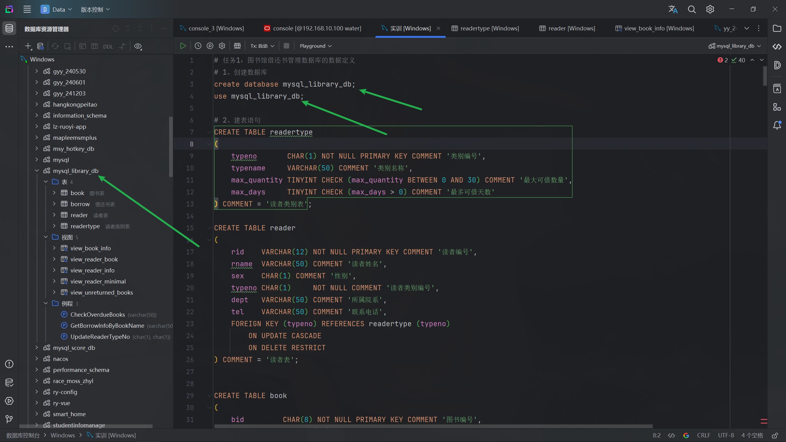
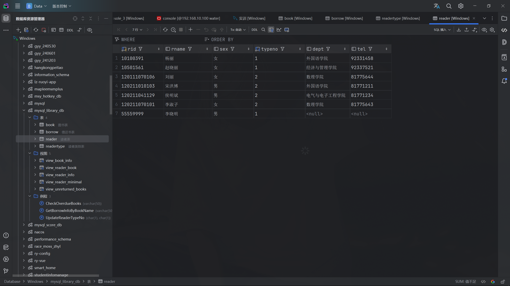

**任务1：图书馆借还书管理数据库的数据定义**

1、创建和管理数据库

（1）创建图书馆借还书管理数据库librarydb。

```sql
create database mysql_library_db;
```

（2）显示当前 MySQL 中的数据库。

```sql
use mysql_library_db;
```

（3）使数据库librarydb 成为当前默认的数据库。



2、在数据库 librarydb 中创建与管理数据表

（1）创建读者类别表readertype，读者类别表 readertype 的结构如表1所示，要求同时创建主键。

表1 读者类别表readertype

| 字段名称     | 数据类型    | 允许空值 | 键   | 默认值 | 说明         |
| ------------ | ----------- | -------- | ---- | ------ | ------------ |
| typeno       | CHAR(1)     | 否       | 主键 |        | 类别编号     |
| typename     | VARCHAR(50) | 是       |      |        | 类别名称     |
| max_quantity | TINYINT     | 是       |      |        | 最大可借数量 |
| max_days     | TINYINT     | 是       |      |        | 最多可借天数 |

```sql
CREATE TABLE readertype
(
    typeno       CHAR(1) NOT NULL PRIMARY KEY COMMENT '类别编号',
    typename     VARCHAR(50) COMMENT '类别名称',
    max_quantity TINYINT CHECK (max_quantity BETWEEN 0 AND 30) COMMENT '最大可借数量',
    max_days     TINYINT CHECK (max_days > 0) COMMENT '最多可借天数'
) COMMENT = '读者类别表';
```

（2）创建读者表 reader，读者表reader 的结构如表2所示，只要求同时创建主键，不必创建外键。其中读者编号对应的是学生的学号或教师的工号。

表2 读者表 reader

| 字段名称 | 数据类型    | 允许空值 | 键                     | 默认值 | 说明     |
| -------- | ----------- | -------- | ---------------------- | ------ | -------- |
| rid      | VARCHAR(12) | 否       | 主键                   |        | 读者编号 |
| rname    | VARCHAR(50) | 是       |                        |        | 读者姓名 |
| sex      | CHAR(2)     | 是       |                        |        | 性别     |
| typeno   | CHAR(1)     | 否       | 外键readertype(typeno) | 2      | 读者类别 |
| dept     | VARCHAR(50) | 是       |                        |        | 所属院系 |
| tel      | VARCHAR(50) | 是       |                        |        | 联系电话 |

```sql
CREATE TABLE reader
(
    rid    VARCHAR(12) NOT NULL PRIMARY KEY COMMENT '读者编号',
    rname  VARCHAR(50) COMMENT '读者姓名',
    sex    CHAR(1) COMMENT '性别',
    typeno CHAR(1)     NOT NULL COMMENT '读者类别编号',
    dept   VARCHAR(50) COMMENT '所属院系',
    tel    VARCHAR(50) COMMENT '联系电话',
    FOREIGN KEY (typeno) REFERENCES readertype (typeno)
        ON UPDATE CASCADE
        ON DELETE RESTRICT
) COMMENT = '读者表';
```

（3）创建图书表book，图书表book 的结构如表3所示，要求同时创建主键。

表3 图书表book

| 字段名称    | 数据类型    | 允许空值 | 键   | 默认值 | 说明     |
| ----------- | ----------- | -------- | ---- | ------ | -------- |
| bid         | CHAR(8)     | 否       | 主键 |        | 图书编号 |
| bname       | VARCHAR(50) | 是       |      |        | 书名     |
| author      | VARCHAR(50) | 是       |      |        | 作者     |
| publisher   | VARCHAR(50) | 是       |      |        | 出版社   |
| publishdate | date        | 是       |      |        | 出版日期 |
| price       | float       | 是       |      |        | 定价     |
| total       | int         | 是       |      |        | 库存数量 |
| position    | VARCHAR(50) | 是       |      |        | 存放位置 |

```sql
CREATE TABLE book
(
    bid         CHAR(8) NOT NULL PRIMARY KEY COMMENT '图书编号',
    bname       VARCHAR(50) COMMENT '书名',
    author      VARCHAR(50) COMMENT '作者',
    publisher   VARCHAR(50) COMMENT '出版社',
    publishdate DATE COMMENT '出版日期',
    price       FLOAT CHECK (price > 0) COMMENT '定价',
    total       INT CHECK (total >= 0) COMMENT '库存数量',
    position    VARCHAR(50) COMMENT '存放位置'
) COMMENT = '图书表';
```

（4）创建借还书表borrow，借还书表borow 的结构如表 4所示，只要求同时创建主键，不必创建外键。

表4 借还书表borrow

| 字段名称   | 数据类型    | 允许空值 | 键                    | 默认值 | 说明     |
| ---------- | ----------- | -------- | --------------------- | ------ | -------- |
| rid        | VARCHAR(12) | 否       | 主键，外键reader(rid) |        | 读者编号 |
| bid        | CHAR(8)     | 否       | 主键，外键book(bid)   |        | 图书编号 |
| borrowtime | date        | 是       |                       |        | 借书日期 |
| returntime | date        | 是       |                       |        | 换书日期 |

```sql
CREATE TABLE borrow
(
    rid        VARCHAR(12) NOT NULL COMMENT '读者编号',
    bid        CHAR(8)     NOT NULL COMMENT '图书编号',
    borrowtime DATE COMMENT '借书日期',
    returntime DATE COMMENT '还书日期',
    PRIMARY KEY (rid, bid), -- 复合主键
    FOREIGN KEY (rid) REFERENCES reader (rid)
        ON DELETE CASCADE
        ON UPDATE CASCADE,
    FOREIGN KEY (bid) REFERENCES book (bid)
        ON DELETE CASCADE
        ON UPDATE CASCADE
) COMMENT = '借还书表';
```


3、指定数据完整性约束

（1）为读者类别表 readertype 指定检查约束，即指定最大可借数量的范围为0~30本。

```sql
ALTER TABLE readertype
    ADD CONSTRAINT chk_max_quantity CHECK ( max_quantity BETWEEN 0 AND 30 );
```

（2）为读者表 reader 指定外键约東，使其读者类别 typeno字段的值必须是读者类别表 readertype 中类别编号 typeno字段已经存在的值，并且要求当修改读者类别表 readertype 中的 typeno 字段的值时，读者表 reader 中的 typeno字段的值也要随之变化。

```sql
ALTER TABLE reader
    ADD CONSTRAINT fk_reader_typeno FOREIGN KEY (typeno) REFERENCES readertype (typeno)
        ON UPDATE CASCADE
        ON DELETE RESTRICT;
```

（3）为读者表 reader 指定检查约束，即指定性别sex 字段的值只能是“男”或“女”。

```sql
ALTER TABLE reader
    ADD CONSTRAINT chk_sex CHECK ( sex IN ('男', '女') );
```

（4）修改读者表 reader 的默认值约束，使读者类别 typeno 字段的默认值为“1”。

```sql
ALTER TABLE reader
    ALTER COLUMN typeno SET DEFAULT '1';
```

（5）为图书表 book 指定检查约束，即指定定价 price 字段的值必须大于0。

```sql
ALTER TABLE book
    ADD CONSTRAINT chk_price CHECK ( price > 0 );
```

（6）为借还书表 borrow 指定外键约束，使其读者编号 rid 字段的值必须是读者表 reader 中读者编号 rid 字段已经存在的值，并且要求当删除或修改读者表reader 中的读者编号 rid 字段的值时，如果借还书表borrow 中该读者还有相关记录，则不得删除或修改。

```sql
ALTER TABLE borrow
    ADD CONSTRAINT fk_borrow_rid FOREIGN KEY (rid) REFERENCES reader (rid)
        ON DELETE RESTRICT
        ON UPDATE RESTRICT;
```

（7）为借还书表 borrow 指定外键约束，使其图书编号 bid 字段的值必须是图书表 book 中图书编号 bid字段已经存在的值，并且要求当删除图书表 book中的某个图书编号bid 时，如果借还书表borrow 中该图书还有相关记录，则同时删除。

```sql
ALTER TABLE borrow
    ADD CONSTRAINT fk_borrow_bid
        FOREIGN KEY (bid) REFERENCES book (bid)
            ON DELETE CASCADE
            ON UPDATE RESTRICT;
```


**任务****2：图书馆借还书管理数据库的数据操作**

1、向图书馆借书管理数据库librarydb中的各张表插入数据

（1）将表5所示的数据插入读者类别表readtype中。

表5 读者类别表readtype中的数据

| 类别编号 | 类别名称 | 最大可借数量 | 最多可借天数 |
| -------- | -------- | ------------ | ------------ |
| 1        | 教师     | 20           | 90           |
| 2        | 学生     | 15           | 60           |

```sql
INSERT INTO readertype (typeno, typename, max_quantity, max_days)
VALUES (1, '教师', 20, 90),
       (2, '学生', 15, 60);
```


（2）将表6所示的数据插入读者表reader中。

表6 读者表reader中的数据

| 读者编号     | 读者姓名 | 性别 | 读者类别 | 所属院系           | 联系电话 |
| ------------ | -------- | ---- | -------- | ------------------ | -------- |
| 10100391     | 杨丽     | 女   | 1        | 外国语学院         | 92331458 |
| 10501561     | 赵晓丽   | 女   | 1        | 经济与管理学院     | 92337521 |
| 120211010103 | 宋洪博   | 男   | 2        | 外国语学院         | 81771211 |
| 120211041129 | 侯明斌   | 男   | 2        | 电气与电子工程学院 | 81771234 |
| 120211070101 | 李淑子   | 女   | 2        | 数理学院           | 81775643 |
| 120111070106 | 刘丽     | 女   | 2        | 数理学院           | 81775644 |

```sql
INSERT INTO reader (rid, rname, sex, typeno, dept, tel)
VALUES (10100391, '杨丽', '女', 1, '外国语学院', '92331458'),
       (10501561, '赵晓丽', '女', 1, '经济与管理学院', '92337521'),
       (120211010103, '宋洪博', '男', 2, '外国语学院', '81771211'),
       (120211041129, '侯明斌', '男', 2, '电气与电子工程学院', '81771234'),
       (120211070101, '李淑子', '女', 2, '数理学院', '81775643'),
       (120111070106, '刘丽', '女', 2, '数理学院', '81775644');
```



（3）将表7所示的数据插入图书表book中。

表7 图书表book中的数据

| 图书编号 | 书名                | 作者   | 出版社         | 出版日期   | 定价   | 库存数量 | 存放位置   |
| -------- | ------------------- | ------ | -------------- | ---------- | ------ | -------- | ---------- |
| 00539040 | 大学物理辅导        | 吕金钟 | 清华大学出版社 | 2020-03-01 | 52.00  | 18       | 一层C-18-4 |
| 00551060 | PLC应用技术         | 黄中玉 | 人民邮电出版社 | 2018-09-01 | 42.00  | 10       | 一层E-12-5 |
| 00632333 | 数学分析习题演练    | 周民强 | 科学出版社     | 2020-01-01 | 65.00  | 10       | 一层J-6-1  |
| 00868171 | 物理学中的群论基础  | 徐建军 | 人民邮电出版社 | 2010-09-01 | 287.90 | 3        | 一层D-5-6  |
| 01059432 | FPGA设计            | 张义和 | 清华大学出版社 | 2013-07-01 | 52.00  | 9        | 一层D-1-3  |
| 01086319 | 空间信息数据库      | 牛新征 | 人民邮电出版社 | 2014-04-01 | 65.00  | 6        | 二层A-4-1  |
| 01244785 | MATLAB科学计算      | 温正   | 清华大学出版社 | 2017-08-01 | 99.00  | 4        | 二层C-12-2 |
| 01257680 | SQL进阶教程         | MICK   | 人民邮电出版社 | 2017-11-01 | 79．00 | 8        | 二层B-8-2  |
| 01315502 | MySQL数据库管理实战 | 甘长春 | 人民邮电出版社 | 2019-04-01 | 99.00  | 8        | 二层B-10-1 |
| 01331088 | 大数据技术基础      | 薛志东 | 人民邮电出版社 | 2018-08-01 | 55.00  | 12       | 二层F-3-4  |

```sql
INSERT INTO book (bid, bname, author, publisher, publishdate, price, total, position)
VALUES ('00539040', '大学物理辅导', '吕金钟', '清华大学出版社', '2020-03-01', 52.00, 18, '一层C-18-4'),
       ('00551060', 'PLC应用技术', '黄中玉', '人民邮电出版社', '2018-09-01', 42.00, 10, '一层E-12-5'),
       ('00632333', '数学分析习题演练', '周民强', '科学出版社', '2020-01-01', 65.00, 10, '一层J-6-1'),
       ('00868171', '物理学中的群论基础', '徐建军', '人民邮电出版社', '2010-09-01', 287.90, 3, '一层D-5-6'),
       ('01059432', 'FPGA设计', '张义和', '清华大学出版社', '2013-07-01', 52.00, 9, '一层D-1-3'),
       ('01086319', '空间信息数据库', '牛新征', '人民邮电出版社', '2014-04-01', 65.00, 6, '二层A-4-1'),
       ('01244785', 'MATLAB科学计算', '温正', '清华大学出版社', '2017-08-01', 99.00, 4, '二层C-12-2'),
       ('01257680', 'SQL进阶教程', 'MICK', '人民邮电出版社', '2017-11-01', 79.00, 8, '二层B-8-2'),
       ('01315502', 'MySQL数据库管理实战', '甘长春', '人民邮电出版社', '2019-04-01', 99.00, 8, '二层B-10-1'),
       ('01331088', '大数据技术基础', '薛志东', '人民邮电出版社', '2018-08-01', 55.00, 12, '二层F-3-4');
```


（4）将表8所示的数据插入借书还书表borrow中。

表8 借书还书表borrow中的数据

| 读者编号     | 图书编号 | 借书日期   | 还书日期   |
| ------------ | -------- | ---------- | ---------- |
| 10100391     | 01086319 | 2022-06-03 | 2022-07-10 |
| 10100391     | 01331088 | 2022-06-03 |            |
| 10501561     | 00868171 | 2022-03-01 | 2022-04-28 |
| 10501561     | 01086319 | 2022-03-01 | 2022-04-28 |
| 10501561     | 01244785 | 2022-06-30 |            |
| 10501561     | 01315502 | 2022-03-18 | 2022-04-28 |
| 10501561     | 01331088 | 2022-06-30 |            |
| 120211010103 | 00539040 | 2022-03-15 | 2022-04-27 |
| 120211010103 | 00632333 | 2022-03-15 | 2022-04-27 |
| 120211010103 | 01315502 | 2022-04-10 |            |
| 120211041129 | 00539040 | 2022-03-10 | 2022-05-05 |
| 120211041129 | 00632333 | 2022-03-10 | 2022-05-05 |
| 120211041129 | 01257680 | 2022-07-01 |            |
| 120211041129 | 01315502 | 2022-06-22 | 2022-07-01 |
| 120211070101 | 00632333 | 2022-04-06 | 2022-07-03 |

```sql
INSERT INTO borrow (rid, bid, borrowtime, returntime)
VALUES (10100391, '01086319', '2022-06-03', '2022-07-10'),
       (10100391, '01331088', '2022-06-03', NULL),
       (10501561, '00868171', '2022-03-01', '2022-04-28'),
       (10501561, '01086319', '2022-03-01', '2022-04-28'),
       (10501561, '01244785', '2022-06-30', NULL),
       (10501561, '01315502', '2022-03-18', '2022-04-28'),
       (10501561, '01331088', '2022-06-30', NULL),
       (120211010103, '00539040', '2022-03-15', '2022-04-27'),
       (120211010103, '00632333', '2022-03-15', '2022-04-27'),
       (120211010103, '01315502', '2022-04-10', NULL),
       (120211041129, '00539040', '2022-03-10', '2022-05-05'),
       (120211041129, '00632333', '2022-03-10', '2022-05-05'),
       (120211041129, '01257680', '2022-07-01', NULL),
       (120211041129, '01315502', '2022-06-22', '2022-07-01'),
       (120211070101, '00632333', '2022-04-06', '2022-07-03');
```


（5）有两位新入职的老师申请办理图书馆业务，教师的信息如表9所示，请将他们的信息插入读者表reader中。

表9 新入职教师信息

| 读者编号 | 读者姓名 | 性别 | 读者类别 | 所属院系             | 联系电话 |
| -------- | -------- | ---- | -------- | -------------------- | -------- |
| 10631218 | 李亚明   | 男   | 1        | 控制与计算机工程学院 | 92331921 |
| 10701274 | 孟凯彦   | 男   | 1        | 数理学院             | 92336872 |

```sql
INSERT INTO reader (rid, rname, sex, typeno, dept, tel)
VALUES (10631218, '李亚明', '男', 1, '控制与计算机工程学院', '92331921'),
       (10701274, '孟凯彦', '男', 1, '数理学院', '92336872');
```


（6）图书馆进了一本新书，新书信息如表10所示，请将该图书信息插入图书部book中。

表10 新书信息

| 图书编号 | 书名             | 作者   | 出版社         | 出版日期   | 定价  | 库存数量 | 存放位置  |
| -------- | ---------------- | ------ | -------------- | ---------- | ----- | -------- | --------- |
| 01351006 | Access数据库教程 | 苏林萍 | 人民邮电出版社 | 2021-07-01 | 59.80 | 10       | 二层F-4-6 |

```sql
INSERT INTO book (bid, bname, author, publisher, publishdate, price, total, position)
VALUES ('01351006', 'Access数据库教程', '苏林萍', '人民邮电出版社', '2021-07-01', 59.80, 10, '二层F-4-6');
```


2、修改表中的数据

（1）读者10631218于2022年7月5日借阅了一本图书01351006，请在borrow 表中添加该读者对该书的借还书数据，并在book表中将该图书的库存数量减1（假定该图书库存充足可借）。

```sql
select *
from reader
where rid = '10631218';
select *
from book
where bid = '01351006';
-- 开始事务
START TRANSACTION;
-- 插入借书记录
INSERT INTO borrow(rid, bid, borrowtime, returntime)
VALUES (10631218, '01351006', '2022-07-05', NULL);
-- 更新图书库存
UPDATE book
SET total = total - 1
WHERE bid = '01351006';
-- 提交事务
COMMIT;
```


（2）读者 10631218归还了借阅的图书01351006，还书日期为系统当前日期，请修改borrow 表中相应的借还书数据，并在book表中将该图书的库存数量加1。

```sql
# （2）读者 10631218归还了借阅的图书01351006，还书日期为系统当前日期，请修改borrow 表中相应的借还书数据，并在book表中将该图书的库存数量加1。
-- 开启事务
START TRANSACTION;
-- 更新借书表
update borrow
set returntime = curdate()
where rid = 10100391
  and bid = '01331088'
  and returntime IS NULL;
-- 更新book库存
UPDATE book
SET total = total - 1
WHERE bid = '01331088';
-- 提交事务
commit;
select *
from book
where bid = '01331088';
```


3、刪除表中的数据

（1）读者10701274孟凯彦离职了，请将其从读者表 reader 中删除。

```
DELETE
FROM reader
WHERE rid = 10701274;
```


（2）读者 10631218 李亚明也离职了，请将其从读者表 reader 中删除，并思考不能删除的原因（外键约束）。

```
DELETE
FROM reader
WHERE rid = 10631218;
```


（3）由于图书01351006全部损毁，不再提供借阅，请从图书表book 中将该图书删除。删除该图书后，请查看borrow 表中与该图书相关的借还书数据是否还存在，并思考原因（外键约束）。

```sql
DELETE
FROM book
WHERE bid = '01351006';
```


**任务****3：图书馆借还书管理数据库的数据查询**

1、查询“人民邮电出版社”的相关图书信息，结果包含图书编号、书名、作者、出版社和定价。

```sql
SELECT bid AS 图书编号, bname AS 书名, author AS 作者, publisher AS 出版社, price AS 定价
FROM book
WHERE publisher = '人民邮电出版社';
```


2、查询女性读者的相关信息，结果包含读者姓名、性别和所属院系。

```sql
SELECT rname AS 读者姓名, sex AS 性别, dept AS 所属院系
FROM reader
WHERE sex = '女';
```


3、查询 2017 年至 2019 年出版的相关图书信息，结果包含图书编号、书名、作者、出版日期和定价。

```sql
SELECT bid AS 图书编号, bname AS 书名, author AS 作者, publishdate AS 出版日期, price AS 定价
FROM book
WHERE YEAR(publishdate) BETWEEN 2017 AND 2019
order by publishdate desc;
```


4、查询图书定价打7折后的图书编号、书名和打折后价格。

```sql
SELECT bid AS 图书编号, bname AS 书名, ROUND(price * 0.7, 2) AS 打折后价格
FROM book;
```


5、查询所有馆存图书的总类别数量和总库存数量。

```sql
SELECT COUNT(*) AS 总类别数量, SUM(total) AS 总库存数量
FROM book;
```


6、查询借阅的书名称中包含“数据”的读者的借阅信息，结果包含读者姓名和书名。

```sql
SELECT r.rname AS 读者姓名, b.bname AS 书名
FROM borrow br
         JOIN reader r ON br.rid = r.rid
         JOIN book b ON br.bid = b.bid
WHERE b.bname LIKE '%数据%';
```


7、查询读者为“教师”的借阅信息，结果包含读者姓名、书名和借阅日期。

```sql
# 7、查询读者为“教师”的借阅信息，结果包含读者姓名、书名和借阅日期。
SELECT r.rname AS 读者姓名, b.bname AS 书名, br.borrowtime AS 借阅日期
FROM borrow br
         JOIN reader r ON br.rid = r.rid
         JOIN book b ON br.bid = b.bid
         JOIN readertype rt ON r.typeno = rt.typeno
WHERE rt.typename = '教师'
order by borrowtime desc;
```


8、查询尚未还书的相关读者信息，结果包含读者编号、读者姓名、书名和借阅日期。

```sql
SELECT r.rid AS 读者编号, r.rname AS 读者姓名, b.bname AS 书名, br.borrowtime AS 借阅日期
FROM borrow br
         join reader r on r.rid = br.rid
         join book b on b.bid = br.bid
where br.returntime IS NULL;
```


9、查询每本图书的借阅次数，将结果按照借阅次数降序排列，结果包含图书编号、书名、借阅次数、作者和出版社。

```sql
SELECT b.bid AS 图书编号, b.bname AS 书名, COUNT(br.bid) AS 借阅次数, b.author AS 作者, b.publisher AS 出版社
FROM borrow br
         JOIN book b on b.bid = br.bid
GROUP BY b.bid, b.bname, b.author, b.publisher
ORDER BY 借阅次数 DESC;
```


10、查询每个院系的借阅次数，将结果按照借阅次数的降序排序，结果包含院系名称和借阅次数。

```sql
SELECT r.dept AS 院系名称, COUNT(br.rid) AS 借阅次数
FROM borrow br
         JOIN reader r ON br.rid = r.rid
GROUP BY r.dept
ORDER BY 借阅次数 DESC;
```


11、查询借阅了书名为“大数据技术基础”的图书但尚未还书的相关读者信息，结果包含读者编号、读者姓名、书名和借阅日期。

```sql
SELECT r.rid AS 读者编号, r.rname AS 读者姓名, b.bname AS 书名, br.borrowtime AS 借阅日期
FROM borrow br
         join reader r on r.rid = br.rid
         join book b on b.bid = br.bid
where br.returntime IS NULL
  AND b.bname = '大数据技术基础';
```


12、查询定价高于平均定价的相关图书信息，结果包含图书编号、书名、作者、出版社和定价。

```
SELECT AVG(price)
FROM book;
SELECT bid AS 图书编号, bname AS 书名, author AS 作者, publisher AS 出版社, price AS 定价
FROM book
WHERE price > (SELECT AVG(price) FROM book);
```


13、查询从未被读者借阅的相关图书信息，结果包含图书编号、书名、作者、出版社和定价。

```
SELECT bid AS 图书编号, bname AS 书名, author AS 作者, publisher AS 出版社, price AS 定价
FROM book
WHERE bid NOT IN (SELECT DISTINCT bid FROM borrow);
```


**任务****4：****图书馆借还书管理数据库的视图**

1、创建一个视图，包含图书表book中的图书编号bid、书名bname、作者author、出版社publisher 和定价price，然后利用该视图查询出“人民邮电出版社”的图书信息。

```
CREATE VIEW view_book_info AS
SELECT bid       AS 图书编号,
       bname     AS 书名,
       author    AS 作者,
       publisher AS 出版社,
       price     AS 定价
FROM book;
SELECT *
FROM view_book_info
WHERE 出版社 = '人民邮电出版社';
```

2、创建一个视图，包含读者表reader 中的读者姓名rname、性别sex和读者类别表readertype 中的类别名称typename，然后利用该视图查询出读者类别是“学生”的信息。

```
CREATE VIEW view_reader_info AS
SELECT r.rname     AS 读者姓名,
       r.sex       AS 性别,
       rt.typename AS 类别名称
FROM reader r
         JOIN readertype rt ON r.typeno = rt.typeno;
SELECT *
FROM view_reader_info
WHERE 类别名称 = '学生';
```

3、创建一个视图，包含尚未还书的读者编号rid、读者姓名rname、书名bname 和借书日期 borrowtime，然后利用该视图查询出所有尚未还书的读者信息。

```
CREATE VIEW view_unreturned_books AS
SELECT br.rid        AS 读者编号,
       r.rname       AS 读者姓名,
       b.bname       AS 书名,
       br.borrowtime AS 借书日期
FROM borrow br
         JOIN book b on b.bid = br.bid
         JOIN reader r on br.rid = r.rid
WHERE br.returntime IS NULL;
SELECT *
FROM view_unreturned_books;
```

4、创建一个视图，包含读者姓名rname 和书名bname，然后利用该视图查询出姓“李”的借阅了图书的读者信息，以及借阅图书的书名中包含“数据”的信息。

```
CREATE VIEW view_reader_book AS
SELECT r.rname AS 读者姓名,
       b.bname AS 书名
FROM borrow br
         JOIN reader r ON br.rid = r.rid
         JOIN book b ON br.bid = b.bid;
SELECT *
FROM view_reader_book
WHERE 读者姓名 LIKE '李%';
SELECT *
FROM view_reader_book
WHERE 书名 LIKE '%数据%';
```

5、创建一个视图，包含读者表reader中的读者编号rid、读者姓名rname、性别sex 和读者类别编号typeno，然后向该视图中插入一条数据（55559999，李晓明，男，1）。

```
CREATE VIEW view_reader_minimal AS
SELECT rid    AS 读者编号,
       rname  AS 读者姓名,
       sex    AS 性别,
       typeno AS 类别编号
FROM reader;
INSERT INTO view_reader_minimal (读者编号, 读者姓名, 性别, 类别编号)
VALUES ('55559999', '李晓明', '男', '1');
```


**任务****5：****图书馆借还书管理数据库的索引**

1、创建索引

（1）在图书表book的书名bname字段的前6个字符上创建一个升序的普通索引I_bname。

```
CREATE INDEX I_bname ON book (bname(6) ASC);
```

（2）在图书表book的图书编号bid字段上创建一个唯一索引，在放置位置position字段上创建一个普通索引，在定价price字段上创建一个普通索引且按照降序排列。

```
CREATE UNIQUE INDEX I_bid ON book (bid);
CREATE INDEX I_price ON book (position);
CREATE INDEX I_position ON book (position);
ALTER TABLE book
    DROP INDEX I_price;
CREATE INDEX I_price ON book (price DESC);
```

（3）在借还书表borrow的读者编号rid字段和图书编号bid字段上创建一个组合索引。

```
CREATE INDEX I_rid_bid
    ON borrow (rid, bid);
```

2、删除索引

（1）使用ALTER TABLE语句删除图书表book的定价price字段上创建的索引。

```
ALTER TABLE book
    DROP INDEX I_price;
```

（2）使用DROP INDEX语句删除在图书表 book 中创建的索引 I_bname。

```
DROP INDEX I_bname
    ON book;
```


**任务****6：****图书馆借还书管理数据库的编程**

1、将图书表 book 中存放位置 position 字段分成楼层和区，查询结果包含图书编号、书名、作者、出版社、楼层和区的信息。 

```
SELECT bid                                                          AS 图书编号,
       bname                                                        AS 书名,
       author                                                       AS 作者,
       publisher                                                    AS 出版社,
       SUBSTRING_INDEX(position, '层', 1)                           AS 楼层,
       SUBSTRING_INDEX(SUBSTRING_INDEX(position, '层', -1), '-', 1) AS 区
FROM book;
```


2、查询读者类别为学生且借阅超期（超过 60 天）读者的信息，结果包含读者姓名、书名、借阅日期和超期天数。（提示：结果与系统的当前日期相关，在不同的日期下执行会得到不同的结果。）

```
SELECT r.rname                                          AS 读者姓名,
       b.bname                                          AS 书名,
       bo.borrowtime                                    AS 借阅日期,
       DATEDIFF(CURDATE(), bo.borrowtime) - rt.max_days AS 超期天数
FROM borrow bo
         JOIN reader r ON bo.rid = r.rid
         JOIN book b ON bo.bid = b.bid
         JOIN readertype rt ON r.typeno = rt.typeno
WHERE rt.typename = '学生'
  AND bo.returntime IS NULL
  AND DATEDIFF(CURDATE(), bo.borrowtime) > rt.max_days;
```


3、创建带输入参数的存储过程，输入书名，查询借阅了该书读者的信息，结果包含读者编号、读者姓名、书名和借阅日期，然后调用该存储过程查询借阅了图书“数学分析习题演练”的读者的信息。

```
DELIMITER $$
CREATE PROCEDURE GetBorrowInfoByBookName(IN bookName VARCHAR(50))
BEGIN
    SELECT r.rid         AS 读者编号,
           r.rname       AS 读者姓名,
           b.bname       AS 书名,
           bo.borrowtime AS 借阅日期
    FROM borrow bo
             JOIN book b on b.bid = bo.bid
             JOIN reader r on bo.rid = r.rid
    where b.bname = bookName;
end $$
DELIMITER ;
CALL GetBorrowInfoByBookName('数学分析习题演练');
```

4、创建带输入参数的存储过程，输入姓名，显示是否有逾期未还图书，学生的借阅天数超60天、教师的借阅天数超90天则为逾期读者，结果包含读者姓名、读者类别、书名、借阅日期和超期天数，然后调用存储过程查询“宋洪博”的图书逾期信息。

```
DELIMITER $$
CREATE PROCEDURE CheckOverdueBooks(IN readerName VARCHAR(50))
BEGIN
    SELECT r.rname                                          AS 读者姓名,
           rt.typename                                      AS 读者类别,
           b.bname                                          AS 书名,
           bo.borrowtime                                    AS 借阅日期,
           DATEDIFF(CURDATE(), bo.borrowtime) - rt.max_days AS 超期天数
    FROM borrow bo
             JOIN reader r ON bo.rid = r.rid
             JOIN book b ON bo.bid = b.bid
             JOIN readertype rt ON r.typeno = rt.typeno
    WHERE r.rname = readerName
      AND bo.returntime IS NULL
      AND DATEDIFF(CURDATE(), bo.borrowtime) > rt.max_days;
END $$
DELIMITER ;
CALL CheckOverdueBooks('宋洪博');
```


**任务****7：****图书馆借还书管理数据库的事务控制**

1、修改读者类别编号事务控制。要求在存储过程中定义事务，通过输入参数old_no和new_no修改读者类别表readertype中学生的类别编号typeno，将其由原来的old_no修改为新的new_no。为了保证数据的一致性，还需要同步修改读者表reader中相关的读者类别。只有这些修改操作都成功，才提交，否则回滚。分别模拟正常和异常情况下的修改结果。

```
DELIMITER $$
CREATE PROCEDURE UpdateReaderTypeNo(IN old_no CHAR(1), IN new_no CHAR(1))
BEGIN
    -- 开始事务
    DECLARE EXIT HANDLER FOR SQLEXCEPTION
        BEGIN
            -- 捕获异常信息
            DECLARE err_msg TEXT;
            DECLARE err_code INT;
            GET DIAGNOSTICS CONDITION 1 err_msg = MESSAGE_TEXT, err_code = MYSQL_ERRNO;
            -- 回滚事务
            ROLLBACK;
            -- 打印错误信息
            SELECT CONCAT('Error Code: ', err_code, ', Message: ', err_msg) AS ErrorMessage;
        END;
    START TRANSACTION;
    -- 更新读者类别表
    UPDATE readertype
    SET typeno = new_no
    WHERE typeno = old_no;
    -- 更新读者表中的读者类别编号
    UPDATE reader
    SET typeno = new_no
    WHERE typeno = old_no;
    -- 提交事务
    COMMIT;
END $$
DELIMITER ;
CALL UpdateReaderTypeNo('1', '6');
CALL UpdateReaderTypeNo('A', '3');
CALL UpdateReaderTypeNo('1', 'AA');
CALL UpdateReaderTypeNo('X', 'Y');
```


**任务****8：****图书馆借还书管理数据库的数据安全**

1、用户管理

（1）添加用户reader1、reader2和reader3，主机名是localhost，密码均为123456。

```
CREATE USER 'reader1'@'localhost' IDENTIFIED BY '123456';
CREATE USER 'reader2'@'localhost' IDENTIFIED BY '123456';
CREATE USER 'reader3'@'localhost' IDENTIFIED BY '123456';
```

（2）将用户reader3的名称修改为reader。

```
RENAME USER 'reader3'@'localhost' TO 'reader'@'localhost';
```

（3）将用户reader的密码修改为987654

```
ALTER USER 'reader'@'localhost' IDENTIFIED BY '987654';
```

（4）删除用户reader。

```
DROP USER 'reader'@'localhost';
```

2、权限管理

（1）授予用户reader1对数据库librarydb中读者表reader的UPDATE操作权限。

```
GRANT UPDATE ON mysql_library_db.reader TO 'reader1'@'localhost';
```

（2）授予用户reader1对数据库librarydb中图书表book的INSERT、DELETE操作权限。

```
GRANT INSERT, DELETE ON mysql_library_db.book TO 'reader1'@'localhost';
```

（3）授予用户reader2对数据库librarydb拥有所有操作权限，并允许reader2将该权限授予其他用户。

```
GRANT ALL PRIVILEGES ON mysql_library_db.* TO 'reader2'@'localhost' WITH GRANT OPTION;
```

（4）查看用户reader1拥有的权限

```
SHOW GRANTS FOR 'reader1'@'localhost';
```

（5）收回用户reader1对数据库librarydb中读者表reader的UPDATE操作权限。

```
REVOKE UPDATE ON mysql_library_db.reader FROM 'reader1'@'localhost';
```

3、数据备份和恢复

（1）以用户root的身份将数据库librarydb中读者表reader和图书表book的数据备份到D盘的reader-book.sql文件中。

```
mysqldump -u root -p librarydb reader book > D:/reader-book.sql
```

（2）创建一个新数据库mytestdb，将D盘的reader-book.sql备份文件中的读者表reader和图书表book恢复到该数据库中。

```
CREATE DATABASE mysql_library_db;
mysql -u root -p mytestdb < D:/reader-book.sql
```