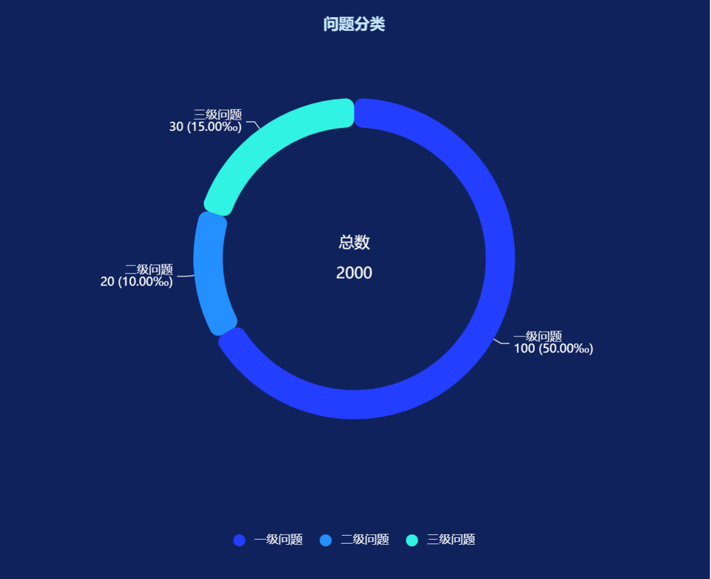

[TOC]

# 柱形图

## 柱形饼图同层图


### js

```js
/**
 * 完整 ECharts 配置：柱状图 (Bar) + 分段环形图 (Pie)
 * 数据源统一为 chartData。
 */

// 1. 统一数据源 & 提取配置变量
// ===================================
var chartData = [
    { name: '太原市民政局', value: 70, tooltipText: '太原市民政局在太原，\n是的在太原。' },
    { name: '太原市运输局', value: 34, tooltipText: '负责太原市的交通运输管理。' },
    { name: '太原市残联', value: 60, tooltipText: '为残疾人提供服务和保障。' },
    { name: '太原市报社', value: 78, tooltipText: '太原市的主要新闻出版机构。' },
    { name: '太原市司法局', value: 69, tooltipText: '负责太原市的法律事务管理。' }
];

var chartNames = chartData.map(function(item) { return item.name; });
var chartTotalValue = chartData.reduce((sum, item) => sum + item.value, 0);

// 提取配置变量
var BACKGROUND_COLOR = '#081028'; // 背景颜色
var MAIN_TITLE_TEXT = '太原市机构数据总览 - Bar & Pie'; // 总标题文本
var pieColor = ['#fd566a', '#9787ff', '#fdb36a', '#fdd56a', '#6da7ff', '#63e1f2']; // 环形图/颜色主题

// 2. 环形图数据处理 (采用分段样式，使用 chartData)
// ===================================
var pieData = [];
var gapValue = 3; // 间隔块的固定值

// 构建分段环形图所需的数据结构
for (var i = 0; i < chartData.length; i++) {
    const item = chartData[i];
    
    // 实际数据块
    pieData.push(
        {
            value: item.value,
            name: item.name,
            tooltipText: item.tooltipText,
            // 确保每个数据块有自己独特的颜色和样式
            itemStyle: {
                normal: {
                    borderWidth: 5,
                    shadowBlur: 20,
                    borderColor: pieColor[i % pieColor.length],
                    shadowColor: pieColor[i % pieColor.length],
                },
            },
        },
        // 间隔块
        {
            value: gapValue,
            name: '', // 间隔块名称为空
            itemStyle: {
                normal: {
                    label: { show: false },
                    labelLine: { show: false }, 
                    color: 'rgba(0, 0, 0, 0)', // 透明颜色
                    borderColor: 'rgba(0, 0, 0, 0)',
                    borderWidth: 0,
                },
            },
            // 用于在 series level 禁用 labelLine
            labelLine: { show: false } 
        }
    );
}

// 3. ECharts 配置对象
// ===================================
option = {
    backgroundColor: BACKGROUND_COLOR, // 使用变量
    color: pieColor, // 使用变量
    
    // 添加总标题和环形图中心的总计文本
    title: [
        {
            text: MAIN_TITLE_TEXT, // 使用变量
            left: 'center',
            top: '0%',
            textStyle: {
                color: '#fff',
                fontSize: 20
            }
        },
        // 环形图中心的总计文本
        { 
            text: '总计:' + chartTotalValue, // 使用 chartTotalValue
            top: '78%', 
            textAlign: 'center', 
            left: '40%', 
            textStyle: { 
                color: '#fff', 
                fontSize: 16, 
                fontWeight: '400' 
            } 
        },
    ],
    
    // Legend 移至右下角
    legend: {
        data: chartNames, // 使用 chartNames
        orient: 'vertical',
        right: '5%',
        bottom: '10%',
        textStyle: { color: '#fff' }
    },
    
    // 统一 Tooltip (根据 seriesType 定制内容)
    tooltip: {
        trigger: 'item',
        axisPointer: { type: 'shadow' },
                  backgroundColor: 'rgba(50,50,50,0.7)',
          borderColor: '#333',
          borderWidth: 0,
          shadowBlur: 10,
          padding: 10,
          textStyle: {color: '#fff', fontSize: 14},
        formatter: function (params) {
            // 忽略环形图的间隔块
            if (params.name === '' && params.seriesType === 'pie') {
                return '';
            }
            var tooltipHtml=''
            if (params.seriesType === 'bar') {
                const originalItem = chartData[params.dataIndex];
                var name = originalItem.name;
                var value = originalItem.value
                // 柱形图：name: value (百分比) + tooltipText
                tooltipHtml = name + '：' + value + '<br/>';
                // 找到对应的 tooltipText
            
                if (originalItem && originalItem.tooltipText) {
                    // 使用 <br/> 替换换行符 \n
                    tooltipHtml += originalItem.tooltipText.replace(/\n/g, '<br/>');
                }
            } else if (params.seriesType === 'pie') {
            var value = params.value;
            // var customData = params.data; // 理论上可以拿到，但为保险起见，下面通过 find 查找
            var percent = ((value / chartTotalValue) * 100).toFixed(2); // 使用 chartTotalValue
            var percentText = ' (' + percent + '%)';
            var tooltipText = params.data.tooltipText;
            var name = params.name;
            // 环形图：name: value (百分比)
             tooltipHtml = name + '：' + value + '/' + chartTotalValue + percentText;
             if(tooltipText&&tooltipText!=''){
                 tooltipHtml+='<br/>'+tooltipText.replace(/\n/g, '<br/>')
             }   
            }
            
            return tooltipHtml;
        }
    },
    
    // 布局 grid (柱状图区域)
    grid: {
        left: '3%',
        right: '3%',
        bottom: '45%',
        top: '5%',
        containLabel: true
    },
    
    xAxis: {
        show: true,
        axisLabel: { show: true, color: '#a2a2a2' },
        axisLine: { show: false, lineStyle: { color: 'red', type: 'dotted' } },
        splitLine: { show: true, lineStyle: { color: ['rgba(160, 192, 252, 0.2)'], width: 1, type: [5, 8], dashOffset: 2 } },
    },
    
    yAxis: [
        // 柱形图 Y 轴
        {
            data: chartNames, // 使用 chartNames
            show: true, inverse: false,
            axisLine: { show: true, lineStyle: { color: ['rgba(160, 192, 252, 0.2)'], width: 1, type: [5, 8], dashOffset: 2 } },
            splitLine: { show: false }, axisTick: { show: false },
            axisLabel: { color: '#fff' },
        },
        // 柱形图背景框 Y 轴
        { show: false, inverse: false, data: [] }, 
    ],
    
    series: [
        // 1. 柱形图系列 (上部 - 实际值)
        {
            name: '太原市各局值',
            type: 'bar',
            yAxisIndex: 0,
            data: chartData, // 使用 chartData
            barWidth: '50%', barGap: '10%',
            itemStyle: {
                normal: {
                    barBorderRadius: 30,
                    color: new echarts.graphic.LinearGradient(0, 0, 1, 0, [
                        { offset: 0, color: '#28b1ff' },
                        { offset: 1, color: '#00fcff' },
                    ]),
                },
            },
            label: { normal: { show: false } },
        },
        // 2. 柱形图背景框系列
        {
            name: '框',
            type: 'bar',
            yAxisIndex: 1,
            barGap: '-100%',
            // 使用 chartData 的长度来动态生成背景数据
            data: new Array(chartData.length).fill(100), 
            barWidth: '50%',
            itemStyle: { normal: { color: 'rgba(160, 192, 252, 0.1)', barBorderRadius: 15 } },
        },
        // 3. 分段环形图系列 (下部)
        {
            name: '机构数值比例',
            type: 'pie',
            clockWise: false,
            radius: [90, 100], // 环形图的内外半径
            center: ['40%', '80%'], // 环形图的中心位置
            hoverAnimation: true,
            data: pieData, // 使用预处理的 pieData
            itemStyle: { normal: {} },
            label: {
                show: true,
                position: 'outside',
                color: '#fff',
                // Label 仅对非间隔块显示
                formatter: function (params) {
                    if (params.name !== '') {
                        var percent = ((params.value / chartTotalValue) * 100).toFixed(0); // 使用 chartTotalValue
                        return params.name + '\t' + percent + '%';
                    } else {
                        return '';
                    }
                },
            },
            labelLine: {
                length: 15,
                length2: 15,
                show: true,
                lineStyle: { color: '#00ffff' },
            },
        },
    ],
};
```

### vue2

```vue
<template>
  <div :class="className" :style="{ height, width }" ref="chartRef"/>
</template>

<script>
import * as echarts from 'echarts'
import 'echarts/theme/macarons'

import {generateRandomColor} from '@/utils/ruoyi.js'

export default {
  name: 'PieBarCharts',

  props: {
    className: {
      type: String,
      default: 'chart'
    },
    width: {
      type: String,
      default: '100%'
    },
    height: {
      type: String,
      default: '100%'
    },
    // 主数据结构
    chartData: {
      type: Array,
      default: () => [
        {
          name: 'AAA',
          tooltipText: '这个比较好\n总体表现优秀', // 饼图自定义提示文本
          values: [
            {name: '9.1', value: 39, tooltipText: '挺不错的\n是的挺不错'},
            {name: '9.2', value: 42, tooltipText: '表现优秀\n继续保持'},
            {name: '9.3', value: 27, tooltipText: '有所下降\n需要关注'},
            {name: '9.4', value: 29, tooltipText: '回升趋势\n正在好转'},
            {name: '9.5', value: 39, tooltipText: '稳定增长\n效果显著'},
            {name: '9.6', value: 36, tooltipText: '持续稳定\n保持良好'},
            {name: '9.7', value: 34, tooltipText: '略有波动\n整体平稳'}
          ]
        },
        {
          name: 'BBB',
          tooltipText: '这个还行\n中规中矩',
          values: [
            {name: '9.1', value: 45, tooltipText: '开局不错\n值得肯定'},
            {name: '9.2', value: 45, tooltipText: '保持稳定\n继续努力'},
            {name: '9.3', value: 34, tooltipText: '有所回落\n注意调整'},
            {name: '9.4', value: 25, tooltipText: '需要改进\n加强管理'},
            {name: '9.5', value: 43, tooltipText: '强势反弹\n表现出色'},
            {name: '9.6', value: 37, tooltipText: '趋于稳定\n良好态势'},
            {name: '9.7', value: 31, tooltipText: '小幅调整\n正常波动'}
          ]
        },
        {
          name: 'CCC',
          tooltipText: '波动较大\n潜力很大',
          values: [
            {name: '9.1', value: 45, tooltipText: '起步良好\n开门红'},
            {name: '9.2', value: 22, tooltipText: '大幅下滑\n需要重视'},
            {name: '9.3', value: 44, tooltipText: '快速恢复\n值得表扬'},
            {name: '9.4', value: 16, tooltipText: '明显下降\n查找原因'},
            {name: '9.5', value: 43, tooltipText: '显著提升\n效果明显'},
            {name: '9.6', value: 37, tooltipText: '平稳运行\n状态良好'},
            {name: '9.7', value: 31, tooltipText: '稳中有进\n继续保持'}
          ]
        }
      ]
    },
    chartName: {type: String, default: 'PieBarChart'},
    backgroundColor: {type: String, default: 'transparent'},
    // 默认颜色池（用于 generateRandomColor）
    defaultColor: {
      type: Array,
      default: () => [
        '#A5DEE4', '#81C7D4', '#24936E', // 示例中的颜色
        '#5B8FF9', '#5AD8A6', '#5D7092', '#F6BD16', '#E86A92',
        '#7262FD', '#269A29', '#8E36BE', '#41A7E2', '#7747A3',
        '#FF7F50', '#FFDAB9', '#ADFF2F', '#00CED1', '#9370DB',
        '#3CB371', '#FF69B4', '#FFB6C1', '#DA70D6', '#98FB98',
        '#FF6B6B', '#4ECDC4', '#45B7D1', '#96CEB4', '#FFEAA7',
        '#DDA0DD', '#98D8C8', '#F7DC6F', '#BB8FCE', '#85C1E9'
      ]
    }
  },

  data() {
    return {
      chart: null, // ECharts 实例
      currentIndex: 0, // 当前聚焦的饼图索引
      piecolor: [], // 动态生成的颜色数组
      pieData: [], // 饼图数据
      grandTotal: 0, // 总和
      option: {} // ECharts 配置项
    }
  },

  watch: {
    // 监听数据变化，重新初始化图表
    chartData: {
      deep: true,
      handler(newData) {
        if (newData && newData.length) {
          this.prepareData(newData)
          this.initChart()
        }
      }
    }
  },

  mounted() {
    this.$nextTick(() => {
      if (this.chartData && this.chartData.length) {
        this.prepareData(this.chartData)
        this.initChart()
      }
      window.addEventListener('resize', this.handleResize)
    })
  },

  beforeUnmount() {
    this.disposeChart()
    window.removeEventListener('resize', this.handleResize)
  },

  methods: {
    /**
     * 销毁图表实例
     */
    disposeChart() {
      if (this.chart) {
        this.chart.dispose()
        this.chart = null
      }
    },

    /**
     * 处理数据计算、颜色分配等预处理工作
     */
    prepareData(data) {
      // 1. 生成颜色数组 (基于数据项数量)
      const colorSet = new Set()
      // 从默认颜色中选取，如果不够， generateRandomColor 内部应处理重复或不足
      while (colorSet.size < data.length) {
        colorSet.add(generateRandomColor(this.defaultColor))
      }
      this.piecolor = Array.from(colorSet)

      // 2. 计算饼图数据和总和
      this.grandTotal = 0
      this.pieData = data.map((item, index) => {
        const total = item.values.reduce((sum, bar) => sum + bar.value, 0)
        this.grandTotal += total
        return {
          name: item.name,
          value: total,
          tooltipText: item.tooltipText,
          barTotal: total,
          itemStyle: {
            color: this.piecolor[index] || this.defaultColor[index % this.defaultColor.length]
          }
        }
      })

      // 3. 重置聚焦索引 (如果新数据长度变了)
      if (this.currentIndex >= data.length) {
        this.currentIndex = 0
      }
    },

    /**
     * 初始化图表
     */
    initChart() {
      // 销毁已有实例
      this.disposeChart()

      this.chart = echarts.init(this.$refs.chartRef, 'macarons')
      this.option = this.getOption()
      this.chart.setOption(this.option)
      this.bindEvents() // 绑定点击事件
    },

    /**
     * 获取 ECharts 配置项
     */
    getOption() {
      const {currentIndex, pieData, piecolor, grandTotal, chartData} = this

      return {
        backgroundColor: this.backgroundColor,

        title: [
          {
            // 固定的总标题
            text: this.chartName,
            left: 'center',
            top: 10,
            textStyle: {
              color: '#fff',
              fontSize: 22,
              fontWeight: 'bold'
            }
          },
          {
            // 柱状图的动态标题（右侧）
            id: 'barTitle',
            text: chartData[currentIndex].name,
            left: '60%',
            top: 50,
            textStyle: {
              color: piecolor[currentIndex],
              fontSize: 20
            }
          }
        ],

        legend: {
          orient: 'vertical',
          left: '2%',
          top: '20%',
          textStyle: {
            color: '#fff'
          },
          data: pieData.map(item => item.name)
        },

        tooltip: {
          trigger: 'item',
          backgroundColor: 'rgba(50,50,50,0.7)',
          borderColor: '#333',
          borderWidth: 0,
          shadowBlur: 10,
          padding: 10,
          textStyle: {color: '#fff', fontSize: 14},
          // 统一处理 MarkLine, Pie, Bar 的 Tooltip 逻辑
          formatter: (params) => {

            // 1. 处理 MarkLine 逻辑 (平均值线)
            if (params.componentType === 'markLine') {
              return params.name + ': ' + params.value.toFixed(2);
            }

            // 2. 排除其他非 Series 组件 (如 Grid, Axis)
            if (params.componentType !== 'series') {
              return;
            }

            // 3. 饼图 (Pie/Rose) 的 Tooltip 逻辑
            if (params.seriesType === 'pie') {

              const rawTooltipText = params.data.tooltipText;
              const percent = (params.value / grandTotal * 100).toFixed(2);

              // 统一使用 <br> 换行
              return `${params.name}:
                      ${params.value}/${grandTotal} (${percent}%)<br/>
                      ${rawTooltipText.replace(/\n/g, '<br/>')}`;
            }

            // 4. 柱状图 (Bar) 的 Tooltip 逻辑
            else if (params.seriesType === 'bar') {

              const currentBarData = chartData[this.currentIndex];
              const barItem = currentBarData.values[params.dataIndex];
              const barTotal = currentBarData.values.reduce((sum, bar) => sum + bar.value, 0);

              const rawTooltipText = barItem.tooltipText;
              if (rawTooltipText) {
                // 统一使用 <br> 换行
                return `${currentBarData.name}<br/>
                      ${barItem.name}：${barItem.value}<br/>
                      总数: ${barTotal}<br/>
                      ${rawTooltipText.replace(/\n/g, '<br/>')}`;
              } else {
                return `${currentBarData.name}<br/>
                      ${barItem.name}：${barItem.value}<br/>
                      总数: ${barTotal}`;
              }

            }
            // 默认返回
            return params.name + ': ' + params.value;
          }
        },
        grid: {
          top: 60,
          bottom: 70,
          left: '50%',
          width: '45%'
        },
        dataZoom: [
          {
            type: 'slider',
            show: true,
            xAxisIndex: [0],
            start: 0,
            end: 100,
          },
          {type: 'inside', xAxisIndex: [0], start: 0, end: 100}
        ],
        xAxis: {
          type: 'category',
          data: chartData[currentIndex].values.map(item => item.name), // 动态数据
          axisLabel: {
            color: '#fff'
          },
          axisLine: {
            lineStyle: {
              color: '#fff'
            }
          },
          axisTick: {
            show: true,
            lineStyle: {
              color: '#fff'
            }
          }
        },
        yAxis: {
          type: 'value',
          nameTextStyle: {
            color: '#fff'
          },
          axisLabel: {
            color: '#fff'
          },
          axisLine: {
            lineStyle: {
              color: '#fff'
            }
          },
          splitLine: {
            lineStyle: {
              color: 'rgba(255,255,255,0.1)'
            }
          },
          axisTick: {
            show: true,
            lineStyle: {
              color: '#fff'
            }
          }
        },

        series: [
          {
            // 饼图（左侧）
            type: 'pie',
            center: ['25%', '50%'],
            radius: ['10%', '28%'],
            roseType: 'area',
            // 初始设置高亮
            data: pieData.map((item, index) => {
              return {
                name: item.name,
                value: item.value,
                tooltipText: item.tooltipText,
                itemStyle: {
                  color: piecolor[index],
                  // 初始高亮当前索引项
                  borderColor: index === currentIndex ? '#fff' : 'transparent',
                  borderWidth: index === currentIndex ? 3 : 0
                }
              }
            }),
            label: {
              color: '#fff'
            },
            emphasis: {
              itemStyle: {
                borderColor: 'transparent',
                borderWidth: 0
              }
            }
          },
          {
            // 柱状图（右侧）
            type: 'bar',
            barWidth: 15,
            data: chartData[currentIndex].values.map(item => item.value), // 动态数据
            itemStyle: {
              color: piecolor[currentIndex], // 动态颜色
              barBorderRadius: 8
            },
            // 平均值线
            markLine: {
              symbol: 'none',
              data: [
                {
                  type: 'average',
                  name: '平均值'
                }
              ],
              lineStyle: {
                color: '#FFD700',
                width: 2,
                type: 'dashed'
              },
              label: {
                show: true,
                position: 'end',
                color: '#FFD700',
                formatter: function (params) {
                  return '平均值: ' + params.value.toFixed(2);
                }
              }
            }
          }
        ]
      }
    },

    /**
     * 绑定饼图点击事件，实现联动
     */
    bindEvents() {
      if (!this.chart) return

      this.chart.on('click', (params) => {
        if (params.seriesType === 'pie') {
          // 更新当前聚焦索引
          this.currentIndex = params.dataIndex;
          const newIndex = this.currentIndex
          const newBarData = this.chartData[newIndex]
          const newColor = this.piecolor[newIndex]

          // 1. 更新柱状图的动态标题 (title[1])，并更新颜色
          this.option.title[1].text = newBarData.name;
          this.option.title[1].textStyle.color = newColor;

          // 2. 更新柱状图数据和颜色
          this.option.series[1].data = newBarData.values.map(item => item.value);
          this.option.series[1].itemStyle.color = newColor;
          this.option.dataZoom[0].backgroundColor = newColor;

          // 3. 更新 x 轴数据
          this.option.xAxis.data = newBarData.values.map(item => item.name);

          // 4. 更新饼图高亮状态
          this.option.series[0].data = this.pieData.map((item, index) => {
            return {
              ...item, // 保持原有数据和 itemStyle.color
              itemStyle: {
                ...item.itemStyle,
                // 设置选中项的边框
                borderColor: index === newIndex ? '#fff' : 'transparent',
                borderWidth: index === newIndex ? 3 : 0
              }
            }
          });

          // 5. 刷新图表
          this.chart.setOption(this.option, true);
        }
      });
    },

    /**
     * 处理窗口大小变化，重绘图表
     */
    handleResize() {
      if (this.chart) {
        this.chart.resize()
      }
    }
  }
}
</script>

<style scoped>
.chart {
  overflow: hidden;
}
</style>
```


## 柱形折线比例图：BarLineRateCharts


### vue2

```js
<template>
  <div :class="className" :style="{ height, width }" ref="chartRef"></div>
</template>

<script>
// 确保您已安装并引入 ECharts 库
import * as echarts from 'echarts'

export default {
  name: 'BarLineRateCharts', // 组件名称

  // 定义 Props
  props: {
    className: {
      type: String,
      default: 'chart'
    },
    width: {
      type: String,
      default: '100%'
    },
    height: {
      type: String,
      default: '100%' // 默认高度
    },
    // 内层系列名称 (柱状图)
    innerName: {
      type: String,
      default: '实际值'
    },
    // 外层系列名称 (折线图)
    outerName: {
      type: String,
      default: '总量'
    },
    // 核心图表数据
    chartData: {
      type: Object,
      default: () => ({
        names: ['Sun', 'Mon', 'Tue', 'Wed', 'Thu', 'Fri', 'Sat'],
        outerValues: [2220, 1682, 2791, 3000, 4090, 3230, 2910], // 折线图数据
        innerValues: [1220, 682, 791, 1000, 2090, 2230, 1910]  // 柱状图数据
      })
    },
    // 图表标题
    chartTitle: {
      type: String,
      default: 'BarLineRate'
    }
  },

  data() {
    return {
      chart: null // ECharts 实例
    }
  },

  watch: {
    // 深度侦听 chartData 的变化，如果数据更新，则重绘图表
    chartData: {
      deep: true,
      handler(val) {
        this.setOptions(val)
      }
    },
  },

  mounted() {
    this.$nextTick(() => {
      this.initChart()
      // 监听窗口大小变化以适应图表
      window.addEventListener('resize', this.handleResize)
    })
  },

  beforeDestroy() {
    window.removeEventListener('resize', this.handleResize)
    if (this.chart) {
      this.chart.dispose()
      this.chart = null
    }
  },

  methods: {
    /**
     * 初始化图表实例
     */
    initChart() {
      if (!this.$refs.chartRef) return

      if (this.chart) {
        this.chart.dispose()
        this.chart = null
      }

      this.chart = echarts.init(this.$refs.chartRef)
      this.setOptions(this.chartData)
    },

    /**
     * 设置 ECharts 配置项并渲染图表
     * @param {Object} data - 从 this.chartData 传入的数据
     */
    setOptions(data) {
      if (!this.chart || !data || !data.outerValues || data.outerValues.length === 0) return

      const innerName = this.innerName
      const outerName = this.outerName
      const barBorderRadius = [30, 30, 0, 0]

      const option = {
        title: {
          text: this.chartTitle,
          top: 10,
          left: 0,
          textStyle: {
            color: '#C5E5F9',
            fontSize: 18
          }
        },
        grid: {
          top: '16%',
          left: '0%',
          right: '7%',
          bottom: '12%',
          containLabel: true
        },
        legend: {
          itemGap: 30,
          top: '4%',
          right: '7%',
          data: [innerName, outerName],
          textStyle: {
            color: '#fff',
            borderColor: '#fff'
          }
        },
        dataZoom: [
          {
            type: 'slider',
            show: true,
            xAxisIndex: [0],
            start: 0,
            end: 100,
            bottom: '4%',
            height: 20,
            textStyle: {
              color: '#fff'
            }
          },
          {
            type: 'inside',
            xAxisIndex: [0],
            start: 0,
            end: 100
          }
        ],
        tooltip: {
          trigger: 'axis',
          padding: [5, 10, 5, 10],
          backgroundColor: 'transparent',
          borderColor: 'transparent',
          textStyle: {
            color: '#fff'
          },
          // 纯文本 formatter，使用 \n 换行
          formatter: (param) => {
            // 确保在 Vue 组件环境中可以访问 formatToFixed 和 getEquiUnit
            const formatToFixed_fn = typeof formatToFixed === 'function' ? formatToFixed : (val) => val
            const getEquiUnit_fn = typeof getEquiUnit === 'function' ? getEquiUnit : (name) => ''

            let tooltipContent = ''

            // 1. 标题（X轴类别名），后面接换行
            tooltipContent += `${param[0]?.axisValue}<br/>`

            // 2. 过滤并添加显示的系列数据
            const visibleItems = param.filter(item => item.seriesName === innerName || item.seriesName === outerName)
            visibleItems.forEach(item => {
              tooltipContent += `${item.seriesName}: ${formatToFixed_fn(item.data)}${item.data !== '--' ? getEquiUnit_fn(item.seriesName) : ''}<br/>`
            })

            // 3. 计算占比
            const innerItem = param.find(item => item.seriesName === innerName)
            const outerItem = param.find(item => item.seriesName === outerName)

            if (innerItem && outerItem && outerItem.data !== 0) {
              const ratio = (innerItem.data / outerItem.data * 100)
              tooltipContent += `${innerName} / ${outerName} 占比: ${ratio.toFixed(2)}%`
            }

            return tooltipContent
          }
        },
        xAxis: [{
          nameGap: 5,
          type: 'category',
          axisLine: {
            show: true,
            lineStyle: {
              color: '#999'
            }
          },
          axisLabel: {
            color: '#9eaaba'
          },
          axisTick: {
            show: false
          },
          data: data.names // 使用 Prop 数据
        }],
        yAxis: [
          {
            nameTextStyle: {
              color: '#9eaaba'
            },
            offset: 0,
            type: 'value',
            axisLabel: {
              show: true,
              color: '#9eaaba'
            },
            axisLine: {
              show: true
            },
            splitLine: {
              show: true,
              lineStyle: {
                width: 1,
                color: 'rgba(49,105,129,0.4)',
                type: 'dashed'
              }
            }
          }
        ],
        series: [
          {
            name: innerName, // 柱状图
            type: 'bar',
            barWidth: 15,
            label: {
              show: false,
              position: 'top',
              color: '#fff'
            },
            itemStyle: {
              color: new echarts.graphic.LinearGradient(0, 0, 0, 1, [
                { offset: 0, color: '#32ACF0' },
                { offset: 1, color: 'rgba(124,248,255,1)' }
              ], false),
              lineStyle: {
                width: 1,
                type: 'solid'
              },
              barBorderRadius: barBorderRadius
            },
            data: data.innerValues
          },
          {
            name: outerName, // 折线图
            type: 'line',
            smooth: true,
            showAllSymbol: true,
            symbol: 'circle',
            symbolSize: 6,
            lineStyle: {
              color: 'rgba(44, 244, 255, 1)',
              borderColor: '#f0f'
            },
            label: {
              show: false,
              position: 'top',
              color: '#fff'
            },
            itemStyle: {
              color: '#2CF2FD',
              lineStyle: {
                width: 1,
                type: 'solid'
              }
            },
            areaStyle: {
              color: new echarts.graphic.LinearGradient(0, 0, 0, 1, [
                { offset: 0, color: '#2CF4FF' },
                { offset: 1, color: 'rgba(124,248,255,0.1)' }
              ], false),
              shadowColor: 'rgba(124,248,255, 0)',
              shadowBlur: 20
            },
            data: data.outerValues
          }
        ]
      }

      this.chart.setOption(option, true)
    },

    /**
     * 处理窗口大小变化，重绘图表
     */
    handleResize() {
      this.chart && this.chart.resize()
    }
  }
}
</script>

<style scoped>
.chart {
  /* 确保容器有高度才能显示图表 */
  overflow: hidden;
}
</style>
```


## 柱形比例图：BarRateCharts


### js

```js
// 1. 数据和名称提取
const data = {
    names: ["故障", "批量", "警戒"],
    // 待确认（外层，通常是总量或背景）
    outerValues: [65, 58, 26],
    // 已确认（内层，通常是实际值）
    innerValues: [24, 38, 15]
};

// 2. 名称和标题提取
const outerName = "已确认"; // 对应 series[1]
const innerName = "待确认"; // 对应 series[0]
const chartTitle = "单位:个";

// 柱子的圆角设置
const borderRadius = [10, 10, 0, 0]; // 顶部圆角，底部直角

option = {
    // 你的代码
    backgroundColor: "#2b2b2b",
    title: {
        text: chartTitle,
        top: 50,
        left: 0,
        textStyle: {
            color: "#C5E5F9",
            fontSize: 18
        },
    },
    grid: {
        top: 100,
        left: 20,
        right: 20,
        bottom: 20,
        containLabel: true,
    },
    legend: {
        icon: "rect",
        itemWidth: 15,
        itemHeight: 10,
        right: 0,
        top: 50,
        itemGap: 20,
        data: [innerName, outerName], // 使用提取的名称
        textStyle: {
            color: "#BCE6FF",
            fontSize: 18
        },
    },
    tooltip: {
        trigger: "axis",
        axisPointer: {
            type: "shadow",
        },
        backgroundColor: "rgba(9, 24, 48, 0.8)",
        borderColor: "rgba(75, 253, 238, 0.6)",
        textStyle: {
            color: "#C5E5F9",
            fontSize: 18
        },
        // 4. 添加显示内层占比外层的逻辑
        formatter: function (params) {
            let tooltip = `<div>${params[0].name}</div>`;
            let outerValue = 0; // 对应已确认
            let innerValue = 0; // 对应待确认
            
            // 找出 innerName (待确认) 和 outerName (已确认) 对应的数据
            params.forEach(function (item) {
                if (item.seriesName === innerName) {
                    innerValue = item.value;
                } else if (item.seriesName === outerName) {
                    outerValue = item.value;
                }
                
                // 默认的 tooltip 内容
                tooltip += `<div style="display:flex; justify-content: space-between; align-items: center;">
                                <span style="display:inline-block; margin-right:5px; border-radius:10px; width:10px; height:10px; background-color:${item.color};"></span>
                                ${item.seriesName}: 
                                <span style="font-weight: bold; margin-left: 20px;">${item.value}</span>
                            </div>`;
            });
            
            // 计算占比
            let ratio = 0;
            if (outerValue > 0) {
                // 计算内层 (innerValue) 占外层 (outerValue) 的百分比
                ratio = (innerValue / outerValue) * 100;
            }
            
            // 只有当两个数据都存在时才显示占比
            if (outerValue > 0 || innerValue > 0) {
                 tooltip += `<div style="margin-top: 5px; padding-top: 5px; border-top: 1px dashed rgba(255,255,255,0.3);">
                                **${innerName}** 占比 **${outerName}**: 
                                <span style="color: #41EDFF; font-weight: bold;">${ratio.toFixed(2)}%</span>
                            </div>`;
            }

            return tooltip;
        }
    },
    xAxis: {
        type: "category",
        data: data.names, // 使用提取的 xdata
        axisLine: {
            lineStyle: {
                color: "rgba(118, 169, 250, .8)",
            },
        },
        axisTick: {
            show: false,
        },
        axisLabel: {
            interval: 0,
            color: "#C5E5F9",
            fontSize: 18,
            margin: 20
        },
    },
    yAxis: {
        type: "value",
        axisTick: {
            show: false,
        },
        axisLine: {
            show: false,
        },
        axisLabel: {
            color: "#C5E5F9",
            fontSize: 18,
            margin: 40,
        },
        splitLine: {
            show: true,
            lineStyle: {
                type: "dashed",
                color: "rgba(118, 169, 250, .5)",
            },
        },
    },
    series: [
        {
            name: innerName, // 待确认 (内层)
            type: "bar",
            // 3. 外层（已确认）添加圆角，但由于这是内层，它应该在内侧，所以不加圆角
            // 保持原样，或者如果希望它也显示圆角，可以在此添加
            itemStyle: {
                color: new echarts.graphic.LinearGradient(0, 0, 0, 1, [
                    { offset: 0, color: '#41EDFF' },
                    { offset: 1, color: 'rgba(65,237,255,0)' },
                ]),
                // barBorderRadius: borderRadius // 如果需要内层也加圆角
            },
            data: data.innerValues, // 使用提取的 innerValues
            label: {
                show: true,
                position: 'top',
                color: '#fff',
                fontSize: 24,
            },
            z: 10, // 确保内层在上面
        },
        {
            name: outerName, // 已确认 (外层)
            type: "bar",
            barGap: '-100%', // 实现重叠效果
            // 3. 外层添加圆角
            itemStyle: {
                color: new echarts.graphic.LinearGradient(0, 0, 0, 1, [
                    { offset: 0, color: '#62E9C1' },
                    { offset: 1, color: 'rgba(98,233,193,0)' },
                ]),
                barBorderRadius: borderRadius, // **在这里添加圆角**
            },
            data: data.outerValues, // 使用提取的 outerValues
            label: {
                show: true,
                position: 'top',
                color: '#fff',
                fontSize: 24,
            },
            z: 5, // 确保外层在下面
        },
    ]
};
```

### Vue2

```js
<template>
  <div :class="className" :style="{ height, width }" ref="chartRef"></div>
</template>

<script>
// 确保您已安装并引入 ECharts 库
import * as echarts from 'echarts'

export default {
  name: 'BarRateCharts', // 组件名称

  // 定义 Props
  props: {
    className: {
      type: String,
      default: 'chart'
    },
    width: {
      type: String,
      default: '100%'
    },
    height: {
      type: String,
      default: '300px' // 默认高度
    },
    // 图表标题
    chartTitle: {
      type: String,
      default: '单位:个'
    },
    // 内层系列名称 (例如: 待确认)
    innerName: {
      type: String,
      default: '待确认'
    },
    // 外层系列名称 (例如: 已确认)
    outerName: {
      type: String,
      default: '已确认'
    },
    // 核心图表数据
    chartData: {
      type: Object,
      default: () => ({
        names: ['Sun', 'Mon', 'Tue', 'Wed', 'Thu', 'Fri', 'Sat'],
        outerValues: [2220, 1682, 2791, 3000, 4090, 3230, 2910], // 外层/背景/总量 (通常值较大)
        innerValues: [1220, 682, 791, 1000, 2090, 2230, 1910]  // 内层/前景/实际值 (通常值较小)
      })
    }
  },

  data() {
    return {
      chart: null // ECharts 实例
    }
  },

  watch: {
    // 深度侦听 chartData 的变化，如果数据更新，则重绘图表
    chartData: {
      deep: true,
      handler(val) {
        this.setOptions(val)
      }
    },
    // 侦听名称和标题变化
    chartTitle: 'setOptions',
    innerName: 'setOptions',
    outerName: 'setOptions'
  },

  mounted() {
    this.$nextTick(() => {
      this.initChart()
      // 监听窗口大小变化以适应图表
      window.addEventListener('resize', this.handleResize)
    })
  },

  beforeDestroy() {
    window.removeEventListener('resize', this.handleResize)
    if (this.chart) {
      this.chart.dispose()
      this.chart = null
    }
  },

  methods: {
    /**
     * 初始化图表实例
     */
    initChart() {
      if (!this.$refs.chartRef) return

      if (this.chart) {
        this.chart.dispose()
        this.chart = null
      }

      this.chart = echarts.init(this.$refs.chartRef)
      this.setOptions(this.chartData)
    },

    /**
     * 设置 ECharts 配置项并渲染图表
     * @param {Object} data - 从 this.chartData 传入的数据
     */
    setOptions(data) {
      if (!this.chart || !data || !data.outerValues || data.outerValues.length === 0) return

      const innerName = this.innerName
      const outerName = this.outerName

      // 柱子的圆角设置 (顶部圆角，底部直角)
      const borderRadius = [10, 10, 0, 0]

      const option = {
        title: {
          text: this.chartTitle,
          top: 20,
          left: 0,
          textStyle: {
            color: '#C5E5F9',
            fontSize: 18
          }
        },
        grid: {
          top: 80,
          left: 10,
          right: 10,
          bottom: '10%',
          containLabel: true
        },
        legend: {
          icon: 'rect',
          itemWidth: 15,
          itemHeight: 10,
          right: 0,
          top: 30,
          itemGap: 20,
          data: [innerName, outerName], // 使用 Props 中的名称
          textStyle: {
            color: '#BCE6FF',
            fontSize: 18
          }
        },
        tooltip: {
          trigger: 'axis',
          axisPointer: {
            type: 'shadow'
          },
          backgroundColor: 'rgba(9, 24, 48, 0.8)',
          borderColor: 'rgba(75, 253, 238, 0.6)',
          textStyle: {
            color: '#C5E5F9',
            fontSize: 18
          },
          // 添加显示内层占比外层的逻辑
          formatter: function(params) {
            let tooltip = `<div>${params[0].name}</div>`
            let outerValue = 0
            let innerValue = 0

            // 找出 innerName (待确认) 和 outerName (已确认) 对应的数据
            params.forEach(function(item) {
              if (item.seriesName === innerName) {
                innerValue = item.value
              } else if (item.seriesName === outerName) {
                outerValue = item.value
              }

              // 默认的 tooltip 内容
              tooltip += `<div style="display:flex; justify-content: space-between; align-items: center;">
                                    <span style="display:inline-block; margin-right:5px; border-radius:10px; width:10px; height:10px; background-color:${item.color};"></span>
                                    ${item.seriesName}:
                                    <span style="font-weight: bold; margin-left: 20px;">${item.value}</span>
                                </div>`
            })

            // 计算占比
            let ratio = 0
            if (outerValue > 0) {
              ratio = (innerValue / outerValue) * 100
            }

            // 只有当至少一个数据存在时才显示占比
            if (outerValue > 0 || innerValue > 0) {
              tooltip += `<div style="margin-top: 5px; padding-top: 5px; border-top: 1px dashed rgba(255,255,255,0.3);">
                                     占比:
                                    <span style="color: #41EDFF; font-weight: bold;">${ratio.toFixed(2)}%</span>
                                </div>`
            }

            return tooltip
          }
        },
        xAxis: {
          type: 'category',
          data: data.names, // 使用提取的 xdata
          axisLine: {
            lineStyle: {
              color: 'rgba(118, 169, 250, .8)'
            }
          },
          axisTick: { show: false },
          axisLabel: {
            interval: 0,
            color: '#C5E5F9',
            fontSize: 12,
            margin: 20
          }
        },
        yAxis: {
          type: 'value',
          axisTick: { show: false },
          axisLine: { show: false },
          axisLabel: {
            color: '#C5E5F9',
            fontSize: 18,
            margin: 40
          },
          splitLine: {
            show: true,
            lineStyle: {
              type: 'dashed',
              color: 'rgba(118, 169, 250, .5)'
            }
          }
        },
        dataZoom: [
          {
            type: 'slider', // 滑块型 dataZoom (拖动条)
            show: true,
            xAxisIndex: [0],
            start: 0,        // 初始显示范围起始
            end: 100,      // 初始显示范围结束
            height: 20,
            bottom: '2%',    // 放置在底部
            textStyle: {
              color: '#ccc'
            }
          },
          {
            type: 'inside', // 内置型 dataZoom (鼠标滚轮/触摸板操作)
            xAxisIndex: [0],
            start: 0,
            end: 100
          }
        ],
        series: [
          {
            name: innerName, // 待确认 (内层)
            type: 'bar',
            itemStyle: {
              color: new echarts.graphic.LinearGradient(0, 0, 0, 1, [
                { offset: 0, color: '#41EDFF' },
                { offset: 1, color: 'rgba(65,237,255,0)' }
              ]),
              barBorderRadius: borderRadius // **内层添加圆角**
            },
            data: data.innerValues, // 使用提取的 innerValues
            label: {
              show: true,
              position: 'top',
              color: '#fff',
              fontSize: 16
            },
            z: 10 // 确保内层在上面
          },
          {
            name: outerName, // 已确认 (外层)
            type: 'bar',
            barGap: '-100%', // 实现重叠效果
            itemStyle: {
              color: new echarts.graphic.LinearGradient(0, 0, 0, 1, [
                { offset: 0, color: '#62E9C1' },
                { offset: 1, color: 'rgba(98,233,193,0)' }
              ]),
              barBorderRadius: borderRadius // **外层添加圆角**
            },
            data: data.outerValues, // 使用提取的 outerValues
            label: {
              show: true,
              position: 'top',
              color: '#fff',
              fontSize: 16
            },
            z: 5 // 确保外层在下面
          }
        ]
      }

      this.chart.setOption(option, true)
    },

    /**
     * 处理窗口大小变化，重绘图表
     */
    handleResize() {
      this.chart && this.chart.resize()
    }
  }
}
</script>

<style scoped>
.chart {
  /* 确保容器有高度才能显示图表 */
  overflow: hidden;
}
</style>
```


## 3D立体饼图：Bar3DStereoscopicCharts


### js

```js
// 核心输入数据
const CHART_DATA = {
    names: ['1月', '2月', '3月', '4月', '5月', '6月', '7月'],
    values: [210.9, 260.8, 204.2, 504.9, 740.5, 600.3, 119.0]
};

// --- 动态计算 Y 轴的最大值和背景高度 (确保刻度均匀且自适应) ---

const actualMaxValue = Math.max(...CHART_DATA.values, 0);

// 1. 计算出所需的最小最大值 (740.5 * 1.2 = 888.6)
const minMaxRequired = actualMaxValue * 1.2; 

/**
 * 动态计算 Y 轴的最大值，确保它是美观且均匀的刻度间隔的倍数。
 * @param {number} value - 需要圆整的数值 (minMaxRequired)
 * @param {number} ticks - 期望的主刻度数量（不包括 0）
 * @returns {number} 经过圆整后的 Y 轴最大值
 */
function calculateRoundedMax(value, ticks = 5) {
    if (value === 0) return 1;

    // 粗略计算间隔（例如 888.6 / 5 ≈ 177.72）
    const roughInterval = value / ticks;
    
    // 找到最接近的 10 的幂次作为基数（例如 177.72 -> 100）
    const powerOfTen = Math.pow(10, Math.floor(Math.log10(roughInterval)));
    
    // 检查粗略间隔是基数的 1, 2, 5 倍中最接近且大于它的圆整数
    const rounders = [1, 2, 5, 10];
    let roundedInterval;
    
    for (const r of rounders) {
        roundedInterval = r * powerOfTen;
        // 如果圆整后的间隔大于粗略间隔，则使用它
        if (roundedInterval >= roughInterval) {
            break;
        }
    }
    
    // 用圆整后的间隔，计算最终的 max 值 (例如 888.6 / 200 = 4.443 -> ceil(4.443) = 5 -> 5 * 200 = 1000)
    return Math.ceil(value / roundedInterval) * roundedInterval;
}

const MAX_Y_VALUE = calculateRoundedMax(minMaxRequired); 
// 对于 888.6，计算出的圆整间隔是 200，MAX_Y_VALUE 结果是 1000。

// 背景柱的高度数组
const MAX_DATA = CHART_DATA.values.map(() => MAX_Y_VALUE);
const VALUE_DATA = CHART_DATA.values;

// 定义渐变色
const mainColorGradient = new echarts.graphic.LinearGradient(1, 1, 1, 0, [
    { offset: 0, color: " #0097C8" },
    { offset: 1, color: "#4CF0F9" },
]);

// --- 立方体图形定义 ---

// 绘制左侧面 (CubeLeft)
const CubeLeft = echarts.graphic.extendShape({
    shape: { x: 0, y: 0 },
    buildPath: function (ctx, shape) {
        const xAxisPoint = shape.xAxisPoint;
        const c0 = [shape.x, shape.y];
        const c1 = [shape.x - 13, shape.y - 13];
        const c2 = [xAxisPoint[0] - 13, xAxisPoint[1] - 13];
        const c3 = [xAxisPoint[0], xAxisPoint[1]];
        ctx.moveTo(c0[0], c0[1]).lineTo(c1[0], c1[1]).lineTo(c2[0], c2[1]).lineTo(c3[0], c3[1]).closePath();
    }
});

// 绘制右侧面 (CubeRight)
const CubeRight = echarts.graphic.extendShape({
    shape: { x: 0, y: 0 },
    buildPath: function (ctx, shape) {
        const xAxisPoint = shape.xAxisPoint;
        const c1 = [shape.x, shape.y];
        const c2 = [xAxisPoint[0], xAxisPoint[1]];
        const c3 = [xAxisPoint[0] + 18, xAxisPoint[1] - 9];
        const c4 = [shape.x + 18, shape.y - 9];
        ctx.moveTo(c1[0], c1[1]).lineTo(c2[0], c2[1]).lineTo(c3[0], c3[1]).lineTo(c4[0], c4[1]).closePath();
    }
});

// 绘制顶面 (CubeTop)
const CubeTop = echarts.graphic.extendShape({
    shape: { x: 0, y: 0 },
    buildPath: function (ctx, shape) {
        const c1 = [shape.x, shape.y];
        const c2 = [shape.x + 18, shape.y - 9];
        const c3 = [shape.x + 5, shape.y - 22];
        const c4 = [shape.x - 13, shape.y - 13];
        ctx.moveTo(c1[0], c1[1]).lineTo(c2[0], c2[1]).lineTo(c3[0], c3[1]).lineTo(c4[0], c4[1]).closePath();
    }
});

// 注册图形
echarts.graphic.registerShape('CubeLeft', CubeLeft);
echarts.graphic.registerShape('CubeRight', CubeRight);
echarts.graphic.registerShape('CubeTop', CubeTop);

// --- ECharts 配置项 ---
const option = {
    title: {
        text: '3D 立方柱状图',
        x: 'center',
        textStyle: {
            color: '#fff',
            fontSize: 20
        }
    },
    backgroundColor: 'rgba(17, 42, 62, 1)',
    tooltip: {
        trigger: 'axis',
        axisPointer: {
            type: 'shadow'
        },
        backgroundColor: 'transparent',
        borderWidth: 0,
        textStyle: {
            color: '#FFF'
        },
        formatter: function (params) {
            const item = params.find(p => p.seriesIndex === 1); 
            if (item) {
                return item.name + ' : ' + item.value;
            }
            return '';
        }
    },
    grid: {
        left: 40,
        right: 40,
        bottom: 100,
        top: 100,
        containLabel: true
    },
    xAxis: {
        type: 'category',
        data: CHART_DATA.names,
        axisLine: {
            show: true,
            lineStyle: {
                color: 'white'
            }
        },
        offset: 25,
        axisTick: {
            show: false,
            length: 9,
            alignWithLabel: true,
            lineStyle: {
                color: '#7DFFFD'
            }
        },
        axisLabel: {
            show: true,
            fontSize: 16
        },
    },
    yAxis: {
        min: 0,
        max: MAX_Y_VALUE, // 使用自适应计算的最大值 (1000)
        type: 'value',
        // ECharts 会自动根据 max=1000 和默认设置生成均匀刻度
        axisLine: {
            show: false,
            lineStyle: {
                color: 'white'
            }
        },
        splitLine: {
            show: true,
            lineStyle: {
                type: "dashed",
                color: "rgba(255,255,255,0.1)"
            },
        },
        axisTick: {
            show: false
        },
        axisLabel: {
            show: true,
            fontSize: 16,
        },
        boundaryGap: ['20%', '20%']
    },
    series: [
        // Series 0: 背景柱 (MAX)
        {
            type: 'custom',
            renderItem: function (params, api) {
                const location = api.coord([api.value(0), api.value(1)]);
                return {
                    type: 'group',
                    children: [{
                        type: 'CubeLeft',
                        shape: { api, x: location[0], y: location[1], xAxisPoint: api.coord([api.value(0), 0]) },
                        style: { fill: '#18385A' }
                    }, {
                        type: 'CubeRight',
                        shape: { api, x: location[0], y: location[1], xAxisPoint: api.coord([api.value(0), 0]) },
                        style: { fill: '#33718E' }
                    }, {
                        type: 'CubeTop',
                        shape: { api, x: location[0], y: location[1] },
                        style: { fill: '#307E8E' }
                    }]
                };
            },
            data: MAX_DATA
        }, 
        // Series 1: 实际值柱 (VALUE)
        {
            type: 'custom',
            renderItem: (params, api) => {
                const location = api.coord([api.value(0), api.value(1)]);
                const isLastTwoBars = api.value(0) === VALUE_DATA.length - 2 || api.value(0) === VALUE_DATA.length - 1;
                
                const color = isLastTwoBars ? 'red' : mainColorGradient;

                return {
                    type: 'group',
                    children: [{
                        type: 'CubeLeft',
                        shape: { api, x: location[0], y: location[1], xAxisPoint: api.coord([api.value(0), 0]) },
                        style: { fill: color }
                    }, {
                        type: 'CubeRight',
                        shape: { api, x: location[0], y: location[1], xAxisPoint: api.coord([api.value(0), 0]) },
                        style: { fill: color }
                    }, {
                        type: 'CubeTop',
                        shape: { api, x: location[0], y: location[1] },
                        style: { fill: color }
                    }]
                };
            },
            data: VALUE_DATA
        }, 
        // Series 2: 透明柱 (Tooltip Trigger)
        {
            type: 'bar',
            itemStyle: {
                color: 'transparent',
            },
            data: MAX_DATA
        }
    ]
};
```

### vue2

```js
<template>
  <div :class="className" :style="{ height, width }" ref="chartRef"></div>
</template>

<script>
// 确保您已安装并引入 ECharts 库，例如: import * as echarts from 'echarts';
import * as echarts from 'echarts';

// --- ECharts 自定义图形注册 (Custom Shapes) ---

// 绘制左侧面 (Draw the left face of the cube)
const CubeLeft = echarts.graphic.extendShape({
  shape: { x: 0, y: 0 },
  buildPath: function (ctx, shape) {
    const xAxisPoint = shape.xAxisPoint;
    const c0 = [shape.x, shape.y];
    const c1 = [shape.x - 13, shape.y - 13];
    const c2 = [xAxisPoint[0] - 13, xAxisPoint[1] - 13];
    const c3 = [xAxisPoint[0], xAxisPoint[1]];
    ctx.moveTo(c0[0], c0[1]).lineTo(c1[0], c1[1]).lineTo(c2[0], c2[1]).lineTo(c3[0], c3[1]).closePath();
  }
});

// 绘制右侧面 (Draw the right face of the cube)
const CubeRight = echarts.graphic.extendShape({
  shape: { x: 0, y: 0 },
  buildPath: function (ctx, shape) {
    const xAxisPoint = shape.xAxisPoint;
    const c1 = [shape.x, shape.y];
    const c2 = [xAxisPoint[0], xAxisPoint[1]];
    const c3 = [xAxisPoint[0] + 18, xAxisPoint[1] - 9];
    const c4 = [shape.x + 18, shape.y - 9];
    ctx.moveTo(c1[0], c1[1]).lineTo(c2[0], c2[1]).lineTo(c3[0], c3[1]).lineTo(c4[0], c4[1]).closePath();
  }
});

// 绘制顶面 (Draw the top face of the cube)
const CubeTop = echarts.graphic.extendShape({
  shape: { x: 0, y: 0 },
  buildPath: function (ctx, shape) {
    const c1 = [shape.x, shape.y];
    const c2 = [shape.x + 18, shape.y - 9];
    const c3 = [shape.x + 5, shape.y - 22];
    const c4 = [shape.x - 13, shape.y - 13];
    ctx.moveTo(c1[0], c1[1]).lineTo(c2[0], c2[1]).lineTo(c3[0], c3[1]).lineTo(c4[0], c4[1]).closePath();
  }
});

// 全局注册三个面图形，确保组件加载时已注册
echarts.graphic.registerShape('CubeLeft', CubeLeft);
echarts.graphic.registerShape('CubeRight', CubeRight);
echarts.graphic.registerShape('CubeTop', CubeTop);

// --- 刻度计算函数 ---

/**
 * 动态计算 Y 轴的最大值，确保它是美观且均匀的刻度间隔的倍数。
 * @param {number} value - 需要圆整的数值 (minMaxRequired)
 * @param {number} ticks - 期望的主刻度数量（不包括 0）
 * @returns {number} 经过圆整后的 Y 轴最大值
 */
function calculateRoundedMax(value, ticks = 5) {
  if (value === 0) return 1;

  // 粗略计算间隔
  const roughInterval = value / ticks;

  // 找到最接近的 10 的幂次作为基数
  const powerOfTen = Math.pow(10, Math.floor(Math.log10(roughInterval)));

  // 检查圆整数：1, 2, 5, 10 倍
  const rounders = [1, 2, 5, 10];
  let roundedInterval;

  for (const r of rounders) {
    roundedInterval = r * powerOfTen;
    // 如果圆整后的间隔大于粗略间隔，则使用它
    if (roundedInterval >= roughInterval) {
      break;
    }
  }

  // 用圆整后的间隔，计算最终的 max 值
  return Math.ceil(value / roundedInterval) * roundedInterval;
}


// --- Vue 组件定义 ---
export default {
  name: 'Bar3DStereoscopicCharts', // 组件名称

  // 定义 Props
  props: {
    className: {
      type: String,
      default: 'chart'
    },
    width: {
      type: String,
      default: '100%'
    },
    height: {
      type: String,
      default: '100%'
    },
    // 自定义标题
    chartTitle: {
      type: String,
      default: 'bar-horizontal-charts'
    },
    // 核心图表数据，包含 names (x轴) 和 values (y轴)
    chartData: {
      type: Object,
      default: () => ({
        names: ['1月', '2月', '3月', '4月', '5月', '6月', '7月'],
        values: [210.9, 260.8, 204.2, 504.9, 740.5, 600.3, 119.0]
      })
    }
  },

  data() {
    return {
      chart: null, // ECharts 实例
    };
  },

  watch: {
    // 深度侦听 chartData 的变化，如果数据更新，则重绘图表
    chartData: {
      deep: true,
      handler(val) {
        this.setOptions(val);
      }
    },
    // 侦听标题变化
    chartTitle: {
      handler() {
        this.setOptions(this.chartData);
      }
    }
  },

  mounted() {
    this.$nextTick(() => {
      this.initChart();
      // 监听窗口大小变化以适应图表
      window.addEventListener('resize', this.handleResize);
    });
  },

  beforeDestroy() {
    window.removeEventListener('resize', this.handleResize);
    if (this.chart) {
      this.chart.dispose();
      this.chart = null;
    }
  },

  methods: {
    /**
     * 初始化图表实例
     */
    initChart() {
      if (!this.$refs.chartRef) return;

      if (this.chart) {
        this.chart.dispose();
        this.chart = null;
      }

      this.chart = echarts.init(this.$refs.chartRef);
      this.setOptions(this.chartData);
    },

    /**
     * 设置 ECharts 配置项并渲染图表
     * @param {Object} data - 从 this.chartData 传入的数据 { names: [], values: [] }
     */
    setOptions(data) {
      if (!this.chart || !data || !data.values || data.values.length === 0) return;

      // --- 动态数据计算 ---
      const actualMaxValue = Math.max(...data.values, 0);

      // 1. 计算出所需的最小最大值 (Max * 1.2)
      const minMaxRequired = actualMaxValue * 1.2;

      // 2. 使用动态函数计算美观的 MAX_Y_VALUE (例如 888.6 -> 1000)
      const MAX_Y_VALUE = calculateRoundedMax(minMaxRequired);

      // 背景（最大高度）数组
      const MAX_DATA = data.values.map(() => MAX_Y_VALUE);
      const VALUE_DATA = data.values;

      // 定义渐变色
      const mainColorGradient = new echarts.graphic.LinearGradient(1, 1, 1, 0, [
        { offset: 0, color: " #0097C8" }, // 底部
        { offset: 1, color: "#4CF0F9" }, // 顶部
      ]);

      // --- ECharts Option ---
      const option = {
        // === 标题，使用 chartTitle prop ===
        title: {
          text: this.chartTitle,
          x: 'center',
          textStyle: {
            color: '#fff',
            fontSize: 20
          }
        },
        tooltip: {
          trigger: 'axis',
          axisPointer: { type: 'shadow' },
          backgroundColor: 'transparent',
          borderWidth: 0,
          textStyle: { color: '#FFF' },
          formatter: function (params) {
            const item = params.find(p => p.seriesIndex === 1);
            if (item) {
              return item.name + ' : ' + item.value;
            }
            return '';
          }
        },
        grid: {
          left: 40,
          right: 40,
          bottom: 40,
          top: 100,
          containLabel: true
        },
        xAxis: {
          type: 'category',
          data: data.names, // 使用传入的 names
          axisLine: {
            show: true,
            lineStyle: { color: 'white' }
          },
          offset: 25,
          axisTick: {
            show: false,
            length: 9,
            alignWithLabel: true,
            lineStyle: { color: '#7DFFFD' }
          },
          axisLabel: {
            show: true,
            fontSize: 16
          },
        },
        yAxis: {
          min: 0,
          max: MAX_Y_VALUE, // 动态设置美观的最大值
          type: 'value',
          axisLine: { show: false, lineStyle: { color: 'white' } },
          splitLine: {
            show: true,
            lineStyle: { type: "dashed", color: "rgba(255,255,255,0.1)" },
          },
          axisTick: { show: false },
          axisLabel: { show: true, fontSize: 16 },
          boundaryGap: ['20%', '20%']
        },
        series: [
          // 0. 背景柱 (MAX) - 灰色
          {
            type: 'custom',
            renderItem: function (params, api) {
              const location = api.coord([api.value(0), api.value(1)]);
              return {
                type: 'group',
                children: [{
                  type: 'CubeLeft',
                  shape: { api, x: location[0], y: location[1], xAxisPoint: api.coord([api.value(0), 0]) },
                  style: { fill: '#18385A' }
                }, {
                  type: 'CubeRight',
                  shape: { api, x: location[0], y: location[1], xAxisPoint: api.coord([api.value(0), 0]) },
                  style: { fill: '#33718E' }
                }, {
                  type: 'CubeTop',
                  shape: { api, x: location[0], y: location[1] },
                  style: { fill: '#307E8E' }
                }]
              };
            },
            data: MAX_DATA
          },
          // 1. 实际值柱 (VALUE) - 渐变色或红色
          {
            type: 'custom',
            renderItem: (params, api) => {
              const location = api.coord([api.value(0), api.value(1)]);
              // 根据当前索引判断是否是最后两项
              const isLastTwoBars = api.value(0) === VALUE_DATA.length - 2 || api.value(0) === VALUE_DATA.length - 1;

              const color = isLastTwoBars ? 'red' : mainColorGradient;

              return {
                type: 'group',
                children: [{
                  type: 'CubeLeft',
                  shape: { api, x: location[0], y: location[1], xAxisPoint: api.coord([api.value(0), 0]) },
                  style: { fill: color }
                }, {
                  type: 'CubeRight',
                  shape: { api, x: location[0], y: location[1], xAxisPoint: api.coord([api.value(0), 0]) },
                  style: { fill: color }
                }, {
                  type: 'CubeTop',
                  shape: { api, x: location[0], y: location[1] },
                  style: { fill: color }
                }]
              };
            },
            data: VALUE_DATA
          },
          // 2. 透明柱 (MAX) - 用于触发 tooltip
          {
            type: 'bar',
            itemStyle: {
              color: 'transparent',
            },
            data: MAX_DATA
          }
        ]
      };

      this.chart.setOption(option, true);
    },

    /**
     * 处理窗口大小变化，重绘图表
     */
    handleResize() {
      this.chart?.resize();
    }
  }
};
</script>

<style scoped>
.chart {
  /* 确保容器有高度才能显示图表 */
  overflow: hidden;
}
</style>

```


## 横向柱形图：BarHorizontalCharts


### js

```js
// 您的新数据
const names = ['Sun', 'Mon', 'Tue', 'Wed', 'Thu', 'Fri', 'Sat'];
const values = [2220, 1682, 2791, 3000, 4090, 3230, 2910];

option = {
    backgroundColor: "#0f375f",
    // === 修改：配置 tooltip (工具提示) ===
    tooltip: {
        trigger: 'axis', // 坐标轴触发
        axisPointer: {
            type: 'shadow' // 阴影指示器，适用于柱状图
        },
        // 1. 设置背景为半透明深色
        backgroundColor: 'rgba(30, 30, 30, 0.7)', 
        borderWidth: 0, // 移除边框
        padding: [10, 15],
        textStyle: {
            color: '#fff', // 文本颜色设为白色
        },
        // 2. 自定义提示框内容格式，加入 title
        formatter: function (params) {
            const seriesName = params[0].seriesName || '值';
            const categoryName = params[0].name; // Y轴的类目名称，用作标题
            const value = params[0].value;    // X轴的数值

            let html = `
                <div style="font-size: 16px; font-weight: bold; margin-bottom: 5px;">${categoryName}</div>
                ${params[0].marker} ${seriesName}: ${value}
            `;
            return html;
        }
    },
    // ======================================
    barWidth: 15,
    xAxis: {
        type: 'value',
        splitLine: {
            lineStyle: {
                color: "rgba(255,255,255,0.2)",
                type: 'dashed'
            }
        },
        axisTick: {
            show: false
        },
        axisLabel: {
            textStyle: {
                color: "rgba(250,250,250,0.6)",
                fontSize: 16
            }
        }
    },
    yAxis: {
        type: 'category',
        data: names,
        splitLine: {
            show: false
        },
        axisTick: {
            show: false
        },
        axisLine: {
            lineStyle: {
                color: '#2c4054'
            }
        },
        axisLabel: {
            textStyle: {
                color: "rgba(250,250,250,0.6)",
                fontSize: 16
            }
        }
    },
    series: [{
        type: 'bar',
        name: "产出",
        barWidth: 45,
        itemStyle: {
            normal: {
                label: {
                    show: true, 
                    position: "insideRight", 
                    textStyle: {
                        color: "#FFFFFF",
                        fontSize: 16,
                        fontWeight: 600
                    }
                },
                color: new echarts.graphic.LinearGradient(1, 0, 0, 0, [{
                    offset: 0,
                    color: 'rgba(24,144,255,1)'
                }, {
                    offset: 1,
                    color: 'rgba(24,144,255,0)'
                }]),
                barBorderRadius: 15
            }
        },
        data: values
    }]
};
```

### vue2

```js
<template>
  <div :class="className" :style="{ height, width }" ref="chartRef"></div>
</template>

<script>
// 引入 ECharts 核心模块
import * as echarts from 'echarts';

export default {
  name: 'BarHorizontalCharts', // 组件名称设置为 BarHorizontalCharts

  props: {
    className: {
      type: String,
      default: 'chart'
    },
    width: {
      type: String,
      default: '100%'
    },
    height: {
      type: String,
      default: '100%'
    },
    // 核心数据：包含 names (Y轴类目) 和 values (X轴数值)
    chartData: {
      type: Object,
      default: () => ({
        names: ['Sun', 'Mon', 'Tue', 'Wed', 'Thu', 'Fri', 'Sat'],
        values: [2220, 1682, 2791, 3000, 4090, 3230, 2910]
      })
    },
    chartTitle: { type: String, default: 'bar-horizontal-charts' },
    chartName: { type: String, default: '' }
  },

  data() {
    return {
      chart: null // ECharts 实例
    };
  },

  watch: {
    // 深度侦听 chartData 的变化
    chartData: {
      deep: true,
      handler(val) {
        this.setOptions(val);
      }
    },
    // 侦听容器宽高的变化
    width() {
      this.$nextTick(() => this.resizeChart());
    },
    height() {
      this.$nextTick(() => this.resizeChart());
    }
  },

  mounted() {
    this.$nextTick(() => {
      this.initChart();
      window.addEventListener('resize', this.handleResize);
    });
  },

  beforeDestroy() {
    if (this.chart) {
      this.chart.dispose();
      this.chart = null;
    }
    window.removeEventListener('resize', this.handleResize);
  },

  methods: {
    /**
     * 初始化图表实例
     */
    initChart() {
      if (!this.$refs.chartRef) return;

      if (this.chart) {
        this.chart.dispose();
        this.chart = null;
      }

      this.chart = echarts.init(this.$refs.chartRef);
      this.setOptions(this.chartData);
    },

    /**
     * 设置 ECharts 配置项
     * @param {Object} data - 从 this.chartData 传入的数据
     */
    setOptions(data) {
      if (!this.chart) return;
      if (!data || !data.names || !data.values) {
        console.warn("ECharts: 传入的 chartData 无效。");
        return;
      }

      const { names, values } = data;

      const option = {
        title: {
          text: this.chartTitle,
          textStyle: {
            color: '#ccc'
          },
          left:'2%'
        },
        // === Tooltip 配置 (透明背景, 标题) ===
        tooltip: {
          trigger: 'axis',
          axisPointer: {
            type: 'shadow'
          },
          // 设置背景为半透明深色
          backgroundColor: 'rgba(30, 30, 30, 0.7)',
          borderWidth: 0,
          padding: [10, 15],
          textStyle: {
            color: '#fff',
          },
          // 自定义格式，将 Y 轴类目名作为标题
          formatter: function (params) {
            const categoryName = params[0].name;
            const value = params[0].value;

            return `
                <div style="font-size: 16px; font-weight: bold; margin-bottom: 5px;">${categoryName}</div>
                ${params[0].marker} ${value}
            `;
          }
        },
        // ======================================

        barWidth: 10,
        grid: { // 增加 grid 属性以确保图表居中和留白
          left: '3%',
          right: '5%',
          bottom: '3%',
          top: '10%',
          containLabel: true
        },
        xAxis: {
          type: 'value',
          splitLine: {
            lineStyle: {
              color: "rgba(255,255,255,0.2)",
              type: 'dashed'
            }
          },
          axisTick: { show: false },
          axisLabel: {
            textStyle: {
              color: "rgba(250,250,250,0.6)",
              fontSize: 16
            }
          }
        },
        yAxis: {
          type: 'category',
          data: names, // 使用传入的 names
          splitLine: { show: false },
          axisTick: { show: false },
          axisLine: {
            lineStyle: { color: '#2c4054' }
          },
          axisLabel: {
            textStyle: {
              color: "rgba(250,250,250,0.6)",
              fontSize: 16
            }
          }
        },
        series: [{
          type: 'bar',
          name: this.chartName,
          barWidth: 20,
          itemStyle: {
            normal: {
              label: {
                show: true,
                position: "insideRight",
                textStyle: {
                  color: "#FFFFFF",
                  fontSize: 16,
                  fontWeight: 600
                }
              },
              // 渐变色配置
              color: new echarts.graphic.LinearGradient(1, 0, 0, 0, [{
                offset: 0,
                color: 'rgba(24,144,255,1)'
              }, {
                offset: 1,
                color: 'rgba(24,144,255,0)'
              }]),
              barBorderRadius: 15
            }
          },
          data: values // 使用传入的 values
        }]
      };

      // 应用配置项，使用 true 确保完全替换
      this.chart.setOption(option, true);
    },

    /**
     * 处理窗口大小变化，重绘图表
     */
    handleResize() {
      this.chart?.resize();
    }
  }
};
</script>

<style scoped>
/* 确保图表容器有正确的布局 */
.chart {
  overflow: hidden;
}
</style>
```


## 自动轮播折线柱形图-BarAutoCarouselCharts


### JS

```js
/* 数据 */
let names = ['2018', '2019', '2020', '2021', '2022'];
let values = [273, 372, 160, 255, 180];

// 调整图例数据
const legendData = ['项目数'];

// 计算总数和平均值
const total = values.reduce((sum, current) => sum + current, 0);
const average = (total / values.length).toFixed(2);

// 计算与上一年的对比数据
const diffData = values.map((value, index) => {
    if (index === 0) {
        return '-';
    }
    const prevValue = values[index - 1];
    const diff = value - prevValue;
    const isIncrease = diff > 0;
    return {
        value: diff,
        isIncrease: isIncrease,
        percent: ((Math.abs(diff) / prevValue) * 100).toFixed(2) + '%'
    };
});

// 假设 myChart 对象已初始化
// var chartDom = document.getElementById('HHH40');
// var myChart = echarts.init(chartDom);

/* ECharts 配置 */
var option = {
    backgroundColor: "#040a11",
    tooltip: {
        trigger: "axis",
        axisPointer: {
            type: 'none'
        },
        position: function (point, params, dom, rect, size) {
            let x = 0;
            let y = 0;
            if (point[0] + size.contentSize[0] < size.viewSize[0]) {
                x = point[0]
            } else if (point[0] > size.contentSize[0]) {
                x = point[0] - size.contentSize[0]
            } else {
                x = "30%"
            }
            if (point[1] > size.contentSize[1]) {
                y = point[1] - size.contentSize[1]
            } else if (point[1] + size.contentSize[1] < size.viewSize[1]) {
                y = point[1]
            } else {
                y = "30%"
            }
            return [x, y];
        },
        formatter: params => {
            const year = params[0].name;
            const projectData = params.find(p => p.seriesName === '项目数');
            if (!projectData) {
                return '';
            }
            const currentYearIndex = names.indexOf(year);
            const diffInfo = diffData[currentYearIndex];
            const diffText = diffInfo === '-' ? `上一年：-` : `上一年：${diffInfo.isIncrease ? '↑' : '↓'}${Math.abs(diffInfo.value)}个 (${diffInfo.percent})`;

            let tooltipContent = `
                <div style="font-size: 14px;font-family: Source Han Sans CN-Medium;font-weight: 500;color: #FFFFFF;margin-bottom:12px;">${year}年</div>
                <div style="font-size: 14px;font-family: Source Han Sans CN-Medium;font-weight: 500;color: #FFFFFF;margin-bottom:4px;">${projectData.seriesName}：${projectData.value}个</div>
                <div style="font-size: 14px;font-family: Source Han Sans CN-Medium;font-weight: 500;color: #FFFFFF;margin-bottom:4px;">${diffText}</div>
                <div style="font-size: 14px;font-family: Source Han Sans CN-Medium;font-weight: 500;color: #FFFFFF;margin-bottom:4px;">平均值：${average}个</div>
            `;
            tooltipContent += `
                ---
                <div style="font-size: 14px;font-family: Source Han Sans CN-Medium;font-weight: 500;color: #FFFFFF;margin-top:12px;">总计：${total}个 | 平均：${average}个</div>
            `;
            return tooltipContent;
        },
        extraCssText: 'opacity: 0.8;background-color:#050F1B;padding:16px;box-shadow: 1px 6px 15px 1px rgba(0,0,0,0.13);border-radius: 4px;filter: blur(undefinedpx);border:none;'
    },
    legend: {
        data: legendData,
        top: "12",
        left: '0',
        itemWidth: 12,
        itemHeight: 12,
        itemGap: 25,
        textStyle: {
            fontSize: 13,
            color: "#82AFC6",
            fontFamily: 'Source Han Sans CN-Normal',
            padding: [0, 0, 0, 2],
        }
    },
    dataZoom: [{
        type: 'inside',
        xAxisIndex: 0,
        filterMode: 'weakFilter',
        zoomOnMouseWheel: true,
        moveOnMouseMove: true,
    }, {
        type: 'slider',
        xAxisIndex: 0,
        filterMode: 'weakFilter',
        height: 20,
        bottom: 10,
        textStyle: {
            color: '#82AFC6'
        },
        handleIcon: 'M10.7,11.9v-1.3H9.3v1.3c-4.9,0.3-8.8,4.4-8.8,9.4c0,5,3.9,9.1,8.8,9.4v1.3h1.3v-1.3c4.9-0.3,8.8-4.4,8.8-9.4C19.5,16.3,15.6,12.2,10.7,11.9z M13.3,24.4H6.7V23h6.6V24.4z M13.3,21.5H6.7V20.1h6.6V21.5z',
        handleSize: '80%',
        showDetail: false
    }],
    grid: {
        top: '10%',
        right: '16',
        left: '16',
        bottom: '20%',
        containLabel: true,
    },
    xAxis: {
        type: 'category',
        data: names,
        axisTick: {
            show: false
        },
        axisLine: {
            lineStyle: {
                color: "#1a6d84"
            }
        },
        axisLabel: {
            show: true,
            textStyle: {
                color: '#82AFC6',
                fontSize: 13,
                fontFamily: 'Source Han Sans CN-Normal',
            }
        },
    },
    yAxis: [{
        type: 'value',
        name: legendData[0],
        boundaryGap: ['0%', '20%'],
        alignTicks: true,
        splitNumber: 5,
        nameTextStyle: {
            color: '#82AFC6',
            fontSize: 13,
            fontFamily: 'Source Han Sans CN-Normal',
            align: "left",
            verticalAlign: "center",
        },
        axisLabel: {
            color: '#82AFC6',
            fontSize: 13,
            fontFamily: 'Source Han Sans CN-Normal',
        },
        axisLine: {
            show: false,
        },
        axisTick: {
            show: false
        },
        splitLine: {
            lineStyle: {
                color: 'rgba(49, 218, 255, 0.5)',
                type: "dashed",
            }
        }
    }],
    series: [{
        type: 'bar',
        name: '项目数',
        data: values,
        itemStyle: {
            color: {
                type: 'linear',
                x: 0,
                y: 0,
                x2: 0,
                y2: 1,
                colorStops: [{
                    offset: 0,
                    color: 'rgba(49, 218, 255, 1)'
                }, {
                    offset: 1,
                    color: 'rgba(3, 21, 50, 1)'
                }],
                global: false
            },
            borderRadius: [4, 4, 0, 0]
        },
        barWidth: 26,
        markLine: {
            data: [{
                name: '平均值',
                yAxis: average,
            }],
            symbol: 'none',
            lineStyle: {
                type: 'dashed',
                color: '#FFD700',
                width: 2
            },
            label: {
                show: false
            }
        }
    }, {
        // 主折线图，用于展示数据和曲线
        type: 'line',
        name: '项目数',
        data: values,
        yAxisIndex: 0,
        symbolSize: 8,
        emphasis: {
            scale: 1.5,
            itemStyle: {
                // 确保高亮时点的颜色和大小符合预期
                color: "rgba(6, 201, 112, 1)",
                borderColor: 'rgba(6, 201, 112, 1)',
                borderWidth: 2,
            }
        },
        areaStyle: {
            color: {
                type: 'linear',
                x: 0,
                y: 0,
                x2: 0,
                y2: 1,
                colorStops: [{
                    offset: 0,
                    color: 'rgba(6, 201, 112, 0.3)'
                }, {
                    offset: 1,
                    color: 'rgba(47,145,255,0)'
                }],
                global: false
            },
        },
        lineStyle: {
            color: "rgba(6, 201, 112, 1)",
            width: 2,
        },
        itemStyle: {
            color: "rgba(6, 201, 112, 1)",
            borderColor: 'rgba(6, 201, 112, 1)',
            borderWidth: 2,
        },
        smooth: true,
    }]
};

// 确保 myChart 对象已初始化
// myChart.setOption(option); 

var count = 0;
var timer = null;
var dataLength = values.length;
timer && clearInterval(timer);

timer = setInterval(() => {
    // 每次更新前先取消所有高亮，以确保只高亮当前点
    myChart.dispatchAction({
        type: 'downplay',
        seriesIndex: 1
    });

    const dataIndex = count % dataLength;

    // 高亮主折线图上的点
    myChart.dispatchAction({
        type: 'highlight',
        seriesIndex: 1, // 目标系列索引
        dataIndex: dataIndex,
    });
    
    // 显示 tooltip
    myChart.dispatchAction({
        type: 'showTip',
        seriesIndex: 1, // 目标系列索引
        dataIndex: dataIndex,
    });
    
    count++;
}, 2000);
```

### vue2

```vue
<template>
  <div :class="className" :style="{ height, width }" ref="chartRef"></div>
</template>

<script>
import * as echarts from 'echarts';

export default {
  name: 'BarAutoCarouselCharts',
  props: {
    className: {type: String, default: 'chart'},
    width: {type: String, default: '100%'},
    height: {type: String, default: '100%'},
    chartData: {
      type: Object,
      default: () => ({
        names: [
          '2021/09/01', '2021/09/02', '2021/09/03', '2021/09/04', '2021/09/05',
          '2021/09/06', '2021/09/07', '2021/09/08', '2021/09/09', '2021/09/10',
          '2021/09/11', '2021/09/12'
        ],
        values: [67, 97, 80, 76, 52, 63, 24, 97, 56, 78, 84, 45]
      })
    },
    chartName: {type: String, default: '项目数'},
    autoPlay: {type: Boolean, default: true} // 默认开启自动轮播
  },

  data() {
    return {
      chart: null,
      timer: null,
      count: 0
    };
  },

  watch: {
    // 监听数据变化更新图表
    chartData: {
      deep: true,
      handler() {
        this.setOptions();
      }
    },
    // 监听自动播放开关
    autoPlay(newVal) {
      if (newVal) {
        this.startAnimation();
      } else {
        this.stopAnimation();
      }
    },
    // 监听宽高变化
    width() {
      this.handleResize();
    },
    height() {
      this.handleResize();
    }
  },

  mounted() {
    this.$nextTick(() => {
      this.initChart();
      if (this.autoPlay) {
        this.startAnimation();
      }
    });
  },

  beforeDestroy() {
    this.stopAnimation();
    if (this.chart) {
      this.chart.dispose();
      this.chart = null;
    }
    window.removeEventListener('resize', this.handleResize);
    const chartEl = this.$refs.chartRef;
    if (chartEl) {
      chartEl.removeEventListener('mouseover', this.handleMouseOver);
      chartEl.removeEventListener('mouseout', this.handleMouseOut);
    }
  },

  methods: {
    /**
     * 初始化图表
     */
    initChart() {
      if (!this.$refs.chartRef) return;

      this.chart = echarts.init(this.$refs.chartRef);

      // 绑定事件
      window.addEventListener('resize', this.handleResize);
      this.$refs.chartRef.addEventListener('mouseover', this.handleMouseOver);
      this.$refs.chartRef.addEventListener('mouseout', this.handleMouseOut);

      this.setOptions();
    },

    /**
     * 计算图表指标
     */
    calculateChartMetrics(names, values) {
      const total = values.reduce((sum, current) => Number(sum) + Number(current), 0);
      const average = (total / values.length).toFixed(2);
      const diffData = values.map((value, index) => {
        if (index === 0) return '-';
        const prevValue = values[index - 1];
        const diff = value - prevValue;
        const isIncrease = diff > 0;
        return {
          value: diff,
          isIncrease: isIncrease,
          percent: ((Math.abs(diff) / (prevValue || 1)) * 100).toFixed(2) + '%'
        };
      });
      return {total, average, diffData};
    },

    /**
     * 配置项设置
     */
    setOptions() {
      if (!this.chart || !this.chartData || !this.chartData.values?.length) return;

      const {names, values} = this.chartData;
      const {total, average, diffData} = this.calculateChartMetrics(names, values);
      const chartName = this.chartName;

      const option = {
        title: {
          text: chartName,
          left: "2%",
          top: "8%",
          textStyle: {color: "#fff", fontSize: 18}
        },
        tooltip: {
          trigger: "axis",
          axisPointer: {type: 'none'},
          position: (point, params, dom, rect, size) => {
            let x = point[0];
            let y = point[1];
            if (x + size.contentSize[0] > size.viewSize[0]) x -= size.contentSize[0];
            if (y + size.contentSize[1] > size.viewSize[1]) y -= size.contentSize[1];
            return [x, y];
          },
          formatter: params => {
            const name = params[0].name;
            const projectData = params.find(p => p.seriesName === chartName);
            if (!projectData) return '';
            const currentIndex = names.indexOf(name);
            const diffInfo = diffData[currentIndex];
            const diffText = diffInfo === '-' ? `上一期：-` : `上一期：${diffInfo.isIncrease ? '↑' : '↓'} ${Math.abs(diffInfo.value)}个 (${diffInfo.percent})`;

            return `
              <div style="font-size: 14px;color: #FFFFFF;margin-bottom:12px;">${name}</div>
              <div style="font-size: 14px;color: #FFFFFF;margin-bottom:4px;">${projectData.seriesName}：${projectData.value}</div>
              <div style="font-size: 14px;color: #FFFFFF;margin-bottom:4px;">${diffText}</div>
              <div style="font-size: 14px;color: #FFFFFF;margin-top:12px;">总计：${total} | 平均：${average}</div>
            `;
          },
          extraCssText: 'opacity: 0.8;background-color:#050F1B;padding:16px;box-shadow: 1px 6px 15px 1px rgba(0,0,0,0.13);border-radius: 4px;border:none;'
        },
        legend: {
          data: [chartName],
          top: "20",
          left: 'center',
          textStyle: {color: "#82AFC6"}
        },
        dataZoom: [
          {type: 'inside', xAxisIndex: 0},
          {
            type: 'slider',
            xAxisIndex: 0,
            height: 20,
            bottom: '5%',
            textStyle: {color: '#82AFC6'},
            showDetail: false
          }
        ],
        grid: {top: '20%', right: '20', left: '10', bottom: '12%', containLabel: true},
        xAxis: {
          type: 'category',
          data: names,
          axisLine: {lineStyle: {color: "#1a6d84"}},
          axisLabel: {color: '#82AFC6'}
        },
        yAxis: [{
          type: 'value',
          axisLabel: {color: '#82AFC6'},
          splitLine: {lineStyle: {color: 'rgba(49, 218, 255, 0.5)', type: "dashed"}}
        }],
        series: [
          {
            type: 'bar',
            name: chartName,
            data: values,
            itemStyle: {
              color: new echarts.graphic.LinearGradient(0, 0, 0, 1, [
                {offset: 0, color: 'rgba(49, 218, 255, 1)'},
                {offset: 1, color: 'rgb(8,56,133)'}
              ]),
              borderRadius: [10, 10, 0, 0]
            },
            barWidth: 12,
            markLine: {
              data: [{name: '平均值', yAxis: average}],
              symbol: 'none',
              lineStyle: {type: 'dashed', color: '#FFD700', width: 2},
              label: {show: false}
            }
          },
          {
            type: 'line',
            name: chartName,
            data: values,
            symbolSize: 8,
            smooth: true,
            lineStyle: {color: "rgba(6, 201, 112, 1)", width: 2},
            itemStyle: {color: "rgba(6, 201, 112, 1)"},
            areaStyle: {
              color: new echarts.graphic.LinearGradient(0, 0, 0, 1, [
                {offset: 0, color: 'rgba(6, 201, 112, 0.3)'},
                {offset: 1, color: 'rgba(47,145,255,0)'}
              ])
            }
          }
        ]
      };
      this.chart.setOption(option, true);
    },

    /**
     * 自动轮播动画
     */
    startAnimation() {
      this.stopAnimation();
      if (!this.chart || !this.chartData.values?.length) return;

      const dataLength = this.chartData.values.length;
      this.timer = setInterval(() => {
        // 取消之前的高亮
        this.chart.dispatchAction({type: 'downplay', seriesIndex: 1});
        const dataIndex = this.count % dataLength;
        // 高亮当前点并显示 Tooltip
        this.chart.dispatchAction({type: 'highlight', seriesIndex: 1, dataIndex});
        this.chart.dispatchAction({type: 'showTip', seriesIndex: 1, dataIndex});
        this.count++;
      }, 2000);
    },

    stopAnimation() {
      if (this.timer) {
        clearInterval(this.timer);
        this.timer = null;
      }
    },

    handleResize() {
      this.chart && this.chart.resize();
    },

    handleMouseOver() {
      if (this.autoPlay) this.stopAnimation();
    },

    handleMouseOut() {
      if (this.autoPlay) this.startAnimation();
    }
  }
};
</script>

<style scoped>
.chart {
  overflow: hidden;
}
</style>
```


### Vue3

```js
<template>
  <div :class="className" :style="{ height, width }" ref="chartRef"></div>
</template>

<script setup>
import {ref, onMounted, onBeforeUnmount, watch} from 'vue';
import * as echarts from 'echarts';

// 定义组件接收的属性
const props = defineProps({
  className: {type: String, default: 'chart'},
  width: {type: String, default: '100%'},
  height: {type: String, default: '100%'},
  chartData: {
    type: Object,
    default: () => ({
      names: [
        '2021/09/01', '2021/09/02', '2021/09/03', '2021/09/04', '2021/09/05',
        '2021/09/06', '2021/09/07', '2021/09/08', '2021/09/09', '2021/09/10',
        '2021/09/11', '2021/09/12'
      ],
      values: [67, 97, 80, 76, 52, 63, 24, 97, 56, 78, 84, 45]
    })
  },
  chartName: {type: String, default: '项目数'},
  autoPlay: {type: Boolean, default: true} // 默认开启自动轮播
});

// Vue 3 响应式引用
const chartRef = ref(null);
let myChart = null;
let timer = null;
let count = 0;

/**
 * 辅助函数：计算图表指标（总数、平均值、增减数据）
 */
const calculateChartMetrics = (names, values) => {
  const total = values.reduce((sum, current) => Number(sum) + Number(current), 0);
  const average = (total / values.length).toFixed(2);
  const diffData = values.map((value, index) => {
    if (index === 0) return '-';
    const prevValue = values[index - 1];
    const diff = value - prevValue;
    const isIncrease = diff > 0;
    return {
      value: diff,
      isIncrease: isIncrease,
      percent: ((Math.abs(diff) / (prevValue || 1)) * 100).toFixed(2) + '%'
    };
  });
  return {total, average, diffData};
};

/**
 * 设置 ECharts 的配置项
 */
const setOptions = () => {
  if (!myChart || !props.chartData || !props.chartData.values || props.chartData.values.length === 0) {
    return;
  }

  const {names, values} = props.chartData;
  const {total, average, diffData} = calculateChartMetrics(names, values);
  const legendData = [props.chartName];

  const option = {
    title: {
      text: props.chartName,
      left: "2%",
      top: "8%",
      textStyle: {color: "#fff", fontSize: 18}
    },
    tooltip: {
      trigger: "axis",
      axisPointer: {type: 'none'},
      position: (point, params, dom, rect, size) => {
        let x = point[0];
        let y = point[1];
        if (x + size.contentSize[0] > size.viewSize[0]) {
          x = x - size.contentSize[0];
        }
        if (y + size.contentSize[1] > size.viewSize[1]) {
          y = y - size.contentSize[1];
        }
        return [x, y];
      },
      formatter: params => {
        const name = params[0].name;
        const projectData = params.find(p => p.seriesName === props.chartName);
        if (!projectData) return '';
        const currentIndex = names.indexOf(name);
        const diffInfo = diffData[currentIndex];
        const diffText = diffInfo === '-' ? `上一期：-` : `上一期：${diffInfo.isIncrease ? '↑' : '↓'} ${Math.abs(diffInfo.value)}个 (${diffInfo.percent})`;
        return `
          <div style="font-size: 14px;font-family: Source Han Sans CN-Medium;font-weight: 500;color: #FFFFFF;margin-bottom:12px;">${name}</div>
          <div style="font-size: 14px;font-family: Source Han Sans CN-Medium;font-weight: 500;color: #FFFFFF;margin-bottom:4px;">${projectData.seriesName}：${projectData.value}</div>
          <div style="font-size: 14px;font-family: Source Han Sans CN-Medium;font-weight: 500;color: #FFFFFF;margin-bottom:4px;">${diffText}</div>
          <div style="font-size: 14px;font-family: Source Han Sans CN-Medium;font-weight: 500;color: #FFFFFF;margin-top:12px;">总计：${total} | 平均：${average}</div>
        `;
      },
      extraCssText: 'opacity: 0.8;background-color:#050F1B;padding:16px;box-shadow: 1px 6px 15px 1px rgba(0,0,0,0.13);border-radius: 4px;filter: blur(undefinedpx);border:none;'
    },
    legend: {
      data: legendData,
      top: "20",
      left: 'center',
      itemWidth: 12,
      itemHeight: 12,
      itemGap: 25,
      textStyle: {fontSize: 13, color: "#82AFC6", fontFamily: 'Source Han Sans CN-Normal', padding: [0, 0, 0, 2]}
    },
    dataZoom: [
      {type: 'inside', xAxisIndex: 0, filterMode: 'weakFilter', zoomOnMouseWheel: true, moveOnMouseMove: true},
      {
        type: 'slider',
        xAxisIndex: 0,
        filterMode: 'weakFilter',
        height: 20,
        bottom: '5%',
        textStyle: {color: '#82AFC6'},
        handleIcon: 'M10.7,11.9v-1.3H9.3v1.3c-4.9,0.3-8.8,4.4-8.8,9.4c0,5,3.9,9.1,8.8,9.4v1.3h1.3v-1.3c4.9-0.3,8.8-4.4,8.8-9.4C19.5,16.3,15.6,12.2,10.7,11.9z M13.3,24.4H6.7V23h6.6V24.4z M13.3,21.5H6.7V20.1h6.6V21.5z',
        handleSize: '80%',
        showDetail: false
      }],
    grid: {top: '20%', right: '20', left: '10', bottom: '12%', containLabel: true},
    xAxis: {
      type: 'category',
      data: names,
      axisTick: {show: false},
      axisLine: {lineStyle: {color: "#1a6d84"}},
      axisLabel: {show: true, textStyle: {color: '#82AFC6', fontSize: 13, fontFamily: 'Source Han Sans CN-Normal'}}
    },
    yAxis: [{
      type: 'value',
      boundaryGap: ['0%', '20%'],
      alignTicks: true,
      splitNumber: 5,
      nameTextStyle: {
        color: '#82AFC6',
        fontSize: 13,
        fontFamily: 'Source Han Sans CN-Normal',
        align: "left",
        verticalAlign: "center"
      },
      axisLabel: {color: '#82AFC6', fontSize: 13, fontFamily: 'Source Han Sans CN-Normal'},
      axisLine: {show: false},
      axisTick: {show: false},
      splitLine: {lineStyle: {color: 'rgba(49, 218, 255, 0.5)', type: "dashed"}}
    }],
    series: [
      {
        type: 'bar',
        name: props.chartName,
        data: values,
        itemStyle: {
          color: {
            type: 'linear', x: 0, y: 0, x2: 0, y2: 1,
            colorStops: [{offset: 0, color: 'rgba(49, 218, 255, 1)'}, {offset: 1, color: 'rgb(8,56,133)'}],
            global: false
          },
          borderRadius: [10, 10, 0, 0]
        },
        barWidth: 12,
        markLine: {
          data: [{name: '平均值', yAxis: average}],
          symbol: 'none',
          lineStyle: {type: 'dashed', color: '#FFD700', width: 2},
          label: {show: false}
        }
      },
      {
        type: 'line',
        name: props.chartName,
        data: values,
        yAxisIndex: 0,
        symbolSize: 8,
        emphasis: {
          scale: 1.5,
          itemStyle: {
            color: "rgba(6, 201, 112, 1)",
            borderColor: 'rgba(6, 201, 112, 1)',
            borderWidth: 2,
          }
        },
        areaStyle: {
          color: {
            type: 'linear', x: 0, y: 0, x2: 0, y2: 1,
            colorStops: [{offset: 0, color: 'rgba(6, 201, 112, 0.3)'}, {offset: 1, color: 'rgba(47,145,255,0)'}],
            global: false
          },
        },
        lineStyle: {color: "rgba(6, 201, 112, 1)", width: 2},
        itemStyle: {color: "rgba(6, 201, 112, 1)", borderColor: 'rgba(6, 201, 112, 1)', borderWidth: 2},
        smooth: true,
      }
    ]
  };
  myChart.setOption(option, {notMerge: true});
};

/**
 * 启动定时器，自动高亮和显示 Tooltip
 */
const startAnimation = () => {
  stopAnimation(); // 先清除旧的定时器
  if (!myChart || !props.chartData || props.chartData.values.length === 0) {
    return;
  }
  const dataLength = props.chartData.values.length;
  timer = setInterval(() => {
    myChart.dispatchAction({type: 'downplay', seriesIndex: 1});
    const dataIndex = count % dataLength;
    myChart.dispatchAction({type: 'highlight', seriesIndex: 1, dataIndex: dataIndex});
    myChart.dispatchAction({type: 'showTip', seriesIndex: 1, dataIndex: dataIndex});
    count++;
  }, 2000);
};

/**
 * 停止定时器
 */
const stopAnimation = () => {
  if (timer) {
    clearInterval(timer);
    timer = null;
  }
};

/**
 * 初始化图表实例，设置配置项
 */
const initChart = () => {
  if (!chartRef.value) return;
  // 仅在 myChart 不存在时创建实例
  if (!myChart) {
    myChart = echarts.init(chartRef.value);
    window.addEventListener('resize', resizeChart);
    chartRef.value.addEventListener('mouseover', handleMouseOver);
    chartRef.value.addEventListener('mouseout', handleMouseOut);
  }
  setOptions();
};

/**
 * 窗口大小改变时调整图表大小
 */
const resizeChart = () => {
  myChart?.resize();
};

/**
 * 鼠标移入事件处理，停止动画
 */
const handleMouseOver = () => {
  if (props.autoPlay) {
    stopAnimation();
  }
};

/**
 * 鼠标移出事件处理，恢复动画
 */
const handleMouseOut = () => {
  if (props.autoPlay) {
    startAnimation();
  }
};

// 组件挂载时执行
onMounted(() => {
  // 延迟图表初始化，避免阻塞主线程
  requestAnimationFrame(() => {
    initChart();
    if (props.autoPlay) {
      startAnimation();
    }
  });
});

// 组件卸载前执行，清理资源
onBeforeUnmount(() => {
  stopAnimation();
  if (myChart) {
    myChart.dispose();
  }
  window.removeEventListener('resize', resizeChart);
  if (chartRef.value) {
    chartRef.value.removeEventListener('mouseover', handleMouseOver);
    chartRef.value.removeEventListener('mouseout', handleMouseOut);
  }
});

// 监听 chartData 变化，更新图表数据
watch(
    () => props.chartData,
    () => {
      setOptions();
    },
    {deep: true}
);

// 监听 autoPlay 变化，控制动画
watch(
    () => props.autoPlay,
    (newVal) => {
      if (newVal) {
        startAnimation();
      } else {
        stopAnimation();
      }
    }
);

// 监听 width 和 height 变化，调整图表大小
watch([() => props.width, () => props.height], () => {
  resizeChart();
});
</script>

<style scoped>
.chart {
  overflow: hidden;
}
</style>
```

## 柱形平均图-BarAvgCharts


### Vue3

```js
<template>
  <div :class="className" :style="{ height, width }" ref="chartRef"></div>
</template>

<script setup>
import {ref, onMounted, onBeforeUnmount, watch, nextTick} from 'vue';
import * as echarts from 'echarts';

const props = defineProps({
  className: {type: String, default: 'chart'},
  width: {type: String, default: '100%'},
  height: {type: String, default: '100%'},
  autoResize: {type: Boolean, default: true},
  chartData: {
    type: Object,
    default: () => ({
      // 默认数据（外部可以覆盖）
      names: [
        '2021/09/01', '2021/09/02', '2021/09/03', '2021/09/04', '2021/09/05',
        '2021/09/06', '2021/09/07', '2021/09/08', '2021/09/09', '2021/09/10',
        '2021/09/11', '2021/09/12'
      ],
      values: [67, 97, 80, 76, 52, 63, 24, 97, 56, 78, 84, 45]
    })
  },
  chartName: {type: String, default: '实际完工数统计'},
  chartTitle: {type: Array, default: () => ['每日新增', '趋势']}
});

const chartRef = ref(null);
let chart = null;

// 初始化图表
const initChart = async () => {
  await nextTick();
  if (!chartRef.value) return;
  if (chart) {
    chart.dispose();
    chart = null;
  }
  chart = echarts.init(chartRef.value);
  setOptions();
};

// 设置 ECharts 配置
const setOptions = () => {
  if (!chart) return;
  if (!props.chartData || !props.chartData.names || !props.chartData.values) return;
  const xData = props.chartData.names;
  const yData = props.chartData.values;

  // 总和 & 平均值
  const totalSum = yData.reduce((a, b) => Number(a) + Number(b), 0);
  const averageValue = totalSum / yData.length;

  const option = {
    title: {
      text: props.chartName,
      left: "2%",
      top: "2%",
      textStyle: {
        color: "#fff",
        fontSize: 18
      }
    },
    tooltip: {
      trigger: 'axis',
      axisPointer: {type: 'shadow'},
      formatter: function (params) {
        const xAxisCategory = params[0].axisValue;
        const currentValue = params[0].value;

        const currentIndex = xData.indexOf(xAxisCategory);
        let percentageChange = '0';
        if (currentIndex > 0) {
          const lastValue = yData[currentIndex - 1];
          if (lastValue !== 0) {
            percentageChange = currentValue - lastValue;
          } else if (currentValue > 0) {
            percentageChange = '+';
          } else if (currentValue < 0) {
            percentageChange = '-∞';
          }
        }

        return `
           ${xAxisCategory}<br/>
          ${currentValue}(${percentageChange})<br/>
          <hr style="border-color: #45D0E3; border-width: 0.5px; margin: 5px 0;">
          总计 : ${totalSum}<br/>
          平均值 : ${averageValue.toFixed(2)}<br/>
        `;
      },
      backgroundColor: 'rgba(6,37,68,0.8)',
      borderColor: '#45D0E3',
      textStyle: {color: '#45D0E3'}
    },
    grid: {left: '20px', right: '20px', bottom: '60px', top: '16%', containLabel: true},
    legend: {
      left: 'center',
      top: '5%',
      textStyle: {color: '#45D0E3'},
      itemWidth: 15,
      itemHeight: 10,
      itemGap: 25,
    },
    dataZoom: [
      {
        type: 'slider',
        show: true,
        xAxisIndex: [0],
        start: 0,
        end: 100,
        backgroundColor: '#0A2D4F',
        fillerColor: '#45D0E380',
        borderColor: '#45D0E3',
        handleStyle: {color: '#45D0E3', borderColor: '#45D0E3'},
        textStyle: {color: '#45D0E3'},
        labelFormatter: value => xData[value] || value,
      },
      {type: 'inside', xAxisIndex: [0], start: 0, end: 100}
    ],
    xAxis: {
      type: 'category',
      data: xData,
      axisLine: {lineStyle: {color: '#45D0E3'}},
      axisTick: {alignWithLabel: true, lineStyle: {color: '#45D0E3'}},
      axisLabel: {color: '#45D0E3', fontSize: 14}
    },
    yAxis: {
      type: 'value',
      axisLabel: {color: '#45D0E3'},
      splitLine: {lineStyle: {type: 'dashed', color: '#45D0E3'}}
    },
    series: [
      {
        name: props.chartTitle[0],
        type: 'bar',
        data: yData,
        barWidth: 10,
        itemStyle: {color: '#45D0E3', borderRadius: [5, 5, 0, 0]},
        label: {show: true, position: 'top', color: '#45D0E3', fontSize: 12},
        markLine: {
          symbol: ['none', 'arrow'],
          symbolSize: 8,
          silent: true,
          lineStyle: {color: '#FFD700', width: 2},
          data: [{type: 'average', name: '平均值'}]
        }
      },
      {
        name: props.chartTitle[1],
        type: 'line',
        data: yData,
        smooth: true,
        symbol: 'circle',
        symbolSize: 5,
        itemStyle: {color: '#45D0E3'},
        lineStyle: {color: '#45D0E3'}
      }
    ]
  };

  chart.setOption(option);
};

// resize
const resizeChart = () => chart?.resize();

onMounted(() => {
  initChart();
  if (props.autoResize) {
    window.addEventListener('resize', resizeChart);
  }
});

onBeforeUnmount(() => {
  chart?.dispose();
  chart = null;
  if (props.autoResize) {
    window.removeEventListener('resize', resizeChart);
  }
});

watch(
    () => props.chartData,
    () => {
      setOptions();
    },
    {deep: true}
);

watch([() => props.width, () => props.height], () => {
  nextTick(() => resizeChart());
});
</script>

<style scoped>
.chart {
  overflow: hidden;
}
</style>
```

### vue2

```vue
<template>
  <div :class="className" :style="{ height, width }" ref="chartRef"></div>
</template>

<script>
import * as echarts from 'echarts';

export default {
  name: 'BarAvgCharts',
  props: {
    className: {type: String, default: 'chart'},
    width: {type: String, default: '100%'},
    height: {type: String, default: '100%'},
    autoResize: {type: Boolean, default: true},
    autoPlay: {type: Boolean, default: true}, // 开启自动轮播
    chartName: {type: String, default: '实际完工数统计'},
    chartTitle: {type: Array, default: () => ['每日新增', '趋势']},
    chartData: {
      type: Object,
      default: () => ({
        names: [
          '2021/09/01', '2021/09/02', '2021/09/03', '2021/09/04', '2021/09/05',
          '2021/09/06', '2021/09/07', '2021/09/08', '2021/09/09', '2021/09/10',
          '2021/09/11', '2021/09/12'
        ],
        values: [67, 97, 80, 76, 52, 63, 24, 97, 56, 78, 84, 45]
      })
    }
  },

  data() {
    return {
      chart: null,
      timer: null,
      currentIndex: 0
    };
  },

  watch: {
    chartData: {
      deep: true,
      handler() {
        this.setOptions();
      }
    },
    autoPlay(newVal) {
      newVal ? this.startAnimation() : this.stopAnimation();
    },
    // 监听宽高变化并重绘
    width: 'handleResize',
    height: 'handleResize'
  },

  mounted() {
    this.$nextTick(() => {
      this.initChart();
      if (this.autoPlay) {
        this.startAnimation();
      }
    });
  },

  beforeDestroy() {
    this.stopAnimation();
    if (this.chart) {
      this.chart.dispose();
      this.chart = null;
    }
    // 移除事件监听
    window.removeEventListener('resize', this.handleResize);
    const chartEl = this.$refs.chartRef;
    if (chartEl) {
      chartEl.removeEventListener('mouseover', this.handleMouseOver);
      chartEl.removeEventListener('mouseout', this.handleMouseOut);
    }
  },

  methods: {
    initChart() {
      if (!this.$refs.chartRef) return;
      this.chart = echarts.init(this.$refs.chartRef);

      // 绑定 Resize 和 鼠标悬停事件
      if (this.autoResize) {
        window.addEventListener('resize', this.handleResize);
      }
      this.$refs.chartRef.addEventListener('mouseover', this.handleMouseOver);
      this.$refs.chartRef.addEventListener('mouseout', this.handleMouseOut);

      this.setOptions();
    },

    setOptions() {
      if (!this.chart || !this.chartData.names) return;

      const xData = this.chartData.names;
      const yData = this.chartData.values;

      // 逻辑计算：总和 & 平均值
      const totalSum = yData.reduce((a, b) => Number(a) + Number(b), 0);
      const averageValue = (totalSum / yData.length).toFixed(2);

      const option = {
        title: {
          text: this.chartName,
          left: "2%",
          top: "2%",
          textStyle: {color: "#fff", fontSize: 18}
        },
        tooltip: {
          trigger: 'axis',
          axisPointer: {type: 'shadow'},
          backgroundColor: 'rgba(6,37,68,0.9)',
          borderColor: '#45D0E3',
          textStyle: {color: '#45D0E3'},
          formatter: (params) => {
            const xAxisCategory = params[0].axisValue;
            const currentValue = params[0].value;
            const idx = params[0].dataIndex;

            let diffText = '0';
            if (idx > 0) {
              const prev = yData[idx - 1];
              const diff = currentValue - prev;
              const symbol = diff > 0 ? '↑' : (diff < 0 ? '↓' : '');
              diffText = `${symbol} ${Math.abs(diff)}`;
            }

            return `
              <div style="font-weight:bold;margin-bottom:5px;">${xAxisCategory}</div>
              数值: ${currentValue} <span style="font-size:12px;">(${diffText})</span><br/>
              <hr style="border:none;border-top:1px dashed #45D0E3;margin:5px 0;">
              总计: ${totalSum}<br/>
              平均: ${averageValue}
            `;
          }
        },
        grid: {left: '20px', right: '20px', bottom: '60px', top: '16%', containLabel: true},
        legend: {
          data: this.chartTitle,
          left: 'center',
          top: '5%',
          textStyle: {color: '#45D0E3'}
        },
        dataZoom: [
          {
            type: 'slider',
            show: true,
            xAxisIndex: [0],
            start: 0,
            end: 100,
            height: 15,
            bottom: 10,
            backgroundColor: '#0A2D4F',
            fillerColor: '#45D0E380',
            borderColor: '#45D0E3',
            handleStyle: {color: '#45D0E3'},
            textStyle: {color: '#45D0E3'}
          },
          {type: 'inside', xAxisIndex: [0]}
        ],
        xAxis: {
          type: 'category',
          data: xData,
          axisLine: {lineStyle: {color: '#45D0E3'}},
          axisLabel: {color: '#45D0E3', fontSize: 12}
        },
        yAxis: {
          type: 'value',
          axisLabel: {color: '#45D0E3'},
          splitLine: {lineStyle: {type: 'dashed', color: 'rgba(69, 208, 227, 0.3)'}}
        },
        series: [
          {
            name: this.chartTitle[0],
            type: 'bar',
            data: yData,
            barWidth: 12,
            itemStyle: {
              color: new echarts.graphic.LinearGradient(0, 0, 0, 1, [
                {offset: 0, color: '#45D0E3'},
                {offset: 1, color: '#083885'}
              ]),
              borderRadius: [5, 5, 0, 0]
            },
            label: {show: true, position: 'top', color: '#45D0E3', fontSize: 10},
            markLine: {
              symbol: 'none',
              label: {show: false},
              lineStyle: {color: '#FFD700', type: 'dashed', width: 2},
              data: [{type: 'average', name: '平均值'}]
            }
          },
          {
            name: this.chartTitle[1],
            type: 'line',
            data: yData,
            smooth: true,
            symbol: 'circle',
            symbolSize: 6,
            itemStyle: {color: '#FFD700'},
            lineStyle: {color: '#45D0E3', width: 2}
          }
        ]
      };

      this.chart.setOption(option, true);
    },

    startAnimation() {
      this.stopAnimation();
      const dataLen = this.chartData.names?.length || 0;
      if (dataLen === 0) return;

      this.timer = setInterval(() => {
        if (!this.chart) return;

        // 取消之前的高亮
        this.chart.dispatchAction({type: 'downplay', seriesIndex: 0});

        const index = this.currentIndex % dataLen;
        // 显示当前索引的提示框和高亮
        this.chart.dispatchAction({type: 'highlight', seriesIndex: 0, dataIndex: index});
        this.chart.dispatchAction({type: 'showTip', seriesIndex: 0, dataIndex: index});

        this.currentIndex++;
      }, 3000);
    },

    stopAnimation() {
      if (this.timer) {
        clearInterval(this.timer);
        this.timer = null;
      }
    },

    handleResize() {
      this.chart && this.chart.resize();
    },

    handleMouseOver() {
      this.stopAnimation();
    },

    handleMouseOut() {
      if (this.autoPlay) this.startAnimation();
    }
  }
};
</script>

<style scoped>
.chart {
  width: 100%;
  height: 100%;
  overflow: hidden;
}
</style>
```


## 柱形排行Axis图-BarAxisRankingCharts


### Vue3

```js
<template>
  <div
      :class="className"
      :style="{ height, width }"
      ref="chartRef"
      @mouseenter="handleMouseEnter"
      @mouseleave="handleMouseLeave"
      @wheel="handleWheel"
  ></div>
</template>

<script setup>
import {markRaw, nextTick, onBeforeUnmount, onMounted, ref, watch} from 'vue'
import * as echarts from 'echarts'
import 'echarts/theme/macarons'
import {generateRandomColor} from "@/utils/ruoyi.js";

const props = defineProps({
  className: {type: String, default: 'chart'},
  width: {type: String, default: '100%'},
  height: {type: String, default: '100%'},
  chartName: {type: String, default: '排行榜'},
  chartData: {
    type: Object,
    default: () => ({
      names: ['产品A', '产品B', '产品C', '产品D', '产品E', '产品F', '产品G', '产品H'],
      values: [120, 200, 150, 80, 0, 110, 130, 0]
    })
  },
  chartCarousel: {type: Number, default: 1000},
  chartItemTotal: {type: Number, default: 5},
  // 柱子方向：'left' (名字左、柱子向右) | 'right' (名字右、柱子向左)
  chartDirection: {
    type: String,
    default: 'left',
    validator: (value) => ['left', 'right'].includes(value)
  },
  defaultColor: {
    type: Array,
    default: () => [
      '#5B8FF9', '#5AD8A6', '#5D7092', '#F6BD16', '#E86A92',
      '#7262FD', '#269A29', '#8E36BE', '#41A7E2', '#7747A3',
      '#FF7F50', '#FFDAB9', '#ADFF2F', '#00CED1', '#9370DB',
      '#3CB371', '#FF69B4', '#FFB6C1', '#DA70D6', '#98FB98',
      '#FF6B6B', '#4ECDC4', '#45B7D1', '#96CEB4', '#FFEAA7',
      '#DDA0DD', '#98D8C8', '#F7DC6F', '#BB8FCE', '#85C1E9'
    ]
  },
    //标题长度限制
  defaultTitleLength: {type: Number, default: 4},
})

const chart = ref(null)
const chartRef = ref(null)
const intervalId = ref(null)
const currentIndex = ref(0)
let resizeObserver = null

// 防抖（resize）
const debounce = (fn, delay = 200) => {
  let timer = null
  return (...args) => {
    clearTimeout(timer)
    timer = setTimeout(() => fn(...args), delay)
  }
}

/**
 * 返回：排序后的全部数据（过滤 value > 0）
 * [{name, value}, ...]
 */
const getSortedAllData = () => {
  const names = (props.chartData && props.chartData.names) || []
  const values = (props.chartData && props.chartData.values) || []
  return names.map((n, i) => ({name: n, value: values[i]}))
      .filter(item => Number(item.value) > 0)
      .sort((a, b) => b.value - a.value);
}

/**
 * 获取当前要显示的一屏数据（从 startIndex 开始，显示 visibleItems 条）
 * 返回 { currentNameList, currentValueList, sortedAllData }
 */
const getCurrentData = (startIndex, visibleItems) => {
  const sortedAllData = getSortedAllData()
  const len = sortedAllData.length
  const currentNameList = []
  const currentValueList = []
  const currentDisplayNameList = []
  if (len === 0) {
    return {currentNameList, currentValueList, currentDisplayNameList, sortedAllData}
  }

  const showCount = Math.min(visibleItems, len)
  for (let i = 0; i < showCount; i++) {
    const idx = (startIndex + i) % len
    const item = sortedAllData[idx]
    currentNameList.push(item.name)
    currentValueList.push(item.value)
    // 名称截断
    currentDisplayNameList.push(item.name.length > props.defaultTitleLength ? item.name.slice(0, props.defaultTitleLength) : item.name)
  }

  return {currentNameList, currentValueList, currentDisplayNameList, sortedAllData}
}

/**
 * 更新图表（关键：传入 startIndex 切换一屏）
 */
const updateChart = (startIndex = 0) => {
  if (!chart.value) return
  if (!props.chartData || !Array.isArray(props.chartData.names) || !Array.isArray(props.chartData.values)) return
  const visibleItems = Math.min((props.chartData.names || []).length, props.chartItemTotal)
  const {
    currentNameList,
    currentValueList,
    currentDisplayNameList,
    sortedAllData
  } = getCurrentData(startIndex, visibleItems)

  const isRight = props.chartDirection === 'right'

  const seriesData = currentValueList.map((v, i) => ({
    value: v,
    name: currentNameList[i],
    itemStyle: {
      color: new echarts.graphic.LinearGradient(
          isRight ? 1 : 0, 0, isRight ? 0 : 1, 0,
          [
            {offset: 0, color: generateRandomColor(props.defaultColor)},
          ]
      )
    },
    label: {
      show: true,
      position: isRight ? 'left' : 'right',
      formatter: '{c}',
      color: '#ffffff',
      fontSize: 14
    }
  }))
  const option = {
    title: {
      text: props.chartName,
      textStyle: {color: '#ffffff', fontSize: 16},
      left: 'center',
      top: '5%'
    },
    tooltip: {
      trigger: 'item',
      axisPointer: {type: 'shadow'},
      formatter: function (params) {
        const realRank = sortedAllData.findIndex(item => item.name === params.name) + 1
        return `<div style="font-size:13px;line-height:20px;">
                  <b>排名：</b>${realRank}<br/>
                  <b>名称：</b>${params.name}<br/>
                  <b>数值：</b>${params.value}
                </div>`
      }
    },
    grid: isRight
        ? {top: '20%', left: '10%', right: '20%', bottom: '5%'}   // 柱子在左，名字在右
        : {top: '20%', left: '20%', right: '10%', bottom: '5%'}, // 柱子在右，名字在左
    yAxis: {
      type: 'category',
      inverse: true,
      axisLabel: {
        color: '#ffffff',
        fontSize: 14,
        align: isRight ? 'left' : 'right'
      },
      axisTick: {show: true, inside: true},
      splitArea: {show: false},
      position: isRight ? 'right' : 'left',
      data: currentDisplayNameList
    },
    xAxis: {
      type: 'value',
      axisLine: {show: true},
      position: 'top',
      axisTick: {show: true}, // 显示刻度线
      axisLabel: {
        show: true,          // 显示刻度值
        color: '#66FFFF',    // 刻度颜色
        fontSize: 12,
        formatter: function (value) {
          return value;       // 可以格式化成你想要的样式
        },
        inside: false
      },
      splitArea: {show: false},
      inverse: isRight,       // 柱子朝向反转
      splitLine: {
        show: true,
        lineStyle: {
          color: 'rgba(102,255,255,.5)',
          width: 1,
          type: 'solid'
        },
      }
    },
    series: [{
      type: 'bar',
      barWidth: '10px',
      data: seriesData,
      itemStyle: {
        borderRadius: [10, 10, 10, 10]
      }
    }]
  }

  chart.value.setOption(option, true)
}

/**
 * 自动轮播（仅在数据总数 > 可见条数时启用）
 */
const startCarousel = () => {
  stopCarousel()
  const sortedAllData = getSortedAllData()
  const filteredLength = sortedAllData.length
  if (filteredLength > props.chartItemTotal) {
    intervalId.value = setInterval(() => {
      currentIndex.value = (currentIndex.value + 1) % filteredLength
      updateChart(currentIndex.value)
    }, props.chartCarousel)
  }
}
const stopCarousel = () => {
  if (intervalId.value) {
    clearInterval(intervalId.value)
    intervalId.value = null
  }
}

const handleMouseEnter = () => stopCarousel()
const handleMouseLeave = () => startCarousel()

/**
 * 滚轮切换：真正切换「整屏数据」
 * 如果总条数 <= 可见条数 => 不做切换（没有必要）
 */
const handleWheel = (event) => {
  // 阻止页面滚动（在非 passive 情况下有效）
  try {
    event.preventDefault?.()
  } catch (e) { /* ignore */
  }

  const sortedAllData = getSortedAllData()
  const filteredLength = sortedAllData.length
  const visibleItems = Math.min(filteredLength, props.chartItemTotal)
  if (filteredLength <= visibleItems) return // 一屏已包含全部，不需要翻页

  stopCarousel()
  currentIndex.value = event.deltaY > 0
      ? (currentIndex.value + 1) % filteredLength
      : (currentIndex.value - 1 + filteredLength) % filteredLength

  updateChart(currentIndex.value)
}

const initChart = async () => {
  if (chart.value) chart.value.dispose()
  if (!chartRef.value) return
  // 确保 DOM 已就绪
  await nextTick()
  chart.value = markRaw(echarts.init(chartRef.value, 'macarons'))
  currentIndex.value = 0
  updateChart(0)
  startCarousel()
}

const resizeChart = debounce(() => chart.value?.resize(), 200)

onMounted(async () => {
  await nextTick()
  initChart()
  if (chartRef.value) {
    resizeObserver = new ResizeObserver(resizeChart)
    resizeObserver.observe(chartRef.value)
  }
  window.addEventListener('resize', resizeChart)
})

onBeforeUnmount(() => {
  if (chart.value) chart.value.dispose()
  stopCarousel()
  resizeObserver?.disconnect()
  window.removeEventListener('resize', resizeChart)
})

// 数据/方向变化时：重置并重启（确保当前 index 在新数据下合理）
watch(() => props.chartData, () => initChart(), {deep: true})
</script>

<style scoped>
.chart {
  width: 100%;
  height: 100%;
  overflow: hidden;
}
</style>
```


## 柱形排行图-BarRankingCharts


### Vue3

```
<template>
  <div
      :class="className"
      :style="{ height, width }"
      ref="chartRef"
      @mouseenter="handleMouseEnter"
      @mouseleave="handleMouseLeave"
      @wheel="handleWheel"
  ></div>
</template>

<script setup>
import {ref, onMounted, onBeforeUnmount, watch, nextTick, markRaw} from 'vue'
import * as echarts from 'echarts'
import 'echarts/theme/macarons'

const props = defineProps({
  className: {type: String, default: 'chart'},
  width: {type: String, default: '100%'},
  height: {type: String, default: '100%'},
  chartName: {type: String, default: '排行榜'},
  chartData: {
    type: Object,
    default: () => ({
      names: ['产品A', '产品B', '产品C', '产品D', '产品E', '产品F', '产品G', '产品H'],
      values: [120, 200, 150, 80, 0, 110, 130, 0]
    })
  },
  chartCarousel: {type: Number, default: 1000},
  chartItemTotal: {type: Number, default: 5},
  //柱子方向
  chartDirection: {
    type: String,
    default: 'left',
    validator: (value) => ['left', 'right'].includes(value)
  },
  //标题长度限制
  defaultTitleLength: {type: Number, default: 4},
})

const chart = ref(null)
const chartRef = ref(null)
const intervalId = ref(null)
const currentIndex = ref(0)
let resizeObserver = null

// 防抖函数
const debounce = (fn, delay = 200) => {
  let timer = null
  return (...args) => {
    clearTimeout(timer)
    timer = setTimeout(() => fn(...args), delay)
  }
}

const getCurrentData = (startIndex, visibleItems) => {
  const {names = [], values = []} = props.chartData
  const filteredData = names.map((name, index) => ({
    name,
    value: values[index]
  })).filter(item => item.value > 0)

  filteredData.sort((a, b) => b.value - a.value)

  const currentNameList = []
  const currentValueList = []
  const currentDisplayNameList = []

  for (let i = 0; i < Math.min(visibleItems, filteredData.length); i++) {
    const idx = (startIndex + i) % filteredData.length
    const item = filteredData[idx]
    currentNameList.push(item.name)
    currentValueList.push(item.value)
    currentDisplayNameList.push(item.name.length > props.defaultTitleLength ? item.name.slice(0, props.defaultTitleLength) : item.name)
  }

  return {currentNameList, currentValueList, currentDisplayNameList, sortedAllData: filteredData}
}

const updateChart = (startIndex = 0) => {
  if (!chart.value) return
  if (!props.chartData || !props.chartData.values?.length || !props.chartData.names?.length) return;

  const visibleItems = Math.min(props.chartData.names.length, props.chartItemTotal)
  const {
    currentNameList,
    currentValueList,
    currentDisplayNameList,
    sortedAllData
  } = getCurrentData(startIndex, visibleItems)

  // 判断方向
  const isRight = props.chartDirection === 'right'

  const option = {
    title: {
      text: props.chartName,
      textStyle: {color: '#ffffff', fontSize: 16},
      left: 'center',
      top: '5%'
    },
    tooltip: {
      trigger: 'item',
      axisPointer: {type: 'shadow'},
      formatter: function (params) {
        const realRank = sortedAllData.findIndex(item => item.name === params.name) + 1
        return `<div style="font-size:13px;line-height:20px;">
                  <b>排名：</b>${realRank}<br/>
                  <b>名称：</b>${params.name}<br/>
                  <b>数值：</b>${params.value}
                </div>`
      }
    },
    grid: isRight
        ? {top: '13%', left: '10%', right: '20%', bottom: '3%'}   // 柱子在左，名字在右
        : {top: '13%', left: '20%', right: '10%', bottom: '3%'}, // 柱子在右，名字在左
    yAxis: {
      type: 'category',
      inverse: true,
      axisLabel: {
        color: '#ffffff',
        fontSize: 14,
        align: isRight ? 'left' : 'right'
      },
      axisLine: {show: false},
      axisTick: {show: false},
      splitArea: {show: false},
      position: isRight ? 'right' : 'left',
      data: currentDisplayNameList
    },
    xAxis: {
      type: 'value',
      axisLine: {show: false},
      axisTick: {show: false},
      splitLine: {show: false},
      axisLabel: {show: false},
      splitArea: {show: false},
      inverse: isRight // 柱子往左伸展
    },
    series: [{
      type: 'bar',
      barWidth: '10px',
      data: currentValueList.map((v, i) => ({value: v, name: currentNameList[i]})),
      label: {
        show: true,
        position: isRight ? 'left' : 'right',
        formatter: '{c}',
        color: '#ffffff',
        fontSize: 14
      },
      itemStyle: {
        color: isRight
            ? new echarts.graphic.LinearGradient(1, 0, 0, 0, [ // 右→左
              {offset: 0, color: '#00BBFD'},
              {offset: 1, color: '#0085FA'}
            ])
            : new echarts.graphic.LinearGradient(0, 0, 1, 0, [ // 左→右
              {offset: 0, color: '#00BBFD'},
              {offset: 1, color: '#0085FA'}
            ]),
        borderRadius: [10, 10, 10, 10]
      }
    }]
  }

  chart.value.setOption(option, true)
}

const startCarousel = () => {
  stopCarousel()
  if (!props.chartData.values?.length) return
  const filteredLength = props.chartData.values.filter(v => v > 0).length
  if (filteredLength > props.chartItemTotal) {
    intervalId.value = setInterval(() => {
      currentIndex.value = (currentIndex.value + 1) % filteredLength
      updateChart(currentIndex.value)
    }, props.chartCarousel)
  }
}

const stopCarousel = () => {
  if (intervalId.value) {
    clearInterval(intervalId.value)
    intervalId.value = null
  }
}

const handleMouseEnter = () => stopCarousel()
const handleMouseLeave = () => startCarousel()
const handleWheel = (event) => {
  const filteredLength = props.chartData.values.filter(v => v > 0).length
  if (!filteredLength) return
  stopCarousel()
  currentIndex.value = event.deltaY > 0
      ? (currentIndex.value + 1) % filteredLength
      : (currentIndex.value - 1 + filteredLength) % filteredLength
  updateChart(currentIndex.value)
}

const initChart = () => {
  if (chart.value) chart.value.dispose()
  if (!chartRef.value) return
  chart.value = markRaw(echarts.init(chartRef.value, 'macarons'))
  currentIndex.value = 0
  updateChart()
  startCarousel()
}

const resizeChart = debounce(() => chart.value?.resize(), 200)

onMounted(async () => {
  await nextTick()
  initChart()
  resizeObserver = new ResizeObserver(resizeChart)
  resizeObserver.observe(chartRef.value)
  window.addEventListener('resize', resizeChart)
})

onBeforeUnmount(() => {
  if (chart.value) chart.value.dispose()
  stopCarousel()
  resizeObserver?.disconnect()
  window.removeEventListener('resize', resizeChart)
})

watch(() => props.chartData, () => initChart(), {deep: true})
</script>

<style scoped>
.chart {
  width: 100%;
  height: 100%;
  overflow: hidden;
}
</style>
```

## 柱形折线趋势图—BarLineCharts


### Vue3

```js
<template>
  <div :class="className" :style="{ height, width }" ref="chartRef"></div>
</template>

<script setup>
import {ref, onMounted, onBeforeUnmount, watch, nextTick} from 'vue';
import * as echarts from 'echarts';
import 'echarts/theme/macarons'; // 引入主题

// 定义组件Props，适配合格率统计需求
const props = defineProps({
  className: {type: String, default: 'chart'},
  width: {type: String, default: '100%'},
  height: {type: String, default: '100%'},
  autoResize: {type: Boolean, default: true},
  // 图表核心数据：原始月度合格率数据
  chartData: {
    type: Object,
    default: () => ({
      names: ['产品A', '产品B', '产品C', '产品D', '产品E', '产品F', '产品G', '产品H'],
      values: [120, 200, 150, 80, 70, 110, 130, 180]
    })
  },
  chartName: {type: String, default: '用户每日登录'}, // 图表标题
  chartTitle: {type: Array, default: ["数据", "趋势"]}
});

const chartRef = ref(null);
let chart = null;

// 初始化图表
const initChart = async () => {
  await nextTick();
  if (!chartRef.value) return;

  // 销毁已有图表避免重复实例
  if (chart) {
    chart.dispose();
    chart = null;
  }

  // 初始化ECharts实例（使用macarons主题）
  chart = echarts.init(chartRef.value, 'macarons');
  setOptions();
};

// 处理数据并设置ECharts配置项
const setOptions = () => {
  if (!chart) return;
  if (!props.chartData || !props.chartData.names || !props.chartData.values) return;
  const xData = props.chartData.names; // X轴：
  const yData = props.chartData.values; // Y轴
  const differenceData = []; // 用于存储与上一期相比的增减量

  // 处理原始数据：提取X轴和处理Y轴数据
  yData.forEach((item, index) => {
    // console.log(item);
    // 计算与上一期相比的增减量
    if (index > 0) {
      const previousValue = Number(yData[index - 1]);
      const difference = Number(item) - previousValue;
      differenceData.push(difference);
    } else {
      differenceData.push(null); // 第一期没有前一期可以比较
    }
  });

  // ECharts配置项
  const option = {
    // backgroundColor: "#111c4e", // 图表背景色
    title: {
      text: props.chartName,
      left: "center",
      top: "2%",
      textStyle: {
        color: "#fff",
        fontSize: 20
      }
    },
    tooltip: {
      trigger: "axis",
      axisPointer: {
        type: "line",
        lineStyle: {opacity: 0} // 隐藏坐标轴指示器线
      },
      // 自定义提示框：显示名称、值和增减量
      formatter: function (params) {
        let tooltipContent = '';
        // 假设 params[0] 是我们关注的主要数据系列
        const currentItem = params[0];

        if (currentItem) {
          const name = currentItem.name; // X轴名称
          const value = currentItem.value; // 当前值

          // 显示月份名称
          tooltipContent += `${name}<br/>`;

          // 显示主数据系列的值，并格式化为带百分比的数值
          tooltipContent += `${currentItem.seriesName}：${value}`;

          // 添加与上一期的增减量信息
          const diff = differenceData[currentItem.dataIndex];
          // 仅当不是第一项且有增减量时显示
          if (currentItem.dataIndex > 0 && diff !== null) {
            const sign = diff >= 0 ? '+' : '-'; // 符号
            const color = diff >= 0 ? 'color: #00ff00;' : 'color: #ff0000;'; // 绿色表示增加, 红色表示减少
            // 显示增减量，保留两位小数，并加上百分比符号
            tooltipContent += `<br/><span style="${color}">较上一期：${sign}${Math.abs(diff).toFixed(2)}</span>`;
          }
        }
        return tooltipContent;
      }
    },
    legend: {
      data: props.chartTitle, // 图例数据
      top: "12%",
      textStyle: {
        color: "#fff"
      }
    },
    grid: {
      left: "3%",
      right: "3%",
      bottom: "1%",
      top: "20%",
      height: "80%",
      containLabel: true,
      z: 22 // 层级（确保不被覆盖）
    },
    xAxis: [{
      type: "category",
      data: xData,
      axisTick: {alignWithLabel: true}, // 刻度与标签对齐
      axisLine: {lineStyle: {color: "#0c3b71"}}, // X轴线颜色
      splitArea: {show: false},   // 取消交替底色
      axisLabel: {
        show: true,
        color: "rgb(255,255,255)",
        fontSize: 12
      } // X轴标签样式
    }],
    yAxis: [
      // 主Y轴：显示百分比
      {
        type: "value",
        splitLine: {show: false}, // 隐藏网格线
        axisTick: {show: false}, // 隐藏刻度线
        axisLine: {lineStyle: {color: "#0c3b71"}}, // Y轴线颜色
        splitArea: {show: false},   // 取消交替底色
        axisLabel: {
          color: "rgb(170,170,170)",
          formatter: "{value}" // 显示百分比符号
        }
      },
      // 副Y轴：用于背景色分割（不显示标签）
      {
        type: "value",
        splitNumber: 12, // 分割段数
        splitLine: {show: false},
        axisLine: {show: false}, // 隐藏Y轴线
        axisTick: {show: false}, // 隐藏刻度线
        axisLabel: {show: false}, // 隐藏标签
        // 交替背景色（增强视觉层次）
        splitArea: {
          show: true,
          areaStyle: {
            color: ["rgba(250,250,250,0.0)", "rgba(250,250,250,0.05)"]
          }
        }
      }
    ],
    series: [
      // 1. 合格率柱状图（前景）
      {
        name: props.chartTitle[0],
        type: "bar",
        barWidth: "30%", // 柱子宽度
        itemStyle: {
          normal: {
            barBorderRadius: [30, 30, 0, 0], // 只保留顶部圆角
            // 线性渐变颜色（从顶部到底部）
            color: new echarts.graphic.LinearGradient(
                0, 0, 0, 1,
                [
                  {offset: 0, color: "#00feff"},
                  {offset: 0.5, color: "#027eff"},
                  {offset: 1, color: "#0286ff"}
                ]
            )
          }
        },
        data: yData,
        zlevel: 11 // 层级（高于背景柱子）
      },
      // 2. 趋势线（折线图）
      {
        name: props.chartTitle[1],
        type: "line",
        smooth: true, // 平滑曲线
        symbol: "none", // 隐藏数据点
        lineStyle: {
          color: "#ffcc00", // 黄色趋势线
          width: 2 // 线宽
        },
        data: yData,
        zlevel: 12 // 层级（最高，覆盖所有元素）
      }
    ]
  };

  // 应用配置项
  chart.setOption(option);
};

// 窗口 resize 时重置图表大小
const resizeChart = () => chart?.resize();

// 生命周期：挂载时初始化图表
onMounted(() => {
  initChart();
  if (props.autoResize) {
    window.addEventListener('resize', resizeChart);
  }
});

// 生命周期：卸载前销毁图表和事件监听
onBeforeUnmount(() => {
  chart?.dispose();
  chart = null;
  if (props.autoResize) {
    window.removeEventListener('resize', resizeChart);
  }
});

// 监听Props数据变化：重新渲染图表
watch(
    () => props.chartData,
    () => {
      setOptions();
    },
    {deep: true} // 深度监听（对象内部属性变化）
);

// 监听图表容器尺寸变化（可选：处理动态宽高）
watch(
    [() => props.width, () => props.height],
    () => {
      nextTick(() => resizeChart());
    }
);
</script>

<style scoped>
.chart {
  overflow: hidden;
}
</style>
```


# 折线图

## 简单折线图：LineSimpleCharts


### js

```js
// 您的新数据
const names = ['Sun', 'Mon', 'Tue', 'Wed', 'Thu', 'Fri', 'Sat'];
const values = [2220, 1682, 2791, 3000, 4090, 3230, 2910];

option = {
   backgroundColor: '#30333C',
   tooltip: {
      trigger: 'axis', // 坐标轴触发
      axisPointer: {
         type: 'cross', // 十字准星指示器
         label: {
            backgroundColor: '#6a7985'
         }
      }
   },
   grid: {
      left: "5%",
      right: "5%",
      bottom: "5%",
      top: 90,
      containLabel: true
   },
   // === X 轴修改 ===
   xAxis: {
      type: 'category', // 1. 类型改为 'category' (类目轴)
      data: names,      // 2. data 使用 names 数组
      boundaryGap: false, // 线图通常设置为 false，使线从边缘开始
      axisTick: { // 隐藏刻度线
         show: false
      },
      axisLine: { // X轴线样式
         lineStyle: {
            color: '#ccc'
         }
      },
      axisLabel: { // X轴标签样式
         color: '#ccc'
      },
      splitLine: { // X轴的分割线（网格线）- 在类目轴上通常不显示
         show: false
      }
   },
   // === Y 轴修改 ===
   yAxis: {
      type: 'value', // 类型为 'value' (数值轴)
      min: 0,
      // 让 ECharts 自动计算 interval 和 formatter
      // interval: 250, // 移除，让 ECharts 自动适配新数据
      splitLine: { // Y 轴的分割线
         show: true,
         lineStyle: {
            color: '#4A4A4A', 
            type: 'solid'
         }
      },
      axisTick: { // 隐藏刻度线
         show: false
      },
      axisLine: { // Y轴线样式
         lineStyle: {
            color: '#ccc'
         }
      },
      axisLabel: { // Y轴标签样式
         color: '#ccc'
         // 移除了之前的 formatter，让 ECharts 自动显示标签
      }
   },
   // === Series 修改 ===
   series: [
      {
         name: 'Weekly Data', // 给系列加个名字，tooltip 会显示
         type: 'line',
         data: values, // 3. data 直接使用 values 数组
         smooth: true,
         lineStyle: {
            color: '#38F0B4',
            width: 3
         },
         // 显示数据点 (来自您上一个请求)
         showSymbol: true, 
         symbol: 'circle',
         symbolSize: 8,
         itemStyle: {
            color: '#38F0B4',
            borderColor: '#fff',
            borderWidth: 2
         },
         // 区域填充样式 (来自您上一个请求)
         areaStyle: {
            opacity: 0.8,
            color: new echarts.graphic.LinearGradient(0, 0, 0, 1, [
               { offset: 0, color: '#00314F' },
               { offset: 0.8, color: '#01676C' }
            ])
         }
      }
   ]
};
```

### vue2

```js
<template>
  <div :class="className" :style="{ height, width }" ref="chartRef"></div>
</template>

<script>
// 引入 ECharts 核心模块
import * as echarts from 'echarts'
// 如果您需要主题，可以取消注释
// import 'echarts/theme/macarons';

export default {
  name: 'LineSimpleCharts',
  props: {
    className: { type: String, default: 'chart' },
    width: { type: String, default: '100%' },
    height: { type: String, default: '100%' },
    autoResize: { type: Boolean, default: true },

    // 核心图表数据，包含 names (x轴) 和 values (y轴)
    chartData: {
      type: Object,
      // 默认数据，用于在父组件未传入数据时显示
      default: () => ({
        names: ['Sun', 'Mon', 'Tue', 'Wed', 'Thu', 'Fri', 'Sat'],
        values: [75, 68, 82, 85, 90, 78, 72]
      })
    },
    chartTitle: { type: String, default: '简单折线图' },
    chartName: { type: String, default: '数据值' }
  },

  data() {
    return {
      chart: null // ECharts 实例
    }
  },

  watch: {
    // 深度侦听 chartData 对象的变化
    chartData: {
      deep: true,
      immediate: true,
      handler(val) {
        // 当数据变化时，重新设置 ECharts 配置项
        this.setOptions(val)
      }
    },
    // 侦听容器宽高的变化，用于响应式调整
    width() {
      this.$nextTick(() => this.resizeChart())
    },
    height() {
      this.$nextTick(() => this.resizeChart())
    }
  },

  mounted() {
    // 1. 初始化图表
    this.initChart()

    // 2. 如果开启了 autoResize，添加窗口缩放监听
    if (this.autoResize) {
      window.addEventListener('resize', this.resizeChart)
    }
  },

  beforeDestroy() {
    // 1. 销毁 ECharts 实例，释放资源
    if (this.chart) {
      this.chart.dispose()
      this.chart = null
    }

    // 2. 移除窗口缩放监听
    if (this.autoResize) {
      window.removeEventListener('resize', this.resizeChart)
    }
  },

  methods: {
    /**
     * 初始化图表实例
     */
    initChart() {
      // 使用 $nextTick 确保 DOM 已经渲染
      this.$nextTick(() => {
        // 检查 ref 是否存在
        if (!this.$refs.chartRef) return

        // 销毁可能存在的旧实例
        if (this.chart) {
          this.chart.dispose()
          this.chart = null
        }

        // 初始化 ECharts 实例
        // 可以在这里传入主题，例如：echarts.init(this.$refs.chartRef, 'macarons')
        this.chart = echarts.init(this.$refs.chartRef)

        // 设置初始配置项
        this.setOptions(this.chartData)
      })
    },

    /**
     * 设置 ECharts 配置项
     * @param {Object} data - 从 this.chartData 传入的数据
     */
    setOptions(data) {
      if (!this.chart) return
      if (!data || !data.names || !data.values) {
        console.warn('ECharts: 传入的 chartData 无效。')
        return
      }

      // 从传入的 data 中解构出 names 和 values
      const { names, values } = data

      const option = {
        title: {
          text: this.chartTitle,
          textStyle: {
            color: '#ccc'
          },
          left: 'center'
        },
        tooltip: {
          trigger: 'axis',
          axisPointer: {
            type: 'cross'
          },
          backgroundColor: 'transparent', // 完全透明
          borderWidth: 0,
          textStyle: {
            color: '#FFF'
          },
          formatter: function(params) {
            let res = params[0].name + '<br/>'
            params.forEach(function(item) {
              // 在数值后面加上 '%'
              res += item.marker + item.seriesName + ': ' + item.value + '%' + '<br/>'
            })
            return res
          }
        },
        grid: {
          left: '5%',
          right: '5%',
          bottom: '12%',
          top: '18%',
          containLabel: true
        },
        xAxis: {
          type: 'category',
          data: names,       // 动态数据：X轴类目
          boundaryGap: false,
          axisTick: { show: false },
          axisLine: { lineStyle: { color: '#ccc' } },
          axisLabel: { color: '#ccc' },
          splitLine: { show: false }
        },
        yAxis: {
          type: 'value',
          min: 0,
          splitLine: {
            show: true,
            lineStyle: {
              color: '#4A4A4A',
              type: 'solid'
            }
          },
          axisTick: { show: false },
          axisLine: { lineStyle: { color: '#ccc' } },
          axisLabel: { color: '#ccc' }
        },
        dataZoom: [
          {
            type: 'slider', // 滑块型 dataZoom (拖动条)
            show: true,
            xAxisIndex: [0],
            start: 0,        // 初始显示范围起始
            end: 100,      // 初始显示范围结束
            height: 20,
            bottom: '2%',    // 放置在底部
            textStyle: {
              color: '#ccc'
            }
          },
          {
            type: 'inside', // 内置型 dataZoom (鼠标滚轮/触摸板操作)
            xAxisIndex: [0],
            start: 0,
            end: 100
          }
        ],
        series: [
          {
            name: this.chartName, // 系列名称
            type: 'line',
            data: values,       // 动态数据：Y轴数值
            smooth: true,
            lineStyle: {
              color: '#38F0B4',
              width: 3
            },
            showSymbol: true,
            symbol: 'circle',
            symbolSize: 8,
            itemStyle: {
              color: '#38F0B4',
              borderColor: '#fff',
              borderWidth: 2
            },
            areaStyle: {
              opacity: 0.8,
              // 注意：在方法中必须使用导入的 echarts 变量来创建渐变
              color: new echarts.graphic.LinearGradient(0, 0, 0, 1, [
                { offset: 0, color: '#00314F' },
                { offset: 0.8, color: '#01676C' }
              ])
            }
          }
        ]
      }

      // 应用配置项
      this.chart.setOption(option, true) // true 表示不合并，完全替换
    },

    /**
     * 响应式重绘图表
     */
    resizeChart() {
      if (this.chart) {
        this.chart.resize()
      }
    }
  }
}
</script>

<style scoped>
/* 确保容器有尺寸 */
.chart {
  overflow: hidden;
}
</style>
```

## 多条折线图-LineBatchZoomCharts


### js

```js
const chartData = {
    names: [
        '2024-10-01', '2024-10-02', '2024-10-03', '2024-10-04', '2024-10-05', 
        '2024-10-06', '2024-10-07', '2024-10-08', '2024-10-09', '2024-10-10', 
        '2024-10-11', '2024-10-12', '2024-10-13', '2024-10-14', '2024-10-15', 
        '2024-10-16', '2024-10-17', '2024-10-18', '2024-10-19', '2024-10-20', 
        '2024-10-21', '2024-10-22', '2024-10-23', '2024-10-24', '2024-10-25', 
        '2024-10-26', '2024-10-27', '2024-10-28', '2024-10-29', '2024-10-30', 
        '2024-10-31'
    ],
    values: [
        // 1. 用户注册
        {
            name: '用户注册',
            values: [509, 917, 2455, 2610, 2719, 3033, 3044, 3085, 2708, 2809, 2117, 2000, 1455, 1210, 719, 733, 944, 2285, 2208, 3372, 3936, 3693, 2962, 2810, 3519, 2455, 2610, 2719, 2484, 2078, 5000]
        },
        // 2. 咨询
        {
            name: '咨询',
            values: [100, 20, 30, 102, 15, 30, 20, 18, 50, 40, 70, 80, 90, 110, 120, 10, 25, 45, 65, 85, 95, 105, 150, 130, 125, 115, 105, 95, 85, 75, 65]
        },
        // 3. 求助
        {
            name: '求助',
            values: [20, 12, 11, 14, 25, 16, 10, 20, 30, 35, 40, 45, 50, 55, 60, 65, 70, 75, 80, 85, 90, 95, 100, 105, 110, 115, 120, 125, 130, 135, 140]
        },
        // 4. 无效
        {
            name: '无效',
            values: [150, 120, 170, 140, 100, 160, 110, 110, 130, 150, 170, 190, 210, 230, 250, 270, 290, 310, 330, 350, 370, 390, 410, 430, 450, 470, 490, 510, 530, 550, 570]
        },
        // 5. 投诉举报
        {
            name: '投诉举报',
            values: [200, 80, 100, 30, 60, 50, 110, 20, 15, 25, 35, 45, 55, 65, 75, 85, 95, 105, 115, 125, 135, 145, 155, 165, 175, 185, 195, 205, 215, 225, 235]
        },
        // 6. 建议
        {
            name: '建议',
            values: [20, 80, 150, 30, 60, 50, 50, 20, 10, 5, 2, 1, 3, 7, 12, 18, 24, 30, 36, 42, 48, 54, 60, 66, 72, 78, 84, 90, 96, 102, 108]
        }
    ]
};

// 1. 定义一个通用的颜色数组
const colorList = ['#ff8c00', '#46ea91', '#2ba0ff', '#ed593b', '#7357ff', '#f2d750']; 

// 2. 简化 Series 配置生成逻辑
const getSeries = (data) => {
    // 定义一个颜色渐变函数（简化了之前复杂的硬编码渐变）
    const getGradientColor = (color) => {
        // 使用该颜色和白色/透明的混合来实现线性渐变效果
        const hexToRgb = (hex) => {
            const bigint = parseInt(hex.slice(1), 16);
            const r = (bigint >> 16) & 255;
            const g = (bigint >> 8) & 255;
            const b = bigint & 255;
            return `${r}, ${g}, ${b}`;
        };
        const rgbColor = hexToRgb(color);
        
        return new echarts.graphic.LinearGradient(1, 1, 0, 0, [
            // 0% 位置使用颜色，但稍微浅一些
            { offset: 0, color: `rgba(${rgbColor}, 0.8)` }, 
            // 100% 位置使用原色
            { offset: 1, color: color }, 
        ]);
    };

    // 映射数据生成 Series 配置
    return data.map((item, index) => {
        const color = colorList[index % colorList.length]; // 循环取色
        
        const seriesItem = {
            name: item.name,
            type: 'line',
            data: item.values,
            symbolSize: 1,
            symbol: 'circle',
            smooth: true,
            showSymbol: false,
            lineStyle: {
                width: 2,
                color: getGradientColor(color), // 使用渐变函数
                shadowColor: `rgba(0, 0, 0, 0.3)`, // 简化阴影
                shadowBlur: 5,
                shadowOffsetY: 5,
            },
            itemStyle: {
                normal: {
                    color: color,
                    borderColor: color,
                },
            },
        };

        // 仅对第一个系列应用面积图样式 (用户注册)
        if (index === 0) {
             seriesItem.areaStyle = {
                normal: {
                    // 使用颜色稍透明的版本作为面积图起始色
                    color: new echarts.graphic.LinearGradient(0, 0, 0, 1, [{
                        offset: 0,
                        color: `rgba(255, 140, 0, 0.4)` // 用户注册的颜色 (ff8c00)
                    }, {
                        offset: 0.8,
                        color: `rgba(255, 140, 0, 0)` // 渐变至透明
                    }], false),
                    shadowColor: 'rgba(0, 0, 0, 0.1)',
                    shadowBlur: 10
                }
            };
        }
        return seriesItem;
    });
};

option = {
    backgroundColor: '#0D2753',
    // 标题右上角配置不变
    title: {
        text: '用户互动数据趋势分析', 
        right: '5%', 
        top: '2%', 
        textStyle: {
            color: '#fff',
            fontSize: 18
        }
    },
    legend: {
        icon: 'circle',
        top: '5%',
        right: '5%',
        itemWidth: 6,
        itemGap: 5,
        textStyle: {
            color: '#fff',
            padding: [3, 0, 0, 0],
        },
        data: chartData.values.map(item => item.name) 
    },
    tooltip: {
        trigger: 'axis',
        axisPointer: {
            type: 'cross',
            label: {
                backgroundColor: '#6a7985'
            }
        }
    },
    grid: {
        top: '15%',
        left: '5%',
        bottom: '15%',
        right: '5%',
        containLabel: true
    },
    dataZoom: [
        {
            type: 'slider',
            show: true,
            xAxisIndex: [0],
            bottom: '5%',
            start: 0,
            end: 100,
            textStyle: {
                color: '#fff'
            },
            borderColor: '#33BBFF',
            fillerColor: 'rgba(51, 187, 255, 0.2)',
            handleStyle: {
                color: '#33BBFF',
            }
        },
        {
            type: 'inside',
            xAxisIndex: [0],
            start: 0,
            end: 100
        }
    ],
    xAxis: [
        {
            type: 'category',
            data: chartData.names, 
            axisLine: {
                lineStyle: {
                    color: '#33BBFF',
                },
            },
            axisTick: {
                show: false,
            },
            axisLabel: {
                interval: 'auto', 
                rotate: 0, // X 轴标签水平显示
                textStyle: {
                    color: '#5FBBEB',
                },
                fontSize: 10,
                margin: 10,
            },
            axisPointer: {
                label: {
                    padding: [0, 0, 0, 0],
                    margin: 10,
                    fontSize: 10,
                    backgroundColor: 'rgba(0,0,0,0)',
                },
            },
            boundaryGap: false,
        },
    ],
    yAxis: [
        {
            name: '', // Y 轴无单位
            type: 'value',
            axisTick: {
                show: false,
            },
            axisLine: {
                show: true,
                lineStyle: {
                    color: '#05D5FF',
                },
            },
            axisLabel: {
                textStyle: {
                    color: '#5FBBEB',
                },
            },
            splitLine: {
                show: true,
                lineStyle: {
                    color: 'rgba(5, 213, 255, 0.2)',
                    type: 'dashed'
                }
            },
        },
    ],
    // 使用精简后的动态生成的 series 数组
    series: getSeries(chartData.values) 
};
```

### vue2

```vue
<template>
  <div :class="className" :style="{ height, width }" ref="chartRef"></div>
</template>

<script>
import * as echarts from 'echarts';
import 'echarts/theme/macarons'; // 引入主题

// --- ECharts 颜色和样式配置 ---
// 定义通用的颜色数组，用于循环分配
const colorList = ['#ff8c00', '#46ea91', '#2ba0ff', '#ed593b', '#7357ff', '#f2d750'];

/**
 * 动态生成 Series 配置
 * @param {Array} data - chartData.values
 * @returns {Array} Series 配置数组
 */
const getSeries = (data) => {
  // 定义一个通用的线性渐变函数
  const getGradientColor = (color) => {
    const hexToRgb = (hex) => {
      const bigint = parseInt(hex.slice(1), 16);
      const r = (bigint >> 16) & 255;
      const g = (bigint >> 8) & 255;
      const b = bigint & 255;
      return `${r}, ${g}, ${b}`;
    };
    const rgbColor = hexToRgb(color);

    return new echarts.graphic.LinearGradient(1, 1, 0, 0, [
      {offset: 0, color: `rgba(${rgbColor}, 0.8)`},
      {offset: 1, color: color},
    ]);
  };

  // 映射数据生成 Series 配置
  return data.map((item, index) => {
    const color = colorList[index % colorList.length]; // 循环取色

    const seriesItem = {
      name: item.name,
      type: 'line',
      data: item.values,
      symbolSize: 1,
      symbol: 'circle',
      smooth: true,
      showSymbol: false,
      lineStyle: {
        width: 2,
        color: getGradientColor(color),
        shadowColor: `rgba(0, 0, 0, 0.3)`,
        shadowBlur: 5,
        shadowOffsetY: 5,
      },
      itemStyle: {
        normal: {
          color: color,
          borderColor: color,
        },
      },
    };

    // 仅对第一个系列（index=0）应用面积图样式
    if (index === 0) {
      seriesItem.areaStyle = {
        normal: {
          // 使用 #ff8c00 的 0.4 透明度作为面积图起始色
          color: new echarts.graphic.LinearGradient(0, 0, 0, 1, [{
            offset: 0,
            color: `rgba(255, 140, 0, 0.4)`
          }, {
            offset: 0.8,
            color: `rgba(255, 140, 0, 0)` // 渐变至透明
          }], false),
          shadowColor: 'rgba(0, 0, 0, 0.1)',
          shadowBlur: 10
        }
      };
    }
    return seriesItem;
  });
};


export default {
  name: 'LineBatchZoomCharts',
  props: {
    className: {type: String, default: 'chart'},
    width: {type: String, default: '100%'},
    height: {type: String, default: '100%'},
    autoResize: {type: Boolean, default: true},
    chartData: {
      type: Object,
      default: () => ({
        names: [
          '2024-10-01', '2024-10-02', '2024-10-03', '2024-10-04', '2024-10-05', '2024-10-06', '2024-10-07', '2024-10-08', '2024-10-09', '2024-10-10', '2024-10-11', '2024-10-12', '2024-10-13', '2024-10-14', '2024-10-15', '2024-10-16', '2024-10-17', '2024-10-18', '2024-10-19', '2024-10-20', '2024-10-21', '2024-10-22', '2024-10-23', '2024-10-24', '2024-10-25', '2024-10-26', '2024-10-27', '2024-10-28', '2024-10-29', '2024-10-30', '2024-10-31'
        ],
        values: [
          // 1. 用户注册
          {
            name: '用户注册',
            values: [509, 917, 2455, 2610, 2719, 3033, 3044, 3085, 2708, 2809, 2117, 2000, 1455, 1210, 719, 733, 944, 2285, 2208, 3372, 3936, 3693, 2962, 2810, 3519, 2455, 2610, 2719, 2484, 2078, 5000]
          },
          // 2. 咨询
          {
            name: '咨询',
            values: [100, 20, 30, 102, 15, 30, 20, 18, 50, 40, 70, 80, 90, 110, 120, 10, 25, 45, 65, 85, 95, 105, 150, 130, 125, 115, 105, 95, 85, 75, 65]
          },
          // 3. 求助
          {
            name: '求助',
            values: [20, 12, 11, 14, 25, 16, 10, 20, 30, 35, 40, 45, 50, 55, 60, 65, 70, 75, 80, 85, 90, 95, 100, 105, 110, 115, 120, 125, 130, 135, 140]
          },
          // 4. 无效
          {
            name: '无效',
            values: [150, 120, 170, 140, 100, 160, 110, 110, 130, 150, 170, 190, 210, 230, 250, 270, 290, 310, 330, 350, 370, 390, 410, 430, 450, 470, 490, 510, 530, 550, 570]
          },
          // 5. 投诉举报
          {
            name: '投诉举报',
            values: [200, 80, 100, 30, 60, 50, 110, 20, 15, 25, 35, 45, 55, 65, 75, 85, 95, 105, 115, 125, 135, 145, 155, 165, 175, 185, 195, 205, 215, 225, 235]
          },
          // 6. 建议
          {
            name: '建议',
            values: [20, 80, 150, 30, 60, 50, 50, 20, 10, 5, 2, 1, 3, 7, 12, 18, 24, 30, 36, 42, 48, 54, 60, 66, 72, 78, 84, 90, 96, 102, 108]
          }
        ]
      })
    },
    chartName: {type: String, default: '数据趋势分析'},
    // 默认颜色
    defaultColor: {
      type: Array,
      default: () => colorList
    },
    // 背景颜色
    backgroundColor: {type: String, default: 'transparent'},
  },
  data() {
    return {
      chart: null
    };
  },
  watch: {
    chartData: {
      handler() {
        this.setOptions();
      },
      deep: true
    }
  },
  mounted() {
    this.$nextTick(() => {
      this.initChart();
    });
    if (this.autoResize) {
      window.addEventListener('resize', this.resizeChart);
    }
  },
  beforeDestroy() {
    this.destroyChart();
  },
  methods: {
    destroyChart() {
      if (this.chart) {
        this.chart.dispose();
        this.chart = null;
      }
      if (this.autoResize) {
        window.removeEventListener('resize', this.resizeChart);
      }
    },
    initChart() {
      if (this.chart) {
        this.destroyChart();
      }
      // 使用 macarons 主题
      this.chart = echarts.init(this.$refs.chartRef, 'macarons');
      this.setOptions();
    },
    resizeChart() {
      this.chart?.resize();
    },
    setOptions() {
      if (!this.chart) return;
      const {names: xData, values: yData} = this.chartData;

      if (!xData || !xData.length || !yData || !yData.length) return;

      const series = getSeries(yData);

      this.chart.setOption({
        backgroundColor: this.backgroundColor,
        // --- 标题配置 (右上角) ---
        title: {
          text: this.chartName,
          left: '5%',
          top: '2%',
          textStyle: {
            color: '#fff',
            fontSize: 18
          }
        },
        legend: {
          icon: 'circle',
          top: '5%',
          right: '5%',
          itemWidth: 6,
          itemGap: 5,
          textStyle: {
            color: '#fff',
            padding: [3, 0, 0, 0],
          },
          data: yData.map(item => item.name)
        },
        tooltip: {
          trigger: 'axis',
          axisPointer: {
            type: 'cross',
            label: {
              backgroundColor: '#6a7985'
            }
          }
        },
        // --- Grid 调整，为 DataZoom 留出空间 ---
        grid: {
          top: '10%',
          left: '5%',
          bottom: '10%', // 留给 DataZoom
          right: '5%',
          containLabel: true
        },
        // --- DataZoom 配置 ---
        dataZoom: [
          {
            type: 'slider', // 滑块型
            show: true,
            xAxisIndex: [0],
            bottom: '5%',
            start: 0,
            end: 100, // 默认显示全部
            textStyle: {
              color: '#fff'
            },
            borderColor: '#33BBFF',
            fillerColor: 'rgba(51, 187, 255, 0.2)',
            handleStyle: {
              color: '#33BBFF',
            }
          },
          {
            type: 'inside', // 内置型
            xAxisIndex: [0],
            start: 0,
            end: 100
          }
        ],
        xAxis: [
          {
            type: 'category',
            data: xData,
            axisLine: {
              lineStyle: {
                color: '#33BBFF',
              },
            },
            axisTick: {
              show: false,
            },
            axisLabel: {
              interval: 'auto',
              rotate: 0, // X 轴标签水平
              textStyle: {
                color: '#5FBBEB',
              },
              fontSize: 10,
              margin: 10,
            },
            boundaryGap: false,
          },
        ],
        yAxis: [
          {
            name: '', // Y 轴无单位
            type: 'value',
            axisTick: {
              show: false,
            },
            axisLine: {
              show: true,
              lineStyle: {
                color: '#05D5FF',
              },
            },
            axisLabel: {
              textStyle: {
                color: '#5FBBEB',
              },
            },
            splitLine: {
              show: true,
              lineStyle: {
                color: 'rgba(5, 213, 255, 0.2)',
                type: 'dashed'
              }
            },
          },
        ],
        series: series
      });
    }
  }
};
</script>

<style scoped>
.chart {
  overflow: hidden;
}
</style>
```


## zoom多条折线图-LineZoomCharts


### Vue3

```js
<template>
  <div :class="className" :style="{ height, width }" ref="chartRef"></div>
</template>

<script setup>
import {ref, onMounted, onBeforeUnmount, watch, nextTick} from 'vue'
import * as echarts from 'echarts'
import 'echarts/theme/macarons' // 引入主题

const props = defineProps({
  className: {type: String, default: 'chart'},
  width: {type: String, default: '100%'},
  height: {type: String, default: '100%'},
  autoResize: {type: Boolean, default: true},
  chartData: {
    type: Object,
    default: () => ({
      names: ['2024-10-01', '2024-10-02', '2024-10-03', '2024-10-04', '2024-10-05', '2024-10-06', '2024-10-07', '2024-10-08', '2024-10-09', '2024-10-10', '2024-10-11', '2024-10-12', '2024-10-13', '2024-10-14', '2024-10-15', '2024-10-16', '2024-10-17', '2024-10-18', '2024-10-19', '2024-10-20', '2024-10-21', '2024-10-22', '2024-10-23', '2024-10-24', '2024-10-25', '2024-10-26', '2024-10-27', '2024-10-28', '2024-10-29', '2024-10-30', '2024-10-31'],
      values: [
        {
          values: [509, 917, 2455, 2610, 2719, 3033, 3044, 3085, 2708, 2809, 2117, 2000, 1455, 1210, 719, 733, 944, 2285, 2208, 3372, 3936, 3693, 2962, 2810, 3519, 2455, 2610, 2719, 2484, 2078, 5000],
          name: '用户注册'
        }
      ]
    })
  },
  chartName: {type: String, default: '折线图'}
})

const chartRef = ref(null)
let chart = null

// 初始化图表
const initChart = async () => {
  await nextTick()
  if (!chartRef.value) return

  if (chart) {
    chart.dispose()
    chart = null
  }

  chart = echarts.init(chartRef.value, 'macarons')
  setOptions()
}

// 设置配置
const setOptions = () => {
  if (!chart) return
  if (!props.chartData || !props.chartData.values || !props.chartData.values.length || !props.chartData.names || !props.chartData.names.length) return;
  const xData = props.chartData.names || []
  const seriesData = (props.chartData.values || []).map(yDatum => ({
    name: yDatum.name || '',
    type: 'line',
    symbol: 'circle',
    symbolSize: 10,
    data: yDatum.values || [],
    markPoint: {
      data: [],
      label: {textStyle: {color: '#fff'}}
    }
  }))

  chart.setOption({
    backgroundColor: 'transparent',
    title: {
      text: props.chartName,
      left: '6%',
      top: '6%',
      textStyle: {color: '#ffffff', fontSize: 16}
    },
    tooltip: {
      trigger: 'axis',
      axisPointer: {type: 'line', label: {color: '#fff'}}
    },
    grid: {top: 60, bottom: 70, left: 60, right: 30, backgroundColor: 'transparent'},
    legend: {top: '5%', left: 'center', textStyle: {color: '#90979c'}},
    xAxis: [{
      type: 'category',
      axisLine: {lineStyle: {color: 'rgba(255,255,255,0.73)'}},
      splitLine: {show: false},
      axisTick: {show: false},
      data: xData,
      splitArea: {show: false},   // 取消交替底色
    }],
    yAxis: [{
      type: 'value',
      splitLine: {show: false},
      axisLine: {lineStyle: {color: 'rgb(255,255,255)'}},
      splitArea: {show: false},   // 取消交替底色
    }],
    dataZoom: [
      {
        type: 'slider',
        show: true,
        xAxisIndex: [0],
        bottom: 15,
        height: 30,
        start: 10,
        end: 80,
        handleIcon: 'path://M306.1,413c0,2.2-1.8,4-4,4h-59.8c-2.2,0-4-1.8-4-4V200.8c0-2.2,1.8-4,4-4h59.8c2.2,0,4,1.8,4,4V413z',
        handleSize: '110%',
        handleStyle: {color: '#5B3AAE'},
        fillerColor: 'rgba(67,55,160,0.4)',
        borderColor: 'rgba(204,187,225,0.5)'
      },
      {
        type: 'inside',
        start: 10,
        end: 80
      }
    ],
    series: seriesData
  })
}

// 窗口 resize
const resizeChart = () => chart?.resize()

onMounted(() => {
  initChart()
  if (props.autoResize) window.addEventListener('resize', resizeChart)
})

onBeforeUnmount(() => {
  chart?.dispose()
  chart = null
  if (props.autoResize) window.removeEventListener('resize', resizeChart)
})

// 监听数据变化
watch(
    () => props.chartData,
    () => {
      setOptions()
    },
    {deep: true}
)
</script>

<style scoped>
.chart {
  overflow: hidden;
}
</style>
```


## 折线平均Zoom图-LineAvgCharts


### Vue3

```js
<template>
  <div :class="className" :style="{ height, width }" ref="chartRef"></div>
</template>

<script setup>
import {ref, onMounted, onBeforeUnmount, watch, nextTick} from 'vue';
import * as echarts from 'echarts';
// 如果您需要主题，可以取消注释并引入，例如：
// import 'echarts/theme/macarons';

// 定义组件Props，适配合格率统计需求
const props = defineProps({
  className: {type: String, default: 'chart'},
  width: {type: String, default: '100%'},
  height: {type: String, default: '100%'},
  autoResize: {type: Boolean, default: true},
  // 图表核心数据：原始数据
  chartData: {
    type: Object,
    default: () => ({
      // 默认数据，您可以根据需要传入 names (x轴) 和 values (y轴/实际值)
      names: ['Sun', 'Mon', 'Tue', 'Wed', 'Thu', 'Fri', 'Sat'],
      values: [2220, 1682, 2791, 3000, 4090, 3230, 2910]
    })
  },
  chartName: {type: String, default: '交易总量统计'}, // 图表标题
  chartTitle: {type: Array, default: ['图片下载', '平均值']} // legend 显示的系列名称
});

const chartRef = ref(null);
let chart = null;
let originalDataForComparison = []; // 用于存储原始数据，以便计算与上一期的差值

// 初始化图表
const initChart = async () => {
  await nextTick();
  if (!chartRef.value) return;

  // 销毁已有图表避免重复实例
  if (chart) {
    chart.dispose();
    chart = null;
  }

  // 初始化ECharts实例
  chart = echarts.init(chartRef.value); // 如果需要主题，传入第二个参数: 'macarons'
  setOptions();
};

// 处理数据并设置ECharts配置项
const setOptions = () => {
  if (!chart) return;
  if (!props.chartData || !props.chartData.names || !props.chartData.values) {
    console.warn("Chart data is invalid.");
    return;
  }

  const xData = props.chartData.names; // X轴名称
  const yData = props.chartData.values; // Y轴数值

  // --- 计算平均值 ---
  const average_val = yData.reduce((sum, val) => Number(sum) + Number(val), 0) / yData.length;
  const total_val = yData.reduce((sum, val) => Number(sum) + Number(val), 0);
  const average_data = yData.map(() => average_val); // 为每个点填充平均值

  // --- 计算与上一期的增减量 (绝对值) ---
  originalDataForComparison = [...yData]; // 复制原始数据用于比较
  const differenceData = []; // 存储增减量
  yData.forEach((item, index) => {
    if (index > 0) {
      const prevValue = originalDataForComparison[index - 1];
      const difference = item - prevValue;
      differenceData.push(difference);
    } else {
      differenceData.push(null); // 第一项没有前一期可比较
    }
  });

  // ECharts配置项
  const option = {
    grid: {
      left: '2%',
      right: '4%',
      bottom: '10%',
      top: '14%',
      containLabel: true
    },
    tooltip: {
      show: true,
      trigger: 'axis', // 使用 'axis' 触发，方便对比同一X轴上的多个系列
      backgroundColor: 'rgba(37,37,36,0.5)',
      borderWidth: 0,
      textStyle: {
        color: '#ffffff',
      },
      // 自定义 tooltip 格式化器
      formatter: function (params) {
        let html = '';
        // params 是一个数组，包含当前 tooltip 区域内所有 series 的数据项
        const linedemoSeries = params.find(p => p.seriesName === props.chartTitle[0]); // 找到交易量系列
        const averageSeries = params.find(p => p.seriesName === props.chartTitle[1]); // 找到平均值系列

        // 1. 处理交易量系列 (linedemo)
        if (linedemoSeries) {
          const currentVal = linedemoSeries.value;
          const dataIndex = linedemoSeries.dataIndex;
          const prevVal = dataIndex > 0 ? originalDataForComparison[dataIndex - 1] : null;
          let trendText = '';

          if (prevVal !== null) {
            const difference = currentVal - prevVal;
            // 计算绝对差值。如果您需要百分比，请修改此处计算逻辑。
            // 例如：const percentageDifference = ((currentVal - prevVal) / prevVal) * 100;
            const differenceDisplay = difference.toFixed(2); // 保留两位小数
            const trendSign = difference >= 0 ? '+' : ''; // 正号
            const trendColor = difference >= 0 ? '#00ff00' : '#ff0000'; // 绿色表示增加, 红色表示减少

            // 显示增减量（绝对值）
            trendText = `<span style="color: ${trendColor};">  (${trendSign}${differenceDisplay})</span>`;
          }
          // 显示系列名称，X轴名称，当前值，以及增减趋势
          html += `${linedemoSeries.seriesName} <br/> ${linedemoSeries.name} : ${currentVal}${trendText}<br/>`;
          html += `总计 : ${total_val}<br/>`;
        }

        // 2. 处理平均值系列
        if (averageSeries) {
          // 显示平均值系列名称、X轴名称、平均值
          // 注意：averageSeries.value 是一个数值，.toFixed(2) 用于格式化
          html += `${averageSeries.seriesName} : ${averageSeries.value.toFixed(2)}<br/>`;
        }

        return html;
      },
      extraCssText: 'box-shadow: 0 0 10px rgba(37,47,77,0.8)'
    },
    legend: {
      data: props.chartTitle, // 从 props 获取图例名称
      textStyle: {
        color: '#fff'
      }
    },
    // dataZoom 组件：实现X轴的缩放和平移
    dataZoom: [{
      type: 'slider', // 滑块形式
      xAxisIndex: [0], // 关联到第一个X轴
      filterMode: 'weakFilter', // 弱过滤，不影响非 axisIndex 指定的轴
      height: 20, // 滑块高度
      bottom: 20, // 距离底部位置
      start: 0,   // 初始显示比例
      end: 100,   // 初始显示比例
      handleStyle: { // 滑块样式
        color: '#67B59F'
      },
      backgroundColor: 'rgba(220,220,220,0.3)',
      borderColor: 'rgba(170,170,170,0.6)'
    }, {
      type: 'inside', // 内部缩放（鼠标滚轮）
      xAxisIndex: [0], // 关联到第一个X轴
      start: 0,
      end: 100
    }],
    title: {
      text: props.chartName,
      x: "2%",
      y: "2%",
      textStyle: {
        color: '#fff',
        fontSize: '16'
      },
    },
    xAxis: {
      type: 'category',
      data: xData,
      boundaryGap: false, // X轴刻度紧贴数据
      axisLabel: {
        textStyle: {
          color: '#DFDFDF'
        }
      },
      axisLine: {
        show: false
      },
      axisTick: {
        show: false
      }
    },
    yAxis: {
      axisLine: {
        show: false
      },
      axisTick: {
        show: false
      },
      axisLabel: {
        textStyle: {
          color: '#DFDFDF'
        }
      },
      splitLine: {
        show: true,
        lineStyle: {
          color: 'rgba(255,255,255,0.2)',
        }
      },
    },
    series: [
      { // 交易量系列 (bar + line)
        type: 'bar',
        name: props.chartTitle[0], // 使用 props.chartTitle[0] 作为系列名
        tooltip: {
          show: false // Bar 系列在 axis trigger 下不单独显示 tooltip，由 line 系列统一处理
        },
        animation: false,
        barWidth: 1.4,
        hoverAnimation: false,
        data: yData,
        itemStyle: {
          normal: {
            color: '#67B59F',
            opacity: 0.6,
            label: {
              show: false
            }
          }
        }
      },
      { // 交易量折线图，用于 hover 触发 tooltip
        type: 'line',
        name: props.chartTitle[0], // 必须与 bar 系列名称一致，以在 tooltip 中正确分组
        smooth: true,
        symbolSize: 15,
        animation: true,
        lineWidth: 1.2,
        hoverAnimation: true,
        data: yData,
        symbol: 'circle',
        itemStyle: {
          normal: {
            color: '#67B59F',
            shadowBlur: 10,
            shadowColor: "rgba(37,47,77,0.8)",
            label: {
              show: true,
              position: 'top',
              textStyle: {
                color: '#67B59F',
              }
            }
          }
        },
        areaStyle: {
          normal: {
            color: new echarts.graphic.LinearGradient(0, 0, 0, 1, [{
              offset: 0,
              color: 'rgba(78,197,163,0.7)'
            }, {
              offset: 1,
              color: 'rgba(89,170,147,0.02)'
            }]),
          }
        }
      },
      { // 平均值系列
        name: props.chartTitle[1], // 使用 props.chartTitle[1] 作为系列名
        type: 'line',
        data: average_data,
        symbol: 'none', // 不显示数据点
        lineStyle: {
          normal: {
            color: '#67B59F', // 与主线颜色一致
            width: 2,
            type: 'dashed' // 虚线
          }
        },
        // markLine 可选，用于视觉上的全局平均值参考
        // 如果 tooltip 已经能很好地显示平均值，此 markLine 可省略或保留
        markLine: {
          silent: true, // 使其不触发 tooltip
          lineStyle: {
            type: 'dashed',
            color: '#67B59F' // 平均值线的颜色
          },
          data: [{
            type: 'average', // ECharts 内置的平均值类型
            name: '全局平均线' // markLine 的名称，可在 legend 中显示（如果 legend 中包含的话）
          }]
        }
      }
    ]
  };

  // 应用配置项
  chart.setOption(option);
};

// 窗口 resize 时重置图表大小
const resizeChart = () => chart?.resize();

// 生命周期：挂载时初始化图表
onMounted(() => {
  initChart();
  if (props.autoResize) {
    window.addEventListener('resize', resizeChart);
  }
});

// 生命周期：卸载前销毁图表和事件监听
onBeforeUnmount(() => {
  chart?.dispose();
  chart = null;
  if (props.autoResize) {
    window.removeEventListener('resize', resizeChart);
  }
});

// 监听Props数据变化：重新渲染图表
watch(
    () => props.chartData,
    () => {
      setOptions();
    },
    {deep: true} // 深度监听（对象内部属性变化）
);

// 监听图表容器尺寸变化（可选：处理动态宽高）
watch(
    [() => props.width, () => props.height],
    () => {
      nextTick(() => resizeChart());
    }
);
</script>

<style scoped>
.chart {
  overflow: hidden;
}
</style>
```


# 饼图

## 饼柱同层图


### js

```js
// 示例数据 - **已将所有 'tooltip' 字段重命名为 'tooltipText'**
var chartData = [
    {
        name: 'AAA',
        tooltipText: '这个比较好\n总体表现优秀', // 饼图自定义提示文本
        barValue: [
            {name: '9.1', value: 39, tooltipText: '挺不错的\n是的挺不错'},
            {name: '9.2', value: 42, tooltipText: '表现优秀\n继续保持'},
            {name: '9.3', value: 27, tooltipText: '有所下降\n需要关注'},
            {name: '9.4', value: 29, tooltipText: '回升趋势\n正在好转'},
            {name: '9.5', value: 39, tooltipText: '稳定增长\n效果显著'},
            {name: '9.6', value: 36, tooltipText: '持续稳定\n保持良好'},
            {name: '9.7', value: 34, tooltipText: '略有波动\n整体平稳'}
        ]
    },
    {
        name: 'BBB',
        tooltipText: '这个还行\n中规中矩',
        barValue: [
            {name: '9.1', value: 45, tooltipText: '开局不错\n值得肯定'},
            {name: '9.2', value: 45, tooltipText: '保持稳定\n继续努力'},
            {name: '9.3', value: 34, tooltipText: '有所回落\n注意调整'},
            {name: '9.4', value: 25, tooltipText: '需要改进\n加强管理'},
            {name: '9.5', value: 43, tooltipText: '强势反弹\n表现出色'},
            {name: '9.6', value: 37, tooltipText: '趋于稳定\n良好态势'},
            {name: '9.7', value: 31, tooltipText: '小幅调整\n正常波动'}
        ]
    },
    {
        name: 'CCC',
        tooltipText: '波动较大\n潜力很大',
        barValue: [
            {name: '9.1', value: 45, tooltipText: '起步良好\n开门红'},
            {name: '9.2', value: 22, tooltipText: '大幅下滑\n需要重视'},
            {name: '9.3', value: 44, tooltipText: '快速恢复\n值得表扬'},
            {name: '9.4', value: 16, tooltipText: '明显下降\n查找原因'},
            {name: '9.5', value: 43, tooltipText: '显著提升\n效果明显'},
            {name: '9.6', value: 37, tooltipText: '平稳运行\n状态良好'},
            {name: '9.7', value: 31, tooltipText: '稳中有进\n继续保持'}
        ]
    }
];

var piecolor = ['#A5DEE4', '#81C7D4', '#24936E'];

// 计算饼图数据
var pieData = chartData.map(function(item, index) {
    var total = item.barValue.reduce(function(sum, bar) {
        return sum + bar.value;
    }, 0);
    return {
        name: item.name,
        value: total,
        tooltipText: item.tooltipText,
        itemStyle: {
            color: piecolor[index]
        }
    };
});

// 计算总数
var grandTotal = pieData.reduce(function(sum, item) {
    return sum + item.value;
}, 0);

// 初始聚焦索引为 0
var currentIndex = 0; 

// ----------------------------------------------------
// ECharts 配置项
// ----------------------------------------------------

var option = {
    backgroundColor: "#000",
    
    // 🚀 优化点 1：使用 title 数组实现双标题 (总标题固定，柱状图标题动态)
    title: [
        {
            // 固定的总标题
            text: 'PieBar图', 
            left: 'center', 
            top: 10,
            textStyle: {
                color: '#fff',
                fontSize: 22,
                fontWeight: 'bold'
            }
        },
        {
            // 柱状图的动态标题（右侧）
            id: 'barTitle', 
            text: chartData[currentIndex].name, // 初始值
            left: '60%', 
            top: 50, 
            textStyle: {
                color: piecolor[currentIndex],
                fontSize: 20
            }
        }
    ],
    
    // ⭐ 新增：饼图图例配置
    legend: {
        orient: 'vertical',
        left: '2%', // 靠近饼图左侧
        top: '20%',
        textStyle: {
            color: '#fff' // 图例文本颜色
        },
        data: pieData.map(function(item) {
            return item.name;
        })
    },

    // 🚀 优化点 2：Tooltip 统一使用 \n 换行，移除 HTML 标签 <br\>
    tooltip: {
        trigger: 'item',
        backgroundColor: 'rgba(50,50,50,0.7)',
        borderColor: '#333',
        borderWidth: 0,
        shadowBlur: 10,
        padding: 10,
        textStyle: {color: '#fff', fontSize: 14},
        formatter: function(params) {
            
            // 1. 处理 MarkLine 逻辑 (平均值线)
            if (params.componentType === 'markLine') {
                return params.name +': '+ params.value.toFixed(2);
            }
            
            // 2. 排除其他非 Series 组件 (如 Grid, Axis)
            if (params.componentType !== 'series') {
                return;
            }
            
            // 3. 饼图 (Pie/Rose) 的 Tooltip 逻辑
            if (params.seriesType === 'pie') {
                
                var rawTooltipText = params.data.tooltipText; // 直接从数据项中获取
                var percent = (params.value / grandTotal * 100).toFixed(2);
                
                // 统一使用 <br> 换行
                return params.name + '<br/>' +
                        '数值: ' + params.value + 
                        '/' + grandTotal +
                        ' (' + percent + '%)' + '<br/>' +
                        rawTooltipText.replace(/\n/g, '<br/>'); // 将原始数据中的 \n 替换为 <br/>
            } 
            
            // 4. 柱状图 (Bar) 的 Tooltip 逻辑
            else if (params.seriesType === 'bar') {
                
                var barItem = chartData[currentIndex].barValue[params.dataIndex];
                var barTotal = chartData[currentIndex].barValue.reduce(function(sum, bar) {
                    return sum + bar.value;
                }, 0);
                
                // 直接从数据项中获取 tooltipText
                var rawTooltipText = barItem.tooltipText; 

                // 统一使用 <br> 换行
                return chartData[currentIndex].name + '<br/>' +
                        barItem.name + 
                        '：' + barItem.value + '<br/>' +
                        '总数: ' + barTotal + '<br/>' +
                        rawTooltipText.replace(/\n/g, '<br/>'); // 将原始数据中的 \n 替换为 <br/>
            }
            // 默认返回
            return params.name + ': ' + params.value;
        }
    },

    grid: {
        top: 80,
        bottom: 100,
        left: '50%',
        width: '45%'
    },
    xAxis: {
        type: 'category',
        data: chartData[currentIndex].barValue.map(function(item) {
            return item.name;
        }),
        axisLabel: {
            color: '#fff'
        },
        axisLine: {
            lineStyle: {
                color: '#fff'
            }
        },
        // ⭐ 新增：X 轴刻度线配置
        axisTick: {
            show: true, // 显示刻度线
            lineStyle: {
                color: '#fff'
            }
        }
    },
    yAxis: {
        type: 'value',
        nameTextStyle: {
            color: '#fff'
        },
        axisLabel: {
            color: '#fff'
        },
        axisLine: {
            lineStyle: {
                color: '#fff'
            }
        },
        splitLine: {
            lineStyle: {
                color: 'rgba(255,255,255,0.1)'
            }
        },
        // ⭐ 新增：Y 轴刻度线配置
        axisTick: {
            show: true, // 显示刻度线
            lineStyle: {
                color: '#fff'
            }
        }
    },
    
    // ----------------------------------------------------
    // Series 配置
    // ----------------------------------------------------
    series: [
        {
            // 饼图（左侧）
            type: 'pie',
            center: ['25%', '50%'],
            radius: ['10%', '28%'],
            roseType: 'area',
            // 初始设置高亮
            data: pieData.map(function(item, index) {
                 return {
                    name: item.name,
                    value: item.value,
                    // 确保将 tooltipText 属性传递给 data item
                    tooltipText: item.tooltipText, 
                    itemStyle: {
                        color: piecolor[index],
                        borderColor: index === currentIndex ? '#fff' : 'transparent', 
                        borderWidth: index === currentIndex ? 3 : 0
                    }
                };
            }),
            label: {
                color: '#fff'
            },
            emphasis: { 
                itemStyle: {
                    borderColor: 'transparent',
                    borderWidth: 0
                }
            }
        },
        {
            // 柱状图（右侧）
            type: 'bar',
            barWidth: 15,
            data: chartData[currentIndex].barValue.map(function(item) {
                return item.value;
            }),
            itemStyle: {
                color: piecolor[currentIndex],
                barBorderRadius: 8
            },
            // 平均值线
            markLine: {
                symbol: 'none',
                data: [
                    {
                        type: 'average',
                        name: '平均值'
                    }
                ],
                lineStyle: {
                    color: '#FFD700',
                    width: 2,
                    type: 'dashed'
                },
                label: {
                    show: true,
                    position: 'end',
                    color: '#FFD700',
                    formatter: function(params) {
                        return '平均值: ' + params.value.toFixed(2);
                    }
                }
            }
        }
    ]
};

// ----------------------------------------------------
// 饼图点击事件（更新柱状图和动态标题）
// ----------------------------------------------------

// ⚠️ 实际使用时，需要先初始化 ECharts 实例，例如：
// var dom = document.getElementById('your-chart-dom');
// var myChart = echarts.init(dom);
// myChart.setOption(option); 

// 假设 myChart 是 ECharts 实例
if (typeof myChart !== 'undefined') {
    myChart.on('click', function(params) {
        if (params.seriesType === 'pie') {
            currentIndex = params.dataIndex;
            
            // 1. 更新柱状图的动态标题 (title[1])，并更新颜色
            option.title[1].text = chartData[currentIndex].name; 
            option.title[1].textStyle.color = piecolor[currentIndex];
            
            // 2. 更新柱状图数据和颜色
            option.series[1].data = chartData[currentIndex].barValue.map(function(item) {
                return item.value;
            });
            option.series[1].itemStyle.color = piecolor[currentIndex];
            
            // 3. 更新x轴数据
            option.xAxis.data = chartData[currentIndex].barValue.map(function(item) {
                return item.name;
            });
            
            // 4. 更新饼图高亮状态
            option.series[0].data = pieData.map(function(item, index) {
                return {
                    name: item.name,
                    value: item.value,
                    tooltipText: item.tooltipText,
                    itemStyle: {
                        color: piecolor[index],
                        borderColor: index === currentIndex ? '#fff' : 'transparent', 
                        borderWidth: index === currentIndex ? 3 : 0
                    }
                };
            });
            
            // 5. 刷新图表
            myChart.setOption(option, true); 
        }
    });
} else {
    console.warn("ECharts 实例 'myChart' 未定义，点击事件无法绑定。请确保在调用 setOption 之前初始化 ECharts。");
}
```

### vue2

```js
<template>
  <div :class="className" :style="{ height, width }" ref="chartRef"/>
</template>

<script>
import * as echarts from 'echarts'
import 'echarts/theme/macarons'


export default {
  name: 'BarPieCharts',
  props: {
    className: {type: String, default: 'chart'},
    width: {type: String, default: '100%'},
    height: {type: String, default: '100%'},
    // 统一数据源
    chartData: {
      type: Array,
      default: () => [
        {name: '太原市民政局', value: 70, tooltipText: '太原市民政局在太原，\n是的在太原。'},
        {name: '太原市运输局', value: 34, tooltipText: '负责太原市的交通运输管理。'},
        {name: '太原市残联', value: 60, tooltipText: '为残疾人提供服务和保障。'},
        {name: '太原市报社', value: 78, tooltipText: '太原市的主要新闻出版机构。'},
        {name: '太原市司法局', value: 69, tooltipText: '负责太原市的法律事务管理。'}
      ]
    },
    // 标题
    chartName: {type: String, default: '太原市机构数据总览 - Bar & Pie'},
    // 背景颜色
    backgroundColor: {type: String, default: 'transparent'},
    // 默认颜色
    defaultColor: {
      type: Array,
      default: () => ['#fd566a', '#9787ff', '#fdb36a', '#fdd56a', '#6da7ff', '#63e1f2']
    },
    // 间隔块的固定值
    gapValue: {
      type: Number,
      default: 5
    },

  },
  data() {
    return {
      chart: null,
      resizeObserver: null,
    };
  },
  computed: {
    // 提取所有名称
    chartNames() {
      return this.chartData.map(item => item.name);
    },
    // 计算总值
    chartTotalValue() {
      return this.chartData.reduce((sum, item) => sum + item.value, 0);
    },
    // 预处理环形图数据 (包含间隔块)
    pieData() {
      const pieData = [];
      for (let i = 0; i < this.chartData.length; i++) {
        const item = this.chartData[i];

        // 实际数据块
        pieData.push(
          {
            value: item.value,
            name: item.name,
            tooltipText: item.tooltipText, // 保留自定义 tooltipText
            itemStyle: {
              normal: {
                borderWidth: 5,
                shadowBlur: 20,
                borderColor: this.defaultColor[i % this.defaultColor.length],
                shadowColor: this.defaultColor[i % this.defaultColor.length],
              },
            },
          },
          // 间隔块
          {
            value: this.gapValue,
            name: '', // 间隔块名称为空
            itemStyle: {
              normal: {
                label: {show: false},
                labelLine: {show: false},
                color: 'rgba(0, 0, 0, 0)', // 透明颜色
                borderColor: 'rgba(0, 0, 0, 0)',
                borderWidth: 0,
              },
            },
            labelLine: {show: false}
          }
        );
      }
      return pieData;
    }
  },
  mounted() {
    this.$nextTick(() => {
      this.initChart();
      this.observeResize();
    });
  },
  beforeDestroy() {
    if (this.chart) {
      this.chart.dispose();
      this.chart = null;
    }
    if (this.resizeObserver && this.$refs.chartRef) {
      // 优先使用 ResizeObserver 销毁监听
      if (typeof ResizeObserver !== 'undefined' && this.resizeObserver.unobserve) {
        this.resizeObserver.unobserve(this.$refs.chartRef);
      }
      this.resizeObserver = null;
    }
    // 移除 window resize 监听 (作为兜底或兼容 IE/旧版浏览器)
    window.removeEventListener('resize', this.handleResize);
  },
  methods: {
    /**
     * ECharts option 配置对象
     */
    getOption() {
      // 在这里使用 echarts.graphic 确保渐变色函数可用
      const graphic = echarts.graphic;

      return {
        backgroundColor: this.backgroundColor,
        color: this.defaultColor, // 环形图颜色主题

        title: [
          // 总标题
          {
            text: this.chartName,
            left: 'center',
            top: '1%',
            textStyle: {
              color: '#fff',
              fontSize: 20
            }
          },
          // 环形图中心的总计文本
          {
            text: '总计:' + this.chartTotalValue,
            top: '78%',
            textAlign: 'center',
            left: '40%',
            textStyle: {
              color: '#fff',
              fontSize: 16,
              fontWeight: '400'
            }
          },
        ],
        // Legend 移至右下角
        legend: {
          data: this.chartNames,
          orient: 'vertical',
          right: '5%',
          bottom: '10%',
          textStyle: {color: '#fff'}
        },

        // 统一 Tooltip (根据 seriesType 定制内容)
        tooltip: {
          trigger: 'item',
          axisPointer: {type: 'shadow'},
          backgroundColor: 'rgba(50,50,50,0.7)',
          borderColor: '#333',
          borderWidth: 0,
          shadowBlur: 10,
          padding: 10,
          textStyle: {color: '#fff', fontSize: 14},
          formatter: (params) => {
            // 忽略环形图的间隔块
            if (params.name === '' && params.seriesType === 'pie') {
              return '';
            }
            let tooltipHtml = '';

            if (params.seriesType === 'bar') {
              const originalItem = this.chartData[params.dataIndex];
              const name = originalItem.name;
              const value = originalItem.value;

              // 柱形图：name: value + tooltipText
              tooltipHtml = name + '：' + value + '<br/>';

              if (originalItem && originalItem.tooltipText) {
                // 使用 <br/> 替换换行符 \n
                tooltipHtml += originalItem.tooltipText.replace(/\n/g, '<br/>');
              }
            } else if (params.seriesType === 'pie') {
              const value = params.value;
              const percent = ((value / this.chartTotalValue) * 100).toFixed(2);
              const percentText = ' (' + percent + '%)';
              const name = params.name;
              const tooltipText = params.data.tooltipText; // 从预处理数据中获取

              // 环形图：name: value/total (百分比) + tooltipText
              tooltipHtml = name + '：' + value + '/' + this.chartTotalValue + percentText;

              if (tooltipText && tooltipText !== '') {
                tooltipHtml += '<br/>' + tooltipText.replace(/\n/g, '<br/>');
              }
            }

            return tooltipHtml;
          }
        },

        // 布局 grid (柱状图区域)
        grid: {
          left: '3%',
          right: '3%',
          bottom: '45%',
          top: '8%',
          containLabel: true
        },

        xAxis: {
          show: true,
          axisLabel: {show: true, color: '#a2a2a2'},
          axisLine: {show: false, lineStyle: {color: 'red', type: 'dotted'}},
          splitLine: {
            show: true,
            lineStyle: {color: ['rgba(160, 192, 252, 0.2)'], width: 1, type: [5, 8], dashOffset: 2}
          },
        },

        yAxis: [
          // 柱形图 Y 轴 (机构名称)
          {
            data: this.chartNames,
            show: true, inverse: false,
            axisLine: {
              show: true,
              lineStyle: {color: ['rgba(160, 192, 252, 0.2)'], width: 1, type: [5, 8], dashOffset: 2}
            },
            splitLine: {show: false}, axisTick: {show: false},
            axisLabel: {color: '#fff'},
          },
          // 柱形图背景框 Y 轴 (隐藏)
          {show: false, inverse: false, data: []},
        ],

        series: [
          // 1. 柱形图系列 (上部 - 实际值)
          {
            name: '太原市各局值',
            type: 'bar',
            yAxisIndex: 0,
            data: this.chartData,
            barWidth: '50%', barGap: '10%',
            itemStyle: {
              normal: {
                barBorderRadius: 30,
                // 使用 echarts.graphic 实现渐变色
                color: new graphic.LinearGradient(0, 0, 1, 0, [
                  {offset: 0, color: '#28b1ff'},
                  {offset: 1, color: '#00fcff'},
                ]),
              },
            },
            label: {normal: {show: false}},
          },
          // 2. 柱形图背景框系列
          {
            name: '框',
            type: 'bar',
            yAxisIndex: 1,
            // 使用 prop.max 作为背景数据，以填满 X 轴
            data: new Array(this.chartData.length).fill(this.max),
            barWidth: '50%',
            itemStyle: {normal: {color: 'rgba(160, 192, 252, 0.1)', barBorderRadius: 15}},
          },
          // 3. 分段环形图系列 (下部)
          {
            name: '机构数值比例',
            type: 'pie',
            clockWise: false,
            radius: [80, 90],
            center: ['40%', '80%'],
            hoverAnimation: true,
            data: this.pieData, // 使用 computed 属性预处理的数据
            itemStyle: {normal: {}},
            label: {
              show: true,
              position: 'outside',
              color: '#fff',
              // Label 仅对非间隔块显示
              formatter: (params) => {
                if (params.name !== '') {
                  // 计算百分比并显示
                  const percent = ((params.value / this.chartTotalValue) * 100).toFixed(0);
                  return params.name + '\t' + percent + '%';
                } else {
                  return '';
                }
              },
            },
            labelLine: {
              length: 15,
              length2: 15,
              show: true,
              lineStyle: {color: '#00ffff'},
            },
          },
        ],
      };
    },

    // 4. 初始化图表
    initChart() {
      if (!this.$refs.chartRef) return;

      if (this.chart) {
        this.chart.dispose();
        this.chart = null;
      }

      this.chart = echarts.init(this.$refs.chartRef);
      const option = this.getOption();
      this.chart.setOption(option, true);
    },

    // 5. 统一的自适应处理函数和观察者
    handleResize() {
      if (this.chart) {
        this.chart.resize();
      }
    },
    observeResize() {
      // 优先使用 ResizeObserver
      if (typeof ResizeObserver !== 'undefined' && this.$refs.chartRef) {
        this.resizeObserver = new ResizeObserver(() => {
          // 使用 requestAnimationFrame 优化性能
          requestAnimationFrame(this.handleResize);
        });
        this.resizeObserver.observe(this.$refs.chartRef);
      } else {
        // 兼容模式：使用 window resize 事件 (需在 beforeDestroy 移除监听)
        window.addEventListener('resize', this.handleResize);
      }
    }
  },
  // 监听数据变化，重新渲染图表
  watch: {
    chartData: {
      deep: true,
      handler() {
        this.initChart();
      }
    },
    // 如果其他 prop 变化也需要重新渲染，可在此添加监听
    max() {
      this.initChart();
    },
    chartName() {
      this.initChart();
    },
    backgroundColor() {
      this.initChart();
    }
  }
};
</script>

<style scoped>
.chart {
  width: 100%;
  height: 100%;
}
</style>
```


## 饼图双层总数比例图：PieLayerRateCharts


### js

```js
// 基础颜色配置（循环使用）
var colorList = ['#018CFF', 'FCAF03', '#1DBB67', '#FF586C'];

var data = [
    { "name": "场馆运行", "value": 5 },
    { "name": "场馆安全", "value": 5 },
    { "name": "医疗服务安全", "value": 6 },
    { "name": "技术故障1", "value": 3 },
    { "name": "场馆运行1", "value": 5 },
    { "name": "场馆安全1", "value": 5 },
    { "name": "医疗服务安全1", "value": 6 },
    { "name": "技术故障2", "value": 3 },
     { "name": "场馆运行321", "value": 5 },
];

// 动态生成颜色数组（根据数据量自动循环）
function generateColorList(baseColors, dataLength) {
    let result = [];
    for (let i = 0; i < dataLength; i++) {
        result.push(baseColors[i % baseColors.length]);
        result.push(''); // 间隔
    }
    return result;
}

function generateColorList2(baseColors, dataLength) {
    let result = [];
    for (let i = 0; i < dataLength; i++) {
        const color = baseColors[i % baseColors.length];
        const hex = color.startsWith('#') ? color.slice(1) : color;
        const rgba = hex.match(/.{2}/g).map(x => parseInt(x, 16));
        result.push(`rgba(${rgba[0]},${rgba[1]},${rgba[2]}, 0.4)`);
        result.push(''); // 间隔
    }
    return result;
}

const colorList1 = generateColorList(colorList, data.length);
const colorList2 = generateColorList2(colorList, data.length);

let valueSum = 0;
let optionData = []
data.forEach(item => {
    valueSum += item.value; 
    // 构建 optionData（与上一次保持一致）
    optionData.push({ value: item.value, name: item.name }); 
    optionData.push({ name: '', value: valueSum / 100, itemStyle: { color: 'transparent' } });
})

const valueOnlyData = data.map(item => item.value);

// 【优化 1】定义饼图中心，实现水平和垂直居中（为底部图例留出空间）
const PIE_CENTER = ['50%', '45%']; 

// 【优化 2】整体尺寸增加约 10%
const RADIUS_INNER_RING = ['28%', '39%'];   // 原 ['25%', '35%']
const RADIUS_OUTER_RING = ['42%', '44%'];   // 原 ['38%', '40%']
const RADIUS_DECORATION_1 = ['48.5%', '48.7%']; // 原 ['44%', '44.2%']
const RADIUS_DECORATION_2 = ['48.5%', '49.1%']; // 原 ['44%', '44.6%']


var option = {
    backgroundColor: '#243c54',
    tooltip: {
        trigger: 'item',
        backgroundColor: 'transparent',
        borderColor: 'transparent',
        textStyle: {
            color: '#fff'
        },
        formatter: function (params) {
            if (params.name === '') {
                return '';
            }
            
            const value = params.value;
            const percent = ((value / valueSum) * 100).toFixed(2); 
            
            return `${params.name}<br/>
                    数值：${value} (${percent}%)`;
        }
    },
    title: {
        text: '{a|' + valueSum + '}{b|\n事件总数}',
        // 【优化 1】标题居中，并对齐新的饼图中心
        left: '49%', 
        top: '42%', 
        itemGap: 10,
        textStyle: {
            rich: {
                a: {
                    color: '#2793FF',
                    fontSize: 30,
                    fontWeight: 600
                },
                b: {
                    color: '#485373',
                    fontSize: 14,
                }
            },
        },
        textAlign: 'center',
    },

   legend: {
    show: true,
    icon: 'none',

    orient: 'horizontal', 
    
    // 【调整】图例位置
    bottom: '10%', 
    left: 'center', 
    type: 'scroll',
    // 【关键】设置最大高度，使其能容纳两行文字
    // 40 应该是足够的，但如果字体较大，可能需要微调到 45 或 50
    maxHeight: 50, 
    
    itemWidth: 12,
    itemHeight: 12,
    // 增加间距，让 ECharts 更倾向于换行
    itemGap: 1, 
    
    inactiveColor: '#666',
    // 分页配置保持不变
    pageButtonItemGap: 1,
    pageButtonGap: 1,
    pageIconColor: '#2793FF',
    pageIconInactiveColor: '#666',
    pageIconSize: 12,
    pageTextStyle: {
        color: '#FFF',
        fontSize: 12
    },
    formatter: (name) => {
        let obj = data.find(item => item.name === name)
        const arr = [
            // 使用富文本的 padding 来控制项目间距
            `{iconName|}{name|${name}}` 
        ];
        return arr.join('')
    },
    textStyle: {
        color: '#FFF',
        fontSize: 16, 
        rich: {
            name: {
                color: 'inherit', 
                fontSize: 16,
                width: 80,
                padding: [0, 5, 0, 5],
            },
        }
    },
        data: data.map((dItem, dIndex) => {
            return {
                name: dItem.name,
                textStyle: {
                    rich: {
                        iconName: {
                            width: 16,
                            height: 16,
                            borderRadius: 2,
                            backgroundColor: colorList[dIndex % colorList.length], 
                        },
                    }
                },
            }
        }),
    },

    series: [
        {
            // 饼图圈 (内部环)
            type: 'pie',
            zlevel: 3,
            // 【优化 2】尺寸放大 10%
            radius: RADIUS_INNER_RING,
            // 【优化 1】居中
            center: PIE_CENTER, 
            legendHoverLink: true, 
            itemStyle: {
                normal: {
                    color: function (params) {
                        return colorList2[params.dataIndex]
                    }
                }
            },
            label: {
                show: true,
                position: 'outside',
                formatter: function(params) {
                    if (params.name === '') {
                        return '';
                    }
                    return params.name;
                },
                color: '#FFF',
                fontSize: 14,
            },
            labelLine: {
                show: true,
                length: 10,
                length2: 20,
                lineStyle: {
                    color: '#FFF',
                    width: 1
                }
            },
            data: optionData.map(item => {
                if (item.name === '') {
                    return {
                        ...item,
                        label: { show: false },
                        labelLine: { show: false }
                    };
                }
                return item;
            }), 
        },
        {
            // 最外圆圈 (外部环)
            type: 'pie',
            zlevel: 1,
            // 【优化 2】尺寸放大 10%
            radius: RADIUS_OUTER_RING,
            // 【优化 1】居中
            center: PIE_CENTER, 
            legendHoverLink: true, 
            itemStyle: {
                normal: {
                    color: function (params) {
                        return colorList1[params.dataIndex]
                    }
                }
            },
            label: {
                show: false
            },
            data: optionData, 
        },
        {
            // 细线圈 (装饰用)
            type: "pie",
            // 【优化 2】尺寸放大 10%
            radius: RADIUS_DECORATION_1,
            // 【优化 1】居中
            center: PIE_CENTER,
            hoverAnimation: false,
            clockWise: false,
            itemStyle: {
                normal: {
                    shadowBlur: 1,
                    shadowColor: "rgba(15, 79, 150,0.61)",
                    color: "rgba(23,138,173,1)",
                },
            },
            label: {
                show: false,
            },
            data: [0],
        },
        {
            // 最后一个圈 (装饰用)
            type: "pie",
            // 【优化 2】尺寸放大 10%
            radius: RADIUS_DECORATION_2,
            // 【优化 1】居中
            center: PIE_CENTER, 
            hoverAnimation: false,
            clockWise: false,
            color: [
                "#55c2e200",
                "rgba(23,138,173,1)",
                "#ff5a6100",
                "ff5a6100",
            ],
            label: {
                show: false,
            },
            data: valueOnlyData, 
        },
    ]
};
```


## 饼图总数图：PieTotalCharts


### js

```js
// 【副标题变量提取】
const subTitleText = "人才总数"; // 1. 将副标题提取为一个变量，方便自定义

// 简化数据结构，只保留 name 和 value
const rawData = [
  { name: "出行", value: 30 },
  { name: "购物", value: 40 },
  { name: "旅游", value: 50 },
  { name: "娱乐", value: 20 },
  { name: "餐饮", value: 16 },
  { name: "住宿", value: 24 },
];

const sum = rawData.reduce((per, cur) => per + cur.value, 0); // 计算总数
const gap = (1 * sum) / 100; // 间隙值，总数的 1%

const pieData1 = [];
const gapData = {
  name: "",
  value: gap,
  itemStyle: {
    color: "transparent",
  },
};

// 构造带间隙的饼图数据
for (let i = 0; i < rawData.length; i++) {
  pieData1.push(rawData[i]); 
  pieData1.push(gapData);
}

// 提取所有名称用于 legend
const legendData = rawData.map(item => item.name);

let option = {
  backgroundColor: "#102146",
  
  tooltip: {
    show: true,
    trigger: "item",
    backgroundColor: "rgba(30, 48, 80, 0.8)", // 半透明深蓝色背景
    borderColor: '#4A65A7', 
    borderWidth: 1,
    padding: [10, 15],
    formatter: function (params) {
      if (params.name === "") {
        return "";
      }
      // 显示名称、数值、比例
      return (
        `<span style="color: ${params.color}; font-size: 14px;">●</span>` + 
        `<span style="color: #fff; font-size: 14px;"> ${params.name}：</span>` + 
        `<span style="color: #fff; font-size: 14px; font-weight: bold;">${params.value}</span>` + 
        `<span style="color: #fff; font-size: 14px;"> (${params.percent.toFixed(1)}%)</span>`
      );
    },
    textStyle: {
      color: "#fff",
    },
  },

  title: {
    show: true,
    text: sum.toString(), // 动态计算总数
    subtext: subTitleText, // 【使用提取的变量】
    x: "39.5%",
    y: "43%",
    itemGap: 6,
    textStyle: {
      color: "#fff",
      fontSize: 50,
      fontWeight: "400",
      lineHeight: 60,
    },
    subtextStyle: {
      color: "#fff",
      fontSize: 26,
      fontWeight: "400",
      lineHeight: 36,
    },
    textAlign: "center",
  },

  legend: {
    orient: "vertical",
    icon: "diamond",
    textStyle: {
      color: "#f2f2f2",
      fontSize: "12px",
    },
    top: "10%",
    right: "5%",
    itemGap: 14,
    itemHeight: 14,
    itemWidth: 14,
    data: legendData,
  },
  series: [
    {
      name: "业务分类", 
      type: "pie",
      roundCap: true,
      radius: ["40%", "56%"],
      center: ["40%", "50%"],
      data: pieData1,
      labelLine: {
        length: 8,
        length2: 16,
        lineStyle: {
          width: 1,
        },
      },
      label: {
        show: true,
        fontFamily: "ysbth",
        position: "outside",
        padding: [0, -4, 0, -4],
        // 显示名字和百分比
        formatter(params) {
          if (params.name === "") {
            return "";
          }
          return `${params.name}\n${params.percent.toFixed(0)}%`;
        },
        color: "#fff",
        fontSize: "14px",
        lineHeight: 18, 
      },
    },
    // 保持不变的辅助圆环系列
    {
      type: "pie",
      radius: ["32%", "34%"],
      center: ["40%", "50%"],
      animation: false,
      hoverAnimation: false,
      data: [
        {
          value: 100,
        },
      ],
      label: {
        show: false,
      },
      itemStyle: {
        normal: {
          color: "#3BC5EF",
        },
      },
    },
    {
      name: "",
      type: "pie",
      startAngle: 90,
      radius: "32%",
      animation: false,
      hoverAnimation: false,
      center: ["40%", "50%"],
      itemStyle: {
        normal: {
          labelLine: {
            show: false,
          },
          color: new echarts.graphic.RadialGradient(0.5, 0.5, 1, [
            {
              offset: 1,
              color: "rgba(50,171,241, 0)",
            },
            {
              offset: 0.5,
              color: "rgba(50,171,241, .4)",
            },
            {
              offset: 0,
              color: "rgba(55,70,130, 0)",
            },
          ]),
          shadowBlur: 60,
        },
      },
      data: [
        {
          value: 100,
        },
      ],
    },
  ],
};
```

### vue2

```js
<template>
  <div :class="className" :style="{ height, width }" ref="chartRef"></div>
</template>

<script>
import * as echarts from 'echarts'

export default {
  name: 'PieTotalCharts', // 组件名称设置为 PieTotalCharts

  // 定义 Props
  props: {
    className: {
      type: String,
      default: 'chart'
    },
    width: {
      type: String,
      default: '100%'
    },
    height: {
      type: String,
      default: '100%'
    },
    // 核心数据 (对应您之前的 rawData)
    chartData: {
      type: Array,
      default: () => [
        { name: '出行', value: 30 },
        { name: '购物', value: 40 },
        { name: '旅游', value: 50 },
        { name: '娱乐', value: 20 },
        { name: '餐饮', value: 16 },
        { name: '住宿', value: 24 }
      ]
    },
    // 标题
    chartTitle: {
      type: String,
      default: '人才总数'
    }
  },

  data() {
    return {
      chart: null, // ECharts 实例
      // 饼图的中心位置，为了与原图配置匹配，固定为 ["40%", "50%"]
      pieCenter: ['40%', '50%']
    }
  },

  watch: {
    // 深度侦听 chartData 的变化
    chartData: {
      deep: true,
      handler(val) {
        this.setOptions(val)
      }
    },
    // 侦听其他 props 的变化，确保图表更新
    subTitle(val) {
      this.setOptions(this.chartData)
    },
    width() {
      this.$nextTick(() => this.resizeChart())
    },
    height() {
      this.$nextTick(() => this.resizeChart())
    }
  },

  mounted() {
    this.$nextTick(() => {
      this.initChart()
      window.addEventListener('resize', this.handleResize)
    })
  },

  beforeDestroy() {
    window.removeEventListener('resize', this.handleResize)
    if (this.chart) {
      this.chart.dispose()
      this.chart = null
    }
  },

  methods: {
    /**
     * 初始化图表实例
     */
    initChart() {
      if (!this.$refs.chartRef) return

      if (this.chart) {
        this.chart.dispose()
        this.chart = null
      }

      this.chart = echarts.init(this.$refs.chartRef)
      this.setOptions(this.chartData)
    },

    /**
     * 设置 ECharts 配置项
     * @param {Array} data - 从 this.chartData 传入的数据
     */
    setOptions(data) {
      if (!this.chart || !data || data.length === 0) return

      // 1. 计算总数
      const sum = data.reduce((per, cur) => per + cur.value, 0)
      // 2. 计算间隙值 (总数的 1%)
      const gap = (1 * sum) / 100

      const pieData1 = []
      const gapData = {
        name: '',
        value: gap,
        itemStyle: {
          color: 'transparent'
        }
      }

      // 构造带间隙的饼图数据
      for (let i = 0; i < data.length; i++) {
        pieData1.push(data[i])
        pieData1.push(gapData)
      }

      // 提取所有名称用于 legend
      const legendData = data.map(item => item.name)

      const option = {
        backgroundColor: '#102146',
        title: {
          show: true,
          text: sum.toString(), // 动态计算总数
          subtext: this.chartTitle, // 使用 Props
          x: '39.5%',
          y: '42%',
          itemGap: 6,
          textStyle: {
            color: '#fff',
            fontSize: 25,
            fontWeight: '400',
          },
          subtextStyle: {
            color: '#fff',
            fontSize: 18,
            fontWeight: '400',
          },
          textAlign: 'center'
        },
        tooltip: {
          show: true,
          trigger: 'item',
          backgroundColor: 'rgba(30, 48, 80, 0.8)', // 半透明深蓝色背景
          borderColor: '#4A65A7',
          borderWidth: 1,
          padding: [10, 15],
          formatter: function(params) {
            if (params.name === '') {
              return ''
            }
            // 显示名称、数值、比例
            return (
                `<span style="color: ${params.color}; font-size: 14px;">●</span>` +
                `<span style="color: #fff; font-size: 14px;"> ${params.name}：</span>` +
                `<span style="color: #fff; font-size: 14px; font-weight: bold;">${params.value}</span>` +
                `<span style="color: #fff; font-size: 14px;"> (${params.percent.toFixed(1)}%)</span>`
            )
          },
          textStyle: {
            color: '#fff'
          }
        },

        legend: {
          orient: 'vertical',
          icon: 'diamond',
          textStyle: {
            color: '#f2f2f2',
            fontSize: '12px'
          },
          top: '10%',
          right: '5%',
          itemGap: 14,
          itemHeight: 14,
          itemWidth: 14,
          data: legendData
        },
        series: [
          {
            name: '业务分类',
            type: 'pie',
            roundCap: true,
            radius: ['40%', '56%'],
            center: this.pieCenter, // 使用 data 中的 pieCenter
            data: pieData1,
            labelLine: {
              length: 8,
              length2: 16,
              lineStyle: {
                width: 1
              }
            },
            label: {
              show: true,
              fontFamily: 'ysbth',
              position: 'outside',
              padding: [0, -4, 0, -4],
              // 显示名字和百分比
              formatter(params) {
                if (params.name === '') {
                  return ''
                }
                return `${params.name}\n${params.percent.toFixed(0)}%`
              },
              color: '#fff',
              fontSize: '14px',
              lineHeight: 18
            }
          },
          // 辅助圆环：内圈边框
          {
            type: 'pie',
            radius: ['32%', '34%'],
            center: this.pieCenter,
            animation: false,
            hoverAnimation: false,
            data: [
              {
                value: 100
              }
            ],
            label: {
              show: false
            },
            itemStyle: {
              normal: {
                color: '#3BC5EF'
              }
            }
          },
          // 辅助圆环：中心发光效果
          {
            name: '',
            type: 'pie',
            startAngle: 90,
            radius: '32%',
            animation: false,
            hoverAnimation: false,
            center: this.pieCenter,
            itemStyle: {
              normal: {
                labelLine: {
                  show: false
                },
                color: new echarts.graphic.RadialGradient(0.5, 0.5, 1, [
                  {
                    offset: 1,
                    color: 'rgba(50,171,241, 0)'
                  },
                  {
                    offset: 0.5,
                    color: 'rgba(50,171,241, .4)'
                  },
                  {
                    offset: 0,
                    color: 'rgba(55,70,130, 0)'
                  }
                ]),
                shadowBlur: 60
              }
            },
            data: [
              {
                value: 100
              }
            ]
          }
        ]
      }

      this.chart.setOption(option, true)
    },

    /**
     * 处理窗口大小变化，重绘图表
     */
    handleResize() {
      this.chart?.resize()
    },

    /**
     * 外部调用方法：重设图表大小
     */
    resizeChart() {
      this.chart?.resize()
    }
  }
}
</script>

<style scoped>
/* 确保图表容器有正确的布局 */
.chart {
  overflow: hidden;
}
</style>
```


## 饼图总数比例图：PieTotalRateCharts



### js

```js
const pieData = [
    { name: '一级问题', value: 100 },
    { name: '二级问题', value: 20 },
    { name: '三级问题', value: 30 }
];

// 自定义总数，作为中心显示和千分比分母
const total = 2000;
// 中心总数文本的名称
const totalName = '总数';

option = {
    // 复用深色背景
    backgroundColor: '#10225c',
    // 复用之前的颜色
    color: ['#243eff', '#2490ff', '#30f3e3'],

    title: {
        text: '问题分类',
        top: 20,
        left: 'center',
        textStyle: {
            color: '#C5E5F9',
            fontSize: 18
        }
    },

    // legend (图例)
    legend: {
        orient: 'horizontal',
        bottom: '5%',
        data: pieData.map(item => item.name),
        textStyle: {
            color: '#fff',
            fontSize: 14
        },
        icon: 'circle',
        itemGap: 20
    },

    // tooltip: 移除 '人'
    tooltip: {
        trigger: 'item',
        formatter: function(params) {
            // 千分比计算：值 / total * 1000
            const permillage = (params.value / total * 1000).toFixed(2);
            return `${params.name}: ${params.value} (${permillage}‰)`; // 已移除 '人'
        }
    },

    series: [
        // 主饼图系列 (切片和外部标签)
        {
            name: '问题分类',
            type: 'pie',
            center: ['50%', '45%'],
            radius: ['45%', '55%'],
            avoidLabelOverlap: false,
            itemStyle: {
              borderRadius: 10
            },
            // label: 移除 '人'
            label: {
                show: true,
                position: 'outside',
                color: '#fff',
                fontSize: 14,
                // 使用自定义函数格式化，计算千分比
                formatter: function(params) {
                    const permillage = (params.value / total * 1000).toFixed(2);
                    return `${params.name}\n${params.value} (${permillage}‰)`; // 已移除 '人'
                }
            },
            labelLine: {
                show: true,
                length: 10,
                length2: 10,
                lineStyle: {
                    color: '#fff'
                }
            },
            data: pieData 
        },
        // 辅助系列 (饼图中心的文本，显示自定义总数)
        {
            name: '中心总数',
            type: 'pie',
            center: ['50%', '45%'],
            radius: ['0%', '39%'],
            hoverAnimation: false,
            silent: true,
            itemStyle: {
                color: 'transparent'
            },
            // 中心文本: 移除 '人'
            label: {
                show: true,
                position: 'center',
                color: '#fff',
                fontSize: 18,
                // 使用 totalName 和 total
                formatter() {
                    return `${totalName}\n\n${total}`; // 已移除 '人'
                }
            },
            data: [{ value: 1, name: 'Total Placeholder' }]
        }
    ]
};
```

### vue2

```js
<template>
  <div :class="className" :style="{ height, width }" ref="chartRef"/>
</template>

<script>
import * as echarts from 'echarts'
import 'echarts/theme/macarons'

import {generateRandomColor} from '@/utils/ruoyi.js'

export default {
  name: 'PieTotalRateCharts',

  props: {
    className: {
      type: String,
      default: 'chart'
    },
    width: {
      type: String,
      default: '100%'
    },
    height: {
      type: String,
      default: '100%'
    },
    chartTitle: {
      type: String,
      default: '问题分类'
    },
    // 传入的图表数据
    chartData: {
      type: Array,
      default: () => [
        {name: '一级问题', value: 100},
        {name: '二级问题', value: 20},
        {name: '三级问题', value: 30}
      ]
    },
    // 总数
    total: {
      type: Number,
      default: 2000
    },
    // 中心总数文本的名称
    totalName: {
      type: String,
      default: '总数'
    },
    //比例
    rateValue: {
      type: Number,
      default: 1000
    },
    //比例符号
    rateSymbol: {
      type: String,
      default: '‰'
    },
    defaultColor: {
      type: Array,
      default: () => [
        '#5B8FF9', '#5AD8A6', '#5D7092', '#F6BD16', '#E86A92',
        '#7262FD', '#269A29', '#8E36BE', '#41A7E2', '#7747A3',
        '#FF7F50', '#FFDAB9', '#ADFF2F', '#00CED1', '#9370DB',
        '#3CB371', '#FF69B4', '#FFB6C1', '#DA70D6', '#98FB98',
        '#FF6B6B', '#4ECDC4', '#45B7D1', '#96CEB4', '#FFEAA7',
        '#DDA0DD', '#98D8C8', '#F7DC6F', '#BB8FCE', '#85C1E9'
      ]
    }
  },

  data() {
    return {
      chart: null // ECharts 实例
    }
  },

  watch: {
    // 深度侦听 chartData 的变化
    chartData: {
      deep: true,
      handler(newData) {
        this.initChart(newData)
      }
    },
    // 侦听 total 的变化
    total() {
      this.initChart(this.chartData)
    },
    totalName() {
      this.initChart(this.chartData)
    }
  },

  mounted() {
    this.$nextTick(() => {
      this.initChart(this.chartData)
      window.addEventListener('resize', this.handleResize)
    })
  },

  beforeDestroy() {
    if (this.chart) {
      this.chart.dispose()
      this.chart = null
    }
    window.removeEventListener('resize', this.handleResize)
  },

  methods: {
    /**
     * 初始化图表
     */
    initChart(data) {
      if (!data || !data.length) {
        return
      }
      //过滤掉值为0的项
      data = data.filter(item => Number(item.value) > 0)
      // 销毁已有实例
      if (this.chart) {
        this.chart.dispose()
        this.chart = null
      }

      const totalValue = this.total
      const rateValue = this.rateValue
      const rateSymbol = this.rateSymbol
      const totalNameValue = this.totalName
      const chartTitleValue = this.chartTitle
      const defaultColorValue = this.defaultColor

      const coloredData = data.map(item => ({
        ...item,
        itemStyle: {
          color: generateRandomColor(defaultColorValue)
        }
      }))

      this.chart = echarts.init(this.$refs.chartRef, 'macarons')

      const option = {
        title: {
          text: this.chartTitle,
          top: 20,
          left: 'center',
          textStyle: {
            color: '#C5E5F9',
            fontSize: 18
          }
        },
        color: defaultColorValue,

        // legend (图例)
        legend: {
          orient: 'horizontal',
          bottom: '5%',
          data: data.map(item => item.name),
          textStyle: {
            color: '#fff',
            fontSize: 14
          },
          icon: 'circle',
          itemGap: 20
        },

        // tooltip: 使用 totalValue 计算千分比 (‰)
        tooltip: {
          trigger: 'item',
          formatter: function (params) {
            // 使用外部捕获的 totalValue
            const permillage = (params.value / totalValue * rateValue).toFixed(2)
            return `${params.name}: ${params.value} (${permillage}${rateSymbol})`
          }
        },

        series: [
          {
            name: chartTitleValue,
            type: 'pie',
            center: ['50%', '45%'],
            radius: ['45%', '55%'],
            avoidLabelOverlap: false,
            itemStyle: {
              borderRadius: 10
            },
            label: {
              show: true,
              position: 'outside',
              color: '#fff',
              fontSize: 14,
              // 使用自定义函数格式化，计算千分比
              formatter: function (params) {
                // 使用外部捕获的 totalValue
                const permillage = (params.value / totalValue * rateValue).toFixed(2)
                return `${params.name}\n${params.value} (${permillage}${rateSymbol})`
              }
            },
            labelLine: {
              show: true,
              length: 10,
              length2: 10,
              lineStyle: {
                color: '#fff'
              }
            },
            data: coloredData
          },
          // 饼图中心的文本，显示自定义总数
          {
            name: '中心总数',
            type: 'pie',
            center: ['50%', '45%'],
            radius: ['0%', '39%'],
            hoverAnimation: false,
            silent: true,
            itemStyle: {
              color: 'transparent'
            },
            label: {
              show: true,
              position: 'center',
              color: '#fff',
              fontSize: 18,
              // 使用外部捕获的 totalNameValue 和 totalValue
              formatter() {
                return `${totalNameValue}\n\n${totalValue}`
              }
            },
            data: [{value: 1, name: 'Total Placeholder'}]
          }
        ]
      }
      this.chart.setOption(option)
    },

    /**
     * 处理窗口大小变化，重绘图表
     */
    handleResize() {
      if (this.chart) {
        this.chart.resize()
      }
    }
  }
}
</script>

<style scoped>
.chart {
  overflow: hidden;
}
</style>
```


## 饼图-PieCharts


### Vue3

```js
<template>
  <div :class="className" :style="{ height, width }" ref="chartRef"/>
</template>

<script setup>
import {ref, onMounted, onBeforeUnmount, watch, nextTick} from 'vue'
import * as echarts from 'echarts'
import 'echarts/theme/macarons'
import {generateRandomColor} from "@/utils/ruoyi.js"; // 引入主题

const props = defineProps({
  className: {
    type: String,
    default: 'chart'
  },
  width: {
    type: String,
    default: '100%'
  },
  height: {
    type: String,
    default: '100%'
  },
  chartName: {
    type: String,
    default: '饼图'
  },
  chartData: {
    type: Array,
    default: () => [
      {name: 'YY', value: 100},
      {name: 'XC', value: 100}
    ]
  },
  defaultColor: {
    type: Array,
    default: () => [
      '#5B8FF9', '#5AD8A6', '#5D7092', '#F6BD16', '#E86A92',
      '#7262FD', '#269A29', '#8E36BE', '#41A7E2', '#7747A3',
      '#FF7F50', '#FFDAB9', '#ADFF2F', '#00CED1', '#9370DB',
      '#3CB371', '#FF69B4', '#FFB6C1', '#DA70D6', '#98FB98',
      '#FF6B6B', '#4ECDC4', '#45B7D1', '#96CEB4', '#FFEAA7',
      '#DDA0DD', '#98D8C8', '#F7DC6F', '#BB8FCE', '#85C1E9'
    ]
  },
})

const chart = ref(null) // 图表实例
const chartRef = ref(null) // DOM 引用

// 计算数据总和
const calculateTotal = (data) => {
  return data.reduce((sum, item) => Number(sum) + (Number(item.value) || 0), 0)
}

// 初始化图表
const initChart = (data) => {
  if (!data || !data.length) {
    return
  }

  // 销毁已有实例
  if (chart.value) {
    chart.value.dispose()
    chart.value = null
  }

  // 为数据项添加颜色
  const coloredData = data.map(item => ({
    ...item,
    itemStyle: {
      color: generateRandomColor(props.defaultColor)
    }
  }))

  // 计算总数
  const total = calculateTotal(data)

  // 初始化图表
  chart.value = echarts.init(chartRef.value, 'macarons')

  const option = {
    title: {
      text: props.chartName,
      textStyle: {
        fontSize: 16,
        color: '#2e95f3'
      },
      top: '5%',
      left: '2%'
    },
    tooltip: {
      trigger: 'item',
      // 格式化tooltip，添加总数显示
      formatter: function (params) {
        return `${params.seriesName} <br/>${params.name} : ${params.value} (${params.percent.toFixed(1)}%)<br/>总数: ${total}`
      }
    },
    legend: {
      left: 'center',
      bottom: '10%',
      textStyle: {fontSize: 14, color: '#ffffff'}
    },
    series: [
      {
        name: props.chartName,
        type: 'pie',
        roseType: 'radius',
        top: '10%',
        radius: [20, 95],
        center: ['50%', '38%'],
        label: {
          formatter: '{b}',
          textStyle: {
            fontSize: 14,
            color: '#2e95f3'
          }
        },
        data: coloredData,
        animationEasing: 'cubicInOut',
        animationDuration: 2600
      }
    ]
  }

  chart.value.setOption(option)
}

// 处理窗口大小变化
const handleResize = () => {
  chart.value?.resize()
}

// 组件挂载时初始化
onMounted(() => {
  nextTick(() => {
    initChart(props.chartData)
    window.addEventListener('resize', handleResize)
  })
})

// 组件卸载时清理
onBeforeUnmount(() => {
  if (chart.value) {
    chart.value.dispose()
    chart.value = null
  }
  window.removeEventListener('resize', handleResize)
})

// 监听数据变化，重新渲染图表
watch(
    () => props.chartData,
    (newData) => {
      initChart(newData)
    },
    {deep: true}
)
</script>
```

### vue2

```js
<template>
  <div :class="className" :style="{ height, width }" ref="chartRef"/>
</template>

<script>
// 1. 引入 ECharts 核心和主题
import * as echarts from 'echarts'
import 'echarts/theme/macarons' // 引入 'macarons' 主题

import { generateRandomColor } from '@/utils/ruoyi.js'

export default {
  name: 'PieChart',

  props: {
    className: {
      type: String,
      default: 'chart'
    },
    width: {
      type: String,
      default: '100%'
    },
    height: {
      type: String,
      default: '100%'
    },
    chartTitle: {
      type: String,
      default: '饼图'
    },
    chartData: {
      type: Array,
      default: () => [
        { name: 'YY', value: 100 },
        { name: 'XC', value: 100 }
      ]
    },
    defaultColor: {
      type: Array,
      default: () => [
        '#5B8FF9', '#5AD8A6', '#5D7092', '#F6BD16', '#E86A92',
        '#7262FD', '#269A29', '#8E36BE', '#41A7E2', '#7747A3',
        '#FF7F50', '#FFDAB9', '#ADFF2F', '#00CED1', '#9370DB',
        '#3CB371', '#FF69B4', '#FFB6C1', '#DA70D6', '#98FB98',
        '#FF6B6B', '#4ECDC4', '#45B7D1', '#96CEB4', '#FFEAA7',
        '#DDA0DD', '#98D8C8', '#F7DC6F', '#BB8FCE', '#85C1E9'
      ]
    }
  },

  data() {
    return {
      chart: null // ECharts 实例
    }
  },

  watch: {
    // 深度侦听 chartData 的变化
    chartData: {
      deep: true,
      handler(newData) {
        // 当数据变化时，重新初始化图表
        this.initChart(newData)
      }
    }
  },

  mounted() {
    // 使用 $nextTick 确保 DOM 已经渲染
    this.$nextTick(() => {
      this.initChart(this.chartData) // 使用 props 数据初始化
      window.addEventListener('resize', this.handleResize)
    })
  },

  beforeDestroy() {
    // 销毁 ECharts 实例
    if (this.chart) {
      this.chart.dispose()
      this.chart = null
    }
    // 移除窗口监听事件
    window.removeEventListener('resize', this.handleResize)
  },

  methods: {
    /**
     * 计算数据总和
     */
    calculateTotal(data) {
      return data.reduce((sum, item) => Number(sum) + (Number(item.value) || 0), 0)
    },

    /**
     * 初始化图表
     */
    initChart(data) {
      if (!data || !data.length || data.length === 0) {
        return
      }

      // 销毁已有实例
      if (this.chart) {
        this.chart.dispose()
        this.chart = null
      }

      // 为数据项添加颜色
      const coloredData = data.map(item => ({
        ...item,
        itemStyle: {
          // 注意：这里调用的是导入的 generateRandomColor
          color: generateRandomColor(this.defaultColor) // 使用 this.defaultColor
        }
      }))

      // 计算总数
      const total = this.calculateTotal(data)

      // 初始化图表 (使用 this.$refs.chartRef)
      this.chart = echarts.init(this.$refs.chartRef, 'macarons')

      const option = {
        title: {
          text: this.chartTitle,
          textStyle: {
            fontSize: 16,
            color: '#2e95f3'
          },
          top: '5%',
          left: '2%'
        },
        tooltip: {
          trigger: 'item',
          // 格式化tooltip，添加总数显示
          // 'total' 变量在 formatter 的闭包中是可用的
          formatter: function(params) {
            return `${params.seriesName} <br/>${params.name} : ${params.value} (${params.percent.toFixed(1)}%)<br/>总数: ${total}`
          }
        },
        legend: {
          type: 'scroll', // 启用滚动
          orient: 'horizontal', // 水平排列
          height: 100 ,
          left: '5%',   // 从左侧 5% 的位置开始
          right: '5%',  // 在右侧 5% 的位置结束，这样图例的可用宽度就是 90%
          bottom: '5%',
          itemGap: 5,
          textStyle: { fontSize: 14, color: '#ffffff' } // 原 legend 颜色
        },
        series: [
          {
            name: this.chartTitle, // 使用 this.chartName
            type: 'pie',
            roseType: 'radius',
            top: '10%',
            radius: [20, 95],
            center: ['50%', '38%'],
            label: {
              formatter: '{b}',
              textStyle: {
                fontSize: 14,
                color: '#2e95f3'
              }
            },
            data: coloredData,
            animationEasing: 'cubicInOut',
            animationDuration: 2600
          }
        ]
      }
      this.chart.setOption(option)
    },

    /**
     * 处理窗口大小变化，重绘图表
     */
    handleResize() {
      if (this.chart) {
        this.chart.resize()
      }
    }
  }
}
</script>

<style scoped>
/* 可选：添加一个默认样式，确保 div 至少有基本布局 */
.chart {
  overflow: hidden;
}
</style>
```

## 玫瑰饼图：PieRoseCharts


### js

```js
// =========================================================
// 核心数据
// =========================================================
const pieData = [{
    name: "加工成本",
    value: 920,
},
{
    name: "实验成本",
    value: 458,
},
{
    name: "能源成本",
    value: 653,
},
{
    name: "研发成本",
    value: 372,
}
];

// 饼图位置
const pieCenter = ['35%', '50%']

const option = {
    backgroundColor: '#000',
    color: [
        '#FF6600',
        '#28F2E6',
        '#FFCC00',
        '#00A1FF',
        '#FF1F48',
        '#FFEF00',
        '#00E899',
        '#006FFF',
        '#73d0fd',
        '#25C1F1',
        '#C4F9F3',
        '#E062AE',
        '#8378EA',
        '#C4F926',
        '#FF5722',
        '#ffd32a',
        '#3c40c6',
        '#ffa801',
    ],
    // === 修正 Tooltip: 背景改为完全透明 ===
    tooltip: {
        show: true,
        trigger: 'item',
        // 背景设置为完全透明
        backgroundColor: 'transparent', 
        borderWidth: 0, // 确保没有边框
        textStyle: {
            color: '#FFF' // 文本颜色仍然是白色，以保证可见性
        },
        formatter: "{b} <br/> 值: {c} ({d}%)", 
    },
    // ======================================
    legend: {
        show: true,
        orient: 'vertical',
        textStyle: {
            color: '#FFF',
        },
        right: '5%', 
        top: 'center', 
        itemWidth: 10, 
        itemHeight: 10, 
        itemGap: 10,
        formatter(name) {
            return name; 
        },
    },
    series: [
        // 背景装饰0 实心白圆 层级最高zlevel: 4
        {
            type: 'pie',
            zlevel: 4,
            radius: ['0%', '7%'],
            center: pieCenter,
            silent: true,
            clockwise: false,
            label: {
                show: false,
            },
            data: [{
                name: null,
                value: 0,
                itemStyle: {
                    color: '#FFF',
                },
            }],
        },
        // 背景装饰1 半透明圆 层级第二 zlevel: 3
        {
            type: 'pie',
            radius: ['0%', '15%'],
            center: pieCenter,
            zlevel: 3,
            silent: true,
            clockwise: false,
            label: {
                show: false,
            },
            data: [{
                name: null,
                value: 0,
                itemStyle: {
                    color: 'rgba(255,255,255, 0.3)',
                },
            }],
        },
        // 背景装饰3 半透明圆 层级最低 作为底盘 zlevel: 1
        {
            type: 'pie',
            zlevel: 1,
            radius: ['0%', '65%'], 
            center: pieCenter,
            silent: true,
            clockwise: false,
            label: {
                show: false,
            },
            data: [{
                name: null,
                value: 0,
                itemStyle: {
                    color: 'rgba(255,255,255, 0.1)',
                },
            }],
        },
        // 数据源
        {
            type: 'pie',
            roseType: 'area', 
            clockwise: false,
            center: pieCenter,
            zlevel: 2,
            radius: ['15%', '60%'], 
            itemStyle: {
                borderRadius: 4,
            },
            data: pieData,
            label: {
                normal: {
                    formatter: params => {
                        const percentage = params.percent.toFixed(1);
                        return (
                            '{icon|●}{name|' + params.name + '}\n{value|' +
                            params.value + ' (' + percentage + '%)}' 
                        );
                    },
                    rich: {
                        icon: {
                            fontSize: 16,
                            color: 'inherit'
                        },
                        name: {
                            fontSize: 18,
                            padding: [0, 0, 0, 10],
                            color: '#fff'
                        },
                        value: {
                            fontSize: 14,
                            padding: [10, 0, 0, 20],
                            color: '#fff'
                        }
                    }
                }
            },
            labelLine: { 
                length: 10,
                length2: 10,
                lineStyle: {
                    color: '#fff'
                }
            }
        },
    ],
}
```

### vue2

```js
<template>
  <div :class="className" :style="{ height, width }" ref="chartRef"></div>
</template>

<script>
import * as echarts from 'echarts'
import 'echarts/theme/macarons' // 引入 'macarons' 主题

export default {
  name: 'PieRoseCharts', // 组件名称设置为 PieRoseCharts

  // 定义 Props
  props: {
    className: {
      type: String,
      default: 'chart'
    },
    width: {
      type: String,
      default: '100%'
    },
    height: {
      type: String,
      default: '100%'
    },
    // ECharts 颜色列表
    defaultColor: {
      type: Array,
      default: () => [
        '#5B8FF9', '#5AD8A6', '#5D7092', '#F6BD16', '#E86A92',
        '#7262FD', '#269A29', '#8E36BE', '#41A7E2', '#7747A3',
        '#FF7F50', '#FFDAB9', '#ADFF2F', '#00CED1', '#9370DB',
        '#3CB371', '#FF69B4', '#FFB6C1', '#DA70D6', '#98FB98',
        '#FF6B6B', '#4ECDC4', '#45B7D1', '#96CEB4', '#FFEAA7',
        '#DDA0DD', '#98D8C8', '#F7DC6F', '#BB8FCE', '#85C1E9'
      ]
    },
    // 核心数据
    chartData: {
      type: Array,
      default: () => [
        {name: '加工成本', value: 920},
        {name: '实验成本', value: 458},
        {name: '能源成本', value: 653},
        {name: '研发成本', value: 372}
      ]
    },
    //标题
    chartTitle: {
      type: String,
      default: 'pieRose'
    }
  },

  data() {
    return {
      chart: null, // ECharts 实例
      pieCenter: ['50%', '50%']
    }
  },

  watch: {
    // 深度侦听 chartData 的变化
    chartData: {
      deep: true,
      handler(val) {
        this.setOptions(val)
      }
    }
  },

  mounted() {
    this.$nextTick(() => {
      this.initChart(this.chartData)
      window.addEventListener('resize', this.handleResize)
    })
  },

  beforeDestroy() {
    // 销毁 ECharts 实例
    if (this.chart) {
      this.chart.dispose()
      this.chart = null
    }
    // 移除窗口监听事件
    window.removeEventListener('resize', this.handleResize)
  },

  methods: {
    /**
     * 初始化图表实例
     */
    initChart() {
      if (!this.$refs.chartRef) return

      if (this.chart) {
        this.chart.dispose()
        this.chart = null
      }

      this.chart = echarts.init(this.$refs.chartRef, 'macarons')
      this.setOptions(this.chartData)
    },

    /**
     * 设置 ECharts 配置项
     * @param {Array} data - 从 this.chartData 传入的数据
     */
    setOptions(data) {
      if (!this.chart) return
      //计算所有value的总数，并且删除value为0的项
      let pieData = [];
      const total = data.reduce((acc, item) => {
        if (Number(item.value) > 0) {
          acc += Number(item.value)
          pieData.push(item)
        }
        return acc;
      }, 0);
      const option = {
        title: {
          text: this.chartTitle,
          textStyle: {
            color: '#ccc'
          },
          left: 'center'
        },
        color: this.defaultColor,
        tooltip: {
          show: true,
          trigger: 'item',
          backgroundColor: 'transparent', // 完全透明
          borderWidth: 0,
          textStyle: {
            color: '#FFF'
          },
          formatter: (params) => {
            return `总计 ${total} <br/>${params.name} <br/> 值: ${params.value} (${params.percent}%)`;
          }
        },

        legend: {
          show: true,
          orient: 'horizontal',
          type: 'scroll',
          left: '5%',
          right: '5%',
          bottom: '5%',
          height: 60,
          textStyle: {
            color: '#FFF'
          },
          itemWidth: 10,
          itemHeight: 10,
          itemGap: 10, // 如果名称过长，可以尝试减小到 5
          formatter(name) {
            return name // 只显示名称
          }
        },

        series: [
          // 背景装饰0 实心白圆 zlevel: 4
          {
            type: 'pie',
            zlevel: 4,
            radius: ['0%', '7%'],
            center: this.pieCenter,
            silent: true,
            label: {show: false},
            data: [{value: 0, itemStyle: {color: '#FFF'}}]
          },
          // 背景装饰1 半透明圆 zlevel: 3
          {
            type: 'pie',
            radius: ['0%', '15%'],
            center: this.pieCenter,
            zlevel: 3,
            silent: true,
            label: {show: false},
            data: [{value: 0, itemStyle: {color: 'rgba(255,255,255, 0.1)'}}]
          },
          // 背景装饰3 半透明底盘 zlevel: 1
          {
            type: 'pie',
            zlevel: 1,
            radius: ['0%', '65%'], // 匹配缩小后的外圈大小
            center: this.pieCenter,
            silent: true,
            label: {show: false},
            data: [{value: 0, itemStyle: {color: 'rgba(255,255,255, 0.1)'}}]
          },

          // 数据源
          {
            type: 'pie',
            roseType: 'area', // 玫瑰图类型
            clockwise: false,
            center: this.pieCenter,
            zlevel: 2,
            radius: ['15%', '60%'], // 缩小尺寸
            itemStyle: {
              borderRadius: 4
            },
            data: pieData, // 使用传入的数据
            label: {
              normal: {
                formatter: params => {
                  const percentage = params.percent.toFixed(1)
                  return (
                    '{icon|●}{name|' + params.name + '}\n{value|' +
                    ' (' + percentage + '%)}' // 显示 值 (百分比%)
                  )
                },
                rich: {
                  icon: {fontSize: 16, color: 'inherit'},
                  name: {fontSize: 18, padding: [0, 0, 0, 10], color: '#fff'},
                  value: {fontSize: 14, padding: [10, 0, 0, 20], color: '#fff'}
                }
              }
            },
            labelLine: {
              length: 10,
              length2: 10,
              lineStyle: {color: '#fff'}
            }
          }
        ]
      }

      this.chart.setOption(option)
    },

    /**
     * 处理窗口大小变化，重绘图表
     */
    handleResize() {
      if (this.chart) {
        this.chart.resize()
      }
    }

  }
}
</script>

<style scoped>
/* 确保图表容器有正确的布局 */
.chart {
  overflow: hidden;
}
</style>
```

### vue3

```js
<template>
  <div :class="className" :style="{ height, width }" ref="chartRef"></div>
</template>

<script setup>
import {ref, onMounted, onBeforeUnmount, watch, nextTick} from 'vue';
import * as echarts from 'echarts';

// 定义组件的属性 (Props)
const props = defineProps({
  className: {
    type: String,
    default: 'chart'
  },
  width: {
    type: String,
    default: '100%'
  },
  height: {
    type: String,
    default: '100%'
  },
  // ECharts 颜色列表
  defaultColor: {
    type: Array,
    default: () => [
      '#5B8FF9', '#5AD8A6', '#5D7092', '#F6BD16', '#E86A92',
      '#7262FD', '#269A29', '#8E36BE', '#41A7E2', '#7747A3',
      '#FF7F50', '#FFDAB9', '#ADFF2F', '#00CED1', '#9370DB',
      '#3CB371', '#FF69B4', '#FFB6C1', '#DA70D6', '#98FB98',
      '#FF6B6B', '#4ECDC4', '#45B7D1', '#96CEB4', '#FFEAA7',
      '#DDA0DD', '#98D8C8', '#F7DC6F', '#BB8FCE', '#85C1E9'
    ]
  },
  // 核心数据
  chartData: {
    type: Array,
    default: () => [
      {name: "加工成本", value: 920},
      {name: "实验成本", value: 458},
      {name: "能源成本", value: 653},
      {name: "研发成本", value: 372}
    ]
  },
  // 标题
  chartTitle: {
    type: String,
    default: 'pieRose'
  }
});

const chart = ref(null); // ECharts 图表实例
const chartRef = ref(null); // DOM 元素引用
const pieCenter = ['35%', '50%']; // 饼图中心点

/**
 * 处理窗口大小变化，重绘图表
 */
const handleResize = () => {
  chart.value?.resize();
};

/**
 * 设置 ECharts 配置项
 * @param {Array} data - 从 props.chartData 传入的数据
 */
const setOptions = (data) => {
  if (!chart.value) return;

  const option = {
    title: {
      text: props.chartTitle,
      textStyle: {
        color: '#ccc'
      },
      left: 'center'
    },
    color: props.defaultColor,
    tooltip: {
      show: true,
      trigger: 'item',
      backgroundColor: 'transparent', // 完全透明
      borderWidth: 0,
      textStyle: {
        color: '#FFF'
      },
      formatter: "{b} <br/> 值: {c} ({d}%)",
    },

    legend: {
      show: true,
      orient: 'vertical',
      textStyle: {
        color: '#FFF',
      },
      right: '5%',
      top: 'center',
      itemWidth: 10,
      itemHeight: 10,
      itemGap: 10,
      formatter(name) {
        return name; // 只显示名称
      },
    },

    series: [
      // 背景装饰0 实心白圆 zlevel: 4
      {
        type: 'pie',
        zlevel: 4,
        radius: ['0%', '7%'],
        center: pieCenter,
        silent: true,
        label: {show: false},
        data: [{value: 0, itemStyle: {color: '#FFF'}}],
      },
      // 背景装饰1 半透明圆 zlevel: 3
      {
        type: 'pie',
        radius: ['0%', '15%'],
        center: pieCenter,
        zlevel: 3,
        silent: true,
        label: {show: false},
        data: [{value: 0, itemStyle: {color: 'rgba(255,255,255, 0.1)'}}],
      },
      // 背景装饰3 半透明底盘 zlevel: 1
      {
        type: 'pie',
        zlevel: 1,
        radius: ['0%', '65%'], // 匹配缩小后的外圈大小
        center: pieCenter,
        silent: true,
        label: {show: false},
        data: [{value: 0, itemStyle: {color: 'rgba(255,255,255, 0.1)'}}],
      },

      // 数据源 (主玫瑰图, 已缩小, 百分比修正)
      {
        type: 'pie',
        roseType: 'area', // 玫瑰图类型
        clockwise: false,
        center: pieCenter,
        zlevel: 2,
        radius: ['15%', '60%'], // 缩小尺寸
        itemStyle: {
          borderRadius: 4,
        },
        data: data, // 使用传入的数据
        label: {
          normal: {
            formatter: params => {
              const percentage = params.percent.toFixed(1);
              // 注意：这里使用 {value|...} 时，ECharts 会根据 data 中的 value 自动计算百分比，
              // 但您的原始代码中 `params.percent` 已经提供，因此保留原始逻辑。
              return (
                  '{icon|●}{name|' + params.name + '}\n{value|' +
                  params.value + ' (' + percentage + '%)}' // 显示 值 (百分比%)
              );
            },
            rich: {
              icon: {fontSize: 16, color: 'inherit'},
              name: {fontSize: 18, padding: [0, 0, 0, 10], color: '#fff'},
              value: {fontSize: 14, padding: [10, 0, 0, 20], color: '#fff'}
            }
          }
        },
        labelLine: {
          length: 10,
          length2: 10,
          lineStyle: {color: '#fff'}
        }
      },
    ],
  };

  // 使用 setOption 更新图表，第二个参数 true 表示不合并配置
  chart.value.setOption(option, true);
};

/**
 * 初始化图表实例
 * @param {Array} data - 从 props.chartData 传入的数据
 */
const initChart = (data) => {
  if (!chartRef.value) return;

  // 销毁旧的图表实例
  if (chart.value) {
    chart.value.dispose();
    chart.value = null;
  }

  // 初始化 ECharts 实例
  chart.value = echarts.init(chartRef.value);
  setOptions(data);
};

// 监听数据变化，重新渲染图表
watch(
    () => props.chartData,
    (newData) => {
      // 确保在数据变化后更新图表配置
      setOptions(newData);
    },
    {deep: true} // 深度侦听数组内容变化
);

watch([() => props.width, () => props.height], () => {
  nextTick(() => handleResize());
});


onMounted(() => {
  // $nextTick 在 setup/onMounted 中不再是强制必需的，但为了安全起见（确保 DOM 已渲染），可以保留
  nextTick(() => {
    initChart(props.chartData);
    // 注册窗口大小变化事件监听
    window.addEventListener('resize', handleResize);
  });
});

onBeforeUnmount(() => {
  // 移除窗口大小变化事件监听
  window.removeEventListener('resize', handleResize);
  if (chart.value) {
    // 销毁 ECharts 实例
    chart.value.dispose();
    chart.value = null;
  }
});

defineExpose({
  resizeChart: handleResize // 暴露重设图表大小的方法
});
</script>

<style scoped>
/* 确保图表容器有正确的布局 */
.chart {
  overflow: hidden;
}
</style>
```


## 环形自定义tooltip图：PieGradientTooltipCharts


### js

```js
// 1. 原始数据结构调整 (去掉了 percentage，增加了 tooltipText)
let list = [
    {tooltipText: "关注老年人医疗与康复服务", name: "医养健康", value: 1},
    {tooltipText: "涵盖动漫、游戏、设计等领域", name: "文化创意", value: 2},
    {tooltipText: "包含 5G、人工智能、大数据", name: "新一代信息技术产业", value: 3},
    {tooltipText: "重点关注光伏与石墨烯材料", name: "新能源新材料", value: 12},
    {tooltipText: "", name: "现代海洋", value: 1}, // 测试空描述
    {tooltipText: "金融科技与普惠金融", name: "现代金融服务", value: 0},
    {tooltipText: "智慧农业与现代种业", name: "现代高效农业", value: 1},
    {tooltipText: "文旅融合精品项目", name: "精品旅游", value: 5},
    {tooltipText: "精细化工与绿色化工", name: "高端化工", value: 3},
    {tooltipText: "智能制造与数控机床", name: "高端装备产业", value: 10},
]

// 2. 计算总数 (用于计算动态占比)
const totalValue = list.reduce((sum, item) => sum + item.value, 0);

// 3. 配置颜色
var color = ['#2ca1ff','#0adbfa','#febe13','#65e5dd','#7b2cff','#fd5151','#f071ff', '#85f67a','#0baefd','#fdcd0b','#0bfdab','#ff5353','#ff72cb','#8488ff'];

// 4. 构建 ECharts 所需的 data 数组
var chartData = [];
for (var i = 0; i < list.length; i++) {
    // 注入数据项
    chartData.push({
        value: list[i].value,
        name: list[i].name, // Legend 只显示 name
        // 将原始对象数据挂载到 dataItem 中，方便 tooltip 调用
        originData: list[i], 
        itemStyle: {
            normal: {
                borderWidth: 2,
                shadowBlur: 5,
                borderRadius: 5,
                borderColor: color[i % color.length],
                shadowColor: color[i % color.length]
            }
        }
    }, {
        // 间隙配置
        value: totalValue * 0.02, // 间隙比例建议根据总数动态设定，防止太小看不见
        name: '',
        itemStyle: {
            normal: {
                color: 'rgba(0, 0, 0, 0)',
                borderColor: 'rgba(0, 0, 0, 0)',
                borderWidth: 0
            }
        },
        tooltip: { show: false } // 隐藏间隙的 tooltip
    });
}

// 5. ECharts 配置
option = {
    backgroundColor: "#061740",
    color: color,
    title: {
        text: '签约项目分类',
        left: '25%',
        top: 'center',
        textStyle: {
            color: '#ffffff',
            fontWeight: 'bold',
            fontSize: "1.5rem",
        }
    },
    tooltip: {
        show: true,
        trigger: 'item',
        backgroundColor: 'rgba(0, 0, 0, 0.7)',
        borderColor: '#00ccff',
        textStyle: { color: '#fff' },
        formatter: function(params) {
            if (params.name === '') return ''; // 忽略间隙部分的提示框
            
            const item = params.data.originData;
            const percent = totalValue > 0 ? ((item.value / totalValue) * 100).toFixed(2) : 0;
            
            // 构建 Tooltip 内容
            let res = `<div style="font-weight:bold; border-bottom:1px solid #666; margin-bottom:5px; padding-bottom:5px;">
                        总计项目: ${totalValue} 个
                       </div>`;
            res += `${item.name}：${item.value} 个 (${percent}%)`;
            
            // 如果存在 tooltipText 则换行显示
            if (item.tooltipText) {
                res += `<br/><span style="color:#aaa; font-size:12px;">说明：${item.tooltipText}</span>`;
            }
            return res;
        }
    },
    legend: {
        orient: 'vertical',
        data: list.map(i => i.name), // 仅显示名称
        left: 'right',
        top: 'center',
        align: 'left',
        itemGap: 10,
        textStyle: {
            color: 'rgba(36, 173, 254, 1)',
            fontSize: "1rem",
        },
        itemHeight: 10,
        itemWidth: 10,
        icon: 'circle' // 使用内置圆点或你原来的 path
    },
    series: [{
        name: '项目分布',
        type: 'pie',
        clockWise: false,
        radius: ['50%', '65%'], // 调整了半径比例，使图表更协调
        center: ['35%', '50%'], // 调整中心点，给右侧 Legend 留出空间
        hoverAnimation: true,
        itemStyle: {
            normal: {
                label: { show: false },
                labelLine: { show: false }
            }
        },
        data: chartData
    }]
};
```

### vue2

```vue
<template>
  <div :class="className" :style="{ height, width }" ref="chartRef"></div>
</template>

<script>
import * as echarts from 'echarts'

export default {
  name: 'PieGradientTooltipCharts',

  props: {
    className: {
      type: String,
      default: 'chart'
    },
    width: {
      type: String,
      default: '100%'
    },
    height: {
      type: String,
      default: '100%'
    },
    chartData: {
      type: Array,
      default: () => [
        {tooltipText: "关注老年人医疗与康复服务", name: "医养健康", value: 1},
        {tooltipText: "涵盖动漫、游戏、设计等领域", name: "文化创意", value: 2},
        {tooltipText: "包含 5G、人工智能、大数据", name: "新一代信息技术产业", value: 3},
        {tooltipText: "重点关注光伏与石墨烯材料", name: "新能源新材料", value: 12},
        {tooltipText: "", name: "现代海洋", value: 1},
        {tooltipText: "金融科技与普惠金融", name: "现代金融服务", value: 0},
        {tooltipText: "智慧农业与现代种业", name: "现代高效农业", value: 1},
        {tooltipText: "文旅融合精品项目", name: "精品旅游", value: 5},
        {tooltipText: "精细化工与绿色化工", name: "高端化工", value: 3},
        {tooltipText: "智能制造与数控机床", name: "高端装备产业", value: 10}
      ]
    },
    // 中心显示的标题文字
    chartTitle: {
      type: String,
      default: '签约项目分类'
    },
    backgroundColor: {
      type: String,
      default: 'transparent'
    },
    defaultColor: {
      type: Array,
      default: () => [
        '#2ca1ff', '#0adbfa', '#febe13', '#65e5dd',
        '#7b2cff', '#fd5151', '#f071ff', '#85f67a',
        '#0baefd', '#fdcd0b', '#0bfdab', '#ff5353',
        '#ff72cb', '#8488ff', '#A5DEE4', '#81C7D4', '#24936E',
        '#5B8FF9', '#5AD8A6', '#5D7092', '#F6BD16', '#E86A92',
        '#7262FD', '#269A29', '#8E36BE', '#41A7E2', '#7747A3',
        '#FF7F50', '#FFDAB9', '#ADFF2F', '#00CED1', '#9370DB',
        '#3CB371', '#FF69B4', '#FFB6C1', '#DA70D6', '#98FB98',
        '#FF6B6B', '#4ECDC4', '#45B7D1', '#96CEB4', '#FFEAA7',
        '#DDA0DD', '#98D8C8', '#F7DC6F', '#BB8FCE', '#85C1E9'
      ]
    }
  },

  data() {
    return {
      chart: null,
    }
  },

  watch: {
    chartData: {
      deep: true,
      handler(val) {
        this.setOptions(val)
      }
    }
  },

  mounted() {
    this.$nextTick(() => {
      this.initChart()
      window.addEventListener('resize', this.handleResize)
    })
  },

  beforeDestroy() {
    window.removeEventListener('resize', this.handleResize)
    if (this.chart) {
      this.chart.dispose()
      this.chart = null
    }
  },

  methods: {
    initChart() {
      if (!this.$refs.chartRef) return
      this.chart = echarts.init(this.$refs.chartRef)
      this.setOptions(this.chartData)
    },

    setOptions(list) {
      if (!this.chart || !list || list.length === 0) return

      // 1. 计算总数
      const totalValue = list.reduce((sum, item) => sum + item.value, 0).toFixed(2)

      // 2. 构建带间隙的 ECharts data 数组
      const formattedData = []
      for (let i = 0; i < list.length; i++) {
        const itemColor = this.defaultColor[i % this.defaultColor.length]

        // 注入原始数据项
        formattedData.push({
          value: list[i].value,
          name: list[i].name,
          originData: list[i], // 挂载原始数据供 tooltip 调用
          itemStyle: {
            normal: {
              borderWidth: 2,
              shadowBlur: 5,
              borderRadius: 5,
              borderColor: itemColor,
              shadowColor: itemColor
            }
          }
        }, {
          // 注入间隙
          value: totalValue * 0.01,
          name: '',
          itemStyle: {
            normal: {
              color: 'rgba(0, 0, 0, 0)',
              borderColor: 'rgba(0, 0, 0, 0)',
              borderWidth: 0
            }
          },
          tooltip: {show: false}
        })
      }

      const option = {
        backgroundColor: this.backgroundColor,
        color: this.defaultColor,
        title: {
          text: this.chartTitle,
          left: '35%', // 居中于饼图圆心
          top: 'center',
          textAlign: 'center',
          textStyle: {
            color: '#ffffff',
            fontWeight: 'bold',
            fontSize: 20, // 对应原 1.5rem
          }
        },
        tooltip: {
          show: true,
          trigger: 'item',
          backgroundColor: 'rgba(0, 0, 0, 0.7)',
          borderColor: '#00ccff',
          borderWidth: 1,
          textStyle: {color: '#fff'},
          formatter: (params) => {
            if (params.name === '') return ''

            const item = params.data.originData
            const percent = totalValue > 0 ? ((item.value / totalValue) * 100).toFixed(2) : 0

            let res = `<div style="font-weight:bold; border-bottom:1px solid #666; margin-bottom:5px; padding-bottom:5px;">
                        总计:${totalValue}
                       </div>`
            res += `${item.name}: ${item.value} (${percent}%)`

            if (item.tooltipText) {
              res += `<br/><span style="color:#aaa; font-size:12px;">${item.tooltipText}</span>`
            }
            return res
          }
        },
        legend: {
          type: 'scroll',       // 开启滚动模式
          orient: 'vertical',
          right: '5%',          // 靠右侧
          top: '15%',           // 顶部留白，防止顶格
          bottom: '15%',        // 底部留白，显示翻页按钮
          itemGap: 15,
          icon: 'circle',
          pageIconColor: '#0adbfa',     // 翻页箭头颜色
          pageIconInactiveColor: '#444', // 翻页箭头不可用时颜色
          pageTextStyle: {
            color: '#fff'                // 翻页数字颜色 (例如 1/2)
          },
          textStyle: {
            color: 'rgba(36, 173, 254, 1)',
            fontSize: 14,
          }
        },
        series: [{
          name: '项目分布',
          type: 'pie',
          clockWise: false,
          radius: ['50%', '65%'],
          center: ['35%', '50%'],
          emphasis: {
            scale: true
          },
          label: {show: false},
          labelLine: {show: false},
          data: formattedData
        }]
      }

      this.chart.setOption(option, true)
    },

    handleResize() {
      if (this.chart) {
        this.chart.resize()
      }
    }
  }
}
</script>

<style scoped>
.chart {
  width: 100%;
  height: 100%;
  overflow: hidden;
}
</style>
```


## 渐变环形图-PieGradientCharts


### js

```js
var scaleData = [{
    'name': '工程建设',
    'value': 10
  },
  {
    'name': '产权交易',
    'value': 20
  },
  {
    'name': '土地交易',
    'value': 20
  },
  {
    'name': '其他交易',
    'value': 27
  },
  {
    'name': '政府采购',
    'value': 23
  }
]
var rich = {
  white: {
    color: '#ddd',
    align: 'center',
    padding: [5, 0]
  }
}
var placeHolderStyle = {
  normal: {
    label: {
      show: false
    },
    labelLine: {
      show: false
    },
    color: 'rgba(0, 0, 0, 0)',
    borderColor: 'rgba(0, 0, 0, 0)',
    borderWidth: 0
  }
}
var data = []
for (var i = 0; i < scaleData.length; i++) {
  data.push({
    value: scaleData[i].value,
    name: scaleData[i].name,
    itemStyle: {
      normal: {
        borderWidth: 5,
        shadowBlur: 30,
        borderColor: new echarts.graphic.LinearGradient(0, 0, 1, 1, [{
          offset: 0,
          color: '#7777eb'
        }, {
          offset: 1,
          color: '#70ffac'
        }]),
        shadowColor: 'rgba(142, 152, 241, 0.6)'
      }
    }
  }, {
    value: 4,
    name: '',
    itemStyle: placeHolderStyle
  })
}

var totalValue = scaleData.reduce((sum, item) => sum + item.value, 0);

var seriesObj = [{
  name: '',
  type: 'pie',
  clockWise: false,
  radius: [105, 110],
  hoverAnimation: false,
  itemStyle: {
    normal: {
      label: {
        show: true,
        position: 'outside',
        color: '#ddd',
        formatter: function(params) {
          var percent = 0;
          if (params.name !== '') {
            percent = ((params.value / totalValue) * 100).toFixed(0);
            return params.name + '\n{white|' + '占比' + percent + '%}';
          } else {
            return '';
          }
        },
        rich: rich
      },
      labelLine: {
        show: false
      }
    }
  },
  data: data
}]

option = {
  backgroundColor: '#04243E',
  grid: {
    left: '10%',
    top: '10%',
    bottom: '10%',
    right: '10%'
  },
  tooltip: {
    show: true,
    trigger: 'item',
    // 设置 tooltip 背景为透明，并移除边框
    backgroundColor: 'transparent',
    borderColor: 'transparent',
    textStyle: {
      color: '#fff' // 确保文字在深色背景下清晰可见
    },
    formatter: function(params) {
      if (params.name !== '') {
        var percent = ((params.value / totalValue) * 100).toFixed(2);
        return `${params.name}: ${params.value} <br/>占比: ${percent}% <br/>总数: ${totalValue}`;
      } else {
        return null;
      }
    }
  },
  legend: {
    show: true,
    icon: 'circle',
    orient: 'vertical',
    top: 'center',
    left: 'right',
    textStyle: {
      color: '#fff'
    },
    data: scaleData.map(item => item.name)
  },
  toolbox: {
    show: false
  },
  series: seriesObj
}
```

### Vue3

```js
<template>
  <div :class="className" :style="{ height, width }" ref="chartRef"/>
</template>

<script setup>
import {ref, onMounted, onBeforeUnmount, watch, nextTick} from 'vue';
import * as echarts from 'echarts';
import 'echarts/theme/macarons';

const props = defineProps({
  className: {
    type: String,
    default: 'chart'
  },
  width: {
    type: String,
    default: '100%'
  },
  height: {
    type: String,
    default: '100%'
  },
  chartName: {
    type: String,
    default: '饼图'
  },
  chartData: {
    type: Array,
    default: () => [
      {name: '意外险', value: 450},
      {name: '医疗险', value: 600},
      {name: '资金型', value: 1000},
      {name: '寿险', value: 870},
      {name: '重疾险', value: 260},
      {name: '团财险', value: 180}
    ]
  },
});

const chart = ref(null);
const chartRef = ref(null);

const initChart = (data) => {
  if (!chartRef.value) return;

  if (chart.value) {
    chart.value.dispose();
    chart.value = null;
  }

  // 辅助函数：将数据与占位符数据混合
  const mixedData = [];
  const totalValue = data.reduce((sum, item) => Number(sum) + Number(item.value), 0);
  const placeHolderStyle = {
    normal: {
      label: {show: false},
      labelLine: {show: false},
      color: 'rgba(0, 0, 0, 0)',
      borderColor: 'rgba(0, 0, 0, 0)',
      borderWidth: 0
    }
  };
  const rich = {
    white: {
      color: '#ddd',
      align: 'center',
      padding: [5, 0]
    }
  };

  for (const item of data) {
    mixedData.push({
      value: item.value,
      name: item.name,
      itemStyle: {
        normal: {
          borderWidth: 5,
          shadowBlur: 5,
          borderColor: new echarts.graphic.LinearGradient(0, 0, 1, 1, [{
            offset: 0,
            color: '#7777eb'
          }, {
            offset: 1,
            color: '#70ffac'
          }]),
          shadowColor: 'rgba(142, 152, 241, 0.6)'
        }
      }
    }, {
      value: totalValue * 0.04, // 动态计算占位符大小
      name: '',
      itemStyle: placeHolderStyle
    });
  }

  chart.value = echarts.init(chartRef.value, 'macarons');

  const option = {
    title: {
      text: props.chartName,
      textStyle: {
        fontSize: 16,
        color: '#2e95f3'
      },
      top: '5%',
      left: '2%'
    },
    grid: {
      left: '5%',
      top: '20%',
      bottom: '20%',
    },
    tooltip: {
      show: true,
      trigger: 'item',
      backgroundColor: 'transparent',
      borderColor: 'transparent',
      textStyle: {
        color: '#fff'
      },
      formatter: function (params) {
        if (params.name !== '') {
          const percent = ((params.value / totalValue) * 100).toFixed(2);
          return `${params.name}: ${params.value} <br/>占比: ${percent}% <br/>总数: ${totalValue}`;
        } else {
          return null;
        }
      }
    },
    legend: {
      show: true,
      icon: 'circle',
      orient: 'vertical',
      right: '1%',
      bottom: '5%',
      height: 200,
      textStyle: {
        color: '#fff'
      },
      data: data.map(item => item.name)
    },
    toolbox: {
      show: false
    },
    series: [{
      name: '',
      type: 'pie',
      clockWise: false,
      radius: [80,85],
      hoverAnimation: false,
      itemStyle: {
        normal: {
          label: {
            show: true,
            position: 'outside',
            color: '#ddd',
            formatter: function (params) {
              if (params.name !== '') {
                const percent = ((params.value / totalValue) * 100).toFixed(0);
                return params.name + '\n{white|' + percent + '%}';
              } else {
                return '';
              }
            },
            rich: rich
          },
          labelLine: {
            show: false
          }
        }
      },
      data: mixedData
    }]
  };

  chart.value.setOption(option);
};

// 处理窗口大小变化
const handleResize = () => {
  chart.value?.resize();
};

// 监听 props.chartData 的变化，当数据改变时重新渲染图表
watch(
    () => props.chartData,
    (newData) => {
      if (newData && newData.length > 0) {
        nextTick(() => {
          initChart(newData);
        });
      }
    },
    {deep: true, immediate: true}
);

// 组件挂载时执行
onMounted(() => {
  window.addEventListener('resize', handleResize);
});

// 组件卸载前执行，清理资源
onBeforeUnmount(() => {
  if (chart.value) {
    chart.value.dispose();
    chart.value = null;
  }
  window.removeEventListener('resize', handleResize);
});
</script>

```

## 双环形渐变饼图-PieIntervalCharts


### Vue3

```js
<template>
  <div :class="className" :style="{ height, width }" ref="chartRef"/>
</template>

<script setup>
import {ref, onMounted, onBeforeUnmount, watch, nextTick} from 'vue';
import * as echarts from 'echarts';
// 引入 ECharts 主题，您可以根据需要选择或移除
import 'echarts/theme/macarons';
import {generateRandomColor} from "@/utils/ruoyi.js"; // 例如：'macarons', 'dark', 'shine' 等

// 定义组件接收的 props，用于外部传入配置
const props = defineProps({
  // 图表容器的 CSS 类名
  className: {
    type: String,
    default: 'chart'
  },
  // 图表容器的宽度
  width: {
    type: String,
    default: '100%'
  },
  // 图表容器的高度
  height: {
    type: String,
    default: '100%'
  },
  // 图表标题
  chartName: {
    type: String,
    default: '饼图'
  },
  // 图表数据，默认包含示例数据
  chartData: {
    type: Array,
    default: () => [
      {name: '化肥企业', value: 38},
      {name: '农药企业', value: 30},
      {name: '种子企业', value: 22},
      {name: '农机销售', value: 10}
    ]
  },
  defaultColor: {
    type: Array,
    default: () => [
      'rgba(91, 143, 249, 1)', 'rgba(90, 216, 166, 1)', 'rgba(93, 112, 146, 1)', 'rgba(246, 189, 22, 1)', 'rgba(232, 106, 146, 1)',
      'rgba(114, 98, 253, 1)', 'rgba(38, 154, 41, 1)', 'rgba(142, 54, 190, 1)', 'rgba(65, 167, 226, 1)', 'rgba(119, 71, 163, 1)',
      'rgba(255, 127, 80, 1)', 'rgba(255, 218, 185, 1)', 'rgba(173, 255, 47, 1)', 'rgba(0, 206, 209, 1)', 'rgba(147, 112, 219, 1)',
      'rgba(60, 179, 113, 1)', 'rgba(255, 105, 180, 1)', 'rgba(255, 182, 193, 1)', 'rgba(218, 112, 214, 1)', 'rgba(152, 251, 152, 1)',
      'rgba(255, 107, 107, 1)', 'rgba(78, 205, 196, 1)', 'rgba(69, 183, 209, 1)', 'rgba(150, 206, 180, 1)', 'rgba(255, 234, 167, 1)',
      'rgba(221, 160, 221, 1)', 'rgba(152, 216, 200, 1)', 'rgba(247, 220, 111, 1)', 'rgba(187, 143, 206, 1)', 'rgba(133, 193, 233, 1)'
    ]
  },
});

// ECharts 实例的引用
const chart = ref(null);
// DOM 元素的 ref 引用，用于挂载 ECharts
const chartRef = ref(null);


// 生成带有指定透明度的颜色
const getTransparentColor = (color, alpha = 0.3) => {
  // 尝试从RGBA字符串中提取RGB值
  const rgbaMatch = color.match(/rgba\((\d+),\s*(\d+),\s*(\d+),\s*\d+(\.\d+)?\)/);
  if (rgbaMatch) {
    return `rgba(${rgbaMatch[1]}, ${rgbaMatch[2]}, ${rgbaMatch[3]}, ${alpha})`;
  }
  // 如果是RGB字符串，则添加透明度
  const rgbMatch = color.match(/rgb\((\d+),\s*(\d+),\s*(\d+)\)/);
  if (rgbMatch) {
    return `rgba(${rgbMatch[1]}, ${rgbMatch[2]}, ${rgbMatch[3]}, ${alpha})`;
  }
  // 如果是其他格式，则返回原始颜色并添加透明度（此处为简化处理）
  return `${color.replace(')', `, ${alpha})`)}`;
};

// 初始化图表
const initChart = (data) => {
  // 如果没有数据，则不进行初始化
  if (!data || !data.length) {
    return;
  }

  // 销毁已存在的 ECharts 实例，避免内存泄漏
  if (chart.value) {
    chart.value.dispose();
    chart.value = null;
  }

  // 计算实际数据的总和，用于中心标题和 Tooltip
  const sum = data.reduce((total, item) => Number(total) + Number(item.value), 0);

  // 生成随机颜色列表
  const generatedColors = data.map(color => generateRandomColor(props.defaultColor));

  // 为图表内部颜色列表做准备
  const colorList1 = []; // 实际使用的颜色列表（包含透明）
  const colorList2 = []; // 用于内层饼图的颜色列表（包含半透明）

  generatedColors.forEach((color) => {
    // colorList1：原色 + 透明色
    colorList1.push(color);
    colorList1.push('transparent');

    // colorList2：半透明颜色 + 透明色
    colorList2.push(getTransparentColor(color, 0.3)); // 内圈使用 0.3 的透明度
    colorList2.push('transparent');
  });

  // 预先计算每个数据项的百分比，并存储在 data 中，以便在 Tooltip 和 Label 中使用
  const percentages = data.map(item => ({
    ...item,
    percent: (item.value / sum * 100).toFixed(1) // 保留一位小数
  }));

  // 创建用于 ECharts 渲染的数据列表，包含实际数据和用于间距的透明项
  let valdata = [];
  percentages.forEach((item) => {
    valdata.push({
      value: item.value,
      name: item.name,
      _percent: item.percent // 存储计算好的百分比
    });
    // 添加一个透明的“空”数据项，用于在饼图块之间创建间距
    valdata.push({
      name: '', // 空名称
      value: 1, // 设置一个较小的值，不影响整体百分比计算，但会在图上占据一定空间
      itemStyle: {color: 'transparent'}, // 设置为透明，不显示
      _percent: 0 // 标记为0百分比
    });
  });

  // --- ECharts 配置项 ---
  const option = {
    // 中心标题配置
    title: {
      // 使用 props.chartName 作为总标题
      text: props.chartName,
      left: "49%", // 居中
      top: "42%",
      textStyle: {
        color: '#fff',  // 白色文字（适配深色背景）
        fontSize: 16,
      },
      textAlign: "center", // 居中对齐
      subtext: sum,
      subtextStyle: {
        color: '#fff',  // 白色文字（适配深色背景）
        fontSize: 14,
      }
    },
    tooltip: {
      trigger: 'item', // 触发类型为数据项
      formatter: function (params) {
        // 检查是否是实际数据点，而不是用于间距的透明项
        if (params.data.name) {
          const currentPercent = params.data._percent; // 获取存储的百分比
          // 构建 tooltip 显示内容
          return `${params.marker}${params.name}<br/>
                  数量: ${params.value}<br/>
                  占比: ${currentPercent}%<br/>
                  总数: ${sum}`; // 显示总数
        } else {
          return ''; // 透明项不显示 tooltip
        }
      },
    },
    legend: {
      orient: 'vertical', // 图例垂直排列
      right: '5%',       // 距离右侧 5%
      bottom: '5%',
      // 仅显示实际数据的图例项
      data: data.map(item => ({
        name: item.name,
        icon: 'circle'     // 图例图标形状
      })),
      textStyle: {
        color: '#fff',     // 图例文字颜色
        fontSize: 14,
        rich: {
          icon: { // 用于显示数据项百分比的样式
            color: '#fff',
            fontSize: 12,
            width: 50,
            align: 'right',
            padding: [0, 0, 0, 0]
          }
        }
      },
      formatter: function (name) {
        // 查找对应的数据项，获取其百分比
        const item = data.find(d => d.name === name);
        if (item) {
          return `${name} `;
        }
        return name;
      }
    },
    series: [
      { // 外层饼图，用于显示透明间距
        type: 'pie',
        zlevel: 3, // 层级，确保在前面
        radius: ['39%', '48%'], // 半径范围
        center: ['50%', '50%'], // 中心位置
        itemStyle: {
          // 根据索引从 colorList2 中选择颜色
          color: function (params) {
            return colorList2[params.dataIndex % colorList2.length];
          }
        },
        label: {show: false}, // 不显示标签
        data: valdata // 使用处理后的数据
      },
      { // 内层饼图，显示实际数据和标签
        type: 'pie',
        zlevel: 1, // 层级，在下方
        silent: true, // 静默，鼠标悬停不会触发事件
        radius: ['52%', '83%'], // 半径范围
        center: ['50%', '50%'], // 中心位置
        itemStyle: {
          // 根据索引从 colorList1 中选择颜色
          color: function (params) {
            return colorList1[params.dataIndex % colorList1.length];
          }
        },
        label: {
          padding: [0, 0], // 标签内边距
          alignTo: 'labelLine', // 标签对齐到引导线
          formatter: (params) => {
            // 只对实际数据显示标签
            if (params.data.name) {
              // 使用预先计算好的正确百分比
              return `{dot|}  {d|${params.data._percent}%}\n\n{c|${params.name} }`;
            }
            return ''; // 透明项不显示标签
          },
          rich: { // 富文本样式
            c: { // 名称样式
              color: 'rgba(255, 255, 255, 1)',
              fontSize: 14,
              lineHeight: 20,
            },
            d: { // 百分比样式
              fontSize: 14,
              color: 'rgba(255, 255, 255, .7)'
            },
            dot: { // 图标样式（此处未实际使用，但保留结构）
              backgroundColor: 'auto',
              width: 0,
              height: 0,
              borderRadius: 3,
              fontSize: 16,
              padding: [3, -3, 3, -3]
            }
          }
        },
        labelLine: { // 引导线配置
          length: 20, // 引导线第一段长度
          length2: 20, // 引导线第二段长度
          show: function (params) { // 只有实际数据项显示引导线
            return params.data.name !== '';
          }
        },
        data: valdata // 使用处理后的数据
      },
      { // 最外层的一个薄圆环，作为背景装饰
        type: 'pie',
        radius: ['86%', '86.3%'], // 非常薄的半径范围
        center: ['50%', '50%'],
        hoverAnimation: false, // 关闭鼠标悬停动画
        itemStyle: {
          color: 'rgba(201, 254, 240, 0.15)' // 设置为半透明的装饰色
        },
        label: {show: false}, // 不显示标签
        data: [{value: 1}] // 只有一个数据点
      },
    ]
  };

  // 使用处理好的 option 初始化 ECharts 实例
  chart.value = echarts.init(chartRef.value, 'macarons'); // 'macarons' 是一个主题
  chart.value.setOption(option);
};

// 组件挂载时执行
onMounted(() => {
  // 使用 nextTick 确保 DOM 已经渲染完毕
  nextTick(() => {
    initChart(props.chartData); // 初始化图表
    // 添加窗口大小变化的监听器，用于图表自适应
    window.addEventListener('resize', handleResize);
  });
});

onBeforeUnmount(() => {
  // 销毁 ECharts 实例，释放内存
  if (chart.value) {
    chart.value.dispose();
    chart.value = null;
  }
  // 移除窗口大小变化的监听器
  window.removeEventListener('resize', handleResize);
});

watch(
    () => props.chartData,
    (newData) => {
      // 当数据发生变化时，重新初始化图表
      initChart(newData);
    },
    {deep: true} // 深度监听，确保对象内部变化也能被检测到
);

// 处理窗口大小变化，使图表自适应
const handleResize = () => {
  chart.value?.resize();
};
</script>

<style scoped>
/* 可以根据需要添加或修改样式 */
.chart {
  width: 100%;
  height: 100%;
}
</style>
```

## 线性饼图-PieLineCharts


### Vue3

```js
<template>
  <div :class="className" :style="{ height, width }" ref="chartRef"/>
</template>

<script setup>
import {ref, onMounted, onBeforeUnmount, watch, nextTick} from 'vue';
import * as echarts from 'echarts';
import 'echarts/theme/macarons';
import {generateRandomColor} from "@/utils/ruoyi.js"; // 引入主题，用于图表渲染

// 定义组件的属性 (Props)
const props = defineProps({
  className: {
    type: String,
    default: 'chart'
  },
  width: {
    type: String,
    default: '100%'
  },
  height: {
    type: String,
    default: '100%'
  },
  chartName: {
    type: String,
    default: '饼图'
  },
  chartData: {
    type: Array,
    default: () => [
      {name: '意外险', value: 450},
      {name: '医疗险', value: 600},
      {name: '资金型', value: 1000},
      {name: '寿险', value: 870},
      {name: '重疾险', value: 260},
      {name: '团财险', value: 180}
    ]
  },
  // 数据单位
  dataUnit:{
    type: String,
    default: ''
  },
  defaultColor: {
    type: Array,
    default: () => [
      '#5B8FF9', '#5AD8A6', '#5D7092', '#F6BD16', '#E86A92',
      '#7262FD', '#269A29', '#8E36BE', '#41A7E2', '#7747A3',
      '#FF7F50', '#FFDAB9', '#ADFF2F', '#00CED1', '#9370DB',
      '#3CB371', '#FF69B4', '#FFB6C1', '#DA70D6', '#98FB98',
      '#FF6B6B', '#4ECDC4', '#45B7D1', '#96CEB4', '#FFEAA7',
      '#DDA0DD', '#98D8C8', '#F7DC6F', '#BB8FCE', '#85C1E9'
    ]
  },
});

const chart = ref(null); // ECharts 图表实例
const chartRef = ref(null); // DOM 元素引用

// 辅助函数：生成虚线环状图数据
const dashed = (val) => {
  const dataArr = [];
  for (let i = 0; i < val; i++) {
    if (i % 2 === 0) {
      dataArr.push({
        name: (i + 1).toString(),
        value: 10,
        itemStyle: {
          color: "rgb(0,0,0,0)" // 奇数段透明
        }
      });
    } else {
      dataArr.push({
        name: (i + 1).toString(),
        value: 20,
        itemStyle: {
          color: "rgb(0,0,0,0)",
          borderWidth: 2,
          borderColor: "rgba(33, 141, 224,0.18)" // 偶数段带有边框
        }
      });
    }
  }
  return dataArr;
};


// 辅助函数：将十六进制颜色转换为带透明度的 rgba 格式
const getAlphaColor = (hex, alpha) => {
  const r = parseInt(hex.slice(1, 3), 16);
  const g = parseInt(hex.slice(3, 5), 16);
  const b = parseInt(hex.slice(5, 7), 16);
  return `rgba(${r}, ${g}, ${b}, ${alpha})`;
};

// 初始化图表
const initChart = (data) => {
  if (!chartRef.value) return;

  // 销毁旧的图表实例，防止重复渲染
  if (chart.value) {
    chart.value.dispose();
    chart.value = null;
  }

  // 计算数据总和
  const total = data.reduce((sum, item) => Number(sum) + Number(item.value), 0);

  // 为数据项添加随机颜色和样式
  const styledData = data.map((item) => {
    const randomColor = generateRandomColor(props.defaultColor);
    return {
      ...item,
      itemStyle: {
        borderColor: randomColor,
        borderWidth: 2,
        shadowBlur: 20,
        shadowColor: randomColor,
        shadowOffsetX: 25,
        shadowOffsetY: 20,
        color: getAlphaColor(randomColor, 0.05),
      }
    };
  });

  // 初始化 ECharts 实例，并使用 'macarons' 主题
  chart.value = echarts.init(chartRef.value, 'macarons');

  const option = {
    title: {
      text: props.chartName,
      textStyle: {
        fontSize: 16,
        color: '#2e95f3'
      },
      top: '5%',
      left: '2%'
    },
    tooltip: {
      trigger: "item",
      formatter: (params) => {
        // 格式化 tooltip，同时显示当前值、百分比和总数
        return `${params.name}: ${params.value}${props.dataUnit} (${params.percent}%)<br/>总数: ${total}${props.dataUnit}`;
      },
    },
    legend: {
      bottom: "5%",
      right: "5%",
      orient: "vertical",
      data: styledData,
      icon: "circle",
      itemWidth: 10,
      itemHeight: 10,
      itemGap: 5,
      formatter(name) {
        const item = styledData.find((item) => item.name === name);
        if (!item) return '';
        const percentage = ((item.value / total) * 100).toFixed(2);
        // 使用富文本 (rich) 格式化图例
        return `{name|${name}}`;
      },
      textStyle: {
        rich: {
          name: {color: "#fff", fontSize: 16},
        },
      },
    },
    series: [
      {
        type: "pie",
        // 调整 radius 和 center 以增大饼图尺寸
        radius: ['20%', '65%'], // 主饼图的内外半径，外半径设置为85%高度
        center: ['50%', '50%'], // 将饼图中心移至容器中央
        roseType: "radius",
        zlevel: 10,
        startAngle: 100,
        label: {
          show: false, // 允许显示标签
          position: "outside", // 标签放在外面
          formatter: "{b}",
          textStyle: {
            fontSize: 14, // 增大标签字体
            color: '#2e95f3' // 标签颜色
          },
        },
        data: styledData,
      },
      // 虚线环状图层，需要根据主饼图半径进行调整
      // 它们会围绕主饼图存在，因此也需要适当调整其半径
      {
        type: "pie",
        radius: ["14%", "14.3%"], // 保持相对大小，但整体会跟随主饼图缩放
        center: ["50%", "50%"], // 与主饼图中心保持一致
        hoverAnimation: false,
        clockWise: false,
        itemStyle: {normal: {color: "#017383"}},
        label: {show: false},
        data: dashed(18)
      },
      {
        type: "pie",
        radius: ["30%", "30.3%"],
        center: ["50%", "50%"],
        hoverAnimation: false,
        clockWise: false,
        itemStyle: {normal: {color: "#017383"}},
        label: {show: false},
        data: dashed(40)
      },
      {
        type: "pie",
        radius: ["45%", "45.3%"],
        center: ["50%", "50%"],
        hoverAnimation: false,
        clockWise: false,
        itemStyle: {normal: {color: "#017383"}},
        label: {show: false},
        data: dashed(60)
      },
      {
        type: "pie",
        radius: ["60%", "60.3%"],
        center: ["50%", "50%"],
        hoverAnimation: false,
        clockWise: false,
        itemStyle: {normal: {color: "#017383"}},
        label: {show: false},
        data: dashed(70)
      },
      {
        type: "pie",
        radius: ["76%", "76.3%"],
        center: ["50%", "50%"],
        hoverAnimation: false,
        clockWise: false,
        itemStyle: {normal: {color: "#017383"}},
        label: {show: false},
        data: dashed(80)
      }, {
        type: "pie",
        radius: ["90%", "90.3%"],
        center: ["50%", "50%"],
        hoverAnimation: false,
        clockWise: false,
        itemStyle: {normal: {color: "#017383"}},
        label: {show: false},
        data: dashed(80)
      },
    ],
  };

  chart.value.setOption(option);
};

// 处理窗口大小变化，实现图表响应式
const handleResize = () => {
  chart.value?.resize();
};

// 监听数据变化，重新渲染图表
watch(
    () => props.chartData,
    (newData) => {
      initChart(newData);
    },
    {deep: true}
);

// 组件挂载时执行
onMounted(() => {
  nextTick(() => {
    initChart(props.chartData);
    window.addEventListener('resize', handleResize);
  });
});

// 组件卸载前执行，清理资源
onBeforeUnmount(() => {
  if (chart.value) {
    chart.value.dispose();
    chart.value = null;
  }
  window.removeEventListener('resize', handleResize);
});
</script>
```


# 雷达图

## tooltip雷达图-RadarTooltipCharts


### js

```js
// =======================================================
// === 1. 数据定义 (请确保这部分代码在 option 之前定义) ===
// =======================================================

var rawData = [
    // name: 维度名称, value: 得分, tooltip: 自定义分析建议（可选，支持 \n 换行）
    { name: '二面角的定义', value: 24, tooltip: '概念不清，易混淆。' },
    { name: '正棱锥的定义', value: 35, tooltip: '掌握较好。' },
    { name: '二面角的面', value: 22, tooltip: '作图与计算方法薄弱\n需要加强训练。' },
    { name: '直二面角', value: 33 },
    { name: '棱锥的定义', value: 20, tooltip: '基本概念理解不足。' },
    { name: '棱锥的性质', value: 16 }
];

const centerText = '立体几何知识点掌握情况';
const MAX_SCORE = 40; // 内部用于雷达图刻度缩放的最大值

// 1.1. 生成 ECharts indicator 数组
var indicator = rawData.map(item => {
    // 轴标签只显示 name 换行 value
    const labelText = `${item.name}\n${item.value}`;
    return { 
        text: labelText, 
        max: MAX_SCORE 
    };
});

// 1.2. 生成 Series 数组：
// 数组的第一个元素 (index 0) 是主要的雷达图图形。
// 数组的后续元素 (index 1, 2, 3...) 是用于触发 Tooltip 的透明层。
var series = [];

// A. 添加主要的雷达图 series (index 0)
series.push({
    type: 'radar',
    symbolSize: 8, // 主数据点尺寸
    symbol: 'circle',
    data: [{
        name: '本次测试得分',
        value: rawData.map(item => item.value),
        itemStyle: {
            normal: {
                lineStyle: {
                    color: '#4BFFFC',
                },
                shadowColor: '#4BFFFC',
                shadowBlur: 10,
            },
        },
        areaStyle: {
            normal: {
                color: {
                    type: 'radial',
                    x: 0.5,
                    y: 0.5,
                    r: 1,
                    colorStops: [{ offset: 1, color: '#4BFFFC' }, { offset: 0, color: 'rgba(0,0,0,0)' }],
                    globalCoord: false
                },
                opacity: 0.8
            }
        },
    }],
    // 确保主图形不显示 tooltip (由后面的透明层负责)
    tooltip: { show: false } 
});

// B. 为每个维度添加一个透明的 Series 用于触发 Tooltip (index 1, 2, 3...)
rawData.forEach((item, index) => {
    // 创建一个只有当前维度有值的数组，其余为 0，以便点落在正确位置
    const valueArray = rawData.map((_, i) => i === index ? item.value : 0);
    
    series.push({
        type: 'radar',
        // ***** 关键设置：增大点的大小，但设置为透明，以增大触发区域 *****
        symbol: 'circle',
        symbolSize: 18, // 扩大点尺寸来增大触发范围
        itemStyle: { color: 'rgba(0, 0, 0, 0)' }, // 点颜色透明
        lineStyle: { opacity: 0 },
        areaStyle: { opacity: 0 },
        // ***************************************************************
        data: [{
            value: valueArray,
            // 这里的 name 必须是唯一且可识别的，但在 Tooltip 中不使用
            name: item.name 
        }],
        // 关键设置：启用该透明 Series 的 Tooltip 
        tooltip: { show: true } 
    });
});


var colorArr = ['#4A99FF', '#4BFFFC'];


var option = {
    backgroundColor: '#101736',
    
    // --- Title ---
    title: {
        show: true,
        text: centerText,
        x: 'center',
        y: 'center',
        textStyle: {
            color: '#fff',
            fontSize: 20,
            fontWeight: 'normal'
        },
    },
    
    // --- TOOLTIP 配置 (改为 item trigger) ---
    tooltip: {
        show: true,
        trigger: 'item', 
        z: 9999,      
        zlevel: 9999, 
        backgroundColor: 'rgba(50,50,50,0.7)',
        borderColor: '#333',
        borderWidth: 0,
        shadowBlur: 10,
        padding: 10,
        textStyle: {
            color: '#fff',
            fontSize: 14
        },
        formatter: function(params) {
            // 跳过主图形 (index 0) 和其他非数据点的触发
            if (params.seriesIndex === 0 || params.seriesIndex > rawData.length) {
                return '';
            }
            
            // 核心：通过 seriesIndex 映射回原始数据
            const dimensionIndex = params.seriesIndex - 1;
            const currentRawDataItem = rawData[dimensionIndex];
            
            if (!currentRawDataItem) return '';

            // 构造 Tooltip 信息
            let scoreInfo = `<span style="font-size:16px; font-weight: bold;">${currentRawDataItem.name}：</span>`;
            scoreInfo += `${currentRawDataItem.value}`; 
            
            let customTooltip = currentRawDataItem.tooltip;
            
            if (customTooltip) {
                // 处理 \n 换行符
                customTooltip = customTooltip.replace(/\\n/g, '<br/>');
                scoreInfo += `<br/>${customTooltip}`;
            }
            
            return scoreInfo;
        }
    },
    
    color: colorArr,
    
    radar: {
        shape: 'circle',
        name: {
            textStyle: {
                color: '#fff',
                fontSize: 16,
                rich: {
                    valueStyle: {
                        fontSize: 14,
                        color: '#4BFFFC'
                    },
                    normal: {
                        fontSize: 16,
                        color: '#fff'
                    }
                }
            },
            formatter: function(value) {
                const parts = value.split('\n');
                if (parts.length > 1) {
                    return `{normal|${parts[0]}}\n{valueStyle|${parts[1]}}`;
                }
                return value;
            }
        },
        indicator: indicator,
        splitNumber: 3,
        splitArea: {
            show: true,
            areaStyle: {
                color: ['rgba(24,60,108,.5)', 'rgba(15,36,80,.5)', 'rgba(12,25,59,.5)'],
            }
        },
        axisLine: {
            lineStyle: {
                color: '#153269'
            }
        },
        splitLine: {
            lineStyle: {
                color: '#113865',
                width: 1,
            }
        },
    },
    
    series: series
};
```

### vue2

```vue
<template>
  <div :class="className" :style="{ height, width }" ref="chartRef"/>
</template>

<script>
import * as echarts from 'echarts';
// 注意：如果您的项目使用 commonjs 模块系统（例如 require），请调整引入方式。
// import echarts from 'echarts';

export default {
  name: 'RadarTooltipCharts',
  props: {
    className: {type: String, default: 'chart'},
    width: {type: String, default: '100%'},
    height: {type: String, default: '100%'},
    chartData: {
      type: Array,
      default: () => [
        {name: '二面角的定义', value: 24, tooltip: '概念不清，易混淆。'},
        {name: '正棱锥的定义', value: 35, tooltip: '掌握较好。'},
        {name: '二面角的面', value: 22, tooltip: '作图与计算方法薄弱\n需要加强训练。'},
        {name: '直二面角', value: 33},
        {name: '棱锥的定义', value: 20, tooltip: '基本概念理解不足。'},
        {name: '棱锥的性质', value: 16}
      ]
    },
    max: {type: Number, default: 100},
    chartName: {type: String, default: 'radar'},
    backgroundColor: {type: String, default: 'transparent'},
  },
  data() {
    return {
      chart: null,
      resizeObserver: null,
    };
  },
  mounted() {
    this.$nextTick(() => {
      this.initChart();
      this.observeResize();
    });
  },
  beforeDestroy() {
    if (this.chart) {
      this.chart.dispose();
      this.chart = null;
    }
    if (this.resizeObserver && this.$refs.chartRef) {
      this.resizeObserver.unobserve(this.$refs.chartRef);
      this.resizeObserver = null;
    }
  },
  methods: {
    // 1. 生成 ECharts indicator 数组 (name 换行 value)
    getIndicators() {
      return this.chartData.map(item => {
        const labelText = `${item.name}\n${item.value}`;
        return {
          text: labelText,
          max: this.max
        };
      });
    },

    // 2. 生成 Series 数组 (主图形 + 透明触发层)
    getSeries() {
      const series = [];
      const colorArr = ['#4A99FF', '#4BFFFC']; // 颜色数组

      // A. 添加主要的雷达图 series (index 0)
      series.push({
        type: 'radar',
        symbolSize: 8,
        symbol: 'circle',
        data: [{
          name: '本次测试得分',
          value: this.chartData.map(item => item.value),
          itemStyle: {
            normal: {
              lineStyle: {color: '#4BFFFC'},
              shadowColor: '#4BFFFC',
              shadowBlur: 10,
            },
          },
          areaStyle: {
            normal: {
              color: {
                type: 'radial',
                x: 0.5, y: 0.5, r: 1,
                colorStops: [{offset: 1, color: '#4BFFFC'}, {offset: 0, color: 'rgba(0,0,0,0)'}],
                globalCoord: false
              },
              opacity: 0.8
            }
          },
        }],
        tooltip: {show: false}
      });

      // B. 为每个维度添加一个透明的 Series 用于触发 Tooltip (index 1, 2, 3...)
      this.chartData.forEach((item, index) => {
        const valueArray = this.chartData.map((_, i) => i === index ? item.value : 0);

        series.push({
          type: 'radar',
          symbol: 'circle',
          symbolSize: 18, // 扩大触发区域
          itemStyle: {color: 'rgba(0, 0, 0, 0)'}, // 点颜色透明
          lineStyle: {opacity: 0},
          areaStyle: {opacity: 0},
          data: [{
            value: valueArray,
            name: item.name // 用于标识，但不显示在 tooltip 上
          }],
          tooltip: {show: true}
        });
      });

      return series;
    },

    // 3. ECharts option 配置对象
    getOption() {
      const indicator = this.getIndicators();
      const series = this.getSeries();
      const colorArr = ['#4A99FF', '#4BFFFC'];

      return {
        backgroundColor: this.backgroundColor,
        title: {
          show: true,
          text: this.chartName,
          x: 'center',
          y: 'center',
          textStyle: {color: '#fff', fontSize: 20, fontWeight: 'normal'},
        },

        // --- TOOLTIP 配置 (Item Trigger) ---
        tooltip: {
          show: true,
          trigger: 'item',
          z: 9999,
          backgroundColor: 'rgba(50,50,50,0.7)',
          borderColor: '#333',
          borderWidth: 0,
          shadowBlur: 10,
          padding: 10,
          textStyle: {color: '#fff', fontSize: 14},
          formatter: (params) => {
            // 核心：通过 seriesIndex 映射回原始数据
            if (params.seriesIndex === 0 || params.seriesIndex > this.chartData.length) {
              return '';
            }

            const dimensionIndex = params.seriesIndex - 1;
            const currentRawDataItem = this.chartData[dimensionIndex];

            if (!currentRawDataItem) return '';

            // 构造 Tooltip 信息
            let scoreInfo = `<span style="font-size:16px; font-weight: bold;">${currentRawDataItem.name}：</span>`;
            scoreInfo += `${currentRawDataItem.value}<br/>`; // 显示总分

            let customTooltip = currentRawDataItem.tooltip;

            if (customTooltip) {
              customTooltip = customTooltip.replace(/\\n/g, '<br/>');
              scoreInfo += `${customTooltip}`;
            }

            return scoreInfo;
          }
        },
        color: colorArr,
        radar: {
          shape: 'circle',
          name: {
            textStyle: {
              color: '#ffce00', fontSize: 16,
              rich: {
                valueStyle: {fontSize: 14, color: '#4BFFFC'},
                normal: {fontSize: 16, color: '#4BFFFC'}
              }
            },
            formatter: (value) => {
              const parts = value.split('\n');
              if (parts.length > 1) {
                return `{normal|${parts[0]}}\n{valueStyle|${parts[1]}}`;
              }
              return value;
            }
          },
          indicator: indicator,
          splitNumber: 3,
          splitArea: {
            show: true,
            areaStyle: {
              color: ['rgba(24,60,108,.5)', 'rgba(15,36,80,.5)', 'rgba(12,25,59,.5)'],
            }
          },
          axisLine: {lineStyle: {color: '#153269'}},
          splitLine: {lineStyle: {color: '#113865', width: 1}},
        },

        series: series
      };
    },

    // 4. 初始化图表
    initChart() {
      if (!this.$refs.chartRef) return;

      if (this.chart) {
        this.chart.dispose();
        this.chart = null;
      }

      this.chart = echarts.init(this.$refs.chartRef);
      const option = this.getOption();
      this.chart.setOption(option, true);
    },

    // 5. 统一的自适应处理函数和观察者
    handleResize() {
      if (this.chart) {
        this.chart.resize();
      }
    },
    observeResize() {
      if (!this.$refs.chartRef || typeof ResizeObserver === 'undefined') return;
      this.resizeObserver = new ResizeObserver(() => {
        requestAnimationFrame(this.handleResize);
      });
      this.resizeObserver.observe(this.$refs.chartRef);
    }
  }
};
</script>

<style scoped>
.chart {
  width: 100%;
  height: 100%;
}
</style>

```


## 颜色雷达图：RadarColorCharts


### js

```js
// 数据配置
const indicator = ['小型车', '中型车', '大型车', '货车', '特种车', '贵宾车'];

const datas = [
	{
		name: 'SOC',
		values: [3600, 3900, 4300, 4700, 3800, 4200],
		color: '#FA9D47'
	},
	{
		name: '电流',
		values: [4300, 4700, 3600, 3900, 3800, 4200],
		color: '#0496FF'
	},
	{
		name: '电压',
		values: [3200, 3000, 3400, 2000, 3900, 2000],
		color: '#00FBFF'
	}
];

// 动态生成 series 数据
const seriesData = datas.map(item => ({
	value: item.values,
	name: item.name,
	itemStyle: {
		color: item.color,
		opacity: 0.8,
		borderWidth: 1,
		borderColor: item.color,
	},
	lineStyle: {
		color: item.color,
	},
	areaStyle: {
		color: item.color,
		opacity: 0.5,
	}
}));

// 动态生成图例数据
const legendData = datas.map(item => item.name);

// 动态生成颜色数组
const colorArray = datas.map(item => item.color);

// ECharts 配置
const option = {
	backgroundColor: '#0e2147',
	color: colorArray,
	tooltip: {
		backgroundColor: 'rgba(3, 9, 24, 1)',
		textStyle: {
			color: 'rgba(255, 255, 255, 1)',
		},
	},
	legend: {
		orient: 'horizontal',
		icon: 'rectangle',
		data: legendData,
		top: 0,
		left: 0,
		itemWidth: 14,
		itemHeight: 14,
		itemGap: 21,
		textStyle: {
			fontSize: 14,
			color: '#fff',
		},
	},
	grid: {
		top: 53,
		left: 5,
		right: 0,
		bottom: 0,
		containLabel: true,
	},
	radar: {
		radius: ['0', '65%'],
		center: ['50%', '56%'],
		axisName: {
			color: '#fff',
			fontSize: 14,
		},
		splitNumber: 1,
		indicator: indicator.map(name => ({ name })),
		splitArea: {
			show: true,
			areaStyle: {
				color: ['rgba(255, 255, 255, 0.1)', 'rgba(255, 255, 255, 0.2)'],
			},
		},
		axisLine: {
			lineStyle: {
				color: '#ffffff',
				opacity: 0.1,
			},
		},
		splitLine: {
			lineStyle: {
				color: '#fff',
				opacity: 0.4,
				width: 3,
				shadowColor: '#0496FF',
				shadowBlur: 10,
				shadowOffsetY: 15,
			},
		},
	},
	series: [
		{
			type: 'radar',
			symbolSize: 8,
			data: seriesData
		},
	],
};
```

### vue2

```js
<template>
  <div :class="className" :style="{ height, width }" ref="chartRef"/>
</template>

<script>
import * as echarts from 'echarts'

export default {
  name: 'RadarColorCharts', // 建议为组件命名
  props: {
    className: {type: String, default: 'chart'},
    width: {type: String, default: '100%'},
    height: {type: String, default: '100%'},
    chartData: {
      type: Object,
      default: () => ({
        indicators: ['小型车', '中型车', '大型车', '货车', '特种车', '贵宾车'],
        datas: [
          {name: 'SOC', values: [3600, 3900, 4300, 4700, 3800, 4200]},
          {name: '电流', values: [4300, 4700, 3600, 3900, 3800, 4200]},
          {name: '电压', values: [3200, 3000, 3400, 2000, 3900, 2000]}
        ]
      })
    },
    defaultColor: {
      type: Array,
      default: () => ['#FA9D47', '#0496FF', '#00FBFF', '#4BFFFC', '#816d85', '#FFB74A']
    },
    legendPosition: {
      type: Object,
      default: () => ({top: 'center', right: 10})
    },
    radarCenter: {
      type: Array,
      default: () => ['50%', '50%']
    },
    radarRadius: {
      type: Array,
      default: () => ['0', '65%']
    },
    chartName: {type: String, default: '车辆雷达图'},
  },
  data() {
    return {
      chart: null,
      resizeObserver: null,
      // 用于存储 buildSeries 的结果，以便在 tooltip formatter 中访问
      currentBuildResult: null,
    }
  },
  watch: {
    chartData: {
      deep: true,
      handler() {
        this.$nextTick(() => {
          this.initChart()
        })
      }
    }
  },
  mounted() {
    this.$nextTick(() => {
      this.initChart()
      this.observeResize()
    })
  },
  beforeDestroy() {
    if (this.chart) {
      this.chart.dispose()
      this.chart = null
    }
    if (this.resizeObserver && this.$refs.chartRef) {
      this.resizeObserver.unobserve(this.$refs.chartRef)
      this.resizeObserver = null
    }
  },
  methods: {
    // 检查数组中所有值是否都为0
    allValuesAreZero(values) {
      return values.every(v => Number(v) === 0)
    },

    // 构建 series
    buildSeries(indicators, datas) {
      const validIndicatorIndexes = []
      indicators.forEach((indicator, index) => {
        const hasValidData = datas.some(series => Number(series.values[index]) !== 0)
        if (hasValidData) {
          validIndicatorIndexes.push(index)
        }
      })

      if (validIndicatorIndexes.length === 0) {
        return {series: [], indicators: [], legendData: [], colorArray: []}
      }

      const filteredIndicators = validIndicatorIndexes.map(index => indicators[index])
      const filteredDatas = datas.map((series, idx) => ({
        name: series.name,
        values: validIndicatorIndexes.map(index => series.values[index]),
        // 注意：这里访问 props 需要用 this
        color: this.defaultColor[idx % this.defaultColor.length]
      }))

      const allValues = filteredDatas.flatMap(d => d.values)
      const absoluteMax = allValues.length > 0 ? Math.max(...allValues) : 0

      let max
      if (absoluteMax === 0) {
        max = 100
      } else if (absoluteMax < 10) {
        max = Math.ceil(absoluteMax) + 1
      } else if (absoluteMax < 100) {
        max = Math.ceil(absoluteMax / 10) * 10
      } else if (absoluteMax < 500) {
        max = Math.ceil(absoluteMax / 50) * 50
      } else {
        max = Math.ceil(absoluteMax / 100) * 100
      }

      // 确保 max 留有缓冲区
      if (max <= absoluteMax) {
        max = absoluteMax + Math.max(1, Math.ceil(absoluteMax * 0.1));
      }

      const indicatorObjects = filteredIndicators.map(name => ({name, max}))

      const seriesData = filteredDatas
        .filter(item => !this.allValuesAreZero(item.values)) // 使用 this.allValuesAreZero
        .map(item => ({
          value: item.values,
          name: item.name,
          itemStyle: {
            color: item.color,
            opacity: 0.8,
            borderWidth: 1,
            borderColor: item.color,
          },
          lineStyle: {
            color: item.color,
          },
          areaStyle: {
            color: item.color,
            opacity: 0.5,
          }
        }))

      const finalDatas = filteredDatas.filter(item => !this.allValuesAreZero(item.values)) // 使用 this.allValuesAreZero
      const legendData = finalDatas.map(item => item.name)
      const colorArray = finalDatas.map(item => item.color)

      return {
        series: seriesData,
        indicators: indicatorObjects,
        legendData,
        colorArray
      }
    },

    // 初始化图表
    initChart() {
      // 访问 props 和 refs 时使用 this
      if (!this.chartData || !this.chartData.indicators || !this.chartData.datas || !this.$refs.chartRef) return

      if (this.chart) {
        this.chart.dispose()
        this.chart = null
      }

      this.chart = echarts.init(this.$refs.chartRef)

      const {indicators, datas} = this.chartData
      const buildResult = this.buildSeries(indicators, datas) // 使用 this.buildSeries
      this.currentBuildResult = buildResult // 存储结果供 tooltip 使用

      const option = {
        title: {
          text: this.chartName, // 使用 this.chartName
          textStyle: {color: '#00E4FF', fontSize: 16},
          top: '5%',
          left: '2%'
        },
        color: buildResult.colorArray,
        tooltip: {
          trigger: 'item',
          backgroundColor: 'rgba(3, 9, 24, 1)',
          textStyle: {
            color: 'rgba(255, 255, 255, 1)',
          },
          formatter: (params) => {
            const result = this.currentBuildResult // 使用 this.currentBuildResult
            if (!result) return ''

            const seriesName = params.name
            const values = params.value

            const marker = `<span style="display:inline-block;margin-right:4px;border-radius:10px;width:10px;height:10px;background-color:${params.color};"></span>`

            let text = `<strong style="font-size: 16px;">${marker}${seriesName}</strong><br/>`

            values.forEach((v, i) => {
              const indicator = result.indicators[i]
              if (indicator && v !== 0) {
                text += `${indicator.name}: ${v}<br/>`
              }
            })
            return text
          }
        },
        legend: {
          orient: 'vertical',
          icon: 'rectangle',
          data: buildResult.legendData,
          top: this.legendPosition.top, // 使用 this.legendPosition
          right: this.legendPosition.right,
          itemWidth: 14,
          itemHeight: 14,
          itemGap: 21,
          textStyle: {
            fontSize: 14,
            color: '#fff',
          },
        },
        radar: {
          radius: this.radarRadius, // 使用 this.radarRadius
          center: this.radarCenter, // 使用 this.radarCenter
          axisName: {
            color: '#fff',
            fontSize: 14,
          },
          splitNumber: 4,
          indicator: buildResult.indicators,
          splitArea: {
            show: true,
            areaStyle: {
              color: ['rgba(255, 255, 255, 0.05)', 'rgba(255, 255, 255, 0.1)'],
            },
          },
          axisLine: {
            lineStyle: {
              color: '#ffffff',
              opacity: 0.2,
            },
          },
          splitLine: {
            lineStyle: {
              color: '#fff',
              opacity: 0.4,
              width: 1,
              shadowColor: '#0496FF',
              shadowBlur: 5,
            },
          },
        },
        series: [
          {
            type: 'radar',
            symbolSize: 8,
            data: buildResult.series,
            name: '雷达系列',
            emphasis: {
              lineStyle: {
                width: 4
              }
            },
            label: {
              show: false
            }
          },
        ],
      }

      this.chart.setOption(option, true)
    },

    // 统一的自适应处理函数
    handleResize() {
      if (this.chart) {
        this.chart.resize()
      }
    },

    // 观察容器大小变化
    observeResize() {
      if (!this.$refs.chartRef) return
      this.resizeObserver = new ResizeObserver(() => {
        // 在 Vue 2 中，requestAnimationFrame 仍然是好的实践
        requestAnimationFrame(this.handleResize)
      })
      this.resizeObserver.observe(this.$refs.chartRef)
    }
  }
}
</script>

<style scoped>
.chart {
  width: 100%;
  height: 100%;
}
</style>
```


### vue3

```js
<template>
  <div :class="className" :style="{ height, width }" ref="chartRef"/>
</template>

<script setup>
import {ref, onMounted, onBeforeUnmount, watch, nextTick} from 'vue'
import * as echarts from 'echarts'

const props = defineProps({
  className: {type: String, default: 'chart'},
  width: {type: String, default: '100%'},
  height: {type: String, default: '100%'},
  chartData: {
    type: Object,
    default: () => ({
      indicators: ['小型车', '中型车', '大型车', '货车', '特种车', '贵宾车'],
      datas: [
        {name: 'SOC', values: [3600, 3900, 4300, 4700, 3800, 4200]},
        {name: '电流', values: [4300, 4700, 3600, 3900, 3800, 4200]},
        {name: '电压', values: [3200, 3000, 3400, 2000, 3900, 2000]}
      ]
    })
  },
  defaultColor: {
    type: Array,
    default: () => ['#FA9D47', '#0496FF', '#00FBFF', '#4BFFFC', '#816d85', '#FFB74A']
  },
  legendPosition: {
    type: Object,
    default: () => ({top: 'center', right: 10})
  },
  radarCenter: {
    type: Array,
    default: () => ['50%', '50%']
  },
  radarRadius: {
    type: Array,
    default: () => ['0', '65%']
  },
  chartName: {type: String, default: '车辆雷达图'},
})

const chart = ref(null)
const chartRef = ref(null)
let resizeObserver = null

// 用于存储 buildSeries 的结果，以便在 tooltip formatter 中访问
const currentBuildResult = ref(null)

// 检查数组中所有值是否都为0
const allValuesAreZero = (values) => {
  return values.every(v => Number(v) === 0)
}

// 构建 series
const buildSeries = (indicators, datas) => {
  const validIndicatorIndexes = []
  indicators.forEach((indicator, index) => {
    const hasValidData = datas.some(series => Number(series.values[index]) !== 0)
    if (hasValidData) {
      validIndicatorIndexes.push(index)
    }
  })

  if (validIndicatorIndexes.length === 0) {
    return {series: [], indicators: [], legendData: [], colorArray: []}
  }

  const filteredIndicators = validIndicatorIndexes.map(index => indicators[index])
  const filteredDatas = datas.map((series, idx) => ({
    name: series.name,
    values: validIndicatorIndexes.map(index => series.values[index]),
    color: props.defaultColor[idx % props.defaultColor.length]
  }))

  const allValues = filteredDatas.flatMap(d => d.values)
  const absoluteMax = allValues.length > 0 ? Math.max(...allValues) : 0

  let max
  if (absoluteMax === 0) {
    max = 100
  } else if (absoluteMax < 10) {
    max = Math.ceil(absoluteMax) + 1
  } else if (absoluteMax < 100) {
    max = Math.ceil(absoluteMax / 10) * 10
  } else if (absoluteMax < 500) {
    max = Math.ceil(absoluteMax / 50) * 50
  } else {
    max = Math.ceil(absoluteMax / 100) * 100
  }

  // 确保 max 留有缓冲区
  if (max <= absoluteMax) {
    max = absoluteMax + Math.max(1, Math.ceil(absoluteMax * 0.1));
  }


  const indicatorObjects = filteredIndicators.map(name => ({name, max}))

  const seriesData = filteredDatas
      .filter(item => !allValuesAreZero(item.values))
      .map(item => ({
        value: item.values,
        name: item.name,
        itemStyle: {
          color: item.color,
          opacity: 0.8,
          borderWidth: 1,
          borderColor: item.color,
        },
        lineStyle: {
          color: item.color,
        },
        areaStyle: {
          color: item.color,
          opacity: 0.5,
        }
      }))

  const finalDatas = filteredDatas.filter(item => !allValuesAreZero(item.values))
  const legendData = finalDatas.map(item => item.name)
  const colorArray = finalDatas.map(item => item.color)

  return {
    series: seriesData,
    indicators: indicatorObjects,
    legendData,
    colorArray
  }
}

// 初始化图表
const initChart = () => {
  if (!props.chartData || !props.chartData.indicators || !props.chartData.datas || !chartRef.value) return

  if (chart.value) {
    chart.value.dispose()
    chart.value = null
  }

  chart.value = echarts.init(chartRef.value)

  const {indicators, datas} = props.chartData
  const buildResult = buildSeries(indicators, datas)
  currentBuildResult.value = buildResult // 存储结果供 tooltip 使用

  const option = {
    title: {
      text: props.chartName,
      textStyle: {color: '#00E4FF', fontSize: 16},
      top: '5%',
      left: '2%'
    },
    color: buildResult.colorArray,
    tooltip: {
      trigger: 'item',
      backgroundColor: 'rgba(3, 9, 24, 1)',
      textStyle: {
        color: 'rgba(255, 255, 255, 1)',
      },
      // 核心优化：使用 params.name 作为系列名称
      formatter: (params) => {
        const result = currentBuildResult.value
        if (!result) return ''

        // 🚨 修正点：使用 params.name (数据项的 name) 作为系列名称，
        // 在雷达图 trigger: 'item' 下，params.name 是 seriesData 内部的 name 属性。
        const seriesName = params.name
        const values = params.value

        // 确保颜色图标正确显示
        const marker = `<span style="display:inline-block;margin-right:4px;border-radius:10px;width:10px;height:10px;background-color:${params.color};"></span>`

        let text = `<strong style="font-size: 16px;">${marker}${seriesName}</strong><br/>`

        values.forEach((v, i) => {
          const indicator = result.indicators[i]
          if (indicator && v !== 0) {
            // 显示指标名称和对应的值
            text += `${indicator.name}: ${v}<br/>`
          }
        })
        return text
      }
    },
    legend: {
      orient: 'vertical',
      icon: 'rectangle',
      data: buildResult.legendData,
      top: props.legendPosition.top,
      right: props.legendPosition.right,
      itemWidth: 14,
      itemHeight: 14,
      itemGap: 21,
      textStyle: {
        fontSize: 14,
        color: '#fff',
      },
    },
    radar: {
      radius: props.radarRadius,
      center: props.radarCenter,
      axisName: {
        color: '#fff',
        fontSize: 14,
      },
      splitNumber: 4,
      indicator: buildResult.indicators,
      splitArea: {
        show: true,
        areaStyle: {
          color: ['rgba(255, 255, 255, 0.05)', 'rgba(255, 255, 255, 0.1)'],
        },
      },
      axisLine: {
        lineStyle: {
          color: '#ffffff',
          opacity: 0.2,
        },
      },
      splitLine: {
        lineStyle: {
          color: '#fff',
          opacity: 0.4,
          width: 1,
          shadowColor: '#0496FF',
          shadowBlur: 5,
        },
      },
    },
    series: [
      {
        type: 'radar',
        symbolSize: 8,
        data: buildResult.series,
        // 额外的配置，可能有助于 tooltip 正确识别 name
        name: '雷达系列',
        emphasis: {
          lineStyle: {
            width: 4
          }
        },
        label: {
          show: false
        }
      },
    ],
  }

  chart.value.setOption(option, true)
}

// 统一的自适应处理函数
const handleResize = () => chart.value?.resize()

// 观察容器大小变化
const observeResize = () => {
  if (!chartRef.value) return
  resizeObserver = new ResizeObserver(() => {
    requestAnimationFrame(handleResize)
  })
  resizeObserver.observe(chartRef.value)
}

onMounted(() => {
  nextTick(() => {
    initChart()
    observeResize()
  })
})

onBeforeUnmount(() => {
  chart.value?.dispose()
  if (resizeObserver && chartRef.value) {
    resizeObserver.unobserve(chartRef.value)
    resizeObserver = null
  }
})

watch(() => props.chartData, () => nextTick(initChart), {deep: true})
</script>

<style scoped>
.chart {
  width: 100%;
  height: 100%;
}
</style>
```


## 线性雷达图-RadarCharts


### Vue3

```js
<template>
  <div :class="className" :style="{ height, width }" ref="chartRef"/>
</template>

<script setup lang="ts">
import {ref, onMounted, onBeforeUnmount, watch, nextTick, computed} from 'vue'
import * as echarts from 'echarts'
import 'echarts/theme/macarons'

const props = defineProps({
  className: {type: String, default: 'chart'},
  width: {type: String, default: '100%'},
  height: {type: String, default: '100%'},
  chartName: {type: String, default: '年龄段人数占比'},
  chartData: {
    type: Object,
    default: () => ({
      //和datas的values一一对应
      indicators: [
        {text: '18以下'},
        {text: '19-30'},
        {text: '31-40'},
        {text: '41-50'},
        {text: '51-60'},
        {text: '60以上'},
        {text: '未知'}
      ],
      datas: [
        {name: '总人数', values: [0, 310, 410, 260, 185, 123, 52]},
        {name: '男', values: [0, 150, 200, 120, 90, 60, 20]},
        {name: '女', values: [0, 140, 180, 130, 90, 60, 30]},
        {name: '未知', values: [0, 20, 30, 10, 5, 3, 2]}
      ]
    })
  },
  //默认总数索引
  defaultTotalIndex: {
    type: Number,
    default: 0
  },
  // 默认隐藏的索引
  defaultHiddenIndex: {
    type: Array,
    default: [1] // -1 表示不隐藏
  },
  //默认颜色
  defaultColor: {
    type: Array,
    default: () => ['#4A99FF', '#816d85', '#FFB74A', '#4BFFFC']
  }
})

const chart = ref<echarts.EChartsType | null>(null)
const chartRef = ref<HTMLDivElement | null>(null)

// 检查数组中所有值是否都为0
const allValuesAreZero = (values: number[]): boolean => {
  return values.every(v => Number(v) === 0);
}

// 构建 series
const buildSeries = (indicators, data) => {
  // 先过滤出有效的指标索引（至少有一个系列在该位置不为0）
  const validIndicatorIndexes = []
  indicators.forEach((indicator, index) => {
    const hasValidData = data.some(series => Number(series.values[index]) !== 0)
    if (hasValidData) {
      validIndicatorIndexes.push(index)
    }
  })

  // 如果没有有效指标，返回空数组
  if (validIndicatorIndexes.length === 0) {
    return []
  }

  // 基于有效指标索引，重新构建indicators和数据
  const filteredIndicators = validIndicatorIndexes.map(index => ({...indicators[index]}))
  const filteredData = data.map(series => ({
    name: series.name,
    values: validIndicatorIndexes.map(index => series.values[index])
  }))

  // 计算最大值
  const totalData = filteredData[props.defaultTotalIndex].values;
  const absoluteMax = Math.max(...totalData);
  const total = totalData.reduce((sum, v) => Number(sum) + Number(v), 0)
  // 排除统计总数data，拿到其他data
  const otherData = filteredData.filter((_, index) => index !== props.defaultTotalIndex)

  // 确定好最大值。
  let max;
  if (absoluteMax < 10) {
    max = Math.ceil(absoluteMax) + 1; // 添加一个小缓冲区
  } else if (absoluteMax < 100) {
    max = Math.ceil(absoluteMax / 10) * 10; // 10
  } else if (absoluteMax < 500) {
    max = Math.ceil(absoluteMax / 50) * 50; //50
  } else {
    max = Math.ceil(absoluteMax / 100) * 100; //100
  }

  // 如果最大值为 0 或非常小，确保始终有一个合理的缓冲区
  if (max <= absoluteMax) {
    max = absoluteMax + Math.max(1, Math.ceil(absoluteMax * 0.01));
  }

  // 设置最大值
  filteredIndicators.forEach(item => item.max = max);
  const colorArr = props.defaultColor
  const series = []

  // 数据
  const dataArr = filteredData.map(item => {
    return item.values
  })
  const legendData = filteredData.map(item => item.name)

  dataArr.forEach((arr, idx) => {
    // 优化：如果当前 series 的所有值都为0，则不显示该 series
    if (!allValuesAreZero(arr)) {
      series.push({
        name: legendData[idx],
        type: 'radar',
        data: [arr],
        lineStyle: {color: colorArr[idx]},
        areaStyle: {color: colorArr[idx], opacity: idx === 0 ? 0.2 : 0.3},
        itemStyle: {color: colorArr[idx]},
        symbolSize: 6,
        tooltip: {
          trigger: 'item'
        }
      });
    }
  });

  // 单点 tooltip 系列
  totalData.forEach((v, i) => {
    // 优化：如果当前 indicator 的所有 data 对应的值都为0，则不生成 tooltip 系列
    const allSeriesForIndicatorAreZero = otherData.every(item => Number(item.values[i]) === 0);
    if (!allSeriesForIndicatorAreZero && Number(totalData[i]) !== 0) {
      dataArr.forEach((arr, seriesIdx) => {
        // 优化：如果当前 series 在此 indicator 上的值为0，则不单独为这个点生成 tooltip 系列
        if (arr[i] !== 0) {
          series.push({
            name: legendData[seriesIdx],
            type: 'radar',
            data: [arr.map((val, j) => j === i ? val : 0)],
            lineStyle: {color: 'transparent'},
            areaStyle: {color: 'transparent'},
            symbolSize: 10,
            itemStyle: {color: colorArr[seriesIdx]},
            tooltip: {
              show: true,
              trigger: 'item',
              formatter: () => {
                const name = filteredIndicators[i].text
                const currentTotal = totalData[i]
                // 这里用原始total计算百分比，保持数据一致性
                const originalTotal = data[props.defaultTotalIndex].values.reduce((sum, v) => Number(sum) + Number(v), 0)
                const currentPercent = currentTotal === 0 ? 0 : ((currentTotal / originalTotal) * 100).toFixed(2)
                var text = ''
                for (let j = 0; j < otherData.length; j++) {
                  // 优化：只显示非零的数据
                  if (otherData[j].values[i] !== 0) {
                    text = text + `${otherData[j].name}: ${otherData[j].values[i]} (${(otherData[j].values[i] / currentTotal * 100).toFixed(2)}%)<br/>`
                  }
                }

                return `${name}${props.chartName}<br/>
                        ${name}: ${currentTotal} (${currentPercent}%)<br/>
                        ${text}
                        总计: ${originalTotal}`
              }
            },
            z: 10
          })
        }
      })
    }
  })

  return {series, indicators: filteredIndicators}
}

// 初始化图表
const initChart = () => {
  if (!props.chartData || !props.chartData.indicators || !props.chartData.datas) return
  if (chart.value) {
    chart.value.dispose()
    chart.value = null
  }
  chart.value = echarts.init(chartRef.value!, 'macarons')

  const {indicators, datas} = props.chartData
  const legendData = datas.map((d: any) => d.name)

  // 动态生成 legend.selected
  const selectedMap: Record<string, boolean> = {}
  legendData.forEach((name, idx) => {
    selectedMap[name] = !props.defaultHiddenIndex.includes(idx)
  })

  // 构建过滤后的series和indicators
  const buildResult = buildSeries(indicators, datas)

  const option = {
    title: {
      text: props.chartName,
      textStyle: {color: '#00E4FF', fontSize: 16},
      top: '5%',
      left: '2%'
    },
    tooltip: {
      trigger: 'item',
      formatter: (params: any) => {
        // 这里的 tooltipFormatter 需要根据实际情况调整，因为它目前是针对 radar type 的通用formatter
        // 如果需要更精细的控制，可以参考 buildSeries 中单点 tooltip 的 formatter
        const seriesName = params.seriesName; // 对应 legendData
        const value = params.value;           // 当前 series 的值数组
        let text = `${seriesName}<br/>`;
        value.forEach((v: number, i: number) => {
          // 优化：只显示非零的数据
          if (v !== 0 && buildResult.indicators && buildResult.indicators[i]) {
            const name = buildResult.indicators[i].text;
            text += `${name}: ${v}<br/>`;
          }
        });
        return text;
      }
    },
    legend: {
      orient: 'vertical',
      icon: 'circle',
      data: legendData,
      bottom: 20,
      right: 20,
      itemWidth: 14,
      itemHeight: 14,
      itemGap: 10,
      textStyle: {fontSize: 14, color: '#00E4FF'},
      selected: selectedMap
    },
    radar: {
      name: {textStyle: {color: '#ffffff', fontSize: 16}},
      indicator: buildResult.indicators || [],
      splitArea: {
        show: true,
        areaStyle: {color: ['rgba(255,255,255,0)', 'rgba(255,255,255,0)']}
      },
      axisLine: {lineStyle: {color: '#153269'}},
      splitLine: {lineStyle: {color: '#113865', width: 1}},
      center: ['40%', '50%'],
      radius: '70%'
    },
    series: buildResult.series || []
  }

  chart.value.setOption(option, true)
}

// 自适应窗口大小
const handleResize = () => chart.value?.resize()
let resizeObserver: ResizeObserver | null = null
const observeResize = () => {
  if (!chartRef.value) return
  resizeObserver = new ResizeObserver(() => {
    chart.value?.resize()
  })
  resizeObserver.observe(chartRef.value)
}

onMounted(() => {
  nextTick(() => {
    initChart()
    window.addEventListener('resize', handleResize)
  })
  observeResize()
})

onBeforeUnmount(() => {
  chart.value?.dispose()
  window.removeEventListener('resize', handleResize)
  if (resizeObserver && chartRef.value) {
    resizeObserver.unobserve(chartRef.value);
  }
})

watch(() => props.chartData, () => initChart(), {deep: true})
</script>
```


## 自动旋转比例图—DashboardRotateProportionCharts


### Vue3

```js
<template>
  <div :class="className" :style="{ height, width }" ref="chartRef"/>
</template>

<script setup lang="ts">
import {ref, onMounted, onBeforeUnmount, watch, nextTick} from 'vue'
import * as echarts from 'echarts'

// Props
const props = defineProps({
  className: {type: String, default: 'chart'},
  width: {type: String, default: '100%'},
  height: {type: String, default: '100%'},
  chartName: {type: String, default: '用户在线统计'},
  total: {type: Number, default: 1200},
  count: {type: Number, default: 1000},
  seed: {type: Number, default: 2} // 旋转速度倍率
})

// echarts 实例
const chart = ref<echarts.EChartsType | null>(null)
const chartRef = ref<HTMLDivElement | null>(null)

let angle = 0
let timer: number | null = null

// 动态计算字号
const getFontSize = (ratio: number) => {
  if (!chartRef.value) return 14
  const size = Math.min(chartRef.value.clientWidth, chartRef.value.clientHeight)
  return Math.round(size * ratio)
}

// 初始化图表
const initChart = () => {
  if (chart.value) {
    chart.value.dispose()
    chart.value = null
  }
  chart.value = echarts.init(chartRef.value as HTMLDivElement)

  const option: echarts.EChartsOption = {
    title: {
      text: props.chartName,
      left: '0.5%',
      top: '0.5%',
      textStyle: {color: '#fff', fontSize: `${getFontSize(0.1)}px sans-serif`}
    },
    graphic: {
      elements: [
        {
          type: 'text',
          left: 'center',
          top: '2%',
          style: {text: '0', fill: '#fff', font: `${getFontSize(0.05)}px sans-serif`}
        },
        {
          type: 'text',
          top: 'middle',
          right: '2%',
          style: {text: '25', fill: '#fff', font: `${getFontSize(0.05)}px sans-serif`}
        },
        {
          type: 'text',
          left: 'center',
          bottom: '1%',
          style: {text: '50', fill: '#fff', font: `${getFontSize(0.05)}px sans-serif`}
        },
        {
          type: 'text',
          left: '2%',
          top: 'middle',
          style: {text: '75', fill: '#fff', font: `${getFontSize(0.05)}px sans-serif`}
        }
      ]
    },
    series: [
      // 外圈动态
      {
        type: 'pie',
        radius: ['99%', '100%'],
        startAngle: angle,
        clockwise: false,
        emphasis: {scale: false},
        animation: false,
        label: {show: false},
        itemStyle: {color: ({dataIndex}) => (dataIndex === 0 || dataIndex === 2 ? 'transparent' : '#3BB9BA')},
        data: [{value: 65}, {value: 15}, {value: 5}, {value: 15}]
      },
      // 外圈内边框
      {
        type: 'pie',
        radius: ['86%', '86.5%'],
        silent: true,
        animation: false,
        label: {show: false},
        itemStyle: {color: '#285D73'},
        data: [100]
      },
      // 内圈动态
      {
        type: 'pie',
        radius: ['86.5%', '87.5%'],
        startAngle: -angle,
        clockwise: true,
        emphasis: {scale: false},
        animation: false,
        label: {show: false},
        itemStyle: {color: ({dataIndex}) => (dataIndex % 2 === 0 ? '#56B4D9' : 'transparent')},
        data: Array(6).fill({value: 100})
      },
      // 内圈背景
      {
        type: 'pie',
        radius: ['72.5%', '80.5%'],
        silent: true,
        animation: false,
        label: {show: false},
        itemStyle: {color: '#1D303F'},
        data: [100]
      },
      // 刻度条
      {
        type: 'gauge',
        radius: '80%',
        startAngle: 90,
        endAngle: -269.9999,
        pointer: {show: false},
        axisLine: {
          show: true,
          lineStyle: {
            width: 25,
            color: [
              [props.count / props.total, 'rgba(0,255,255,0.34)'],
              [1, '#1D303F']
            ]
          }
        },
        axisTick: {show: false},
        splitLine: {
          show: true,
          distance: -26,
          length: 27,
          lineStyle: {color: 'rgba(29,48,63,0.07)', width: 13}
        },
        axisLabel: {show: false}
      },
      // 中心数值
      {
        type: 'pie',
        radius: ['68%'],
        silent: true,
        animation: false,
        itemStyle: {color: 'rgba(20,43,52,0)'},
        label: {
          show: true,
          position: 'center',
          formatter: `{count|${props.count}}\n{desc|当前在线用户}\n{totalDesc|总数 }{total|${props.total}}`,
          rich: {
            count: {color: '#00eaff', fontSize: getFontSize(0.15), fontWeight: 'bold'},
            desc: {color: '#fff', fontSize: getFontSize(0.07), padding: [0, 0, 20, 0]},
            totalDesc: {color: 'rgba(255,255,255,0.68)', fontSize: getFontSize(0.06)},
            total: {fontSize: getFontSize(0.06), color: '#AACBFF'}
          }
        },
        data: [100]
      }
    ]
  }

  chart.value.setOption(option)

  // 启动旋转动画（只改角度）
  if (timer) clearInterval(timer)
  timer = window.setInterval(() => {
    angle = (angle + props.seed) % 360
    chart.value?.setOption({
      series: [
        {startAngle: angle},
        {},
        {startAngle: -angle}
      ]
    } as echarts.EChartsOption, false, false) // 不合并，不触发动画
  }, 30)
}

// resize
const handleResize = () => {
  chart.value?.resize()
  initChart()
}

onMounted(() => {
  nextTick(() => {
    initChart()
    window.addEventListener('resize', handleResize)
  })
})

onBeforeUnmount(() => {
  if (timer) clearInterval(timer)
  window.removeEventListener('resize', handleResize)
  chart.value?.dispose()
  chart.value = null
})

watch(() => [props.count, props.total], () => {
  initChart()
})
</script>
```

## 自动旋转总数图-DashboardRotateTotalCharts


### Vue3

```js
<template>
  <div :class="className" :style="{ height, width }" ref="chartRef"/>
</template>

<script setup lang="ts">
import { ref, onMounted, onBeforeUnmount, watch } from 'vue'
import * as echarts from 'echarts'

// Props
const props = defineProps({
  className: { type: String, default: 'chart' },
  width: { type: String, default: '100%' },
  height: { type: String, default: '100%' },
  chartName: { type: String, default: '用户注册统计' },
  total: { type: Number, default: 1200 },
  seed: { type: Number, default: 2 } // 旋转速度倍率
})

const chartRef = ref<HTMLDivElement | null>(null)
let myChart: echarts.EChartsType | null = null
let animationId: number | null = null
let currentAngle = 0
let lastTime = 0

// 辅助函数 - 生成第二层旋转环数据
function _pie2() {
  const dataArr: any[] = []
  for (let i = 0; i < 8; i++) {
    dataArr.push({
      name: (i + 1).toString(),
      value: i % 2 === 0 ? 25 : 20,
      itemStyle: {
        normal: {
          color: i % 2 === 0 ? "rgba(88,142,197,0.5)" : "rgba(0,0,0,0)",
          borderWidth: 0,
          borderColor: "rgba(0,0,0,0)"
        }
      }
    })
  }
  return dataArr
}

// 辅助函数 - 生成第三层旋转环数据
function _pie3() {
  const dataArr: any[] = []
  for (let i = 0; i < 100; i++) {
    dataArr.push({
      name: (i + 1).toString(),
      value: i % 2 === 0 ? 25 : 20,
      itemStyle: {
        normal: {
          color: i % 2 === 0 ? "rgb(126,190,255)" : "rgba(0,0,0,0)",
          borderWidth: 0,
          borderColor: "rgba(0,0,0,0)"
        }
      }
    })
  }
  return dataArr
}

// 初始化图表
const initChart = () => {
  if (!chartRef.value) return

  myChart = echarts.init(chartRef.value, null, {
    renderer: 'canvas', // 使用canvas渲染，性能更好
    useDirtyRect: true // 开启脏矩形优化
  })

  const option: echarts.EChartsOption = {
    // 开启动画优化
    animation: false, // 关闭默认动画，使用自定义动画
    title: {
      text: props.chartName,
      left: '0.5%',
      top: '0.5%',
      textStyle: {
        color: '#fff',
        fontSize: 15
      }
    },
    series: [
      // 最外层装饰环
      {
        type: 'pie',
        zlevel: 1,
        silent: true,
        radius: ['98%', '97%'],
        hoverAnimation: false,
        animation: false,
        color: "rgba(88,142,197,0.5)",
        label: { normal: { show: false } },
        labelLine: { normal: { show: false } },
        data: [1]
      },
      // 第二层旋转环（慢速旋转）
      {
        type: 'pie',
        zlevel: 2,
        silent: true,
        radius: ['90%', '91%'],
        startAngle: 50,
        hoverAnimation: false,
        animation: false,
        label: { normal: { show: false } },
        labelLine: { normal: { show: false } },
        data: _pie2()
      },
      // 第三层装饰环
      {
        type: 'pie',
        zlevel: 3,
        silent: true,
        radius: ['88%', '87%'],
        animation: false,
        label: { normal: { show: false } },
        labelLine: { normal: { show: false } },
        data: _pie2()
      },
      // 第四层主要旋转环
      {
        type: 'pie',
        zlevel: 4,
        silent: true,
        radius: ['84%', '83%'],
        startAngle: 0,
        animation: false,
        label: { normal: { show: false } },
        labelLine: { normal: { show: false } },
        data: _pie3()
      },
      // 第五层彩色环
      {
        type: 'pie',
        zlevel: 5,
        silent: true,
        radius: ['80%', '78%'],
        color: ["#fc8d89", "#46d3f3", "rgba(203,203,203,.2)"],
        startAngle: 50,
        hoverAnimation: false,
        animation: false,
        label: { normal: { show: false } },
        data: [50, 20, 40]
      },
      // 外层刻度盘
      {
        name: "",
        type: 'gauge',
        splitNumber: 30,
        min: 0,
        max: 100,
        radius: '73%',
        center: ['50%', '50%'],
        startAngle: 90,
        endAngle: -269.9999,
        animation: false,
        axisLine: {
          show: false,
          lineStyle: {
            width: 0,
            shadowBlur: 0,
            color: [[1, '#0dc2fe']]
          }
        },
        axisTick: {
          show: false,
          lineStyle: {
            color: 'auto',
            width: 2
          },
          length: 20,
          splitNumber: 5
        },
        splitLine: {
          show: true,
          length: 32,
          lineStyle: {
            color: 'auto'
          }
        },
        axisLabel: { show: false },
        pointer: { show: false },
        detail: { show: false }
      },
      // 内层刻度盘（带数值显示）
      {
        name: '统计',
        type: 'gauge',
        splitNumber: 30,
        min: 0,
        max: 100,
        radius: '68%',
        center: ['50%', '50%'],
        startAngle: 90,
        endAngle: -269.9999,
        animation: false,
        axisLine: {
          show: true,
          lineStyle: {
            width: 0,
            shadowBlur: 0,
            color: [[0, '#0dc2fe'], [1, '#0dc2fe']]
          }
        },
        axisTick: {
          show: true,
          lineStyle: {
            color: '#0dc2fe',
            width: 2
          },
          length: 20,
          splitNumber: 5
        },
        splitLine: {
          show: true,
          length: 20,
          lineStyle: {
            color: '#0dc2fe'
          }
        },
        axisLabel: { show: false },
        pointer: { show: false },
        detail: {
          borderColor: '#fff',
          shadowColor: '#fff',
          shadowBlur: 2,
          offsetCenter: [0, '0%'],
          textStyle: {
            color: '#fff',
            fontSize: 25
          },
          formatter: '{value}'
        },
        data: [{ name: "", value: props.total }]
      },
      // 中间装饰环
      {
        type: 'pie',
        zlevel: 20,
        silent: true,
        radius: ['60%', '59%'],
        hoverAnimation: false,
        animation: false,
        color: '#2dc0c9',
        data: [1],
        labelLine: { normal: { show: false } }
      },
      // 中心环形图
      {
        name: '中间环形图',
        type: 'pie',
        radius: ['35%', '55%'],
        avoidLabelOverlap: false,
        hoverAnimation: false,
        animation: false,
        itemStyle: {
          normal: {
            color: '#0dc2fe',
            borderColor: 'rgba(61,66,104,0.38)'
          }
        },
        label: {
          normal: { show: false, position: 'center' },
          emphasis: {
            show: true,
            textStyle: {
              fontSize: '30',
              fontWeight: 'bold'
            }
          }
        },
        labelLine: { normal: { show: false } },
        data: [25, 25, 25, 25, 25, 25]
      }
    ]
  }

  myChart.setOption(option)
}

// 使用requestAnimationFrame优化的旋转动画
const animate = (currentTime: number) => {
  if (!myChart) return

  // 计算时间差，确保动画流畅度不受帧率影响
  const deltaTime = lastTime ? currentTime - lastTime : 16.67
  lastTime = currentTime

  // 根据时间差和速度计算角度增量（连续旋转，不取模）
  const angleIncrement = (props.seed * deltaTime) / 16.67
  currentAngle += angleIncrement // 连续累加，不限制在360度内

  // 计算各层的实际角度（统一逆时针旋转，避免卡顿）
  const layer2Angle = -currentAngle * 0.4 // 第二层逆时针慢速旋转
  const layer4Angle = -currentAngle * 0.3 // 第四层逆时针旋转（避免卡顿）
  const layer5Angle = -currentAngle * 0.2 // 第五层逆时针中速旋转

  // 批量更新多个旋转层的角度
  myChart.setOption({
    series: [
      {}, // 占位
      { startAngle: 50 + layer2Angle }, // 第二层逆时针慢速旋转
      {}, // 占位
      { startAngle: layer4Angle }, // 第四层逆时针旋转
      { startAngle: 50 + layer5Angle } // 第五层逆时针中速旋转
    ]
  }, {
    notMerge: false,
    lazyUpdate: false, // 关闭延迟更新，确保动画流畅
    silent: true
  })

  animationId = requestAnimationFrame(animate)
}

// 启动动画
const startAnimation = () => {
  if (animationId !== null) return
  lastTime = 0
  animationId = requestAnimationFrame(animate)
}

// 停止动画
const stopAnimation = () => {
  if (animationId !== null) {
    cancelAnimationFrame(animationId)
    animationId = null
    lastTime = 0
  }
}

// 窗口大小变化时自适应
const handleResize = () => {
  myChart?.resize()
}

// 生命周期钩子
onMounted(() => {
  initChart()
  startAnimation()

  // 绑定鼠标事件
  if (myChart) {
    myChart.on('mouseover', stopAnimation)
    myChart.on('mouseout', startAnimation)
  }

  window.addEventListener('resize', handleResize)
})

onBeforeUnmount(() => {
  stopAnimation()

  if (myChart) {
    myChart.off('mouseover', stopAnimation)
    myChart.off('mouseout', startAnimation)
    myChart.dispose()
    myChart = null
  }

  window.removeEventListener('resize', handleResize)
})

// 监听props变化
watch(() => [props.total, props.seed], () => {
  if (!myChart) return

  // 动态更新总数
  myChart.setOption({
    series: [
      {}, {}, {}, {}, {}, {},
      {
        data: [{ name: "", value: props.total }]
      }
    ]
  })
  // 重启动画以应用新的速度
  stopAnimation()
  startAnimation()
}, { deep: true })
</script>

<style scoped>
.chart {
  width: 100%;
  height: 100%;
  /* 开启硬件加速 */
  transform: translateZ(0);
  backface-visibility: hidden;
  perspective: 1000px;
}
</style>
```

# 词云图

## 周杰伦词云图


### Vue3

```js
<template>
  <div :class="className" :style="{ height, width }" ref="chartRef"/>
</template>

<script setup>
import {nextTick, onBeforeUnmount, onMounted, ref, watch, getCurrentInstance} from 'vue';
import * as echarts from 'echarts';
import 'echarts-wordcloud';
import {isHttp} from "@/utils/validate.js";
import {generateRandomColor} from "@/utils/ruoyi.js";

const {proxy} = getCurrentInstance();

const props = defineProps({
  className: {
    type: String,
    default: 'chart'
  },
  width: {
    type: String,
    default: '100%'
  },
  height: {
    type: String,
    default: '100%'
  },
  chartName: {
    type: String,
    default: ''
  },
  chartData: {
    type: Array,
    default: () => [
      // 一、录音室专辑《Jay》（2000）- 10首
      {name: '可爱女人', value: 1800},
      {name: '完美主义', value: 250},
      {name: '星晴', value: 2200},
      {name: '娘子', value: 1200},
      {name: '斗牛', value: 1500},
      {name: '黑色幽默', value: 2800},
      {name: '伊斯坦堡', value: 150},
      {name: '印第安老斑鸠', value: 200},
      {name: '龙卷风', value: 3500},
      {name: '反方向的钟', value: 2000},

      // 二、录音室专辑《范特西》（2001）- 10首
      {name: '爱在西元前', value: 3000},
      {name: '爸我回来了', value: 2500},
      {name: '简单爱', value: 5000},
      {name: '忍者', value: 2200},
      {name: '开不了口', value: 4500},
      {name: '上海一九四三', value: 3200},
      {name: '对不起', value: 300},
      {name: '威廉古堡', value: 2800},
      {name: '双截棍', value: 4800},
      {name: '安静', value: 4200},

      // 三、录音室专辑《八度空间》（2002）- 10首
      {name: '半兽人', value: 2800},
      {name: '半岛铁盒', value: 4000},
      {name: '暗号', value: 3200},
      {name: '龙拳', value: 2500},
      {name: '火车叨位去', value: 1800},
      {name: '分裂', value: 3000},
      {name: '爷爷泡的茶', value: 2200},
      {name: '回到过去', value: 3500},
      {name: '米兰的小铁匠', value: 1500},
      {name: '最后的战役', value: 3800},

      // 四、录音室专辑《叶惠美》（2003）- 11首
      {name: '以父之名', value: 3500},
      {name: '懦夫', value: 1200},
      {name: '晴天', value: 8000},
      {name: '三年二班', value: 2800},
      {name: '东风破', value: 3200},
      {name: '你听得到', value: 2200},
      {name: '同一种调调', value: 1800},
      {name: '她的睫毛', value: 2000},
      {name: '爱情悬崖', value: 1500},
      {name: '梯田', value: 1000},
      {name: '双刀', value: 1200},

      // 五、录音室专辑《七里香》（2004）- 10首
      {name: '我的地盘', value: 3000},
      {name: '七里香', value: 6046},
      {name: '借口', value: 4200},
      {name: '外婆', value: 2200},
      {name: '将军', value: 1800},
      {name: '搁浅', value: 5002},
      {name: '乱舞春秋', value: 2500},
      {name: '困兽之斗', value: 1500},
      {name: '园游会', value: 3200},
      {name: '止战之殇', value: 1400},

      // 六、录音室专辑《十一月的萧邦》（2005）- 10首
      {name: '夜曲', value: 5265},
      {name: '蓝色风暴', value: 2200},
      {name: '发如雪', value: 4500},
      {name: '黑色毛衣', value: 3200},
      {name: '四面楚歌', value: 1800},
      {name: '枫', value: 3800},
      {name: '浪漫手机', value: 2500},
      {name: '逆鳞', value: 1500},
      {name: '麦芽糖', value: 2000},
      {name: '珊瑚海', value: 3000},

      // 七、录音室专辑《依然范特西》（2006）- 10首
      {name: '夜的第七章', value: 3800},
      {name: '听妈妈的话', value: 4500},
      {name: '千里之外', value: 6000},
      {name: '本草纲目', value: 5200},
      {name: '退后', value: 3500},
      {name: '红模仿', value: 800},
      {name: '心雨', value: 400},
      {name: '白色风车', value: 3000},
      {name: '迷迭香', value: 2800},
      {name: '菊花台', value: 5800},

      // 八、录音室专辑《我很忙》（2007）- 10首
      {name: '牛仔很忙', value: 3200},
      {name: '彩虹', value: 1200},
      {name: '青花瓷', value: 6536},
      {name: '阳光宅男', value: 2500},
      {name: '蒲公英的约定', value: 4200},
      {name: '无双', value: 1800},
      {name: '我不配', value: 3800},
      {name: '扯', value: 1500},
      {name: '甜甜的', value: 2800},
      {name: '最长的电影', value: 3500},

      // 九、录音室专辑《魔杰座》（2008）- 11首
      {name: '龙战骑士', value: 2200},
      {name: '给我一首歌的时间', value: 4500},
      {name: '蛇舞', value: 1500},
      {name: '花海', value: 5897},
      {name: '魔术先生', value: 1800},
      {name: '说好的幸福呢', value: 4800},
      {name: '兰亭序', value: 5534},
      {name: '流浪诗人', value: 1200},
      {name: '时光机', value: 2800},
      {name: '乔克叔叔', value: 1500},
      {name: '稻香', value: 7340},

      // 十、录音室专辑《跨时代》（2010）- 11首
      {name: '跨时代', value: 3200},
      {name: '说了再见', value: 3800},
      {name: '烟花易冷', value: 4500},
      {name: '免费教学录音带', value: 50},
      {name: '好久不见', value: 2500},
      {name: '雨下一整晚', value: 3000},
      {name: '嘻哈空姐', value: 30},
      {name: '我落泪情绪零碎', value: 2800},
      {name: '爱的飞行日记', value: 2200},
      {name: '自导自演', value: 2500},
      {name: '超人不会飞', value: 3000},

      // 十一、录音室专辑《惊叹号》（2011）- 11首
      {name: '惊叹号', value: 1800},
      {name: '迷魂曲', value: 2200},
      {name: 'Mine Mine', value: 2500},
      {name: '公主病', value: 1500},
      {name: '你好吗', value: 3200},
      {name: '疗伤烧肉粽', value: 1200},
      {name: '琴伤', value: 2800},
      {name: '水手怕水', value: 1800},
      {name: '世界未末日', value: 2000},
      {name: '皮影戏', value: 1500},
      {name: '超跑女神', value: 1200},

      // 十二、录音室专辑《十二新作》（2012）- 11首
      {name: '四季列车', value: 1800},
      {name: '手语', value: 2200},
      {name: '公公偏头痛', value: 2500},
      {name: '明明就', value: 4200},
      {name: '傻笑', value: 2800},
      {name: '比较大的大提琴', value: 20},
      {name: '爱你没差', value: 2000},
      {name: '红尘客栈', value: 4500},
      {name: '梦想启动', value: 1500},
      {name: '大笨钟', value: 3200},
      {name: '哪里都是你', value: 3800},

      // 十三、录音室专辑《哎哟，不错哦》（2014）- 11首
      {name: '阳明山', value: 1800},
      {name: '窃爱', value: 2200},
      {name: '算什么男人', value: 4200},
      {name: '天涯过客', value: 3200},
      {name: '怎么了', value: 2500},
      {name: '一口气全念对', value: 1500},
      {name: '我要夏天', value: 2800},
      {name: '手写的从前', value: 4500},
      {name: '鞋子特大号', value: 2000},
      {name: '听爸爸的话', value: 3000},
      {name: '美人鱼', value: 3800},

      // 十四、录音室专辑《周杰伦的床边故事》（2016）- 10首
      {name: '床边故事', value: 2500},
      {name: '说走就走', value: 2200},
      {name: '一点点', value: 450},
      {name: '前世情人', value: 3000},
      {name: '英雄', value: 200},
      {name: '不该', value: 3500},
      {name: '土耳其冰淇淋', value: 2800},
      {name: '告白气球', value: 7272},
      {name: 'Now You See Me', value: 2500},
      {name: '爱情废柴', value: 3000},

      // 十五、录音室专辑《最伟大的作品》（2022）- 7首
      {name: '最伟大的作品', value: 800},
      {name: '还在流浪', value: 700},
      {name: '说好不哭', value: 300},
      {name: '我是如此相信', value: 500},
      {name: 'Mojito', value: 600},
      {name: '等你下课', value: 700},
      {name: '不爱我就拉倒', value: 400},

      // 十六、EP《霍元甲》（2006）- 2首
      {name: '霍元甲', value: 3200},
      {name: '献世', value: 1800},

      // 十七、EP《黄金甲》（2006）- 2首
      {name: '黄金甲', value: 2500},
      {name: '菊花台', value: 5800},

      // 十八、EP《天地一斗》（2011）- 1首
      {name: '天地一斗', value: 1500},

      // 十九、EP《天台电影原声带》（2013）- 11首
      {name: '天台', value: 2200},
      {name: '快门慢舞', value: 1800},
      {name: '哪里都是你', value: 3800},
      {name: '兄弟的酒', value: 1500},
      {name: '悲伤的斜对面', value: 1200},
      {name: '梦幻的婚礼', value: 1000},
      {name: '浪子膏', value: 800},
      {name: '天台的月光', value: 2000},
      {name: '竹竿舞', value: 500},
      {name: '英雄之歌', value: 1800},
      {name: '大明星', value: 1200},

      // 二十、EP《不能说的秘密电影原声带》（2007）- 3首
      {name: '不能说的秘密', value: 2200},
      {name: '晴天娃娃', value: 1500},
      {name: '彩虹', value: 1200},

      // 二十一、单曲（未收录于专辑）- 23首
      {name: '一路向北', value: 4846},
      {name: '画沙', value: 1800},
      {name: '默', value: 2800},
      {name: 'Try', value: 1200},
      {name: '告白气球（Remix）', value: 1200},
      {name: '七里香（Live）', value: 1000},
      {name: '晴天（Live）', value: 900},
      {name: '稻香（Remix摇滚版）', value: 4000},
      {name: '纽约地铁（Demo完整版）', value: 900},
      {name: '即兴曲（钢琴版）', value: 800},
      {name: 'Six Degrees', value: 1200},
      {name: 'Christmas Star', value: 1500},
      {name: '我不配（Demo）', value: 1800},
      {name: '搁浅（Live）', value: 2200},
      {name: '发如雪（Live）', value: 2500},
      {name: '青花瓷（Live）', value: 3200},
      {name: '兰亭序（Live）', value: 3000},
      {name: '说好的幸福呢（Live）', value: 2800},
      {name: '给我一首歌的时间（Live）', value: 3000},
      {name: '花海（Live）', value: 3200},
      {name: '夜曲（Live）', value: 3500},
      {name: '东风破（Live）', value: 2800},
      {name: '以父之名（Live）', value: 3000}
    ]
  },
  sizeRange: {
    type: Array,
    default: () => [8, 64]
  },
  rotationRange: {
    type: Array,
    default: () => [-45, 90]
  },
  defaultColor: {
    type: Array,
    default: () => [
      '#5B8FF9', '#5AD8A6', '#5D7092', '#F6BD16', '#E86A92',
      '#7262FD', '#269A29', '#8E36BE', '#41A7E2', '#7747A3',
      '#FF7F50', '#FFDAB9', '#ADFF2F', '#00CED1', '#9370DB',
      '#3CB371', '#FF69B4', '#FFB6C1', '#DA70D6', '#98FB98',
      '#FF6B6B', '#4ECDC4', '#45B7D1', '#96CEB4', '#FFEAA7',
      '#DDA0DD', '#98D8C8', '#F7DC6F', '#BB8FCE', '#85C1E9'
    ]
  },
  maskImageSrc: {
    type: String,
    default: "https://picture.springsun.online/picture/public/jay.png"
  }
});

const chart = ref(null);
const chartRef = ref(null);

const loadMaskImage = async (src, containerWidth, containerHeight) => {
  return new Promise(async (resolve, reject) => {
    if (!src) {
      resolve(null);
      return;
    }

    if (src.startsWith('data:')) {
      const validPrefixes = ['data:image/png;base64,', 'data:image/jpeg;base64,', 'data:image/gif;base64,'];
      const isInvalid = validPrefixes.every(prefix => !src.startsWith(prefix));
      if (isInvalid) {
        reject(new Error('base64格式错误，必须以 data:image/png;base64, 等图片格式开头'));
        return;
      }
    } else if (isHttp(src)) {
      src = await proxy.$download.downloadNetwork(src)
    }

    const img = new Image();
    img.crossOrigin = 'anonymous';
    const timeoutTimer = setTimeout(() => {
      reject(new Error('图片加载超时（5秒）'));
    }, 5000);

    img.onload = () => {
      clearTimeout(timeoutTimer);
      if (img.width < 10 || img.height < 10) {
        reject(new Error('图片尺寸过小（至少10x10像素）'));
        return;
      }

      // 创建一个与容器等宽高的 canvas
      const canvas = document.createElement('canvas');
      const ctx = canvas.getContext('2d');
      canvas.width = containerWidth;
      canvas.height = containerHeight;

      // 保持图片比例，将图片绘制到 canvas 上
      const scale = Math.min(containerWidth / img.width, containerHeight / img.height);
      const scaledWidth = img.width * scale;
      const scaledHeight = img.height * scale;
      const x = (containerWidth - scaledWidth) / 2;
      const y = (containerHeight - scaledHeight) / 2;

      ctx.drawImage(img, x, y, scaledWidth, scaledHeight);
      resolve(canvas);
    };

    img.onerror = (err) => {
      clearTimeout(timeoutTimer);
      reject(new Error(`图片加载失败: ${err.message || '未知错误'}`));
    };

    img.src = src;
  });
};

const initChart = async () => {
  if (!props.chartData.length || !chartRef.value) return;

  const containerWidth = chartRef.value.offsetWidth;
  const containerHeight = chartRef.value.offsetHeight;

  let maskImage = null;
  try {
    maskImage = await loadMaskImage(props.maskImageSrc, containerWidth, containerHeight);
  } catch (err) {
    console.warn('遮罩图加载失败，使用默认样式:', err.message);
    maskImage = null;
  }

  if (chart.value) chart.value.dispose();
  chart.value = echarts.init(chartRef.value);

  const dataWithColor = props.chartData.map(item => ({
    ...item,
    textStyle: {
      color: generateRandomColor(props.defaultColor),
      animation: 'unifiedFade 1000ms easeOutQuart forwards'
    }
  }));

  chart.value.setOption({
    title: {
      text: props.chartName,
      left: 'center',
      textStyle: {fontSize: 18}
    },
    tooltip: {
      trigger: 'item',
      backgroundColor: 'rgba(0,0,0,0.5)',
      textStyle: {
        color: '#fff'
      },
      formatter: params => `${params.name}: ${params.value}`
    },
    animation: true,
    animationDuration: 500,
    animationEasing: 'easeOutQuad', // 缓动效果（比默认的 bounce 更利落，无多余弹跳）
    series: [{
      type: 'wordCloud',
      maskImage: maskImage,
      sizeRange: props.sizeRange,
      rotationRange: props.rotationRange,
      width: containerWidth,
      height: containerHeight,
      data: dataWithColor,
      gridSize: 8,
      layoutAnimation: true,
      animation: true,
      animationDuration: 1000,
      animationDelay: 300,
      animationEasing: 'easeOutQuad',
      animationLoop: false,
    }]
  }, true);
  window.addEventListener('resize', handleResize);
};

const handleResize = () => {
  if (chart.value) {
    chart.value.resize();
    // 重新初始化图表以重新计算遮罩图片
    initChart();
  }
};

onMounted(() => nextTick(initChart));
onBeforeUnmount(() => {
  chart.value?.dispose();
  window.removeEventListener('resize', handleResize);
});

watch([() => props.chartData, () => props.maskImageSrc], () => nextTick(initChart), {deep: true});
</script>

<style scoped>
.chart {
  width: 100%;
  height: 100%;
}
</style>
```

## 人像词云图：PeopleWordCharts


### js

```js
var data = {
      value: [

{
            name: '花鸟市场',
            value: 1446,
            tooltipText: '这里是关于花鸟市场的详细描述文字' // 1. 添加额外的描述字段
        },
        {
            name: '汽车',
            value: 928,
            tooltipText: '汽车行业趋势分析'
        },

        {

            name: '视频',

            value: 906,

        },

        {

            name: '电视',

            value: 825,

        },

        {

            name: 'Lover Boy 88',

            value: 514,

        },

        {

            name: '动漫',

            value: 486,

        },

        {

            name: '音乐',

            value: 53,

        },

        {

            name: '直播',

            value: 163,

        },

        {

            name: '广播电台',

            value: 86,

        },

        {

            name: '戏曲曲艺',

            value: 17,

        },

        {

            name: '演出票务',

            value: 6,

        },

        {

            name: '给陌生的你听',

            value: 1,

        },

        {

            name: '资讯',

            value: 1437,

        },

        {

            name: '商业财经',

            value: 422,

        },

        {

            name: '娱乐八卦',

            value: 353,

        },

        {

            name: '军事',

            value: 331,

        },

        {

            name: '科技资讯',

            value: 313,

        },

        {

            name: '社会时政',

            value: 307,

        },

        {

            name: '时尚',

            value: 43,

        },

        {

            name: '网络奇闻',

            value: 15,

        },

        {

            name: '旅游出行',

            value: 438,

        },

        {

            name: '景点类型',

            value: 957,

        },

        {

            name: '国内游',

            value: 927,

        },

        {

            name: '远途出行方式',

            value: 908,

        },

        {

            name: '酒店',

            value: 693,

        },

        {

            name: '关注景点',

            value: 611,

        },

        {

            name: '旅游网站偏好',

            value: 512,

        },

        {

            name: '出国游',

            value: 382,

        },

        {

            name: '交通票务',

            value: 312,

        },

        {

            name: '旅游方式',

            value: 187,

        },

        {

            name: '旅游主题',

            value: 163,

        },

        {

            name: '港澳台',

            value: 104,

        },

        {

            name: '本地周边游',

            value: 3,

        },

        {

            name: '小卖家',

            value: 1331,

        },

        {

            name: '全日制学校',

            value: 941,

        },

        {

            name: '基础教育科目',

            value: 585,

        },

        {

            name: '考试培训',

            value: 473,

        },

        {

            name: '语言学习',

            value: 358,

        },

        {

            name: '留学',

            value: 246,

        },

        {

            name: 'K12课程培训',

            value: 207,

        },

        {

            name: '艺术培训',

            value: 194,

        },

        {

            name: '技能培训',

            value: 104,

        },

        {

            name: 'IT培训',

            value: 87,

        },

        {

            name: '高等教育专业',

            value: 63,

        },

        {

            name: '家教',

            value: 48,

        },

        {

            name: '体育培训',

            value: 23,

        },

        {

            name: '职场培训',

            value: 5,

        },

        {

            name: '金融财经',

            value: 1328,

        },

        {

            name: '银行',

            value: 765,

        },

        {

            name: '股票',

            value: 452,

        },

        {

            name: '保险',

            value: 415,

        },

        {

            name: '贷款',

            value: 253,

        },

        {

            name: '基金',

            value: 211,

        },

        {

            name: '信用卡',

            value: 180,

        },

        {

            name: '外汇',

            value: 138,

        },

        {

            name: 'P2P',

            value: 116,

        },

        {

            name: '贵金属',

            value: 98,

        },

        {

            name: '债券',

            value: 93,

        },

        {

            name: '网络理财',

            value: 92,

        },

        {

            name: '信托',

            value: 90,

        },

        {

            name: '征信',

            value: 76,

        },

        {

            name: '期货',

            value: 76,

        },

        {

            name: '公积金',

            value: 40,

        },

        {

            name: '银行理财',

            value: 36,

        },

        {

            name: '银行业务',

            value: 30,

        },

        {

            name: '典当',

            value: 7,

        },

        {

            name: '海外置业',

            value: 1,

        },

        {

            name: '汽车',

            value: 1309,

        },

        {

            name: '汽车档次',

            value: 965,

        },

        {

            name: '汽车品牌',

            value: 900,

        },

        {

            name: '汽车车型',

            value: 727,

        },

        {

            name: '购车阶段',

            value: 461,

        },

        {

            name: '二手车',

            value: 309,

        },

        {

            name: '汽车美容',

            value: 260,

        },

        {

            name: '新能源汽车',

            value: 173,

        },

        {

            name: '汽车维修',

            value: 155,

        },

        {

            name: '租车服务',

            value: 136,

        },

        {

            name: '车展',

            value: 121,

        },

        {

            name: '违章查询',

            value: 76,

        },

        {

            name: '汽车改装',

            value: 62,

        },

        {

            name: '汽车用品',

            value: 37,

        },

        {

            name: '路况查询',

            value: 32,

        },

        {

            name: '汽车保险',

            value: 28,

        },

        {

            name: '陪驾代驾',

            value: 4,

        },

        {

            name: '网络购物',

            value: 1275,

        },

        {

            name: '做我的猫',

            value: 1088,

        },

        {

            name: '只想要你知道',

            value: 907,

        },

        {

            name: '团购',

            value: 837,

        },

        {

            name: '比价',

            value: 201,

        },

        {

            name: '海淘',

            value: 195,

        },

        {

            name: '移动APP购物',

            value: 179,

        },

        {

            name: '支付方式',

            value: 119,

        },

        {

            name: '代购',

            value: 43,

        },

        {

            name: '体育健身',

            value: 1234,

        },

        {

            name: '体育赛事项目',

            value: 802,

        },

        {

            name: '运动项目',

            value: 405,

        },

        {

            name: '体育类赛事',

            value: 337,

        },

        {

            name: '健身项目',

            value: 199,

        },

        {

            name: '健身房健身',

            value: 78,

        },

        {

            name: '运动健身',

            value: 77,

        },

        {

            name: '家庭健身',

            value: 36,

        },

        {

            name: '健身器械',

            value: 29,

        },

        {

            name: '办公室健身',

            value: 3,

        },

        {

            name: '商务服务',

            value: 1201,

        },

        {

            name: '法律咨询',

            value: 508,

        },

        {

            name: '化工材料',

            value: 147,

        },

        {

            name: '广告服务',

            value: 125,

        },

        {

            name: '会计审计',

            value: 115,

        },

        {

            name: '人员招聘',

            value: 101,

        },

        {

            name: '印刷打印',

            value: 66,

        },

        {

            name: '知识产权',

            value: 32,

        },

        {

            name: '翻译',

            value: 22,

        },

        {

            name: '安全安保',

            value: 9,

        },

        {

            name: '公关服务',

            value: 8,

        },

        {

            name: '商旅服务',

            value: 2,

        },

        {

            name: '展会服务',

            value: 2,

        },

        {

            name: '特许经营',

            value: 1,

        },

        {

            name: '休闲爱好',

            value: 1169,

        },

        {

            name: '收藏',

            value: 412,

        },

        {

            name: '摄影',

            value: 393,

        },

        {

            name: '温泉',

            value: 230,

        },

        {

            name: '博彩彩票',

            value: 211,

        },

        {

            name: '美术',

            value: 207,

        },

        {

            name: '书法',

            value: 139,

        },

        {

            name: 'DIY手工',

            value: 75,

        },

        {

            name: '舞蹈',

            value: 23,

        },

        {

            name: '钓鱼',

            value: 21,

        },

        {

            name: '棋牌桌游',

            value: 17,

        },

        {

            name: 'KTV',

            value: 6,

        },

        {

            name: '密室',

            value: 5,

        },

        {

            name: '采摘',

            value: 4,

        },

        {

            name: '电玩',

            value: 1,

        },

        {

            name: '真人CS',

            value: 1,

        },

        {

            name: '轰趴',

            value: 1,

        },

        {

            name: '家电数码',

            value: 1111,

        },

        {

            name: '手机',

            value: 885,

        },

        {

            name: '电脑',

            value: 543,

        },

        {

            name: '大家电',

            value: 321,

        },

        {

            name: '家电关注品牌',

            value: 253,

        },

        {

            name: '网络设备',

            value: 162,

        },

        {

            name: '摄影器材',

            value: 149,

        },

        {

            name: '影音设备',

            value: 133,

        },

        {

            name: '办公数码设备',

            value: 113,

        },

        {

            name: '生活电器',

            value: 67,

        },

        {

            name: '厨房电器',

            value: 54,

        },

        {

            name: '智能设备',

            value: 45,

        },

        {

            name: '个人护理电器',

            value: 22,

        },

        {

            name: '服饰鞋包',

            value: 1047,

        },

        {

            name: '服装',

            value: 566,

        },

        {

            name: '饰品',

            value: 289,

        },

        {

            name: '鞋',

            value: 184,

        },

        {

            name: '箱包',

            value: 168,

        },

        {

            name: '奢侈品',

            value: 137,

        },

        {

            name: '母婴亲子',

            value: 1041,

        },

        {

            name: '孕婴保健',

            value: 505,

        },

        {

            name: '母婴社区',

            value: 299,

        },

        {

            name: '早教',

            value: 103,

        },

        {

            name: '奶粉辅食',

            value: 66,

        },

        {

            name: '童车童床',

            value: 41,

        },

        {

            name: '关注品牌',

            value: 271,

        },

        {

            name: '宝宝玩乐',

            value: 30,

        },

        {

            name: '母婴护理服务',

            value: 25,

        },

        {

            name: '纸尿裤湿巾',

            value: 16,

        },

        {

            name: '妈妈用品',

            value: 15,

        },

        {

            name: '宝宝起名',

            value: 12,

        },

        {

            name: '童装童鞋',

            value: 9,

        },

        {

            name: '胎教',

            value: 8,

        },

        {

            name: '宝宝安全',

            value: 1,

        },

        {

            name: '宝宝洗护用品',

            value: 1,

        },

        {

            name: '软件应用',

            value: 1018,

        },

        {

            name: '系统工具',

            value: 896,

        },

        {

            name: '理财购物',

            value: 440,

        },

        {

            name: '生活实用',

            value: 365,

        },

        {

            name: '影音图像',

            value: 256,

        },

        {

            name: '社交通讯',

            value: 214,

        },

        {

            name: '手机美化',

            value: 39,

        },

        {

            name: '办公学习',

            value: 28,

        },

        {

            name: '应用市场',

            value: 23,

        },

        {

            name: '母婴育儿',

            value: 14,

        },

        {

            name: '游戏',

            value: 946,

        },

        {

            name: '手机游戏',

            value: 565,

        },

        {

            name: 'PC游戏',

            value: 353,

        },

        {

            name: '网页游戏',

            value: 254,

        },

        {

            name: '游戏机',

            value: 188,

        },

        {

            name: '模拟辅助',

            value: 166,

        },

        {

            name: '个护美容',

            value: 942,

        },

        {

            name: '护肤品',

            value: 177,

        },

        {

            name: '彩妆',

            value: 133,

        },

        {

            name: '美发',

            value: 80,

        },

        {

            name: '香水',

            value: 50,

        },

        {

            name: '个人护理',

            value: 46,

        },

        {

            name: '美甲',

            value: 26,

        },

        {

            name: 'SPA美体',

            value: 21,

        },

        {

            name: '花鸟萌宠',

            value: 914,

        },

        {

            name: '绿植花卉',

            value: 311,

        },

        {

            name: '狗',

            value: 257,

        },

        {

            name: '其他宠物',

            value: 131,

        },

        {

            name: '水族',

            value: 125,

        },

        {

            name: '猫',

            value: 122,

        },

        {

            name: '动物',

            value: 81,

        },

        {

            name: '鸟',

            value: 67,

        },

        {

            name: '宠物用品',

            value: 41,

        },

        {

            name: '宠物服务',

            value: 26,

        },

        {

            name: '书籍阅读',

            value: 913,

        },

        {

            name: '网络小说',

            value: 483,

        },

        {

            name: '关注书籍',

            value: 128,

        },

        {

            name: '文学',

            value: 105,

        },

        {

            name: '报刊杂志',

            value: 77,

        },

        {

            name: '人文社科',

            value: 22,

        },

        {

            name: '建材家居',

            value: 907,

        },

        {

            name: '装修建材',

            value: 644,

        },

        {

            name: '家具',

            value: 273,

        },

        {

            name: '家居风格',

            value: 187,

        },

        {

            name: '家居家装关注品牌',

            value: 140,

        },

        {

            name: '家纺',

            value: 107,

        },

        {

            name: '厨具',

            value: 47,

        },

        {

            name: '灯具',

            value: 43,

        },

        {

            name: '家居饰品',

            value: 29,

        },

        {

            name: '家居日常用品',

            value: 10,

        },

        {

            name: '生活服务',

            value: 883,

        },

        {

            name: '物流配送',

            value: 536,

        },

        {

            name: '家政服务',

            value: 108,

        },

        {

            name: '摄影服务',

            value: 49,

        },

        {

            name: '搬家服务',

            value: 38,

        },

        {

            name: '物业维修',

            value: 37,

        },

        {

            name: '婚庆服务',

            value: 24,

        },

        {

            name: '二手回收',

            value: 24,

        },

        {

            name: '鲜花配送',

            value: 3,

        },

        {

            name: '维修服务',

            value: 3,

        },

        {

            name: '殡葬服务',

            value: 1,

        },

        {

            name: '求职创业',

            value: 874,

        },

        {

            name: '创业',

            value: 363,

        },

        {

            name: '目标职位',

            value: 162,

        },

        {

            name: '目标行业',

            value: 50,

        },

        {

            name: '兼职',

            value: 21,

        },

        {

            name: '期望年薪',

            value: 20,

        },

        {

            name: '实习',

            value: 16,

        },

        {

            name: '雇主类型',

            value: 10,

        },

        {

            name: '星座运势',

            value: 789,

        },

        {

            name: '星座',

            value: 316,

        },

        {

            name: '算命',

            value: 303,

        },

        {

            name: '解梦',

            value: 196,

        },

        {

            name: '风水',

            value: 93,

        },

        {

            name: '面相分析',

            value: 47,

        },

        {

            name: '手相',

            value: 32,

        },
        {
            name: '公益',
            value: 90,

        },
        // ... 其他数据保持不变
    ],
    image:
        'data:image/png;base64,iVBORw0KGgoAAAANSUhEUgAAAIAAAACACAYAAADDPmHLAAAJ00lEQVR4Xu2dd6w9RRXHP6CCDfghRaWIlKB0LJEaUflJEVBAOgYTpZiIIgr8IQiCYKKAgEIAkT80/ihi6EoHNdgQC0SkBAUbQgClSjUh3zBPLu/d97uzd3bPOXvfnGSy+/Jm57Tv3Z2dPXPOIkwmvRZ4O7BWOup8JWCpgfa6aao/ATwy0O4F7gTuGmj/nTRzLTJhCm0P7Ah8BFi2Zd0eAi4BLgYub3lst+EmAQDvAnZOTl/HyJK3JTBcCPzWiGcnbPoMADl+/9Q6MU7moN8G1HoJhD4CIIrjp+Ojl0DoGwCOBQ7P/GV6dTsOOMKLeVO+fQLAGcABTRV06n8m8Ckn3o3Y9gEAenW7Eti4kWb+nX8FbAM86i/K7BJEB4De32+PbMAM2bQWcUdGP5cukQGwAvBPF6u0z3RF4L72hy0fMTIA/p5W78q19B/hH8DK/mLMlCAqAM4F9ohosAKZzgP2LLi+k0sjAuDTwKmdaOs/6IHAaf5ivCRBNABsAFwPvCGSkVqU5d/AB4BbWhyzaKhoADgB+EKRRvEvPhE4JIqYkQCwJPDHqJOlFh2mye26wGMtjjn2UJEAsF/6qDK2Mj26UB+xzoogbyQAXAtsGcEoBjJcB8w34DOSRRQAbAH8ZKS0k9XhfcBPvVWKAoCTgYO8jWHM/xTgc8Y8Z7CLAgC9Fq3vbQxj/rcCeu11pQgAUIDHza5W8GP+bu9IoggA0Dvx8X4+cOV8KKC1DzeKAICfA5u6WcCX8S+AzTxF8AbAG4H7PQ0QgPebgAe85PAGwC7ABV7KB+G7K/BDL1m8AfAl4Bgv5YPwPRL4ipcs3gA4J+I3cmNnKPZhL2Oe/2fnDYDfAxt6KR+E7x+Ad3jJ4g2Ap4BXeykfhO/TwGu8ZPEEwKrAX7wUD8Z3NeAeD5k8AfBB4GoPpQPy3Aq4xkMuTwBo4rPAQ+mAPPcGNCE2J08A6EvYSeYax2R4MKAvoubkCQBtovyiucYxGX7Va9OrJwC0nVphYJVeDA9TmJg5eQLgopTOxVzpgAyVdmYnD7k8AXADoLCoSvAzQGFx5lQBYG7yoQy1lXwTD1EqADysPpPn7wBFRplTBYC5yYcy1IaY9TxEqQDwsPpMnkpIqWQY5lQBYG7yoQz1HUDfA8ypAsDc5EMZKhOKUtmaUwWAucmHMnwQWN5DlAoAD6vP5KlMYvM8RKkA8LD6TJ4KjFGGc3OqADA3+VCG/wNe6SGKJwC0+OEWC+dh7BE8Vb/AvB6BJwA08Wk7p39Av2aL9BZA2UNMyQsAet49aappfGbvBBQlbUpeAHhb5PSpph54iZlLXKAXAGpA6EyUKYmkkkmakhcAPgGcbappfGaf8UiQ6QWALwNHxfeJqYRHA7KLKXkB4G9zIB9gU0fqDUBvAqbkAQCVdrvMVMv+MNvBuiSdBwAmMRN4WxAzzyhuDYA3A3d7rXu35aUOx9FK4BrAvzrk8bKhrQGgdOnfslKup3xM3wYsAbAYcFOE3HjBgaGcie8BnrWQ0xIA2v/2DQulJoDH5632TVoBQAUgfp2ebxPgn85V0DxpI0AFJjolKwDUZFDN3WiSPMoCANrwoPToKgBZKd8CChNT+vxOi1JbAODHwLb5eteeAxa4AvhQlxbpGgAqouyWA69LwxmOrcenimZ3Ql0CoKaBbc9lnaWT7RIA2vqtLeCVyi3w/q4qqnQJAAU5asvTcuX6z+kRFDuplHqdhNB1CQB5TWngD0jFEl22PvUYOqo3rCKaZwJKK98JdQ2AKaG1DKyKmXqt0VEBkJVmWkCh8nK6Xpt17Hw52AoA01UVAKYAsc0cR8KVAw4XAEzJCwCDSq6Y1gm0ViBgvNXUAvbMVBziduBS4BLvdLkRADDdBZo8rg2sk74d6DuC2jLAE4AmRWo3Aloo8Uw2pVqHmqELvJunCa8mva8HHk5r+VrP/3MKg78D+I895mbnGBEATe0TAQBNZQ7TvwKgzBVTd4CyURyvrgAoM34FQJn9Wrm6PgIKzFjvAAXGS8uzmgT2lioAylxXHwFl9mvl6voIKDBj3+8AKjildXKvTCOq+KVHwCMFPnC9tO8AOLzLYIlMz6jShyKee0l9BsBawJ+CWP2jwIVBZGkkRl8BsD7wNSDKhySt738cuKqR9QN07hsA9OHos4C2T7kVW1yI35T0QptfotyZRkKsLwCQs+V0OV8giEyPpV09AoLOQ1N0AMjZO6aCSrrt94luA04HVA9IyaBDUlQAqICSHK/jEiEtly/U44AKZAkIOoaiSADQjtgpp7sUTzDwjOIBpsCgndLu5A0A5QvcGvhwihd0N4ihAIr7U1SQ3hxUMcSFPACwbnp9k+Pnu2gdj+m1CQiKD1T9IDOyAoBi/fTOLqe/10y7fjJSDUHdFQSGzoNEuwTABmkSJ6dv3E9fuEuteoICg+YNyhzSOrUNAOW83yO17VqXdm4P+KOUSlaZxJ5vyxRtAkBZLnf3Kn/WlkF6MI7eJAQCZRYtprYAcEpapSsWqA6QbYFvAgdl956lYxsAuB/QVvBK9hbQRyhtHR+bSgGg3b+TvpNnbOMaXXhv2j08FrsSAGhS0mn6krE0mpsXKQ3PWJPucQHwdeDQuWnrsFofDxzWVLpxAKA6953tV2+qQO3/MgsoH8Mvm9hkHAB8H9i7CZPa18wCC4CPNeHWFAAqbNS7sKcmBpmAvlp5vTpXj6YA0NcrFTWoFNcCKsahr6tZ1AQAq6R97q/IGrl28rKAytCuDvw1R4AmANgXOCtn0NrH3QL7Ad/JkaIJAM4HdssZtPZxt8AP0neZkYLkAmBJQCtOS48csXaIYAGlodEK7cio5FwAaGapAIVK/bGAAnBGvrHlAkBFHs2LGvbH1iElzSpEmQsARaaogkWl/lhAFVpGRmLlAEBbsJ/qj95V0gELaEfV0wuzSA4A1vQMW67uLLKAwu7vKgVALfVe5APXi7V0f00pAD6Zu6jgqmplPswCWrzTjuVZKecRcAygsiWV+mcBletR9bEiAHwX2Kd/uleJge+lxBVFAPDMwlW9WGaBkWnsch4BqmKpr0uV+mcBZSlXNfKiO4DeIxfvn+5VYuAZQOs4RQBQ/vtdU1MlsErxLaBb/wWpqbZCEQAGL1a2DpWCHWxaKKrkZwHtzbg5td+ko7KSZFHOHGDUQBUUoyzU3v/vm+ZoOf6hkuHbAMAw/nruqNbdbG1eidATfK3mW/pFz9ZaT0nbFQBG+Uh3jRVSUyawqfPpx0mafOqXqmxhU02/5sG/dV70ax5l9GH/9wJArqwqvqS7hSKRdJx+Pv3vVwFqylMweFzY+aLAc2nPvY4559qfr0qe+kWqKQJn2Png/1rb059rvJx+LwDErHWQk/IzGQAAAABJRU5ErkJggg==',
    

};

// 2. 计算所有 value 的总和
var totalValue = data.value.reduce(function (prev, curr) {
    return prev + curr.value;
}, 0);

var maskImage = new Image();
maskImage.src = data.image;

option = {
    backgroundColor: '#fff',
    // 3. 配置 tooltip
    tooltip: {
        show: true,
        confine: true, // 限制在图表范围内，防止词云边缘遮挡
        formatter: function (params) {
            // 计算占比
            var percent = ((params.value / totalValue) * 100).toFixed(2) + '%';
            
            // 获取额外的 tooltipText 字段内容
            var extraText = params.data.tooltipText ? '<br/>额外信息：' + params.data.tooltipText : '';
            
            return (
                '数据总和：' + totalValue + '<br/>' +
                params.name + '：' + params.value + ' (' + percent + ')' +
                extraText
            );
        }
    },
    series: [
        {
            type: 'wordCloud',
            gridSize: 5,
            sizeRange: [12, 32],
            rotationRange: [-45, 0, 45, 90],
            maskImage: maskImage,
            textStyle: {
               normal: {
                  color: function () {
                      return 'rgb(' + [
                          Math.round(Math.random() * 160),
                          Math.round(Math.random() * 160),
                          Math.round(Math.random() * 160)
                      ].join(',') + ')';
                  }
               }
            },
            left: 'center',
            top: 'center',
            right: null,
            bottom: null,
            width: 400,
            height: 300,
            data: data.value, // 词云会自动读取 data 数组中的每一个对象
        },
    ],
};
```

### vue2

```vue
<template>
  <div :class="className" :style="{ height, width }" ref="chartRef"/>
</template>

<script>
// 引入 ECharts 核心库
import * as echarts from 'echarts';
// 必须引入词云扩展插件
import 'echarts-wordcloud';
import {generateRandomColor} from "@/utils/ruoyi";

export default {
  name: 'PeopleWordCharts',
  props: {
    className: {
      type: String,
      default: 'chart'
    },
    width: {
      type: String,
      default: '100%'
    },
    height: {
      type: String,
      default: '100%'
    },
    chartData: {
      type: Array,
      default: () => [
        {name: '花鸟市场', value: 1446, tooltipText: '这里是关于花鸟市场的详细描述文字'},
        {name: '汽车', value: 928, tooltipText: '汽车行业趋势分析'},
        {name: '视频', value: 906},
        {name: '电视', value: 825},
        {name: 'Lover Boy 88', value: 514},
        {name: '动漫', value: 486},
        {name: '音乐', value: 53},
        {name: '直播', value: 163},
        {name: '广播电台', value: 86},
        {name: '戏曲曲艺', value: 17},
        {name: '演出票务', value: 6},
        {name: '给陌生的你听', value: 1},
        {name: '资讯', value: 1437},
        {name: '商业财经', value: 422},
        {name: '娱乐八卦', value: 353},
        {name: '军事', value: 331},
        {name: '科技资讯', value: 313},
        {name: '社会时政', value: 307},
        {name: '时尚', value: 43},
        {name: '网络奇闻', value: 15},
        {name: '旅游出行', value: 438},
        {name: '景点类型', value: 957},
        {name: '国内游', value: 927},
        {name: '远途出行方式', value: 908},
        {name: '酒店', value: 693},
        {name: '关注景点', value: 611},
        {name: '旅游网站偏好', value: 512},
        {name: '出国游', value: 382},
        {name: '交通票务', value: 312},
        {name: '旅游方式', value: 187},
        {name: '旅游主题', value: 163},
        {name: '港澳台', value: 104},
        {name: '本地周边游', value: 3},
        {name: '小卖家', value: 1331},
        {name: '全日制学校', value: 941},
        {name: '基础教育科目', value: 585},
        {name: '考试培训', value: 473},
        {name: '语言学习', value: 358},
        {name: '留学', value: 246},
        {name: 'K12课程培训', value: 207},
        {name: '艺术培训', value: 194},
        {name: '技能培训', value: 104},
        {name: 'IT培训', value: 87},
        {name: '高等教育专业', value: 63},
        {name: '家教', value: 48},
        {name: '体育培训', value: 23},
        {name: '职场培训', value: 5},
        {name: '金融财经', value: 1328},
        {name: '银行', value: 765},
        {name: '股票', value: 452},
        {name: '保险', value: 415},
        {name: '贷款', value: 253},
        {name: '基金', value: 211},
        {name: '信用卡', value: 180},
        {name: '外汇', value: 138},
        {name: 'P2P', value: 116},
        {name: '贵金属', value: 98},
        {name: '债券', value: 93},
        {name: '网络理财', value: 92},
        {name: '信托', value: 90},
        {name: '征信', value: 76},
        {name: '期货', value: 76},
        {name: '公积金', value: 40},
        {name: '银行理财', value: 36},
        {name: '银行业务', value: 30},
        {name: '典当', value: 7},
        {name: '海外置业', value: 1},
        {name: '汽车', value: 1309},
        {name: '汽车档次', value: 965},
        {name: '汽车品牌', value: 900},
        {name: '汽车车型', value: 727},
        {name: '购车阶段', value: 461},
        {name: '二手车', value: 309},
        {name: '汽车美容', value: 260},
        {name: '新能源汽车', value: 173},
        {name: '汽车维修', value: 155},
        {name: '租车服务', value: 136},
        {name: '车展', value: 121},
        {name: '违章查询', value: 76},
        {name: '汽车改装', value: 62},
        {name: '汽车用品', value: 37},
        {name: '路况查询', value: 32},
        {name: '汽车保险', value: 28},
        {name: '陪驾代驾', value: 4},
        {name: '网络购物', value: 1275},
        {name: '做我的猫', value: 1088},
        {name: '只想要你知道', value: 907},
        {name: '团购', value: 837},
        {name: '比价', value: 201},
        {name: '海淘', value: 195},
        {name: '移动APP购物', value: 179},
        {name: '支付方式', value: 119},
        {name: '代购', value: 43},
        {name: '体育健身', value: 1234},
        {name: '体育赛事项目', value: 802},
        {name: '运动项目', value: 405},
        {name: '体育类赛事', value: 337},
        {name: '健身项目', value: 199},
        {name: '健身房健身', value: 78},
        {name: '运动健身', value: 77},
        {name: '家庭健身', value: 36},
        {name: '健身器械', value: 29},
        {name: '办公室健身', value: 3},
        {name: '商务服务', value: 1201},
        {name: '法律咨询', value: 508},
        {name: '化工材料', value: 147},
        {name: '广告服务', value: 125},
        {name: '会计审计', value: 115},
        {name: '人员招聘', value: 101},
        {name: '印刷打印', value: 66},
        {name: '知识产权', value: 32},
        {name: '翻译', value: 22},
        {name: '安全安保', value: 9},
        {name: '公关服务', value: 8},
        {name: '商旅服务', value: 2},
        {name: '展会服务', value: 2},
        {name: '特许经营', value: 1},
        {name: '休闲爱好', value: 1169},
        {name: '收藏', value: 412},
        {name: '摄影', value: 393},
        {name: '温泉', value: 230},
        {name: '博彩彩票', value: 211},
        {name: '美术', value: 207},
        {name: '书法', value: 139},
        {name: 'DIY手工', value: 75},
        {name: '舞蹈', value: 23},
        {name: '钓鱼', value: 21},
        {name: '棋牌桌游', value: 17},
        {name: 'KTV', value: 6},
        {name: '密室', value: 5},
        {name: '采摘', value: 4},
        {name: '电玩', value: 1},
        {name: '真人CS', value: 1},
        {name: '轰趴', value: 1},
        {name: '电玩', value: 1},
        {name: '真人CS', value: 1},
        {name: '轰趴', value: 1},
        {name: '家电数码', value: 1111},
        {name: '手机', value: 885},
        {name: '电脑', value: 543},
        {name: '大家电', value: 321},
        {name: '家电关注品牌', value: 253},
        {name: '网络设备', value: 162},
        {name: '摄影器材', value: 149},
        {name: '影音设备', value: 133},
        {name: '办公数码设备', value: 113},
        {name: '生活电器', value: 67},
        {name: '厨房电器', value: 54},
        {name: '智能设备', value: 45},
        {name: '个人护理电器', value: 22},
        {name: '服饰鞋包', value: 1047},
        {name: '服装', value: 566},
        {name: '饰品', value: 289},
        {name: '鞋', value: 184},
        {name: '箱包', value: 168},
        {name: '奢侈品', value: 137},
        {name: '母婴亲子', value: 1041},
        {name: '孕婴保健', value: 505},
        {name: '母婴社区', value: 299},
        {name: '早教', value: 103},
        {name: '奶粉辅食', value: 66},
        {name: '童车童床', value: 41},
        {name: '关注品牌', value: 271},
        {name: '宝宝玩乐', value: 30},
        {name: '母婴护理服务', value: 25},
        {name: '纸尿裤湿巾', value: 16},
        {name: '妈妈用品', value: 15},
        {name: '宝宝起名', value: 12},
        {name: '童装童鞋', value: 9},
        {name: '胎教', value: 8},
        {name: '宝宝安全', value: 1},
        {name: '宝宝洗护用品', value: 1},
        {name: '软件应用', value: 1018},
        {name: '系统工具', value: 896},
        {name: '理财购物', value: 440},
        {name: '生活实用', value: 365},
        {name: '影音图像', value: 256},
        {name: '社交通讯', value: 214},
        {name: '手机美化', value: 39},
        {name: '办公学习', value: 28},
        {name: '应用市场', value: 23},
        {name: '母婴育儿', value: 14},
        {name: '游戏', value: 946},
        {name: '手机游戏', value: 565},
        {name: 'PC游戏', value: 353},
        {name: '网页游戏', value: 254},
        {name: '游戏机', value: 188},
        {name: '模拟辅助', value: 166},
        {name: '个护美容', value: 942},
        {name: '护肤品', value: 177},
        {name: '彩妆', value: 133},
        {name: '美发', value: 80},
        {name: '香水', value: 50},
        {name: '个人护理', value: 46},
        {name: '美甲', value: 26},
        {name: 'SPA美体', value: 21},
        {name: '花鸟萌宠', value: 914},
        {name: '绿植花卉', value: 311},
        {name: '狗', value: 257},
        {name: '其他宠物', value: 131},
        {name: '水族', value: 125},
        {name: '猫', value: 122},
        {name: '动物', value: 81},
        {name: '鸟', value: 67},
        {name: '宠物用品', value: 41},
        {name: '宠物服务', value: 26},
        {name: '书籍阅读', value: 913},
        {name: '网络小说', value: 483},
        {name: '关注书籍', value: 128},
        {name: '文学', value: 105},
        {name: '报刊杂志', value: 77},
        {name: '人文社科', value: 22},
        {name: '建材家居', value: 907},
        {name: '装修建材', value: 644},
        {name: '家具', value: 273},
        {name: '家居风格', value: 187},
        {name: '家居家装关注品牌', value: 140},
        {name: '家纺', value: 107},
        {name: '厨具', value: 47},
        {name: '灯具', value: 43},
        {name: '家居饰品', value: 29},
        {name: '家居日常用品', value: 10},
        {name: '生活服务', value: 883},
        {name: '物流配送', value: 536},
        {name: '家政服务', value: 108},
        {name: '摄影服务', value: 49},
        {name: '搬家服务', value: 38},
        {name: '物业维修', value: 37},
        {name: '婚庆服务', value: 24},
        {name: '二手回收', value: 24},
        {name: '鲜花配送', value: 3},
        {name: '维修服务', value: 3},
        {name: '殡葬服务', value: 1},
        {name: '求职创业', value: 874},
        {name: '创业', value: 363},
        {name: '目标职位', value: 162},
        {name: '目标行业', value: 50},
        {name: '兼职', value: 21},
        {name: '期望年薪', value: 20},
        {name: '实习', value: 16},
        {name: '雇主类型', value: 10},
        {name: '星座运势', value: 789},
        {name: '星座', value: 316},
        {name: '算命', value: 303},
        {name: '解梦', value: 196},
        {name: '风水', value: 93},
        {name: '面相分析', value: 47},
        {name: '手相', value: 32},
        {name: '公益', value: 90}
      ]
    },
    // 遮罩图片：base64 或 图片路径
    maskImage: {
      type: String,
      default: 'data:image/png;base64,iVBORw0KGgoAAAANSUhEUgAAAIAAAACACAYAAADDPmHLAAAJ00lEQVR4Xu2dd6w9RRXHP6CCDfghRaWIlKB0LJEaUflJEVBAOgYTpZiIIgr8IQiCYKKAgEIAkT80/ihi6EoHNdgQC0SkBAUbQgClSjUh3zBPLu/d97uzd3bPOXvfnGSy+/Jm57Tv3Z2dPXPOIkwmvRZ4O7BWOup8JWCpgfa6aao/ATwy0O4F7gTuGmj/nTRzLTJhCm0P7Ah8BFi2Zd0eAi4BLgYub3lst+EmAQDvAnZOTl/HyJK3JTBcCPzWiGcnbPoMADl+/9Q6MU7moN8G1HoJhD4CIIrjp+Ojl0DoGwCOBQ7P/GV6dTsOOMKLeVO+fQLAGcABTRV06n8m8Ckn3o3Y9gEAenW7Eti4kWb+nX8FbAM86i/K7BJEB4De32+PbMAM2bQWcUdGP5cukQGwAvBPF6u0z3RF4L72hy0fMTIA/p5W78q19B/hH8DK/mLMlCAqAM4F9ohosAKZzgP2LLi+k0sjAuDTwKmdaOs/6IHAaf5ivCRBNABsAFwPvCGSkVqU5d/AB4BbWhyzaKhoADgB+EKRRvEvPhE4JIqYkQCwJPDHqJOlFh2mye26wGMtjjn2UJEAsF/6qDK2Mj26UB+xzoogbyQAXAtsGcEoBjJcB8w34DOSRRQAbAH8ZKS0k9XhfcBPvVWKAoCTgYO8jWHM/xTgc8Y8Z7CLAgC9Fq3vbQxj/rcCeu11pQgAUIDHza5W8GP+bu9IoggA0Dvx8X4+cOV8KKC1DzeKAICfA5u6WcCX8S+AzTxF8AbAG4H7PQ0QgPebgAe85PAGwC7ABV7KB+G7K/BDL1m8AfAl4Bgv5YPwPRL4ipcs3gA4J+I3cmNnKPZhL2Oe/2fnDYDfAxt6KR+E7x+Ad3jJ4g2Ap4BXeykfhO/TwGu8ZPEEwKrAX7wUD8Z3NeAeD5k8AfBB4GoPpQPy3Aq4xkMuTwBo4rPAQ+mAPPcGNCE2J08A6EvYSeYax2R4MKAvoubkCQBtovyiucYxGX7Va9OrJwC0nVphYJVeDA9TmJg5eQLgopTOxVzpgAyVdmYnD7k8AXADoLCoSvAzQGFx5lQBYG7yoQy1lXwTD1EqADysPpPn7wBFRplTBYC5yYcy1IaY9TxEqQDwsPpMnkpIqWQY5lQBYG7yoQz1HUDfA8ypAsDc5EMZKhOKUtmaUwWAucmHMnwQWN5DlAoAD6vP5KlMYvM8RKkA8LD6TJ4KjFGGc3OqADA3+VCG/wNe6SGKJwC0+OEWC+dh7BE8Vb/AvB6BJwA08Wk7p39Av2aL9BZA2UNMyQsAet49aappfGbvBBQlbUpeAHhb5PSpph54iZlLXKAXAGpA6EyUKYmkkkmakhcAPgGcbappfGaf8UiQ6QWALwNHxfeJqYRHA7KLKXkB4G9zIB9gU0fqDUBvAqbkAQCVdrvMVMv+MNvBuiSdBwAmMRN4WxAzzyhuDYA3A3d7rXu35aUOx9FK4BrAvzrk8bKhrQGgdOnfslKup3xM3wYsAbAYcFOE3HjBgaGcie8BnrWQ0xIA2v/2DQulJoDH5632TVoBQAUgfp2ebxPgn85V0DxpI0AFJjolKwDUZFDN3WiSPMoCANrwoPToKgBZKd8CChNT+vxOi1JbAODHwLb5eteeAxa4AvhQlxbpGgAqouyWA69LwxmOrcenimZ3Ql0CoKaBbc9lnaWT7RIA2vqtLeCVyi3w/q4qqnQJAAU5asvTcuX6z+kRFDuplHqdhNB1CQB5TWngD0jFEl22PvUYOqo3rCKaZwJKK98JdQ2AKaG1DKyKmXqt0VEBkJVmWkCh8nK6Xpt17Hw52AoA01UVAKYAsc0cR8KVAw4XAEzJCwCDSq6Y1gm0ViBgvNXUAvbMVBziduBS4BLvdLkRADDdBZo8rg2sk74d6DuC2jLAE4AmRWo3Aloo8Uw2pVqHmqELvJunCa8mva8HHk5r+VrP/3MKg78D+I895mbnGBEATe0TAQBNZQ7TvwKgzBVTd4CyURyvrgAoM34FQJn9Wrm6PgIKzFjvAAXGS8uzmgT2lioAylxXHwFl9mvl6voIKDBj3+8AKjildXKvTCOq+KVHwCMFPnC9tO8AOLzLYIlMz6jShyKee0l9BsBawJ+CWP2jwIVBZGkkRl8BsD7wNSDKhySt738cuKqR9QN07hsA9OHos4C2T7kVW1yI35T0QptfotyZRkKsLwCQs+V0OV8giEyPpV09AoLOQ1N0AMjZO6aCSrrt94luA04HVA9IyaBDUlQAqICSHK/jEiEtly/U44AKZAkIOoaiSADQjtgpp7sUTzDwjOIBpsCgndLu5A0A5QvcGvhwihd0N4ihAIr7U1SQ3hxUMcSFPACwbnp9k+Pnu2gdj+m1CQiKD1T9IDOyAoBi/fTOLqe/10y7fjJSDUHdFQSGzoNEuwTABmkSJ6dv3E9fuEuteoICg+YNyhzSOrUNAOW83yO17VqXdm4P+KOUSlaZxJ5vyxRtAkBZLnf3Kn/WlkF6MI7eJAQCZRYtprYAcEpapSsWqA6QbYFvAgdl956lYxsAuB/QVvBK9hbQRyhtHR+bSgGg3b+TvpNnbOMaXXhv2j08FrsSAGhS0mn6krE0mpsXKQ3PWJPucQHwdeDQuWnrsFofDxzWVLpxAKA6953tV2+qQO3/MgsoH8Mvm9hkHAB8H9i7CZPa18wCC4CPNeHWFAAqbNS7sKcmBpmAvlp5vTpXj6YA0NcrFTWoFNcCKsahr6tZ1AQAq6R97q/IGrl28rKAytCuDvw1R4AmANgXOCtn0NrH3QL7Ad/JkaIJAM4HdssZtPZxt8AP0neZkYLkAmBJQCtOS48csXaIYAGlodEK7cio5FwAaGapAIVK/bGAAnBGvrHlAkBFHs2LGvbH1iElzSpEmQsARaaogkWl/lhAFVpGRmLlAEBbsJ/qj95V0gELaEfV0wuzSA4A1vQMW67uLLKAwu7vKgVALfVe5APXi7V0f00pAD6Zu6jgqmplPswCWrzTjuVZKecRcAygsiWV+mcBletR9bEiAHwX2Kd/uleJge+lxBVFAPDMwlW9WGaBkWnsch4BqmKpr0uV+mcBZSlXNfKiO4DeIxfvn+5VYuAZQOs4RQBQ/vtdU1MlsErxLaBb/wWpqbZCEQAGL1a2DpWCHWxaKKrkZwHtzbg5td+ko7KSZFHOHGDUQBUUoyzU3v/vm+ZoOf6hkuHbAMAw/nruqNbdbG1eidATfK3mW/pFz9ZaT0nbFQBG+Uh3jRVSUyawqfPpx0mafOqXqmxhU02/5sG/dV70ax5l9GH/9wJArqwqvqS7hSKRdJx+Pv3vVwFqylMweFzY+aLAc2nPvY4559qfr0qe+kWqKQJn2Png/1rb059rvJx+LwDErHWQk/IzGQAAAABJRU5ErkJggg==',
    },
    // 字体大小范围
    sizeRange: {
      type: Array,
      default: () => [12, 32]
    },
    defaultColor: {
      type: Array,
      default: () => [
        '#2ca1ff', '#0adbfa', '#febe13', '#65e5dd',
        '#7b2cff', '#fd5151', '#f071ff', '#85f67a',
        '#0baefd', '#fdcd0b', '#0bfdab', '#ff5353',
        '#ff72cb', '#8488ff', '#A5DEE4', '#81C7D4', '#24936E',
        '#5B8FF9', '#5AD8A6', '#5D7092', '#F6BD16', '#E86A92',
        '#7262FD', '#269A29', '#8E36BE', '#41A7E2', '#7747A3',
        '#FF7F50', '#FFDAB9', '#ADFF2F', '#00CED1', '#9370DB',
        '#3CB371', '#FF69B4', '#FFB6C1', '#DA70D6', '#98FB98',
        '#FF6B6B', '#4ECDC4', '#45B7D1', '#96CEB4', '#FFEAA7',
        '#DDA0DD', '#98D8C8', '#F7DC6F', '#BB8FCE', '#85C1E9'
      ]
    }
  },
  data() {
    return {
      chart: null,
      imageObj: null
    };
  },
  computed: {
    // 计算总分母，用于计算百分比
    totalValue() {
      return this.chartData.reduce((prev, curr) => prev + (Number(curr.value) || 0), 0).toFixed(2);
    }
  },
  watch: {
    chartData: {
      handler() {
        this.setOptions();
      },
      deep: true
    },
    maskImage: {
      handler() {
        this.prepareMaskAndInit();
      }
    }
  },
  mounted() {
    this.$nextTick(() => {
      this.prepareMaskAndInit();
      window.addEventListener('resize', this.handleResize);
    });
  },
  beforeDestroy() {
    if (this.chart) {
      this.chart.dispose();
      this.chart = null;
    }
    window.removeEventListener('resize', this.handleResize);
  },
  methods: {
    /**
     * @description 处理遮罩图加载并初始化
     */
    prepareMaskAndInit() {
      if (this.maskImage) {
        this.imageObj = new Image();
        this.imageObj.src = this.maskImage;
        this.imageObj.onload = () => {
          this.initChart();
        };
      } else {
        this.initChart();
      }
    },

    /**
     * @description 初始化词云
     */
    initChart() {
      if (!this.$refs.chartRef) return;

      if (this.chart) {
        this.chart.dispose();
      }
      this.chart = echarts.init(this.$refs.chartRef);
    },

    setOptions() {
      const total = this.totalValue;

      const option = {
        backgroundColor: 'transparent',
        tooltip: {
          show: true,
          confine: true, // 限制在图表范围内
          backgroundColor: 'rgba(0,0,0,0.7)',
          textStyle: {color: '#fff'},
          formatter: (params) => {
            const percent = total > 0 ? ((params.value / total) * 100).toFixed(2) + '%' : '0%';
            const extraText = params.data.tooltipText
              ? `<br/>${params.data.tooltipText}`
              : '';

            return `
              总计：${total}<br/>
              ${params.name}：${params.value} (${percent})
              ${extraText}
            `;
          }
        },
        series: [
          {
            type: 'wordCloud',
            // 词云形状：'circle', 'cardioid', 'diamond', 'triangle-forward', 'triangle', 'pentagon', 'star'
            // 如果设置了 maskImage，则此 shape 会被忽略
            shape: 'circle',
            maskImage: this.imageObj,
            left: 'center',
            top: 'center',
            width: '90%',
            height: '90%',
            right: null,
            bottom: null,
            sizeRange: this.sizeRange,
            rotationRange: [-45, 0, 45, 90],
            rotationStep: 45,
            gridSize: 8,
            drawOutOfBound: false, // 允许词云超出画布边缘
            layoutAnimation: true,
            textStyle: {
              fontFamily: 'sans-serif',
              fontWeight: 'bold',
              // 颜色随机生成
              // color: generateRandomColor(this.defaultColor)
              color: () => {
                return generateRandomColor(this.defaultColor);
              }
            },
            emphasis: {
              textStyle: {
                shadowBlur: 10,
                shadowColor: '#333'
              }
            },
            data: this.chartData
          }
        ]
      };

      this.chart.setOption(option);
    },

    handleResize() {
      if (this.chart) {
        this.chart.resize();
      }
    }
  }
};
</script>

<style scoped>
.chart {
  width: 100%;
  margin: 0 auto;
}
</style>
```


## 重力词云图-KeywordGravityCharts


### Vue3

```js
<template>
  <div :class="className" :style="{ height, width }" ref="chartRef"/>
</template>

<script setup>
import {ref, onMounted, onBeforeUnmount, watch, nextTick} from 'vue';
import * as echarts from 'echarts';
import {generateRandomColor} from "@/utils/ruoyi.js";

const props = defineProps({
  className: {
    type: String,
    default: 'chart'
  },
  width: {
    type: String,
    default: '100%'
  },
  height: {
    type: String,
    default: '100%'
  },
  chartName: {
    type: String,
    default: '一天的时间流逝'
  },
  chartData: {
    type: Array,
    default: () => [
      {name: '听音乐', value: 2},
      {name: '看电影', value: 12},
      {name: '跑步', value: 22},
      {name: '瑜伽', value: 42},
      {name: '发呆', value: 52},
      {name: '阅读', value: 62},
      {name: '唱歌', value: 72},
      {name: '跳舞', value: 72},
      {name: '追星', value: 72},
      {name: '看星星', value: 72},
      {name: '看月亮', value: 72},
      {name: '吃汉堡', value: 72},
      {name: '做早餐', value: 72},
      {name: '爬山', value: 72},
      {name: '旅行', value: 24},
      {name: '喝奶茶', value: 72},
      {name: '买衣服', value: 72},
      {name: '理财', value: 72},
      {name: '洗衣服', value: 72},
      {name: '收纳', value: 80},
      {name: '早起', value: 72},
      {name: '熬夜', value: 65},
      {name: '追剧', value: 72},
      {name: '逛街', value: 72},
      {name: '敲代码', value: 72},
      {name: '创作', value: 72},
      {name: '做梦', value: 72},
      {name: '悲伤', value: 72},
      {name: '开心', value: 72}
    ]
  },
  fontSizeRange: {
    type: Array,
    default: () => [12, 24] // 默认字体大小范围 [最小, 最大]
  },
  defaultColor: {
    type: Array,
    default: () => [
      '#5B8FF9', '#5AD8A6', '#5D7092', '#F6BD16', '#E86A92',
      '#7262FD', '#269A29', '#8E36BE', '#41A7E2', '#7747A3',
      '#FF7F50', '#FFDAB9', '#ADFF2F', '#00CED1', '#9370DB',
      '#3CB371', '#FF69B4', '#FFB6C1', '#DA70D6', '#98FB98',
      '#FF6B6B', '#4ECDC4', '#45B7D1', '#96CEB4', '#FFEAA7',
      '#DDA0DD', '#98D8C8', '#F7DC6F', '#BB8FCE', '#85C1E9'
    ]
  },
  maxLabelLength: {
    type: Number,
    default: 4 // 默认最多显示5个字
  }
});

const chart = ref(null); // 图表实例
const chartRef = ref(null); // DOM 引用

// 计算数据总和
const calculateTotal = (data) => {
  return data.reduce((sum, item) => Number(sum) + (Number(item.value) || 0), 0);
};

// 获取数据中的最小和最大 value 值
const getMinMaxValue = (data) => {
  if (!data || data.length === 0) {
    return {min: 0, max: 0};
  }
  const values = data.map(item => item.value);
  return {
    min: Math.min(...values),
    max: Math.max(...values)
  };
};

// 计算字体大小的函数
const getFontSize = (value, minDataValue, maxDataValue, minFontSize, maxFontSize) => {
  if (maxDataValue === minDataValue) {
    return minFontSize;
  }
  const valueRatio = (value - minDataValue) / (maxDataValue - minDataValue);
  const calculatedFontSize = minFontSize + valueRatio * (maxFontSize - minFontSize);
  return Math.max(minFontSize, Math.min(maxFontSize, calculatedFontSize));
};

// 初始化图表
const initChart = (data) => {
  if (!data || data.length === 0) {
    return;
  }

  if (chart.value) {
    chart.value.dispose();
    chart.value = null;
  }

  const {min: minChartValue, max: maxChartValue} = getMinMaxValue(data);

  const seriesData = data.map((item) => {
    return {
      name: item.name,
      value: item.value,
      label: {
        show: true,
        formatter: () => truncateName(item.name, props.maxLabelLength), // 只显示截断的
        color: generateRandomColor(props.defaultColor),
        fontSize: getFontSize(item.value, minChartValue, maxChartValue, props.fontSizeRange[0], props.fontSizeRange[1])
      },
      itemStyle: {
        color: 'transparent',
        borderWidth: 0
      },
      symbolSize: 1
    };
  });

  const total = calculateTotal(data);

  chart.value = echarts.init(chartRef.value);

  const option = {
    title: {
      show: true,
      text: props.chartName,
      textStyle: {
        fontSize: 16,
        color: '#ffffff',
      },
      top: '5%',
      left: '5%',
    },
    tooltip: {
      show: true,
      trigger: 'item',
      formatter: function (params) {
        const percentage = total > 0 ? ((params.data.value / total) * 100).toFixed(1) : '0.0';
        return `${params.data.name}: ${params.data.value} (${percentage}%)<br/>总计: ${total}`;
      },
      backgroundColor: 'rgba(0,0,0,0.5)',
      textStyle: {
        color: '#fff'
      }
    },
    toolbox: {
      show: true,
      feature: {
        restore: {}
      }
    },
    series: [
      {
        type: 'graph',
        layout: 'force',
        roam: 'scale',
        force: {
           // 调整力导向参数，确保词语不会被挤到边界外
          repulsion: 100,    // 增加斥力，让词语更好地分散
          gravity: 0.5,      // 降低重力，减少向中心聚集的趋势
          edgeLength: 5,    // 增加边长，给词语更多空间
          friction: 0.5,     // 适当的摩擦力，保持动画流畅但快速稳定
          // 添加边界约束
          layoutAnimation: true
        },
        label: {
          show: true,
          position: 'inside' // 标签显示在节点内部
        },
        lineStyle: {
          opacity: 0 // 隐藏连线
        },
        top: "1%",
        bottom: "1%",
        left: "1%",
        right: "1%",
        data: seriesData,
        links: [], // 没有连线
        animation: true,
        // --- 动画时长调整 ---
        // animationDuration 决定了 ECharts 尝试完成布局动画的时长。
        // 配合高摩擦力，即使是较短的时长，也能在较短时间内看到稳定效果。
        // 我们将其设置为 1500ms (1.5秒)，确保在动画结束时，力导向算法已经找到了一个近似稳定的布局。
        animationDuration: 1500,
        animationEasing: 'cubicOut' // 动画缓动效果
      }
    ]
  };

  chart.value.setOption(option);
};
const truncateName = (name, maxLength) => {
  if (!name) return '';
  let width = 0;
  let result = '';
  for (const char of name) {
    // 判断是否全角字符
    // 基本中日韩范围：\u4E00-\u9FFF
    // 扩展可用正则：/[\u4E00-\u9FFF\u3400-\u4DBF\uF900-\uFAFF]/
    const isFullWidth = /[\u4E00-\u9FFF\u3400-\u4DBF\uF900-\uFAFF]/.test(char) || char.charCodeAt(0) > 255;
    width += isFullWidth ? 1 : 0.5;
    if (width > maxLength) break;
    result += char;
  }
  return result;
};

// 处理窗口大小变化
const handleResize = () => {
  chart.value?.resize();
};

onMounted(() => {
  nextTick(() => {
    initChart(props.chartData);
    window.addEventListener('resize', handleResize);
  });
});

onBeforeUnmount(() => {
  if (chart.value) {
    chart.value.dispose();
    chart.value = null;
  }
  window.removeEventListener('resize', handleResize);
});

// 监听数据变化，重新渲染图表
watch(
    () => props.chartData,
    (newData) => {
      initChart(newData);
    },
    {deep: true}
);

// 监听字体大小范围变化，重新渲染图表
watch(
    () => props.fontSizeRange,
    (newRange) => {
      initChart(props.chartData);
    },
    {deep: true}
);
</script>

<style scoped>
.chart {
  padding: 10px;
  box-sizing: border-box; /* 确保 padding 被包含在宽度和高度内 */
}
</style>
```

### vue2

```js
<template>
  <div :class="className" :style="{ height, width }" ref="chartRef"/>
</template>

<script>
// 引入 ECharts 库
import * as echarts from 'echarts';
import {generateRandomColor} from "@/utils/ruoyi";

export default {
  name: 'KeywordGravityCharts',

  // 属性定义
  props: {
    className: {
      type: String,
      default: 'chart'
    },
    width: {
      type: String,
      default: '100%'
    },
    height: {
      type: String,
      default: '100%'
    },
    chartName: {
      type: String,
      default: '一天的时间流逝'
    },
    chartData: {
      type: Array,
      default: () => [
        // 示例数据
        {name: '听音乐', value: 2},
        {name: '看电影', value: 12},
        {name: '跑步', value: 22},
        {name: '瑜伽', value: 42},
        {name: '发呆', value: 52},
        {name: '阅读', value: 62},
        {name: '敲代码', value: 72},
        {name: '收纳', value: 80},
        {name: '熬夜', value: 65},
        {name: '旅行', value: 24},
        {name: '创作', value: 72},
        {name: '悲伤', value: 72},
        {name: '开心', value: 72}
      ]
    },
    fontSizeRange: {
      type: Array,
      default: () => [12, 24] // 默认字体大小范围 [最小, 最大]
    },
    defaultColor: {
      type: Array,
      default: () => [
        '#5B8FF9', '#5AD8A6', '#5D7092', '#F6BD16', '#E86A92',
        '#7262FD', '#269A29', '#8E36BE', '#41A7E2', '#7747A3',
        '#FF7F50', '#FFDAB9', '#ADFF2F', '#00CED1', '#9370DB',
        '#3CB371', '#FF69B4', '#FFB6C1', '#DA70D6', '#98FB98',
        '#FF6B6B', '#4ECDC4', '#45B7D1', '#96CEB4', '#FFEAA7',
        '#DDA0DD', '#98D8C8', '#F7DC6F', '#BB8FCE', '#85C1E9'
      ]
    },
    maxLabelLength: {
      type: Number,
      default: 4 // 默认最多显示4个字
    }
  },

  // 数据状态
  data() {
    return {
      chart: null, // ECharts 实例
    };
  },

  // 生命周期钩子：组件挂载后
  mounted() {
    this.$nextTick(() => {
      this.initChart(this.chartData);
      // 监听窗口尺寸变化
      window.addEventListener('resize', this.handleResize);
    });
  },

  // 生命周期钩子：组件销毁前
  beforeDestroy() {
    if (this.chart) {
      this.chart.dispose();
      this.chart = null;
    }
    window.removeEventListener('resize', this.handleResize);
  },

  // 监听器
  watch: {
    // 监听数据变化，重新渲染图表
    chartData: {
      handler(newData) {
        this.initChart(newData);
      },
      deep: true
    },
    // 监听字体大小范围变化，重新渲染图表
    fontSizeRange: {
      handler() {
        this.initChart(this.chartData);
      },
      deep: true
    }
  },

  methods: {
    /**
     * @description 计算数据总和
     */
    calculateTotal(data) {
      return data.reduce((sum, item) => Number(sum) + (Number(item.value) || 0), 0);
    },

    /**
     * @description 获取数据中的最小和最大 value 值
     */
    getMinMaxValue(data) {
      if (!data || data.length === 0) {
        return {min: 0, max: 0};
      }
      const values = data.map(item => item.value);
      return {
        min: Math.min(...values),
        max: Math.max(...values)
      };
    },

    /**
     * @description 根据数据值和范围计算字体大小
     */
    getFontSize(value, minDataValue, maxDataValue, minFontSize, maxFontSize) {
      if (maxDataValue === minDataValue) {
        return minFontSize;
      }
      const valueRatio = (value - minDataValue) / (maxDataValue - minDataValue);
      const calculatedFontSize = minFontSize + valueRatio * (maxFontSize - minFontSize);
      return Math.max(minFontSize, Math.min(maxFontSize, calculatedFontSize));
    },

    /**
     * @description 截断名字以适应最大长度限制（处理中文字符）
     */
    truncateName(name, maxLength) {
      if (!name) return '';
      let width = 0;
      let result = '';
      for (const char of name) {
        // 判断是否全角字符（中文等）
        const isFullWidth = /[\u4E00-\u9FFF\u3400-\u4DBF\uF900-\uFAFF]/.test(char) || char.charCodeAt(0) > 255;
        width += isFullWidth ? 1 : 0.5;
        if (width > maxLength) break;
        result += char;
      }
      return result;
    },

    /**
     * @description 初始化 ECharts 图表
     */
    initChart(data) {
      if (!data || data.length === 0) {
        if (this.chart) {
          this.chart.dispose();
          this.chart = null;
        }
        return;
      }

      // 销毁旧实例并创建新实例
      if (this.chart) {
        this.chart.dispose();
      }
      this.chart = echarts.init(this.$refs.chartRef); // 使用 Vue 2 的 $refs 获取 DOM

      const {min: minChartValue, max: maxChartValue} = this.getMinMaxValue(data);
      const total = this.calculateTotal(data);

      const seriesData = data.map((item) => {
        const calculatedFontSize = this.getFontSize(
          item.value,
          minChartValue,
          maxChartValue,
          this.fontSizeRange[0],
          this.fontSizeRange[1]
        );

        return {
          name: item.name,
          value: item.value,
          label: {
            show: true,
            formatter: () => this.truncateName(item.name, this.maxLabelLength),
            color: generateRandomColor(this.defaultColor),
            fontSize: calculatedFontSize
          },
          itemStyle: {
            // 将节点本身设置为透明
            color: 'rgba(0,0,0,0)',
            borderWidth: 0
          },
          symbolSize: calculatedFontSize * 1.5,
        };
      });


      const option = {
        title: {
          show: true,
          text: this.chartName,
          textStyle: {
            fontSize: 16,
            color: '#ffffff',
          },
          top: '5%',
          left: '5%',
        },
        tooltip: {
          show: true,
          trigger: 'item',
          formatter: function (params) {
            const percentage = total > 0 ? ((params.data.value / total) * 100).toFixed(1) : '0.0';
            // 显示完整的名字，而不仅仅是截断的名字
            return `${params.data.name}: ${params.data.value} (${percentage}%)<br/>总计: ${total}`;
          },
          backgroundColor: 'rgba(0,0,0,0.5)',
          textStyle: {
            color: '#fff'
          }
        },
        toolbox: {
          show: true,
          feature: {
            restore: {}
          }
        },
        series: [
          {
            type: 'graph',
            layout: 'force',
            roam: 'scale',
            force: {
              repulsion: 100,
              gravity: 0.5,
              edgeLength: 5,
              friction: 0.5,
              layoutAnimation: true
            },
            label: {
              show: true,
              position: 'inside'
            },
            lineStyle: {
              opacity: 0 // 隐藏连线
            },
            top: "1%",
            bottom: "1%",
            left: "1%",
            right: "1%",
            data: seriesData,
            links: [], // 没有连线
            animation: true,
            animationDuration: 1500,
            animationEasing: 'cubicOut'
          }
        ]
      };

      this.chart.setOption(option);
    },

    /**
     * @description 处理窗口大小变化，调整图表尺寸
     */
    handleResize() {
      if (this.chart) {
        this.chart.resize();
      }
    }
  }
};
</script>

<style scoped>
.chart {
  /* 确保父容器有明确的尺寸，或者在外部 CSS 中定义 */
  padding: 10px;
  box-sizing: border-box;
  /* 示例：如果你希望在没有父级尺寸时有一个默认高度 */
  /* min-height: 400px; */
}
</style>
```


## 词云图：WordCloudCharts


### vue3

```js
<template>
  <div :class="className" :style="{ height, width }" ref="chartRef"/>
</template>

<script setup>
import {ref, onMounted, onBeforeUnmount, watch, nextTick} from 'vue';
import * as echarts from 'echarts';
import 'echarts-wordcloud';

const props = defineProps({
  className: {
    type: String,
    default: 'chart'
  },
  width: {
    type: String,
    default: '100%'
  },
  height: {
    type: String,
    default: '100%'
  },
  chartName: {
    type: String,
    default: '平台统计词云图' // 新增图表名称 prop
  },
  chartData: {
    type: Array,
    default: () => [
      {name: '微信', value: 3328},
      {name: '南方+', value: 1045},
      {name: '东莞时间网', value: 834},
      {name: 'i东莞', value: 804},
      {name: '新浪微博', value: 532},
      {name: '今日头条', value: 493},
      {name: '腾讯新闻', value: 479},
      {name: '东莞阳光网', value: 387},
      {name: '东莞日报', value: 289},
      {name: '一点资讯', value: 287},
      {name: '东方头条网', value: 233},
      {name: '南方都市报', value: 228},
      {name: '新粤网', value: 207},
      {name: '南方plus', value: 206},
      {name: '网易新闻', value: 201},
      {name: '东方头条', value: 180},
      {name: '趣头条', value: 178},
      {name: '羊城派', value: 151},
      {name: '东莞时报', value: 143},
      {name: '莞讯网', value: 139},
      {name: '广州日报', value: 137},
      {name: '东莞阳光台', value: 132},
      {name: '搜狐新闻', value: 129},
      {name: '今日头条.APP', value: 116},
      {name: '东莞阳光平台', value: 108},
      {name: '腾讯新闻.APP', value: 107},
      {name: '南方网', value: 103},
      {name: 'UC头条', value: 98},
      {name: '凤凰新闻', value: 93},
      {name: '报告诉', value: 77},
      {name: '网易新闻.APP', value: 74},
      {name: '中国小康网', value: 64},
      {name: '东莞万江', value: 63},
      {name: '信息时报', value: 59},
      {name: '中国文明网', value: 58},
      {name: '东莞网', value: 57},
      {name: '搜狐新闻（自媒体）', value: 54},
      {name: '南方日报', value: 54},
      {name: '搜狐焦点', value: 53},
      {name: '阳光社区', value: 52},
      {name: '南方plus.APP', value: 47},
      {name: '阳光望牛墩', value: 46},
      {name: '中国报道', value: 43},
      {name: '新浪新闻', value: 43},
      {name: '房掌柜', value: 39},
      {name: '广州日报网', value: 38},
      {name: 'ZAKER', value: 38},
      {name: '一点资讯.APP', value: 35},
      {name: '聚焦东莞', value: 35},
      {name: '广州新闻网', value: 35},
      {name: '新浪', value: 31},
      {name: '东莞服务热线12345', value: 31},
      {name: '人民网', value: 29},
      {name: '阳光热线问政平台', value: 26},
      {name: '党报头条', value: 26},
      {name: '羊城晚报地方版', value: 24},
      {name: '网易房产', value: 23},
      {name: '中国网', value: 22},
      {name: '金羊网', value: 21},
      {name: '东莞长安', value: 21},
      {name: '百家号', value: 21},
      {name: '澎湃新闻', value: 20},
      {name: '读特', value: 19},
      {name: '东方头条.APP', value: 17},
      {name: '阳光石排', value: 16},
      {name: '新浪乐居', value: 16},
      {name: '微信邦', value: 16},
      {name: '搜狐新闻.APP', value: 16},
      {name: '人民日报', value: 16},
      {name: '百度新闻', value: 16},
      {name: '南方都市报.APP', value: 15},
      {name: '荔枝网', value: 15},
      {name: '华人头条', value: 15},
      {name: '广东建设报', value: 15},
      {name: '中国', value: 14},
      {name: '阳光黄江', value: 14},
      {name: '东方网', value: 14},
      {name: '网易', value: 12},
      {name: '搜狐网', value: 12},
      {name: '和讯', value: 12},
      {name: '文化莞城', value: 11},
      {name: '聊聊网', value: 11},
      {name: '58同镇', value: 11},
      {name: '凤凰网', value: 10},
      {name: '新浪网', value: 9},
      {name: '趣头条.APP', value: 9},
      {name: '凤岗网', value: 9},
      {name: '新快网_新快报', value: 8},
      {name: '上游新闻', value: 8},
      {name: '东莞市城市综合管理局', value: 8},
      {name: '大众网', value: 8},
      {name: '中国新闻网', value: 7},
      {name: '第一推', value: 7},
      {name: '大洋网', value: 7},
      {name: '新浪网', value: 6},
      {name: '新浪看点', value: 6},
      {name: '手机和讯网', value: 6},
    ]
  },
  sizeRange: {
    type: Array,
    default: () => [12, 50] // 字体大小范围 [最小, 最大]
  },
  rotationRange: {
    type: Array,
    default: () => [0, 0] // 词语旋转角度范围
  },
  gridSize: {
    type: Number,
    default: 20 // 词语之间的间距
  }
});

const chart = ref(null); // 图表实例
const chartRef = ref(null); // DOM 引用

// 随机颜色函数，参考您提供的 JS 逻辑
const randcolor = () => {
  let r = 100 + ~~(Math.random() * 100);
  let g = 135 + ~~(Math.random() * 100);
  let b = 100 + ~~(Math.random() * 100);
  return `rgb(${r}, ${g}, ${b})`
};

// 初始化图表
const initChart = (data) => {
  if (!data || data.length === 0) {
    // 销毁旧实例并防止初始化空图表
    if (chart.value) {
      chart.value.dispose();
      chart.value = null;
    }
    return;
  }

  // 确保 DOM 元素存在，并初始化 ECharts 实例
  if (!chart.value) {
    chart.value = echarts.init(chartRef.value);
  } else {
    chart.value.clear(); // 清除旧配置
  }

  const option = {
    // 1. 标题 (参考 Vue 模板中的新增)
    title: {
      show: true,
      text: props.chartName,
      textStyle: {
        fontSize: 16,
        color: '#ffffff',
      },
      top: '5%',
      left: '5%',
    },

    // 2. 背景颜色 (参考您提供的 JS 逻辑)
    // backgroundColor: 'rgba(0,0,0,.5)',

    // 3. Tooltip (参考您提供的 JS 逻辑)
    tooltip: {
      trigger: 'item',
      padding: [10, 15],
      textStyle: {
        fontSize: 14 ,// 调整字体大小以适应常规需求
        color: 'white',
      },
      backgroundColor: 'transparent', // 使用 backgroundColor 而不是 background
      borderColor: 'transparent',     // 同时设置边框透明

      formatter: params => {
        const {name, value} = params
        return `
          ${name} <br/>
          ${value}
        `
      }
    },

    // 4. Series (词云图核心配置)
    series: [{
      type: 'wordCloud', // 核心类型

      // 样式和布局配置 (使用 props 或默认值)
      gridSize: props.gridSize,
      sizeRange: props.sizeRange,
      rotationRange: props.rotationRange,
      shape: 'circle',

      // 确保词云图在容器内居中
      center: ['50%', '50%'],
      // 词云图的宽高比，可根据实际需求调整，例如：
      // width: '90%',
      // height: '90%',

      // 文本样式
      textStyle: {
        normal: {
          color: params => {
            // 使用随机颜色函数
            return randcolor()
          }
        },
        emphasis: {
          shadowBlur: 10,
          shadowColor: '#333'
        }
      },

      // 数据
      data: data
    }]
  };

  chart.value.setOption(option);
};

// 处理窗口大小变化
const handleResize = () => {
  chart.value?.resize();
};

onMounted(() => {
  nextTick(() => {
    initChart(props.chartData);
    window.addEventListener('resize', handleResize);
  });
});

onBeforeUnmount(() => {
  if (chart.value) {
    chart.value.dispose();
    chart.value = null;
  }
  window.removeEventListener('resize', handleResize);
});

// 监听数据变化，重新渲染图表
watch(
    () => props.chartData,
    (newData) => {
      initChart(newData);
    },
    {deep: true}
);

// 监听其他配置变化 (如 sizeRange, rotationRange)，重新渲染图表
watch(
    () => [props.sizeRange, props.rotationRange, props.gridSize, props.chartName],
    () => {
      initChart(props.chartData);
    },
    {deep: true}
);
</script>

<style scoped>
.chart {
  /* 确保 padding 被包含在宽度和高度内，并防止图表内容被遮挡 */
  padding: 10px;
  box-sizing: border-box;
  min-height: 200px; /* 确保有一个最小高度 */
}
</style>
```


## 自定义tooltip词云图-KeywordTooltipCharts

所需依赖

```js
"highcharts": "^10.3.3",
```


### js

```js
// 1. 原始数据 (更新：在部分数据中加入自定义 tooltip 字段)
const rawData = [
    { name: "生活资源", value: 999 }, 
    { name: "供热管理", value: 888, tooltip: "供热管理是这样的\n需要供热" }, // **新增自定义 tooltip**
    { name: "供气质量", value: 777, tooltip: "供气质量最近良好" },         // **新增自定义 tooltip**
    { name: "生活用水管理", value: 688 }, 
    { name: "一次供水问题", value: 588 }, 
    { name: "交通运输", value: 516 }, 
    { name: "城市交通", value: 515 }, 
    { name: "环境保护", value: 483 }, 
    { name: "房地产管理", value: 462 }, 
    { name: "城乡建设", value: 449 }, 
    { name: "社会保障与福利", value: 429 }, 
    { name: "公共安全", value: 406 }, 
    { name: "公交运输管理", value: 386 }, 
    { name: "市容环卫", value: 355 }, 
    { name: "自然资源管理", value: 355 }, 
    { name: "粉尘污染", value: 335 }, 
    { name: "噪声污染", value: 324 }
];
// 将 value 映射到 Highcharts 的 weight，并保留 tooltip 字段
const wordCloudData = rawData.map(item => ({ 
    name: item.name, 
    weight: item.value,
    customTooltip: item.tooltip // 保留自定义 tooltip 字段
}));

const INITIAL_TITLE_TEXT = '城市热点问题词云图';

let myHighchart = null; // 用于存储图表实例

// **关键步骤 1：封装初始化逻辑**
function initializeChart(containerId, data) {
    
    if (myHighchart) {
        myHighchart.destroy();
        myHighchart = null; 
    }

    // Highcharts 配置对象
    const options = {
        title: { text: INITIAL_TITLE_TEXT },
        credits: { enabled: false },
        
        // **【Tooltip 优化：支持自定义内容、换行和透明背景】**
        tooltip: {
            // 1. 设置背景透明
            backgroundColor: 'rgba(255, 255, 255, 0)', // 设置背景色为透明
            borderWidth: 0, // 移除边框
            shadow: false, // 移除阴影
            useHTML: true, // 启用 HTML 以便更好控制样式
            
            // 2. 使用 formatter 函数处理自定义内容和换行
            formatter: function() {
                // this.point 是当前悬停的数据点对象
                const point = this.point;
                let html = `<div style="padding: 5px; border: 1px solid #ccc; background-color: rgba(255, 255, 255, 0.9);">`;
                
				   html += `<b>${point.name}:${point.weight}</b><br/>`;
                // 如果数据点有自定义的 tooltip 字段
                if (point.customTooltip) {
                    // 使用 <br> 替换 \n 来实现 HTML 换行，并显示自定义内容
                    html += point.customTooltip.replace(/\n/g, '<br/>'); 
                }
                
                html += `</div>`;
                return html;
            }
        },
        
        exporting: {
            enabled: true,
            buttons: {
                contextButton: {
                    menuItems: [
                        'viewFullscreen', 
                        'printChart',
                        'separator',
                        
                        // 自定义重置按钮
                        {
                            text: 'Re-initialize',
                            onclick: function () {
                                resetChart(); 
                            }
                        },
                        'separator', 
                        
                        // 下载选项
                        'downloadPNG',
                        'downloadJPEG', 
                        'downloadPDF',
                        'downloadSVG', 
                        'viewData'
                    ]
                }
            }
        },

        series: [{
            type: 'wordcloud',
            minFontSize: 12,
            maxFontSize: 80,
            data: data,
            name: '热点权重'
        }]
    };

    // 创建新图表，并将实例保存到 myHighchart
    myHighchart = Highcharts.chart(containerId, options);
    console.log("图表已初始化/重建。");
}

// **关键步骤 2：定义重置函数**
function resetChart() {
    initializeChart('container', wordCloudData);
}

// 首次运行：初始化图表
initializeChart('container', wordCloudData);
```

### vue2

```vue
<template>
  <div :class="className" :style="{ height, width }" ref="chartRef"/>
</template>

<script>
// 引入 Highcharts 核心库
import Highcharts from 'highcharts';
import {generateRandomColor} from "@/utils/ruoyi";

// Highcharts 10.x 版本的模块导入方式
// 使用 require 导入模块（Highcharts 10.x 兼容性更好）
require('highcharts/modules/wordcloud')(Highcharts);
require('highcharts/modules/exporting')(Highcharts);
require('highcharts/modules/full-screen')(Highcharts);

// 原始数据
const RAW_DATA = [
  {name: "生活资源", value: 999},
  {name: "供热管理", value: 888, tooltip: "供热管理是这样的\n需要供热"},
  {name: "供气质量", value: 777, tooltip: "供气质量最近良好"},
  {name: "生活用水管理", value: 688},
  {name: "一次供水问题", value: 588},
  {name: "交通运输", value: 516},
  {name: "城市交通", value: 515},
  {name: "环境保护", value: 483},
  {name: "房地产管理", value: 462},
  {name: "城乡建设", value: 449},
  {name: "社会保障与福利", value: 429},
  {name: "公共安全", value: 406},
  {name: "公交运输管理", value: 386},
  {name: "市容环卫", value: 355},
  {name: "自然资源管理", value: 355},
  {name: "粉尘污染", value: 335},
  {name: "噪声污染", value: 324}
];

// 初始化标题
const INITIAL_TITLE_TEXT = '城市热点问题词云图';


export default {
  name: 'KeywordTooltipCharts',

  // 属性定义
  props: {
    className: {
      type: String,
      default: 'chart'
    },
    width: {
      type: String,
      default: '100%'
    },
    height: {
      type: String,
      default: '100%'
    },
    chartName: {
      type: String,
      default: INITIAL_TITLE_TEXT
    },
    chartData: {
      type: Array,
      default: () => RAW_DATA
    },
    fontSizeRange: {
      type: Array,
      default: () => [12, 80] // 默认字体大小范围
    },
    defaultColor: {
      type: Array,
      default: () => [
        '#5B8FF9', '#5AD8A6', '#5D7092', '#F6BD16', '#E86A92',
        '#7262FD', '#269A29', '#8E36BE', '#41A7E2', '#7747A3',
        '#FF7F50', '#FFDAB9', '#ADFF2F', '#00CED1', '#9370DB',
        '#3CB371', '#FF69B4', '#FFB6C1', '#DA70D6', '#98FB98',
        '#FF6B6B', '#4ECDC4', '#45B7D1', '#96CEB4', '#FFEAA7',
        '#DDA0DD', '#98D8C8', '#F7DC6F', '#BB8FCE', '#85C1E9'
      ]
    },
    backgroundColor: {
      type: String,
      default: 'transparent'
    },
  },

  // 数据状态
  data() {
    return {
      chart: null, // Highcharts 实例
      processedData: [], // 经过 Highcharts 格式处理后的数据
    };
  },

  // 生命周期钩子：组件挂载后
  mounted() {
    this.$nextTick(() => {
      this.processAndInitChart(this.chartData);
      // 监听窗口尺寸变化
      window.addEventListener('resize', this.handleResize);
    });
  },

  // 生命周期钩子：组件销毁前
  beforeDestroy() {
    if (this.chart) {
      // Highcharts 使用 destroy() 释放资源
      this.chart.destroy();
      this.chart = null;
    }
    window.removeEventListener('resize', this.handleResize);
  },

  // 监听器
  watch: {
    // 监听数据变化，重新渲染图表
    chartData: {
      handler(newData) {
        this.processAndInitChart(newData);
      },
      deep: true
    },
  },

  methods: {
    /**
     * @description 将原始数据转换为 Highcharts 词云格式，并保留自定义 tooltip
     * 同时为每个词汇分配随机颜色
     */
    processData(rawData) {
      return rawData.map(item => ({
        name: item.name,
        weight: item.value, // Highcharts 词云图使用 'weight' 字段
        customTooltip: item.tooltip, // 保留自定义 tooltip 字段
        color: generateRandomColor(this.defaultColor) // **【随机颜色】**
      }));
    },

    /**
     * @description 重新初始化图表
     */
    resetChart() {
      // 销毁旧图表并重新初始化，确保所有状态回到最初
      this.processAndInitChart(this.chartData);
    },

    /**
     * @description 处理数据并初始化/重绘图表
     */
    processAndInitChart(data) {
      this.processedData = this.processData(data);
      this.initChart();
    },

    /**
     * @description 初始化 Highcharts 图表
     */
    initChart() {
      if (!this.$refs.chartRef || !this.processedData.length) {
        if (this.chart) {
          this.chart.destroy();
          this.chart = null;
        }
        return;
      }

      // 销毁旧实例并创建新实例
      if (this.chart) {
        this.chart.destroy();
        this.chart = null;
      }

      const chartContainer = this.$refs.chartRef;

      const options = {
        backgroundColor: this.backgroundColor,
        title: {text: this.chartName},
        credits: {enabled: false},
        tooltip: {
          enabled: true,
          borderWidth: 0,
          backgroundColor: 'rgba(0,0,0,0.2)',
          style: {
            color: '#fff',
            fontSize: '16px'
          },
          formatter: function () {
            const point = this.point;
            let html = `<b>${point.name}:${point.weight}</b><br/>`;
            if (point.customTooltip) {
              html += point.customTooltip.replace(/\n/g, '<br/>');
            }
            return html;
          },
        },

        exporting: {
          enabled: true,
          buttons: {
            contextButton: {
              menuItems: [
                'viewFullscreen',
                'printChart',
                'separator',
                // 自定义重置按钮
                {
                  text: 'Re-initialize',
                  onclick: () => {
                    this.resetChart();
                  }
                },
                'separator',
                'downloadPNG',
                'downloadJPEG',
                'downloadPDF',
                'downloadSVG',
                'viewData'
              ]
            }
          }
        },

        series: [{
          type: 'wordcloud',
          minFontSize: this.fontSizeRange[0],
          maxFontSize: this.fontSizeRange[1],
          data: this.processedData,
          name: '热点权重',
        }]
      };

      // 创建 Highcharts 实例
      this.chart = Highcharts.chart(chartContainer, options);
    },

    /**
     * @description 处理窗口大小变化，调整图表尺寸
     */
    handleResize() {
      if (this.chart) {
        this.chart.reflow(); // Highcharts 调整图表尺寸的方法
      }
    }
  }
};
</script>

<style scoped>

</style>
```


# 水位图

## 比例水图-WaterMapProportionCharts


### Vue3

```js
<template>
  <div :class="className" :style="{ height, width }" ref="chartRef"/>
</template>

<script setup lang="ts">
import {ref, onMounted, onBeforeUnmount, watch, nextTick} from 'vue';
import * as echarts from 'echarts';
import 'echarts-liquidfill'; // 引入 liquidfill 插件

const props = defineProps({
  className: {
    type: String,
    default: 'chart',
  },
  width: {
    type: String,
    default: '100%',
  },
  height: {
    type: String,
    default: '100%',
  },
  total: {
    type: Number,
    default: 100,
  },
  current: {
    type: Number,
    default: 20, // 初始值设为 0，以确保计算正确
  },
  chartName: {type: String, default: 'xxx占比'},
});

const chartRef = ref<HTMLDivElement | null>(null);
let myChartInstance: echarts.EChartsType | null = null;

// 绘制图表的函数
const drawChart = () => {
  if (!chartRef.value) return;

  // 如果 ECharts 实例已存在，先销毁
  if (myChartInstance) {
    myChartInstance.dispose();
  }

  myChartInstance = echarts.init(chartRef.value as HTMLDivElement);

  // 计算填充百分比，确保不会出现 NaN 或 Infinity
  const percentage = props.total > 0 ? props.current / props.total : 0;
  const displayPercentage = (percentage * 100).toFixed(0);

  const option: echarts.EChartsOption = {
    title: {
      text: props.chartName,
      left: "2%",
      top: "2%",
      textStyle: {
        color: "#fff",
        fontSize: 16,
        fontWeight: "normal",
      }
    },
    tooltip: {
      trigger: 'item',
      backgroundColor: 'rgba(37,37,36,0.5)', // Tooltip 背景色
      borderWidth: 0,
      textStyle: {
        color: '#ffffff',
      },
      formatter: function (params: any) {
        // params.value 是 liquidFill 的 data 值 (0-1 之间)
        // 这里我们用 props.current 和 props.total 来展示
        const currentVal = Number(props.current);
        const totalVal = Number(props.total);
        const calculatedPercentage = totalVal > 0 ? (currentVal / totalVal * 100).toFixed(0) : '0';

        // params.seriesName 是 '预估量'
        return `${params.seriesName}<br/>数量: ${currentVal}<br/>总数: ${totalVal}<br/>占比: ${calculatedPercentage}%`;
      },
    },
    series: [
      {
        name: props.chartName,
        type: 'liquidFill',
        radius: '90%',
        center: ['50%', '50%'],
        backgroundStyle: {
          color: 'transparent',
        },
        // data 接收 0-1 之间的值
        data: [percentage, percentage], // 使用计算出的比例
        amplitude: 20, // 水波振幅
        label: {
          // 标签设置
          position: ['50%', '45%'],
          // 显示文本格式为 "当前数(百分比%)"
          formatter: `${props.current}(${displayPercentage}%)`,
          textStyle: {
            fontSize: '16px', // 文本字号
            color: '#fff',
          },
        },
        outline: {
          borderDistance: 3,
          itemStyle: {
            borderWidth: 2,
            borderColor: {
              type: 'linear',
              x: 1,
              y: 0,
              x2: 0,
              y2: 0,
              colorStops: [
                {offset: 0, color: '#007DFF'},
                {offset: 0.6, color: 'rgba(45, 67, 114, 1)'},
                {offset: 1, color: 'rgba(45, 67, 114, 1)'},
              ],
              globalCoord: false,
            },
          },
        },
        itemStyle: {
          color: new echarts.graphic.LinearGradient(0, 1, 0, 0, [
            {offset: 1, color: 'rgba(31, 222, 225, 1)'},
            {offset: 0.85, color: '#007DFF80'},
            {offset: 0.35, color: '#004a99'},
            {offset: 0, color: 'rgba(31, 222, 225, 1)'},
          ]),
        },
      },
    ],
  };

  myChartInstance.setOption(option, true);
};

// 监听 props.current 和 props.total 的变化
// 当这些值改变时，重新绘制图表
watch([() => props.current, () => props.total], () => {
  drawChart();
}, {immediate: true}); // immediate: true 表示组件挂载时也立即执行一次

// 处理窗口大小改变事件
const handleResize = () => {
  myChartInstance?.resize();
};

onMounted(() => {
  // nextTick 确保 DOM 已经渲染完毕，图表容器可用
  nextTick(() => {
    drawChart();
    window.addEventListener('resize', handleResize);
  });
});

onBeforeUnmount(() => {
  // 组件销毁时，移除事件监听器并销毁 ECharts 实例
  window.removeEventListener('resize', handleResize);
  if (myChartInstance) {
    myChartInstance.dispose();
    myChartInstance = null;
  }
});
</script>

<style scoped>
/* 您可以在这里添加组件的样式 */
.chart {
  width: 100%;
  height: 100%;
}
</style>
```


## 旋转比例水图-WaterMapRotateProportionCharts


### Vue3

```js
<template>
  <div :class="className" :style="{ height, width }" ref="chartRef"/>
</template>

<script setup lang="ts">
import {ref, onMounted, onBeforeUnmount, watch, nextTick} from 'vue';
import * as echarts from 'echarts';
import 'echarts-liquidfill';
import 'echarts/theme/macarons' // 引入主题

const props = defineProps({
  className: {type: String, default: 'chart'},
  width: {type: String, default: '100%'},
  height: {type: String, default: '100%'},
  total: {type: Number, default: 100},
  current: {type: Number, default: 50},
  chartName: {type: String, default: 'xxx占比'},
});

const chart = ref<echarts.EChartsType | null>(null);
const chartRef = ref<HTMLDivElement | null>(null);

// ECharts 实例的全局变量，方便在 draw 函数中使用
let myChartInstance: echarts.EChartsType | null = null;
// 存储原始的 option 配置
let baseOption: echarts.EChartsOption | null = null;
// 动画角度，用于 custom 系列
let angle = 0;
let timer: number | null = null;

// 计算圆周上点的坐标
function getCirlPoint(x0: number, y0: number, r: number, angle: number) {
  const x1 = x0 + r * Math.cos((angle * Math.PI) / 180);
  const y1 = y0 + r * Math.sin((angle * Math.PI) / 180);
  return {x: x1, y: y1};
}

// 初始化图表，只在组件加载时调用一次
const initChart = () => {
  if (!chartRef.value) return;

  if (myChartInstance) {
    myChartInstance.dispose();
  }
  myChartInstance = echarts.init(chartRef.value as HTMLDivElement);

  const percentage = props.current / props.total;

  // 基础配置，包含静态元素和水球图（水球图有自己的动画）
  baseOption = {
    // backgroundColor: '#020f18',
    title: {
      text: props.chartName,
      left: "2%",
      top: "2%",
      textStyle: {
        color: "#fff",
        fontSize: 16,
        fontWeight: "normal",
      }
    },
    tooltip: {
      backgroundColor: 'rgba(37,37,36,0.5)',
      borderWidth: 0,
      show: true,
      textStyle: {
        color: '#ffffff'
      },
      trigger: 'item',
      formatter: (params: any) => {
        if (params.seriesType === 'liquidFill') {
          return `${props.chartName}<br/>总数：${props.total}<br/>数量：${props.current}<br/>占比：${(params.value * 100).toFixed(0)}%`;
        }
        return null;
      },
    },
    series: [
      // 内线和外线（自定义系列，需要动画）
      {
        name: "内线",
        type: "custom",
        coordinateSystem: "none",
        data: [0], // 必须有 data
        renderItem: (params, api) => {
          // 这里的 renderItem 是根据 angle 动态计算的
          return {
            type: "arc",
            shape: {
              cx: api.getWidth() / 2,
              cy: api.getHeight() / 2,
              r: Math.min(api.getWidth(), api.getHeight()) / 2.3,
              startAngle: ((0 + angle) * Math.PI) / 180,
              endAngle: ((90 + angle) * Math.PI) / 180,
            },
            style: {stroke: '#0ff', fill: "transparent", lineWidth: 3.5},
            silent: true,
          };
        },
      },
      {
        name: "内线",
        type: "custom",
        coordinateSystem: "none",
        data: [0],
        renderItem: (params, api) => {
          return {
            type: "arc",
            shape: {
              cx: api.getWidth() / 2,
              cy: api.getHeight() / 2,
              r: Math.min(api.getWidth(), api.getHeight()) / 2.3,
              startAngle: ((180 + angle) * Math.PI) / 180,
              endAngle: ((270 + angle) * Math.PI) / 180,
            },
            style: {stroke: '#0ff', fill: "transparent", lineWidth: 3.5},
            silent: true,
          };
        },
      },
      {
        name: "外线",
        type: "custom",
        coordinateSystem: "none",
        data: [0],
        renderItem: (params, api) => {
          return {
            type: "arc",
            shape: {
              cx: api.getWidth() / 2,
              cy: api.getHeight() / 2,
              r: Math.min(api.getWidth(), api.getHeight()) / 2.1,
              startAngle: ((270 + -angle) * Math.PI) / 180,
              endAngle: ((40 + -angle) * Math.PI) / 180,
            },
            style: {stroke: '#0ff', fill: "transparent", lineWidth: 3.5},
            silent: true,
          };
        },
      },
      {
        name: "外线",
        type: "custom",
        coordinateSystem: "none",
        data: [0],
        renderItem: (params, api) => {
          return {
            type: "arc",
            shape: {
              cx: api.getWidth() / 2,
              cy: api.getHeight() / 2,
              r: Math.min(api.getWidth(), api.getHeight()) / 2.1,
              startAngle: ((90 + -angle) * Math.PI) / 180,
              endAngle: ((220 + -angle) * Math.PI) / 180,
            },
            style: {stroke: '#0ff', fill: "transparent", lineWidth: 3.5},
            silent: true,
          };
        },
      },
      // 线头点（自定义系列，需要动画）
      {
        name: "线头点",
        type: "custom",
        coordinateSystem: "none",
        data: [0],
        renderItem: (params, api) => {
          const x0 = api.getWidth() / 2;
          const y0 = api.getHeight() / 2;
          const r = Math.min(api.getWidth(), api.getHeight()) / 2.1;
          const point = getCirlPoint(x0, y0, r, 90 + -angle);
          return {
            type: "circle",
            shape: {cx: point.x, cy: point.y, r: 5},
            style: {stroke: '#0ff', fill: '#0ff'},
            silent: true,
          };
        },
      },
      {
        name: "线头点",
        type: "custom",
        coordinateSystem: "none",
        data: [0],
        renderItem: (params, api) => {
          const x0 = api.getWidth() / 2;
          const y0 = api.getHeight() / 2;
          const r = Math.min(api.getWidth(), api.getHeight()) / 2.1;
          const point = getCirlPoint(x0, y0, r, 270 + -angle);
          return {
            type: "circle",
            shape: {cx: point.x, cy: point.y, r: 5},
            style: {stroke: '#0ff', fill: '#0ff'},
            silent: true,
          };
        },
      },
      // 水球图
      {
        type: 'liquidFill',
        radius: '78%',
        center: ['50%', '50%'],
        color: ['#0ff', '#0ff', '#0ff'],
        data: [percentage, percentage, percentage],
        label: {
          show: true,
          textStyle: {color: '#fff', fontSize: 16},
          formatter: (params: any) => {
            return `${props.current}(${(params.value * 100).toFixed(0)}%)`;
          },
        },
        backgroundStyle: {borderWidth: 1, color: 'transparent'},
        outline: {
          show: true,
          itemStyle: {borderColor: '#0ff', borderWidth: 2},
          borderDistance: 3,
        },
      },
    ],
  };

  // 首次加载时设置option
  myChartInstance.setOption(baseOption as echarts.EChartsOption, true);
};

// 动画更新函数
function animateChart() {
  if (myChartInstance) {
    angle = (angle + 3) % 360; // 保持角度在 0-359 之间

    // 使用 setOption 的增量更新，只更新需要改变的 serie
    // ECharts 会自动处理动画
    myChartInstance.setOption({
      series: [
        // 更新内线和外线系列的角度
        {
          name: "内线", renderItem: (params, api) => { /* ... 重新定义 renderItem ... */
            return {
              type: "arc",
              shape: {
                cx: api.getWidth() / 2,
                cy: api.getHeight() / 2,
                r: Math.min(api.getWidth(), api.getHeight()) / 2.3,
                startAngle: ((0 + angle) * Math.PI) / 180,
                endAngle: ((90 + angle) * Math.PI) / 180,
              },
              style: {stroke: '#0ff', fill: "transparent", lineWidth: 3.5},
              silent: true,
            };
          }
        },
        {
          name: "内线", renderItem: (params, api) => {
            return {
              type: "arc",
              shape: {
                cx: api.getWidth() / 2,
                cy: api.getHeight() / 2,
                r: Math.min(api.getWidth(), api.getHeight()) / 2.3,
                startAngle: ((180 + angle) * Math.PI) / 180,
                endAngle: ((270 + angle) * Math.PI) / 180,
              },
              style: {stroke: '#0ff', fill: "transparent", lineWidth: 3.5},
              silent: true,
            };
          }
        },
        {
          name: "外线", renderItem: (params, api) => {
            return {
              type: "arc",
              shape: {
                cx: api.getWidth() / 2,
                cy: api.getHeight() / 2,
                r: Math.min(api.getWidth(), api.getHeight()) / 2.1,
                startAngle: ((270 + -angle) * Math.PI) / 180,
                endAngle: ((40 + -angle) * Math.PI) / 180,
              },
              style: {stroke: '#0ff', fill: "transparent", lineWidth: 3.5},
              silent: true,
            };
          }
        },
        {
          name: "外线", renderItem: (params, api) => {
            return {
              type: "arc",
              shape: {
                cx: api.getWidth() / 2,
                cy: api.getHeight() / 2,
                r: Math.min(api.getWidth(), api.getHeight()) / 2.1,
                startAngle: ((90 + -angle) * Math.PI) / 180,
                endAngle: ((220 + -angle) * Math.PI) / 180,
              },
              style: {stroke: '#0ff', fill: "transparent", lineWidth: 3.5},
              silent: true,
            };
          }
        },
        // 更新线头点的位置
        {
          name: "线头点",
          renderItem: (params, api) => {
            const x0 = api.getWidth() / 2;
            const y0 = api.getHeight() / 2;
            const r = Math.min(api.getWidth(), api.getHeight()) / 2.1;
            const point = getCirlPoint(x0, y0, r, 90 + -angle);
            return {
              type: "circle",
              shape: {cx: point.x, cy: point.y, r: 5},
              style: {stroke: '#0ff', fill: '#0ff'},
              silent: true,
            };
          },
        },
        {
          name: "线头点",
          renderItem: (params, api) => {
            const x0 = api.getWidth() / 2;
            const y0 = api.getHeight() / 2;
            const r = Math.min(api.getWidth(), api.getHeight()) / 2.1;
            const point = getCirlPoint(x0, y0, r, 270 + -angle);
            return {
              type: "circle",
              shape: {cx: point.x, cy: point.y, r: 5},
              style: {stroke: '#0ff', fill: '#0ff'},
              silent: true,
            };
          },
        },
        // 注意：liquidFill 系列的数据和动画是由 ECharts 内部管理的，
        // 如果 percentage 改变，只需要更新 `data`，ECharts 会自动处理动画。
        // 如果 percentage 不变，则无需在此处更新 liquidFill 系列。
        // 为了简化，这里不直接更新 liquidFill，只更新 custom 系列。
      ],
    });
  }
}

const handleResize = () => {
  myChartInstance?.resize();
};

onMounted(() => {
  nextTick(() => {
    initChart();
    // 启动动画定时器
    if (timer) clearInterval(timer);
    timer = window.setInterval(animateChart, 100); // 100ms 刷新一次动画
    window.addEventListener('resize', handleResize);
  });
});

onBeforeUnmount(() => {
  if (timer) clearInterval(timer);
  window.removeEventListener('resize', handleResize);
  myChartInstance?.dispose();
  myChartInstance = null;
});

// 监听 prop 变化，重新设置数据，ECharts 会自动更新水球图
watch([() => props.current, () => props.total], () => {
  if (myChartInstance) {
    myChartInstance.clear();
    initChart();
  }
});

</script>
```

# 地图

需搭配GeoJson

## 层次点击地图-MapCharts


### Vue3

```js
<template>
  <div class="chart-container">
    <div :class="className" :style="{ height, width }" ref="chartRef"/>
    <div class="back" @click="goBack" v-show="showBack">返回</div>
  </div>
</template>

<script setup>
import {computed, nextTick, onBeforeUnmount, onMounted, ref, watch} from 'vue';
import * as echarts from 'echarts';
import {getGeoJson} from '@/api/file.js';

const props = defineProps({
  className: {type: String, default: 'chart'},
  width: {type: String, default: '100%'},
  height: {type: String, default: '100%'},
  initCountry: {type: String, default: 'china'},
  initName: {type: String, default: '中华人民共和国'},
  chartName: {type: String, default: '用户分布'},
  // 图表数据，根据每个name 生成一个数据项，比如用户人数，就是一个数据项，显示某个项的图表数据
  //比如这里默认就是用户人数和用户登录数，里面的每一项的的location对应地图fullname，value是对应的值
  chartData: {
    type: Array,
    default: () => [
      {name: "用户人数", value: [{location: "广东省", value: 1000}]},
      {name: "用户登录数", value: [{location: "广东省", value: 1000}]},
    ]
  },
  //默认索引,用于判断chartData的哪个是默认的数据的索引，比如"用户总数"，
  //那么柱形图上的数据，还有地图默认判断颜色的数据就是这个索引的数据
  defaultIndexName: {
    type: String,
    default: "用户人数"
  },
  //需要返回的层级，比如province，那么地图进入到省级地图后提示父组件要执行方法，
  returnLevel: {
    type: Array,
    default: ['province', 'china']
  },
})

const chart = ref(null);
const chartRef = ref(null);
const chartTitle = ref(props.chartName);
const geoJsonFeatures = ref([]);
const showBack = ref(false);
const parentInfo = ref([]); // 下钻历史：[{name, level}]
const isChartReady = ref(false); // 图表是否完全初始化标志
const resizeTimer = ref(null); // 防抖定时器
const isRendering = ref(false); // 渲染状态标志
const emits = defineEmits(['getData']);

// 计算默认数据项的索引
const defaultDataIndex = computed(() => {
  const index = props.chartData.findIndex(item => item.name === props.defaultIndexName);
  return index >= 0 ? index : 0;
});

// 获取默认数据项
const defaultDataItem = computed(() => {
  return props.chartData[defaultDataIndex.value] || props.chartData[0] || {name: '', value: []};
});

// 计算所有数据项的总计
const dataSummary = computed(() => {
  const summary = {};
  if (!props.chartData) return
  props.chartData.forEach(dataItem => {
    summary[dataItem.name] = dataItem.value.reduce((sum, item) => Number(sum) + (Number(item.value) || 0), 0);
  });
  return summary;
});

/**
 * 层级推断逻辑（基于当前地图整体层级，而非单个区域层级）
 */
const formateLevel = (currentLevel) => {
  // console.log('当前地图层级:', currentLevel);
  switch (currentLevel) {
    case props.initCountry: // 国家（如 china）
      return 'province'; // 下一级：省份
    case 'province': // 省份
      return 'city'; // 下一级
    case 'city': // 城市
      return 'county'; // 下一级
    case 1:
      return 'province';
    case 2:
      return 'city';
    case 3:
      return 'county';
    default:
      console.warn('未知层级:', currentLevel);
      return ''; // 无法推断时返回空，避免后续错误
  }
};

/**
 * 初始化下钻历史
 */
const initializeParentInfo = () => {
  if (props.initName === '中华人民共和国') {
    parentInfo.value = [{name: '中华人民共和国', level: 'china'}];
  } else {
    parentInfo.value = [{name: props.initName, level: 'province'}];
  }
};

/**
 * 根据地区名称获取各项数据值
 */
function getDataValuesByLocation(locationName) {
  const result = {};

  props.chartData.forEach(dataItem => {
    const locationData = dataItem.value.find(item =>
        item.location === locationName ||
        item.location.includes(locationName) ||
        locationName.includes(item.location)
    );
    result[dataItem.name] = locationData ? locationData.value : 0; // 如果没有匹配数据，设为0
  });

  return result;
}

/**
 * 生成地图/散点数据（使用props.chartData动态生成）
 */
function getMapData() {
  if (geoJsonFeatures.value.length === 0) {
    return {mapData: [], pointData: []}; // 无数据时返回空，避免渲染异常
  }

  const tmp = geoJsonFeatures.value.map(feature => {
    const {name, fullname, adcode, level, center} = feature.properties || {};

    // 获取该地区的所有数据项值
    const dataValues = getDataValuesByLocation(fullname || name);

    // 获取默认数据项的值作为主要值
    const mainValue = dataValues[defaultDataItem.value.name] || 0;

    return {
      name,
      fullname,
      cityCode: adcode,
      level,
      center,
      value: mainValue,
      ...dataValues // 包含所有数据项的值
    };
  }).sort((a, b) => a.value - b.value); // 按主要值升序排序

  const mapData = tmp.map(item => ({
    name: item.name,
    value: item.value,
    level: item.level,
    cityCode: item.cityCode,
    fullname: item.fullname,
    ...Object.keys(dataSummary.value).reduce((acc, key) => {
      acc[key] = item[key] || 0;
      return acc;
    }, {})
  }));

  const pointData = tmp.map(item => ({
    name: item.name,
    value: [
      item.center?.[0] || (116 + Math.random()),
      item.center?.[1] || (30 + Math.random()),
      item.value
    ],
    cityCode: item.cityCode,
    fullname: item.fullname,
    ...Object.keys(dataSummary.value).reduce((acc, key) => {
      acc[key] = item[key] || 0;
      return acc;
    }, {})
  }));

  return {mapData, pointData};
}

/**
 * 生成动态的tooltip格式化器
 */
function generateTooltipFormatter() {
  return (params) => {
    if (!params?.data) return '';
    const d = params.data;

    let content = `<div style="text-align:left">
      ${d.fullname || d.name}<br/>`;

    // 动态添加各个数据项
    props.chartData.forEach(dataItem => {
      const value = d[dataItem.name] || 0;
      content += `${dataItem.name}：${value} <br/>`;
    });

    content += `<hr style="border:0;border-top:1px solid #666;margin:4px 0"/>`;

    // 添加总计信息
    Object.entries(dataSummary.value).forEach(([name, total]) => {
      content += `总${name}：${total} <br/>`;
    });

    content += `</div>`;
    return content;
  };
}

/**
 * 生成动态的统计信息图形元素
 */
function generateGraphicElements() {
  const summaryEntries = Object.entries(dataSummary.value);
  if (summaryEntries.length === 0) return [];

  // 计算需要的高度
  const lineHeight = 20;
  const padding = 10;
  const totalHeight = summaryEntries.length * lineHeight + padding * 2;

  // 生成文本内容
  const textContent = summaryEntries.map(([name, total]) => `总${name}：${total}`).join('\n');

  return [
    {
      type: 'group',
      right: 20,
      bottom: 30,
      children: [
        {
          type: 'rect',
          shape: {width: 200, height: totalHeight, r: 8},
          style: {
            fill: 'rgba(0,0,0,0.01)',
            stroke: '#00cfff',
            lineWidth: 1,
            shadowBlur: 8,
            shadowColor: 'rgba(0,0,0,0.25)'
          }
        },
        {
          type: 'text',
          style: {
            text: textContent,
            x: padding,
            y: padding,
            fill: '#fff',
            font: '14px Microsoft YaHei',
            lineHeight: lineHeight
          }
        }
      ]
    }
  ];
}

/**
 * 渲染地图 - 使用动态数据
 */
function renderMap() {
  if (!chart.value || isRendering.value) return;

  isRendering.value = true;
  const mapName = 'map';

  // 1. 先注册地图（确保 geo 组件能找到地图数据）
  if (geoJsonFeatures.value.length > 0) {
    echarts.registerMap(mapName, {features: geoJsonFeatures.value});
  }

  const {mapData, pointData} = getMapData();
  const values = mapData.map(d => d.value);
  const min = values.length ? Math.min(...values) : 0;
  const max = values.length ? Math.max(...values) : 10000;

  // 处理 visualMap 极值相同的情况
  let visualMapMin = min;
  let visualMapMax = max;
  if (min === max) {
    visualMapMin = max === 0 ? 0 : max * 0.8;
    visualMapMax = max === 0 ? 1000 : max;
  }

  const yCategories = mapData.map(d => d.name);
  const barSeriesData = mapData.map(d => ({
    name: d.name,
    value: d.value,
    cityCode: d.cityCode,
    level: d.level,
    fullname: d.fullname,
    ...Object.keys(dataSummary.value).reduce((acc, key) => {
      acc[key] = d[key] || 0;
      return acc;
    }, {})
  }));

  // 关键修复：完全重构配置，避免坐标系冲突
  const option = {
    // 避免动画期间的坐标系冲突
    animation: false,
    title: [{
      left: 'center',
      top: 10,
      text: chartTitle.value,
      textStyle: {color: 'rgb(179, 239, 255)', fontSize: 16}
    }],
    tooltip: {
      trigger: 'item',
      formatter: generateTooltipFormatter(),
      backgroundColor: 'rgba(60, 60, 60, 0.7)',
      borderColor: '#333',
      borderWidth: 1,
      textStyle: {color: '#fff'}
    },
    graphic: generateGraphicElements(),
    // 关键修复：将 grid 放在 geo 之后，确保坐标系初始化顺序正确
    geo: {
      map: mapName,
      // zoom: 1.1,
      roam: true,
      center: null,
      layoutCenter: ['42%', '50%'], // 水平、垂直居中
      layoutSize: '100%',           // 控制地图缩放比例
      label: {
        normal: {show: true, color: 'rgb(249, 249, 249)'},
        emphasis: {show: true, color: '#f75a00'}
      },
      itemStyle: {
        normal: {
          areaColor: '#24CFF4',
          borderColor: '#53D9FF',
          borderWidth: 1.3,
          shadowBlur: 15,
          shadowColor: 'rgb(58,115,192)',
          shadowOffsetX: 0,
          shadowOffsetY: 6
        },
        emphasis: {areaColor: '#8dd7fc', borderWidth: 1.6, shadowBlur: 25}
      }
    },
    ...(barSeriesData.length > 0 ? {
      grid: {
        right: '1%',
        top: '10%',
        bottom: '20%',
        width: '12%',
        containLabel: false,
        show: false,
        // 确保grid有明确的z-index，避免与geo冲突
        z: 2
      },
      xAxis: {
        type: 'value',
        position: 'top',
        axisLine: {lineStyle: {color: '#455B77'}},
        axisTick: {show: false},
        axisLabel: {
          interval: 'auto',      // 显示标签
          rotate: 45,       // 倾斜 45 度
          textStyle: {color: '#ffffff'},
          fontSize: 10
        },
        splitNumber: 5, // 尝试显示最多 5 个刻度
        minInterval: 'auto', // 最小间隔
        splitLine: {show: false},
        show: true
      },
      yAxis: {
        type: 'category',
        axisLine: {lineStyle: {color: '#ffffff'}},
        axisTick: {
          show: false
        },
        axisLabel: {
          textStyle: {color: '#c0e6f9'}
        },
        data: yCategories,
        inverse: false,
        show: true
      }
    } : {}),
    visualMap: {
      min: visualMapMin,
      max: visualMapMax,
      left: '3%',
      bottom: '5%',
      calculable: true,
      seriesIndex: [0], // 仅关联地图系列
      inRange: {color: ['#24CFF4', '#2E98CA', '#1E62AC']},
      textStyle: {color: '#24CFF4'},
    },
    series: [
      // 地图系列
      {
        name: defaultDataItem.value.name,
        type: 'map',
        geoIndex: 0, // 关联第 0 个 geo 组件
        map: mapName,
        roam: true,
        zoom: 1.2,
        label: {show: false},
        data: mapData,
        // 确保样式完整，避免tooltip错误
        itemStyle: {
          normal: {
            areaColor: '#24CFF4',
            borderColor: '#53D9FF'
          }
        }
      },
      // 散点系列
      {
        name: '散点',
        type: 'effectScatter',
        coordinateSystem: 'geo',
        geoIndex: 0, // 明确关联 geo 组件
        rippleEffect: {brushType: 'fill'},
        itemStyle: {
          color: '#F4E925',
          shadowBlur: 6,
          shadowColor: '#333',
          // 确保样式完整
          opacity: 0.8
        },
        symbolSize: (val) => {
          const v = val?.[2] || 0;
          const minSize = 3, maxSize = 10;
          if (visualMapMax === visualMapMin) return (minSize + maxSize) / 2;
          return minSize + (v - visualMapMin) / (visualMapMax - visualMapMin) * (maxSize - minSize);
        },
        showEffectOn: 'render',
        data: pointData // 仅当有数据时渲染
      },
      // 只有在有数据时才添加柱状图系列
      ...(barSeriesData.length > 0 ? [{
        name: '柱状',
        type: 'bar',
        // 完全移除 coordinateSystem 声明，让ECharts自动推断
        data: barSeriesData,
        barGap: '-100%',
        barCategoryGap: '30%',
        barWidth: 6,
        itemStyle: {
          normal: {
            color: '#11AAFE',
            barBorderRadius: [0, 6, 6, 0],
            // 确保样式完整，避免tooltip错误
            opacity: 0.8
          }
        },
        // 确保有明确的z-index
        z: 3
      }] : []),
    ]
  };

  try {
    // 关键修复：使用 clear() 方法完全清除之前的配置
    chart.value.clear();
    // 然后设置新配置
    chart.value.setOption(option);
    chart.value.hideLoading();

    // 标记图表已准备就绪
    isChartReady.value = true;
  } catch (error) {
    console.error('图表渲染失败:', error);
    isChartReady.value = false;
  } finally {
    isRendering.value = false;
  }
}

/**
 * 加载地图数据
 */
async function loadMapData() {
  const currentInfo = parentInfo.value[parentInfo.value.length - 1];
  if (!currentInfo?.level) return;

  try {
    isChartReady.value = false; // 重置图表状态
    chart.value?.showLoading();
    // 构建符合后端要求的层级参数
    let requestLevel = currentInfo.level;
    if (currentInfo.level !== 'china' && !requestLevel.startsWith(props.initCountry)) {
      requestLevel = `${props.initCountry}/${currentInfo.level}`;
    }

    const res = await getGeoJson(requestLevel, currentInfo.name);
    if (!res?.geoJson) {
      console.warn('无地图数据，回退上一级');
      parentInfo.value.pop();
      return;
    }

    const data = JSON.parse(res.geoJson);
    geoJsonFeatures.value = data.features || [];
    chartTitle.value = `${currentInfo.fullname || currentInfo.name}${props.chartName}`;

    // 等待一帧再渲染，确保数据完全更新
    await nextTick();
    renderMap();

    // 处理无下级数据的情况
    if (geoJsonFeatures.value.length === 0 && parentInfo.value.length > 1) {
      console.warn('无下级数据，自动回退');
      goBack();
    }
    //通知父组件已经到达下一层，需要获取数据
    if (props.returnLevel.find(level => level === currentInfo?.level)) {
      // console.log('触发 getData 事件', currentInfo)
      emits('getData', currentInfo)
    }
  } catch (err) {
    console.error('地图数据加载失败:', err);
    geoJsonFeatures.value = [];
    renderMap();
  } finally {
    chart.value?.hideLoading();
  }
}

/**
 * 下钻操作（修复：基于当前地图层级推断下一级）
 */
function handleDrillDown(data) {
  if (!data?.name) {
    console.warn('无效数据，无法下钻');
    return;
  }

  const currentLevelInfo = parentInfo.value[parentInfo.value.length - 1];
  const nextLevel = formateLevel(currentLevelInfo.level); // 修复：用当前地图层级推断下一级
  if (!nextLevel) {
    console.warn('已达最低层级，无法下钻');
    return;
  }

  parentInfo.value.push({
    name: data.fullname || data.name,
    level: nextLevel
  });

  loadMapData();
  showBack.value = parentInfo.value.length > 1;
}

/**
 * 返回上一级
 */
function goBack() {
  if (parentInfo.value.length <= 1) {
    console.log('已达最高层级');
    return;
  }

  parentInfo.value.pop();
  if (parentInfo.value.length === 0) {
    initializeParentInfo();
  }

  loadMapData();
  showBack.value = parentInfo.value.length > 1;
}

/**
 * 窗口缩放处理（彻底重写，使用更安全的方式）
 */
const handleResize = () => {
  // 清除之前的定时器
  if (resizeTimer.value) {
    clearTimeout(resizeTimer.value);
  }

  // 检查图表基本状态
  if (!chart.value || isRendering.value) {
    console.log('图表不可用或正在渲染，跳过 resize');
    return;
  }

  // 关键修复：使用更长的防抖时间和更安全的resize方式
  resizeTimer.value = setTimeout(() => {
    try {
      if (chart.value && !chart.value.isDisposed()) {
        // 如果图表未就绪，直接重新渲染而不是resize
        if (!isChartReady.value) {
          console.log('图表未就绪，执行重新渲染');
          renderMap();
        } else {
          // 使用更安全的resize方式
          chart.value.resize({
            width: 'auto',
            height: 'auto',
            silent: true  // 静默模式，减少事件触发
          });
        }
      }
    } catch (error) {
      // console.warn('resize 失败，尝试重新渲染:', error);
      // resize失败时，尝试重新渲染
      isChartReady.value = false;
      setTimeout(() => {
        if (chart.value && !chart.value.isDisposed()) {
          renderMap();
        }
      }, 300);
    }
  }, 300); // 延长到500ms，确保DOM完全稳定
};

/**
 * 初始化图表
 */
const initChart = async () => {
  if (!chartRef.value) return;

  try {
    // 确保 ECharts 实例唯一
    if (chart.value) {
      chart.value.dispose();
    }

    chart.value = echarts.init(chartRef.value);

    initializeParentInfo();
    await loadMapData();

    // 绑定点击事件（避免重复绑定）
    chart.value.off('click');
    chart.value.on('click', (params) => {
      if ((params.seriesType === 'map' || params.seriesType === 'bar') && params.data) {
        handleDrillDown(params.data);
      }
    });
  } catch (error) {
    console.error('图表初始化失败:', error);
  }
};

/**
 * 绑定窗口缩放事件（分离函数，确保在图表完全初始化后再绑定）
 */
const bindResizeEvent = () => {
  // 先解绑之前的事件，避免重复绑定
  window.removeEventListener('resize', handleResize);
  // 重新绑定事件
  window.addEventListener('resize', handleResize, {passive: true});
};

// 生命周期钩子
onMounted(() => {
  nextTick(async () => {
    await initChart();
    // 图表初始化完成后延迟绑定 resize 事件，确保图表完全渲染
    setTimeout(() => {
      bindResizeEvent();
    }, 1000); // 延长到1秒，确保所有初始化完成
  });
});

onBeforeUnmount(() => {
  // 销毁实例+解绑事件，避免内存泄漏
  if (resizeTimer.value) {
    clearTimeout(resizeTimer.value);
    resizeTimer.value = null;
  }

  if (chart.value) {
    try {
      if (!chart.value.isDisposed()) {
        chart.value.dispose();
      }
    } catch (error) {
      console.warn('图表销毁时出错:', error);
    }
    chart.value = null;
  }

  window.removeEventListener('resize', handleResize);
  isChartReady.value = false;
  isRendering.value = false;
});

// 监听 initName 变化
watch(() => props.initName, (newVal, oldVal) => {
  if (newVal !== oldVal) {
    initializeParentInfo();
    loadMapData();
  }
});

// 监听 chartData 变化，重新渲染地图
watch(() => props.chartData, () => {
  if (chart.value && isChartReady.value) {
    renderMap();
  }
}, {deep: true});

// 监听 defaultIndexName 变化
watch(() => props.defaultIndexName, () => {
  if (chart.value && isChartReady.value) {
    renderMap();
  }
});

</script>

<style scoped>
.chart-container {
  position: relative;
  width: 100%;
  height: 100%;
}

.back {
  position: absolute;
  left: 25px;
  top: 25px;
  color: rgb(179, 239, 255);
  font-size: 16px;
  cursor: pointer;
  z-index: 100;
  border: 1px solid #53D9FF;
  padding: 5px 10px;
  border-radius: 5px;
  background-color: rgba(36, 207, 244, 0.2);
  transition: background-color 0.2s ease;
}

.back:hover {
  background-color: rgba(36, 207, 244, 0.4);
}
</style>
```

### vue2

```vue
<template>
  <div class="chart-container">
    <div :class="className" :style="{ height, width }" ref="chartRef"/>
    <div class="back" @click="goBack" v-show="showBack">返回</div>
  </div>
</template>

<script>
import * as echarts from 'echarts';
import {getGeoJson} from '@/api/file.js';

export default {
  name: 'MapCharts',
  props: {
    className: {type: String, default: 'chart'},
    width: {type: String, default: '100%'},
    height: {type: String, default: '100%'},
    initCountry: {type: String, default: 'china'},
    initName: {type: String, default: '中华人民共和国'},
    chartName: {type: String, default: '用户分布'},
    chartData: {
      type: Array,
      default: () => [
        {name: "用户人数", value: [{location: "广东省", value: 1000}]},
        {name: "用户登录数", value: [{location: "广东省", value: 1000}]},
      ]
    },
    defaultIndexName: {
      type: String,
      default: "用户人数"
    },
    returnLevel: {
      type: Array,
      default: () => ['province', 'china']
    },
  },
  data() {
    return {
      chart: null,
      chartTitle: this.chartName,
      geoJsonFeatures: [],
      showBack: false,
      parentInfo: [],
      isChartReady: false,
      resizeTimer: null,
      isRendering: false,
    };
  },
  computed: {
    defaultDataIndex() {
      const index = this.chartData.findIndex(item => item.name === this.defaultIndexName);
      return index >= 0 ? index : 0;
    },
    defaultDataItem() {
      return this.chartData[this.defaultDataIndex] || this.chartData[0] || {name: '', value: []};
    },
    dataSummary() {
      const summary = {};
      if (!this.chartData) return summary;
      this.chartData.forEach(dataItem => {
        summary[dataItem.name] = dataItem.value.reduce((sum, item) => Number(sum) + (Number(item.value) || 0), 0);
      });
      return summary;
    }
  },
  watch: {
    initName(newVal, oldVal) {
      if (newVal !== oldVal) {
        this.initializeParentInfo();
        this.loadMapData();
      }
    },
    chartData: {
      handler() {
        if (this.chart && this.isChartReady) {
          this.renderMap();
        }
      },
      deep: true
    },
    defaultIndexName() {
      if (this.chart && this.isChartReady) {
        this.renderMap();
      }
    }
  },
  mounted() {
    this.$nextTick(async () => {
      await this.initChart();
      setTimeout(() => {
        this.bindResizeEvent();
      }, 1000);
    });
  },
  beforeDestroy() {
    if (this.resizeTimer) {
      clearTimeout(this.resizeTimer);
      this.resizeTimer = null;
    }

    if (this.chart) {
      try {
        if (!this.chart.isDisposed()) {
          this.chart.dispose();
        }
      } catch (error) {
        console.warn('图表销毁时出错:', error);
      }
      this.chart = null;
    }

    window.removeEventListener('resize', this.handleResize);
    this.isChartReady = false;
    this.isRendering = false;
  },
  methods: {
    formateLevel(currentLevel) {
      switch (currentLevel) {
        case this.initCountry:
          return 'province';
        case 'province':
          return 'city';
        case 'city':
          return 'county';
        case 1:
          return 'province';
        case 2:
          return 'city';
        case 3:
          return 'county';
        default:
          console.warn('未知层级:', currentLevel);
          return '';
      }
    },
    initializeParentInfo() {
      if (this.initName === '中华人民共和国') {
        this.parentInfo = [{name: '中华人民共和国', level: 'china'}];
      } else {
        this.parentInfo = [{name: this.initName, level: 'province'}];
      }
    },
    getDataValuesByLocation(locationName) {
      const result = {};

      this.chartData.forEach(dataItem => {
        const locationData = dataItem.value.find(item =>
          item.location === locationName ||
          item.location.includes(locationName) ||
          locationName.includes(item.location)
        );
        result[dataItem.name] = locationData ? locationData.value : 0;
      });

      return result;
    },
    getMapData() {
      if (this.geoJsonFeatures.length === 0) {
        return {mapData: [], pointData: []};
      }

      const tmp = this.geoJsonFeatures.map(feature => {
        const {name, fullname, adcode, level, center} = feature.properties || {};
        const dataValues = this.getDataValuesByLocation(fullname || name);
        const mainValue = dataValues[this.defaultDataItem.name] || 0;

        return {
          name,
          fullname,
          cityCode: adcode,
          level,
          center,
          value: mainValue,
          ...dataValues
        };
      }).sort((a, b) => a.value - b.value);

      const mapData = tmp.map(item => ({
        name: item.name,
        value: item.value,
        level: item.level,
        cityCode: item.cityCode,
        fullname: item.fullname,
        ...Object.keys(this.dataSummary).reduce((acc, key) => {
          acc[key] = item[key] || 0;
          return acc;
        }, {})
      }));

      const pointData = tmp.map(item => ({
        name: item.name,
        value: [
          item.center?.[0] || (116 + Math.random()),
          item.center?.[1] || (30 + Math.random()),
          item.value
        ],
        cityCode: item.cityCode,
        fullname: item.fullname,
        ...Object.keys(this.dataSummary).reduce((acc, key) => {
          acc[key] = item[key] || 0;
          return acc;
        }, {})
      }));

      return {mapData, pointData};
    },
    generateTooltipFormatter() {
      return (params) => {
        if (!params?.data) return '';
        const d = params.data;

        let content = `<div style="text-align:left">
          ${d.fullname || d.name}<br/>`;

        this.chartData.forEach(dataItem => {
          const value = d[dataItem.name] || 0;
          content += `${dataItem.name}：${value} <br/>`;
        });

        content += `<hr style="border:0;border-top:1px solid #666;margin:4px 0"/>`;

        Object.entries(this.dataSummary).forEach(([name, total]) => {
          content += `总${name}：${total} <br/>`;
        });

        content += `</div>`;
        return content;
      };
    },
    generateGraphicElements() {
      const summaryEntries = Object.entries(this.dataSummary);
      if (summaryEntries.length === 0) return [];

      const lineHeight = 20;
      const padding = 10;
      const totalHeight = summaryEntries.length * lineHeight + padding * 2;
      const textContent = summaryEntries.map(([name, total]) => `总${name}：${total}`).join('\n');

      return [
        {
          type: 'group',
          right: 20,
          bottom: 30,
          children: [
            {
              type: 'rect',
              shape: {width: 200, height: totalHeight, r: 8},
              style: {
                fill: 'rgba(0,0,0,0.01)',
                stroke: '#00cfff',
                lineWidth: 1,
                shadowBlur: 8,
                shadowColor: 'rgba(0,0,0,0.25)'
              }
            },
            {
              type: 'text',
              style: {
                text: textContent,
                x: padding,
                y: padding,
                fill: '#fff',
                font: '14px Microsoft YaHei',
                lineHeight: lineHeight
              }
            }
          ]
        }
      ];
    },
    renderMap() {
      if (!this.chart || this.isRendering) return;

      this.isRendering = true;
      const mapName = 'map';

      if (this.geoJsonFeatures.length > 0) {
        echarts.registerMap(mapName, {features: this.geoJsonFeatures});
      }

      const {mapData, pointData} = this.getMapData();
      const values = mapData.map(d => d.value);
      const min = values.length ? Math.min(...values) : 0;
      const max = values.length ? Math.max(...values) : 10000;

      let visualMapMin = min;
      let visualMapMax = max;
      if (min === max) {
        visualMapMin = max === 0 ? 0 : max * 0.8;
        visualMapMax = max === 0 ? 1000 : max;
      }

      const yCategories = mapData.map(d => d.name);
      const barSeriesData = mapData.map(d => ({
        name: d.name,
        value: d.value,
        cityCode: d.cityCode,
        level: d.level,
        fullname: d.fullname,
        ...Object.keys(this.dataSummary).reduce((acc, key) => {
          acc[key] = d[key] || 0;
          return acc;
        }, {})
      }));

      // 根据当前层级动态调整缩放参数
      const currentInfo = this.parentInfo[this.parentInfo.length - 1];
      const isChinaMap = currentInfo && currentInfo.level === 'china';
      const layoutSize = isChinaMap ? '150%' : '90%';
      const geoZoom = isChinaMap ? 1.25 : 1.0;
      const layoutCenter = isChinaMap ? ['0%', '60%'] : ['42%', '50%'];
      const option = {
        animation: false,
        title: [{
          left: 'center',
          top: 10,
          text: this.chartTitle,
          textStyle: {color: 'rgb(179, 239, 255)', fontSize: 16}
        }],
        tooltip: {
          trigger: 'item',
          formatter: this.generateTooltipFormatter(),
          backgroundColor: 'rgba(60, 60, 60, 0.7)',
          borderColor: '#333',
          borderWidth: 1,
          textStyle: {color: '#fff'}
        },
        graphic: this.generateGraphicElements(),
        geo: {
          map: mapName,
          roam: true,
          zoom: geoZoom,
          layoutCenter: layoutCenter,
          layoutSize: layoutSize,
          label: {
            normal: {show: true, color: 'rgb(249, 249, 249)'},
            emphasis: {show: true, color: '#f75a00'}
          },
          itemStyle: {
            normal: {
              areaColor: '#24CFF4',
              borderColor: '#53D9FF',
              borderWidth: 1.3,
              shadowBlur: 15,
              shadowColor: 'rgb(58,115,192)',
              shadowOffsetX: 0,
              shadowOffsetY: 6
            },
            emphasis: {areaColor: '#8dd7fc', borderWidth: 1.6, shadowBlur: 25}
          }
        },
        ...(barSeriesData.length > 0 ? {
          grid: {
            right: '1%',
            top: '10%',
            bottom: '20%',
            width: '12%',
            containLabel: false,
            show: false,
            z: 2
          },
          xAxis: {
            type: 'value',
            position: 'top',
            axisLine: {lineStyle: {color: '#455B77'}},
            axisTick: {show: false},
            axisLabel: {
              interval: 'auto',
              rotate: 45,
              textStyle: {color: '#ffffff'},
              fontSize: 10
            },
            splitNumber: 5,
            minInterval: 'auto',
            splitLine: {show: false},
            show: true
          },
          yAxis: {
            type: 'category',
            axisLine: {lineStyle: {color: '#ffffff'}},
            axisTick: {show: false},
            axisLabel: {textStyle: {color: '#c0e6f9'}},
            data: yCategories,
            inverse: false,
            show: true
          }
        } : {}),
        visualMap: {
          min: visualMapMin,
          max: visualMapMax,
          left: '3%',
          bottom: '5%',
          calculable: true,
          seriesIndex: [0],
          inRange: {color: ['#24CFF4', '#2E98CA', '#1E62AC']},
          textStyle: {color: '#24CFF4'},
        },
        series: [
          {
            name: this.defaultDataItem.name,
            type: 'map',
            geoIndex: 0,
            map: mapName,
            roam: true,
            label: {show: false},
            data: mapData,
            itemStyle: {
              normal: {
                areaColor: '#24CFF4',
                borderColor: '#53D9FF'
              }
            }
          },
          {
            name: '散点',
            type: 'effectScatter',
            coordinateSystem: 'geo',
            geoIndex: 0,
            rippleEffect: {brushType: 'fill'},
            itemStyle: {
              color: '#F4E925',
              shadowBlur: 6,
              shadowColor: '#333',
              opacity: 0.8
            },
            symbolSize: (val) => {
              const v = val?.[2] || 0;
              const minSize = 3, maxSize = 10;
              if (visualMapMax === visualMapMin) return (minSize + maxSize) / 2;
              return minSize + (v - visualMapMin) / (visualMapMax - visualMapMin) * (maxSize - minSize);
            },
            showEffectOn: 'render',
            data: pointData
          },
          ...(barSeriesData.length > 0 ? [{
            name: '柱状',
            type: 'bar',
            data: barSeriesData,
            barGap: '-100%',
            barCategoryGap: '30%',
            barWidth: 6,
            itemStyle: {
              normal: {
                color: '#11AAFE',
                barBorderRadius: [0, 6, 6, 0],
                opacity: 0.8
              }
            },
            z: 3
          }] : []),
        ]
      };

      try {
        this.chart.clear();
        this.chart.setOption(option);
        this.chart.hideLoading();
        this.isChartReady = true;
      } catch (error) {
        console.error('图表渲染失败:', error);
        this.isChartReady = false;
      } finally {
        this.isRendering = false;
      }
    },
    async loadMapData() {
      const currentInfo = this.parentInfo[this.parentInfo.length - 1];
      if (!currentInfo?.level) return;

      try {
        this.isChartReady = false;
        this.chart?.showLoading();

        let requestLevel = currentInfo.level;
        if (currentInfo.level !== 'china' && !requestLevel.startsWith(this.initCountry)) {
          requestLevel = `${this.initCountry}/${currentInfo.level}`;
        }

        const res = await getGeoJson(requestLevel, currentInfo.name);
        if (!res?.geoJson) {
          console.warn('无地图数据，回退上一级');
          this.parentInfo.pop();
          return;
        }

        const data = JSON.parse(res.geoJson);
        this.geoJsonFeatures = data.features || [];
        this.chartTitle = `${currentInfo.fullname || currentInfo.name}${this.chartName}`;

        await this.$nextTick();
        this.renderMap();

        if (this.geoJsonFeatures.length === 0 && this.parentInfo.length > 1) {
          console.warn('无下级数据，自动回退');
          this.goBack();
        }

        if (this.returnLevel.find(level => level === currentInfo?.level)) {
          this.$emit('getData', currentInfo);
        }
      } catch (err) {
        console.error('地图数据加载失败:', err);
        this.geoJsonFeatures = [];
        this.renderMap();
      } finally {
        this.chart?.hideLoading();
      }
    },
    handleDrillDown(data) {
      if (!data?.name) {
        console.warn('无效数据，无法下钻');
        return;
      }

      const currentLevelInfo = this.parentInfo[this.parentInfo.length - 1];
      const nextLevel = this.formateLevel(currentLevelInfo.level);
      if (!nextLevel) {
        console.warn('已达最低层级，无法下钻');
        return;
      }

      this.parentInfo.push({
        name: data.fullname || data.name,
        level: nextLevel
      });

      this.loadMapData();
      this.showBack = this.parentInfo.length > 1;
    },
    goBack() {
      if (this.parentInfo.length <= 1) {
        console.log('已达最高层级');
        return;
      }

      this.parentInfo.pop();
      if (this.parentInfo.length === 0) {
        this.initializeParentInfo();
      }

      this.loadMapData();
      this.showBack = this.parentInfo.length > 1;
    },
    handleResize() {
      if (this.resizeTimer) {
        clearTimeout(this.resizeTimer);
      }

      if (!this.chart || this.isRendering) {
        console.log('图表不可用或正在渲染，跳过 resize');
        return;
      }

      this.resizeTimer = setTimeout(() => {
        try {
          if (this.chart && !this.chart.isDisposed()) {
            if (!this.isChartReady) {
              console.log('图表未就绪，执行重新渲染');
              this.renderMap();
            } else {
              this.chart.resize({
                width: 'auto',
                height: 'auto',
                silent: true
              });
            }
          }
        } catch (error) {
          this.isChartReady = false;
          setTimeout(() => {
            if (this.chart && !this.chart.isDisposed()) {
              this.renderMap();
            }
          }, 300);
        }
      }, 300);
    },
    async initChart() {
      if (!this.$refs.chartRef) return;

      try {
        if (this.chart) {
          this.chart.dispose();
        }

        this.chart = echarts.init(this.$refs.chartRef);

        this.initializeParentInfo();
        await this.loadMapData();

        this.chart.off('click');
        this.chart.on('click', (params) => {
          if ((params.seriesType === 'map' || params.seriesType === 'bar') && params.data) {
            this.handleDrillDown(params.data);
          }
        });
      } catch (error) {
        console.error('图表初始化失败:', error);
      }
    },
    bindResizeEvent() {
      window.removeEventListener('resize', this.handleResize);
      window.addEventListener('resize', this.handleResize, {passive: true});
    }
  }
};
</script>

<style scoped>
.chart-container {
  position: relative;
  width: 100%;
  height: 100%;
}

.back {
  position: absolute;
  left: 25px;
  top: 25px;
  color: rgb(179, 239, 255);
  font-size: 16px;
  cursor: pointer;
  z-index: 100;
  border: 1px solid #53D9FF;
  padding: 5px 10px;
  border-radius: 5px;
  background-color: rgba(36, 207, 244, 0.2);
  transition: background-color 0.2s ease;
}

.back:hover {
  background-color: rgba(36, 207, 244, 0.4);
}
</style>
```


## 中国地图：Map

### js


```js
$.get("https://www.isqqw.com/asset/get/areas_v3/country/china.json", function (geoJson) {
   echarts.registerMap('china', geoJson);

   // 颜色分段 
   const piecesArr = [
      { "gt": 0, "lte": 100000 },
      { "gt": 1000000, "lte": 2000000 },
      { "gt": 2000000, "lte": 2927660.8 }
   ]

   // 数据一(指标一)
   const data1 = [
      { "name": "上海", "value": 657302.9 },
      { "name": "云南", "value": 1489763.6 },
      { "name": "内蒙古", "value": 862482.3 },
      { "name": "北京", "value": 663328.94 },
      { "name": "吉林", "value": 779295.75 },
      { "name": "四川", "value": 2048079.2 },
      { "name": "天津", "value": 455043.28 },
      { "name": "宁夏", "value": 222223.42 },
      { "name": "安徽", "value": 1592868.6 },
      { "name": "山东", "value": 2630549 },
      { "name": "山西", "value": 1099772.9 },
      { "name": "广东", "value": 2927660.8 },
      { "name": "广西", "value": 1282567.5 },
      { "name": "新疆", "value": 659506.8 },
      { "name": "江苏", "value": 2354819 },
      { "name": "江西", "value": 1150544.6 },
      { "name": "河北", "value": 1965350.9 },
      { "name": "河南", "value": 2470593.5 },
      { "name": "浙江", "value": 2163092.8 },
      { "name": "海南", "value": 397059.06 },
      { "name": "湖北", "value": 1565900.9 },
      { "name": "湖南", "value": 2092109.1 },
      { "name": "甘肃", "value": 763275.5 },
      { "name": "福建", "value": 1380749.4 },
      { "name": "西藏", "value": 116266.336 },
      { "name": "贵州", "value": 1310614.2 },
      { "name": "辽宁", "value": 1078151 },
      { "name": "重庆", "value": 917342.5 },
      { "name": "陕西", "value": 1181931 },
      { "name": "青海", "value": 187443.44 },
      { "name": "黑龙江", "value": 879319.1 }
   ]

   // 计算data1所有value的总和
   const totalValue = data1.reduce((sum, item) => sum + item.value, 0);
   // 为每个数据项添加占比属性（保留2位小数）
   const data1WithPercent = data1.map(item => ({
      ...item,
      percent: ((item.value / totalValue) * 100).toFixed(2)
   }));

   option = {
      animation: false,
      backgroundColor: 'transparent',
      toolbox: {
         show: true,
         feature: {
            saveAsImage: {
               type: "png",
               backgroundColor: "transparent"
            },
            // 1. 添加重置按钮：恢复地图初始缩放和位置
            restore: {
               show: true,
               title: "重置地图" // 鼠标悬停时的提示文字
            }
         }
      },
      tooltip: {
         trigger: "item",
         backgroundColor: 'rgba(255, 255, 255, 0.8)',
         borderColor: 'transparent',
         padding: 10,
         textStyle: { color: '#333' },
         formatter: function(params) {
            return `
               <div>${params.name}</div>
               <div>数值：${params.data.value.toLocaleString()}</div>
               <div>占比：${params.data.percent}%</div>
               <div>总计：${totalValue.toLocaleString()}</div>
            `;
         }
      },
      textStyle: {
         fontFamily: "'Microsoft YaHei', sans-serif"
      },
      geo: {
         map: "china",
         label: { show: false }, // 由series控制省份名称显示
         zoom: 1.2,
         roam: true,
         zoomLimit: { min: 0.8, max: 3 },
         itemStyle: {
            borderWidth: 0.3,
            shadowColor: "transparent"
         },
         emphasis: {
            itemStyle: {
               borderWidth: 0.8,
               shadowColor: "rgba(0, 0, 0, 0.5)",
               shadowBlur: 2
            }
         }
      },
      legend: { show: false },
      visualMap: {
         seriesIndex: 0,
         type: "piecewise",
         left: "left",
         top: "66%",
         inverse: true,
         pieces: piecesArr,
         textStyle: {
            color: "#333",
            fontSize: 12,
            fontWeight: "normal"
         },
         itemWidth: 20,
         itemHeight: 14,
         itemGap: 5,
         showLabel: true,
         inRange: {
            color: ["#eaf4f9", "#c5e1ee", "#94c6e0", "#5da5d2", "#2b7fb7", "#00599a"]
         },
         outOfRange: { color: "#f0f0f0" },
         splitNumber: 0,
         calculable: false
      },
      series: [
         {
            name: "上半年累计销量",
            type: "map",
            geoIndex: 0,
            map: "china",
            zoom: 1.2,
            data: data1WithPercent,
            aspectScale: 0.75,
            // 2. 确保所有省份显示名称（核心配置）
            label: {
               show: true, // 强制显示省份名称
               color: "#333", // 名称颜色
               fontSize: 10, // 字体大小（适配不同省份大小）
               fontWeight: "normal",
               position: "inside", // 名称显示在省份内部
               // 防止文字重叠，小省份自动隐藏（可根据需要调整）
               formatter: function(params) {
                  // 对面积较小的省份（如上海、北京）强制显示
                  const smallAreas = ["上海", "北京", "天津", "重庆", "海南", "宁夏", "青海", "西藏"];
                  if (smallAreas.includes(params.name)) {
                     return params.name;
                  }
                  return params.name; // 所有省份都显示
               }
            },
            itemStyle: {
               borderColor: "#fff",
               borderWidth: 0.3,
               shadowColor: "transparent",
               shadowBlur: 0
            },
            emphasis: {
               label: {
                  color: "#000",
                  fontSize: 12,
                  fontWeight: "bold"
               },
               itemStyle: {
                  borderColor: "#fff",
                  borderWidth: 0.8,
                  shadowColor: "rgba(0, 0, 0, 0.6)",
                  shadowBlur: 3
               }
            }
         }
      ],
      title: {
         text: "",
         left: "center",
         textStyle: {
            fontSize: 18,
            fontWeight: "bold",
            color: "#333333"
         },
         padding: [10, 0, 0, 0]
      }
   };

   myChart.setOption(option);
})
```

### vue3

```js
<template>
  <div :class="className" :style="{ height, width }" ref="chartRef"/>
</template>

<script setup>
import {ref, onMounted, onBeforeUnmount, watch, nextTick} from 'vue';
import * as echarts from 'echarts';
import chinaGeoJson from './china.json';

const props = defineProps({
  className: {
    type: String,
    default: 'china-map-chart'
  },
  width: {
    type: String,
    default: '100%'
  },
  height: {
    type: String,
    default: '100%'
  },
  chartName: {
    type: String,
    default: '中国省份数据地图'
  },
  // 省份数据
  chartsData: {
    type: Array,
    default: () => [
      {"name": "上海", "value": 657302.9},
      {"name": "云南", "value": 1489763.6},
      {"name": "内蒙古", "value": 862482.3},
      {"name": "北京", "value": 663328.94},
      {"name": "吉林", "value": 779295.75},
      {"name": "四川", "value": 2048079.2},
      {"name": "天津", "value": 455043.28},
      {"name": "宁夏", "value": 222223.42},
      {"name": "安徽", "value": 1592868.6},
      {"name": "山东", "value": 2630549},
      {"name": "山西", "value": 1099772.9},
      {"name": "广东", "value": 2927660.8},
      {"name": "广西", "value": 1282567.5},
      {"name": "新疆", "value": 659506.8},
      {"name": "江苏", "value": 2354819},
      {"name": "江西", "value": 1150544.6},
      {"name": "河北", "value": 1965350.9},
      {"name": "河南", "value": 2470593.5},
      {"name": "浙江", "value": 2163092.8},
      {"name": "海南", "value": 397059.06},
      {"name": "湖北", "value": 1565900.9},
      {"name": "湖南", "value": 2092109.1},
      {"name": "甘肃", "value": 763275.5},
      {"name": "福建", "value": 1380749.4},
      {"name": "西藏", "value": 116266.336},
      {"name": "贵州", "value": 1310614.2},
      {"name": "辽宁", "value": 1078151},
      {"name": "重庆", "value": 917342.5},
      {"name": "陕西", "value": 1181931},
      {"name": "青海", "value": 187443.44},
      {"name": "黑龙江", "value": 879319.1}
    ]
  },
  // 动态分段数量（可自定义）
  segmentCount: {
    type: Number,
    default: 5 // 默认分成5段
  },
  initialZoom: {
    type: Number,
    default: 1.2
  },
  zoomLimit: {
    type: Object,
    default: () => ({min: 0.8, max: 3})
  }
});

const chart = ref(null);
const chartRef = ref(null);

// 处理数据：计算总和、百分比及动态分段
const processData = (data) => {
  // 过滤有效数据
  const validData = data.filter(item => item.name && item.value !== undefined && item.value !== null)
      .map(item => ({...item, value: Number(item.value)}));

  // 提取所有值用于计算分段
  const values = validData.map(item => item.value);
  const totalValue = values.reduce((sum, val) => sum + val, 0);

  // 计算动态分段（核心逻辑）
  let pieces = [];
  if (values.length > 0) {
    const minVal = Math.min(...values);
    const maxVal = Math.max(...values);
    const segmentSize = (maxVal - minVal) / props.segmentCount; // 每段间隔

    // 生成分段配置
    for (let i = 0; i < props.segmentCount; i++) {
      const start = minVal + i * segmentSize;
      const end = minVal + (i + 1) * segmentSize;

      // 处理边界值（第一段从0开始，最后一段包含最大值以上）
      const piece = i === 0
          ? {gt: 0, lte: end, label: `${formatNumber(0)}-${formatNumber(end)}`}
          : i === props.segmentCount - 1
              ? {gt: start, lte: maxVal, label: `${formatNumber(start)}-${formatNumber(maxVal)}`}
              : {gt: start, lte: end, label: `${formatNumber(start)}-${formatNumber(end)}`};

      pieces.push(piece);
    }
  }

  // 处理每项数据的百分比
  const processedData = validData.map(item => ({
    ...item,
    percent: totalValue ? ((item.value / totalValue) * 100).toFixed(2) : '0.00'
  }));

  return {processedData, totalValue, pieces};
};

// 格式化数字显示（添加单位）
const formatNumber = (num) => {
  if (num >= 10000) return (num / 10000).toFixed(1) + '万';
  return num.toFixed(0);
};

// 初始化图表
const initChart = () => {
  const {processedData, totalValue, pieces} = processData(props.chartsData);

  if (!chartRef.value) return;

  if (chart.value) chart.value.dispose();
  chart.value = echarts.init(chartRef.value);

  echarts.registerMap('china', chinaGeoJson);

  const option = {
    animation: false,
    backgroundColor: 'transparent',
    toolbox: {
      show: true,
      feature: {
        saveAsImage: {type: "png", backgroundColor: "transparent"},
        restore: {show: true, title: "重置地图"}
      }
    },
    tooltip: {
      trigger: "item",
      backgroundColor: 'rgba(255, 255, 255, 0.8)',
      borderColor: 'transparent',
      padding: 10,
      textStyle: {color: '#333'},
      formatter: function (params) {
        if (!params.data) return '';
        const {name, value, percent} = params.data;
        return `
          <div>${name || '未知省份'}</div>
          <div>数值：${value !== undefined ? value.toLocaleString() : '0'}</div>
          <div>占比：${percent || '0.00'}%</div>
          <div>总计：${totalValue.toLocaleString()}</div>
        `;
      }
    },
    textStyle: {
      fontFamily: "'Microsoft YaHei', sans-serif"
    },
    geo: {
      map: "china",
      label: {show: false},
      zoom: props.initialZoom,
      roam: true,
      zoomLimit: props.zoomLimit,
      itemStyle: {
        borderWidth: 0.3,
        shadowColor: "transparent"
      },
      emphasis: {
        itemStyle: {
          borderWidth: 0.8,
          shadowColor: "rgba(0, 0, 0, 0.5)",
          shadowBlur: 2
        }
      }
    },
    legend: {show: false},
    // 使用动态生成的分段
    visualMap: {
      seriesIndex: 0,
      type: "piecewise",
      left: "left",
      top: "66%",
      inverse: true,
      pieces: pieces, // 动态分段
      textStyle: {color: "#333", fontSize: 12},
      itemWidth: 20,
      itemHeight: 14,
      itemGap: 5,
      showLabel: true,
      inRange: {
        color: ["#eaf4f9", "#c5e1ee", "#94c6e0", "#5da5d2", "#2b7fb7", "#00599a"]
      },
      outOfRange: {color: "#f0f0f0"},
      calculable: false
    },
    series: [
      {
        name: props.chartName,
        type: "map",
        geoIndex: 0,
        map: "china",
        zoom: props.initialZoom,
        data: processedData,
        aspectScale: 0.75,
        label: {
          show: true,
          color: "#333",
          fontSize: 10,
          position: "inside"
        },
        itemStyle: {
          borderColor: "#fff",
          borderWidth: 0.3
        },
        emphasis: {
          label: {color: "#000", fontSize: 12, fontWeight: "bold"},
          itemStyle: {
            borderColor: "#fff",
            borderWidth: 1,
            shadowColor: "rgba(0, 0, 0, 0.8)",
            shadowBlur: 5
          }
        }
      }
    ],
    title: {
      text: props.chartName,
      left: "center",
      textStyle: {fontSize: 18, fontWeight: "bold", color: "#333"},
      padding: [10, 0, 0, 0]
    }
  };

  chart.value.setOption(option);
};

const handleResize = () => {
  chart.value?.resize();
};

onMounted(() => {
  nextTick(() => {
    initChart();
    window.addEventListener('resize', handleResize);
  });
});

onBeforeUnmount(() => {
  if (chart.value) chart.value.dispose();
  window.removeEventListener('resize', handleResize);
});

// 监听数据变化，重新计算分段
watch(
    () => props.chartsData,
    () => initChart(),
    {deep: true}
);

// 监听分段数量变化
watch(
    () => [props.segmentCount, props.initialZoom, props.zoomLimit, props.chartName],
    () => initChart(),
    {deep: true}
);
</script>

<style scoped>
.china-map-chart {
  box-sizing: border-box;
  min-height: 500px;
}
</style>
```

# 关系图

## 关系圆图-RelationRoundCharts


### js

```js
var colors = [
  "#00ADD0",
  "#FFA12F",
  "#B62AFF",
  "#604BFF",
  "#6E35FF",
  "#002AFF",
  "#20C0F4",
  "#95F300",
  "#04FDB8",
  "#AF5AFF"
]
var getdata = function getData() {
    let data = {
        name: "根节点1",
        value: 0,
        // *** 添加 tooltipText 字段 ***
        tooltipText: "这是根节点。\nRoot Node Information.",
        children: []
    };
    for (let i = 1; i <= 10; i++) {
        let obj = {
            name: "节点" + i,
            value: i,
            // *** 添加 tooltipText 字段 ***
            tooltipText: `这是第 ${i} 个一级节点。\nValue is ${i}.`,
            children: [],
        };
        for (let j = 1; j <= 5; j++) {
            let obj2 = {
                name: `节点1-${i}-${j}`,
                value: 1 + "-" + i + "-" + j,
                // *** 添加 tooltipText 字段 ***
                tooltipText: `这是节点1-${i}-${j}。\n层级：二级。`,
            };
            if (j % 2 == 1) {
                obj2.children = []
                for (let k = 1; k <= 3; k++) {
                    let obj3 = {
                        name: `节点1-${i}-${j}-${k}`,
                        value: 1 + "-" + i + "-" + j + '-' + k,
                        // *** 添加 tooltipText 字段 ***
                        tooltipText: `这是节点1-${i}-${j}-${k}。\n层级：三级。`,
                    };
                    obj2.children.push(obj3);
                }
            }

            obj.children.push(obj2);
        }

        data.children.push(obj);
    }
    let arr = []
    arr.push(data)
    //
    arr = handle(arr, 0)
    console.log(arr);
    return arr;
}
var handle = function handleData(data, index, color = '#00f6ff') {
    //index标识第几层
    return data.map((item, index2) => {
        //计算出颜色
        if (index == 1) {
            color = colors.find((item, eq) => eq == index2 % 10);
        }
        //  设置节点大小
        if (index === 0 || index === 1) {
            item.label = {
                position: "inside",
                //    rotate: 0,
                //    borderRadius: "50%",
            }
        }
        //  设置label大小
        switch (index) {
            case 0:
                item.symbolSize = 70
                break;
            case 1:
                item.symbolSize = 50
                break;
            default:
                item.symbolSize = 10
                break;
        }
        //  设置线条颜色
        item.lineStyle = {
            color: color
        }

        if (item.children) { //存在子节点
            item.itemStyle = {
                borderColor: color,
                color: color
            };
            item.children = handle(item.children, index + 1, color)
        } else { //不存在
            item.itemStyle = {
                color: 'transparent',
                borderColor: color
            };
        }
        return item
    })
}

var option = {
    type: "tree",
    backgroundColor: "#000",
    toolbox: { //工具栏
        show: true,
        iconStyle: {
            borderColor: "#03ceda"
        },
        feature: {
            restore: {}
        }
    },
    tooltip: { //提示框
        trigger: "item",
        triggerOn: "mousemove",
        backgroundColor: "rgba(1,70,86,1)",
        borderColor: "rgba(0,246,255,1)",
        borderWidth: 0.5,
        textStyle: {
            fontSize: 10
        },
        // *** 修改 formatter 以显示 tooltipText ***
        formatter: function(params) {
            let res = params.name; // 默认显示节点名
            // 检查数据中是否存在 tooltipText 字段并添加到提示框内容
            if (params.data && params.data.tooltipText) {
                res += "<br/>" + params.data.tooltipText;
            }
            return res;
        }
    },
    series: [
        {
            type: "tree",
            hoverAnimation: true, //hover样式
            data: getdata(),
            top: 0,
            bottom: 0,
            left: 0,
            right: 0,
            layout: "radial",
            symbol: "circle",
            symbolSize: 10,
            nodePadding: 20,
            animationDurationUpdate: 750,
            expandAndCollapse: true, //子树折叠和展开的交互，默认打开
            initialTreeDepth: 2,
            roam: true, //是否开启鼠标缩放和平移漫游。scale/move/true
            focusNodeAdjacency: true,
            itemStyle: {
                borderWidth: 1,
            },
            label: { //标签样式
                color: "#fff",
                fontSize: 10,
                fontFamily: "SourceHanSansCN",
                position: "inside",
                rotate: 0,
            },
            lineStyle: {
                width: 1,
                curveness: 0.5,
            }
        }
    ]
};
```


## 关系图-RelationCharts


### js

```js
var colors = [
    { c1: "#00c7ef", c2: "#0AF3FF" },
    { c1: "#FF8E14", c2: "#FFA12F" },
    { c1: "#AF5AFF", c2: "#B62AFF" },
    { c1: "#25dd59", c2: "#29f463" },
    { c1: "#6E35FF", c2: "#6E67FF" },
    { c1: "#002AFF", c2: "#0048FF" },
    { c1: "#8CD282", c2: "#95F300" },
    { c1: "#3B0EFF", c2: "#604BFF" },
    { c1: "#00BE74", c2: "#04FDB8" },
    { c1: "#4a3ac6", c2: "#604BFF" }
];

var listData = [
  {
    "name": "企业岗位要求",
    "value": 0,
    "list": [
      {
        "name": "10000人以上",
        "value": 10,
        "list": [
          {
            "name": "Java工程师",
            "value": 101,
            "list": expWrap(101, [
              { "name": "Java", "value": 10101 },
              { "name": "Spring Boot", "value": 10102 },
              { "name": "MySQL", "value": 10103 },
              { "name": "Redis", "value": 10104 },
              { "name": "消息队列", "value": 10105 }
            ])
          },
          {
            "name": "前端工程师",
            "value": 102,
            "list": expWrap(102, [
              { "name": "Vue", "value": 10201 },
              { "name": "React", "value": 10202 },
              { "name": "TypeScript", "value": 10203 },
              { "name": "Vite", "value": 10204 }
            ])
          },
          {
            "name": "后端架构师",
            "value": 103,
            "list": expWrap(103, [
              { "name": "微服务架构", "value": 10301 },
              { "name": "分布式系统", "value": 10302 },
              { "name": "高并发设计", "value": 10303 },
              { "name": "容器化部署", "value": 10304 }
            ])
          },
          {
            "name": "测试工程师",
            "value": 104,
            "list": expWrap(104, [
              { "name": "自动化测试", "value": 10401 },
              { "name": "接口测试", "value": 10402 },
              { "name": "性能测试", "value": 10403 }
            ])
          },
          {
            "name": "产品经理",
            "value": 105,
            "list": expWrap(105, [
              { "name": "需求分析", "value": 10501 },
              { "name": "原型设计", "value": 10502 },
              { "name": "项目推进", "value": 10503 }
            ])
          },
          {
            "name": "数据分析师",
            "value": 106,
            "list": expWrap(106, [
              { "name": "Python", "value": 10601 },
              { "name": "数据清洗", "value": 10602 },
              { "name": "可视化报表", "value": 10603 }
            ])
          },
          {
            "name": "算法工程师",
            "value": 107,
            "list": expWrap(107, [
              { "name": "深度学习", "value": 10701 },
              { "name": "机器学习", "value": 10702 },
              { "name": "模型优化", "value": 10703 }
            ])
          }
        ]
      },

      {
        "name": "100-299人",
        "value": 20,
        "list": [
          {
            "name": "综合行政专员",
            "value": 201,
            "list": expWrap(201, [
              { "name": "文档管理", "value": 20101 },
              { "name": "沟通协调", "value": 20102 },
              { "name": "采购流程", "value": 20103 }
            ])
          },
          {
            "name": "运营专员",
            "value": 202,
            "list": expWrap(202, [
              { "name": "数据分析", "value": 20201 },
              { "name": "活动策划", "value": 20202 },
              { "name": "内容运营", "value": 20203 }
            ])
          },
          {
            "name": "仓库管理员",
            "value": 203,
            "list": expWrap(203, [
              { "name": "出入库管理", "value": 20301 },
              { "name": "物料盘点", "value": 20302 }
            ])
          },
          {
            "name": "客服专员",
            "value": 204,
            "list": expWrap(204, [
              { "name": "沟通能力", "value": 20401 },
              { "name": "问题处理", "value": 20402 }
            ])
          }
        ]
      },

      {
        "name": "20-99人",
        "value": 30,
        "list": [
          {
            "name": "电工",
            "value": 301,
            "list": expWrap(301, [
              { "name": "线路检修", "value": 30101 },
              { "name": "设备维护", "value": 30102 },
              { "name": "应急处理", "value": 30103 }
            ])
          },
          {
            "name": "维修工",
            "value": 302,
            "list": expWrap(302, [
              { "name": "设备维修", "value": 30201 },
              { "name": "工具使用", "value": 30202 },
              { "name": "机械基础", "value": 30203 }
            ])
          },
          {
            "name": "安全员",
            "value": 303,
            "list": expWrap(303, [
              { "name": "隐患排查", "value": 30301 },
              { "name": "安全巡检", "value": 30302 },
              { "name": "应急预案", "value": 30303 }
            ])
          },
          {
            "name": "保洁员",
            "value": 304,
            "list": expWrap(304, [
              { "name": "垃圾分类", "value": 30401 },
              { "name": "区域维护", "value": 30402 }
            ])
          },
          {
            "name": "质检员",
            "value": 305,
            "list": expWrap(305, [
              { "name": "质量抽检", "value": 30501 },
              { "name": "异常记录", "value": 30502 }
            ])
          },
          {
            "name": "仓储助理",
            "value": 306,
            "list": expWrap(306, [
              { "name": "仓库整理", "value": 30601 }
            ])
          }
        ]
      },

      {
        "name": "500-999人",
        "value": 40,
        "list": [
          {
            "name": "绿化养护工",
            "value": 401,
            "list": expWrap(401, [
              { "name": "植物修剪", "value": 40101 },
              { "name": "施肥", "value": 40102 },
              { "name": "病害识别", "value": 40103 }
            ])
          },
          {
            "name": "设备管理员",
            "value": 402,
            "list": expWrap(402, [
              { "name": "设备台账", "value": 40201 },
              { "name": "例行保养", "value": 40202 }
            ])
          }
        ]
      },

      {
        "name": "1000-9999人",
        "value": 50,
        "list": [
          {
            "name": "园林巡检员",
            "value": 501,
            "list": expWrap(501, [
              { "name": "植物病害识别", "value": 50101 },
              { "name": "巡查记录", "value": 50102 },
              { "name": "简单处理", "value": 50103 }
            ])
          },
          {
            "name": "消防巡检员",
            "value": 502,
            "list": expWrap(502, [
              { "name": "消防设备检查", "value": 50201 },
              { "name": "隐患发现", "value": 50202 }
            ])
          }
        ]
      },

      {
        "name": "300-499人",
        "value": 60,
        "list": [
          {
            "name": "环卫工人",
            "value": 601,
            "list": expWrap(601, [
              { "name": "垃圾清运", "value": 60101 },
              { "name": "区域巡查", "value": 60102 }
            ])
          },
          {
            "name": "司机",
            "value": 602,
            "list": expWrap(602, [
              { "name": "驾驶技能", "value": 60201 },
              { "name": "车辆保养", "value": 60202 }
            ])
          }
        ]
      },

      {
        "name": "20人以下",
        "value": 70,
        "list": [
          {
            "name": "店员",
            "value": 701,
            "list": expWrap(701, [
              { "name": "收银", "value": 70101 },
              { "name": "商品整理", "value": 70102 }
            ])
          },
          {
            "name": "外卖员",
            "value": 702,
            "list": expWrap(702, [
              { "name": "路线规划", "value": 70201 },
              { "name": "快速配送", "value": 70202 }
            ])
          }
        ]
      }

    ]
  }
];

/* 经验层自动生成方法 */
function expWrap(jobValue, skills) {
  const expList = [
    { name: "1年以下", value: 0 },
    { name: "经验不限", value: 1 },
    { name: "1-3年", value: 2 },
    { name: "无经验", value: 3 },
    { name: "3-5年", value: 4 },
    { name: "5-10年", value: 5 }
  ];

  return expList.map(exp => ({
    name: exp.name,
    value: exp.value,
    list: skills
  }));
}


var list = [];
var links = [];
var legend = [];

var categories = listData[0].list.map(item => ({ name: item.name }));
var legendColor = colors.map(item => item.c2);

// --- 辅助函数：深度拷贝并为每个节点添加唯一ID ---
function generateIds(arr, parentId = '') {
    arr.forEach(item => {
        if (item.name === null) return;
        // 关键：生成唯一的ID
        item.id = parentId ? `${parentId}_${item.value}` : String(item.value);
        if (item.list && item.list.length) {
            generateIds(item.list, item.id);
        }
    });
}

// 预处理数据，添加唯一ID
var processedData = JSON.parse(JSON.stringify(listData));
generateIds(processedData);

// 重置并运行处理函数
list = [];
links = [];
legend = [];

handle2(JSON.parse(JSON.stringify(processedData)), 0);
handle3(JSON.parse(JSON.stringify(processedData)));

/**
 * 递归处理节点数据，生成图谱节点（list）
 */
function handle2(arr, idx, color, category) {
    arr.forEach((item, index) => {
        if (item.name === null) return;
        
        let chineseName = item.name; 
        
        let symbolSize = 10;
        switch (idx) {
            case 0: symbolSize = 70; break;
            case 1: symbolSize = 50; break;
            default: symbolSize = 10; break;
        }

        let label = null;
        if (idx === 0 || idx === 1) {
            label = { position: "inside", rotate: 0 };
        }

        if (idx === 0) color = colors[0];
        if (idx === 1) {
            color = colors[index % 10];
            legend.push(chineseName); 
        }

        let lineStyle = { color: color.c2 };

        let bgcolor;
        if (idx === 0) {
            bgcolor = { type: "radial", x: 0.5, y: 0.5, r: 0.5, colorStops: [{ offset: 0, color: color.c1 }, { offset: 0.8, color: color.c1 }, { offset: 1, color: "rgba(0, 0, 0, 0.3)" }], global: false };
        } else {
            bgcolor = { type: "radial", x: 0.5, y: 0.5, r: 0.5, colorStops: [{ offset: 0, color: color.c1 }, { offset: 0.4, color: color.c1 }, { offset: 1, color: color.c2 }], global: false };
        }

        let itemStyle;
        if (item.list && item.list.length) {
            itemStyle = { borderColor: color.c2, color: bgcolor };
        } else {
            item.isEnd = true;
            itemStyle = { color: "transparent", borderColor: color.c2 };
        }

        itemStyle = Object.assign(itemStyle, { shadowColor: "rgba(255, 255, 255, 0.5)", shadowBlur: 10 });

        if (idx === 1) category = chineseName; 

        let obj = {
            // ECharts 节点唯一标识符 name 必须是唯一的 ID，用于连线匹配
            name: item.id, 
            // 用于显示的中文名
            originalName: chineseName,
            symbolSize,
            category, 
            label,
            color: bgcolor,
            itemStyle,
            lineStyle,
            originalValue: item.value
        };
        
        // 关键：将 ID 重新赋给 item.id，确保在递归调用时，item 依然包含正确的 id
        // 同时将 ECharts 节点属性合并到 item
        Object.assign(item, obj); 
        
        if (idx === 0) item.root = true;
        if (!item.list || !item.list.length) item.isEnd = true;

        list.push(item);

        if (item.list && item.list.length) {
            // 递归调用
            handle2(item.list, idx + 1, color, category);
        }
    });
}

/**
 * 递归处理数据，生成图谱链接（links）
 * 修正点：修复递归逻辑，确保连线引用正确的唯一 ID (item.id)
 */
function handle3(arr, index = 0) {
    arr.forEach((item) => { 
        if (item.list) {
            // 遍历 item 的子节点
            item.list.forEach((item2, eq2) => {
                let lineStyle = null;
                switch (index) {
                    case 0:
                        // 连线颜色逻辑保持不变
                        lineStyle = { normal: { color: item2.list && item2.list.length ? "target" : colors[eq2 % 10].c2 } };
                        break;
                    default:
                        lineStyle = { normal: { color: "source" } };
                        break;
                }
                
                // 确保 source/target 使用唯一的 ID
                links.push({
                    source: item.id, 
                    target: item2.id,
                    lineStyle
                });
            });
            
            // 核心修复：递归调用下一级，传入当前节点的子列表
            handle3(item.list, index + 1); 
        }
    });
}


option = {
    backgroundColor: "#000",
    toolbox: { show: true, left: "right", right: 20, top: "bottom", bottom: 20 },
    tooltip: {
        // 确保 Tooltip 显示中文名 originalName
        formatter: function(params) {
            if (params.data && params.data.originalName) {
                return `**${params.data.originalName}**<br>值: ${params.data.originalValue}`;
            }
            return '';
        },
        backgroundColor: 'rgba(50,50,50,0.7)',
        borderColor: '#fff',
        borderWidth: 1,
        textStyle: { color: '#fff' }
    },
    color: legendColor,
    legend: {
        show: true, data: legend, 
        textStyle: { color: "#fff", fontSize: 10 }, icon: "circle", type: "scroll",
        orient: "vertical", left: "right", right: 20, top: 20, bottom: 80,
        pageIconColor: "#00f6ff", pageIconInactiveColor: "#fff", pageIconSize: 12,
        pageTextStyle: { color: "#fff", fontSize: 12 }
    },
    selectedMode: "false", bottom: 20, left: 0, right: 0, top: 0,
    animationDuration: 1500, animationEasingUpdate: "quinticInOut",
    series: [{
        name: "知识图谱",
        type: "graph",
        hoverAnimation: true, layout: "force", force: { repulsion: 300, edgeLength: 100 },
        nodeScaleRatio: 0.6, draggable: true, roam: true, symbol: "circle",
        data: list,
        links: links,
        categories: categories,
        focusNodeAdjacency: true, scaleLimit: { min: 0.5, max: 9 },
        edgeSymbol: ["circle", "arrow"], edgeSymbolSize: [4, 8],
        label: {
            normal: {
                show: true, position: "right", color: "#fff", distance: 5, fontSize: 10,
                // 强制使用 originalName 字段显示中文名称
                formatter: function(params) {
                    return params.data.originalName || params.name; 
                }
            }
        },
        lineStyle: { normal: { width: 1.5, curveness: 0, type: "solid" } }
    }]
};
```

### vue2

```vue
<template>
  <div :class="className" :style="{ height, width }" ref="chartRef"/>
</template>

<script>
import * as echarts from 'echarts';

// 经验层自动生成方法
function expWrap(jobValue, skills) {
  const childrenList = [
    {name: "1年以下", value: 0},
    {name: "经验不限", value: 1},
    {name: "1-3年", value: 2},
    {name: "无经验", value: 3},
    {name: "3-5年", value: 4},
    {name: "5-10年", value: 5}
  ];

  return childrenList.map(exp => ({
    name: exp.name,
    value: exp.value,
    children: skills
  }));
}

// 核心数据结构
const defaultData =
  {
    "name": "企业岗位要求",
    "value": 0,
    "children": [
      {
        "name": "10000人以上", "value": 10,
        "children": [
          {
            "name": "Java工程师",
            "value": 101,
            "children": expWrap(101, [{"name": "Java", "value": 10101}, {
              "name": "Spring Boot",
              "value": 10102
            }, {"name": "MySQL", "value": 10103}, {"name": "Redis", "value": 10104}, {
              "name": "消息队列",
              "value": 10105
            }])
          },
          {
            "name": "前端工程师",
            "value": 102,
            "children": expWrap(102, [{"name": "Vue", "value": 10201}, {
              "name": "React",
              "value": 10202
            }, {"name": "TypeScript", "value": 10203}, {"name": "Vite", "value": 10204}])
          },
          {
            "name": "后端架构师",
            "value": 103,
            "children": expWrap(103, [{"name": "微服务架构", "value": 10301}, {
              "name": "分布式系统",
              "value": 10302
            }, {"name": "高并发设计", "value": 10303}, {"name": "容器化部署", "value": 10304}])
          },
          {
            "name": "测试工程师",
            "value": 104,
            "children": expWrap(104, [{"name": "自动化测试", "value": 10401}, {
              "name": "接口测试",
              "value": 10402
            }, {"name": "性能测试", "value": 10403}])
          },
          {
            "name": "产品经理",
            "value": 105,
            "children": expWrap(105, [{"name": "需求分析", "value": 10501}, {
              "name": "原型设计",
              "value": 10502
            }, {"name": "项目推进", "value": 10503}])
          },
          {
            "name": "数据分析师",
            "value": 106,
            "children": expWrap(106, [{"name": "Python", "value": 10601}, {
              "name": "数据清洗",
              "value": 10602
            }, {"name": "可视化报表", "value": 10603}])
          },
          {
            "name": "算法工程师",
            "value": 107,
            "children": expWrap(107, [{"name": "深度学习", "value": 10701}, {
              "name": "机器学习",
              "value": 10702
            }, {"name": "模型优化", "value": 10703}])
          }
        ]
      },
      {
        "name": "100-299人", "value": 20,
        "children": [
          {
            "name": "综合行政专员",
            "value": 201,
            "children": expWrap(201, [{"name": "文档管理", "value": 20101}, {
              "name": "沟通协调",
              "value": 20102
            }, {"name": "采购流程", "value": 20103}])
          },
          {
            "name": "运营专员",
            "value": 202,
            "children": expWrap(202, [{"name": "数据分析", "value": 20201}, {
              "name": "活动策划",
              "value": 20202
            }, {"name": "内容运营", "value": 20203}])
          },
          {
            "name": "仓库管理员",
            "value": 203,
            "children": expWrap(203, [{"name": "出入库管理", "value": 20301}, {
              "name": "物料盘点",
              "value": 20302
            }])
          },
          {
            "name": "客服专员",
            "value": 204,
            "children": expWrap(204, [{"name": "沟通能力", "value": 20401}, {
              "name": "问题处理",
              "value": 20402
            }])
          }
        ]
      },
      {
        "name": "20-99人", "value": 30,
        "children": [
          {
            "name": "电工",
            "value": 301,
            "children": expWrap(301, [{"name": "线路检修", "value": 30101}, {
              "name": "设备维护",
              "value": 30102
            }, {"name": "应急处理", "value": 30103}])
          },
          {
            "name": "维修工",
            "value": 302,
            "children": expWrap(302, [{"name": "设备维修", "value": 30201}, {
              "name": "工具使用",
              "value": 30202
            }, {"name": "机械基础", "value": 30203}])
          },
          {
            "name": "安全员",
            "value": 303,
            "children": expWrap(303, [{"name": "隐患排查", "value": 30301}, {
              "name": "安全巡检",
              "value": 30302
            }, {"name": "应急预案", "value": 30303}])
          },
          {
            "name": "保洁员",
            "value": 304,
            "children": expWrap(304, [{"name": "垃圾分类", "value": 30401}, {
              "name": "区域维护",
              "value": 30402
            }])
          },
          {
            "name": "质检员",
            "value": 305,
            "children": expWrap(305, [{"name": "质量抽检", "value": 30501}, {
              "name": "异常记录",
              "value": 30502
            }])
          },
          {"name": "仓储助理", "value": 306, "children": expWrap(306, [{"name": "仓库整理", "value": 30601}])}
        ]
      },
      {
        "name": "500-999人", "value": 40,
        "children": [
          {
            "name": "绿化养护工",
            "value": 401,
            "children": expWrap(401, [{"name": "植物修剪", "value": 40101}, {
              "name": "施肥",
              "value": 40102
            }, {"name": "病害识别", "value": 40103}])
          },
          {
            "name": "设备管理员",
            "value": 402,
            "children": expWrap(402, [{"name": "设备台账", "value": 40201}, {
              "name": "例行保养",
              "value": 40202
            }])
          }
        ]
      },
      {
        "name": "1000-9999人", "value": 50,
        "children": [
          {
            "name": "园林巡检员",
            "value": 501,
            "children": expWrap(501, [{"name": "植物病害识别", "value": 50101}, {
              "name": "巡查记录",
              "value": 50102
            }, {"name": "简单处理", "value": 50103}])
          },
          {
            "name": "消防巡检员",
            "value": 502,
            "children": expWrap(502, [{"name": "消防设备检查", "value": 50201}, {
              "name": "隐患发现",
              "value": 50202
            }])
          }
        ]
      },
      {
        "name": "300-499人", "value": 60,
        "children": [
          {
            "name": "环卫工人",
            "value": 601,
            "children": expWrap(601, [{"name": "垃圾清运", "value": 60101}, {
              "name": "区域巡查",
              "value": 60102
            }])
          },
          {
            "name": "司机",
            "value": 602,
            "children": expWrap(602, [{"name": "驾驶技能", "value": 60201}, {
              "name": "车辆保养",
              "value": 60202
            }])
          }
        ]
      },
      {
        "name": "20人以下", "value": 70,
        "children": [
          {
            "name": "店员",
            "value": 701,
            "children": expWrap(701, [{"name": "收银", "value": 70101}, {"name": "商品整理", "value": 70102}])
          },
          {
            "name": "外卖员",
            "value": 702,
            "children": expWrap(702, [{"name": "路线规划", "value": 70201}, {
              "name": "快速配送",
              "value": 70202,
              "children": []
            }])
          },
        ]
      }
    ]
  }
;

export default {
  name: 'RelationCharts',

  props: {
    className: {
      type: String,
      default: 'chart'
    },
    width: {
      type: String,
      default: '100%'
    },
    height: {
      type: String,
      default: '100%'
    },
    chartData: {
      type: Object,
      default: () => defaultData
    },
    chartName: {
      type: String,
      default: '数据分析'
    },
    colors: {
      type: Array,
      default: () => [
        {c1: "#00c7ef", c2: "#0AF3FF"},
        {c1: "#FF8E14", c2: "#FFA12F"},
        {c1: "#AF5AFF", c2: "#B62AFF"},
        {c1: "#25dd59", c2: "#29f463"},
        {c1: "#6E35FF", c2: "#6E67FF"},
        {c1: "#002AFF", c2: "#0048FF"},
        {c1: "#8CD282", c2: "#95F300"},
        {c1: "#3B0EFF", c2: "#604BFF"},
        {c1: "#00BE74", c2: "#04FDB8"},
        {c1: "#4a3ac6", c2: "#604BFF"}
      ]
    },
  },

  data() {
    return {
      chart: null,
      allNodes: [], // 存储所有节点数据，包含父子关系
      allLinks: [], // 存储所有连线数据
      highlightedNodes: new Set(), // 存储当前高亮节点的ID
      highlightedLinks: new Set() // 存储当前高亮连线的ID
    };
  },

  mounted() {
    this.$nextTick(() => {
      this.initChart();
      window.addEventListener('resize', this.handleResize);
    });
  },

  beforeDestroy() {
    if (this.chart) {
      this.chart.off('mouseover', this.handleMouseOver);
      this.chart.off('mouseout', this.handleMouseOut);
      this.chart.dispose();
      this.chart = null;
    }
    window.removeEventListener('resize', this.handleResize);
  },

  watch: {
    chartData: {
      handler() {
        this.initChart();
      },
      deep: true
    }
  },

  methods: {
    /**
     * 生成唯一ID
     */
    generateIds(arr, parentId = '', parentNode = null, index = 0) {
      arr.forEach((item, idx) => {
        if (item.name === null) return;
        item.parentId = parentNode ? parentNode.id : null;
        item.level = parentNode ? parentNode.level + 1 : 0;

        // 使用更可靠的唯一ID生成方式
        item.id = `${parentId || 'root'}_${item.level}_${item.name}`;
        if (item.children && item.children.length) {
          this.generateIds(item.children, item.id, item, idx);
        }
      });
    },

    /**
     * 递归处理节点数据，生成图谱节点
     * **修改点：在 item 中存储 color 对象、parentId、level**
     */
    handle2(arr, idx, color, category, children, legend) {
      arr.forEach((item, index) => {
        if (item.name === null) return;

        let chineseName = item.name;
        let symbolSize = 10;

        switch (idx) {
          case 0:
            symbolSize = 70;
            break;
          case 1:
            symbolSize = 50;
            break;
          default:
            symbolSize = 10;
            break;
        }

        let label = null;
        if (idx === 0 || idx === 1) {
          label = {position: "inside", rotate: 0};
        }

        // 确定当前节点的颜色对象
        let currentColor = color;
        if (idx === 0) currentColor = this.colors[0];
        if (idx === 1) {
          currentColor = this.colors[index % 10];
          legend.push(chineseName);
        }

        let bgcolor;
        if (idx === 0) {
          bgcolor = {
            type: "radial",
            x: 0.5,
            y: 0.5,
            r: 0.5,
            colorStops: [
              {offset: 0, color: currentColor.c1},
              {offset: 0.8, color: currentColor.c1},
              {offset: 1, color: "rgba(0, 0, 0, 0.3)"}
            ],
            global: false
          };
        } else {
          bgcolor = {
            type: "radial",
            x: 0.5,
            y: 0.5,
            r: 0.5,
            colorStops: [
              {offset: 0, color: currentColor.c1},
              {offset: 0.4, color: currentColor.c1},
              {offset: 1, color: currentColor.c2}
            ],
            global: false
          };
        }

        let itemStyle;
        if (item.children && item.children.length) {
          // 非叶子节点
          itemStyle = {borderColor: currentColor.c2, color: bgcolor};
        } else {
          // 叶子节点
          item.isEnd = true;
          itemStyle = {color: "transparent", borderColor: currentColor.c2};
        }

        itemStyle = Object.assign(itemStyle, {
          shadowColor: "rgba(255, 255, 255, 0.5)",
          shadowBlur: 10
        });

        if (idx === 1) category = chineseName;

        let obj = {
          name: item.id,
          originalName: chineseName,
          symbolSize,
          category,
          label,
          color: bgcolor,
          itemStyle,
          originalValue: item.value,
          lineColor: currentColor.c2,
          // **将 id, parentId, level 等重要信息合并到 ECharts 节点对象中**
          id: item.id,
          parentId: item.parentId,
          level: item.level,
        };

        Object.assign(item, obj);

        if (idx === 0) item.root = true;
        if (!item.children || !item.children.length) item.isEnd = true;

        children.push(item);

        if (item.children && item.children.length) {
          this.handle2(item.children, idx + 1, currentColor, category, children, legend);
        }
      });
    },

    /**
     * 递归处理数据，生成图谱链接
     */
    handle3(arr, links) {
      arr.forEach((item) => {
        if (item.children) {
          const parentLineColor = item.lineColor || this.colors[0].c2;

          item.children.forEach((item2) => {
            const lineColor = parentLineColor;

            links.push({
              source: item.id,
              target: item2.id,
              // 使用 name 属性来作为唯一标识，方便后续 dispatchAction 定位
              name: `${item.id}-${item2.id}`,
              lineStyle: {
                color: lineColor,
                width: 1.5
              },
              emphasis: {
                lineStyle: {
                  color: '#FFD700', // 高亮颜色
                  width: 3,
                  shadowBlur: 10,
                  shadowColor: '#FFD700'
                }
              }
            });
          });

          this.handle3(item.children, links);
        }
      });
    },

    /**
     * **新增方法：获取所有祖先节点ID和相关的连线ID**
     */
    getAncestorsAndLinks(nodeId) {
      const ancestorIds = new Set();
      const ancestorLinkIds = new Set();
      let currentNode = this.allNodes.find(n => n.id === nodeId);

      while (currentNode && currentNode.parentId) {
        ancestorIds.add(currentNode.parentId);
        // 添加连接当前节点与其父节点的连线 ID
        ancestorLinkIds.add(`${currentNode.parentId}-${currentNode.id}`);
        currentNode = this.allNodes.find(n => n.id === currentNode.parentId);
      }
      return {ancestorIds, ancestorLinkIds};
    },

    /**
     * **新增方法：递归获取所有后代节点ID和相关的连线ID**
     */
    getDescendantsAndLinks(nodeId, descendantIds, descendantLinkIds) {
      this.allLinks.forEach(link => {
        if (link.source === nodeId) {
          const targetId = link.target;
          if (!descendantIds.has(targetId)) {
            descendantIds.add(targetId);
            descendantLinkIds.add(link.name);
            this.getDescendantsAndLinks(targetId, descendantIds, descendantLinkIds);
          }
        }
      });
    },

    /**
     * **新增方法：处理鼠标悬停事件**
     */
    handleMouseOver(params) {
      if (params.dataType !== 'node') return;

      const hoveredNodeId = params.data.id;
      const nodesToHighlight = new Set([hoveredNodeId]);
      const linksToHighlight = new Set();

      // 1. 获取所有祖先节点及其连线
      const {ancestorIds, ancestorLinkIds} = this.getAncestorsAndLinks(hoveredNodeId);
      ancestorIds.forEach(id => nodesToHighlight.add(id));
      ancestorLinkIds.forEach(id => linksToHighlight.add(id));

      // 2. 获取所有后代节点及其连线
      const descendantIds = new Set();
      const descendantLinkIds = new Set();
      this.getDescendantsAndLinks(hoveredNodeId, descendantIds, descendantLinkIds);
      descendantIds.forEach(id => nodesToHighlight.add(id));
      descendantLinkIds.forEach(id => linksToHighlight.add(id));

      // 3. 添加当前节点与其父节点/子节点的直接连线
      this.allLinks.forEach(link => {
        if (link.source === hoveredNodeId || link.target === hoveredNodeId) {
          linksToHighlight.add(link.name);
          // 确保直接相连的节点也被高亮（尽管 getAncestors/getDescendants 已覆盖）
          nodesToHighlight.add(link.source);
          nodesToHighlight.add(link.target);
        }
      });

      // 4. 清除上次的高亮并设置新的高亮
      this.clearHighlight();

      // 执行高亮操作
      this.chart.dispatchAction({
        type: 'highlight',
        seriesIndex: 0,
        // ECharts 的 highlight action 可以接受 name 数组来高亮节点和连线
        name: [...nodesToHighlight, ...linksToHighlight]
      });

      this.highlightedNodes = nodesToHighlight;
      this.highlightedLinks = linksToHighlight;
    },

    /**
     * 处理鼠标移出事件
     */
    handleMouseOut(params) {
      // 只需要在鼠标移出图表区域或移出节点时执行清除操作
      if (params.dataType === 'node') {
        this.clearHighlight();
      }
    },

    /**
     * 清除所有高亮
     */
    clearHighlight() {
      if (this.highlightedNodes.size > 0 || this.highlightedLinks.size > 0) {
        // 清除上一次的高亮
        this.chart.dispatchAction({
          type: 'downplay',
          seriesIndex: 0,
          name: [...this.highlightedNodes, ...this.highlightedLinks]
        });
        this.highlightedNodes.clear();
        this.highlightedLinks.clear();
      }
    },

    /**
     * 初始化图表
     */
    initChart() {
      if (!this.chartData || Object.keys(this.chartData).length === 0) { // 检查对象是否为空
        if (this.chart) {
          this.chart.dispose();
          this.chart = null;
        }
        return;
      }

      if (!this.chart) {
        this.chart = echarts.init(this.$refs.chartRef);
        // **监听事件**
        this.chart.on('mouseover', this.handleMouseOver);
        this.chart.on('mouseout', this.handleMouseOut);
      } else {
        this.chart.off('mouseover', this.handleMouseOver);
        this.chart.off('mouseout', this.handleMouseOut);
        this.chart.clear();
        // 重新绑定事件
        this.chart.on('mouseover', this.handleMouseOver);
        this.chart.on('mouseout', this.handleMouseOut);
      }

      // 将对象格式的 chartData 包装成数组，并深拷贝
      const chartDataArray = [this.chartData];
      const processedData = JSON.parse(JSON.stringify(chartDataArray));

      // 调用生成 ID 时，同时生成父子关系信息
      this.generateIds(processedData);

      const children = [];
      const links = [];
      const legend = [];

      this.handle2(processedData, 0, null, null, children, legend);
      this.handle3(processedData, links);

      // 存储处理后的节点和连线数据到组件状态
      this.allNodes = children;
      this.allLinks = links;

      // 从数组的第一个（也是唯一的）元素中获取 categories
      const categories = this.chartData.children.map(item => ({name: item.name}));
      const legendColor = this.colors.map(item => item.c2);

      const vm = this;
      const option = {
        title: {
          show: true,
          text: this.chartName,
          textStyle: {
            fontSize: 16,
            color: '#ffffff',
          },
          top: '5%',
          left: '5%',
        },
        toolbox: {
          show: true,
          feature: {
            restore: {}
          }
        },
        tooltip: {
          formatter: function (params) {
            if (params.dataType === 'node' && params.data && params.data.originalName) {
              return `${params.data.originalName}<br>值: ${params.data.originalValue}`;
            }
            return '';
          },
          backgroundColor: 'rgba(50,50,50,0.7)',
          borderColor: '#fff',
          borderWidth: 1,
          textStyle: {color: '#fff'}
        },
        color: legendColor,
        legend: {
          show: true,
          data: legend,
          textStyle: {color: "#fff", fontSize: 10},
          icon: "circle",
          type: "scroll",
          orient: "vertical",
          left: "right",
          right: 20,
          top: 20,
          bottom: 80,
          pageIconColor: "#00f6ff",
          pageIconInactiveColor: "#fff",
          pageIconSize: 12,
          pageTextStyle: {color: "#fff", fontSize: 12}
        },
        selectedMode: "false",
        bottom: 20,
        left: 0,
        right: 0,
        top: 0,
        animationDuration: 1500,
        animationEasingUpdate: "quinticInOut",
        animationDurationUpdate: 0,
        series: [{
          name: "知识图谱",
          type: "graph",
          hoverAnimation: true,
          layout: "force",
          force: {
            repulsion: 300,
            edgeLength: 100,
            friction: 0.6,
            gravity: 0.1
          },
          nodeScaleRatio: 0.6,
          draggable: true,
          roam: true,
          symbol: "circle",
          data: children,
          links: links,
          categories: categories,
          // 禁用 ECharts 默认的焦点邻近，使用自定义的 mouseover 事件处理
          focusNodeAdjacency: false,
          // 悬停时高亮样式
          emphasis: {
            itemStyle: {
              borderWidth: 3,
              borderColor: '#FFD700'
            },
          },
          scaleLimit: {min: 0.05, max: 20},
          edgeSymbol: ["circle", "arrow"],
          edgeSymbolSize: [4, 8],
          label: {
            normal: {
              show: true,
              position: "right",
              color: "#fff",
              distance: 5,
              fontSize: 10,
              formatter: function (params) {
                return params.data.originalName || params.name;
              }
            }
          },
          lineStyle: {
            width: 1.5,
            curveness: 0,
            type: "solid"
          }
        }]
      };

      this.chart.setOption(option);
    },

    /**
     * 处理窗口大小变化
     */
    handleResize() {
      if (this.chart) {
        this.chart.resize();
      }
    }
  }
};
</script>

<style scoped>
.chart {
}
</style>
```

# 散点图

## 涟漪散点图：ScatterRippleCharts


### js

```js
// 1. 数据定义
var Data = [
    { name: "电力热力", value: 130, tooltipText: "电力供应与热力生产" },
    { name: "管理员", value: 80, tooltipText: "系统后台管理" },
    { name: "医生", value: 110, tooltipText: "医疗诊断专家" },
    { name: "护工", value: 600, tooltipText: "专业生活护理" },
    { name: "护士", value: 95, tooltipText: "医疗护理服务" },
    { name: "技师", value: 70, tooltipText: "技术支持" },
    { name: "志愿者", value: 50, tooltipText: "社区服务" }
];

var colorList = ['#37D287', '#2CC2DE', '#E96750', '#43A3EC', '#E2AD7B'];

// 2. 核心逻辑：带碰撞检测的随机位置生成
var datas = [];
var maxVal = Math.max(...Data.map(d => d.value));

Data.forEach((item, index) => {
    var minS = 70; // 气泡最小半径
    var maxS = 130; // 气泡最大半径
    var currentSize = minS + (item.value / maxVal) * (maxS - minS);
    
    var x, y, isOverlap;
    var attempts = 0; // 防止死循环

    // 为每个气泡寻找一个不重叠的随机位置
    do {
        isOverlap = false;
        // 随机坐标 (20% - 80% 之间，留出边缘避免切边)
        x = Math.floor(Math.random() * 60) + 20;
        y = Math.floor(Math.random() * 60) + 20;
        attempts++;

        // 碰撞检测：遍历已生成的点，确保圆心距离 > 两圆半径之和
        for (let i = 0; i < datas.length; i++) {
            var prev = datas[i];
            var dx = x - prev.value[0];
            var dy = y - prev.value[1];
            var distance = Math.sqrt(dx * dx + dy * dy);
            
            // 映射到坐标系（假设100单位对应图表宽度），这里给一个安全间距系数 0.8
            var minDistance = (currentSize + prev.symbolSize) / 10; 
            if (distance < minDistance) {
                isOverlap = true;
                break;
            }
        }
        // 如果尝试次数过多还没找到，强行放置，防止卡死
    } while (isOverlap && attempts < 100);

    datas.push({
        name: item.name,
        value: [x, y],
        symbolSize: currentSize,
        tooltipText: item.tooltipText || item.name,
        rawValue: item.value,
        itemStyle: {
            normal: {
                color: colorList[index % colorList.length],
                opacity: 0.9,
                shadowBlur: 15,
                shadowColor: 'rgba(0,0,0,0.2)'
            }
        }
    });
});

// 3. 配置项
option = {
    backgroundColor: '#fff',
    title: {
        text: '人员构成分布',
        left: 'center',
        top: 20,
        textStyle: { color: '#333', fontSize: 24 }
    },
    // 优化 2：增强缩放交互
    dataZoom: [
        {
            type: 'inside',
            xAxisIndex: [0],
            yAxisIndex: [0],
            filterMode: 'none',
            zoomOnMouseWheel: true, // 滚轮缩放
            moveOnMouseMove: true   // 鼠标移动平移
        }
    ],
    tooltip: {
        show: true,
        backgroundColor: 'rgba(255,255,255,0.9)',
        formatter: function(params) {
            return `名称：${params.name}<br/>说明：${params.data.tooltipText}<br/>数值：${params.data.rawValue}`;
        }
    },
    grid: { left: 0, right: 0, top: 0, bottom: 0 },
    xAxis: { type: 'value', show: false, min: 0, max: 100 },
    yAxis: { type: 'value', show: false, min: 0, max: 100 },
      series: [{
        type: 'effectScatter',
        symbol: 'circle',
        symbolSize: 120,
        label: {
            normal: {
                show: true,
                formatter: '{b}',
                color: '#fff',
                textStyle: {
                    fontSize: '20'
                }
            },
        },
        data: datas
    }]
};
```

### vue2

```vue
<template>
  <div :class="className" :style="{ height, width }" ref="chartRef"/>
</template>

<script>
import * as echarts from 'echarts';
import {generateRandomColor} from "@/utils/ruoyi";

export default {
  name: 'ScatterRippleCharts',
  props: {
    className: {
      type: String,
      default: 'chart'
    },
    width: {
      type: String,
      default: '100%'
    },
    height: {
      type: String,
      default: '100%'
    },
    chartTitle: {
      type: String,
      default: '人员构成分布'
    },
    chartData: {
      type: Array,
      default: () => [
        {name: "电力热力", value: 130, tooltipText: "电力供应与热力生产"},
        {name: "管理员", value: 80, tooltipText: "系统后台管理"},
        {name: "医生", value: 110, tooltipText: "医疗诊断专家"},
        {name: "护工", value: 600, tooltipText: "专业生活护理"},
        {name: "护士", value: 95, tooltipText: "医疗护理服务"},
        {name: "技师", value: 70, tooltipText: "技术支持"},
        {name: "志愿者", value: 50, tooltipText: "社区服务"}
      ]
    },
    backgroundColor: {
      type: String,
      default: 'transparent'
    },
    defaultColor: {
      type: Array,
      default: () => [
        '#2ca1ff', '#0adbfa', '#febe13', '#65e5dd',
        '#7b2cff', '#fd5151', '#f071ff', '#85f67a',
        '#0baefd', '#fdcd0b', '#0bfdab', '#ff5353',
        '#ff72cb', '#8488ff', '#A5DEE4', '#81C7D4', '#24936E',
        '#5B8FF9', '#5AD8A6', '#5D7092', '#F6BD16', '#E86A92',
        '#7262FD', '#269A29', '#8E36BE', '#41A7E2', '#7747A3',
        '#FF7F50', '#FFDAB9', '#ADFF2F', '#00CED1', '#9370DB',
        '#3CB371', '#FF69B4', '#FFB6C1', '#DA70D6', '#98FB98',
        '#FF6B6B', '#4ECDC4', '#45B7D1', '#96CEB4', '#FFEAA7',
        '#DDA0DD', '#98D8C8', '#F7DC6F', '#BB8FCE', '#85C1E9'
      ]
    },
    minBubbleSize: {
      type: Number,
      default: 70
    },
    maxBubbleSize: {
      type: Number,
      default: 130
    }
  }
  ,
  data() {
    return {
      chart: null,
      totalSum: 0
    };
  }
  ,
  watch: {
    chartData: {
      handler() {
        this.setOptions();
      },
      deep: true
    }
  }
  ,
  mounted() {
    this.$nextTick(() => {
      this.initChart();
      window.addEventListener('resize', this.handleResize);
    });
  }
  ,
  beforeDestroy() {
    if (this.chart) {
      this.chart.dispose();
      this.chart = null;
    }
    window.removeEventListener('resize', this.handleResize);
  }
  ,
  methods: {
    /**
     * 带碰撞检测的随机位置生成
     */
    generateBubbleData() {
      const datas = [];
      const maxVal = Math.max(...this.chartData.map(d => d.value));

      this.chartData.forEach((item, index) => {
        const currentSize = this.minBubbleSize + (item.value / maxVal) * (this.maxBubbleSize - this.minBubbleSize);

        let x, y, isOverlap;
        let attempts = 0;

        // 为每个气泡寻找一个不重叠的随机位置
        do {
          isOverlap = false;
          // 随机坐标 (20% - 80% 之间，留出边缘避免切边)
          x = Math.floor(Math.random() * 60) + 20;
          y = Math.floor(Math.random() * 60) + 20;
          attempts++;

          // 碰撞检测：遍历已生成的点，确保圆心距离 > 两圆半径之和
          for (let i = 0; i < datas.length; i++) {
            const prev = datas[i];
            const dx = x - prev.value[0];
            const dy = y - prev.value[1];
            const distance = Math.sqrt(dx * dx + dy * dy);

            // 映射到坐标系，给一个安全间距系数
            const minDistance = (currentSize + prev.symbolSize) / 10;
            if (distance < minDistance) {
              isOverlap = true;
              break;
            }
          }
        } while (isOverlap && attempts < 100);

        datas.push({
          name: item.name,
          value: [x, y],
          symbolSize: currentSize,
          tooltipText: item.tooltipText || item.name,
          rawValue: item.value,
          itemStyle: {
            normal: {
              color: generateRandomColor(this.defaultColor),
              opacity: 0.9,
              shadowBlur: 15,
              shadowColor: 'rgba(0,0,0,0.2)'
            }
          }
        });
      });

      return datas;
    }
    ,

    /**
     * 初始化图表
     */
    initChart() {
      if (!this.$refs.chartRef) return;

      if (this.chart) {
        this.chart.dispose();
      }
      this.chart = echarts.init(this.$refs.chartRef);
      this.setOptions();
    },
    setOptions() {
      // 计算总计
      this.totalSum = this.chartData.reduce((sum, item) => sum + (item.value || 0), 0);

      const processedData = this.generateBubbleData();

      const option = {
        backgroundColor: this.backgroundColor,
        title: {
          text: this.chartTitle,
          left: 'center',
          top: 20,
          textStyle: {color: '#fff', fontSize: 20}
        },
        dataZoom: [
          {
            type: 'inside',
            xAxisIndex: [0],
            yAxisIndex: [0],
            filterMode: 'none',
            zoomOnMouseWheel: true,
            moveOnMouseMove: true
          }
        ],
        tooltip: {
          show: true,
          backgroundColor: 'rgba(0,0,0,0.8)',
          borderColor: '#555',
          textStyle: {color: '#fff'},
          formatter: (params) => {
            const d = params.data;
            console.log(d)
            const percentage = ((d.rawValue / this.totalSum) * 100).toFixed(2);
            console.log(percentage)
            let res = `<div style="line-height:22px;">
                        <b style="color:#FFD700">总计: ${this.totalSum}</b><br/>
                        ${d.name}: ${d.rawValue} (${percentage}%)`;
            if (d.tooltipText) {
              res += `<br/><span style="color:#00FFFF">${d.tooltipText}</span>`;
            }
            res += `</div>`;
            return res;
          }
        },
        grid: {
          left: 0,
          right: 0,
          top: 0,
          bottom: 0
        },
        xAxis: {
          type: 'value',
          show: false,
          min: 0,
          max: 100
        },
        yAxis: {
          type: 'value',
          show: false,
          min: 0,
          max: 100
        },
        series: [{
          type: 'effectScatter',
          symbol: 'circle',
          symbolSize: 120,
          label: {
            normal: {
              show: true,
              formatter: '{b}',
              color: '#fff',
              textStyle: {
                fontSize: '20'
              }
            }
          },
          data: processedData
        }]
      };

      this.chart.setOption(option);
    },

    handleResize() {
      if (this.chart) {
        this.chart.resize();
      }
    }
  }
};
</script>

<style scoped>
.chart {
  min-height: 400px;
}
</style>
```


## 平均散点图-ScatterAvgScharts


### js

```js
// ====================================================================
// 1. 数据结构：最终对象数组形式 (Array of Objects)
// 结构: {xAxis: 职位总数, yAxis: 平均工资, tooltip: 格式化后的工资信息字符串, name: 技能名称}
// ====================================================================
const rawDataObjectArray = [
    { xAxis: 2, yAxis: 22500.00, name: '新车', tooltip: '平均工资：22500.00，最高工资：30000.00，最低工资：15000.00' },
    { xAxis: 2, yAxis: 14229.17, name: '电商产品', tooltip: '平均工资：14229.17，最高工资：15500.00，最低工资：12958.34' },
    { xAxis: 12, yAxis: 8020.30, name: '热门技能', tooltip: '平均工资：8020.30，最高工资：9955.56，最低工资：6085.04' },
    { xAxis: 1, yAxis: 9000.00, name: '安全产品', tooltip: '平均工资：9000.00，最高工资：12000.00，最低工资：6000.00' },
    { xAxis: 1, yAxis: 7000.00, name: '手绘', tooltip: '平均工资：7000.00，最高工资：8000.00，最低工资：6000.00' },
    { xAxis: 4, yAxis: 5500.00, name: '成品检验（FQC）', tooltip: '平均工资：5500.00，最高工资：6750.00，最低工资：4250.00' },
    { xAxis: 12, yAxis: 6000.00, name: '制程检验（IPQC）', tooltip: '平均工资：6000.00，最高工资：6750.00，最低工资：5250.00' },
    { xAxis: 1, yAxis: 17333.33, name: '乘用车', tooltip: '平均工资：17333.33，最高工资：21666.67，最低工资：13000.00' },
    { xAxis: 1, yAxis: 15000.00, name: '智能问答', tooltip: '平均工资：15000.00，最高工资：20000.00，最低工资：10000.00' },
    { xAxis: 1, yAxis: 30000.00, name: '软件产品', tooltip: '平均工资：30000.00，最高工资：40000.00，最低工资：20000.00' },
    { xAxis: 3, yAxis: 10666.67, name: '钣金工艺', tooltip: '平均工资：10666.67，最高工资：12666.67，最低工资：8666.67' },
    { xAxis: 1, yAxis: 27500.00, name: '发电机组设计', tooltip: '平均工资：27500.00，最高工资：35000.00，最低工资：20000.00' },
    { xAxis: 2, yAxis: 13500.00, name: '新车设计', tooltip: '平均工资：13500.00，最高工资：17500.00，最低工资：9500.00' },
];

// ====================================================================
// 2. 数据处理和 ECharts 绘制数据准备
// ====================================================================

// 1. 计算总平均工资 (用于 MarkLine)
const totalAvgSalary = rawDataObjectArray.reduce((sum, item) => sum + item.yAxis, 0) / rawDataObjectArray.length;

// 2. 抖动函数和数据格式化
// ECharts 格式：[xAxis_Jitter, yAxis_Jitter, name, tooltipStr, yAxis_Original]
function formatDataAndApplyJitter(dataPoint) {
    const { xAxis, yAxis, name, tooltip } = dataPoint;
    
    // 职位总数（X轴）的抖动
    const jitterRatioX = xAxis > 50 ? 0.05 : 0.5;
    const offsetX = (Math.random() - 0.5) * xAxis * jitterRatioX; 
    
    // 平均工资（Y轴）的抖动
    const jitterAmountY = 500; 
    const offsetY = (Math.random() - 0.5) * 2 * jitterAmountY;
    
    return [
        Math.max(1, xAxis + offsetX),   // 维度 0: 职位总数 (带抖动)
        yAxis + offsetY,                // 维度 1: 平均工资 (带抖动)
        name,                           // 维度 2: 技能名称
        tooltip,                        // 维度 3: 预生成的 Tooltip 字符串
        yAxis                           // 维度 4: 原始平均工资 (用于VisualMap)
    ];
}

// 绘制所需的数据
const seriesData = rawDataObjectArray
    .filter(data => data.name && data.name.trim() !== '') // 过滤掉无效数据
    .map(formatDataAndApplyJitter);

// 确定工资的最大和最小值，用于 VisualMap 的范围
const minSalary = Math.min(...rawDataObjectArray.map(d => d.yAxis));
const maxSalary = Math.max(...rawDataObjectArray.map(d => d.yAxis));


// ====================================================================
// 3. ECharts 配置 (Option)
// ====================================================================
const option = {
    title: {
        text: '技能职位总数与平均工资散点分布图 (Tooltip 字符串嵌入)',
        subtext: '颜色深浅和右侧滑块控制平均工资范围。红色虚线为所有数据平均工资。',
        left: 'center'
    },

    dataZoom: [
        { type: 'inside', xAxisIndex: 0 }, // X轴内部缩放
        { type: 'inside', yAxisIndex: 0 }  // Y轴内部缩放
    ],
    
    // --- VisualMap 组件：不同工资范围颜色不一样，可以滑动范围显示 ---
    visualMap: {
        min: minSalary,
        max: maxSalary,
        dimension: 4, // 使用 seriesData 中的第 5 个维度 (索引 4)，即原始平均工资
        orient: 'vertical',
        right: 10,
        top: 'center',
        text: ['高工资', '低工资'],
        calculable: true,
        inRange: {
            color: ['#A3E4D7', '#117A65'] // 颜色范围：低工资 -> 高工资
        }
    },
    
    // --- Tooltip 配置：自定义格式（使用预生成的字符串）---
    tooltip: {
        trigger: 'item',
        formatter: function (params) {
            
            // 检查是否是散点图的点
            if (params.seriesType === 'scatter' && params.value) {
                // params.value 结构: [X_j, Y_j, name, tooltipStr, yAxis_Original]
                const name = params.value[2];       // 技能名称
                const value = params.value[0];      // 职位总数 (带抖动)
                const tooltipStr = params.value[3]; // 预生成的 Tooltip 字符串
                
                // 返回拼接后的 Tooltip
                // 将预生成字符串中的逗号替换为换行符
                const formattedTooltipStr = tooltipStr.replace(/，/g, '<br/>');

                return `
                    <div style="text-align: left; line-height: 1.5;">
                        **技能**: ${name}<br/>
                        **职位总数**: ${value.toFixed(0)}<br/>
                        ---<br/>
                        ${formattedTooltipStr}
                    </div>
                `;
            } 
            
            // MarkLine 的 Tooltip (平均工资线)
            // 注意：MarkLine 的 Tooltip 响应默认是通过 series 上的 tooltip 配置，
            // 但 MarkLine 的数据格式与散点图不同，这里使用 MarkLine 的 label 来显示信息
            if (params.seriesName === '所有技能平均工资') {
                 // 实际上，我们通过 markLine.label 来显示，这里是备用逻辑
                 return `**${params.name}**: ${params.value.toFixed(2)} 元`;
            }
            
            return params.name;
        }
    },

    // --- 轴配置 ---
    xAxis: {
        type: 'value',
        name: '职位总数 (Value)',
        nameLocation: 'middle',
        nameGap: 30,
        axisLabel: { formatter: '{value}' },
        splitLine: { show: true }
    },

    yAxis: {
        type: 'value',
        name: '平均工资 (元)',
        nameLocation: 'middle',
        nameGap: 40,
        axisLabel: { formatter: '{value} 元' },
        splitLine: { show: true }
    },

    grid: {
        left: '10%',
        right: '15%', 
        bottom: '10%',
        containLabel: true
    },

    series: [
        {
            name: '技能工资分布',
            type: 'scatter',
            data: seriesData,
            
            // --- 增大每个点的大小 ---
            symbolSize: function (data) {
                const originalValue = data[0]; // 职位总数
                return Math.max(12, Math.log(originalValue + 1) * 8); 
            },
            
            itemStyle: {
                opacity: 0.8, 
                shadowBlur: 8,
                shadowColor: 'rgba(0, 0, 0, 0.4)'
            },
            
            // 标签配置
            label: {
                show: true,
                formatter: function (params) {
                    const name = params.value[2];
                    const originalValue = params.value[0]; 
                    if (originalValue >= 50) { 
                        return name; 
                    }
                    return '';
                },
                position: 'right', 
                fontSize: 10,
                fontWeight: 'bold',
                color: '#333'
            },
            
            emphasis: {
                focus: 'series',
                label: {
                    show: true,
                    fontWeight: 'bold',
                    fontSize: 12,
                    color: '#C0392B'
                }
            },

            // --- 添加平均工资线 (MarkLine) ---
            markLine: {
                name: '所有技能平均工资', // 给 MarkLine 命名，可以用于 Tooltip 区分
                silent: true, 
                symbol: 'none',
                lineStyle: {
                    type: 'dashed',
                    color: '#E74C3C',
                    width: 2
                },
                data: [
                    { 
                        type: 'average', 
                        name: '所有技能平均工资',
                        yAxis: totalAvgSalary // 将线固定在计算出的平均值
                    }
                ],
                // MarkLine的标签：直接显示平均工资信息
                label: {
                    formatter: `平均工资: ${totalAvgSalary.toFixed(2)} 元`,
                    position: 'end',
                    color: '#E74C3C',
                    fontWeight: 'bold'
                }
            }
        }
    ]
};
```

### vue2

```vue
<template>
  <div :class="className" :style="{ height, width }" ref="chartRef"/>
</template>

<script>
import echarts from 'echarts';

const defaultChartData = [
  {xAxis: 2, yAxis: 22500.00, name: '新车', tooltip: '平均工资：22500.00，最高工资：30000.00，最低工资：15000.00'},
  {xAxis: 2, yAxis: 14229.17, name: '电商产品', tooltip: '平均工资：14229.17，最高工资：15500.00，最低工资：12958.34'},
  {xAxis: 4, yAxis: 5500.00, name: '成品检验（FQC）', tooltip: '平均工资：5500.00，最高工资：6750.00，最低工资：4250.00'},
  {xAxis: 12, yAxis: 6000.00, name: '制程检验（IPQC）', tooltip: '平均工资：6000.00，最高工资：6750.00，最低工资：5250.00'},
  {xAxis: 1, yAxis: 8000.00, name: '工艺设计', tooltip: '平均工资：8000.00，最高工资：10000.00，最低工资：6000.00'},
  {xAxis: 2, yAxis: 10125.00, name: 'CAD', tooltip: '平均工资：10125.00，最高工资：13500.00，最低工资：6750.00'},
  {xAxis: 1, yAxis: 12500.00, name: '工程师', tooltip: '平均工资：12500.00，最高工资：15000.00，最低工资：10000.00'},
  {xAxis: 3, yAxis: 17222.22, name: '国内市场', tooltip: '平均工资：17222.22，最高工资：20694.44，最低工资：13750.00'},
  {xAxis: 1, yAxis: 7500.00, name: '仿制药', tooltip: '平均工资：7500.00，最高工资：10000.00，最低工资：5000.00'},
  {xAxis: 1, yAxis: 9500.00, name: '小程序产品', tooltip: '平均工资：9500.00，最高工资：12000.00，最低工资：7000.00'},
  {xAxis: 1, yAxis: 8000.00, name: '3D设计', tooltip: '平均工资：8000.00，最高工资：10000.00，最低工资：6000.00'},
  {xAxis: 1, yAxis: 10291.67, name: '结构设计', tooltip: '平均工资：10291.67，最高工资：13000.00，最低工资：7583.33'},
  {xAxis: 2, yAxis: 10750.00, name: '结构设计', tooltip: '平均工资：10750.00，最高工资：12333.34，最低工资：9166.67'},
  {xAxis: 1, yAxis: 6000.00, name: '包住', tooltip: '平均工资：6000.00，最高工资：7000.00，最低工资：5000.00'},
  {xAxis: 27, yAxis: 6480.77, name: '来料检验（IQC）', tooltip: '平均工资：6480.77，最高工资：7461.54，最低工资：5500.00'},
  {xAxis: 6, yAxis: 9333.33, name: '亚马逊', tooltip: '平均工资：9333.33，最高工资：11055.56，最低工资：7611.11'},
  {xAxis: 3, yAxis: 9972.22, name: 'AutoCAD', tooltip: '平均工资：9972.22，最高工资：11805.56，最低工资：8138.89'},
  {xAxis: 1, yAxis: 6500.00, name: '社会保险', tooltip: '平均工资：6500.00，最高工资：7000.00，最低工资：6000.00'},
  {xAxis: 2, yAxis: 3600.00, name: '产品调研', tooltip: '平均工资：3600.00，最高工资：4800.00，最低工资：2400.00'},
  {xAxis: 1, yAxis: 7000.00, name: '电动叉车', tooltip: '平均工资：7000.00，最高工资：8000.00，最低工资：6000.00'},
  {xAxis: 5, yAxis: 6500.00, name: '仓库', tooltip: '平均工资：6500.00，最高工资：7000.00，最低工资：6000.00'},
  {xAxis: 1, yAxis: 6500.00, name: '餐补', tooltip: '平均工资：6500.00，最高工资：7000.00，最低工资：6000.00'},
  {xAxis: 1, yAxis: 6900.00, name: '非标设备', tooltip: '平均工资：6900.00，最高工资：7800.00，最低工资：6000.00'},
  {xAxis: 5, yAxis: 5000.00, name: '无纹身无染发', tooltip: '平均工资：5000.00，最高工资：5800.00，最低工资：4200.00'},
  {xAxis: 2, yAxis: 10500.00, name: '面部美容', tooltip: '平均工资：10500.00，最高工资：14000.00，最低工资：7000.00'},
  {xAxis: 1, yAxis: 8500.00, name: '体检免费', tooltip: '平均工资：8500.00，最高工资：10000.00，最低工资：7000.00'},
  {xAxis: 6, yAxis: 7583.33, name: '车床设备', tooltip: '平均工资：7583.33，最高工资：9666.67，最低工资：5500.00'},
  {xAxis: 1, yAxis: 6000.00, name: '社会保险', tooltip: '平均工资：6000.00，最高工资：7000.00，最低工资：5000.00'},
  {xAxis: 1, yAxis: 7500.00, name: '剪发', tooltip: '平均工资：7500.00，最高工资：10000.00，最低工资：5000.00'},
  {xAxis: 1, yAxis: 7500.00, name: '电商', tooltip: '平均工资：7500.00，最高工资：10000.00，最低工资：5000.00'},
  {xAxis: 1, yAxis: 5000.00, name: '节日福利', tooltip: '平均工资：5000.00，最高工资：6000.00，最低工资：4000.00'},
  {xAxis: 1, yAxis: 12000.00, name: '汽车维修', tooltip: '平均工资：12000.00，最高工资：15000.00，最低工资：9000.00'},
  {xAxis: 1, yAxis: 6500.00, name: '压塑工艺', tooltip: '平均工资：6500.00，最高工资：7000.00，最低工资：6000.00'},
  {xAxis: 2, yAxis: 5500.00, name: '售前客服', tooltip: '平均工资：5500.00，最高工资：7000.00，最低工资：4000.00'},
  {xAxis: 2, yAxis: 7250.00, name: '三菱数控系统', tooltip: '平均工资：7250.00，最高工资：9000.00，最低工资：5500.00'},
  {xAxis: 1, yAxis: 6500.00, name: '月休四天', tooltip: '平均工资：6500.00，最高工资：7000.00，最低工资：6000.00'},
  {xAxis: 1, yAxis: 13541.67, name: '包吃', tooltip: '平均工资：13541.67，最高工资：16250.00，最低工资：10833.33'},
  {xAxis: 1, yAxis: 17333.33, name: '新车', tooltip: '平均工资：17333.33，最高工资：21666.67，最低工资：13000.00'},
  {xAxis: 1, yAxis: 6500.00, name: 'ERP系统', tooltip: '平均工资：6500.00，最高工资：7000.00，最低工资：6000.00'},
  {xAxis: 1, yAxis: 6500.00, name: '五险', tooltip: '平均工资：6500.00，最高工资：7000.00，最低工资：6000.00'},
  {xAxis: 1, yAxis: 6500.00, name: '体检免费', tooltip: '平均工资：6500.00，最高工资：7000.00，最低工资：6000.00'},
  {xAxis: 1, yAxis: 6500.00, name: '包住', tooltip: '平均工资：6500.00，最高工资：7000.00，最低工资：6000.00'},
  {xAxis: 2, yAxis: 6500.00, name: '包住', tooltip: '平均工资：6500.00，最高工资：7000.00，最低工资：6000.00'},
  {xAxis: 1, yAxis: 6500.00, name: '社会保险', tooltip: '平均工资：6500.00，最高工资：7000.00，最低工资：6000.00'},
  {xAxis: 1, yAxis: 6500.00, name: '包住', tooltip: '平均工资：6500.00，最高工资：7000.00，最低工资：6000.00'},
  {xAxis: 1, yAxis: 5500.00, name: 'TEMU', tooltip: '平均工资：5500.00，最高工资：6000.00，最低工资：5000.00'},
  {xAxis: 1, yAxis: 5000.00, name: '包住', tooltip: '平均工资：5000.00，最高工资：6000.00，最低工资：4000.00'},
  {xAxis: 2, yAxis: 7500.00, name: '抖音', tooltip: '平均工资：7500.00，最高工资：9000.00，最低工资：6000.00'},
  {xAxis: 1, yAxis: 6000.00, name: '新媒体运营', tooltip: '平均工资：6000.00，最高工资：8000.00，最低工资：4000.00'},
  {xAxis: 1, yAxis: 5500.00, name: '西餐厅', tooltip: '平均工资：5500.00，最高工资：6000.00，最低工资：5000.00'},
  {xAxis: 3, yAxis: 9500.00, name: '财产险', tooltip: '平均工资：9500.00，最高工资：12000.00，最低工资：7000.00'},
  {xAxis: 2, yAxis: 8500.00, name: '注塑操作', tooltip: '平均工资：8500.00，最高工资：9000.00，最低工资：8000.00'},
  {xAxis: 1, yAxis: 7500.00, name: '五险一金', tooltip: '平均工资：7500.00，最高工资：8000.00，最低工资：7000.00'},
  {xAxis: 9, yAxis: 6000.00, name: '超市', tooltip: '平均工资：6000.00，最高工资：7142.86，最低工资：4857.14'},
  {xAxis: 1, yAxis: 6500.00, name: '材料检测', tooltip: '平均工资：6500.00，最高工资：7000.00，最低工资：6000.00'},
  {xAxis: 1, yAxis: 20000.00, name: '不接受居家办公', tooltip: '平均工资：20000.00，最高工资：25000.00，最低工资：15000.00'},
  {xAxis: 3, yAxis: 6500.00, name: '包住', tooltip: '平均工资：6500.00，最高工资：7000.00，最低工资：6000.00'},
  {xAxis: 1, yAxis: 6500.00, name: '提供食堂和住宿', tooltip: '平均工资：6500.00，最高工资：8000.00，最低工资：5000.00'},
  {xAxis: 1, yAxis: 5000.00, name: '机械', tooltip: '平均工资：5000.00，最高工资：6000.00，最低工资：4000.00'},
  {xAxis: 4, yAxis: 9625.00, name: '同事可爱 领导暖心', tooltip: '平均工资：9625.00，最高工资：12833.33，最低工资：6416.67'},
  {xAxis: 1, yAxis: 8000.00, name: '现场管理', tooltip: '平均工资：8000.00，最高工资：9000.00，最低工资：7000.00'},
  {xAxis: 1, yAxis: 6000.00, name: '医疗项目', tooltip: '平均工资：6000.00，最高工资：8000.00，最低工资：4000.00'},
  {xAxis: 1, yAxis: 8000.00, name: '剪发', tooltip: '平均工资：8000.00，最高工资：10000.00，最低工资：6000.00'},
  {xAxis: 3, yAxis: 8944.44, name: '现场管理', tooltip: '平均工资：8944.44，最高工资：10333.33，最低工资：7555.56'},
  {xAxis: 1, yAxis: 6000.00, name: '成品检验（FQC）', tooltip: '平均工资：6000.00，最高工资：7000.00，最低工资：5000.00'},
  {xAxis: 7, yAxis: 6071.43, name: '面部美容', tooltip: '平均工资：6071.43，最高工资：7857.14，最低工资：4285.71'},
  {xAxis: 1, yAxis: 5000.00, name: '微生物检验', tooltip: '平均工资：5000.00，最高工资：6000.00，最低工资：4000.00'},
  {xAxis: 4, yAxis: 6000.00, name: '售前客服', tooltip: '平均工资：6000.00，最高工资：8000.00，最低工资：4000.00'},
  {xAxis: 1, yAxis: 9000.00, name: 'SPA护理', tooltip: '平均工资：9000.00，最高工资：12000.00，最低工资：6000.00'},
  {xAxis: 2, yAxis: 7750.00, name: '包吃包住', tooltip: '平均工资：7750.00，最高工资：9500.00，最低工资：6000.00'},
  {xAxis: 2, yAxis: 6500.00, name: '全职', tooltip: '平均工资：6500.00，最高工资：7000.00，最低工资：6000.00'},
  {xAxis: 1, yAxis: 10833.33, name: '客户质量工程师', tooltip: '平均工资：10833.33，最高工资：14083.33，最低工资：7583.33'},
  {xAxis: 16, yAxis: 8500.00, name: '全白班', tooltip: '平均工资：8500.00，最高工资：11125.00，最低工资：5875.00'},
  {xAxis: 1, yAxis: 10500.00, name: '主管', tooltip: '平均工资：10500.00，最高工资：14000.00，最低工资：7000.00'},
  {xAxis: 3, yAxis: 7666.67, name: '面部美容', tooltip: '平均工资：7666.67，最高工资：10000.00，最低工资：5333.33'},
  {xAxis: 1, yAxis: 5500.00, name: '平面设计', tooltip: '平均工资：5500.00，最高工资：6000.00，最低工资：5000.00'},
  {xAxis: 1, yAxis: 9500.00, name: '模具钳工', tooltip: '平均工资：9500.00，最高工资：12000.00，最低工资：7000.00'},
  {xAxis: 4, yAxis: 6750.00, name: '来料检验（IQC）', tooltip: '平均工资：6750.00，最高工资：8000.00，最低工资：5500.00'},
  {xAxis: 2, yAxis: 6000.00, name: '拼多多', tooltip: '平均工资：6000.00，最高工资：8000.00，最低工资：4000.00'},
  {xAxis: 1, yAxis: 6000.00, name: '数据统计', tooltip: '平均工资：6000.00，最高工资：7000.00，最低工资：5000.00'},
  {xAxis: 5, yAxis: 6900.00, name: '来料检验（IQC）', tooltip: '平均工资：6900.00，最高工资：8000.00，最低工资：5800.00'},
  {xAxis: 2, yAxis: 6000.00, name: '制程检验（IPQC）', tooltip: '平均工资：6000.00，最高工资：6500.00，最低工资：5500.00'},
  {xAxis: 1, yAxis: 5000.00, name: '欧美风格', tooltip: '平均工资：5000.00，最高工资：6000.00，最低工资：4000.00'},
  {xAxis: 2, yAxis: 7500.00, name: '带货主播', tooltip: '平均工资：7500.00，最高工资：9000.00，最低工资：6000.00'},
  {xAxis: 1, yAxis: 6500.00, name: '监测设备运维', tooltip: '平均工资：6500.00，最高工资：8666.67，最低工资：4333.33'},
  {xAxis: 2, yAxis: 8250.00, name: '小学教育', tooltip: '平均工资：8250.00，最高工资：11000.00，最低工资：5500.00'},
  {xAxis: 3, yAxis: 6166.67, name: '设计', tooltip: '平均工资：6166.67，最高工资：7333.33，最低工资：5000.00'},
  {xAxis: 1, yAxis: 6000.00, name: '机械结构图', tooltip: '平均工资：6000.00，最高工资：8000.00，最低工资：4000.00'},
  {xAxis: 3, yAxis: 12333.33, name: '面销/陌拜', tooltip: '平均工资：12333.33，最高工资：15666.67，最低工资：9000.00'},
  {xAxis: 1, yAxis: 8666.67, name: '弱电设计', tooltip: '平均工资：8666.67，最高工资：9750.00，最低工资：7583.33'},
  {xAxis: 4, yAxis: 6750.00, name: '露脸', tooltip: '平均工资：6750.00，最高工资：9000.00，最低工资：4500.00'},
  {xAxis: 2, yAxis: 6250.00, name: '绩效奖金', tooltip: '平均工资：6250.00，最高工资：7000.00，最低工资：5500.00'},
  {xAxis: 3, yAxis: 6833.33, name: 'AutoCAD', tooltip: '平均工资：6833.33，最高工资：8666.67，最低工资：5000.00'},
  {xAxis: 2, yAxis: 7250.00, name: '机电设备', tooltip: '平均工资：7250.00，最高工资：9500.00，最低工资：5000.00'},
  {xAxis: 1, yAxis: 12458.33, name: '个人客户', tooltip: '平均工资：12458.33，最高工资：15166.67，最低工资：9750.00'},
  {xAxis: 1, yAxis: 8500.00, name: '特膳食', tooltip: '平均工资：8500.00，最高工资：10000.00，最低工资：7000.00'},
  {xAxis: 1, yAxis: 10833.33, name: '过程质量工程师', tooltip: '平均工资：10833.33，最高工资：14083.33，最低工资：7583.33'},
  {xAxis: 1, yAxis: 7500.00, name: '建材', tooltip: '平均工资：7500.00，最高工资：10000.00，最低工资：5000.00'},
  {xAxis: 1, yAxis: 7000.00, name: '机械抛光工艺', tooltip: '平均工资：7000.00，最高工资：9000.00，最低工资：5000.00'},
  {xAxis: 1, yAxis: 11000.00, name: '线上活动', tooltip: '平均工资：11000.00，最高工资：13000.00，最低工资：9000.00'},
  {xAxis: 3, yAxis: 10666.67, name: '钣金工艺', tooltip: '平均工资：10666.67，最高工资：12666.67，最低工资：8666.67'},
  {xAxis: 1, yAxis: 5500.00, name: '生产计划管理', tooltip: '平均工资：5500.00，最高工资：7000.00，最低工资：4000.00'},
  {xAxis: 1, yAxis: 7000.00, name: '宠物食品', tooltip: '平均工资：7000.00，最高工资：8000.00，最低工资：6000.00'},
  {xAxis: 1, yAxis: 5500.00, name: 'QC七大手法', tooltip: '平均工资：5500.00，最高工资：6000.00，最低工资：5000.00'},
  {xAxis: 10, yAxis: 8858.33, name: '企业客户', tooltip: '平均工资：8858.33，最高工资：11566.67，最低工资：6150.00'},
  {xAxis: 14, yAxis: 7464.29, name: '个人客户', tooltip: '平均工资：7464.29，最高工资：9500.00，最低工资：5428.57'},
  {xAxis: 1, yAxis: 5500.00, name: '存储芯片', tooltip: '平均工资：5500.00，最高工资：7000.00，最低工资：4000.00'},
  {xAxis: 3, yAxis: 7652.78, name: '销售方向', tooltip: '平均工资：7652.78，最高工资：9444.45，最低工资：5861.11'},
  {xAxis: 3, yAxis: 9000.00, name: '检验员', tooltip: '平均工资：9000.00，最高工资：10000.00，最低工资：8000.00'},
  {xAxis: 1, yAxis: 7000.00, name: '来料检验（IQC）', tooltip: '平均工资：7000.00，最高工资：8000.00，最低工资：6000.00'},
  {xAxis: 6, yAxis: 13166.67, name: '企业客户', tooltip: '平均工资：13166.67，最高工资：16833.33，最低工资：9500.00'},
  {xAxis: 1, yAxis: 9000.00, name: '4S店', tooltip: '平均工资：9000.00，最高工资：12000.00，最低工资：6000.00'}
]


export default {
  name: 'ScatterAvgCharts',

  props: {
    className: {type: String, default: 'chart'},
    width: {type: String, default: '100%'},
    height: {type: String, default: '100%'},
    chartName: {type: String, default: '技能职位与平均工资散点图'},
    chartData: {type: Array, default: () => defaultChartData},
    symbolScale: {type: Number, default: 2}
  },

  data() {
    return {
      chart: null,
      rawDataCache: [],
      globalAvgX: 0, // 全局平均职位总数，用于总览模式下的筛选阈值
      // 放大阈值：dataZoom 范围小于 90% 时，认为是“已放大”
      zoomThreshold: 100
    };
  },

  mounted() {
    this.$nextTick(() => {
      this.initChart(this.chartData);
      window.addEventListener('resize', this.handleResize);
    });
  },

  beforeDestroy() {
    if (this.chart) {
      this.chart.off('datazoom');
      this.chart.dispose();
      this.chart = null;
    }
    window.removeEventListener('resize', this.handleResize);
  },

  watch: {
    chartData: {
      handler(newData) {
        this.initChart(newData);
      },
      deep: true
    }
  },

  methods: {
    /**
     * @description 抖动函数
     */
    formatDataAndApplyJitter(dataPoint) {
      const {xAxis, yAxis, name, tooltip} = dataPoint;
      const jitterRatioX = xAxis > 50 ? 0.05 : 0.5;
      const offsetX = (Math.random() - 0.5) * xAxis * jitterRatioX;
      const jitterAmountY = 500;
      const offsetY = (Math.random() - 0.5) * 2 * jitterAmountY;

      return [
        Math.max(1, xAxis + offsetX),   // 维度 0: 职位总数 (带抖动)
        yAxis + offsetY,                // 维度 1: 平均工资 (带抖动)
        name,                           // 维度 2: 技能名称
        tooltip,                        // 维度 3: 预生成的 Tooltip 字符串
        yAxis,                          // 维度 4: 原始平均工资 (用于VisualMap)
        xAxis                           // 维度 5: 原始职位总数 (用于 Label 筛选)
      ];
    },

    /**
     * @description 根据 dataZoom 状态更新标签显示策略
     * @param {Object} event - datazoom 事件对象
     */
    updateLabelStrategy(event) {
      if (!this.chart) return;

      // 获取当前 X 轴 dataZoom 的起始和结束百分比
      // 如果没有 event，说明是初始调用，默认百分比是 0 和 100
      const start = event && event.batch ? event.batch[0].start : 0;
      const end = event && event.batch ? event.batch[0].end : 100;

      // 计算当前缩放范围的百分比
      const currentZoomPercentage = end - start;

      // 判断是否处于放大模式
      const isZoomed = currentZoomPercentage < this.zoomThreshold;
      const self = this;

      this.chart.setOption({
        series: [{
          name: '技能工资分布',
          label: {
            // 【关键切换逻辑】
            formatter: (params) => {
              const name = params.value[2];
              const originalXAxisValue = params.value[5];

              if (isZoomed) {
                // 模式 1: 已放大 (缩放范围小于阈值)
                // 此时应显示所有标签，让 ECharts 自己处理重叠
                return name;
              } else {
                // 模式 2: 总览模式 (未缩放或缩放很小)
                // 此时应用原始的“热门”筛选逻辑 (高于全局平均职位数)
                if (originalXAxisValue >= self.globalAvgX) {
                  return name;
                }
                return '';
              }
            },

            // 确保在放大模式下，标签能溢出 Grid 区域，防止边界隐藏
            bleed: isZoomed,
            // 始终启用避让
            minMargin: 3,
            overflow: 'break',
          }
        }]
      });

      // console.log(`[ECharts] Zoom %: ${currentZoomPercentage}，放大状态: ${isZoomed ? '是' : '否'}`);
    },

    /**
     * @description 初始化 ECharts 图表
     */
    initChart(rawDataObjectArray) {
      if (!rawDataObjectArray || rawDataObjectArray.length === 0) {
        if (this.chart) {
          this.chart.off('datazoom');
          this.chart.dispose();
          this.chart = null;
        }
        return;
      }

      this.rawDataCache = rawDataObjectArray;

      // --- 1. 数据处理 & 全局状态设置 ---
      const yValues = rawDataObjectArray.map(d => d.yAxis);
      const xValues = rawDataObjectArray.map(d => d.xAxis);

      const globalMaxX = Math.max(...xValues);
      const globalMinX = Math.min(...xValues);
      this.globalAvgX = xValues.reduce((sum, item) => sum + item, 0) / xValues.length;

      const totalAvgSalary = yValues.reduce((sum, item) => sum + item, 0) / yValues.length;
      const minSalary = Math.min(...yValues);
      const maxSalary = Math.max(...yValues);

      const seriesData = rawDataObjectArray
        .filter(data => data.name && data.name.trim() !== '')
        .map(this.formatDataAndApplyJitter);

      if (this.chart) {
        this.chart.off('datazoom');
        this.chart.dispose();
      }
      this.chart = echarts.init(this.$refs.chartRef);

      // --- 2. 监听 dataZoom 事件 ---
      this.chart.on('datazoom', this.updateLabelStrategy);

      // --- 3. ECharts Option 配置 ---
      const self = this;
      const option = {
        title: {text: this.chartName, left: 'center', textStyle: {color: '#fff'}},
        dataZoom: [
          // 确保 dataZoom 存在，否则 event.batch[0] 会报错
          {type: 'inside', xAxisIndex: 0, filterMode: 'none', start: 0, end: 100},
          {type: 'inside', yAxisIndex: 0, filterMode: 'none', start: 0, end: 100}
        ],
        visualMap: {
          min: minSalary, max: maxSalary, dimension: 4,
          orient: 'vertical', right: 2, top: 'center',
          text: ['最大值', '最小值'], calculable: true,
          textStyle: {color: '#fff'},
          inRange: {color: ['#A3E4D7', '#117A65']}
        },
        tooltip: {
          trigger: 'item',
          formatter: function (params) {
            if (params.seriesType === 'scatter' && params.value) {
              const name = params.value[2];
              const originalX = params.value[5];
              const tooltipStr = params.value[3];
              const formattedTooltipStr = tooltipStr.replace(/\n/g, '<br/>');
              return `${name}: ${originalX.toFixed(0)}<br/>${formattedTooltipStr}`;
            }
            if (params.seriesName === '所有技能平均工资') {
              return `平均: ${params.value.toFixed(2)} 元`;
            }
            return params.name;
          }
        },

        xAxis: {
          type: 'value', name: '职位总数 (Value)', nameLocation: 'middle', nameGap: 30,
          axisLabel: {formatter: '{value}', color: '#ffffff'}, splitLine: {show: true},
          min: globalMinX,
          max: globalMaxX
        },
        yAxis: {
          type: 'value', name: '平均', nameLocation: 'middle', nameGap: 30,
          color: 'black',
          axisLabel: {formatter: '{value} 元', color: '#ffffff'}, splitLine: {show: true}
        },
        grid: {left: '2%', right: '12%', bottom: '10%', containLabel: true},

        series: [
          {
            name: '技能工资分布',
            type: 'scatter',
            // 涟漪动画
            showEffectOn: "emphaias",// render emphaias
            rippleEffect: {
              scale: 5
            },
            data: seriesData,
            symbolSize: (data) => {
              const originalValue = data[5];
              return Math.max(12, Math.log(originalValue + 1) * self.symbolScale);
            },
            itemStyle: {opacity: 0.8, shadowBlur: 8, shadowColor: 'rgba(0, 0, 0, 0.4)'},

            // 初始标签配置 (将在 nextTick 中被 updateLabelStrategy 覆盖)
            label: {
              show: true,
              formatter: (params) => {
                const name = params.value[2];
                const originalXAxisValue = params.value[5];
                // 初始时使用总览模式的筛选逻辑
                if (originalXAxisValue >= self.globalAvgX) {
                  return name;
                }
                return '';
              },
              position: 'right',
              fontSize: 10,
              fontWeight: 'bold',
              color: '#ffffff',
              bleed: false, // 初始不溢出
              minMargin: 3,
              overflow: 'break',
              z: (data) => data[5] || 0,
            },

            emphasis: {focus: 'series', label: {show: true, fontWeight: 'bold', fontSize: 12, color: '#C0392B'}},

            markLine: {
              name: '所有技能平均工资', silent: true, symbol: 'none',
              lineStyle: {type: 'dashed', color: '#E74C3C', width: 2},
              data: [{type: 'average', name: '所有技能平均工资', yAxis: totalAvgSalary}],
              label: {
                formatter: `平均: ${totalAvgSalary.toFixed(2)} 元`,
                position: 'end', color: '#E74C3C', fontWeight: 'bold'
              }
            }
          }
        ]
      };

      this.chart.setOption(option, true);

      // 确保初始状态应用正确的标签策略
      this.$nextTick(() => {
        this.updateLabelStrategy({batch: [{start: 0, end: 100}]});
      });
    },

    /**
     * @description 处理窗口大小变化，调整图表尺寸
     */
    handleResize() {
      if (this.chart) {
        this.chart.resize();
      }
    }
  }
};
</script>

<style scoped>
.chart {
  box-sizing: border-box;
}
</style>
```

## 随机tooltip散点图：ScatterRandomTooltipCharts


### js

```js
// 1. 原始数据
var rawData = [
    { name: "电力热力", value: 130, tooltipText: "电力供应与热力生产" },
    { name: "水利环境", value: 150, tooltipText: "水利管理及环境治理" },
    { name: "批发零售", value: 130 },
    { name: "制造业", value: 170, tooltipText: "高端装备制造业" },
    { name: "房地产", value: 140, tooltipText: "住宅与商业地产" },
    { name: "交通运输", value: 70, tooltipText: "物流与公共交通" },
    { name: "居民服务", value: 140 },
    { name: "教育", value: 130, tooltipText: "高等教育与职业培训" },
];

// 2. 计算总计
var totalSum = rawData.reduce((sum, item) => sum + item.value, 0);
var colors = ['#20F397', '#FEF009', '#02DDDF', '#FF0000', '#00FFFF', '#FF7E00', '#601986', '#A155E1'];

// 3. 处理数据
var data = rawData.map((item, index) => {
    var percentage = ((item.value / totalSum) * 100).toFixed(2);
    var symbolSize = (item.value / totalSum) * 700; 

    return {
        name: item.name,
        // 随机坐标 10-90
        value: [
            Math.floor(Math.random() * 80) + 10, 
            Math.floor(Math.random() * 80) + 10
        ], 
        symbolSize: Math.max(symbolSize, 50),
        tooltipText: item.tooltipText,
        realValue: item.value,
        percentage: percentage,
        itemStyle: {
            color: new echarts.graphic.RadialGradient(0.5, 0.5, 1, [
                { offset: 0.2, color: "rgba(27, 54, 72, 0.3)" },
                { offset: 1, color: colors[index % colors.length] }
            ]),
            borderColor: colors[index % colors.length],
            borderWidth: 2
        }
    };
});

option = {
    backgroundColor: 'rgba(36, 130, 160, 1)',
    title: {
        text: '行业分布占比图 (全向缩放版)',
        left: 'center',
        top: 20,
        textStyle: { color: '#fff', fontSize: 22 }
    },
    tooltip: {
        trigger: 'item',
        formatter: function(params) {
            var d = params.data;
            return `<div style="padding:5px">
                        <b style="font-size:14px; border-bottom:1px solid #aaa; display:block; margin-bottom:5px;">数据详情</b>
                        总计总量: ${totalSum}<br/>
                        行业: ${d.name}<br/>
                        数值: ${d.realValue} (${d.percentage}%)
                        ${d.tooltipText ? '<br/><span style="color:#ffeb3b">说明: ' + d.tooltipText + '</span>' : ''}
                    </div>`;
        }
    },
    // --- 核心修复：开启上下左右全方位缩放 ---
    dataZoom: [
        { 
            type: 'inside', 
            xAxisIndex: 0, // 控制X轴
            filterMode: 'none'
        },
        { 
            type: 'inside', 
            yAxisIndex: 0, // 控制Y轴
            filterMode: 'none'
        }
    ],
    grid: {
        top: 100,
        bottom: 50,
        left: 50,
        right: 50
    },
    xAxis: {
        type: "value",
        show: false,
        min: -30, 
        max: 130
    },
    yAxis: {
        type: "value",
        show: false,
        min: -30,
        max: 130
    },
    series: [{
        type: "scatter",
        data: data,
        label: {
            show: true,
            formatter: "{b}",
            color: "#fff",
            fontWeight: "bold"
        },
        animationDurationUpdate: 500
    }]
};
```

### vue2

```vue
<template>
  <div :class="className" :style="{ height, width }" ref="chartRef"/>
</template>

<script>
import * as echarts from 'echarts';
import {generateRandomColor} from "@/utils/ruoyi";

export default {
  name: 'ScatterRandomTooltipCharts',
  props: {
    className: {
      type: String,
      default: 'chart'
    },
    width: {
      type: String,
      default: '100%'
    },
    height: {
      type: String,
      default: '100%'
    },
    chartTitle: {
      type: String,
      default: '行业分布占比图'
    },
    // 数据格式兼容性：支持 name, value, tooltipText
    chartData: {
      type: Array,
      default: () => [
        {name: "电力热力", value: 130, tooltipText: "电力供应与热力生产"},
        {name: "水利环境", value: 150, tooltipText: "水利管理及环境治理"},
        {name: "批发零售", value: 130},
        {name: "制造业", value: 170, tooltipText: "高端装备制造业"},
        {name: "房地产", value: 140, tooltipText: "住宅与商业地产"},
        {name: "交通运输", value: 70, tooltipText: "物流与公共交通"},
        {name: "居民服务", value: 140},
        {name: "教育", value: 130, tooltipText: "高等教育与职业培训"}
      ]
    },
    backgroundColor: {
      type: String,
      default: 'transparent'
    },
    // 调色盘
    defaultColor: {
      type: Array,
      default: () => [
        '#2ca1ff', '#0adbfa', '#febe13', '#65e5dd',
        '#7b2cff', '#fd5151', '#f071ff', '#85f67a',
        '#0baefd', '#fdcd0b', '#0bfdab', '#ff5353',
        '#ff72cb', '#8488ff', '#A5DEE4', '#81C7D4', '#24936E',
        '#5B8FF9', '#5AD8A6', '#5D7092', '#F6BD16', '#E86A92',
        '#7262FD', '#269A29', '#8E36BE', '#41A7E2', '#7747A3',
        '#FF7F50', '#FFDAB9', '#ADFF2F', '#00CED1', '#9370DB',
        '#3CB371', '#FF69B4', '#FFB6C1', '#DA70D6', '#98FB98',
        '#FF6B6B', '#4ECDC4', '#45B7D1', '#96CEB4', '#FFEAA7',
        '#DDA0DD', '#98D8C8', '#F7DC6F', '#BB8FCE', '#85C1E9'
      ]
    }
  },
  data() {
    return {
      chart: null,
      totalSum: 0
    };
  },
  watch: {
    chartData: {
      handler() {
        this.setOptions();
      },
      deep: true
    }
  },
  mounted() {
    this.$nextTick(() => {
      this.initChart();
      window.addEventListener('resize', this.handleResize);
    });
  },
  beforeDestroy() {
    if (this.chart) {
      this.chart.dispose();
      this.chart = null;
    }
    window.removeEventListener('resize', this.handleResize);
  },
  methods: {
    /**
     * 初始化图表
     */
    initChart() {
      if (!this.$refs.chartRef) return;

      if (this.chart) {
        this.chart.dispose();
      }
      this.chart = echarts.init(this.$refs.chartRef);
      this.setOptions();
    },
    setOptions() {

      // 1. 计算总计
      this.totalSum = this.chartData.reduce((sum, item) => sum + (item.value || 0), 0);

      // 2. 处理数据映射
      const processedData = this.chartData.map((item, index) => {
        const percentage = ((item.value / this.totalSum) * 100).toFixed(2);
        // 气泡大小逻辑：基于占比，设定基准大小
        const symbolSize = (item.value / this.totalSum) * 700;
        const color = generateRandomColor(this.defaultColor)
        return {
          name: item.name,
          // 随机位置：10-90，配合坐标轴-30到130的范围实现大边距
          value: [
            Math.floor(Math.random() * 80) + 5,
            Math.floor(Math.random() * 80) + 5
          ],
          symbolSize: Math.max(symbolSize, 50),
          realValue: item.value,
          percentage: percentage,
          tooltipText: item.tooltipText || '',
          itemStyle: {
            normal: {
              color: new echarts.graphic.RadialGradient(0.5, 0.5, 1, [
                {offset: 0.2, color: "rgba(27, 54, 72, 0.3)"},
                {offset: 1, color: color}
              ]),
              borderColor: color,
              borderWidth: 2
            }
          }
        };
      });

      const option = {
        backgroundColor: this.backgroundColor,
        title: {
          text: this.chartTitle,
          left: 'center',
          top: 20,
          textStyle: {color: '#fff', fontSize: 20}
        },
        // 提示框逻辑：支持总计显示和动态tooltipText
        tooltip: {
          trigger: 'item',
          backgroundColor: 'rgba(0,0,0,0.8)',
          borderColor: '#555',
          textStyle: {color: '#fff'},
          formatter: (params) => {
            const d = params.data;
            let res = `<div style="line-height:22px;">
                        <b style="color:#FFD700">总计: ${this.totalSum}</b><br/>
                        ${d.name}: ${d.realValue} (${d.percentage}%)`;
            if (d.tooltipText) {
              res += `<br/><span style="color:#00FFFF">${d.tooltipText}</span>`;
            }
            res += `</div>`;
            return res;
          }
        },
        // 核心修复：全向缩放 (X轴 + Y轴)
        dataZoom: [
          {type: 'inside', xAxisIndex: 0, filterMode: 'none'},
          {type: 'inside', yAxisIndex: 0, filterMode: 'none'}
        ],
        grid: {
          top: 40,
          bottom: 40,
          left: 10,
          right: 10
        },
        xAxis: {
          type: "value",
          show: false,
          min: -10, // 边距留白
          max: 100
        },
        yAxis: {
          type: "value",
          show: false,
          min: -10,
          max: 100
        },
        series: [{
          type: "scatter",
          data: processedData,
          label: {
            show: true,
            formatter: "{b}",
            color: "#fff",
            fontWeight: "bold",
            fontSize: 14
          },
          // 优化缩放体验，减小更新延迟
          animationDurationUpdate: 400
        }]
      };

      this.chart.setOption(option);
    },
    handleResize() {
      if (this.chart) {
        this.chart.resize();
      }
    }
  }
};
</script>

<style scoped>
/* 确保容器有高度 */
.chart {
  min-height: 400px;
}
</style>
```


## 随机散点图-ScatterRandomCharts


### js

```js
// --- 1. 原始数据结构 ---
var rawData = [
    { name: "供热管理", value: 888, tooltip: "供热管理是这样的\n需要关注能源消耗和管网效率。" },
    { name: "水利环境", value: 650, tooltip: "水利环境需要对水资源进行监测和保护。" },
    { name: "批发零售", value: 420, tooltip: "批发零售关注库存周转和供应链效率。" },
    { name: "制造业", value: 300, tooltip: "制造业关注产线效率和产品质量。" },
    { name: "房地产", value: 250, tooltip: "房地产关注市场供需和土地利用。" },
    { name: "交通运输", value: 150, tooltip: "交通运输关注物流速度和路网承载力。" },
    { name: "居民服务", value: 120, tooltip: "居民服务关注社区满意度和响应速度。" },
    { name: "教育", value: 90, tooltip: "教育关注教学质量和资源分配。" },
    // 带有指定定位的数据项 (position 或 postion 字段)
    { name: "金融服务", value: 60, tooltip: "金融服务关注风险控制和资金流动。", position: [10, 10] }, 
];

// --- 2. 核心计算与辅助函数 ---

const totalValue = rawData.reduce((sum, item) => sum + item.value, 0);
const MIN_SYMBOL_SIZE = 50; 
const MAX_SYMBOL_SIZE = 200; 
const COLORS = ['#00DEFF', '#0c6491', '#8B008B', '#FFD700', '#FF4500', '#3CB371', '#4682B4', '#FA8072', '#00FFFF'];

// *** 核心修改：定义随机坐标范围 ***
const MIN_RANDOM_COORD = 5;    // 最小随机坐标
const MAX_RANDOM_COORD = 95;   // 最大随机坐标
// 随机范围大小 (95 - 5 + 1 = 91)
const RANDOM_RANGE = MAX_RANDOM_COORD - MIN_RANDOM_COORD + 1; 

// 辅助函数：生成 安全范围 [5, 95] 之间的随机整数（用于坐标）
function getRandomCoordinate() {
    // 生成 0 到 90 的随机数，然后加上 5
    return Math.floor(Math.random() * RANDOM_RANGE) + MIN_RANDOM_COORD;
}

function calculateSymbolSize(value) {
    const ratio = value / totalValue;
    return Math.max(
        MIN_SYMBOL_SIZE,
        Math.round(ratio * (MAX_SYMBOL_SIZE - MIN_SYMBOL_SIZE)) + MIN_SYMBOL_SIZE
    );
}

// 检查并返回有效的定位，否则随机生成安全范围内的坐标
function getValidPosition(item) {
    const pos = item.position || item.postion; 
    
    // 如果存在指定坐标且在 [0, 100] 范围内，则使用它 (这是用户指定优先级)
    if (
        pos && 
        Array.isArray(pos) && 
        pos.length === 2 && 
        pos[0] >= 0 && pos[0] <= 100 && 
        pos[1] >= 0 && pos[1] <= 100
    ) {
        return pos; 
    } else {
        // 否则，使用安全范围 [5, 95] 内的随机定位
        return [getRandomCoordinate(), getRandomCoordinate()]; 
    }
}

// --- 3. 数据映射和处理 ---

var data = [];
rawData.forEach((item, index) => {
    let finalPosition = getValidPosition(item);
    let calculatedSize = calculateSymbolSize(item.value);

    data.push({
        name: item.name,
        value: finalPosition,
        symbolSize: calculatedSize,
        dataValue: item.value,
        dataTooltip: item.tooltip,
        itemStyle: {
            normal: {
                color: new echarts.graphic.RadialGradient(0.5, 0.5, 1, [
                    { offset: 0.2, color: 'rgba(27, 54, 72, 0.3)' },
                    { offset: 1, color: COLORS[index % COLORS.length] },
                ]),
                borderWidth: 3,
                borderColor: COLORS[index % COLORS.length],
            },
        },
    });
});

// --- 4. ECharts Option 配置 ---
option = {
    backgroundColor: '#061438',
    
    title: {
        text: '行业数据气泡分布图',
        subtext: '基于价值比例和灵活定位',
        left: 'center', 
        top: 10,
        textStyle: {
            color: '#fff',
            fontSize: 24
        }
    },

    dataZoom: [
        {
            type: 'inside',
            xAxisIndex: 0,
            filterMode: 'none',
        },
        {
            type: 'inside',
            yAxisIndex: 0,
            filterMode: 'none',
        }
    ],

    tooltip: {
        trigger: 'item',
        formatter: function (params) {
            const name = params.name;
            const value = params.data.dataValue;
            const customTooltip = params.data.dataTooltip.replace(/\n/g, '<br/>');
            
            return `**${name}: ${value}**<br/>${customTooltip}`;
        },
        backgroundColor: 'rgba(50,50,50,0.7)',
        borderColor: '#fff',
        borderWidth: 1,
        padding: 10,
    },

    grid: {
        show: false,
        top: 60,
        bottom: 10,
        left: 10,
        right: 10
    },
    xAxis: [
        {
            type: 'value',
            show: false,
            min: 0,
            max: 100,
        },
    ],
    yAxis: [
        {
            min: 0,
            show: false,
            max: 100,
        },
    ],

    series: [
        {
            type: 'scatter',
            symbol: 'circle',
            label: {
                normal: {
                    show: true,
                    formatter: '{b}', 
                    color: '#fff',
                    textStyle: {
                        fontSize: '16', 
                    },
                },
            },
            animationDurationUpdate: 500,
            animationEasingUpdate: 500,
            animationDelay: function (idx) {
                return idx * 100;
            },
            data: data,
        },
    ],
};
```

### vue2

```vue
<template>
  <div :class="className" :style="{ height, width }" ref="chartRef"/>
</template>

<script>
// 引入 ECharts 库
import echarts from 'echarts';

export default {
  name: 'ScatterRandomCharts',

  // 属性定义
  props: {
    className: {
      type: String,
      default: 'chart'
    },
    width: {
      type: String,
      default: '100%'
    },
    height: {
      type: String,
      default: '100%'
    },
    chartTitle: {
      type: String,
      default: '行业数据气泡分布图'
    },
    chartSubtitle: {
      type: String,
      default: '基于价值比例和灵活定位'
    },
    chartData: {
      type: Array,
      default: () => [
        { name: "供热管理", value: 888, tooltip: "供热管理是这样的\n需要关注能源消耗和管网效率。" },
        { name: "水利环境", value: 650, tooltip: "水利环境需要对水资源进行监测和保护。" },
        { name: "批发零售", value: 420, tooltip: "批发零售关注库存周转和供应链效率。" },
        { name: "制造业", value: 300, tooltip: "制造业关注产线效率和产品质量。" },
        { name: "房地产", value: 250, tooltip: "房地产关注市场供需和土地利用。" },
        { name: "交通运输", value: 150, tooltip: "交通运输关注物流速度和路网承载力。" },
        { name: "居民服务", value: 120, tooltip: "居民服务关注社区满意度和响应速度。" },
        { name: "教育", value: 90, tooltip: "教育关注教学质量和资源分配。" },
        { name: "金融服务", value: 60, tooltip: "金融服务关注风险控制和资金流动。", position: [10, 10] }
      ]
    },
    backgroundColor: {
      type: String,
      default: 'transparent'
    },
    minSymbolSize: {
      type: Number,
      default: 50
    },
    maxSymbolSize: {
      type: Number,
      default: 150
    },
    defaultColor: {
      type: Array,
      default: () => [
        '#5B8FF9', '#5AD8A6', '#5D7092', '#F6BD16', '#E86A92',
        '#7262FD', '#269A29', '#8E36BE', '#41A7E2', '#7747A3',
        '#FF7F50', '#FFDAB9', '#ADFF2F', '#00CED1', '#9370DB',
        '#3CB371', '#FF69B4', '#FFB6C1', '#DA70D6', '#98FB98',
        '#FF6B6B', '#4ECDC4', '#45B7D1', '#96CEB4', '#FFEAA7',
        '#DDA0DD', '#98D8C8', '#F7DC6F', '#BB8FCE', '#85C1E9'
      ]},
    minRandomCoord: {
      type: Number,
      default: 5
    },
    maxRandomCoord: {
      type: Number,
      default: 95
    }
  },

  // 数据状态
  data() {
    return {
      chart: null, // ECharts 实例
    };
  },

  // 生命周期钩子:组件挂载后
  mounted() {
    this.$nextTick(() => {
      this.initChart(this.chartData);
      // 监听窗口尺寸变化
      window.addEventListener('resize', this.handleResize);
    });
  },

  // 生命周期钩子:组件销毁前
  beforeDestroy() {
    if (this.chart) {
      this.chart.dispose();
      this.chart = null;
    }
    window.removeEventListener('resize', this.handleResize);
  },

  // 监听器
  watch: {
    // 监听数据变化,重新渲染图表
    chartData: {
      handler(newData) {
        this.initChart(newData);
      },
      deep: true
    }
  },

  methods: {
    /**
     * @description 计算数据总值
     */
    calculateTotal(data) {
      return data.reduce((sum, item) => sum + (item.value || 0), 0);
    },

    /**
     * @description 生成安全范围内的随机坐标
     */
    getRandomCoordinate() {
      const range = this.maxRandomCoord - this.minRandomCoord + 1;
      return Math.floor(Math.random() * range) + this.minRandomCoord;
    },

    /**
     * @description 根据数据值计算气泡大小
     */
    calculateSymbolSize(value, totalValue) {
      const ratio = value / totalValue;
      return Math.max(
        this.minSymbolSize,
        Math.round(ratio * (this.maxSymbolSize - this.minSymbolSize)) + this.minSymbolSize
      );
    },

    /**
     * @description 检查并返回有效的定位,否则随机生成安全范围内的坐标
     */
    getValidPosition(item) {
      const pos = item.position || item.postion;

      // 如果存在指定坐标且在 [0, 100] 范围内,则使用它
      if (
        pos &&
        Array.isArray(pos) &&
        pos.length === 2 &&
        pos[0] >= 0 && pos[0] <= 100 &&
        pos[1] >= 0 && pos[1] <= 100
      ) {
        return pos;
      } else {
        // 否则,使用安全范围内的随机定位
        return [this.getRandomCoordinate(), this.getRandomCoordinate()];
      }
    },

    /**
     * @description 初始化 ECharts 图表
     */
    initChart(rawData) {
      if (!rawData || rawData.length === 0) {
        if (this.chart) {
          this.chart.dispose();
          this.chart = null;
        }
        return;
      }

      // 销毁旧实例并创建新实例
      if (this.chart) {
        this.chart.dispose();
      }
      this.chart = echarts.init(this.$refs.chartRef);

      const totalValue = this.calculateTotal(rawData);
      const data = [];

      rawData.forEach((item, index) => {
        const finalPosition = this.getValidPosition(item);
        const calculatedSize = this.calculateSymbolSize(item.value, totalValue);

        data.push({
          name: item.name,
          value: finalPosition,
          symbolSize: calculatedSize,
          dataValue: item.value,
          dataTooltip: item.tooltip || '',
          itemStyle: {
            normal: {
              color: new echarts.graphic.RadialGradient(0.5, 0.5, 1, [
                { offset: 0.2, color: 'rgba(27, 54, 72, 0.3)' },
                { offset: 1, color: this.defaultColor[index % this.defaultColor.length] },
              ]),
              borderWidth: 3,
              borderColor: this.defaultColor[index % this.defaultColor.length],
            },
          },
        });
      });

      const option = {
        backgroundColor: this.backgroundColor,
        title: {
          text: this.chartTitle,
          subtext: this.chartSubtitle,
          left: 'center',
          top: 10,
          textStyle: {
            color: '#fff',
            fontSize: 24
          },
          subtextStyle: {
            color: '#aaa',
            fontSize: 14
          }
        },

        dataZoom: [
          {
            type: 'inside',
            xAxisIndex: 0,
            filterMode: 'none',
          },
          {
            type: 'inside',
            yAxisIndex: 0,
            filterMode: 'none',
          }
        ],

        tooltip: {
          trigger: 'item',
          formatter: function (params) {
            const name = params.name;
            const value = params.data.dataValue;
            const customTooltip = params.data.dataTooltip.replace(/\n/g, '<br/>');

            return `<strong>${name}: ${value}</strong><br/>${customTooltip}`;
          },
          backgroundColor: 'rgba(50,50,50,0.7)',
          borderColor: '#fff',
          borderWidth: 1,
          padding: 10,
        },

        grid: {
          show: false,
          top: 60,
          bottom: 10,
          left: 10,
          right: 10
        },

        xAxis: [
          {
            type: 'value',
            show: false,
            min: 0,
            max: 100,
          },
        ],

        yAxis: [
          {
            type: 'value',
            min: 0,
            show: false,
            max: 100,
          },
        ],

        series: [
          {
            type: 'scatter',
            symbol: 'circle',
            label: {
              normal: {
                show: true,
                formatter: '{b}',
                color: '#fff',
                textStyle: {
                  fontSize: '16',
                },
              },
            },
            animationDurationUpdate: 500,
            animationEasingUpdate: 500,
            animationDelay: function (idx) {
              return idx * 100;
            },
            data: data,
          },
        ],
      };

      this.chart.setOption(option);
    },

    /**
     * @description 处理窗口大小变化,调整图表尺寸
     */
    handleResize() {
      if (this.chart) {
        this.chart.resize();
      }
    }
  }
};
</script>

<style scoped>
.chart {
  padding: 10px;
  box-sizing: border-box;
}
</style>
```


# 背景边框

## 星星背景-StarsBorderBg


### 相关图片


### vue2

```vue
<template>
  <div class="screen-border" :style="{ width, height }">
    <div class="stars-container">
      <div
        v-for="star in stars"
        :key="star.id"
        class="star"
        :style="{
          left: star.x + '%',
          top: star.y + '%',
          animationDelay: star.delay + 's',
          animationDuration: star.duration + 's'
        }"
      ></div>
    </div>

    <div class="main-border">
      <div class="corner-decoration top-left">
        <div class="corner-lines vertical">
          <div class="line"></div>
          <div class="line"></div>
          <div class="line"></div>
        </div>
      </div>
      <div class="corner-decoration top-right">
        <div class="corner-lines vertical">
          <div class="line"></div>
          <div class="line"></div>
          <div class="line"></div>
        </div>
      </div>
      <div class="corner-decoration bottom-left">
        <div class="corner-lines horizontal">
          <div class="line"></div>
          <div class="line"></div>
          <div class="line"></div>
        </div>
      </div>
      <div class="corner-decoration bottom-right">
        <div class="corner-lines horizontal">
          <div class="line"></div>
          <div class="line"></div>
          <div class="line"></div>
        </div>
      </div>
    </div>

    <div v-if="title" class="title-container">
      <div class="title-background">
        <span class="title-text">{{ title }}</span>
      </div>
    </div>

    <div class="content-area">
      <slot></slot>
    </div>

    <div class="waves">
      <svg viewBox="0 0 1200 120" preserveAspectRatio="none">
        <path d="M0,60 C300,120 900,0 1200,60 L1200,120 L0,120 Z" class="wave-path wave1"></path>
        <path d="M0,80 C400,20 800,100 1200,40 L1200,120 L0,120 Z" class="wave-path wave2"></path>
        <path d="M0,100 C200,40 1000,80 1200,20 L1200,120 L0,120 Z" class="wave-path wave3"></path>
      </svg>
    </div>
  </div>
</template>

<script>
export default {
  name: 'StarsBorderBg',
  // 定义组件属性
  props: {
    width: {
      type: String,
      default: '100vw'
    },
    height: {
      type: String,
      default: '100vh'
    },
    title: {
      type: String,
      default: ''
    }
  },
  // 组件数据
  data() {
    return {
      stars: [] // 存储星星数据
    }
  },
  // 组件方法
  methods: {
    generateStars() {
      const starCount = 500
      for (let i = 0; i < starCount; i++) {
        this.stars.push({
          id: i,
          x: Math.random() * 100,
          y: Math.random() * 100,
          delay: Math.random() * 3,
          duration: 2 + Math.random() * 4
        })
      }
    }
  },
  // 生命周期钩子
  mounted() {
    // 在组件挂载后调用生成星星的方法
    this.generateStars()
  }
}
</script>

<style scoped>
.screen-border {
  position: relative;
  background-image: url("../../assets/images/stars-border-bg.png");
  background-repeat: repeat;
  background-size: contain;
  overflow: hidden;
}

/* 星空背景 */
.stars-container {
  position: absolute;
  top: 0;
  left: 0;
  width: 100%;
  height: 100%;
  pointer-events: none;
}

.star {
  position: absolute;
  width: 2px;
  height: 2px;
  background: #00ffff;
  border-radius: 50%;
  animation: twinkle infinite ease-in-out;
  box-shadow: 0 0 4px #00ffff;
}

@keyframes twinkle {
  0%, 100% {
    opacity: 0.3;
    transform: scale(0.8);
  }
  50% {
    opacity: 1;
    transform: scale(1.2);
  }
}

/* 主边框 */
.main-border {
  position: absolute;
  top: 0;
  left: 0;
  width: 100%;
  height: 100%;
  pointer-events: none;
}

.main-border::before {
  content: '';
  position: absolute;
  top: 0;
  left: 0;
  width: 100%;
  height: 100%;
  background: transparent;
  border: 2px solid #00ffff;
  clip-path: polygon(
    30px 0%,
    calc(50% - 80px) 0%,
    calc(50% - 60px) 20px,
    calc(50% + 60px) 20px,
    calc(50% + 80px) 0%,
    calc(100% - 30px) 0%,
    100% 30px,
    100% calc(100% - 30px),
    calc(100% - 30px) 100%,
    30px 100%,
    0% calc(100% - 30px),
    0% 30px
  );
  box-shadow: 0 0 20px rgba(0, 255, 255, 0.5),
  inset 0 0 20px rgba(0, 255, 255, 0.1);
  animation: borderGlow 2s ease-in-out infinite alternate;
}

@keyframes borderGlow {
  0% {
    box-shadow: 0 0 20px rgba(0, 255, 255, 0.5),
    inset 0 0 20px rgba(0, 255, 255, 0.1);
  }
  100% {
    box-shadow: 0 0 30px rgba(0, 255, 255, 0.8),
    inset 0 0 30px rgba(0, 255, 255, 0.2);
  }
}

/* 角落装饰 */
.corner-decoration {
  position: absolute;
  width: 60px;
  height: 60px;
}

.top-left {
  top: 0;
  left: 0;
}

.top-right {
  top: 0;
  right: 0;
}

.bottom-left {
  bottom: 0;
  left: 0;
}

.bottom-right {
  bottom: 0;
  right: 0;
}

.corner-lines {
  position: relative;
  width: 100%;
  height: 100%;
}

.corner-lines.vertical {
  display: flex;
  flex-direction: column;
  gap: 4px;
  padding: 12px 8px;
}

.corner-lines.vertical .line {
  width: 20px;
  height: 3px;
}

.corner-lines.horizontal {
  display: flex;
  flex-direction: row;
  gap: 4px;
  padding: 8px 12px;
  align-items: flex-end;
}

.corner-lines.horizontal .line {
  width: 3px;
  height: 20px;
}

.corner-lines .line {
  background: #00ffff;
  box-shadow: 0 0 8px rgba(0, 255, 255, 0.6);
  animation: cornerBlink 1.5s ease-in-out infinite;
}

@keyframes cornerBlink {
  0%, 70% {
    opacity: 0.4;
  }
  35% {
    opacity: 1;
  }
}

/* 标题区域 - 无边框 */
.title-container {
  position: absolute;
  top: 0;
  left: 50%;
  transform: translateX(-50%);
  z-index: 10;
  padding-top: 5px; /* 调整标题与顶部主边框的距离 */
}

.title-text {
  color: #ffffff;
  font-size: 36px;
  font-weight: 700;
  text-shadow: 0 0 10px rgba(0, 255, 255, 0.8),
  0 0 20px rgba(0, 255, 255, 0.4),
  2px 2px 4px rgba(0, 0, 0, 0.8);
  letter-spacing: 3px;
  text-transform: uppercase;
  position: relative;
  z-index: 2;
  white-space: nowrap; /* 防止标题文字换行 */
}

/* 标题背景发光动画 */
@keyframes titleGlow {
  0% {
    box-shadow: 0 0 25px rgba(0, 255, 255, 0.6),
    inset 0 0 20px rgba(0, 255, 255, 0.15),
    0 5px 15px rgba(0, 0, 0, 0.3);
  }
  100% {
    box-shadow: 0 0 35px rgba(0, 255, 255, 0.9),
    inset 0 0 30px rgba(0, 255, 255, 0.25),
    0 8px 20px rgba(0, 0, 0, 0.4);
  }
}

/* 内容区域 */
.content-area {
  position: relative;
  padding: 5px;
  height: 100%;
  box-sizing: border-box;
  z-index: 5;
}

/* 底部波浪 */
.waves {
  position: absolute;
  bottom: 0;
  left: 0;
  width: 100%;
  height: 120px;
  pointer-events: none;
}

.waves svg {
  width: 100%;
  height: 100%;
}

.wave-path {
  fill: rgba(0, 255, 255, 0.1);
  animation: waveMove 6s ease-in-out infinite;
}

.wave1 {
  animation-delay: 0s;
}

.wave2 {
  animation-delay: -2s;
  fill: rgba(0, 255, 255, 0.05);
}

.wave3 {
  animation-delay: -4s;
  fill: rgba(0, 255, 255, 0.03);
}

@keyframes waveMove {
  0%, 100% {
    d: path("M0,60 C300,120 900,0 1200,60 L1200,120 L0,120 Z");
  }
  50% {
    d: path("M0,80 C300,20 800,100 1200,40 L1200,120 L0,120 Z");
  }
}

/* 响应式设计 */
@media (max-width: 768px) {
  .content-area {
    padding: 60px 30px 40px;
  }

  .title-text {
    font-size: 16px;
  }

  .corner-decoration {
    width: 40px;
    height: 40px;
  }

  .corner-lines.vertical .line {
    width: 15px;
    height: 2px;
  }

  .corner-lines.horizontal .line {
    width: 2px;
    height: 15px;
  }
}
</style>
```

### vue3

```vue
<template>
  <div class="screen-border" :style="{ width, height }">
    <div class="stars-container">
      <div
          v-for="star in stars"
          :key="star.id"
          class="star"
          :style="{
          left: star.x + '%',
          top: star.y + '%',
          animationDelay: star.delay + 's',
          animationDuration: star.duration + 's'
        }"
      ></div>
    </div>

    <div class="main-border">
      <div class="corner-decoration top-left">
        <div class="corner-lines vertical">
          <div class="line"></div>
          <div class="line"></div>
          <div class="line"></div>
        </div>
      </div>
      <div class="corner-decoration top-right">
        <div class="corner-lines vertical">
          <div class="line"></div>
          <div class="line"></div>
          <div class="line"></div>
        </div>
      </div>
      <div class="corner-decoration bottom-left">
        <div class="corner-lines horizontal">
          <div class="line"></div>
          <div class="line"></div>
          <div class="line"></div>
        </div>
      </div>
      <div class="corner-decoration bottom-right">
        <div class="corner-lines horizontal">
          <div class="line"></div>
          <div class="line"></div>
          <div class="line"></div>
        </div>
      </div>
    </div>

    <div v-if="title" class="title-container">
      <div class="title-background">
        <span class="title-text">{{ title }}</span>
      </div>
    </div>

    <div class="content-area">
      <slot></slot>
    </div>

    <div class="waves">
      <svg viewBox="0 0 1200 120" preserveAspectRatio="none">
        <path d="M0,60 C300,120 900,0 1200,60 L1200,120 L0,120 Z" class="wave-path wave1"></path>
        <path d="M0,80 C400,20 800,100 1200,40 L1200,120 L0,120 Z" class="wave-path wave2"></path>
        <path d="M0,100 C200,40 1000,80 1200,20 L1200,120 L0,120 Z" class="wave-path wave3"></path>
      </svg>
    </div>
  </div>
</template>

<script setup>
import {ref, onMounted} from 'vue'

const props = defineProps({
  width: {
    type: String,
    default: '100vw'
  },
  height: {
    type: String,
    default: '100vh'
  },
  title: {
    type: String,
    default: '图片模块数据分析'
  }
})

const stars = ref([])

const generateStars = () => {
  const starCount = 500
  for (let i = 0; i < starCount; i++) {
    stars.value.push({
      id: i,
      x: Math.random() * 100,
      y: Math.random() * 100,
      delay: Math.random() * 3,
      duration: 2 + Math.random() * 4
    })
  }
}

onMounted(() => {
  generateStars()
})
</script>

<style scoped>
.screen-border {
  position: relative;
  background-image: url("/src/assets/images/picture-statistics-bg.png");
  background-repeat: repeat;
  background-size: contain;
  overflow: hidden;
}

/* 星空背景 */
.stars-container {
  position: absolute;
  top: 0;
  left: 0;
  width: 100%;
  height: 100%;
  pointer-events: none;
}

.star {
  position: absolute;
  width: 2px;
  height: 2px;
  background: #00ffff;
  border-radius: 50%;
  animation: twinkle infinite ease-in-out;
  box-shadow: 0 0 4px #00ffff;
}

@keyframes twinkle {
  0%, 100% {
    opacity: 0.3;
    transform: scale(0.8);
  }
  50% {
    opacity: 1;
    transform: scale(1.2);
  }
}

/* 主边框 */
.main-border {
  position: absolute;
  top: 0;
  left: 0;
  width: 100%;
  height: 100%;
  pointer-events: none;
}

.main-border::before {
  content: '';
  position: absolute;
  top: 0;
  left: 0;
  width: 100%;
  height: 100%;
  background: transparent;
  border: 2px solid #00ffff;
  clip-path: polygon(
      30px 0%,
      calc(50% - 80px) 0%,
      calc(50% - 60px) 20px,
      calc(50% + 60px) 20px,
      calc(50% + 80px) 0%,
      calc(100% - 30px) 0%,
      100% 30px,
      100% calc(100% - 30px),
      calc(100% - 30px) 100%,
      30px 100%,
      0% calc(100% - 30px),
      0% 30px
  );
  box-shadow: 0 0 20px rgba(0, 255, 255, 0.5),
  inset 0 0 20px rgba(0, 255, 255, 0.1);
  animation: borderGlow 2s ease-in-out infinite alternate;
}

@keyframes borderGlow {
  0% {
    box-shadow: 0 0 20px rgba(0, 255, 255, 0.5),
    inset 0 0 20px rgba(0, 255, 255, 0.1);
  }
  100% {
    box-shadow: 0 0 30px rgba(0, 255, 255, 0.8),
    inset 0 0 30px rgba(0, 255, 255, 0.2);
  }
}

/* 角落装饰 */
.corner-decoration {
  position: absolute;
  width: 60px;
  height: 60px;
}

.top-left {
  top: 0;
  left: 0;
}

.top-right {
  top: 0;
  right: 0;
}

.bottom-left {
  bottom: 0;
  left: 0;
}

.bottom-right {
  bottom: 0;
  right: 0;
}

.corner-lines {
  position: relative;
  width: 100%;
  height: 100%;
}

.corner-lines.vertical {
  display: flex;
  flex-direction: column;
  gap: 4px;
  padding: 12px 8px;
}

.corner-lines.vertical .line {
  width: 20px;
  height: 3px;
}

.corner-lines.horizontal {
  display: flex;
  flex-direction: row;
  gap: 4px;
  padding: 8px 12px;
  align-items: flex-end;
}

.corner-lines.horizontal .line {
  width: 3px;
  height: 20px;
}

.corner-lines .line {
  background: #00ffff;
  box-shadow: 0 0 8px rgba(0, 255, 255, 0.6);
  animation: cornerBlink 1.5s ease-in-out infinite;
}

@keyframes cornerBlink {
  0%, 70% {
    opacity: 0.4;
  }
  35% {
    opacity: 1;
  }
}

/* 标题区域 - 无边框 */
.title-container {
  position: absolute;
  top: 0;
  left: 50%;
  transform: translateX(-50%);
  z-index: 10;
  padding-top: 5px; /* 调整标题与顶部主边框的距离 */
}

.title-text {
  color: #ffffff;
  font-size: 36px;
  font-weight: 700;
  text-shadow: 0 0 10px rgba(0, 255, 255, 0.8),
  0 0 20px rgba(0, 255, 255, 0.4),
  2px 2px 4px rgba(0, 0, 0, 0.8);
  letter-spacing: 3px;
  text-transform: uppercase;
  position: relative;
  z-index: 2;
  white-space: nowrap; /* 防止标题文字换行 */
}

/* 标题背景发光动画 */
@keyframes titleGlow {
  0% {
    box-shadow: 0 0 25px rgba(0, 255, 255, 0.6),
    inset 0 0 20px rgba(0, 255, 255, 0.15),
    0 5px 15px rgba(0, 0, 0, 0.3);
  }
  100% {
    box-shadow: 0 0 35px rgba(0, 255, 255, 0.9),
    inset 0 0 30px rgba(0, 255, 255, 0.25),
    0 8px 20px rgba(0, 0, 0, 0.4);
  }
}

/* 内容区域 */
.content-area {
  position: relative;
  padding: 5px;
  height: 100%;
  box-sizing: border-box;
  z-index: 5;
}

/* 底部波浪 */
.waves {
  position: absolute;
  bottom: 0;
  left: 0;
  width: 100%;
  height: 120px;
  pointer-events: none;
}

.waves svg {
  width: 100%;
  height: 100%;
}

.wave-path {
  fill: rgba(0, 255, 255, 0.1);
  animation: waveMove 6s ease-in-out infinite;
}

.wave1 {
  animation-delay: 0s;
}

.wave2 {
  animation-delay: -2s;
  fill: rgba(0, 255, 255, 0.05);
}

.wave3 {
  animation-delay: -4s;
  fill: rgba(0, 255, 255, 0.03);
}

@keyframes waveMove {
  0%, 100% {
    d: path("M0,60 C300,120 900,0 1200,60 L1200,120 L0,120 Z");
  }
  50% {
    d: path("M0,80 C300,20 800,100 1200,40 L1200,120 L0,120 Z");
  }
}

/* 响应式设计 */
@media (max-width: 768px) {
  .content-area {
    padding: 60px 30px 40px;
  }

  .title-text {
    font-size: 16px;
  }

  .corner-decoration {
    width: 40px;
    height: 40px;
  }

  .corner-lines.vertical .line {
    width: 15px;
    height: 2px;
  }

  .corner-lines.horizontal .line {
    width: 2px;
    height: 15px;
  }
}
</style>
```


# 工具

## 生成随机颜色

```js
// 生成随机颜色
export function generateRandomColor(colorList) {
    if (colorList && colorList.length > 0) {
        const randomIndex = Math.floor(Math.random() * colorList.length);
        return colorList[randomIndex];
    } else {
        const r = Math.floor(Math.random() * 155 + 150) // 200-255之间
        const g = Math.floor(Math.random() * 155 + 150)
        const b = Math.floor(Math.random() * 155 + 150)
        return `rgb(${r},${g},${b},0.9)`
    }
};
```

