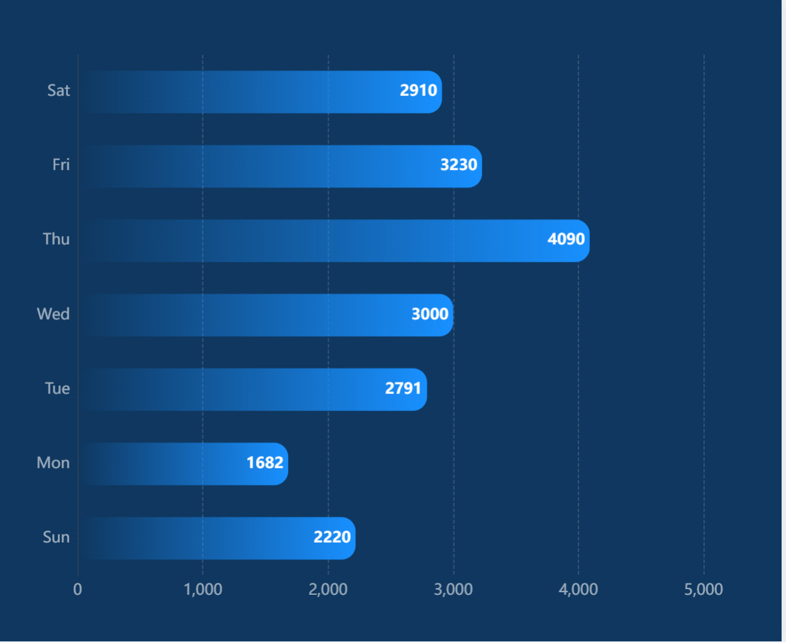

# 柱形图

## 柱形比例图：BarRateCharts


### js

```js
// 1. 数据和名称提取
const data = {
    names: ["故障", "批量", "警戒"],
    // 待确认（外层，通常是总量或背景）
    outerValues: [65, 58, 26],
    // 已确认（内层，通常是实际值）
    innerValues: [24, 38, 15]
};

// 2. 名称和标题提取
const outerName = "已确认"; // 对应 series[1]
const innerName = "待确认"; // 对应 series[0]
const chartTitle = "单位:个";

// 柱子的圆角设置
const borderRadius = [10, 10, 0, 0]; // 顶部圆角，底部直角

option = {
    // 你的代码
    backgroundColor: "#2b2b2b",
    title: {
        text: chartTitle,
        top: 50,
        left: 0,
        textStyle: {
            color: "#C5E5F9",
            fontSize: 18
        },
    },
    grid: {
        top: 100,
        left: 20,
        right: 20,
        bottom: 20,
        containLabel: true,
    },
    legend: {
        icon: "rect",
        itemWidth: 15,
        itemHeight: 10,
        right: 0,
        top: 50,
        itemGap: 20,
        data: [innerName, outerName], // 使用提取的名称
        textStyle: {
            color: "#BCE6FF",
            fontSize: 18
        },
    },
    tooltip: {
        trigger: "axis",
        axisPointer: {
            type: "shadow",
        },
        backgroundColor: "rgba(9, 24, 48, 0.8)",
        borderColor: "rgba(75, 253, 238, 0.6)",
        textStyle: {
            color: "#C5E5F9",
            fontSize: 18
        },
        // 4. 添加显示内层占比外层的逻辑
        formatter: function (params) {
            let tooltip = `<div>${params[0].name}</div>`;
            let outerValue = 0; // 对应已确认
            let innerValue = 0; // 对应待确认
            
            // 找出 innerName (待确认) 和 outerName (已确认) 对应的数据
            params.forEach(function (item) {
                if (item.seriesName === innerName) {
                    innerValue = item.value;
                } else if (item.seriesName === outerName) {
                    outerValue = item.value;
                }
                
                // 默认的 tooltip 内容
                tooltip += `<div style="display:flex; justify-content: space-between; align-items: center;">
                                <span style="display:inline-block; margin-right:5px; border-radius:10px; width:10px; height:10px; background-color:${item.color};"></span>
                                ${item.seriesName}: 
                                <span style="font-weight: bold; margin-left: 20px;">${item.value}</span>
                            </div>`;
            });
            
            // 计算占比
            let ratio = 0;
            if (outerValue > 0) {
                // 计算内层 (innerValue) 占外层 (outerValue) 的百分比
                ratio = (innerValue / outerValue) * 100;
            }
            
            // 只有当两个数据都存在时才显示占比
            if (outerValue > 0 || innerValue > 0) {
                 tooltip += `<div style="margin-top: 5px; padding-top: 5px; border-top: 1px dashed rgba(255,255,255,0.3);">
                                **${innerName}** 占比 **${outerName}**: 
                                <span style="color: #41EDFF; font-weight: bold;">${ratio.toFixed(2)}%</span>
                            </div>`;
            }

            return tooltip;
        }
    },
    xAxis: {
        type: "category",
        data: data.names, // 使用提取的 xdata
        axisLine: {
            lineStyle: {
                color: "rgba(118, 169, 250, .8)",
            },
        },
        axisTick: {
            show: false,
        },
        axisLabel: {
            interval: 0,
            color: "#C5E5F9",
            fontSize: 18,
            margin: 20
        },
    },
    yAxis: {
        type: "value",
        axisTick: {
            show: false,
        },
        axisLine: {
            show: false,
        },
        axisLabel: {
            color: "#C5E5F9",
            fontSize: 18,
            margin: 40,
        },
        splitLine: {
            show: true,
            lineStyle: {
                type: "dashed",
                color: "rgba(118, 169, 250, .5)",
            },
        },
    },
    series: [
        {
            name: innerName, // 待确认 (内层)
            type: "bar",
            // 3. 外层（已确认）添加圆角，但由于这是内层，它应该在内侧，所以不加圆角
            // 保持原样，或者如果希望它也显示圆角，可以在此添加
            itemStyle: {
                color: new echarts.graphic.LinearGradient(0, 0, 0, 1, [
                    { offset: 0, color: '#41EDFF' },
                    { offset: 1, color: 'rgba(65,237,255,0)' },
                ]),
                // barBorderRadius: borderRadius // 如果需要内层也加圆角
            },
            data: data.innerValues, // 使用提取的 innerValues
            label: {
                show: true,
                position: 'top',
                color: '#fff',
                fontSize: 24,
            },
            z: 10, // 确保内层在上面
        },
        {
            name: outerName, // 已确认 (外层)
            type: "bar",
            barGap: '-100%', // 实现重叠效果
            // 3. 外层添加圆角
            itemStyle: {
                color: new echarts.graphic.LinearGradient(0, 0, 0, 1, [
                    { offset: 0, color: '#62E9C1' },
                    { offset: 1, color: 'rgba(98,233,193,0)' },
                ]),
                barBorderRadius: borderRadius, // **在这里添加圆角**
            },
            data: data.outerValues, // 使用提取的 outerValues
            label: {
                show: true,
                position: 'top',
                color: '#fff',
                fontSize: 24,
            },
            z: 5, // 确保外层在下面
        },
    ]
};
```

### Vue2

```js
<template>
  <div :class="className" :style="{ height, width }" ref="chartRef"></div>
</template>

<script>
// 确保您已安装并引入 ECharts 库
import * as echarts from 'echarts'

export default {
  name: 'BarRateCharts', // 组件名称

  // 定义 Props
  props: {
    className: {
      type: String,
      default: 'chart'
    },
    width: {
      type: String,
      default: '100%'
    },
    height: {
      type: String,
      default: '300px' // 默认高度
    },
    // 图表标题
    chartTitle: {
      type: String,
      default: '单位:个'
    },
    // 内层系列名称 (例如: 待确认)
    innerName: {
      type: String,
      default: '待确认'
    },
    // 外层系列名称 (例如: 已确认)
    outerName: {
      type: String,
      default: '已确认'
    },
    // 核心图表数据
    chartData: {
      type: Object,
      default: () => ({
        names: ['Sun', 'Mon', 'Tue', 'Wed', 'Thu', 'Fri', 'Sat'],
        outerValues: [2220, 1682, 2791, 3000, 4090, 3230, 2910], // 外层/背景/总量 (通常值较大)
        innerValues: [1220, 682, 791, 1000, 2090, 2230, 1910]  // 内层/前景/实际值 (通常值较小)
      })
    }
  },

  data() {
    return {
      chart: null // ECharts 实例
    }
  },

  watch: {
    // 深度侦听 chartData 的变化，如果数据更新，则重绘图表
    chartData: {
      deep: true,
      handler(val) {
        this.setOptions(val)
      }
    },
    // 侦听名称和标题变化
    chartTitle: 'setOptions',
    innerName: 'setOptions',
    outerName: 'setOptions'
  },

  mounted() {
    this.$nextTick(() => {
      this.initChart()
      // 监听窗口大小变化以适应图表
      window.addEventListener('resize', this.handleResize)
    })
  },

  beforeDestroy() {
    window.removeEventListener('resize', this.handleResize)
    if (this.chart) {
      this.chart.dispose()
      this.chart = null
    }
  },

  methods: {
    /**
     * 初始化图表实例
     */
    initChart() {
      if (!this.$refs.chartRef) return

      if (this.chart) {
        this.chart.dispose()
        this.chart = null
      }

      this.chart = echarts.init(this.$refs.chartRef)
      this.setOptions(this.chartData)
    },

    /**
     * 设置 ECharts 配置项并渲染图表
     * @param {Object} data - 从 this.chartData 传入的数据
     */
    setOptions(data) {
      if (!this.chart || !data || !data.outerValues || data.outerValues.length === 0) return

      const innerName = this.innerName
      const outerName = this.outerName

      // 柱子的圆角设置 (顶部圆角，底部直角)
      const borderRadius = [10, 10, 0, 0]

      const option = {
        title: {
          text: this.chartTitle,
          top: 20,
          left: 0,
          textStyle: {
            color: '#C5E5F9',
            fontSize: 18
          }
        },
        grid: {
          top: 80,
          left: 10,
          right: 10,
          bottom: '10%',
          containLabel: true
        },
        legend: {
          icon: 'rect',
          itemWidth: 15,
          itemHeight: 10,
          right: 0,
          top: 30,
          itemGap: 20,
          data: [innerName, outerName], // 使用 Props 中的名称
          textStyle: {
            color: '#BCE6FF',
            fontSize: 18
          }
        },
        tooltip: {
          trigger: 'axis',
          axisPointer: {
            type: 'shadow'
          },
          backgroundColor: 'rgba(9, 24, 48, 0.8)',
          borderColor: 'rgba(75, 253, 238, 0.6)',
          textStyle: {
            color: '#C5E5F9',
            fontSize: 18
          },
          // 添加显示内层占比外层的逻辑
          formatter: function(params) {
            let tooltip = `<div>${params[0].name}</div>`
            let outerValue = 0
            let innerValue = 0

            // 找出 innerName (待确认) 和 outerName (已确认) 对应的数据
            params.forEach(function(item) {
              if (item.seriesName === innerName) {
                innerValue = item.value
              } else if (item.seriesName === outerName) {
                outerValue = item.value
              }

              // 默认的 tooltip 内容
              tooltip += `<div style="display:flex; justify-content: space-between; align-items: center;">
                                    <span style="display:inline-block; margin-right:5px; border-radius:10px; width:10px; height:10px; background-color:${item.color};"></span>
                                    ${item.seriesName}:
                                    <span style="font-weight: bold; margin-left: 20px;">${item.value}</span>
                                </div>`
            })

            // 计算占比
            let ratio = 0
            if (outerValue > 0) {
              ratio = (innerValue / outerValue) * 100
            }

            // 只有当至少一个数据存在时才显示占比
            if (outerValue > 0 || innerValue > 0) {
              tooltip += `<div style="margin-top: 5px; padding-top: 5px; border-top: 1px dashed rgba(255,255,255,0.3);">
                                     占比:
                                    <span style="color: #41EDFF; font-weight: bold;">${ratio.toFixed(2)}%</span>
                                </div>`
            }

            return tooltip
          }
        },
        xAxis: {
          type: 'category',
          data: data.names, // 使用提取的 xdata
          axisLine: {
            lineStyle: {
              color: 'rgba(118, 169, 250, .8)'
            }
          },
          axisTick: { show: false },
          axisLabel: {
            interval: 0,
            color: '#C5E5F9',
            fontSize: 12,
            margin: 20
          }
        },
        yAxis: {
          type: 'value',
          axisTick: { show: false },
          axisLine: { show: false },
          axisLabel: {
            color: '#C5E5F9',
            fontSize: 18,
            margin: 40
          },
          splitLine: {
            show: true,
            lineStyle: {
              type: 'dashed',
              color: 'rgba(118, 169, 250, .5)'
            }
          }
        },
        dataZoom: [
          {
            type: 'slider', // 滑块型 dataZoom (拖动条)
            show: true,
            xAxisIndex: [0],
            start: 0,        // 初始显示范围起始
            end: 100,      // 初始显示范围结束
            height: 20,
            bottom: '2%',    // 放置在底部
            textStyle: {
              color: '#ccc'
            }
          },
          {
            type: 'inside', // 内置型 dataZoom (鼠标滚轮/触摸板操作)
            xAxisIndex: [0],
            start: 0,
            end: 100
          }
        ],
        series: [
          {
            name: innerName, // 待确认 (内层)
            type: 'bar',
            itemStyle: {
              color: new echarts.graphic.LinearGradient(0, 0, 0, 1, [
                { offset: 0, color: '#41EDFF' },
                { offset: 1, color: 'rgba(65,237,255,0)' }
              ]),
              barBorderRadius: borderRadius // **内层添加圆角**
            },
            data: data.innerValues, // 使用提取的 innerValues
            label: {
              show: true,
              position: 'top',
              color: '#fff',
              fontSize: 16
            },
            z: 10 // 确保内层在上面
          },
          {
            name: outerName, // 已确认 (外层)
            type: 'bar',
            barGap: '-100%', // 实现重叠效果
            itemStyle: {
              color: new echarts.graphic.LinearGradient(0, 0, 0, 1, [
                { offset: 0, color: '#62E9C1' },
                { offset: 1, color: 'rgba(98,233,193,0)' }
              ]),
              barBorderRadius: borderRadius // **外层添加圆角**
            },
            data: data.outerValues, // 使用提取的 outerValues
            label: {
              show: true,
              position: 'top',
              color: '#fff',
              fontSize: 16
            },
            z: 5 // 确保外层在下面
          }
        ]
      }

      this.chart.setOption(option, true)
    },

    /**
     * 处理窗口大小变化，重绘图表
     */
    handleResize() {
      this.chart && this.chart.resize()
    }
  }
}
</script>

<style scoped>
.chart {
  /* 确保容器有高度才能显示图表 */
  overflow: hidden;
}
</style>
```


## 3D立体饼图：Bar3DStereoscopicCharts


### js

```js
// 核心输入数据
const CHART_DATA = {
    names: ['1月', '2月', '3月', '4月', '5月', '6月', '7月'],
    values: [210.9, 260.8, 204.2, 504.9, 740.5, 600.3, 119.0]
};

// --- 动态计算 Y 轴的最大值和背景高度 (确保刻度均匀且自适应) ---

const actualMaxValue = Math.max(...CHART_DATA.values, 0);

// 1. 计算出所需的最小最大值 (740.5 * 1.2 = 888.6)
const minMaxRequired = actualMaxValue * 1.2; 

/**
 * 动态计算 Y 轴的最大值，确保它是美观且均匀的刻度间隔的倍数。
 * @param {number} value - 需要圆整的数值 (minMaxRequired)
 * @param {number} ticks - 期望的主刻度数量（不包括 0）
 * @returns {number} 经过圆整后的 Y 轴最大值
 */
function calculateRoundedMax(value, ticks = 5) {
    if (value === 0) return 1;

    // 粗略计算间隔（例如 888.6 / 5 ≈ 177.72）
    const roughInterval = value / ticks;
    
    // 找到最接近的 10 的幂次作为基数（例如 177.72 -> 100）
    const powerOfTen = Math.pow(10, Math.floor(Math.log10(roughInterval)));
    
    // 检查粗略间隔是基数的 1, 2, 5 倍中最接近且大于它的圆整数
    const rounders = [1, 2, 5, 10];
    let roundedInterval;
    
    for (const r of rounders) {
        roundedInterval = r * powerOfTen;
        // 如果圆整后的间隔大于粗略间隔，则使用它
        if (roundedInterval >= roughInterval) {
            break;
        }
    }
    
    // 用圆整后的间隔，计算最终的 max 值 (例如 888.6 / 200 = 4.443 -> ceil(4.443) = 5 -> 5 * 200 = 1000)
    return Math.ceil(value / roundedInterval) * roundedInterval;
}

const MAX_Y_VALUE = calculateRoundedMax(minMaxRequired); 
// 对于 888.6，计算出的圆整间隔是 200，MAX_Y_VALUE 结果是 1000。

// 背景柱的高度数组
const MAX_DATA = CHART_DATA.values.map(() => MAX_Y_VALUE);
const VALUE_DATA = CHART_DATA.values;

// 定义渐变色
const mainColorGradient = new echarts.graphic.LinearGradient(1, 1, 1, 0, [
    { offset: 0, color: " #0097C8" },
    { offset: 1, color: "#4CF0F9" },
]);

// --- 立方体图形定义 ---

// 绘制左侧面 (CubeLeft)
const CubeLeft = echarts.graphic.extendShape({
    shape: { x: 0, y: 0 },
    buildPath: function (ctx, shape) {
        const xAxisPoint = shape.xAxisPoint;
        const c0 = [shape.x, shape.y];
        const c1 = [shape.x - 13, shape.y - 13];
        const c2 = [xAxisPoint[0] - 13, xAxisPoint[1] - 13];
        const c3 = [xAxisPoint[0], xAxisPoint[1]];
        ctx.moveTo(c0[0], c0[1]).lineTo(c1[0], c1[1]).lineTo(c2[0], c2[1]).lineTo(c3[0], c3[1]).closePath();
    }
});

// 绘制右侧面 (CubeRight)
const CubeRight = echarts.graphic.extendShape({
    shape: { x: 0, y: 0 },
    buildPath: function (ctx, shape) {
        const xAxisPoint = shape.xAxisPoint;
        const c1 = [shape.x, shape.y];
        const c2 = [xAxisPoint[0], xAxisPoint[1]];
        const c3 = [xAxisPoint[0] + 18, xAxisPoint[1] - 9];
        const c4 = [shape.x + 18, shape.y - 9];
        ctx.moveTo(c1[0], c1[1]).lineTo(c2[0], c2[1]).lineTo(c3[0], c3[1]).lineTo(c4[0], c4[1]).closePath();
    }
});

// 绘制顶面 (CubeTop)
const CubeTop = echarts.graphic.extendShape({
    shape: { x: 0, y: 0 },
    buildPath: function (ctx, shape) {
        const c1 = [shape.x, shape.y];
        const c2 = [shape.x + 18, shape.y - 9];
        const c3 = [shape.x + 5, shape.y - 22];
        const c4 = [shape.x - 13, shape.y - 13];
        ctx.moveTo(c1[0], c1[1]).lineTo(c2[0], c2[1]).lineTo(c3[0], c3[1]).lineTo(c4[0], c4[1]).closePath();
    }
});

// 注册图形
echarts.graphic.registerShape('CubeLeft', CubeLeft);
echarts.graphic.registerShape('CubeRight', CubeRight);
echarts.graphic.registerShape('CubeTop', CubeTop);

// --- ECharts 配置项 ---
const option = {
    title: {
        text: '3D 立方柱状图',
        x: 'center',
        textStyle: {
            color: '#fff',
            fontSize: 20
        }
    },
    backgroundColor: 'rgba(17, 42, 62, 1)',
    tooltip: {
        trigger: 'axis',
        axisPointer: {
            type: 'shadow'
        },
        backgroundColor: 'transparent',
        borderWidth: 0,
        textStyle: {
            color: '#FFF'
        },
        formatter: function (params) {
            const item = params.find(p => p.seriesIndex === 1); 
            if (item) {
                return item.name + ' : ' + item.value;
            }
            return '';
        }
    },
    grid: {
        left: 40,
        right: 40,
        bottom: 100,
        top: 100,
        containLabel: true
    },
    xAxis: {
        type: 'category',
        data: CHART_DATA.names,
        axisLine: {
            show: true,
            lineStyle: {
                color: 'white'
            }
        },
        offset: 25,
        axisTick: {
            show: false,
            length: 9,
            alignWithLabel: true,
            lineStyle: {
                color: '#7DFFFD'
            }
        },
        axisLabel: {
            show: true,
            fontSize: 16
        },
    },
    yAxis: {
        min: 0,
        max: MAX_Y_VALUE, // 使用自适应计算的最大值 (1000)
        type: 'value',
        // ECharts 会自动根据 max=1000 和默认设置生成均匀刻度
        axisLine: {
            show: false,
            lineStyle: {
                color: 'white'
            }
        },
        splitLine: {
            show: true,
            lineStyle: {
                type: "dashed",
                color: "rgba(255,255,255,0.1)"
            },
        },
        axisTick: {
            show: false
        },
        axisLabel: {
            show: true,
            fontSize: 16,
        },
        boundaryGap: ['20%', '20%']
    },
    series: [
        // Series 0: 背景柱 (MAX)
        {
            type: 'custom',
            renderItem: function (params, api) {
                const location = api.coord([api.value(0), api.value(1)]);
                return {
                    type: 'group',
                    children: [{
                        type: 'CubeLeft',
                        shape: { api, x: location[0], y: location[1], xAxisPoint: api.coord([api.value(0), 0]) },
                        style: { fill: '#18385A' }
                    }, {
                        type: 'CubeRight',
                        shape: { api, x: location[0], y: location[1], xAxisPoint: api.coord([api.value(0), 0]) },
                        style: { fill: '#33718E' }
                    }, {
                        type: 'CubeTop',
                        shape: { api, x: location[0], y: location[1] },
                        style: { fill: '#307E8E' }
                    }]
                };
            },
            data: MAX_DATA
        }, 
        // Series 1: 实际值柱 (VALUE)
        {
            type: 'custom',
            renderItem: (params, api) => {
                const location = api.coord([api.value(0), api.value(1)]);
                const isLastTwoBars = api.value(0) === VALUE_DATA.length - 2 || api.value(0) === VALUE_DATA.length - 1;
                
                const color = isLastTwoBars ? 'red' : mainColorGradient;

                return {
                    type: 'group',
                    children: [{
                        type: 'CubeLeft',
                        shape: { api, x: location[0], y: location[1], xAxisPoint: api.coord([api.value(0), 0]) },
                        style: { fill: color }
                    }, {
                        type: 'CubeRight',
                        shape: { api, x: location[0], y: location[1], xAxisPoint: api.coord([api.value(0), 0]) },
                        style: { fill: color }
                    }, {
                        type: 'CubeTop',
                        shape: { api, x: location[0], y: location[1] },
                        style: { fill: color }
                    }]
                };
            },
            data: VALUE_DATA
        }, 
        // Series 2: 透明柱 (Tooltip Trigger)
        {
            type: 'bar',
            itemStyle: {
                color: 'transparent',
            },
            data: MAX_DATA
        }
    ]
};
```

### vue2

```js
<template>
  <div :class="className" :style="{ height, width }" ref="chartRef"></div>
</template>

<script>
// 确保您已安装并引入 ECharts 库，例如: import * as echarts from 'echarts';
import * as echarts from 'echarts';

// --- ECharts 自定义图形注册 (Custom Shapes) ---

// 绘制左侧面 (Draw the left face of the cube)
const CubeLeft = echarts.graphic.extendShape({
  shape: { x: 0, y: 0 },
  buildPath: function (ctx, shape) {
    const xAxisPoint = shape.xAxisPoint;
    const c0 = [shape.x, shape.y];
    const c1 = [shape.x - 13, shape.y - 13];
    const c2 = [xAxisPoint[0] - 13, xAxisPoint[1] - 13];
    const c3 = [xAxisPoint[0], xAxisPoint[1]];
    ctx.moveTo(c0[0], c0[1]).lineTo(c1[0], c1[1]).lineTo(c2[0], c2[1]).lineTo(c3[0], c3[1]).closePath();
  }
});

// 绘制右侧面 (Draw the right face of the cube)
const CubeRight = echarts.graphic.extendShape({
  shape: { x: 0, y: 0 },
  buildPath: function (ctx, shape) {
    const xAxisPoint = shape.xAxisPoint;
    const c1 = [shape.x, shape.y];
    const c2 = [xAxisPoint[0], xAxisPoint[1]];
    const c3 = [xAxisPoint[0] + 18, xAxisPoint[1] - 9];
    const c4 = [shape.x + 18, shape.y - 9];
    ctx.moveTo(c1[0], c1[1]).lineTo(c2[0], c2[1]).lineTo(c3[0], c3[1]).lineTo(c4[0], c4[1]).closePath();
  }
});

// 绘制顶面 (Draw the top face of the cube)
const CubeTop = echarts.graphic.extendShape({
  shape: { x: 0, y: 0 },
  buildPath: function (ctx, shape) {
    const c1 = [shape.x, shape.y];
    const c2 = [shape.x + 18, shape.y - 9];
    const c3 = [shape.x + 5, shape.y - 22];
    const c4 = [shape.x - 13, shape.y - 13];
    ctx.moveTo(c1[0], c1[1]).lineTo(c2[0], c2[1]).lineTo(c3[0], c3[1]).lineTo(c4[0], c4[1]).closePath();
  }
});

// 全局注册三个面图形，确保组件加载时已注册
echarts.graphic.registerShape('CubeLeft', CubeLeft);
echarts.graphic.registerShape('CubeRight', CubeRight);
echarts.graphic.registerShape('CubeTop', CubeTop);

// --- 刻度计算函数 ---

/**
 * 动态计算 Y 轴的最大值，确保它是美观且均匀的刻度间隔的倍数。
 * @param {number} value - 需要圆整的数值 (minMaxRequired)
 * @param {number} ticks - 期望的主刻度数量（不包括 0）
 * @returns {number} 经过圆整后的 Y 轴最大值
 */
function calculateRoundedMax(value, ticks = 5) {
  if (value === 0) return 1;

  // 粗略计算间隔
  const roughInterval = value / ticks;

  // 找到最接近的 10 的幂次作为基数
  const powerOfTen = Math.pow(10, Math.floor(Math.log10(roughInterval)));

  // 检查圆整数：1, 2, 5, 10 倍
  const rounders = [1, 2, 5, 10];
  let roundedInterval;

  for (const r of rounders) {
    roundedInterval = r * powerOfTen;
    // 如果圆整后的间隔大于粗略间隔，则使用它
    if (roundedInterval >= roughInterval) {
      break;
    }
  }

  // 用圆整后的间隔，计算最终的 max 值
  return Math.ceil(value / roundedInterval) * roundedInterval;
}


// --- Vue 组件定义 ---
export default {
  name: 'Bar3DStereoscopicCharts', // 组件名称

  // 定义 Props
  props: {
    className: {
      type: String,
      default: 'chart'
    },
    width: {
      type: String,
      default: '100%'
    },
    height: {
      type: String,
      default: '100%'
    },
    // 自定义标题
    chartTitle: {
      type: String,
      default: 'bar-horizontal-charts'
    },
    // 核心图表数据，包含 names (x轴) 和 values (y轴)
    chartData: {
      type: Object,
      default: () => ({
        names: ['1月', '2月', '3月', '4月', '5月', '6月', '7月'],
        values: [210.9, 260.8, 204.2, 504.9, 740.5, 600.3, 119.0]
      })
    }
  },

  data() {
    return {
      chart: null, // ECharts 实例
    };
  },

  watch: {
    // 深度侦听 chartData 的变化，如果数据更新，则重绘图表
    chartData: {
      deep: true,
      handler(val) {
        this.setOptions(val);
      }
    },
    // 侦听标题变化
    chartTitle: {
      handler() {
        this.setOptions(this.chartData);
      }
    }
  },

  mounted() {
    this.$nextTick(() => {
      this.initChart();
      // 监听窗口大小变化以适应图表
      window.addEventListener('resize', this.handleResize);
    });
  },

  beforeDestroy() {
    window.removeEventListener('resize', this.handleResize);
    if (this.chart) {
      this.chart.dispose();
      this.chart = null;
    }
  },

  methods: {
    /**
     * 初始化图表实例
     */
    initChart() {
      if (!this.$refs.chartRef) return;

      if (this.chart) {
        this.chart.dispose();
        this.chart = null;
      }

      this.chart = echarts.init(this.$refs.chartRef);
      this.setOptions(this.chartData);
    },

    /**
     * 设置 ECharts 配置项并渲染图表
     * @param {Object} data - 从 this.chartData 传入的数据 { names: [], values: [] }
     */
    setOptions(data) {
      if (!this.chart || !data || !data.values || data.values.length === 0) return;

      // --- 动态数据计算 ---
      const actualMaxValue = Math.max(...data.values, 0);

      // 1. 计算出所需的最小最大值 (Max * 1.2)
      const minMaxRequired = actualMaxValue * 1.2;

      // 2. 使用动态函数计算美观的 MAX_Y_VALUE (例如 888.6 -> 1000)
      const MAX_Y_VALUE = calculateRoundedMax(minMaxRequired);

      // 背景（最大高度）数组
      const MAX_DATA = data.values.map(() => MAX_Y_VALUE);
      const VALUE_DATA = data.values;

      // 定义渐变色
      const mainColorGradient = new echarts.graphic.LinearGradient(1, 1, 1, 0, [
        { offset: 0, color: " #0097C8" }, // 底部
        { offset: 1, color: "#4CF0F9" }, // 顶部
      ]);

      // --- ECharts Option ---
      const option = {
        // === 标题，使用 chartTitle prop ===
        title: {
          text: this.chartTitle,
          x: 'center',
          textStyle: {
            color: '#fff',
            fontSize: 20
          }
        },
        tooltip: {
          trigger: 'axis',
          axisPointer: { type: 'shadow' },
          backgroundColor: 'transparent',
          borderWidth: 0,
          textStyle: { color: '#FFF' },
          formatter: function (params) {
            const item = params.find(p => p.seriesIndex === 1);
            if (item) {
              return item.name + ' : ' + item.value;
            }
            return '';
          }
        },
        grid: {
          left: 40,
          right: 40,
          bottom: 40,
          top: 100,
          containLabel: true
        },
        xAxis: {
          type: 'category',
          data: data.names, // 使用传入的 names
          axisLine: {
            show: true,
            lineStyle: { color: 'white' }
          },
          offset: 25,
          axisTick: {
            show: false,
            length: 9,
            alignWithLabel: true,
            lineStyle: { color: '#7DFFFD' }
          },
          axisLabel: {
            show: true,
            fontSize: 16
          },
        },
        yAxis: {
          min: 0,
          max: MAX_Y_VALUE, // 动态设置美观的最大值
          type: 'value',
          axisLine: { show: false, lineStyle: { color: 'white' } },
          splitLine: {
            show: true,
            lineStyle: { type: "dashed", color: "rgba(255,255,255,0.1)" },
          },
          axisTick: { show: false },
          axisLabel: { show: true, fontSize: 16 },
          boundaryGap: ['20%', '20%']
        },
        series: [
          // 0. 背景柱 (MAX) - 灰色
          {
            type: 'custom',
            renderItem: function (params, api) {
              const location = api.coord([api.value(0), api.value(1)]);
              return {
                type: 'group',
                children: [{
                  type: 'CubeLeft',
                  shape: { api, x: location[0], y: location[1], xAxisPoint: api.coord([api.value(0), 0]) },
                  style: { fill: '#18385A' }
                }, {
                  type: 'CubeRight',
                  shape: { api, x: location[0], y: location[1], xAxisPoint: api.coord([api.value(0), 0]) },
                  style: { fill: '#33718E' }
                }, {
                  type: 'CubeTop',
                  shape: { api, x: location[0], y: location[1] },
                  style: { fill: '#307E8E' }
                }]
              };
            },
            data: MAX_DATA
          },
          // 1. 实际值柱 (VALUE) - 渐变色或红色
          {
            type: 'custom',
            renderItem: (params, api) => {
              const location = api.coord([api.value(0), api.value(1)]);
              // 根据当前索引判断是否是最后两项
              const isLastTwoBars = api.value(0) === VALUE_DATA.length - 2 || api.value(0) === VALUE_DATA.length - 1;

              const color = isLastTwoBars ? 'red' : mainColorGradient;

              return {
                type: 'group',
                children: [{
                  type: 'CubeLeft',
                  shape: { api, x: location[0], y: location[1], xAxisPoint: api.coord([api.value(0), 0]) },
                  style: { fill: color }
                }, {
                  type: 'CubeRight',
                  shape: { api, x: location[0], y: location[1], xAxisPoint: api.coord([api.value(0), 0]) },
                  style: { fill: color }
                }, {
                  type: 'CubeTop',
                  shape: { api, x: location[0], y: location[1] },
                  style: { fill: color }
                }]
              };
            },
            data: VALUE_DATA
          },
          // 2. 透明柱 (MAX) - 用于触发 tooltip
          {
            type: 'bar',
            itemStyle: {
              color: 'transparent',
            },
            data: MAX_DATA
          }
        ]
      };

      this.chart.setOption(option, true);
    },

    /**
     * 处理窗口大小变化，重绘图表
     */
    handleResize() {
      this.chart?.resize();
    }
  }
};
</script>

<style scoped>
.chart {
  /* 确保容器有高度才能显示图表 */
  overflow: hidden;
}
</style>

```


## 横向柱形图：BarHorizontalCharts



### js

```js
// 您的新数据
const names = ['Sun', 'Mon', 'Tue', 'Wed', 'Thu', 'Fri', 'Sat'];
const values = [2220, 1682, 2791, 3000, 4090, 3230, 2910];

option = {
    backgroundColor: "#0f375f",
    // === 修改：配置 tooltip (工具提示) ===
    tooltip: {
        trigger: 'axis', // 坐标轴触发
        axisPointer: {
            type: 'shadow' // 阴影指示器，适用于柱状图
        },
        // 1. 设置背景为半透明深色
        backgroundColor: 'rgba(30, 30, 30, 0.7)', 
        borderWidth: 0, // 移除边框
        padding: [10, 15],
        textStyle: {
            color: '#fff', // 文本颜色设为白色
        },
        // 2. 自定义提示框内容格式，加入 title
        formatter: function (params) {
            const seriesName = params[0].seriesName || '值';
            const categoryName = params[0].name; // Y轴的类目名称，用作标题
            const value = params[0].value;    // X轴的数值

            let html = `
                <div style="font-size: 16px; font-weight: bold; margin-bottom: 5px;">${categoryName}</div>
                ${params[0].marker} ${seriesName}: ${value}
            `;
            return html;
        }
    },
    // ======================================
    barWidth: 15,
    xAxis: {
        type: 'value',
        splitLine: {
            lineStyle: {
                color: "rgba(255,255,255,0.2)",
                type: 'dashed'
            }
        },
        axisTick: {
            show: false
        },
        axisLabel: {
            textStyle: {
                color: "rgba(250,250,250,0.6)",
                fontSize: 16
            }
        }
    },
    yAxis: {
        type: 'category',
        data: names,
        splitLine: {
            show: false
        },
        axisTick: {
            show: false
        },
        axisLine: {
            lineStyle: {
                color: '#2c4054'
            }
        },
        axisLabel: {
            textStyle: {
                color: "rgba(250,250,250,0.6)",
                fontSize: 16
            }
        }
    },
    series: [{
        type: 'bar',
        name: "产出",
        barWidth: 45,
        itemStyle: {
            normal: {
                label: {
                    show: true, 
                    position: "insideRight", 
                    textStyle: {
                        color: "#FFFFFF",
                        fontSize: 16,
                        fontWeight: 600
                    }
                },
                color: new echarts.graphic.LinearGradient(1, 0, 0, 0, [{
                    offset: 0,
                    color: 'rgba(24,144,255,1)'
                }, {
                    offset: 1,
                    color: 'rgba(24,144,255,0)'
                }]),
                barBorderRadius: 15
            }
        },
        data: values
    }]
};
```

### vue2

```js
<template>
  <div :class="className" :style="{ height, width }" ref="chartRef"></div>
</template>

<script>
// 引入 ECharts 核心模块
import * as echarts from 'echarts';

export default {
  name: 'BarHorizontalCharts', // 组件名称设置为 BarHorizontalCharts

  props: {
    className: {
      type: String,
      default: 'chart'
    },
    width: {
      type: String,
      default: '100%'
    },
    height: {
      type: String,
      default: '100%'
    },
    // 核心数据：包含 names (Y轴类目) 和 values (X轴数值)
    chartData: {
      type: Object,
      default: () => ({
        names: ['Sun', 'Mon', 'Tue', 'Wed', 'Thu', 'Fri', 'Sat'],
        values: [2220, 1682, 2791, 3000, 4090, 3230, 2910]
      })
    },
    chartTitle: { type: String, default: 'bar-horizontal-charts' },
    chartName: { type: String, default: '' }
  },

  data() {
    return {
      chart: null // ECharts 实例
    };
  },

  watch: {
    // 深度侦听 chartData 的变化
    chartData: {
      deep: true,
      handler(val) {
        this.setOptions(val);
      }
    },
    // 侦听容器宽高的变化
    width() {
      this.$nextTick(() => this.resizeChart());
    },
    height() {
      this.$nextTick(() => this.resizeChart());
    }
  },

  mounted() {
    this.$nextTick(() => {
      this.initChart();
      window.addEventListener('resize', this.handleResize);
    });
  },

  beforeDestroy() {
    if (this.chart) {
      this.chart.dispose();
      this.chart = null;
    }
    window.removeEventListener('resize', this.handleResize);
  },

  methods: {
    /**
     * 初始化图表实例
     */
    initChart() {
      if (!this.$refs.chartRef) return;

      if (this.chart) {
        this.chart.dispose();
        this.chart = null;
      }

      this.chart = echarts.init(this.$refs.chartRef);
      this.setOptions(this.chartData);
    },

    /**
     * 设置 ECharts 配置项
     * @param {Object} data - 从 this.chartData 传入的数据
     */
    setOptions(data) {
      if (!this.chart) return;
      if (!data || !data.names || !data.values) {
        console.warn("ECharts: 传入的 chartData 无效。");
        return;
      }

      const { names, values } = data;

      const option = {
        title: {
          text: this.chartTitle,
          textStyle: {
            color: '#ccc'
          },
          left:'2%'
        },
        // === Tooltip 配置 (透明背景, 标题) ===
        tooltip: {
          trigger: 'axis',
          axisPointer: {
            type: 'shadow'
          },
          // 设置背景为半透明深色
          backgroundColor: 'rgba(30, 30, 30, 0.7)',
          borderWidth: 0,
          padding: [10, 15],
          textStyle: {
            color: '#fff',
          },
          // 自定义格式，将 Y 轴类目名作为标题
          formatter: function (params) {
            const categoryName = params[0].name;
            const value = params[0].value;

            return `
                <div style="font-size: 16px; font-weight: bold; margin-bottom: 5px;">${categoryName}</div>
                ${params[0].marker} ${value}
            `;
          }
        },
        // ======================================

        barWidth: 10,
        grid: { // 增加 grid 属性以确保图表居中和留白
          left: '3%',
          right: '5%',
          bottom: '3%',
          top: '10%',
          containLabel: true
        },
        xAxis: {
          type: 'value',
          splitLine: {
            lineStyle: {
              color: "rgba(255,255,255,0.2)",
              type: 'dashed'
            }
          },
          axisTick: { show: false },
          axisLabel: {
            textStyle: {
              color: "rgba(250,250,250,0.6)",
              fontSize: 16
            }
          }
        },
        yAxis: {
          type: 'category',
          data: names, // 使用传入的 names
          splitLine: { show: false },
          axisTick: { show: false },
          axisLine: {
            lineStyle: { color: '#2c4054' }
          },
          axisLabel: {
            textStyle: {
              color: "rgba(250,250,250,0.6)",
              fontSize: 16
            }
          }
        },
        series: [{
          type: 'bar',
          name: this.chartName,
          barWidth: 20,
          itemStyle: {
            normal: {
              label: {
                show: true,
                position: "insideRight",
                textStyle: {
                  color: "#FFFFFF",
                  fontSize: 16,
                  fontWeight: 600
                }
              },
              // 渐变色配置
              color: new echarts.graphic.LinearGradient(1, 0, 0, 0, [{
                offset: 0,
                color: 'rgba(24,144,255,1)'
              }, {
                offset: 1,
                color: 'rgba(24,144,255,0)'
              }]),
              barBorderRadius: 15
            }
          },
          data: values // 使用传入的 values
        }]
      };

      // 应用配置项，使用 true 确保完全替换
      this.chart.setOption(option, true);
    },

    /**
     * 处理窗口大小变化，重绘图表
     */
    handleResize() {
      this.chart?.resize();
    }
  }
};
</script>

<style scoped>
/* 确保图表容器有正确的布局 */
.chart {
  overflow: hidden;
}
</style>
```


## 自动轮播折线柱形图-BarAutoCarouselCharts


### JS

```js
/* 数据 */
let names = ['2018', '2019', '2020', '2021', '2022'];
let values = [273, 372, 160, 255, 180];

// 调整图例数据
const legendData = ['项目数'];

// 计算总数和平均值
const total = values.reduce((sum, current) => sum + current, 0);
const average = (total / values.length).toFixed(2);

// 计算与上一年的对比数据
const diffData = values.map((value, index) => {
    if (index === 0) {
        return '-';
    }
    const prevValue = values[index - 1];
    const diff = value - prevValue;
    const isIncrease = diff > 0;
    return {
        value: diff,
        isIncrease: isIncrease,
        percent: ((Math.abs(diff) / prevValue) * 100).toFixed(2) + '%'
    };
});

// 假设 myChart 对象已初始化
// var chartDom = document.getElementById('HHH40');
// var myChart = echarts.init(chartDom);

/* ECharts 配置 */
var option = {
    backgroundColor: "#040a11",
    tooltip: {
        trigger: "axis",
        axisPointer: {
            type: 'none'
        },
        position: function (point, params, dom, rect, size) {
            let x = 0;
            let y = 0;
            if (point[0] + size.contentSize[0] < size.viewSize[0]) {
                x = point[0]
            } else if (point[0] > size.contentSize[0]) {
                x = point[0] - size.contentSize[0]
            } else {
                x = "30%"
            }
            if (point[1] > size.contentSize[1]) {
                y = point[1] - size.contentSize[1]
            } else if (point[1] + size.contentSize[1] < size.viewSize[1]) {
                y = point[1]
            } else {
                y = "30%"
            }
            return [x, y];
        },
        formatter: params => {
            const year = params[0].name;
            const projectData = params.find(p => p.seriesName === '项目数');
            if (!projectData) {
                return '';
            }
            const currentYearIndex = names.indexOf(year);
            const diffInfo = diffData[currentYearIndex];
            const diffText = diffInfo === '-' ? `上一年：-` : `上一年：${diffInfo.isIncrease ? '↑' : '↓'}${Math.abs(diffInfo.value)}个 (${diffInfo.percent})`;

            let tooltipContent = `
                <div style="font-size: 14px;font-family: Source Han Sans CN-Medium;font-weight: 500;color: #FFFFFF;margin-bottom:12px;">${year}年</div>
                <div style="font-size: 14px;font-family: Source Han Sans CN-Medium;font-weight: 500;color: #FFFFFF;margin-bottom:4px;">${projectData.seriesName}：${projectData.value}个</div>
                <div style="font-size: 14px;font-family: Source Han Sans CN-Medium;font-weight: 500;color: #FFFFFF;margin-bottom:4px;">${diffText}</div>
                <div style="font-size: 14px;font-family: Source Han Sans CN-Medium;font-weight: 500;color: #FFFFFF;margin-bottom:4px;">平均值：${average}个</div>
            `;
            tooltipContent += `
                ---
                <div style="font-size: 14px;font-family: Source Han Sans CN-Medium;font-weight: 500;color: #FFFFFF;margin-top:12px;">总计：${total}个 | 平均：${average}个</div>
            `;
            return tooltipContent;
        },
        extraCssText: 'opacity: 0.8;background-color:#050F1B;padding:16px;box-shadow: 1px 6px 15px 1px rgba(0,0,0,0.13);border-radius: 4px;filter: blur(undefinedpx);border:none;'
    },
    legend: {
        data: legendData,
        top: "12",
        left: '0',
        itemWidth: 12,
        itemHeight: 12,
        itemGap: 25,
        textStyle: {
            fontSize: 13,
            color: "#82AFC6",
            fontFamily: 'Source Han Sans CN-Normal',
            padding: [0, 0, 0, 2],
        }
    },
    dataZoom: [{
        type: 'inside',
        xAxisIndex: 0,
        filterMode: 'weakFilter',
        zoomOnMouseWheel: true,
        moveOnMouseMove: true,
    }, {
        type: 'slider',
        xAxisIndex: 0,
        filterMode: 'weakFilter',
        height: 20,
        bottom: 10,
        textStyle: {
            color: '#82AFC6'
        },
        handleIcon: 'M10.7,11.9v-1.3H9.3v1.3c-4.9,0.3-8.8,4.4-8.8,9.4c0,5,3.9,9.1,8.8,9.4v1.3h1.3v-1.3c4.9-0.3,8.8-4.4,8.8-9.4C19.5,16.3,15.6,12.2,10.7,11.9z M13.3,24.4H6.7V23h6.6V24.4z M13.3,21.5H6.7V20.1h6.6V21.5z',
        handleSize: '80%',
        showDetail: false
    }],
    grid: {
        top: '10%',
        right: '16',
        left: '16',
        bottom: '20%',
        containLabel: true,
    },
    xAxis: {
        type: 'category',
        data: names,
        axisTick: {
            show: false
        },
        axisLine: {
            lineStyle: {
                color: "#1a6d84"
            }
        },
        axisLabel: {
            show: true,
            textStyle: {
                color: '#82AFC6',
                fontSize: 13,
                fontFamily: 'Source Han Sans CN-Normal',
            }
        },
    },
    yAxis: [{
        type: 'value',
        name: legendData[0],
        boundaryGap: ['0%', '20%'],
        alignTicks: true,
        splitNumber: 5,
        nameTextStyle: {
            color: '#82AFC6',
            fontSize: 13,
            fontFamily: 'Source Han Sans CN-Normal',
            align: "left",
            verticalAlign: "center",
        },
        axisLabel: {
            color: '#82AFC6',
            fontSize: 13,
            fontFamily: 'Source Han Sans CN-Normal',
        },
        axisLine: {
            show: false,
        },
        axisTick: {
            show: false
        },
        splitLine: {
            lineStyle: {
                color: 'rgba(49, 218, 255, 0.5)',
                type: "dashed",
            }
        }
    }],
    series: [{
        type: 'bar',
        name: '项目数',
        data: values,
        itemStyle: {
            color: {
                type: 'linear',
                x: 0,
                y: 0,
                x2: 0,
                y2: 1,
                colorStops: [{
                    offset: 0,
                    color: 'rgba(49, 218, 255, 1)'
                }, {
                    offset: 1,
                    color: 'rgba(3, 21, 50, 1)'
                }],
                global: false
            },
            borderRadius: [4, 4, 0, 0]
        },
        barWidth: 26,
        markLine: {
            data: [{
                name: '平均值',
                yAxis: average,
            }],
            symbol: 'none',
            lineStyle: {
                type: 'dashed',
                color: '#FFD700',
                width: 2
            },
            label: {
                show: false
            }
        }
    }, {
        // 主折线图，用于展示数据和曲线
        type: 'line',
        name: '项目数',
        data: values,
        yAxisIndex: 0,
        symbolSize: 8,
        emphasis: {
            scale: 1.5,
            itemStyle: {
                // 确保高亮时点的颜色和大小符合预期
                color: "rgba(6, 201, 112, 1)",
                borderColor: 'rgba(6, 201, 112, 1)',
                borderWidth: 2,
            }
        },
        areaStyle: {
            color: {
                type: 'linear',
                x: 0,
                y: 0,
                x2: 0,
                y2: 1,
                colorStops: [{
                    offset: 0,
                    color: 'rgba(6, 201, 112, 0.3)'
                }, {
                    offset: 1,
                    color: 'rgba(47,145,255,0)'
                }],
                global: false
            },
        },
        lineStyle: {
            color: "rgba(6, 201, 112, 1)",
            width: 2,
        },
        itemStyle: {
            color: "rgba(6, 201, 112, 1)",
            borderColor: 'rgba(6, 201, 112, 1)',
            borderWidth: 2,
        },
        smooth: true,
    }]
};

// 确保 myChart 对象已初始化
// myChart.setOption(option); 

var count = 0;
var timer = null;
var dataLength = values.length;
timer && clearInterval(timer);

timer = setInterval(() => {
    // 每次更新前先取消所有高亮，以确保只高亮当前点
    myChart.dispatchAction({
        type: 'downplay',
        seriesIndex: 1
    });

    const dataIndex = count % dataLength;

    // 高亮主折线图上的点
    myChart.dispatchAction({
        type: 'highlight',
        seriesIndex: 1, // 目标系列索引
        dataIndex: dataIndex,
    });
    
    // 显示 tooltip
    myChart.dispatchAction({
        type: 'showTip',
        seriesIndex: 1, // 目标系列索引
        dataIndex: dataIndex,
    });
    
    count++;
}, 2000);
```

### Vue3

```js
<template>
  <div :class="className" :style="{ height, width }" ref="chartRef"></div>
</template>

<script setup>
import {ref, onMounted, onBeforeUnmount, watch} from 'vue';
import * as echarts from 'echarts';

// 定义组件接收的属性
const props = defineProps({
  className: {type: String, default: 'chart'},
  width: {type: String, default: '100%'},
  height: {type: String, default: '100%'},
  chartData: {
    type: Object,
    default: () => ({
      names: [
        '2021/09/01', '2021/09/02', '2021/09/03', '2021/09/04', '2021/09/05',
        '2021/09/06', '2021/09/07', '2021/09/08', '2021/09/09', '2021/09/10',
        '2021/09/11', '2021/09/12'
      ],
      values: [67, 97, 80, 76, 52, 63, 24, 97, 56, 78, 84, 45]
    })
  },
  chartName: {type: String, default: '项目数'},
  autoPlay: {type: Boolean, default: true} // 默认开启自动轮播
});

// Vue 3 响应式引用
const chartRef = ref(null);
let myChart = null;
let timer = null;
let count = 0;

/**
 * 辅助函数：计算图表指标（总数、平均值、增减数据）
 */
const calculateChartMetrics = (names, values) => {
  const total = values.reduce((sum, current) => Number(sum) + Number(current), 0);
  const average = (total / values.length).toFixed(2);
  const diffData = values.map((value, index) => {
    if (index === 0) return '-';
    const prevValue = values[index - 1];
    const diff = value - prevValue;
    const isIncrease = diff > 0;
    return {
      value: diff,
      isIncrease: isIncrease,
      percent: ((Math.abs(diff) / (prevValue || 1)) * 100).toFixed(2) + '%'
    };
  });
  return {total, average, diffData};
};

/**
 * 设置 ECharts 的配置项
 */
const setOptions = () => {
  if (!myChart || !props.chartData || !props.chartData.values || props.chartData.values.length === 0) {
    return;
  }

  const {names, values} = props.chartData;
  const {total, average, diffData} = calculateChartMetrics(names, values);
  const legendData = [props.chartName];

  const option = {
    title: {
      text: props.chartName,
      left: "2%",
      top: "8%",
      textStyle: {color: "#fff", fontSize: 18}
    },
    tooltip: {
      trigger: "axis",
      axisPointer: {type: 'none'},
      position: (point, params, dom, rect, size) => {
        let x = point[0];
        let y = point[1];
        if (x + size.contentSize[0] > size.viewSize[0]) {
          x = x - size.contentSize[0];
        }
        if (y + size.contentSize[1] > size.viewSize[1]) {
          y = y - size.contentSize[1];
        }
        return [x, y];
      },
      formatter: params => {
        const name = params[0].name;
        const projectData = params.find(p => p.seriesName === props.chartName);
        if (!projectData) return '';
        const currentIndex = names.indexOf(name);
        const diffInfo = diffData[currentIndex];
        const diffText = diffInfo === '-' ? `上一期：-` : `上一期：${diffInfo.isIncrease ? '↑' : '↓'} ${Math.abs(diffInfo.value)}个 (${diffInfo.percent})`;
        return `
          <div style="font-size: 14px;font-family: Source Han Sans CN-Medium;font-weight: 500;color: #FFFFFF;margin-bottom:12px;">${name}</div>
          <div style="font-size: 14px;font-family: Source Han Sans CN-Medium;font-weight: 500;color: #FFFFFF;margin-bottom:4px;">${projectData.seriesName}：${projectData.value}</div>
          <div style="font-size: 14px;font-family: Source Han Sans CN-Medium;font-weight: 500;color: #FFFFFF;margin-bottom:4px;">${diffText}</div>
          <div style="font-size: 14px;font-family: Source Han Sans CN-Medium;font-weight: 500;color: #FFFFFF;margin-top:12px;">总计：${total} | 平均：${average}</div>
        `;
      },
      extraCssText: 'opacity: 0.8;background-color:#050F1B;padding:16px;box-shadow: 1px 6px 15px 1px rgba(0,0,0,0.13);border-radius: 4px;filter: blur(undefinedpx);border:none;'
    },
    legend: {
      data: legendData,
      top: "20",
      left: 'center',
      itemWidth: 12,
      itemHeight: 12,
      itemGap: 25,
      textStyle: {fontSize: 13, color: "#82AFC6", fontFamily: 'Source Han Sans CN-Normal', padding: [0, 0, 0, 2]}
    },
    dataZoom: [
      {type: 'inside', xAxisIndex: 0, filterMode: 'weakFilter', zoomOnMouseWheel: true, moveOnMouseMove: true},
      {
        type: 'slider',
        xAxisIndex: 0,
        filterMode: 'weakFilter',
        height: 20,
        bottom: '5%',
        textStyle: {color: '#82AFC6'},
        handleIcon: 'M10.7,11.9v-1.3H9.3v1.3c-4.9,0.3-8.8,4.4-8.8,9.4c0,5,3.9,9.1,8.8,9.4v1.3h1.3v-1.3c4.9-0.3,8.8-4.4,8.8-9.4C19.5,16.3,15.6,12.2,10.7,11.9z M13.3,24.4H6.7V23h6.6V24.4z M13.3,21.5H6.7V20.1h6.6V21.5z',
        handleSize: '80%',
        showDetail: false
      }],
    grid: {top: '20%', right: '20', left: '10', bottom: '12%', containLabel: true},
    xAxis: {
      type: 'category',
      data: names,
      axisTick: {show: false},
      axisLine: {lineStyle: {color: "#1a6d84"}},
      axisLabel: {show: true, textStyle: {color: '#82AFC6', fontSize: 13, fontFamily: 'Source Han Sans CN-Normal'}}
    },
    yAxis: [{
      type: 'value',
      boundaryGap: ['0%', '20%'],
      alignTicks: true,
      splitNumber: 5,
      nameTextStyle: {
        color: '#82AFC6',
        fontSize: 13,
        fontFamily: 'Source Han Sans CN-Normal',
        align: "left",
        verticalAlign: "center"
      },
      axisLabel: {color: '#82AFC6', fontSize: 13, fontFamily: 'Source Han Sans CN-Normal'},
      axisLine: {show: false},
      axisTick: {show: false},
      splitLine: {lineStyle: {color: 'rgba(49, 218, 255, 0.5)', type: "dashed"}}
    }],
    series: [
      {
        type: 'bar',
        name: props.chartName,
        data: values,
        itemStyle: {
          color: {
            type: 'linear', x: 0, y: 0, x2: 0, y2: 1,
            colorStops: [{offset: 0, color: 'rgba(49, 218, 255, 1)'}, {offset: 1, color: 'rgb(8,56,133)'}],
            global: false
          },
          borderRadius: [10, 10, 0, 0]
        },
        barWidth: 12,
        markLine: {
          data: [{name: '平均值', yAxis: average}],
          symbol: 'none',
          lineStyle: {type: 'dashed', color: '#FFD700', width: 2},
          label: {show: false}
        }
      },
      {
        type: 'line',
        name: props.chartName,
        data: values,
        yAxisIndex: 0,
        symbolSize: 8,
        emphasis: {
          scale: 1.5,
          itemStyle: {
            color: "rgba(6, 201, 112, 1)",
            borderColor: 'rgba(6, 201, 112, 1)',
            borderWidth: 2,
          }
        },
        areaStyle: {
          color: {
            type: 'linear', x: 0, y: 0, x2: 0, y2: 1,
            colorStops: [{offset: 0, color: 'rgba(6, 201, 112, 0.3)'}, {offset: 1, color: 'rgba(47,145,255,0)'}],
            global: false
          },
        },
        lineStyle: {color: "rgba(6, 201, 112, 1)", width: 2},
        itemStyle: {color: "rgba(6, 201, 112, 1)", borderColor: 'rgba(6, 201, 112, 1)', borderWidth: 2},
        smooth: true,
      }
    ]
  };
  myChart.setOption(option, {notMerge: true});
};

/**
 * 启动定时器，自动高亮和显示 Tooltip
 */
const startAnimation = () => {
  stopAnimation(); // 先清除旧的定时器
  if (!myChart || !props.chartData || props.chartData.values.length === 0) {
    return;
  }
  const dataLength = props.chartData.values.length;
  timer = setInterval(() => {
    myChart.dispatchAction({type: 'downplay', seriesIndex: 1});
    const dataIndex = count % dataLength;
    myChart.dispatchAction({type: 'highlight', seriesIndex: 1, dataIndex: dataIndex});
    myChart.dispatchAction({type: 'showTip', seriesIndex: 1, dataIndex: dataIndex});
    count++;
  }, 2000);
};

/**
 * 停止定时器
 */
const stopAnimation = () => {
  if (timer) {
    clearInterval(timer);
    timer = null;
  }
};

/**
 * 初始化图表实例，设置配置项
 */
const initChart = () => {
  if (!chartRef.value) return;
  // 仅在 myChart 不存在时创建实例
  if (!myChart) {
    myChart = echarts.init(chartRef.value);
    window.addEventListener('resize', resizeChart);
    chartRef.value.addEventListener('mouseover', handleMouseOver);
    chartRef.value.addEventListener('mouseout', handleMouseOut);
  }
  setOptions();
};

/**
 * 窗口大小改变时调整图表大小
 */
const resizeChart = () => {
  myChart?.resize();
};

/**
 * 鼠标移入事件处理，停止动画
 */
const handleMouseOver = () => {
  if (props.autoPlay) {
    stopAnimation();
  }
};

/**
 * 鼠标移出事件处理，恢复动画
 */
const handleMouseOut = () => {
  if (props.autoPlay) {
    startAnimation();
  }
};

// 组件挂载时执行
onMounted(() => {
  // 延迟图表初始化，避免阻塞主线程
  requestAnimationFrame(() => {
    initChart();
    if (props.autoPlay) {
      startAnimation();
    }
  });
});

// 组件卸载前执行，清理资源
onBeforeUnmount(() => {
  stopAnimation();
  if (myChart) {
    myChart.dispose();
  }
  window.removeEventListener('resize', resizeChart);
  if (chartRef.value) {
    chartRef.value.removeEventListener('mouseover', handleMouseOver);
    chartRef.value.removeEventListener('mouseout', handleMouseOut);
  }
});

// 监听 chartData 变化，更新图表数据
watch(
    () => props.chartData,
    () => {
      setOptions();
    },
    {deep: true}
);

// 监听 autoPlay 变化，控制动画
watch(
    () => props.autoPlay,
    (newVal) => {
      if (newVal) {
        startAnimation();
      } else {
        stopAnimation();
      }
    }
);

// 监听 width 和 height 变化，调整图表大小
watch([() => props.width, () => props.height], () => {
  resizeChart();
});
</script>

<style scoped>
.chart {
  overflow: hidden;
}
</style>
```

## 柱形平均图-BarAvgCharts


### Vue3

```js
<template>
  <div :class="className" :style="{ height, width }" ref="chartRef"></div>
</template>

<script setup>
import {ref, onMounted, onBeforeUnmount, watch, nextTick} from 'vue';
import * as echarts from 'echarts';

const props = defineProps({
  className: {type: String, default: 'chart'},
  width: {type: String, default: '100%'},
  height: {type: String, default: '100%'},
  autoResize: {type: Boolean, default: true},
  chartData: {
    type: Object,
    default: () => ({
      // 默认数据（外部可以覆盖）
      names: [
        '2021/09/01', '2021/09/02', '2021/09/03', '2021/09/04', '2021/09/05',
        '2021/09/06', '2021/09/07', '2021/09/08', '2021/09/09', '2021/09/10',
        '2021/09/11', '2021/09/12'
      ],
      values: [67, 97, 80, 76, 52, 63, 24, 97, 56, 78, 84, 45]
    })
  },
  chartName: {type: String, default: '实际完工数统计'},
  chartTitle: {type: Array, default: () => ['每日新增', '趋势']}
});

const chartRef = ref(null);
let chart = null;

// 初始化图表
const initChart = async () => {
  await nextTick();
  if (!chartRef.value) return;
  if (chart) {
    chart.dispose();
    chart = null;
  }
  chart = echarts.init(chartRef.value);
  setOptions();
};

// 设置 ECharts 配置
const setOptions = () => {
  if (!chart) return;
  if (!props.chartData || !props.chartData.names || !props.chartData.values) return;
  const xData = props.chartData.names;
  const yData = props.chartData.values;

  // 总和 & 平均值
  const totalSum = yData.reduce((a, b) => Number(a) + Number(b), 0);
  const averageValue = totalSum / yData.length;

  const option = {
    title: {
      text: props.chartName,
      left: "2%",
      top: "2%",
      textStyle: {
        color: "#fff",
        fontSize: 18
      }
    },
    tooltip: {
      trigger: 'axis',
      axisPointer: {type: 'shadow'},
      formatter: function (params) {
        const xAxisCategory = params[0].axisValue;
        const currentValue = params[0].value;

        const currentIndex = xData.indexOf(xAxisCategory);
        let percentageChange = '0';
        if (currentIndex > 0) {
          const lastValue = yData[currentIndex - 1];
          if (lastValue !== 0) {
            percentageChange = currentValue - lastValue;
          } else if (currentValue > 0) {
            percentageChange = '+';
          } else if (currentValue < 0) {
            percentageChange = '-∞';
          }
        }

        return `
           ${xAxisCategory}<br/>
          ${currentValue}(${percentageChange})<br/>
          <hr style="border-color: #45D0E3; border-width: 0.5px; margin: 5px 0;">
          总计 : ${totalSum}<br/>
          平均值 : ${averageValue.toFixed(2)}<br/>
        `;
      },
      backgroundColor: 'rgba(6,37,68,0.8)',
      borderColor: '#45D0E3',
      textStyle: {color: '#45D0E3'}
    },
    grid: {left: '20px', right: '20px', bottom: '60px', top: '16%', containLabel: true},
    legend: {
      left: 'center',
      top: '5%',
      textStyle: {color: '#45D0E3'},
      itemWidth: 15,
      itemHeight: 10,
      itemGap: 25,
    },
    dataZoom: [
      {
        type: 'slider',
        show: true,
        xAxisIndex: [0],
        start: 0,
        end: 100,
        backgroundColor: '#0A2D4F',
        fillerColor: '#45D0E380',
        borderColor: '#45D0E3',
        handleStyle: {color: '#45D0E3', borderColor: '#45D0E3'},
        textStyle: {color: '#45D0E3'},
        labelFormatter: value => xData[value] || value,
      },
      {type: 'inside', xAxisIndex: [0], start: 0, end: 100}
    ],
    xAxis: {
      type: 'category',
      data: xData,
      axisLine: {lineStyle: {color: '#45D0E3'}},
      axisTick: {alignWithLabel: true, lineStyle: {color: '#45D0E3'}},
      axisLabel: {color: '#45D0E3', fontSize: 14}
    },
    yAxis: {
      type: 'value',
      axisLabel: {color: '#45D0E3'},
      splitLine: {lineStyle: {type: 'dashed', color: '#45D0E3'}}
    },
    series: [
      {
        name: props.chartTitle[0],
        type: 'bar',
        data: yData,
        barWidth: 10,
        itemStyle: {color: '#45D0E3', borderRadius: [5, 5, 0, 0]},
        label: {show: true, position: 'top', color: '#45D0E3', fontSize: 12},
        markLine: {
          symbol: ['none', 'arrow'],
          symbolSize: 8,
          silent: true,
          lineStyle: {color: '#FFD700', width: 2},
          data: [{type: 'average', name: '平均值'}]
        }
      },
      {
        name: props.chartTitle[1],
        type: 'line',
        data: yData,
        smooth: true,
        symbol: 'circle',
        symbolSize: 5,
        itemStyle: {color: '#45D0E3'},
        lineStyle: {color: '#45D0E3'}
      }
    ]
  };

  chart.setOption(option);
};

// resize
const resizeChart = () => chart?.resize();

onMounted(() => {
  initChart();
  if (props.autoResize) {
    window.addEventListener('resize', resizeChart);
  }
});

onBeforeUnmount(() => {
  chart?.dispose();
  chart = null;
  if (props.autoResize) {
    window.removeEventListener('resize', resizeChart);
  }
});

watch(
    () => props.chartData,
    () => {
      setOptions();
    },
    {deep: true}
);

watch([() => props.width, () => props.height], () => {
  nextTick(() => resizeChart());
});
</script>

<style scoped>
.chart {
  overflow: hidden;
}
</style>
```

## 柱形排行Axis图-BarAxisRankingCharts


### Vue3

```js
<template>
  <div
      :class="className"
      :style="{ height, width }"
      ref="chartRef"
      @mouseenter="handleMouseEnter"
      @mouseleave="handleMouseLeave"
      @wheel="handleWheel"
  ></div>
</template>

<script setup>
import {markRaw, nextTick, onBeforeUnmount, onMounted, ref, watch} from 'vue'
import * as echarts from 'echarts'
import 'echarts/theme/macarons'
import {generateRandomColor} from "@/utils/ruoyi.js";

const props = defineProps({
  className: {type: String, default: 'chart'},
  width: {type: String, default: '100%'},
  height: {type: String, default: '100%'},
  chartName: {type: String, default: '排行榜'},
  chartData: {
    type: Object,
    default: () => ({
      names: ['产品A', '产品B', '产品C', '产品D', '产品E', '产品F', '产品G', '产品H'],
      values: [120, 200, 150, 80, 0, 110, 130, 0]
    })
  },
  chartCarousel: {type: Number, default: 1000},
  chartItemTotal: {type: Number, default: 5},
  // 柱子方向：'left' (名字左、柱子向右) | 'right' (名字右、柱子向左)
  chartDirection: {
    type: String,
    default: 'left',
    validator: (value) => ['left', 'right'].includes(value)
  },
  defaultColor: {
    type: Array,
    default: () => [
      '#5B8FF9', '#5AD8A6', '#5D7092', '#F6BD16', '#E86A92',
      '#7262FD', '#269A29', '#8E36BE', '#41A7E2', '#7747A3',
      '#FF7F50', '#FFDAB9', '#ADFF2F', '#00CED1', '#9370DB',
      '#3CB371', '#FF69B4', '#FFB6C1', '#DA70D6', '#98FB98',
      '#FF6B6B', '#4ECDC4', '#45B7D1', '#96CEB4', '#FFEAA7',
      '#DDA0DD', '#98D8C8', '#F7DC6F', '#BB8FCE', '#85C1E9'
    ]
  },
    //标题长度限制
  defaultTitleLength: {type: Number, default: 4},
})

const chart = ref(null)
const chartRef = ref(null)
const intervalId = ref(null)
const currentIndex = ref(0)
let resizeObserver = null

// 防抖（resize）
const debounce = (fn, delay = 200) => {
  let timer = null
  return (...args) => {
    clearTimeout(timer)
    timer = setTimeout(() => fn(...args), delay)
  }
}

/**
 * 返回：排序后的全部数据（过滤 value > 0）
 * [{name, value}, ...]
 */
const getSortedAllData = () => {
  const names = (props.chartData && props.chartData.names) || []
  const values = (props.chartData && props.chartData.values) || []
  return names.map((n, i) => ({name: n, value: values[i]}))
      .filter(item => Number(item.value) > 0)
      .sort((a, b) => b.value - a.value);
}

/**
 * 获取当前要显示的一屏数据（从 startIndex 开始，显示 visibleItems 条）
 * 返回 { currentNameList, currentValueList, sortedAllData }
 */
const getCurrentData = (startIndex, visibleItems) => {
  const sortedAllData = getSortedAllData()
  const len = sortedAllData.length
  const currentNameList = []
  const currentValueList = []
  const currentDisplayNameList = []
  if (len === 0) {
    return {currentNameList, currentValueList, currentDisplayNameList, sortedAllData}
  }

  const showCount = Math.min(visibleItems, len)
  for (let i = 0; i < showCount; i++) {
    const idx = (startIndex + i) % len
    const item = sortedAllData[idx]
    currentNameList.push(item.name)
    currentValueList.push(item.value)
    // 名称截断
    currentDisplayNameList.push(item.name.length > props.defaultTitleLength ? item.name.slice(0, props.defaultTitleLength) : item.name)
  }

  return {currentNameList, currentValueList, currentDisplayNameList, sortedAllData}
}

/**
 * 更新图表（关键：传入 startIndex 切换一屏）
 */
const updateChart = (startIndex = 0) => {
  if (!chart.value) return
  if (!props.chartData || !Array.isArray(props.chartData.names) || !Array.isArray(props.chartData.values)) return
  const visibleItems = Math.min((props.chartData.names || []).length, props.chartItemTotal)
  const {
    currentNameList,
    currentValueList,
    currentDisplayNameList,
    sortedAllData
  } = getCurrentData(startIndex, visibleItems)

  const isRight = props.chartDirection === 'right'

  const seriesData = currentValueList.map((v, i) => ({
    value: v,
    name: currentNameList[i],
    itemStyle: {
      color: new echarts.graphic.LinearGradient(
          isRight ? 1 : 0, 0, isRight ? 0 : 1, 0,
          [
            {offset: 0, color: generateRandomColor(props.defaultColor)},
          ]
      )
    },
    label: {
      show: true,
      position: isRight ? 'left' : 'right',
      formatter: '{c}',
      color: '#ffffff',
      fontSize: 14
    }
  }))
  const option = {
    title: {
      text: props.chartName,
      textStyle: {color: '#ffffff', fontSize: 16},
      left: 'center',
      top: '5%'
    },
    tooltip: {
      trigger: 'item',
      axisPointer: {type: 'shadow'},
      formatter: function (params) {
        const realRank = sortedAllData.findIndex(item => item.name === params.name) + 1
        return `<div style="font-size:13px;line-height:20px;">
                  <b>排名：</b>${realRank}<br/>
                  <b>名称：</b>${params.name}<br/>
                  <b>数值：</b>${params.value}
                </div>`
      }
    },
    grid: isRight
        ? {top: '20%', left: '10%', right: '20%', bottom: '5%'}   // 柱子在左，名字在右
        : {top: '20%', left: '20%', right: '10%', bottom: '5%'}, // 柱子在右，名字在左
    yAxis: {
      type: 'category',
      inverse: true,
      axisLabel: {
        color: '#ffffff',
        fontSize: 14,
        align: isRight ? 'left' : 'right'
      },
      axisTick: {show: true, inside: true},
      splitArea: {show: false},
      position: isRight ? 'right' : 'left',
      data: currentDisplayNameList
    },
    xAxis: {
      type: 'value',
      axisLine: {show: true},
      position: 'top',
      axisTick: {show: true}, // 显示刻度线
      axisLabel: {
        show: true,          // 显示刻度值
        color: '#66FFFF',    // 刻度颜色
        fontSize: 12,
        formatter: function (value) {
          return value;       // 可以格式化成你想要的样式
        },
        inside: false
      },
      splitArea: {show: false},
      inverse: isRight,       // 柱子朝向反转
      splitLine: {
        show: true,
        lineStyle: {
          color: 'rgba(102,255,255,.5)',
          width: 1,
          type: 'solid'
        },
      }
    },
    series: [{
      type: 'bar',
      barWidth: '10px',
      data: seriesData,
      itemStyle: {
        borderRadius: [10, 10, 10, 10]
      }
    }]
  }

  chart.value.setOption(option, true)
}

/**
 * 自动轮播（仅在数据总数 > 可见条数时启用）
 */
const startCarousel = () => {
  stopCarousel()
  const sortedAllData = getSortedAllData()
  const filteredLength = sortedAllData.length
  if (filteredLength > props.chartItemTotal) {
    intervalId.value = setInterval(() => {
      currentIndex.value = (currentIndex.value + 1) % filteredLength
      updateChart(currentIndex.value)
    }, props.chartCarousel)
  }
}
const stopCarousel = () => {
  if (intervalId.value) {
    clearInterval(intervalId.value)
    intervalId.value = null
  }
}

const handleMouseEnter = () => stopCarousel()
const handleMouseLeave = () => startCarousel()

/**
 * 滚轮切换：真正切换「整屏数据」
 * 如果总条数 <= 可见条数 => 不做切换（没有必要）
 */
const handleWheel = (event) => {
  // 阻止页面滚动（在非 passive 情况下有效）
  try {
    event.preventDefault?.()
  } catch (e) { /* ignore */
  }

  const sortedAllData = getSortedAllData()
  const filteredLength = sortedAllData.length
  const visibleItems = Math.min(filteredLength, props.chartItemTotal)
  if (filteredLength <= visibleItems) return // 一屏已包含全部，不需要翻页

  stopCarousel()
  currentIndex.value = event.deltaY > 0
      ? (currentIndex.value + 1) % filteredLength
      : (currentIndex.value - 1 + filteredLength) % filteredLength

  updateChart(currentIndex.value)
}

const initChart = async () => {
  if (chart.value) chart.value.dispose()
  if (!chartRef.value) return
  // 确保 DOM 已就绪
  await nextTick()
  chart.value = markRaw(echarts.init(chartRef.value, 'macarons'))
  currentIndex.value = 0
  updateChart(0)
  startCarousel()
}

const resizeChart = debounce(() => chart.value?.resize(), 200)

onMounted(async () => {
  await nextTick()
  initChart()
  if (chartRef.value) {
    resizeObserver = new ResizeObserver(resizeChart)
    resizeObserver.observe(chartRef.value)
  }
  window.addEventListener('resize', resizeChart)
})

onBeforeUnmount(() => {
  if (chart.value) chart.value.dispose()
  stopCarousel()
  resizeObserver?.disconnect()
  window.removeEventListener('resize', resizeChart)
})

// 数据/方向变化时：重置并重启（确保当前 index 在新数据下合理）
watch(() => props.chartData, () => initChart(), {deep: true})
</script>

<style scoped>
.chart {
  width: 100%;
  height: 100%;
  overflow: hidden;
}
</style>
```


## 柱形排行图-BarRankingCharts


### Vue3

```
<template>
  <div
      :class="className"
      :style="{ height, width }"
      ref="chartRef"
      @mouseenter="handleMouseEnter"
      @mouseleave="handleMouseLeave"
      @wheel="handleWheel"
  ></div>
</template>

<script setup>
import {ref, onMounted, onBeforeUnmount, watch, nextTick, markRaw} from 'vue'
import * as echarts from 'echarts'
import 'echarts/theme/macarons'

const props = defineProps({
  className: {type: String, default: 'chart'},
  width: {type: String, default: '100%'},
  height: {type: String, default: '100%'},
  chartName: {type: String, default: '排行榜'},
  chartData: {
    type: Object,
    default: () => ({
      names: ['产品A', '产品B', '产品C', '产品D', '产品E', '产品F', '产品G', '产品H'],
      values: [120, 200, 150, 80, 0, 110, 130, 0]
    })
  },
  chartCarousel: {type: Number, default: 1000},
  chartItemTotal: {type: Number, default: 5},
  //柱子方向
  chartDirection: {
    type: String,
    default: 'left',
    validator: (value) => ['left', 'right'].includes(value)
  },
  //标题长度限制
  defaultTitleLength: {type: Number, default: 4},
})

const chart = ref(null)
const chartRef = ref(null)
const intervalId = ref(null)
const currentIndex = ref(0)
let resizeObserver = null

// 防抖函数
const debounce = (fn, delay = 200) => {
  let timer = null
  return (...args) => {
    clearTimeout(timer)
    timer = setTimeout(() => fn(...args), delay)
  }
}

const getCurrentData = (startIndex, visibleItems) => {
  const {names = [], values = []} = props.chartData
  const filteredData = names.map((name, index) => ({
    name,
    value: values[index]
  })).filter(item => item.value > 0)

  filteredData.sort((a, b) => b.value - a.value)

  const currentNameList = []
  const currentValueList = []
  const currentDisplayNameList = []

  for (let i = 0; i < Math.min(visibleItems, filteredData.length); i++) {
    const idx = (startIndex + i) % filteredData.length
    const item = filteredData[idx]
    currentNameList.push(item.name)
    currentValueList.push(item.value)
    currentDisplayNameList.push(item.name.length > props.defaultTitleLength ? item.name.slice(0, props.defaultTitleLength) : item.name)
  }

  return {currentNameList, currentValueList, currentDisplayNameList, sortedAllData: filteredData}
}

const updateChart = (startIndex = 0) => {
  if (!chart.value) return
  if (!props.chartData || !props.chartData.values?.length || !props.chartData.names?.length) return;

  const visibleItems = Math.min(props.chartData.names.length, props.chartItemTotal)
  const {
    currentNameList,
    currentValueList,
    currentDisplayNameList,
    sortedAllData
  } = getCurrentData(startIndex, visibleItems)

  // 判断方向
  const isRight = props.chartDirection === 'right'

  const option = {
    title: {
      text: props.chartName,
      textStyle: {color: '#ffffff', fontSize: 16},
      left: 'center',
      top: '5%'
    },
    tooltip: {
      trigger: 'item',
      axisPointer: {type: 'shadow'},
      formatter: function (params) {
        const realRank = sortedAllData.findIndex(item => item.name === params.name) + 1
        return `<div style="font-size:13px;line-height:20px;">
                  <b>排名：</b>${realRank}<br/>
                  <b>名称：</b>${params.name}<br/>
                  <b>数值：</b>${params.value}
                </div>`
      }
    },
    grid: isRight
        ? {top: '13%', left: '10%', right: '20%', bottom: '3%'}   // 柱子在左，名字在右
        : {top: '13%', left: '20%', right: '10%', bottom: '3%'}, // 柱子在右，名字在左
    yAxis: {
      type: 'category',
      inverse: true,
      axisLabel: {
        color: '#ffffff',
        fontSize: 14,
        align: isRight ? 'left' : 'right'
      },
      axisLine: {show: false},
      axisTick: {show: false},
      splitArea: {show: false},
      position: isRight ? 'right' : 'left',
      data: currentDisplayNameList
    },
    xAxis: {
      type: 'value',
      axisLine: {show: false},
      axisTick: {show: false},
      splitLine: {show: false},
      axisLabel: {show: false},
      splitArea: {show: false},
      inverse: isRight // 柱子往左伸展
    },
    series: [{
      type: 'bar',
      barWidth: '10px',
      data: currentValueList.map((v, i) => ({value: v, name: currentNameList[i]})),
      label: {
        show: true,
        position: isRight ? 'left' : 'right',
        formatter: '{c}',
        color: '#ffffff',
        fontSize: 14
      },
      itemStyle: {
        color: isRight
            ? new echarts.graphic.LinearGradient(1, 0, 0, 0, [ // 右→左
              {offset: 0, color: '#00BBFD'},
              {offset: 1, color: '#0085FA'}
            ])
            : new echarts.graphic.LinearGradient(0, 0, 1, 0, [ // 左→右
              {offset: 0, color: '#00BBFD'},
              {offset: 1, color: '#0085FA'}
            ]),
        borderRadius: [10, 10, 10, 10]
      }
    }]
  }

  chart.value.setOption(option, true)
}

const startCarousel = () => {
  stopCarousel()
  if (!props.chartData.values?.length) return
  const filteredLength = props.chartData.values.filter(v => v > 0).length
  if (filteredLength > props.chartItemTotal) {
    intervalId.value = setInterval(() => {
      currentIndex.value = (currentIndex.value + 1) % filteredLength
      updateChart(currentIndex.value)
    }, props.chartCarousel)
  }
}

const stopCarousel = () => {
  if (intervalId.value) {
    clearInterval(intervalId.value)
    intervalId.value = null
  }
}

const handleMouseEnter = () => stopCarousel()
const handleMouseLeave = () => startCarousel()
const handleWheel = (event) => {
  const filteredLength = props.chartData.values.filter(v => v > 0).length
  if (!filteredLength) return
  stopCarousel()
  currentIndex.value = event.deltaY > 0
      ? (currentIndex.value + 1) % filteredLength
      : (currentIndex.value - 1 + filteredLength) % filteredLength
  updateChart(currentIndex.value)
}

const initChart = () => {
  if (chart.value) chart.value.dispose()
  if (!chartRef.value) return
  chart.value = markRaw(echarts.init(chartRef.value, 'macarons'))
  currentIndex.value = 0
  updateChart()
  startCarousel()
}

const resizeChart = debounce(() => chart.value?.resize(), 200)

onMounted(async () => {
  await nextTick()
  initChart()
  resizeObserver = new ResizeObserver(resizeChart)
  resizeObserver.observe(chartRef.value)
  window.addEventListener('resize', resizeChart)
})

onBeforeUnmount(() => {
  if (chart.value) chart.value.dispose()
  stopCarousel()
  resizeObserver?.disconnect()
  window.removeEventListener('resize', resizeChart)
})

watch(() => props.chartData, () => initChart(), {deep: true})
</script>

<style scoped>
.chart {
  width: 100%;
  height: 100%;
  overflow: hidden;
}
</style>
```

## 柱形折线趋势图—BarLineCharts


### Vue3

```js
<template>
  <div :class="className" :style="{ height, width }" ref="chartRef"></div>
</template>

<script setup>
import {ref, onMounted, onBeforeUnmount, watch, nextTick} from 'vue';
import * as echarts from 'echarts';
import 'echarts/theme/macarons'; // 引入主题

// 定义组件Props，适配合格率统计需求
const props = defineProps({
  className: {type: String, default: 'chart'},
  width: {type: String, default: '100%'},
  height: {type: String, default: '100%'},
  autoResize: {type: Boolean, default: true},
  // 图表核心数据：原始月度合格率数据
  chartData: {
    type: Object,
    default: () => ({
      names: ['产品A', '产品B', '产品C', '产品D', '产品E', '产品F', '产品G', '产品H'],
      values: [120, 200, 150, 80, 70, 110, 130, 180]
    })
  },
  chartName: {type: String, default: '用户每日登录'}, // 图表标题
  chartTitle: {type: Array, default: ["数据", "趋势"]}
});

const chartRef = ref(null);
let chart = null;

// 初始化图表
const initChart = async () => {
  await nextTick();
  if (!chartRef.value) return;

  // 销毁已有图表避免重复实例
  if (chart) {
    chart.dispose();
    chart = null;
  }

  // 初始化ECharts实例（使用macarons主题）
  chart = echarts.init(chartRef.value, 'macarons');
  setOptions();
};

// 处理数据并设置ECharts配置项
const setOptions = () => {
  if (!chart) return;
  if (!props.chartData || !props.chartData.names || !props.chartData.values) return;
  const xData = props.chartData.names; // X轴：
  const yData = props.chartData.values; // Y轴
  const differenceData = []; // 用于存储与上一期相比的增减量

  // 处理原始数据：提取X轴和处理Y轴数据
  yData.forEach((item, index) => {
    // console.log(item);
    // 计算与上一期相比的增减量
    if (index > 0) {
      const previousValue = Number(yData[index - 1]);
      const difference = Number(item) - previousValue;
      differenceData.push(difference);
    } else {
      differenceData.push(null); // 第一期没有前一期可以比较
    }
  });

  // ECharts配置项
  const option = {
    // backgroundColor: "#111c4e", // 图表背景色
    title: {
      text: props.chartName,
      left: "center",
      top: "2%",
      textStyle: {
        color: "#fff",
        fontSize: 20
      }
    },
    tooltip: {
      trigger: "axis",
      axisPointer: {
        type: "line",
        lineStyle: {opacity: 0} // 隐藏坐标轴指示器线
      },
      // 自定义提示框：显示名称、值和增减量
      formatter: function (params) {
        let tooltipContent = '';
        // 假设 params[0] 是我们关注的主要数据系列
        const currentItem = params[0];

        if (currentItem) {
          const name = currentItem.name; // X轴名称
          const value = currentItem.value; // 当前值

          // 显示月份名称
          tooltipContent += `${name}<br/>`;

          // 显示主数据系列的值，并格式化为带百分比的数值
          tooltipContent += `${currentItem.seriesName}：${value}`;

          // 添加与上一期的增减量信息
          const diff = differenceData[currentItem.dataIndex];
          // 仅当不是第一项且有增减量时显示
          if (currentItem.dataIndex > 0 && diff !== null) {
            const sign = diff >= 0 ? '+' : '-'; // 符号
            const color = diff >= 0 ? 'color: #00ff00;' : 'color: #ff0000;'; // 绿色表示增加, 红色表示减少
            // 显示增减量，保留两位小数，并加上百分比符号
            tooltipContent += `<br/><span style="${color}">较上一期：${sign}${Math.abs(diff).toFixed(2)}</span>`;
          }
        }
        return tooltipContent;
      }
    },
    legend: {
      data: props.chartTitle, // 图例数据
      top: "12%",
      textStyle: {
        color: "#fff"
      }
    },
    grid: {
      left: "3%",
      right: "3%",
      bottom: "1%",
      top: "20%",
      height: "80%",
      containLabel: true,
      z: 22 // 层级（确保不被覆盖）
    },
    xAxis: [{
      type: "category",
      data: xData,
      axisTick: {alignWithLabel: true}, // 刻度与标签对齐
      axisLine: {lineStyle: {color: "#0c3b71"}}, // X轴线颜色
      splitArea: {show: false},   // 取消交替底色
      axisLabel: {
        show: true,
        color: "rgb(255,255,255)",
        fontSize: 12
      } // X轴标签样式
    }],
    yAxis: [
      // 主Y轴：显示百分比
      {
        type: "value",
        splitLine: {show: false}, // 隐藏网格线
        axisTick: {show: false}, // 隐藏刻度线
        axisLine: {lineStyle: {color: "#0c3b71"}}, // Y轴线颜色
        splitArea: {show: false},   // 取消交替底色
        axisLabel: {
          color: "rgb(170,170,170)",
          formatter: "{value}" // 显示百分比符号
        }
      },
      // 副Y轴：用于背景色分割（不显示标签）
      {
        type: "value",
        splitNumber: 12, // 分割段数
        splitLine: {show: false},
        axisLine: {show: false}, // 隐藏Y轴线
        axisTick: {show: false}, // 隐藏刻度线
        axisLabel: {show: false}, // 隐藏标签
        // 交替背景色（增强视觉层次）
        splitArea: {
          show: true,
          areaStyle: {
            color: ["rgba(250,250,250,0.0)", "rgba(250,250,250,0.05)"]
          }
        }
      }
    ],
    series: [
      // 1. 合格率柱状图（前景）
      {
        name: props.chartTitle[0],
        type: "bar",
        barWidth: "30%", // 柱子宽度
        itemStyle: {
          normal: {
            barBorderRadius: [30, 30, 0, 0], // 只保留顶部圆角
            // 线性渐变颜色（从顶部到底部）
            color: new echarts.graphic.LinearGradient(
                0, 0, 0, 1,
                [
                  {offset: 0, color: "#00feff"},
                  {offset: 0.5, color: "#027eff"},
                  {offset: 1, color: "#0286ff"}
                ]
            )
          }
        },
        data: yData,
        zlevel: 11 // 层级（高于背景柱子）
      },
      // 2. 趋势线（折线图）
      {
        name: props.chartTitle[1],
        type: "line",
        smooth: true, // 平滑曲线
        symbol: "none", // 隐藏数据点
        lineStyle: {
          color: "#ffcc00", // 黄色趋势线
          width: 2 // 线宽
        },
        data: yData,
        zlevel: 12 // 层级（最高，覆盖所有元素）
      }
    ]
  };

  // 应用配置项
  chart.setOption(option);
};

// 窗口 resize 时重置图表大小
const resizeChart = () => chart?.resize();

// 生命周期：挂载时初始化图表
onMounted(() => {
  initChart();
  if (props.autoResize) {
    window.addEventListener('resize', resizeChart);
  }
});

// 生命周期：卸载前销毁图表和事件监听
onBeforeUnmount(() => {
  chart?.dispose();
  chart = null;
  if (props.autoResize) {
    window.removeEventListener('resize', resizeChart);
  }
});

// 监听Props数据变化：重新渲染图表
watch(
    () => props.chartData,
    () => {
      setOptions();
    },
    {deep: true} // 深度监听（对象内部属性变化）
);

// 监听图表容器尺寸变化（可选：处理动态宽高）
watch(
    [() => props.width, () => props.height],
    () => {
      nextTick(() => resizeChart());
    }
);
</script>

<style scoped>
.chart {
  overflow: hidden;
}
</style>
```


# 折线图

## 简单折线图：SimpleLineChart


### js

```js
// 您的新数据
const names = ['Sun', 'Mon', 'Tue', 'Wed', 'Thu', 'Fri', 'Sat'];
const values = [2220, 1682, 2791, 3000, 4090, 3230, 2910];

option = {
   backgroundColor: '#30333C',
   tooltip: {
      trigger: 'axis', // 坐标轴触发
      axisPointer: {
         type: 'cross', // 十字准星指示器
         label: {
            backgroundColor: '#6a7985'
         }
      }
   },
   grid: {
      left: "5%",
      right: "5%",
      bottom: "5%",
      top: 90,
      containLabel: true
   },
   // === X 轴修改 ===
   xAxis: {
      type: 'category', // 1. 类型改为 'category' (类目轴)
      data: names,      // 2. data 使用 names 数组
      boundaryGap: false, // 线图通常设置为 false，使线从边缘开始
      axisTick: { // 隐藏刻度线
         show: false
      },
      axisLine: { // X轴线样式
         lineStyle: {
            color: '#ccc'
         }
      },
      axisLabel: { // X轴标签样式
         color: '#ccc'
      },
      splitLine: { // X轴的分割线（网格线）- 在类目轴上通常不显示
         show: false
      }
   },
   // === Y 轴修改 ===
   yAxis: {
      type: 'value', // 类型为 'value' (数值轴)
      min: 0,
      // 让 ECharts 自动计算 interval 和 formatter
      // interval: 250, // 移除，让 ECharts 自动适配新数据
      splitLine: { // Y 轴的分割线
         show: true,
         lineStyle: {
            color: '#4A4A4A', 
            type: 'solid'
         }
      },
      axisTick: { // 隐藏刻度线
         show: false
      },
      axisLine: { // Y轴线样式
         lineStyle: {
            color: '#ccc'
         }
      },
      axisLabel: { // Y轴标签样式
         color: '#ccc'
         // 移除了之前的 formatter，让 ECharts 自动显示标签
      }
   },
   // === Series 修改 ===
   series: [
      {
         name: 'Weekly Data', // 给系列加个名字，tooltip 会显示
         type: 'line',
         data: values, // 3. data 直接使用 values 数组
         smooth: true,
         lineStyle: {
            color: '#38F0B4',
            width: 3
         },
         // 显示数据点 (来自您上一个请求)
         showSymbol: true, 
         symbol: 'circle',
         symbolSize: 8,
         itemStyle: {
            color: '#38F0B4',
            borderColor: '#fff',
            borderWidth: 2
         },
         // 区域填充样式 (来自您上一个请求)
         areaStyle: {
            opacity: 0.8,
            color: new echarts.graphic.LinearGradient(0, 0, 0, 1, [
               { offset: 0, color: '#00314F' },
               { offset: 0.8, color: '#01676C' }
            ])
         }
      }
   ]
};
```

### vue2

```js
<template>
  <div :class="className" :style="{ height, width }" ref="chartRef"></div>
</template>

<script>
// 引入 ECharts 核心模块
import * as echarts from 'echarts'
// 如果您需要主题，可以取消注释
// import 'echarts/theme/macarons';

export default {
  name: 'SimpleLineChart',
  props: {
    className: { type: String, default: 'chart' },
    width: { type: String, default: '100%' },
    height: { type: String, default: '100%' },
    autoResize: { type: Boolean, default: true },

    // 核心图表数据，包含 names (x轴) 和 values (y轴)
    chartData: {
      type: Object,
      // 默认数据，用于在父组件未传入数据时显示
      default: () => ({
        names: ['Sun', 'Mon', 'Tue', 'Wed', 'Thu', 'Fri', 'Sat'],
        values: [75, 68, 82, 85, 90, 78, 72]
      })
    },
    chartTitle: { type: String, default: '简单折线图' },
    chartName: { type: String, default: '数据值' }
  },

  data() {
    return {
      chart: null // ECharts 实例
    }
  },

  watch: {
    // 深度侦听 chartData 对象的变化
    chartData: {
      deep: true,
      immediate: true,
      handler(val) {
        // 当数据变化时，重新设置 ECharts 配置项
        this.setOptions(val)
      }
    },
    // 侦听容器宽高的变化，用于响应式调整
    width() {
      this.$nextTick(() => this.resizeChart())
    },
    height() {
      this.$nextTick(() => this.resizeChart())
    }
  },

  mounted() {
    // 1. 初始化图表
    this.initChart()

    // 2. 如果开启了 autoResize，添加窗口缩放监听
    if (this.autoResize) {
      window.addEventListener('resize', this.resizeChart)
    }
  },

  beforeDestroy() {
    // 1. 销毁 ECharts 实例，释放资源
    if (this.chart) {
      this.chart.dispose()
      this.chart = null
    }

    // 2. 移除窗口缩放监听
    if (this.autoResize) {
      window.removeEventListener('resize', this.resizeChart)
    }
  },

  methods: {
    /**
     * 初始化图表实例
     */
    initChart() {
      // 使用 $nextTick 确保 DOM 已经渲染
      this.$nextTick(() => {
        // 检查 ref 是否存在
        if (!this.$refs.chartRef) return

        // 销毁可能存在的旧实例
        if (this.chart) {
          this.chart.dispose()
          this.chart = null
        }

        // 初始化 ECharts 实例
        // 可以在这里传入主题，例如：echarts.init(this.$refs.chartRef, 'macarons')
        this.chart = echarts.init(this.$refs.chartRef)

        // 设置初始配置项
        this.setOptions(this.chartData)
      })
    },

    /**
     * 设置 ECharts 配置项
     * @param {Object} data - 从 this.chartData 传入的数据
     */
    setOptions(data) {
      if (!this.chart) return
      if (!data || !data.names || !data.values) {
        console.warn('ECharts: 传入的 chartData 无效。')
        return
      }

      // 从传入的 data 中解构出 names 和 values
      const { names, values } = data

      const option = {
        title: {
          text: this.chartTitle,
          textStyle: {
            color: '#ccc'
          },
          left: 'center'
        },
        tooltip: {
          trigger: 'axis',
          axisPointer: {
            type: 'cross'
          },
          backgroundColor: 'transparent', // 完全透明
          borderWidth: 0,
          textStyle: {
            color: '#FFF'
          },
          formatter: function(params) {
            let res = params[0].name + '<br/>'
            params.forEach(function(item) {
              // 在数值后面加上 '%'
              res += item.marker + item.seriesName + ': ' + item.value + '%' + '<br/>'
            })
            return res
          }
        },
        grid: {
          left: '5%',
          right: '5%',
          bottom: '12%',
          top: '18%',
          containLabel: true
        },
        xAxis: {
          type: 'category',
          data: names,       // 动态数据：X轴类目
          boundaryGap: false,
          axisTick: { show: false },
          axisLine: { lineStyle: { color: '#ccc' } },
          axisLabel: { color: '#ccc' },
          splitLine: { show: false }
        },
        yAxis: {
          type: 'value',
          min: 0,
          splitLine: {
            show: true,
            lineStyle: {
              color: '#4A4A4A',
              type: 'solid'
            }
          },
          axisTick: { show: false },
          axisLine: { lineStyle: { color: '#ccc' } },
          axisLabel: { color: '#ccc' }
        },
        dataZoom: [
          {
            type: 'slider', // 滑块型 dataZoom (拖动条)
            show: true,
            xAxisIndex: [0],
            start: 0,        // 初始显示范围起始
            end: 100,      // 初始显示范围结束
            height: 20,
            bottom: '2%',    // 放置在底部
            textStyle: {
              color: '#ccc'
            }
          },
          {
            type: 'inside', // 内置型 dataZoom (鼠标滚轮/触摸板操作)
            xAxisIndex: [0],
            start: 0,
            end: 100
          }
        ],
        series: [
          {
            name: this.chartName, // 系列名称
            type: 'line',
            data: values,       // 动态数据：Y轴数值
            smooth: true,
            lineStyle: {
              color: '#38F0B4',
              width: 3
            },
            showSymbol: true,
            symbol: 'circle',
            symbolSize: 8,
            itemStyle: {
              color: '#38F0B4',
              borderColor: '#fff',
              borderWidth: 2
            },
            areaStyle: {
              opacity: 0.8,
              // 注意：在方法中必须使用导入的 echarts 变量来创建渐变
              color: new echarts.graphic.LinearGradient(0, 0, 0, 1, [
                { offset: 0, color: '#00314F' },
                { offset: 0.8, color: '#01676C' }
              ])
            }
          }
        ]
      }

      // 应用配置项
      this.chart.setOption(option, true) // true 表示不合并，完全替换
    },

    /**
     * 响应式重绘图表
     */
    resizeChart() {
      if (this.chart) {
        this.chart.resize()
      }
    }
  }
}
</script>

<style scoped>
/* 确保容器有尺寸 */
.chart {
  overflow: hidden;
}
</style>
```


## zoom多条折线图-LineZoomCharts


### Vue3

```js
<template>
  <div :class="className" :style="{ height, width }" ref="chartRef"></div>
</template>

<script setup>
import {ref, onMounted, onBeforeUnmount, watch, nextTick} from 'vue'
import * as echarts from 'echarts'
import 'echarts/theme/macarons' // 引入主题

const props = defineProps({
  className: {type: String, default: 'chart'},
  width: {type: String, default: '100%'},
  height: {type: String, default: '100%'},
  autoResize: {type: Boolean, default: true},
  chartData: {
    type: Object,
    default: () => ({
      names: ['2024-10-01', '2024-10-02', '2024-10-03', '2024-10-04', '2024-10-05', '2024-10-06', '2024-10-07', '2024-10-08', '2024-10-09', '2024-10-10', '2024-10-11', '2024-10-12', '2024-10-13', '2024-10-14', '2024-10-15', '2024-10-16', '2024-10-17', '2024-10-18', '2024-10-19', '2024-10-20', '2024-10-21', '2024-10-22', '2024-10-23', '2024-10-24', '2024-10-25', '2024-10-26', '2024-10-27', '2024-10-28', '2024-10-29', '2024-10-30', '2024-10-31'],
      values: [
        {
          values: [509, 917, 2455, 2610, 2719, 3033, 3044, 3085, 2708, 2809, 2117, 2000, 1455, 1210, 719, 733, 944, 2285, 2208, 3372, 3936, 3693, 2962, 2810, 3519, 2455, 2610, 2719, 2484, 2078, 5000],
          name: '用户注册'
        }
      ]
    })
  },
  chartName: {type: String, default: '折线图'}
})

const chartRef = ref(null)
let chart = null

// 初始化图表
const initChart = async () => {
  await nextTick()
  if (!chartRef.value) return

  if (chart) {
    chart.dispose()
    chart = null
  }

  chart = echarts.init(chartRef.value, 'macarons')
  setOptions()
}

// 设置配置
const setOptions = () => {
  if (!chart) return
  if (!props.chartData || !props.chartData.values || !props.chartData.values.length || !props.chartData.names || !props.chartData.names.length) return;
  const xData = props.chartData.names || []
  const seriesData = (props.chartData.values || []).map(yDatum => ({
    name: yDatum.name || '',
    type: 'line',
    symbol: 'circle',
    symbolSize: 10,
    data: yDatum.values || [],
    markPoint: {
      data: [],
      label: {textStyle: {color: '#fff'}}
    }
  }))

  chart.setOption({
    backgroundColor: 'transparent',
    title: {
      text: props.chartName,
      left: '6%',
      top: '6%',
      textStyle: {color: '#ffffff', fontSize: 16}
    },
    tooltip: {
      trigger: 'axis',
      axisPointer: {type: 'line', label: {color: '#fff'}}
    },
    grid: {top: 60, bottom: 70, left: 60, right: 30, backgroundColor: 'transparent'},
    legend: {top: '5%', left: 'center', textStyle: {color: '#90979c'}},
    xAxis: [{
      type: 'category',
      axisLine: {lineStyle: {color: 'rgba(255,255,255,0.73)'}},
      splitLine: {show: false},
      axisTick: {show: false},
      data: xData,
      splitArea: {show: false},   // 取消交替底色
    }],
    yAxis: [{
      type: 'value',
      splitLine: {show: false},
      axisLine: {lineStyle: {color: 'rgb(255,255,255)'}},
      splitArea: {show: false},   // 取消交替底色
    }],
    dataZoom: [
      {
        type: 'slider',
        show: true,
        xAxisIndex: [0],
        bottom: 15,
        height: 30,
        start: 10,
        end: 80,
        handleIcon: 'path://M306.1,413c0,2.2-1.8,4-4,4h-59.8c-2.2,0-4-1.8-4-4V200.8c0-2.2,1.8-4,4-4h59.8c2.2,0,4,1.8,4,4V413z',
        handleSize: '110%',
        handleStyle: {color: '#5B3AAE'},
        fillerColor: 'rgba(67,55,160,0.4)',
        borderColor: 'rgba(204,187,225,0.5)'
      },
      {
        type: 'inside',
        start: 10,
        end: 80
      }
    ],
    series: seriesData
  })
}

// 窗口 resize
const resizeChart = () => chart?.resize()

onMounted(() => {
  initChart()
  if (props.autoResize) window.addEventListener('resize', resizeChart)
})

onBeforeUnmount(() => {
  chart?.dispose()
  chart = null
  if (props.autoResize) window.removeEventListener('resize', resizeChart)
})

// 监听数据变化
watch(
    () => props.chartData,
    () => {
      setOptions()
    },
    {deep: true}
)
</script>

<style scoped>
.chart {
  overflow: hidden;
}
</style>
```


## 折线平均Zoom图-LineAvgCharts


### Vue3

```js
<template>
  <div :class="className" :style="{ height, width }" ref="chartRef"></div>
</template>

<script setup>
import {ref, onMounted, onBeforeUnmount, watch, nextTick} from 'vue';
import * as echarts from 'echarts';
// 如果您需要主题，可以取消注释并引入，例如：
// import 'echarts/theme/macarons';

// 定义组件Props，适配合格率统计需求
const props = defineProps({
  className: {type: String, default: 'chart'},
  width: {type: String, default: '100%'},
  height: {type: String, default: '100%'},
  autoResize: {type: Boolean, default: true},
  // 图表核心数据：原始数据
  chartData: {
    type: Object,
    default: () => ({
      // 默认数据，您可以根据需要传入 names (x轴) 和 values (y轴/实际值)
      names: ['Sun', 'Mon', 'Tue', 'Wed', 'Thu', 'Fri', 'Sat'],
      values: [2220, 1682, 2791, 3000, 4090, 3230, 2910]
    })
  },
  chartName: {type: String, default: '交易总量统计'}, // 图表标题
  chartTitle: {type: Array, default: ['图片下载', '平均值']} // legend 显示的系列名称
});

const chartRef = ref(null);
let chart = null;
let originalDataForComparison = []; // 用于存储原始数据，以便计算与上一期的差值

// 初始化图表
const initChart = async () => {
  await nextTick();
  if (!chartRef.value) return;

  // 销毁已有图表避免重复实例
  if (chart) {
    chart.dispose();
    chart = null;
  }

  // 初始化ECharts实例
  chart = echarts.init(chartRef.value); // 如果需要主题，传入第二个参数: 'macarons'
  setOptions();
};

// 处理数据并设置ECharts配置项
const setOptions = () => {
  if (!chart) return;
  if (!props.chartData || !props.chartData.names || !props.chartData.values) {
    console.warn("Chart data is invalid.");
    return;
  }

  const xData = props.chartData.names; // X轴名称
  const yData = props.chartData.values; // Y轴数值

  // --- 计算平均值 ---
  const average_val = yData.reduce((sum, val) => Number(sum) + Number(val), 0) / yData.length;
  const total_val = yData.reduce((sum, val) => Number(sum) + Number(val), 0);
  const average_data = yData.map(() => average_val); // 为每个点填充平均值

  // --- 计算与上一期的增减量 (绝对值) ---
  originalDataForComparison = [...yData]; // 复制原始数据用于比较
  const differenceData = []; // 存储增减量
  yData.forEach((item, index) => {
    if (index > 0) {
      const prevValue = originalDataForComparison[index - 1];
      const difference = item - prevValue;
      differenceData.push(difference);
    } else {
      differenceData.push(null); // 第一项没有前一期可比较
    }
  });

  // ECharts配置项
  const option = {
    grid: {
      left: '2%',
      right: '4%',
      bottom: '10%',
      top: '14%',
      containLabel: true
    },
    tooltip: {
      show: true,
      trigger: 'axis', // 使用 'axis' 触发，方便对比同一X轴上的多个系列
      backgroundColor: 'rgba(37,37,36,0.5)',
      borderWidth: 0,
      textStyle: {
        color: '#ffffff',
      },
      // 自定义 tooltip 格式化器
      formatter: function (params) {
        let html = '';
        // params 是一个数组，包含当前 tooltip 区域内所有 series 的数据项
        const linedemoSeries = params.find(p => p.seriesName === props.chartTitle[0]); // 找到交易量系列
        const averageSeries = params.find(p => p.seriesName === props.chartTitle[1]); // 找到平均值系列

        // 1. 处理交易量系列 (linedemo)
        if (linedemoSeries) {
          const currentVal = linedemoSeries.value;
          const dataIndex = linedemoSeries.dataIndex;
          const prevVal = dataIndex > 0 ? originalDataForComparison[dataIndex - 1] : null;
          let trendText = '';

          if (prevVal !== null) {
            const difference = currentVal - prevVal;
            // 计算绝对差值。如果您需要百分比，请修改此处计算逻辑。
            // 例如：const percentageDifference = ((currentVal - prevVal) / prevVal) * 100;
            const differenceDisplay = difference.toFixed(2); // 保留两位小数
            const trendSign = difference >= 0 ? '+' : ''; // 正号
            const trendColor = difference >= 0 ? '#00ff00' : '#ff0000'; // 绿色表示增加, 红色表示减少

            // 显示增减量（绝对值）
            trendText = `<span style="color: ${trendColor};">  (${trendSign}${differenceDisplay})</span>`;
          }
          // 显示系列名称，X轴名称，当前值，以及增减趋势
          html += `${linedemoSeries.seriesName} <br/> ${linedemoSeries.name} : ${currentVal}${trendText}<br/>`;
          html += `总计 : ${total_val}<br/>`;
        }

        // 2. 处理平均值系列
        if (averageSeries) {
          // 显示平均值系列名称、X轴名称、平均值
          // 注意：averageSeries.value 是一个数值，.toFixed(2) 用于格式化
          html += `${averageSeries.seriesName} : ${averageSeries.value.toFixed(2)}<br/>`;
        }

        return html;
      },
      extraCssText: 'box-shadow: 0 0 10px rgba(37,47,77,0.8)'
    },
    legend: {
      data: props.chartTitle, // 从 props 获取图例名称
      textStyle: {
        color: '#fff'
      }
    },
    // dataZoom 组件：实现X轴的缩放和平移
    dataZoom: [{
      type: 'slider', // 滑块形式
      xAxisIndex: [0], // 关联到第一个X轴
      filterMode: 'weakFilter', // 弱过滤，不影响非 axisIndex 指定的轴
      height: 20, // 滑块高度
      bottom: 20, // 距离底部位置
      start: 0,   // 初始显示比例
      end: 100,   // 初始显示比例
      handleStyle: { // 滑块样式
        color: '#67B59F'
      },
      backgroundColor: 'rgba(220,220,220,0.3)',
      borderColor: 'rgba(170,170,170,0.6)'
    }, {
      type: 'inside', // 内部缩放（鼠标滚轮）
      xAxisIndex: [0], // 关联到第一个X轴
      start: 0,
      end: 100
    }],
    title: {
      text: props.chartName,
      x: "2%",
      y: "2%",
      textStyle: {
        color: '#fff',
        fontSize: '16'
      },
    },
    xAxis: {
      type: 'category',
      data: xData,
      boundaryGap: false, // X轴刻度紧贴数据
      axisLabel: {
        textStyle: {
          color: '#DFDFDF'
        }
      },
      axisLine: {
        show: false
      },
      axisTick: {
        show: false
      }
    },
    yAxis: {
      axisLine: {
        show: false
      },
      axisTick: {
        show: false
      },
      axisLabel: {
        textStyle: {
          color: '#DFDFDF'
        }
      },
      splitLine: {
        show: true,
        lineStyle: {
          color: 'rgba(255,255,255,0.2)',
        }
      },
    },
    series: [
      { // 交易量系列 (bar + line)
        type: 'bar',
        name: props.chartTitle[0], // 使用 props.chartTitle[0] 作为系列名
        tooltip: {
          show: false // Bar 系列在 axis trigger 下不单独显示 tooltip，由 line 系列统一处理
        },
        animation: false,
        barWidth: 1.4,
        hoverAnimation: false,
        data: yData,
        itemStyle: {
          normal: {
            color: '#67B59F',
            opacity: 0.6,
            label: {
              show: false
            }
          }
        }
      },
      { // 交易量折线图，用于 hover 触发 tooltip
        type: 'line',
        name: props.chartTitle[0], // 必须与 bar 系列名称一致，以在 tooltip 中正确分组
        smooth: true,
        symbolSize: 15,
        animation: true,
        lineWidth: 1.2,
        hoverAnimation: true,
        data: yData,
        symbol: 'circle',
        itemStyle: {
          normal: {
            color: '#67B59F',
            shadowBlur: 10,
            shadowColor: "rgba(37,47,77,0.8)",
            label: {
              show: true,
              position: 'top',
              textStyle: {
                color: '#67B59F',
              }
            }
          }
        },
        areaStyle: {
          normal: {
            color: new echarts.graphic.LinearGradient(0, 0, 0, 1, [{
              offset: 0,
              color: 'rgba(78,197,163,0.7)'
            }, {
              offset: 1,
              color: 'rgba(89,170,147,0.02)'
            }]),
          }
        }
      },
      { // 平均值系列
        name: props.chartTitle[1], // 使用 props.chartTitle[1] 作为系列名
        type: 'line',
        data: average_data,
        symbol: 'none', // 不显示数据点
        lineStyle: {
          normal: {
            color: '#67B59F', // 与主线颜色一致
            width: 2,
            type: 'dashed' // 虚线
          }
        },
        // markLine 可选，用于视觉上的全局平均值参考
        // 如果 tooltip 已经能很好地显示平均值，此 markLine 可省略或保留
        markLine: {
          silent: true, // 使其不触发 tooltip
          lineStyle: {
            type: 'dashed',
            color: '#67B59F' // 平均值线的颜色
          },
          data: [{
            type: 'average', // ECharts 内置的平均值类型
            name: '全局平均线' // markLine 的名称，可在 legend 中显示（如果 legend 中包含的话）
          }]
        }
      }
    ]
  };

  // 应用配置项
  chart.setOption(option);
};

// 窗口 resize 时重置图表大小
const resizeChart = () => chart?.resize();

// 生命周期：挂载时初始化图表
onMounted(() => {
  initChart();
  if (props.autoResize) {
    window.addEventListener('resize', resizeChart);
  }
});

// 生命周期：卸载前销毁图表和事件监听
onBeforeUnmount(() => {
  chart?.dispose();
  chart = null;
  if (props.autoResize) {
    window.removeEventListener('resize', resizeChart);
  }
});

// 监听Props数据变化：重新渲染图表
watch(
    () => props.chartData,
    () => {
      setOptions();
    },
    {deep: true} // 深度监听（对象内部属性变化）
);

// 监听图表容器尺寸变化（可选：处理动态宽高）
watch(
    [() => props.width, () => props.height],
    () => {
      nextTick(() => resizeChart());
    }
);
</script>

<style scoped>
.chart {
  overflow: hidden;
}
</style>
```


# 饼图

## 饼图-PieCharts


### Vue3

```js
<template>
  <div :class="className" :style="{ height, width }" ref="chartRef"/>
</template>

<script setup>
import {ref, onMounted, onBeforeUnmount, watch, nextTick} from 'vue'
import * as echarts from 'echarts'
import 'echarts/theme/macarons'
import {generateRandomColor} from "@/utils/ruoyi.js"; // 引入主题

const props = defineProps({
  className: {
    type: String,
    default: 'chart'
  },
  width: {
    type: String,
    default: '100%'
  },
  height: {
    type: String,
    default: '100%'
  },
  chartName: {
    type: String,
    default: '饼图'
  },
  chartData: {
    type: Array,
    default: () => [
      {name: 'YY', value: 100},
      {name: 'XC', value: 100}
    ]
  },
  defaultColor: {
    type: Array,
    default: () => [
      '#5B8FF9', '#5AD8A6', '#5D7092', '#F6BD16', '#E86A92',
      '#7262FD', '#269A29', '#8E36BE', '#41A7E2', '#7747A3',
      '#FF7F50', '#FFDAB9', '#ADFF2F', '#00CED1', '#9370DB',
      '#3CB371', '#FF69B4', '#FFB6C1', '#DA70D6', '#98FB98',
      '#FF6B6B', '#4ECDC4', '#45B7D1', '#96CEB4', '#FFEAA7',
      '#DDA0DD', '#98D8C8', '#F7DC6F', '#BB8FCE', '#85C1E9'
    ]
  },
})

const chart = ref(null) // 图表实例
const chartRef = ref(null) // DOM 引用

// 计算数据总和
const calculateTotal = (data) => {
  return data.reduce((sum, item) => Number(sum) + (Number(item.value) || 0), 0)
}

// 初始化图表
const initChart = (data) => {
  if (!data || !data.length) {
    return
  }

  // 销毁已有实例
  if (chart.value) {
    chart.value.dispose()
    chart.value = null
  }

  // 为数据项添加颜色
  const coloredData = data.map(item => ({
    ...item,
    itemStyle: {
      color: generateRandomColor(props.defaultColor)
    }
  }))

  // 计算总数
  const total = calculateTotal(data)

  // 初始化图表
  chart.value = echarts.init(chartRef.value, 'macarons')

  const option = {
    title: {
      text: props.chartName,
      textStyle: {
        fontSize: 16,
        color: '#2e95f3'
      },
      top: '5%',
      left: '2%'
    },
    tooltip: {
      trigger: 'item',
      // 格式化tooltip，添加总数显示
      formatter: function (params) {
        return `${params.seriesName} <br/>${params.name} : ${params.value} (${params.percent.toFixed(1)}%)<br/>总数: ${total}`
      }
    },
    legend: {
      left: 'center',
      bottom: '10%',
      textStyle: {fontSize: 14, color: '#ffffff'}
    },
    series: [
      {
        name: props.chartName,
        type: 'pie',
        roseType: 'radius',
        top: '10%',
        radius: [20, 95],
        center: ['50%', '38%'],
        label: {
          formatter: '{b}',
          textStyle: {
            fontSize: 14,
            color: '#2e95f3'
          }
        },
        data: coloredData,
        animationEasing: 'cubicInOut',
        animationDuration: 2600
      }
    ]
  }

  chart.value.setOption(option)
}

// 处理窗口大小变化
const handleResize = () => {
  chart.value?.resize()
}

// 组件挂载时初始化
onMounted(() => {
  nextTick(() => {
    initChart(props.chartData)
    window.addEventListener('resize', handleResize)
  })
})

// 组件卸载时清理
onBeforeUnmount(() => {
  if (chart.value) {
    chart.value.dispose()
    chart.value = null
  }
  window.removeEventListener('resize', handleResize)
})

// 监听数据变化，重新渲染图表
watch(
    () => props.chartData,
    (newData) => {
      initChart(newData)
    },
    {deep: true}
)
</script>
```

### vue2

```js
<template>
  <div :class="className" :style="{ height, width }" ref="chartRef"/>
</template>

<script>
// 1. 引入 ECharts 核心和主题
import * as echarts from 'echarts'
import 'echarts/theme/macarons' // 引入 'macarons' 主题

import { generateRandomColor } from '@/utils/ruoyi.js'

export default {
  name: 'PieChart',

  props: {
    className: {
      type: String,
      default: 'chart'
    },
    width: {
      type: String,
      default: '100%'
    },
    height: {
      type: String,
      default: '100%'
    },
    chartTitle: {
      type: String,
      default: '饼图'
    },
    chartData: {
      type: Array,
      default: () => [
        { name: 'YY', value: 100 },
        { name: 'XC', value: 100 }
      ]
    },
    defaultColor: {
      type: Array,
      default: () => [
        '#5B8FF9', '#5AD8A6', '#5D7092', '#F6BD16', '#E86A92',
        '#7262FD', '#269A29', '#8E36BE', '#41A7E2', '#7747A3',
        '#FF7F50', '#FFDAB9', '#ADFF2F', '#00CED1', '#9370DB',
        '#3CB371', '#FF69B4', '#FFB6C1', '#DA70D6', '#98FB98',
        '#FF6B6B', '#4ECDC4', '#45B7D1', '#96CEB4', '#FFEAA7',
        '#DDA0DD', '#98D8C8', '#F7DC6F', '#BB8FCE', '#85C1E9'
      ]
    }
  },

  data() {
    return {
      chart: null // ECharts 实例
    }
  },

  watch: {
    // 深度侦听 chartData 的变化
    chartData: {
      deep: true,
      handler(newData) {
        // 当数据变化时，重新初始化图表
        this.initChart(newData)
      }
    }
  },

  mounted() {
    // 使用 $nextTick 确保 DOM 已经渲染
    this.$nextTick(() => {
      this.initChart(this.chartData) // 使用 props 数据初始化
      window.addEventListener('resize', this.handleResize)
    })
  },

  beforeDestroy() {
    // 销毁 ECharts 实例
    if (this.chart) {
      this.chart.dispose()
      this.chart = null
    }
    // 移除窗口监听事件
    window.removeEventListener('resize', this.handleResize)
  },

  methods: {
    /**
     * 计算数据总和
     */
    calculateTotal(data) {
      return data.reduce((sum, item) => Number(sum) + (Number(item.value) || 0), 0)
    },

    /**
     * 初始化图表
     */
    initChart(data) {
      if (!data || !data.length) {
        return
      }

      // 销毁已有实例
      if (this.chart) {
        this.chart.dispose()
        this.chart = null
      }

      // 为数据项添加颜色
      const coloredData = data.map(item => ({
        ...item,
        itemStyle: {
          // 注意：这里调用的是导入的 generateRandomColor
          color: generateRandomColor(this.defaultColor) // 使用 this.defaultColor
        }
      }))

      // 计算总数
      const total = this.calculateTotal(data)

      // 初始化图表 (使用 this.$refs.chartRef)
      this.chart = echarts.init(this.$refs.chartRef, 'macarons')

      const option = {
        title: {
          text: this.chartTitle, 
          textStyle: {
            fontSize: 16,
            color: '#2e95f3'
          },
          top: '5%',
          left: '2%'
        },
        tooltip: {
          trigger: 'item',
          // 格式化tooltip，添加总数显示
          // 'total' 变量在 formatter 的闭包中是可用的
          formatter: function(params) {
            return `${params.seriesName} <br/>${params.name} : ${params.value} (${params.percent.toFixed(1)}%)<br/>总数: ${total}`
          }
        },
        legend: {
          left: 'center',
          bottom: '10%',
          textStyle: { fontSize: 14, color: '#ffffff' } // 原 legend 颜色
        },
        series: [
          {
            name: this.chartTitle, // 使用 this.chartName
            type: 'pie',
            roseType: 'radius',
            top: '10%',
            radius: [20, 95],
            center: ['50%', '38%'],
            label: {
              formatter: '{b}',
              textStyle: {
                fontSize: 14,
                color: '#2e95f3'
              }
            },
            data: coloredData,
            animationEasing: 'cubicInOut',
            animationDuration: 2600
          }
        ]
      }
      this.chart.setOption(option)
    },

    /**
     * 处理窗口大小变化，重绘图表
     */
    handleResize() {
      if (this.chart) {
        this.chart.resize()
      }
    }
  }
}
</script>

<style scoped>
/* 可选：添加一个默认样式，确保 div 至少有基本布局 */
.chart {
  overflow: hidden;
}
</style>
```

## 玫瑰饼图：PieRoseCharts


### js

```js
// =========================================================
// 核心数据
// =========================================================
const pieData = [{
    name: "加工成本",
    value: 920,
},
{
    name: "实验成本",
    value: 458,
},
{
    name: "能源成本",
    value: 653,
},
{
    name: "研发成本",
    value: 372,
}
];

// 饼图位置
const pieCenter = ['35%', '50%']

const option = {
    backgroundColor: '#000',
    color: [
        '#FF6600',
        '#28F2E6',
        '#FFCC00',
        '#00A1FF',
        '#FF1F48',
        '#FFEF00',
        '#00E899',
        '#006FFF',
        '#73d0fd',
        '#25C1F1',
        '#C4F9F3',
        '#E062AE',
        '#8378EA',
        '#C4F926',
        '#FF5722',
        '#ffd32a',
        '#3c40c6',
        '#ffa801',
    ],
    // === 修正 Tooltip: 背景改为完全透明 ===
    tooltip: {
        show: true,
        trigger: 'item',
        // 背景设置为完全透明
        backgroundColor: 'transparent', 
        borderWidth: 0, // 确保没有边框
        textStyle: {
            color: '#FFF' // 文本颜色仍然是白色，以保证可见性
        },
        formatter: "{b} <br/> 值: {c} ({d}%)", 
    },
    // ======================================
    legend: {
        show: true,
        orient: 'vertical',
        textStyle: {
            color: '#FFF',
        },
        right: '5%', 
        top: 'center', 
        itemWidth: 10, 
        itemHeight: 10, 
        itemGap: 10,
        formatter(name) {
            return name; 
        },
    },
    series: [
        // 背景装饰0 实心白圆 层级最高zlevel: 4
        {
            type: 'pie',
            zlevel: 4,
            radius: ['0%', '7%'],
            center: pieCenter,
            silent: true,
            clockwise: false,
            label: {
                show: false,
            },
            data: [{
                name: null,
                value: 0,
                itemStyle: {
                    color: '#FFF',
                },
            }],
        },
        // 背景装饰1 半透明圆 层级第二 zlevel: 3
        {
            type: 'pie',
            radius: ['0%', '15%'],
            center: pieCenter,
            zlevel: 3,
            silent: true,
            clockwise: false,
            label: {
                show: false,
            },
            data: [{
                name: null,
                value: 0,
                itemStyle: {
                    color: 'rgba(255,255,255, 0.3)',
                },
            }],
        },
        // 背景装饰3 半透明圆 层级最低 作为底盘 zlevel: 1
        {
            type: 'pie',
            zlevel: 1,
            radius: ['0%', '65%'], 
            center: pieCenter,
            silent: true,
            clockwise: false,
            label: {
                show: false,
            },
            data: [{
                name: null,
                value: 0,
                itemStyle: {
                    color: 'rgba(255,255,255, 0.1)',
                },
            }],
        },
        // 数据源
        {
            type: 'pie',
            roseType: 'area', 
            clockwise: false,
            center: pieCenter,
            zlevel: 2,
            radius: ['15%', '60%'], 
            itemStyle: {
                borderRadius: 4,
            },
            data: pieData,
            label: {
                normal: {
                    formatter: params => {
                        const percentage = params.percent.toFixed(1);
                        return (
                            '{icon|●}{name|' + params.name + '}\n{value|' +
                            params.value + ' (' + percentage + '%)}' 
                        );
                    },
                    rich: {
                        icon: {
                            fontSize: 16,
                            color: 'inherit'
                        },
                        name: {
                            fontSize: 18,
                            padding: [0, 0, 0, 10],
                            color: '#fff'
                        },
                        value: {
                            fontSize: 14,
                            padding: [10, 0, 0, 20],
                            color: '#fff'
                        }
                    }
                }
            },
            labelLine: { 
                length: 10,
                length2: 10,
                lineStyle: {
                    color: '#fff'
                }
            }
        },
    ],
}
```

### vue2

```js
<template>
  <div :class="className" :style="{ height, width }" ref="chartRef"></div>
</template>

<script>
import * as echarts from 'echarts'

export default {
  name: 'PieRoseCharts', // 组件名称设置为 PieRoseCharts

  // 定义 Props
  props: {
    className: {
      type: String,
      default: 'chart'
    },
    width: {
      type: String,
      default: '100%'
    },
    height: {
      type: String,
      default: '100%'
    },
    // ECharts 颜色列表
    defaultColor: {
      type: Array,
      default: () => [
        '#5B8FF9', '#5AD8A6', '#5D7092', '#F6BD16', '#E86A92',
        '#7262FD', '#269A29', '#8E36BE', '#41A7E2', '#7747A3',
        '#FF7F50', '#FFDAB9', '#ADFF2F', '#00CED1', '#9370DB',
        '#3CB371', '#FF69B4', '#FFB6C1', '#DA70D6', '#98FB98',
        '#FF6B6B', '#4ECDC4', '#45B7D1', '#96CEB4', '#FFEAA7',
        '#DDA0DD', '#98D8C8', '#F7DC6F', '#BB8FCE', '#85C1E9'
      ]
    },
    // 核心数据
    chartData: {
      type: Array,
      default: () => [
        { name: "加工成本", value: 920 },
        { name: "实验成本", value: 458 },
        { name: "能源成本", value: 653 },
        { name: "研发成本", value: 372 }
      ]
    },
    //标题
    chartTitle: {
      type: String,
      default: 'pieRose'
    }
  },

  data() {
    return {
      chart: null, // ECharts 实例
      pieCenter: ['35%', '50%']
    };
  },

  watch: {
    // 深度侦听 chartData 的变化
    chartData: {
      deep: true,
      handler(val) {
        this.setOptions(val);
      }
    },
    // 侦听容器宽高的变化
    width() {
      this.$nextTick(() => this.resizeChart());
    },
    height() {
      this.$nextTick(() => this.resizeChart());
    }
  },

  mounted() {
    this.$nextTick(() => {
      this.initChart();
      window.addEventListener('resize', this.handleResize);
    });
  },

  beforeDestroy() {
    window.removeEventListener('resize', this.handleResize);
    if (this.chart) {
      this.chart.dispose();
      this.chart = null;
    }
  },

  methods: {
    /**
     * 初始化图表实例
     */
    initChart() {
      if (!this.$refs.chartRef) return;

      if (this.chart) {
        this.chart.dispose();
        this.chart = null;
      }


      this.chart = echarts.init(this.$refs.chartRef);
      this.setOptions(this.chartData);
    },

    /**
     * 设置 ECharts 配置项
     * @param {Array} data - 从 this.chartData 传入的数据
     */
    setOptions(data) {
      if (!this.chart) return;

      const option = {
        title: {
          text: this.chartTitle,
          textStyle: {
            color: '#ccc'
          },
          left:'center'
        },
        color: this.defaultColor,
        tooltip: {
          show: true,
          trigger: 'item',
          backgroundColor: 'transparent', // 完全透明
          borderWidth: 0,
          textStyle: {
            color: '#FFF'
          },
          formatter: "{b} <br/> 值: {c} ({d}%)",
        },

        legend: {
          show: true,
          orient: 'vertical',
          textStyle: {
            color: '#FFF',
          },
          right: '5%',
          top: 'center',
          itemWidth: 10,
          itemHeight: 10,
          itemGap: 10,
          formatter(name) {
            return name; // 只显示名称
          },
        },

        series: [
          // 背景装饰0 实心白圆 zlevel: 4
          {
            type: 'pie',
            zlevel: 4,
            radius: ['0%', '7%'],
            center: this.pieCenter,
            silent: true,
            label: { show: false },
            data: [{ value: 0, itemStyle: { color: '#FFF' } }],
          },
          // 背景装饰1 半透明圆 zlevel: 3
          {
            type: 'pie',
            radius: ['0%', '15%'],
            center: this.pieCenter,
            zlevel: 3,
            silent: true,
            label: { show: false },
            data: [{ value: 0, itemStyle: { color: 'rgba(255,255,255, 0.1)' } }],
          },
          // 背景装饰3 半透明底盘 zlevel: 1
          {
            type: 'pie',
            zlevel: 1,
            radius: ['0%', '65%'], // 匹配缩小后的外圈大小
            center: this.pieCenter,
            silent: true,
            label: { show: false },
            data: [{ value: 0, itemStyle: { color: 'rgba(255,255,255, 0.1)' } }],
          },

          // 数据源 (主玫瑰图, 已缩小, 百分比修正)
          {
            type: 'pie',
            roseType: 'area', // 玫瑰图类型
            clockwise: false,
            center: this.pieCenter,
            zlevel: 2,
            radius: ['15%', '60%'], // 缩小尺寸
            itemStyle: {
              borderRadius: 4,
            },
            data: data, // 使用传入的数据
            label: {
              normal: {
                formatter: params => {
                  const percentage = params.percent.toFixed(1);
                  return (
                    '{icon|●}{name|' + params.name + '}\n{value|' +
                    params.value + ' (' + percentage + '%)}' // 显示 值 (百分比%)
                  );
                },
                rich: {
                  icon: { fontSize: 16, color: 'inherit' },
                  name: { fontSize: 18, padding: [0, 0, 0, 10], color: '#fff' },
                  value: { fontSize: 14, padding: [10, 0, 0, 20], color: '#fff' }
                }
              }
            },
            labelLine: {
              length: 10,
              length2: 10,
              lineStyle: { color: '#fff' }
            }
          },
        ],
      };

      this.chart.setOption(option, true);
    },

    /**
     * 处理窗口大小变化，重绘图表
     */
    handleResize() {
      this.chart?.resize();
    },

    /**
     * 外部调用方法：重设图表大小
     */
    resizeChart() {
      this.chart?.resize();
    }
  }
};
</script>

<style scoped>
/* 确保图表容器有正确的布局 */
.chart {
  overflow: hidden;
}
</style>
```


## 渐变环形图-PieGradientCharts


### js

```js
var scaleData = [{
    'name': '工程建设',
    'value': 10
  },
  {
    'name': '产权交易',
    'value': 20
  },
  {
    'name': '土地交易',
    'value': 20
  },
  {
    'name': '其他交易',
    'value': 27
  },
  {
    'name': '政府采购',
    'value': 23
  }
]
var rich = {
  white: {
    color: '#ddd',
    align: 'center',
    padding: [5, 0]
  }
}
var placeHolderStyle = {
  normal: {
    label: {
      show: false
    },
    labelLine: {
      show: false
    },
    color: 'rgba(0, 0, 0, 0)',
    borderColor: 'rgba(0, 0, 0, 0)',
    borderWidth: 0
  }
}
var data = []
for (var i = 0; i < scaleData.length; i++) {
  data.push({
    value: scaleData[i].value,
    name: scaleData[i].name,
    itemStyle: {
      normal: {
        borderWidth: 5,
        shadowBlur: 30,
        borderColor: new echarts.graphic.LinearGradient(0, 0, 1, 1, [{
          offset: 0,
          color: '#7777eb'
        }, {
          offset: 1,
          color: '#70ffac'
        }]),
        shadowColor: 'rgba(142, 152, 241, 0.6)'
      }
    }
  }, {
    value: 4,
    name: '',
    itemStyle: placeHolderStyle
  })
}

var totalValue = scaleData.reduce((sum, item) => sum + item.value, 0);

var seriesObj = [{
  name: '',
  type: 'pie',
  clockWise: false,
  radius: [105, 110],
  hoverAnimation: false,
  itemStyle: {
    normal: {
      label: {
        show: true,
        position: 'outside',
        color: '#ddd',
        formatter: function(params) {
          var percent = 0;
          if (params.name !== '') {
            percent = ((params.value / totalValue) * 100).toFixed(0);
            return params.name + '\n{white|' + '占比' + percent + '%}';
          } else {
            return '';
          }
        },
        rich: rich
      },
      labelLine: {
        show: false
      }
    }
  },
  data: data
}]

option = {
  backgroundColor: '#04243E',
  grid: {
    left: '10%',
    top: '10%',
    bottom: '10%',
    right: '10%'
  },
  tooltip: {
    show: true,
    trigger: 'item',
    // 设置 tooltip 背景为透明，并移除边框
    backgroundColor: 'transparent',
    borderColor: 'transparent',
    textStyle: {
      color: '#fff' // 确保文字在深色背景下清晰可见
    },
    formatter: function(params) {
      if (params.name !== '') {
        var percent = ((params.value / totalValue) * 100).toFixed(2);
        return `${params.name}: ${params.value} <br/>占比: ${percent}% <br/>总数: ${totalValue}`;
      } else {
        return null;
      }
    }
  },
  legend: {
    show: true,
    icon: 'circle',
    orient: 'vertical',
    top: 'center',
    left: 'right',
    textStyle: {
      color: '#fff'
    },
    data: scaleData.map(item => item.name)
  },
  toolbox: {
    show: false
  },
  series: seriesObj
}
```

### Vue3

```js
<template>
  <div :class="className" :style="{ height, width }" ref="chartRef"/>
</template>

<script setup>
import {ref, onMounted, onBeforeUnmount, watch, nextTick} from 'vue';
import * as echarts from 'echarts';
import 'echarts/theme/macarons';

const props = defineProps({
  className: {
    type: String,
    default: 'chart'
  },
  width: {
    type: String,
    default: '100%'
  },
  height: {
    type: String,
    default: '100%'
  },
  chartName: {
    type: String,
    default: '饼图'
  },
  chartData: {
    type: Array,
    default: () => [
      {name: '意外险', value: 450},
      {name: '医疗险', value: 600},
      {name: '资金型', value: 1000},
      {name: '寿险', value: 870},
      {name: '重疾险', value: 260},
      {name: '团财险', value: 180}
    ]
  },
});

const chart = ref(null);
const chartRef = ref(null);

const initChart = (data) => {
  if (!chartRef.value) return;

  if (chart.value) {
    chart.value.dispose();
    chart.value = null;
  }

  // 辅助函数：将数据与占位符数据混合
  const mixedData = [];
  const totalValue = data.reduce((sum, item) => Number(sum) + Number(item.value), 0);
  const placeHolderStyle = {
    normal: {
      label: {show: false},
      labelLine: {show: false},
      color: 'rgba(0, 0, 0, 0)',
      borderColor: 'rgba(0, 0, 0, 0)',
      borderWidth: 0
    }
  };
  const rich = {
    white: {
      color: '#ddd',
      align: 'center',
      padding: [5, 0]
    }
  };

  for (const item of data) {
    mixedData.push({
      value: item.value,
      name: item.name,
      itemStyle: {
        normal: {
          borderWidth: 5,
          shadowBlur: 5,
          borderColor: new echarts.graphic.LinearGradient(0, 0, 1, 1, [{
            offset: 0,
            color: '#7777eb'
          }, {
            offset: 1,
            color: '#70ffac'
          }]),
          shadowColor: 'rgba(142, 152, 241, 0.6)'
        }
      }
    }, {
      value: totalValue * 0.04, // 动态计算占位符大小
      name: '',
      itemStyle: placeHolderStyle
    });
  }

  chart.value = echarts.init(chartRef.value, 'macarons');

  const option = {
    title: {
      text: props.chartName,
      textStyle: {
        fontSize: 16,
        color: '#2e95f3'
      },
      top: '5%',
      left: '2%'
    },
    grid: {
      left: '5%',
      top: '20%',
      bottom: '20%',
    },
    tooltip: {
      show: true,
      trigger: 'item',
      backgroundColor: 'transparent',
      borderColor: 'transparent',
      textStyle: {
        color: '#fff'
      },
      formatter: function (params) {
        if (params.name !== '') {
          const percent = ((params.value / totalValue) * 100).toFixed(2);
          return `${params.name}: ${params.value} <br/>占比: ${percent}% <br/>总数: ${totalValue}`;
        } else {
          return null;
        }
      }
    },
    legend: {
      show: true,
      icon: 'circle',
      orient: 'vertical',
      right: '1%',
      bottom: '5%',
      height: 200,
      textStyle: {
        color: '#fff'
      },
      data: data.map(item => item.name)
    },
    toolbox: {
      show: false
    },
    series: [{
      name: '',
      type: 'pie',
      clockWise: false,
      radius: [80,85],
      hoverAnimation: false,
      itemStyle: {
        normal: {
          label: {
            show: true,
            position: 'outside',
            color: '#ddd',
            formatter: function (params) {
              if (params.name !== '') {
                const percent = ((params.value / totalValue) * 100).toFixed(0);
                return params.name + '\n{white|' + percent + '%}';
              } else {
                return '';
              }
            },
            rich: rich
          },
          labelLine: {
            show: false
          }
        }
      },
      data: mixedData
    }]
  };

  chart.value.setOption(option);
};

// 处理窗口大小变化
const handleResize = () => {
  chart.value?.resize();
};

// 监听 props.chartData 的变化，当数据改变时重新渲染图表
watch(
    () => props.chartData,
    (newData) => {
      if (newData && newData.length > 0) {
        nextTick(() => {
          initChart(newData);
        });
      }
    },
    {deep: true, immediate: true}
);

// 组件挂载时执行
onMounted(() => {
  window.addEventListener('resize', handleResize);
});

// 组件卸载前执行，清理资源
onBeforeUnmount(() => {
  if (chart.value) {
    chart.value.dispose();
    chart.value = null;
  }
  window.removeEventListener('resize', handleResize);
});
</script>

```

## 双环形渐变饼图-PieIntervalCharts


## Vue3

```js
<template>
  <div :class="className" :style="{ height, width }" ref="chartRef"/>
</template>

<script setup>
import {ref, onMounted, onBeforeUnmount, watch, nextTick} from 'vue';
import * as echarts from 'echarts';
// 引入 ECharts 主题，您可以根据需要选择或移除
import 'echarts/theme/macarons';
import {generateRandomColor} from "@/utils/ruoyi.js"; // 例如：'macarons', 'dark', 'shine' 等

// 定义组件接收的 props，用于外部传入配置
const props = defineProps({
  // 图表容器的 CSS 类名
  className: {
    type: String,
    default: 'chart'
  },
  // 图表容器的宽度
  width: {
    type: String,
    default: '100%'
  },
  // 图表容器的高度
  height: {
    type: String,
    default: '100%'
  },
  // 图表标题
  chartName: {
    type: String,
    default: '饼图'
  },
  // 图表数据，默认包含示例数据
  chartData: {
    type: Array,
    default: () => [
      {name: '化肥企业', value: 38},
      {name: '农药企业', value: 30},
      {name: '种子企业', value: 22},
      {name: '农机销售', value: 10}
    ]
  },
  defaultColor: {
    type: Array,
    default: () => [
      'rgba(91, 143, 249, 1)', 'rgba(90, 216, 166, 1)', 'rgba(93, 112, 146, 1)', 'rgba(246, 189, 22, 1)', 'rgba(232, 106, 146, 1)',
      'rgba(114, 98, 253, 1)', 'rgba(38, 154, 41, 1)', 'rgba(142, 54, 190, 1)', 'rgba(65, 167, 226, 1)', 'rgba(119, 71, 163, 1)',
      'rgba(255, 127, 80, 1)', 'rgba(255, 218, 185, 1)', 'rgba(173, 255, 47, 1)', 'rgba(0, 206, 209, 1)', 'rgba(147, 112, 219, 1)',
      'rgba(60, 179, 113, 1)', 'rgba(255, 105, 180, 1)', 'rgba(255, 182, 193, 1)', 'rgba(218, 112, 214, 1)', 'rgba(152, 251, 152, 1)',
      'rgba(255, 107, 107, 1)', 'rgba(78, 205, 196, 1)', 'rgba(69, 183, 209, 1)', 'rgba(150, 206, 180, 1)', 'rgba(255, 234, 167, 1)',
      'rgba(221, 160, 221, 1)', 'rgba(152, 216, 200, 1)', 'rgba(247, 220, 111, 1)', 'rgba(187, 143, 206, 1)', 'rgba(133, 193, 233, 1)'
    ]
  },
});

// ECharts 实例的引用
const chart = ref(null);
// DOM 元素的 ref 引用，用于挂载 ECharts
const chartRef = ref(null);


// 生成带有指定透明度的颜色
const getTransparentColor = (color, alpha = 0.3) => {
  // 尝试从RGBA字符串中提取RGB值
  const rgbaMatch = color.match(/rgba\((\d+),\s*(\d+),\s*(\d+),\s*\d+(\.\d+)?\)/);
  if (rgbaMatch) {
    return `rgba(${rgbaMatch[1]}, ${rgbaMatch[2]}, ${rgbaMatch[3]}, ${alpha})`;
  }
  // 如果是RGB字符串，则添加透明度
  const rgbMatch = color.match(/rgb\((\d+),\s*(\d+),\s*(\d+)\)/);
  if (rgbMatch) {
    return `rgba(${rgbMatch[1]}, ${rgbMatch[2]}, ${rgbMatch[3]}, ${alpha})`;
  }
  // 如果是其他格式，则返回原始颜色并添加透明度（此处为简化处理）
  return `${color.replace(')', `, ${alpha})`)}`;
};

// 初始化图表
const initChart = (data) => {
  // 如果没有数据，则不进行初始化
  if (!data || !data.length) {
    return;
  }

  // 销毁已存在的 ECharts 实例，避免内存泄漏
  if (chart.value) {
    chart.value.dispose();
    chart.value = null;
  }

  // 计算实际数据的总和，用于中心标题和 Tooltip
  const sum = data.reduce((total, item) => Number(total) + Number(item.value), 0);

  // 生成随机颜色列表
  const generatedColors = data.map(color => generateRandomColor(props.defaultColor));

  // 为图表内部颜色列表做准备
  const colorList1 = []; // 实际使用的颜色列表（包含透明）
  const colorList2 = []; // 用于内层饼图的颜色列表（包含半透明）

  generatedColors.forEach((color) => {
    // colorList1：原色 + 透明色
    colorList1.push(color);
    colorList1.push('transparent');

    // colorList2：半透明颜色 + 透明色
    colorList2.push(getTransparentColor(color, 0.3)); // 内圈使用 0.3 的透明度
    colorList2.push('transparent');
  });

  // 预先计算每个数据项的百分比，并存储在 data 中，以便在 Tooltip 和 Label 中使用
  const percentages = data.map(item => ({
    ...item,
    percent: (item.value / sum * 100).toFixed(1) // 保留一位小数
  }));

  // 创建用于 ECharts 渲染的数据列表，包含实际数据和用于间距的透明项
  let valdata = [];
  percentages.forEach((item) => {
    valdata.push({
      value: item.value,
      name: item.name,
      _percent: item.percent // 存储计算好的百分比
    });
    // 添加一个透明的“空”数据项，用于在饼图块之间创建间距
    valdata.push({
      name: '', // 空名称
      value: 1, // 设置一个较小的值，不影响整体百分比计算，但会在图上占据一定空间
      itemStyle: {color: 'transparent'}, // 设置为透明，不显示
      _percent: 0 // 标记为0百分比
    });
  });

  // --- ECharts 配置项 ---
  const option = {
    // 中心标题配置
    title: {
      // 使用 props.chartName 作为总标题
      text: props.chartName,
      left: "49%", // 居中
      top: "42%",
      textStyle: {
        color: '#fff',  // 白色文字（适配深色背景）
        fontSize: 16,
      },
      textAlign: "center", // 居中对齐
      subtext: sum,
      subtextStyle: {
        color: '#fff',  // 白色文字（适配深色背景）
        fontSize: 14,
      }
    },
    tooltip: {
      trigger: 'item', // 触发类型为数据项
      formatter: function (params) {
        // 检查是否是实际数据点，而不是用于间距的透明项
        if (params.data.name) {
          const currentPercent = params.data._percent; // 获取存储的百分比
          // 构建 tooltip 显示内容
          return `${params.marker}${params.name}<br/>
                  数量: ${params.value}<br/>
                  占比: ${currentPercent}%<br/>
                  总数: ${sum}`; // 显示总数
        } else {
          return ''; // 透明项不显示 tooltip
        }
      },
    },
    legend: {
      orient: 'vertical', // 图例垂直排列
      right: '5%',       // 距离右侧 5%
      bottom: '5%',
      // 仅显示实际数据的图例项
      data: data.map(item => ({
        name: item.name,
        icon: 'circle'     // 图例图标形状
      })),
      textStyle: {
        color: '#fff',     // 图例文字颜色
        fontSize: 14,
        rich: {
          icon: { // 用于显示数据项百分比的样式
            color: '#fff',
            fontSize: 12,
            width: 50,
            align: 'right',
            padding: [0, 0, 0, 0]
          }
        }
      },
      formatter: function (name) {
        // 查找对应的数据项，获取其百分比
        const item = data.find(d => d.name === name);
        if (item) {
          return `${name} `;
        }
        return name;
      }
    },
    series: [
      { // 外层饼图，用于显示透明间距
        type: 'pie',
        zlevel: 3, // 层级，确保在前面
        radius: ['39%', '48%'], // 半径范围
        center: ['50%', '50%'], // 中心位置
        itemStyle: {
          // 根据索引从 colorList2 中选择颜色
          color: function (params) {
            return colorList2[params.dataIndex % colorList2.length];
          }
        },
        label: {show: false}, // 不显示标签
        data: valdata // 使用处理后的数据
      },
      { // 内层饼图，显示实际数据和标签
        type: 'pie',
        zlevel: 1, // 层级，在下方
        silent: true, // 静默，鼠标悬停不会触发事件
        radius: ['52%', '83%'], // 半径范围
        center: ['50%', '50%'], // 中心位置
        itemStyle: {
          // 根据索引从 colorList1 中选择颜色
          color: function (params) {
            return colorList1[params.dataIndex % colorList1.length];
          }
        },
        label: {
          padding: [0, 0], // 标签内边距
          alignTo: 'labelLine', // 标签对齐到引导线
          formatter: (params) => {
            // 只对实际数据显示标签
            if (params.data.name) {
              // 使用预先计算好的正确百分比
              return `{dot|}  {d|${params.data._percent}%}\n\n{c|${params.name} }`;
            }
            return ''; // 透明项不显示标签
          },
          rich: { // 富文本样式
            c: { // 名称样式
              color: 'rgba(255, 255, 255, 1)',
              fontSize: 14,
              lineHeight: 20,
            },
            d: { // 百分比样式
              fontSize: 14,
              color: 'rgba(255, 255, 255, .7)'
            },
            dot: { // 图标样式（此处未实际使用，但保留结构）
              backgroundColor: 'auto',
              width: 0,
              height: 0,
              borderRadius: 3,
              fontSize: 16,
              padding: [3, -3, 3, -3]
            }
          }
        },
        labelLine: { // 引导线配置
          length: 20, // 引导线第一段长度
          length2: 20, // 引导线第二段长度
          show: function (params) { // 只有实际数据项显示引导线
            return params.data.name !== '';
          }
        },
        data: valdata // 使用处理后的数据
      },
      { // 最外层的一个薄圆环，作为背景装饰
        type: 'pie',
        radius: ['86%', '86.3%'], // 非常薄的半径范围
        center: ['50%', '50%'],
        hoverAnimation: false, // 关闭鼠标悬停动画
        itemStyle: {
          color: 'rgba(201, 254, 240, 0.15)' // 设置为半透明的装饰色
        },
        label: {show: false}, // 不显示标签
        data: [{value: 1}] // 只有一个数据点
      },
    ]
  };

  // 使用处理好的 option 初始化 ECharts 实例
  chart.value = echarts.init(chartRef.value, 'macarons'); // 'macarons' 是一个主题
  chart.value.setOption(option);
};

// 组件挂载时执行
onMounted(() => {
  // 使用 nextTick 确保 DOM 已经渲染完毕
  nextTick(() => {
    initChart(props.chartData); // 初始化图表
    // 添加窗口大小变化的监听器，用于图表自适应
    window.addEventListener('resize', handleResize);
  });
});

onBeforeUnmount(() => {
  // 销毁 ECharts 实例，释放内存
  if (chart.value) {
    chart.value.dispose();
    chart.value = null;
  }
  // 移除窗口大小变化的监听器
  window.removeEventListener('resize', handleResize);
});

watch(
    () => props.chartData,
    (newData) => {
      // 当数据发生变化时，重新初始化图表
      initChart(newData);
    },
    {deep: true} // 深度监听，确保对象内部变化也能被检测到
);

// 处理窗口大小变化，使图表自适应
const handleResize = () => {
  chart.value?.resize();
};
</script>

<style scoped>
/* 可以根据需要添加或修改样式 */
.chart {
  width: 100%;
  height: 100%;
}
</style>
```

## 线性饼图-PieLineCharts


### Vue3

```js
<template>
  <div :class="className" :style="{ height, width }" ref="chartRef"/>
</template>

<script setup>
import {ref, onMounted, onBeforeUnmount, watch, nextTick} from 'vue';
import * as echarts from 'echarts';
import 'echarts/theme/macarons';
import {generateRandomColor} from "@/utils/ruoyi.js"; // 引入主题，用于图表渲染

// 定义组件的属性 (Props)
const props = defineProps({
  className: {
    type: String,
    default: 'chart'
  },
  width: {
    type: String,
    default: '100%'
  },
  height: {
    type: String,
    default: '100%'
  },
  chartName: {
    type: String,
    default: '饼图'
  },
  chartData: {
    type: Array,
    default: () => [
      {name: '意外险', value: 450},
      {name: '医疗险', value: 600},
      {name: '资金型', value: 1000},
      {name: '寿险', value: 870},
      {name: '重疾险', value: 260},
      {name: '团财险', value: 180}
    ]
  },
  // 数据单位
  dataUnit:{
    type: String,
    default: ''
  },
  defaultColor: {
    type: Array,
    default: () => [
      '#5B8FF9', '#5AD8A6', '#5D7092', '#F6BD16', '#E86A92',
      '#7262FD', '#269A29', '#8E36BE', '#41A7E2', '#7747A3',
      '#FF7F50', '#FFDAB9', '#ADFF2F', '#00CED1', '#9370DB',
      '#3CB371', '#FF69B4', '#FFB6C1', '#DA70D6', '#98FB98',
      '#FF6B6B', '#4ECDC4', '#45B7D1', '#96CEB4', '#FFEAA7',
      '#DDA0DD', '#98D8C8', '#F7DC6F', '#BB8FCE', '#85C1E9'
    ]
  },
});

const chart = ref(null); // ECharts 图表实例
const chartRef = ref(null); // DOM 元素引用

// 辅助函数：生成虚线环状图数据
const dashed = (val) => {
  const dataArr = [];
  for (let i = 0; i < val; i++) {
    if (i % 2 === 0) {
      dataArr.push({
        name: (i + 1).toString(),
        value: 10,
        itemStyle: {
          color: "rgb(0,0,0,0)" // 奇数段透明
        }
      });
    } else {
      dataArr.push({
        name: (i + 1).toString(),
        value: 20,
        itemStyle: {
          color: "rgb(0,0,0,0)",
          borderWidth: 2,
          borderColor: "rgba(33, 141, 224,0.18)" // 偶数段带有边框
        }
      });
    }
  }
  return dataArr;
};


// 辅助函数：将十六进制颜色转换为带透明度的 rgba 格式
const getAlphaColor = (hex, alpha) => {
  const r = parseInt(hex.slice(1, 3), 16);
  const g = parseInt(hex.slice(3, 5), 16);
  const b = parseInt(hex.slice(5, 7), 16);
  return `rgba(${r}, ${g}, ${b}, ${alpha})`;
};

// 初始化图表
const initChart = (data) => {
  if (!chartRef.value) return;

  // 销毁旧的图表实例，防止重复渲染
  if (chart.value) {
    chart.value.dispose();
    chart.value = null;
  }

  // 计算数据总和
  const total = data.reduce((sum, item) => Number(sum) + Number(item.value), 0);

  // 为数据项添加随机颜色和样式
  const styledData = data.map((item) => {
    const randomColor = generateRandomColor(props.defaultColor);
    return {
      ...item,
      itemStyle: {
        borderColor: randomColor,
        borderWidth: 2,
        shadowBlur: 20,
        shadowColor: randomColor,
        shadowOffsetX: 25,
        shadowOffsetY: 20,
        color: getAlphaColor(randomColor, 0.05),
      }
    };
  });

  // 初始化 ECharts 实例，并使用 'macarons' 主题
  chart.value = echarts.init(chartRef.value, 'macarons');

  const option = {
    title: {
      text: props.chartName,
      textStyle: {
        fontSize: 16,
        color: '#2e95f3'
      },
      top: '5%',
      left: '2%'
    },
    tooltip: {
      trigger: "item",
      formatter: (params) => {
        // 格式化 tooltip，同时显示当前值、百分比和总数
        return `${params.name}: ${params.value}${props.dataUnit} (${params.percent}%)<br/>总数: ${total}${props.dataUnit}`;
      },
    },
    legend: {
      bottom: "5%",
      right: "5%",
      orient: "vertical",
      data: styledData,
      icon: "circle",
      itemWidth: 10,
      itemHeight: 10,
      itemGap: 5,
      formatter(name) {
        const item = styledData.find((item) => item.name === name);
        if (!item) return '';
        const percentage = ((item.value / total) * 100).toFixed(2);
        // 使用富文本 (rich) 格式化图例
        return `{name|${name}}`;
      },
      textStyle: {
        rich: {
          name: {color: "#fff", fontSize: 16},
        },
      },
    },
    series: [
      {
        type: "pie",
        // 调整 radius 和 center 以增大饼图尺寸
        radius: ['20%', '65%'], // 主饼图的内外半径，外半径设置为85%高度
        center: ['50%', '50%'], // 将饼图中心移至容器中央
        roseType: "radius",
        zlevel: 10,
        startAngle: 100,
        label: {
          show: false, // 允许显示标签
          position: "outside", // 标签放在外面
          formatter: "{b}",
          textStyle: {
            fontSize: 14, // 增大标签字体
            color: '#2e95f3' // 标签颜色
          },
        },
        data: styledData,
      },
      // 虚线环状图层，需要根据主饼图半径进行调整
      // 它们会围绕主饼图存在，因此也需要适当调整其半径
      {
        type: "pie",
        radius: ["14%", "14.3%"], // 保持相对大小，但整体会跟随主饼图缩放
        center: ["50%", "50%"], // 与主饼图中心保持一致
        hoverAnimation: false,
        clockWise: false,
        itemStyle: {normal: {color: "#017383"}},
        label: {show: false},
        data: dashed(18)
      },
      {
        type: "pie",
        radius: ["30%", "30.3%"],
        center: ["50%", "50%"],
        hoverAnimation: false,
        clockWise: false,
        itemStyle: {normal: {color: "#017383"}},
        label: {show: false},
        data: dashed(40)
      },
      {
        type: "pie",
        radius: ["45%", "45.3%"],
        center: ["50%", "50%"],
        hoverAnimation: false,
        clockWise: false,
        itemStyle: {normal: {color: "#017383"}},
        label: {show: false},
        data: dashed(60)
      },
      {
        type: "pie",
        radius: ["60%", "60.3%"],
        center: ["50%", "50%"],
        hoverAnimation: false,
        clockWise: false,
        itemStyle: {normal: {color: "#017383"}},
        label: {show: false},
        data: dashed(70)
      },
      {
        type: "pie",
        radius: ["76%", "76.3%"],
        center: ["50%", "50%"],
        hoverAnimation: false,
        clockWise: false,
        itemStyle: {normal: {color: "#017383"}},
        label: {show: false},
        data: dashed(80)
      }, {
        type: "pie",
        radius: ["90%", "90.3%"],
        center: ["50%", "50%"],
        hoverAnimation: false,
        clockWise: false,
        itemStyle: {normal: {color: "#017383"}},
        label: {show: false},
        data: dashed(80)
      },
    ],
  };

  chart.value.setOption(option);
};

// 处理窗口大小变化，实现图表响应式
const handleResize = () => {
  chart.value?.resize();
};

// 监听数据变化，重新渲染图表
watch(
    () => props.chartData,
    (newData) => {
      initChart(newData);
    },
    {deep: true}
);

// 组件挂载时执行
onMounted(() => {
  nextTick(() => {
    initChart(props.chartData);
    window.addEventListener('resize', handleResize);
  });
});

// 组件卸载前执行，清理资源
onBeforeUnmount(() => {
  if (chart.value) {
    chart.value.dispose();
    chart.value = null;
  }
  window.removeEventListener('resize', handleResize);
});
</script>
```


# 雷达图

## 线性雷达图-RadarCharts


### Vue3

```js
<template>
  <div :class="className" :style="{ height, width }" ref="chartRef"/>
</template>

<script setup lang="ts">
import {ref, onMounted, onBeforeUnmount, watch, nextTick, computed} from 'vue'
import * as echarts from 'echarts'
import 'echarts/theme/macarons'

const props = defineProps({
  className: {type: String, default: 'chart'},
  width: {type: String, default: '100%'},
  height: {type: String, default: '100%'},
  chartName: {type: String, default: '年龄段人数占比'},
  chartData: {
    type: Object,
    default: () => ({
      //和datas的values一一对应
      indicators: [
        {text: '18以下'},
        {text: '19-30'},
        {text: '31-40'},
        {text: '41-50'},
        {text: '51-60'},
        {text: '60以上'},
        {text: '未知'}
      ],
      datas: [
        {name: '总人数', values: [0, 310, 410, 260, 185, 123, 52]},
        {name: '男', values: [0, 150, 200, 120, 90, 60, 20]},
        {name: '女', values: [0, 140, 180, 130, 90, 60, 30]},
        {name: '未知', values: [0, 20, 30, 10, 5, 3, 2]}
      ]
    })
  },
  //默认总数索引
  defaultTotalIndex: {
    type: Number,
    default: 0
  },
  // 默认隐藏的索引
  defaultHiddenIndex: {
    type: Array,
    default: [1] // -1 表示不隐藏
  },
  //默认颜色
  defaultColor: {
    type: Array,
    default: () => ['#4A99FF', '#816d85', '#FFB74A', '#4BFFFC']
  }
})

const chart = ref<echarts.EChartsType | null>(null)
const chartRef = ref<HTMLDivElement | null>(null)

// 检查数组中所有值是否都为0
const allValuesAreZero = (values: number[]): boolean => {
  return values.every(v => Number(v) === 0);
}

// 构建 series
const buildSeries = (indicators, data) => {
  // 先过滤出有效的指标索引（至少有一个系列在该位置不为0）
  const validIndicatorIndexes = []
  indicators.forEach((indicator, index) => {
    const hasValidData = data.some(series => Number(series.values[index]) !== 0)
    if (hasValidData) {
      validIndicatorIndexes.push(index)
    }
  })

  // 如果没有有效指标，返回空数组
  if (validIndicatorIndexes.length === 0) {
    return []
  }

  // 基于有效指标索引，重新构建indicators和数据
  const filteredIndicators = validIndicatorIndexes.map(index => ({...indicators[index]}))
  const filteredData = data.map(series => ({
    name: series.name,
    values: validIndicatorIndexes.map(index => series.values[index])
  }))

  // 计算最大值
  const totalData = filteredData[props.defaultTotalIndex].values;
  const absoluteMax = Math.max(...totalData);
  const total = totalData.reduce((sum, v) => Number(sum) + Number(v), 0)
  // 排除统计总数data，拿到其他data
  const otherData = filteredData.filter((_, index) => index !== props.defaultTotalIndex)

  // 确定好最大值。
  let max;
  if (absoluteMax < 10) {
    max = Math.ceil(absoluteMax) + 1; // 添加一个小缓冲区
  } else if (absoluteMax < 100) {
    max = Math.ceil(absoluteMax / 10) * 10; // 10
  } else if (absoluteMax < 500) {
    max = Math.ceil(absoluteMax / 50) * 50; //50
  } else {
    max = Math.ceil(absoluteMax / 100) * 100; //100
  }

  // 如果最大值为 0 或非常小，确保始终有一个合理的缓冲区
  if (max <= absoluteMax) {
    max = absoluteMax + Math.max(1, Math.ceil(absoluteMax * 0.01));
  }

  // 设置最大值
  filteredIndicators.forEach(item => item.max = max);
  const colorArr = props.defaultColor
  const series = []

  // 数据
  const dataArr = filteredData.map(item => {
    return item.values
  })
  const legendData = filteredData.map(item => item.name)

  dataArr.forEach((arr, idx) => {
    // 优化：如果当前 series 的所有值都为0，则不显示该 series
    if (!allValuesAreZero(arr)) {
      series.push({
        name: legendData[idx],
        type: 'radar',
        data: [arr],
        lineStyle: {color: colorArr[idx]},
        areaStyle: {color: colorArr[idx], opacity: idx === 0 ? 0.2 : 0.3},
        itemStyle: {color: colorArr[idx]},
        symbolSize: 6,
        tooltip: {
          trigger: 'item'
        }
      });
    }
  });

  // 单点 tooltip 系列
  totalData.forEach((v, i) => {
    // 优化：如果当前 indicator 的所有 data 对应的值都为0，则不生成 tooltip 系列
    const allSeriesForIndicatorAreZero = otherData.every(item => Number(item.values[i]) === 0);
    if (!allSeriesForIndicatorAreZero && Number(totalData[i]) !== 0) {
      dataArr.forEach((arr, seriesIdx) => {
        // 优化：如果当前 series 在此 indicator 上的值为0，则不单独为这个点生成 tooltip 系列
        if (arr[i] !== 0) {
          series.push({
            name: legendData[seriesIdx],
            type: 'radar',
            data: [arr.map((val, j) => j === i ? val : 0)],
            lineStyle: {color: 'transparent'},
            areaStyle: {color: 'transparent'},
            symbolSize: 10,
            itemStyle: {color: colorArr[seriesIdx]},
            tooltip: {
              show: true,
              trigger: 'item',
              formatter: () => {
                const name = filteredIndicators[i].text
                const currentTotal = totalData[i]
                // 这里用原始total计算百分比，保持数据一致性
                const originalTotal = data[props.defaultTotalIndex].values.reduce((sum, v) => Number(sum) + Number(v), 0)
                const currentPercent = currentTotal === 0 ? 0 : ((currentTotal / originalTotal) * 100).toFixed(2)
                var text = ''
                for (let j = 0; j < otherData.length; j++) {
                  // 优化：只显示非零的数据
                  if (otherData[j].values[i] !== 0) {
                    text = text + `${otherData[j].name}: ${otherData[j].values[i]} (${(otherData[j].values[i] / currentTotal * 100).toFixed(2)}%)<br/>`
                  }
                }

                return `${name}${props.chartName}<br/>
                        ${name}: ${currentTotal} (${currentPercent}%)<br/>
                        ${text}
                        总计: ${originalTotal}`
              }
            },
            z: 10
          })
        }
      })
    }
  })

  return {series, indicators: filteredIndicators}
}

// 初始化图表
const initChart = () => {
  if (!props.chartData || !props.chartData.indicators || !props.chartData.datas) return
  if (chart.value) {
    chart.value.dispose()
    chart.value = null
  }
  chart.value = echarts.init(chartRef.value!, 'macarons')

  const {indicators, datas} = props.chartData
  const legendData = datas.map((d: any) => d.name)

  // 动态生成 legend.selected
  const selectedMap: Record<string, boolean> = {}
  legendData.forEach((name, idx) => {
    selectedMap[name] = !props.defaultHiddenIndex.includes(idx)
  })

  // 构建过滤后的series和indicators
  const buildResult = buildSeries(indicators, datas)

  const option = {
    title: {
      text: props.chartName,
      textStyle: {color: '#00E4FF', fontSize: 16},
      top: '5%',
      left: '2%'
    },
    tooltip: {
      trigger: 'item',
      formatter: (params: any) => {
        // 这里的 tooltipFormatter 需要根据实际情况调整，因为它目前是针对 radar type 的通用formatter
        // 如果需要更精细的控制，可以参考 buildSeries 中单点 tooltip 的 formatter
        const seriesName = params.seriesName; // 对应 legendData
        const value = params.value;           // 当前 series 的值数组
        let text = `${seriesName}<br/>`;
        value.forEach((v: number, i: number) => {
          // 优化：只显示非零的数据
          if (v !== 0 && buildResult.indicators && buildResult.indicators[i]) {
            const name = buildResult.indicators[i].text;
            text += `${name}: ${v}<br/>`;
          }
        });
        return text;
      }
    },
    legend: {
      orient: 'vertical',
      icon: 'circle',
      data: legendData,
      bottom: 20,
      right: 20,
      itemWidth: 14,
      itemHeight: 14,
      itemGap: 10,
      textStyle: {fontSize: 14, color: '#00E4FF'},
      selected: selectedMap
    },
    radar: {
      name: {textStyle: {color: '#ffffff', fontSize: 16}},
      indicator: buildResult.indicators || [],
      splitArea: {
        show: true,
        areaStyle: {color: ['rgba(255,255,255,0)', 'rgba(255,255,255,0)']}
      },
      axisLine: {lineStyle: {color: '#153269'}},
      splitLine: {lineStyle: {color: '#113865', width: 1}},
      center: ['40%', '50%'],
      radius: '70%'
    },
    series: buildResult.series || []
  }

  chart.value.setOption(option, true)
}

// 自适应窗口大小
const handleResize = () => chart.value?.resize()
let resizeObserver: ResizeObserver | null = null
const observeResize = () => {
  if (!chartRef.value) return
  resizeObserver = new ResizeObserver(() => {
    chart.value?.resize()
  })
  resizeObserver.observe(chartRef.value)
}

onMounted(() => {
  nextTick(() => {
    initChart()
    window.addEventListener('resize', handleResize)
  })
  observeResize()
})

onBeforeUnmount(() => {
  chart.value?.dispose()
  window.removeEventListener('resize', handleResize)
  if (resizeObserver && chartRef.value) {
    resizeObserver.unobserve(chartRef.value);
  }
})

watch(() => props.chartData, () => initChart(), {deep: true})
</script>
```


## 自动旋转比例图—DashboardRotateProportionCharts


### Vue3

```js
<template>
  <div :class="className" :style="{ height, width }" ref="chartRef"/>
</template>

<script setup lang="ts">
import {ref, onMounted, onBeforeUnmount, watch, nextTick} from 'vue'
import * as echarts from 'echarts'

// Props
const props = defineProps({
  className: {type: String, default: 'chart'},
  width: {type: String, default: '100%'},
  height: {type: String, default: '100%'},
  chartName: {type: String, default: '用户在线统计'},
  total: {type: Number, default: 1200},
  count: {type: Number, default: 1000},
  seed: {type: Number, default: 2} // 旋转速度倍率
})

// echarts 实例
const chart = ref<echarts.EChartsType | null>(null)
const chartRef = ref<HTMLDivElement | null>(null)

let angle = 0
let timer: number | null = null

// 动态计算字号
const getFontSize = (ratio: number) => {
  if (!chartRef.value) return 14
  const size = Math.min(chartRef.value.clientWidth, chartRef.value.clientHeight)
  return Math.round(size * ratio)
}

// 初始化图表
const initChart = () => {
  if (chart.value) {
    chart.value.dispose()
    chart.value = null
  }
  chart.value = echarts.init(chartRef.value as HTMLDivElement)

  const option: echarts.EChartsOption = {
    title: {
      text: props.chartName,
      left: '0.5%',
      top: '0.5%',
      textStyle: {color: '#fff', fontSize: `${getFontSize(0.1)}px sans-serif`}
    },
    graphic: {
      elements: [
        {
          type: 'text',
          left: 'center',
          top: '2%',
          style: {text: '0', fill: '#fff', font: `${getFontSize(0.05)}px sans-serif`}
        },
        {
          type: 'text',
          top: 'middle',
          right: '2%',
          style: {text: '25', fill: '#fff', font: `${getFontSize(0.05)}px sans-serif`}
        },
        {
          type: 'text',
          left: 'center',
          bottom: '1%',
          style: {text: '50', fill: '#fff', font: `${getFontSize(0.05)}px sans-serif`}
        },
        {
          type: 'text',
          left: '2%',
          top: 'middle',
          style: {text: '75', fill: '#fff', font: `${getFontSize(0.05)}px sans-serif`}
        }
      ]
    },
    series: [
      // 外圈动态
      {
        type: 'pie',
        radius: ['99%', '100%'],
        startAngle: angle,
        clockwise: false,
        emphasis: {scale: false},
        animation: false,
        label: {show: false},
        itemStyle: {color: ({dataIndex}) => (dataIndex === 0 || dataIndex === 2 ? 'transparent' : '#3BB9BA')},
        data: [{value: 65}, {value: 15}, {value: 5}, {value: 15}]
      },
      // 外圈内边框
      {
        type: 'pie',
        radius: ['86%', '86.5%'],
        silent: true,
        animation: false,
        label: {show: false},
        itemStyle: {color: '#285D73'},
        data: [100]
      },
      // 内圈动态
      {
        type: 'pie',
        radius: ['86.5%', '87.5%'],
        startAngle: -angle,
        clockwise: true,
        emphasis: {scale: false},
        animation: false,
        label: {show: false},
        itemStyle: {color: ({dataIndex}) => (dataIndex % 2 === 0 ? '#56B4D9' : 'transparent')},
        data: Array(6).fill({value: 100})
      },
      // 内圈背景
      {
        type: 'pie',
        radius: ['72.5%', '80.5%'],
        silent: true,
        animation: false,
        label: {show: false},
        itemStyle: {color: '#1D303F'},
        data: [100]
      },
      // 刻度条
      {
        type: 'gauge',
        radius: '80%',
        startAngle: 90,
        endAngle: -269.9999,
        pointer: {show: false},
        axisLine: {
          show: true,
          lineStyle: {
            width: 25,
            color: [
              [props.count / props.total, 'rgba(0,255,255,0.34)'],
              [1, '#1D303F']
            ]
          }
        },
        axisTick: {show: false},
        splitLine: {
          show: true,
          distance: -26,
          length: 27,
          lineStyle: {color: 'rgba(29,48,63,0.07)', width: 13}
        },
        axisLabel: {show: false}
      },
      // 中心数值
      {
        type: 'pie',
        radius: ['68%'],
        silent: true,
        animation: false,
        itemStyle: {color: 'rgba(20,43,52,0)'},
        label: {
          show: true,
          position: 'center',
          formatter: `{count|${props.count}}\n{desc|当前在线用户}\n{totalDesc|总数 }{total|${props.total}}`,
          rich: {
            count: {color: '#00eaff', fontSize: getFontSize(0.15), fontWeight: 'bold'},
            desc: {color: '#fff', fontSize: getFontSize(0.07), padding: [0, 0, 20, 0]},
            totalDesc: {color: 'rgba(255,255,255,0.68)', fontSize: getFontSize(0.06)},
            total: {fontSize: getFontSize(0.06), color: '#AACBFF'}
          }
        },
        data: [100]
      }
    ]
  }

  chart.value.setOption(option)

  // 启动旋转动画（只改角度）
  if (timer) clearInterval(timer)
  timer = window.setInterval(() => {
    angle = (angle + props.seed) % 360
    chart.value?.setOption({
      series: [
        {startAngle: angle},
        {},
        {startAngle: -angle}
      ]
    } as echarts.EChartsOption, false, false) // 不合并，不触发动画
  }, 30)
}

// resize
const handleResize = () => {
  chart.value?.resize()
  initChart()
}

onMounted(() => {
  nextTick(() => {
    initChart()
    window.addEventListener('resize', handleResize)
  })
})

onBeforeUnmount(() => {
  if (timer) clearInterval(timer)
  window.removeEventListener('resize', handleResize)
  chart.value?.dispose()
  chart.value = null
})

watch(() => [props.count, props.total], () => {
  initChart()
})
</script>
```

## 自动旋转总数图-DashboardRotateTotalCharts


### Vue3

```js
<template>
  <div :class="className" :style="{ height, width }" ref="chartRef"/>
</template>

<script setup lang="ts">
import { ref, onMounted, onBeforeUnmount, watch } from 'vue'
import * as echarts from 'echarts'

// Props
const props = defineProps({
  className: { type: String, default: 'chart' },
  width: { type: String, default: '100%' },
  height: { type: String, default: '100%' },
  chartName: { type: String, default: '用户注册统计' },
  total: { type: Number, default: 1200 },
  seed: { type: Number, default: 2 } // 旋转速度倍率
})

const chartRef = ref<HTMLDivElement | null>(null)
let myChart: echarts.EChartsType | null = null
let animationId: number | null = null
let currentAngle = 0
let lastTime = 0

// 辅助函数 - 生成第二层旋转环数据
function _pie2() {
  const dataArr: any[] = []
  for (let i = 0; i < 8; i++) {
    dataArr.push({
      name: (i + 1).toString(),
      value: i % 2 === 0 ? 25 : 20,
      itemStyle: {
        normal: {
          color: i % 2 === 0 ? "rgba(88,142,197,0.5)" : "rgba(0,0,0,0)",
          borderWidth: 0,
          borderColor: "rgba(0,0,0,0)"
        }
      }
    })
  }
  return dataArr
}

// 辅助函数 - 生成第三层旋转环数据
function _pie3() {
  const dataArr: any[] = []
  for (let i = 0; i < 100; i++) {
    dataArr.push({
      name: (i + 1).toString(),
      value: i % 2 === 0 ? 25 : 20,
      itemStyle: {
        normal: {
          color: i % 2 === 0 ? "rgb(126,190,255)" : "rgba(0,0,0,0)",
          borderWidth: 0,
          borderColor: "rgba(0,0,0,0)"
        }
      }
    })
  }
  return dataArr
}

// 初始化图表
const initChart = () => {
  if (!chartRef.value) return

  myChart = echarts.init(chartRef.value, null, {
    renderer: 'canvas', // 使用canvas渲染，性能更好
    useDirtyRect: true // 开启脏矩形优化
  })

  const option: echarts.EChartsOption = {
    // 开启动画优化
    animation: false, // 关闭默认动画，使用自定义动画
    title: {
      text: props.chartName,
      left: '0.5%',
      top: '0.5%',
      textStyle: {
        color: '#fff',
        fontSize: 15
      }
    },
    series: [
      // 最外层装饰环
      {
        type: 'pie',
        zlevel: 1,
        silent: true,
        radius: ['98%', '97%'],
        hoverAnimation: false,
        animation: false,
        color: "rgba(88,142,197,0.5)",
        label: { normal: { show: false } },
        labelLine: { normal: { show: false } },
        data: [1]
      },
      // 第二层旋转环（慢速旋转）
      {
        type: 'pie',
        zlevel: 2,
        silent: true,
        radius: ['90%', '91%'],
        startAngle: 50,
        hoverAnimation: false,
        animation: false,
        label: { normal: { show: false } },
        labelLine: { normal: { show: false } },
        data: _pie2()
      },
      // 第三层装饰环
      {
        type: 'pie',
        zlevel: 3,
        silent: true,
        radius: ['88%', '87%'],
        animation: false,
        label: { normal: { show: false } },
        labelLine: { normal: { show: false } },
        data: _pie2()
      },
      // 第四层主要旋转环
      {
        type: 'pie',
        zlevel: 4,
        silent: true,
        radius: ['84%', '83%'],
        startAngle: 0,
        animation: false,
        label: { normal: { show: false } },
        labelLine: { normal: { show: false } },
        data: _pie3()
      },
      // 第五层彩色环
      {
        type: 'pie',
        zlevel: 5,
        silent: true,
        radius: ['80%', '78%'],
        color: ["#fc8d89", "#46d3f3", "rgba(203,203,203,.2)"],
        startAngle: 50,
        hoverAnimation: false,
        animation: false,
        label: { normal: { show: false } },
        data: [50, 20, 40]
      },
      // 外层刻度盘
      {
        name: "",
        type: 'gauge',
        splitNumber: 30,
        min: 0,
        max: 100,
        radius: '73%',
        center: ['50%', '50%'],
        startAngle: 90,
        endAngle: -269.9999,
        animation: false,
        axisLine: {
          show: false,
          lineStyle: {
            width: 0,
            shadowBlur: 0,
            color: [[1, '#0dc2fe']]
          }
        },
        axisTick: {
          show: false,
          lineStyle: {
            color: 'auto',
            width: 2
          },
          length: 20,
          splitNumber: 5
        },
        splitLine: {
          show: true,
          length: 32,
          lineStyle: {
            color: 'auto'
          }
        },
        axisLabel: { show: false },
        pointer: { show: false },
        detail: { show: false }
      },
      // 内层刻度盘（带数值显示）
      {
        name: '统计',
        type: 'gauge',
        splitNumber: 30,
        min: 0,
        max: 100,
        radius: '68%',
        center: ['50%', '50%'],
        startAngle: 90,
        endAngle: -269.9999,
        animation: false,
        axisLine: {
          show: true,
          lineStyle: {
            width: 0,
            shadowBlur: 0,
            color: [[0, '#0dc2fe'], [1, '#0dc2fe']]
          }
        },
        axisTick: {
          show: true,
          lineStyle: {
            color: '#0dc2fe',
            width: 2
          },
          length: 20,
          splitNumber: 5
        },
        splitLine: {
          show: true,
          length: 20,
          lineStyle: {
            color: '#0dc2fe'
          }
        },
        axisLabel: { show: false },
        pointer: { show: false },
        detail: {
          borderColor: '#fff',
          shadowColor: '#fff',
          shadowBlur: 2,
          offsetCenter: [0, '0%'],
          textStyle: {
            color: '#fff',
            fontSize: 25
          },
          formatter: '{value}'
        },
        data: [{ name: "", value: props.total }]
      },
      // 中间装饰环
      {
        type: 'pie',
        zlevel: 20,
        silent: true,
        radius: ['60%', '59%'],
        hoverAnimation: false,
        animation: false,
        color: '#2dc0c9',
        data: [1],
        labelLine: { normal: { show: false } }
      },
      // 中心环形图
      {
        name: '中间环形图',
        type: 'pie',
        radius: ['35%', '55%'],
        avoidLabelOverlap: false,
        hoverAnimation: false,
        animation: false,
        itemStyle: {
          normal: {
            color: '#0dc2fe',
            borderColor: 'rgba(61,66,104,0.38)'
          }
        },
        label: {
          normal: { show: false, position: 'center' },
          emphasis: {
            show: true,
            textStyle: {
              fontSize: '30',
              fontWeight: 'bold'
            }
          }
        },
        labelLine: { normal: { show: false } },
        data: [25, 25, 25, 25, 25, 25]
      }
    ]
  }

  myChart.setOption(option)
}

// 使用requestAnimationFrame优化的旋转动画
const animate = (currentTime: number) => {
  if (!myChart) return

  // 计算时间差，确保动画流畅度不受帧率影响
  const deltaTime = lastTime ? currentTime - lastTime : 16.67
  lastTime = currentTime

  // 根据时间差和速度计算角度增量（连续旋转，不取模）
  const angleIncrement = (props.seed * deltaTime) / 16.67
  currentAngle += angleIncrement // 连续累加，不限制在360度内

  // 计算各层的实际角度（统一逆时针旋转，避免卡顿）
  const layer2Angle = -currentAngle * 0.4 // 第二层逆时针慢速旋转
  const layer4Angle = -currentAngle * 0.3 // 第四层逆时针旋转（避免卡顿）
  const layer5Angle = -currentAngle * 0.2 // 第五层逆时针中速旋转

  // 批量更新多个旋转层的角度
  myChart.setOption({
    series: [
      {}, // 占位
      { startAngle: 50 + layer2Angle }, // 第二层逆时针慢速旋转
      {}, // 占位
      { startAngle: layer4Angle }, // 第四层逆时针旋转
      { startAngle: 50 + layer5Angle } // 第五层逆时针中速旋转
    ]
  }, {
    notMerge: false,
    lazyUpdate: false, // 关闭延迟更新，确保动画流畅
    silent: true
  })

  animationId = requestAnimationFrame(animate)
}

// 启动动画
const startAnimation = () => {
  if (animationId !== null) return
  lastTime = 0
  animationId = requestAnimationFrame(animate)
}

// 停止动画
const stopAnimation = () => {
  if (animationId !== null) {
    cancelAnimationFrame(animationId)
    animationId = null
    lastTime = 0
  }
}

// 窗口大小变化时自适应
const handleResize = () => {
  myChart?.resize()
}

// 生命周期钩子
onMounted(() => {
  initChart()
  startAnimation()

  // 绑定鼠标事件
  if (myChart) {
    myChart.on('mouseover', stopAnimation)
    myChart.on('mouseout', startAnimation)
  }

  window.addEventListener('resize', handleResize)
})

onBeforeUnmount(() => {
  stopAnimation()

  if (myChart) {
    myChart.off('mouseover', stopAnimation)
    myChart.off('mouseout', startAnimation)
    myChart.dispose()
    myChart = null
  }

  window.removeEventListener('resize', handleResize)
})

// 监听props变化
watch(() => [props.total, props.seed], () => {
  if (!myChart) return

  // 动态更新总数
  myChart.setOption({
    series: [
      {}, {}, {}, {}, {}, {},
      {
        data: [{ name: "", value: props.total }]
      }
    ]
  })
  // 重启动画以应用新的速度
  stopAnimation()
  startAnimation()
}, { deep: true })
</script>

<style scoped>
.chart {
  width: 100%;
  height: 100%;
  /* 开启硬件加速 */
  transform: translateZ(0);
  backface-visibility: hidden;
  perspective: 1000px;
}
</style>
```

# 词云图

## 周杰伦词云图


### Vue3

```js
<template>
  <div :class="className" :style="{ height, width }" ref="chartRef"/>
</template>

<script setup>
import {nextTick, onBeforeUnmount, onMounted, ref, watch, getCurrentInstance} from 'vue';
import * as echarts from 'echarts';
import 'echarts-wordcloud';
import {isHttp} from "@/utils/validate.js";
import {generateRandomColor} from "@/utils/ruoyi.js";

const {proxy} = getCurrentInstance();

const props = defineProps({
  className: {
    type: String,
    default: 'chart'
  },
  width: {
    type: String,
    default: '100%'
  },
  height: {
    type: String,
    default: '100%'
  },
  chartName: {
    type: String,
    default: ''
  },
  chartData: {
    type: Array,
    default: () => [
      // 一、录音室专辑《Jay》（2000）- 10首
      {name: '可爱女人', value: 1800},
      {name: '完美主义', value: 250},
      {name: '星晴', value: 2200},
      {name: '娘子', value: 1200},
      {name: '斗牛', value: 1500},
      {name: '黑色幽默', value: 2800},
      {name: '伊斯坦堡', value: 150},
      {name: '印第安老斑鸠', value: 200},
      {name: '龙卷风', value: 3500},
      {name: '反方向的钟', value: 2000},

      // 二、录音室专辑《范特西》（2001）- 10首
      {name: '爱在西元前', value: 3000},
      {name: '爸我回来了', value: 2500},
      {name: '简单爱', value: 5000},
      {name: '忍者', value: 2200},
      {name: '开不了口', value: 4500},
      {name: '上海一九四三', value: 3200},
      {name: '对不起', value: 300},
      {name: '威廉古堡', value: 2800},
      {name: '双截棍', value: 4800},
      {name: '安静', value: 4200},

      // 三、录音室专辑《八度空间》（2002）- 10首
      {name: '半兽人', value: 2800},
      {name: '半岛铁盒', value: 4000},
      {name: '暗号', value: 3200},
      {name: '龙拳', value: 2500},
      {name: '火车叨位去', value: 1800},
      {name: '分裂', value: 3000},
      {name: '爷爷泡的茶', value: 2200},
      {name: '回到过去', value: 3500},
      {name: '米兰的小铁匠', value: 1500},
      {name: '最后的战役', value: 3800},

      // 四、录音室专辑《叶惠美》（2003）- 11首
      {name: '以父之名', value: 3500},
      {name: '懦夫', value: 1200},
      {name: '晴天', value: 8000},
      {name: '三年二班', value: 2800},
      {name: '东风破', value: 3200},
      {name: '你听得到', value: 2200},
      {name: '同一种调调', value: 1800},
      {name: '她的睫毛', value: 2000},
      {name: '爱情悬崖', value: 1500},
      {name: '梯田', value: 1000},
      {name: '双刀', value: 1200},

      // 五、录音室专辑《七里香》（2004）- 10首
      {name: '我的地盘', value: 3000},
      {name: '七里香', value: 6046},
      {name: '借口', value: 4200},
      {name: '外婆', value: 2200},
      {name: '将军', value: 1800},
      {name: '搁浅', value: 5002},
      {name: '乱舞春秋', value: 2500},
      {name: '困兽之斗', value: 1500},
      {name: '园游会', value: 3200},
      {name: '止战之殇', value: 1400},

      // 六、录音室专辑《十一月的萧邦》（2005）- 10首
      {name: '夜曲', value: 5265},
      {name: '蓝色风暴', value: 2200},
      {name: '发如雪', value: 4500},
      {name: '黑色毛衣', value: 3200},
      {name: '四面楚歌', value: 1800},
      {name: '枫', value: 3800},
      {name: '浪漫手机', value: 2500},
      {name: '逆鳞', value: 1500},
      {name: '麦芽糖', value: 2000},
      {name: '珊瑚海', value: 3000},

      // 七、录音室专辑《依然范特西》（2006）- 10首
      {name: '夜的第七章', value: 3800},
      {name: '听妈妈的话', value: 4500},
      {name: '千里之外', value: 6000},
      {name: '本草纲目', value: 5200},
      {name: '退后', value: 3500},
      {name: '红模仿', value: 800},
      {name: '心雨', value: 400},
      {name: '白色风车', value: 3000},
      {name: '迷迭香', value: 2800},
      {name: '菊花台', value: 5800},

      // 八、录音室专辑《我很忙》（2007）- 10首
      {name: '牛仔很忙', value: 3200},
      {name: '彩虹', value: 1200},
      {name: '青花瓷', value: 6536},
      {name: '阳光宅男', value: 2500},
      {name: '蒲公英的约定', value: 4200},
      {name: '无双', value: 1800},
      {name: '我不配', value: 3800},
      {name: '扯', value: 1500},
      {name: '甜甜的', value: 2800},
      {name: '最长的电影', value: 3500},

      // 九、录音室专辑《魔杰座》（2008）- 11首
      {name: '龙战骑士', value: 2200},
      {name: '给我一首歌的时间', value: 4500},
      {name: '蛇舞', value: 1500},
      {name: '花海', value: 5897},
      {name: '魔术先生', value: 1800},
      {name: '说好的幸福呢', value: 4800},
      {name: '兰亭序', value: 5534},
      {name: '流浪诗人', value: 1200},
      {name: '时光机', value: 2800},
      {name: '乔克叔叔', value: 1500},
      {name: '稻香', value: 7340},

      // 十、录音室专辑《跨时代》（2010）- 11首
      {name: '跨时代', value: 3200},
      {name: '说了再见', value: 3800},
      {name: '烟花易冷', value: 4500},
      {name: '免费教学录音带', value: 50},
      {name: '好久不见', value: 2500},
      {name: '雨下一整晚', value: 3000},
      {name: '嘻哈空姐', value: 30},
      {name: '我落泪情绪零碎', value: 2800},
      {name: '爱的飞行日记', value: 2200},
      {name: '自导自演', value: 2500},
      {name: '超人不会飞', value: 3000},

      // 十一、录音室专辑《惊叹号》（2011）- 11首
      {name: '惊叹号', value: 1800},
      {name: '迷魂曲', value: 2200},
      {name: 'Mine Mine', value: 2500},
      {name: '公主病', value: 1500},
      {name: '你好吗', value: 3200},
      {name: '疗伤烧肉粽', value: 1200},
      {name: '琴伤', value: 2800},
      {name: '水手怕水', value: 1800},
      {name: '世界未末日', value: 2000},
      {name: '皮影戏', value: 1500},
      {name: '超跑女神', value: 1200},

      // 十二、录音室专辑《十二新作》（2012）- 11首
      {name: '四季列车', value: 1800},
      {name: '手语', value: 2200},
      {name: '公公偏头痛', value: 2500},
      {name: '明明就', value: 4200},
      {name: '傻笑', value: 2800},
      {name: '比较大的大提琴', value: 20},
      {name: '爱你没差', value: 2000},
      {name: '红尘客栈', value: 4500},
      {name: '梦想启动', value: 1500},
      {name: '大笨钟', value: 3200},
      {name: '哪里都是你', value: 3800},

      // 十三、录音室专辑《哎哟，不错哦》（2014）- 11首
      {name: '阳明山', value: 1800},
      {name: '窃爱', value: 2200},
      {name: '算什么男人', value: 4200},
      {name: '天涯过客', value: 3200},
      {name: '怎么了', value: 2500},
      {name: '一口气全念对', value: 1500},
      {name: '我要夏天', value: 2800},
      {name: '手写的从前', value: 4500},
      {name: '鞋子特大号', value: 2000},
      {name: '听爸爸的话', value: 3000},
      {name: '美人鱼', value: 3800},

      // 十四、录音室专辑《周杰伦的床边故事》（2016）- 10首
      {name: '床边故事', value: 2500},
      {name: '说走就走', value: 2200},
      {name: '一点点', value: 450},
      {name: '前世情人', value: 3000},
      {name: '英雄', value: 200},
      {name: '不该', value: 3500},
      {name: '土耳其冰淇淋', value: 2800},
      {name: '告白气球', value: 7272},
      {name: 'Now You See Me', value: 2500},
      {name: '爱情废柴', value: 3000},

      // 十五、录音室专辑《最伟大的作品》（2022）- 7首
      {name: '最伟大的作品', value: 800},
      {name: '还在流浪', value: 700},
      {name: '说好不哭', value: 300},
      {name: '我是如此相信', value: 500},
      {name: 'Mojito', value: 600},
      {name: '等你下课', value: 700},
      {name: '不爱我就拉倒', value: 400},

      // 十六、EP《霍元甲》（2006）- 2首
      {name: '霍元甲', value: 3200},
      {name: '献世', value: 1800},

      // 十七、EP《黄金甲》（2006）- 2首
      {name: '黄金甲', value: 2500},
      {name: '菊花台', value: 5800},

      // 十八、EP《天地一斗》（2011）- 1首
      {name: '天地一斗', value: 1500},

      // 十九、EP《天台电影原声带》（2013）- 11首
      {name: '天台', value: 2200},
      {name: '快门慢舞', value: 1800},
      {name: '哪里都是你', value: 3800},
      {name: '兄弟的酒', value: 1500},
      {name: '悲伤的斜对面', value: 1200},
      {name: '梦幻的婚礼', value: 1000},
      {name: '浪子膏', value: 800},
      {name: '天台的月光', value: 2000},
      {name: '竹竿舞', value: 500},
      {name: '英雄之歌', value: 1800},
      {name: '大明星', value: 1200},

      // 二十、EP《不能说的秘密电影原声带》（2007）- 3首
      {name: '不能说的秘密', value: 2200},
      {name: '晴天娃娃', value: 1500},
      {name: '彩虹', value: 1200},

      // 二十一、单曲（未收录于专辑）- 23首
      {name: '一路向北', value: 4846},
      {name: '画沙', value: 1800},
      {name: '默', value: 2800},
      {name: 'Try', value: 1200},
      {name: '告白气球（Remix）', value: 1200},
      {name: '七里香（Live）', value: 1000},
      {name: '晴天（Live）', value: 900},
      {name: '稻香（Remix摇滚版）', value: 4000},
      {name: '纽约地铁（Demo完整版）', value: 900},
      {name: '即兴曲（钢琴版）', value: 800},
      {name: 'Six Degrees', value: 1200},
      {name: 'Christmas Star', value: 1500},
      {name: '我不配（Demo）', value: 1800},
      {name: '搁浅（Live）', value: 2200},
      {name: '发如雪（Live）', value: 2500},
      {name: '青花瓷（Live）', value: 3200},
      {name: '兰亭序（Live）', value: 3000},
      {name: '说好的幸福呢（Live）', value: 2800},
      {name: '给我一首歌的时间（Live）', value: 3000},
      {name: '花海（Live）', value: 3200},
      {name: '夜曲（Live）', value: 3500},
      {name: '东风破（Live）', value: 2800},
      {name: '以父之名（Live）', value: 3000}
    ]
  },
  sizeRange: {
    type: Array,
    default: () => [8, 64]
  },
  rotationRange: {
    type: Array,
    default: () => [-45, 90]
  },
  defaultColor: {
    type: Array,
    default: () => [
      '#5B8FF9', '#5AD8A6', '#5D7092', '#F6BD16', '#E86A92',
      '#7262FD', '#269A29', '#8E36BE', '#41A7E2', '#7747A3',
      '#FF7F50', '#FFDAB9', '#ADFF2F', '#00CED1', '#9370DB',
      '#3CB371', '#FF69B4', '#FFB6C1', '#DA70D6', '#98FB98',
      '#FF6B6B', '#4ECDC4', '#45B7D1', '#96CEB4', '#FFEAA7',
      '#DDA0DD', '#98D8C8', '#F7DC6F', '#BB8FCE', '#85C1E9'
    ]
  },
  maskImageSrc: {
    type: String,
    default: "https://picture.springsun.online/picture/public/jay.png"
  }
});

const chart = ref(null);
const chartRef = ref(null);

const loadMaskImage = async (src, containerWidth, containerHeight) => {
  return new Promise(async (resolve, reject) => {
    if (!src) {
      resolve(null);
      return;
    }

    if (src.startsWith('data:')) {
      const validPrefixes = ['data:image/png;base64,', 'data:image/jpeg;base64,', 'data:image/gif;base64,'];
      const isInvalid = validPrefixes.every(prefix => !src.startsWith(prefix));
      if (isInvalid) {
        reject(new Error('base64格式错误，必须以 data:image/png;base64, 等图片格式开头'));
        return;
      }
    } else if (isHttp(src)) {
      src = await proxy.$download.downloadNetwork(src)
    }

    const img = new Image();
    img.crossOrigin = 'anonymous';
    const timeoutTimer = setTimeout(() => {
      reject(new Error('图片加载超时（5秒）'));
    }, 5000);

    img.onload = () => {
      clearTimeout(timeoutTimer);
      if (img.width < 10 || img.height < 10) {
        reject(new Error('图片尺寸过小（至少10x10像素）'));
        return;
      }

      // 创建一个与容器等宽高的 canvas
      const canvas = document.createElement('canvas');
      const ctx = canvas.getContext('2d');
      canvas.width = containerWidth;
      canvas.height = containerHeight;

      // 保持图片比例，将图片绘制到 canvas 上
      const scale = Math.min(containerWidth / img.width, containerHeight / img.height);
      const scaledWidth = img.width * scale;
      const scaledHeight = img.height * scale;
      const x = (containerWidth - scaledWidth) / 2;
      const y = (containerHeight - scaledHeight) / 2;

      ctx.drawImage(img, x, y, scaledWidth, scaledHeight);
      resolve(canvas);
    };

    img.onerror = (err) => {
      clearTimeout(timeoutTimer);
      reject(new Error(`图片加载失败: ${err.message || '未知错误'}`));
    };

    img.src = src;
  });
};

const initChart = async () => {
  if (!props.chartData.length || !chartRef.value) return;

  const containerWidth = chartRef.value.offsetWidth;
  const containerHeight = chartRef.value.offsetHeight;

  let maskImage = null;
  try {
    maskImage = await loadMaskImage(props.maskImageSrc, containerWidth, containerHeight);
  } catch (err) {
    console.warn('遮罩图加载失败，使用默认样式:', err.message);
    maskImage = null;
  }

  if (chart.value) chart.value.dispose();
  chart.value = echarts.init(chartRef.value);

  const dataWithColor = props.chartData.map(item => ({
    ...item,
    textStyle: {
      color: generateRandomColor(props.defaultColor),
      animation: 'unifiedFade 1000ms easeOutQuart forwards'
    }
  }));

  chart.value.setOption({
    title: {
      text: props.chartName,
      left: 'center',
      textStyle: {fontSize: 18}
    },
    tooltip: {
      trigger: 'item',
      backgroundColor: 'rgba(0,0,0,0.5)',
      textStyle: {
        color: '#fff'
      },
      formatter: params => `${params.name}: ${params.value}`
    },
    animation: true,
    animationDuration: 500,
    animationEasing: 'easeOutQuad', // 缓动效果（比默认的 bounce 更利落，无多余弹跳）
    series: [{
      type: 'wordCloud',
      maskImage: maskImage,
      sizeRange: props.sizeRange,
      rotationRange: props.rotationRange,
      width: containerWidth,
      height: containerHeight,
      data: dataWithColor,
      gridSize: 8,
      layoutAnimation: true,
      animation: true,
      animationDuration: 1000,
      animationDelay: 300,
      animationEasing: 'easeOutQuad',
      animationLoop: false,
    }]
  }, true);
  window.addEventListener('resize', handleResize);
};

const handleResize = () => {
  if (chart.value) {
    chart.value.resize();
    // 重新初始化图表以重新计算遮罩图片
    initChart();
  }
};

onMounted(() => nextTick(initChart));
onBeforeUnmount(() => {
  chart.value?.dispose();
  window.removeEventListener('resize', handleResize);
});

watch([() => props.chartData, () => props.maskImageSrc], () => nextTick(initChart), {deep: true});
</script>

<style scoped>
.chart {
  width: 100%;
  height: 100%;
}
</style>
```

## 重力词云图-KeywordCharts


### Vue3

```js
<template>
  <div :class="className" :style="{ height, width }" ref="chartRef"/>
</template>

<script setup>
import {ref, onMounted, onBeforeUnmount, watch, nextTick} from 'vue';
import * as echarts from 'echarts';
import {generateRandomColor} from "@/utils/ruoyi.js";

const props = defineProps({
  className: {
    type: String,
    default: 'chart'
  },
  width: {
    type: String,
    default: '100%'
  },
  height: {
    type: String,
    default: '100%'
  },
  chartName: {
    type: String,
    default: '一天的时间流逝'
  },
  chartData: {
    type: Array,
    default: () => [
      {name: '听音乐', value: 2},
      {name: '看电影', value: 12},
      {name: '跑步', value: 22},
      {name: '瑜伽', value: 42},
      {name: '发呆', value: 52},
      {name: '阅读', value: 62},
      {name: '唱歌', value: 72},
      {name: '跳舞', value: 72},
      {name: '追星', value: 72},
      {name: '看星星', value: 72},
      {name: '看月亮', value: 72},
      {name: '吃汉堡', value: 72},
      {name: '做早餐', value: 72},
      {name: '爬山', value: 72},
      {name: '旅行', value: 24},
      {name: '喝奶茶', value: 72},
      {name: '买衣服', value: 72},
      {name: '理财', value: 72},
      {name: '洗衣服', value: 72},
      {name: '收纳', value: 80},
      {name: '早起', value: 72},
      {name: '熬夜', value: 65},
      {name: '追剧', value: 72},
      {name: '逛街', value: 72},
      {name: '敲代码', value: 72},
      {name: '创作', value: 72},
      {name: '做梦', value: 72},
      {name: '悲伤', value: 72},
      {name: '开心', value: 72}
    ]
  },
  fontSizeRange: {
    type: Array,
    default: () => [12, 24] // 默认字体大小范围 [最小, 最大]
  },
  defaultColor: {
    type: Array,
    default: () => [
      '#5B8FF9', '#5AD8A6', '#5D7092', '#F6BD16', '#E86A92',
      '#7262FD', '#269A29', '#8E36BE', '#41A7E2', '#7747A3',
      '#FF7F50', '#FFDAB9', '#ADFF2F', '#00CED1', '#9370DB',
      '#3CB371', '#FF69B4', '#FFB6C1', '#DA70D6', '#98FB98',
      '#FF6B6B', '#4ECDC4', '#45B7D1', '#96CEB4', '#FFEAA7',
      '#DDA0DD', '#98D8C8', '#F7DC6F', '#BB8FCE', '#85C1E9'
    ]
  },
  maxLabelLength: {
    type: Number,
    default: 4 // 默认最多显示5个字
  }
});

const chart = ref(null); // 图表实例
const chartRef = ref(null); // DOM 引用

// 计算数据总和
const calculateTotal = (data) => {
  return data.reduce((sum, item) => Number(sum) + (Number(item.value) || 0), 0);
};

// 获取数据中的最小和最大 value 值
const getMinMaxValue = (data) => {
  if (!data || data.length === 0) {
    return {min: 0, max: 0};
  }
  const values = data.map(item => item.value);
  return {
    min: Math.min(...values),
    max: Math.max(...values)
  };
};

// 计算字体大小的函数
const getFontSize = (value, minDataValue, maxDataValue, minFontSize, maxFontSize) => {
  if (maxDataValue === minDataValue) {
    return minFontSize;
  }
  const valueRatio = (value - minDataValue) / (maxDataValue - minDataValue);
  const calculatedFontSize = minFontSize + valueRatio * (maxFontSize - minFontSize);
  return Math.max(minFontSize, Math.min(maxFontSize, calculatedFontSize));
};

// 初始化图表
const initChart = (data) => {
  if (!data || data.length === 0) {
    return;
  }

  if (chart.value) {
    chart.value.dispose();
    chart.value = null;
  }

  const {min: minChartValue, max: maxChartValue} = getMinMaxValue(data);

  const seriesData = data.map((item) => {
    return {
      name: item.name,
      value: item.value,
      label: {
        show: true,
        formatter: () => truncateName(item.name, props.maxLabelLength), // 只显示截断的
        color: generateRandomColor(props.defaultColor),
        fontSize: getFontSize(item.value, minChartValue, maxChartValue, props.fontSizeRange[0], props.fontSizeRange[1])
      },
      itemStyle: {
        color: 'transparent',
        borderWidth: 0
      },
      symbolSize: 1
    };
  });

  const total = calculateTotal(data);

  chart.value = echarts.init(chartRef.value);

  const option = {
    title: {
      show: true,
      text: props.chartName,
      textStyle: {
        fontSize: 16,
        color: '#ffffff',
      },
      top: '5%',
      left: '5%',
    },
    tooltip: {
      show: true,
      trigger: 'item',
      formatter: function (params) {
        const percentage = total > 0 ? ((params.data.value / total) * 100).toFixed(1) : '0.0';
        return `${params.data.name}: ${params.data.value} (${percentage}%)<br/>总计: ${total}`;
      },
      backgroundColor: 'rgba(0,0,0,0.5)',
      textStyle: {
        color: '#fff'
      }
    },
    toolbox: {
      show: true,
      feature: {
        restore: {}
      }
    },
    series: [
      {
        type: 'graph',
        layout: 'force',
        roam: 'scale',
        force: {
           // 调整力导向参数，确保词语不会被挤到边界外
          repulsion: 100,    // 增加斥力，让词语更好地分散
          gravity: 0.5,      // 降低重力，减少向中心聚集的趋势
          edgeLength: 5,    // 增加边长，给词语更多空间
          friction: 0.5,     // 适当的摩擦力，保持动画流畅但快速稳定
          // 添加边界约束
          layoutAnimation: true
        },
        label: {
          show: true,
          position: 'inside' // 标签显示在节点内部
        },
        lineStyle: {
          opacity: 0 // 隐藏连线
        },
        top: "1%",
        bottom: "1%",
        left: "1%",
        right: "1%",
        data: seriesData,
        links: [], // 没有连线
        animation: true,
        // --- 动画时长调整 ---
        // animationDuration 决定了 ECharts 尝试完成布局动画的时长。
        // 配合高摩擦力，即使是较短的时长，也能在较短时间内看到稳定效果。
        // 我们将其设置为 1500ms (1.5秒)，确保在动画结束时，力导向算法已经找到了一个近似稳定的布局。
        animationDuration: 1500,
        animationEasing: 'cubicOut' // 动画缓动效果
      }
    ]
  };

  chart.value.setOption(option);
};
const truncateName = (name, maxLength) => {
  if (!name) return '';
  let width = 0;
  let result = '';
  for (const char of name) {
    // 判断是否全角字符
    // 基本中日韩范围：\u4E00-\u9FFF
    // 扩展可用正则：/[\u4E00-\u9FFF\u3400-\u4DBF\uF900-\uFAFF]/
    const isFullWidth = /[\u4E00-\u9FFF\u3400-\u4DBF\uF900-\uFAFF]/.test(char) || char.charCodeAt(0) > 255;
    width += isFullWidth ? 1 : 0.5;
    if (width > maxLength) break;
    result += char;
  }
  return result;
};

// 处理窗口大小变化
const handleResize = () => {
  chart.value?.resize();
};

onMounted(() => {
  nextTick(() => {
    initChart(props.chartData);
    window.addEventListener('resize', handleResize);
  });
});

onBeforeUnmount(() => {
  if (chart.value) {
    chart.value.dispose();
    chart.value = null;
  }
  window.removeEventListener('resize', handleResize);
});

// 监听数据变化，重新渲染图表
watch(
    () => props.chartData,
    (newData) => {
      initChart(newData);
    },
    {deep: true}
);

// 监听字体大小范围变化，重新渲染图表
watch(
    () => props.fontSizeRange,
    (newRange) => {
      initChart(props.chartData);
    },
    {deep: true}
);
</script>

<style scoped>
.chart {
  padding: 10px;
  box-sizing: border-box; /* 确保 padding 被包含在宽度和高度内 */
}
</style>
```


# 水位图

## 比例水图-WaterMapProportionCharts


### Vue3

```js
<template>
  <div :class="className" :style="{ height, width }" ref="chartRef"/>
</template>

<script setup lang="ts">
import {ref, onMounted, onBeforeUnmount, watch, nextTick} from 'vue';
import * as echarts from 'echarts';
import 'echarts-liquidfill'; // 引入 liquidfill 插件

const props = defineProps({
  className: {
    type: String,
    default: 'chart',
  },
  width: {
    type: String,
    default: '100%',
  },
  height: {
    type: String,
    default: '100%',
  },
  total: {
    type: Number,
    default: 100,
  },
  current: {
    type: Number,
    default: 20, // 初始值设为 0，以确保计算正确
  },
  chartName: {type: String, default: 'xxx占比'},
});

const chartRef = ref<HTMLDivElement | null>(null);
let myChartInstance: echarts.EChartsType | null = null;

// 绘制图表的函数
const drawChart = () => {
  if (!chartRef.value) return;

  // 如果 ECharts 实例已存在，先销毁
  if (myChartInstance) {
    myChartInstance.dispose();
  }

  myChartInstance = echarts.init(chartRef.value as HTMLDivElement);

  // 计算填充百分比，确保不会出现 NaN 或 Infinity
  const percentage = props.total > 0 ? props.current / props.total : 0;
  const displayPercentage = (percentage * 100).toFixed(0);

  const option: echarts.EChartsOption = {
    title: {
      text: props.chartName,
      left: "2%",
      top: "2%",
      textStyle: {
        color: "#fff",
        fontSize: 16,
        fontWeight: "normal",
      }
    },
    tooltip: {
      trigger: 'item',
      backgroundColor: 'rgba(37,37,36,0.5)', // Tooltip 背景色
      borderWidth: 0,
      textStyle: {
        color: '#ffffff',
      },
      formatter: function (params: any) {
        // params.value 是 liquidFill 的 data 值 (0-1 之间)
        // 这里我们用 props.current 和 props.total 来展示
        const currentVal = Number(props.current);
        const totalVal = Number(props.total);
        const calculatedPercentage = totalVal > 0 ? (currentVal / totalVal * 100).toFixed(0) : '0';

        // params.seriesName 是 '预估量'
        return `${params.seriesName}<br/>数量: ${currentVal}<br/>总数: ${totalVal}<br/>占比: ${calculatedPercentage}%`;
      },
    },
    series: [
      {
        name: props.chartName,
        type: 'liquidFill',
        radius: '90%',
        center: ['50%', '50%'],
        backgroundStyle: {
          color: 'transparent',
        },
        // data 接收 0-1 之间的值
        data: [percentage, percentage], // 使用计算出的比例
        amplitude: 20, // 水波振幅
        label: {
          // 标签设置
          position: ['50%', '45%'],
          // 显示文本格式为 "当前数(百分比%)"
          formatter: `${props.current}(${displayPercentage}%)`,
          textStyle: {
            fontSize: '16px', // 文本字号
            color: '#fff',
          },
        },
        outline: {
          borderDistance: 3,
          itemStyle: {
            borderWidth: 2,
            borderColor: {
              type: 'linear',
              x: 1,
              y: 0,
              x2: 0,
              y2: 0,
              colorStops: [
                {offset: 0, color: '#007DFF'},
                {offset: 0.6, color: 'rgba(45, 67, 114, 1)'},
                {offset: 1, color: 'rgba(45, 67, 114, 1)'},
              ],
              globalCoord: false,
            },
          },
        },
        itemStyle: {
          color: new echarts.graphic.LinearGradient(0, 1, 0, 0, [
            {offset: 1, color: 'rgba(31, 222, 225, 1)'},
            {offset: 0.85, color: '#007DFF80'},
            {offset: 0.35, color: '#004a99'},
            {offset: 0, color: 'rgba(31, 222, 225, 1)'},
          ]),
        },
      },
    ],
  };

  myChartInstance.setOption(option, true);
};

// 监听 props.current 和 props.total 的变化
// 当这些值改变时，重新绘制图表
watch([() => props.current, () => props.total], () => {
  drawChart();
}, {immediate: true}); // immediate: true 表示组件挂载时也立即执行一次

// 处理窗口大小改变事件
const handleResize = () => {
  myChartInstance?.resize();
};

onMounted(() => {
  // nextTick 确保 DOM 已经渲染完毕，图表容器可用
  nextTick(() => {
    drawChart();
    window.addEventListener('resize', handleResize);
  });
});

onBeforeUnmount(() => {
  // 组件销毁时，移除事件监听器并销毁 ECharts 实例
  window.removeEventListener('resize', handleResize);
  if (myChartInstance) {
    myChartInstance.dispose();
    myChartInstance = null;
  }
});
</script>

<style scoped>
/* 您可以在这里添加组件的样式 */
.chart {
  width: 100%;
  height: 100%;
}
</style>
```


## 旋转比例水图-WaterMapRotateProportionCharts


### Vue3

```js
<template>
  <div :class="className" :style="{ height, width }" ref="chartRef"/>
</template>

<script setup lang="ts">
import {ref, onMounted, onBeforeUnmount, watch, nextTick} from 'vue';
import * as echarts from 'echarts';
import 'echarts-liquidfill';
import 'echarts/theme/macarons' // 引入主题

const props = defineProps({
  className: {type: String, default: 'chart'},
  width: {type: String, default: '100%'},
  height: {type: String, default: '100%'},
  total: {type: Number, default: 100},
  current: {type: Number, default: 50},
  chartName: {type: String, default: 'xxx占比'},
});

const chart = ref<echarts.EChartsType | null>(null);
const chartRef = ref<HTMLDivElement | null>(null);

// ECharts 实例的全局变量，方便在 draw 函数中使用
let myChartInstance: echarts.EChartsType | null = null;
// 存储原始的 option 配置
let baseOption: echarts.EChartsOption | null = null;
// 动画角度，用于 custom 系列
let angle = 0;
let timer: number | null = null;

// 计算圆周上点的坐标
function getCirlPoint(x0: number, y0: number, r: number, angle: number) {
  const x1 = x0 + r * Math.cos((angle * Math.PI) / 180);
  const y1 = y0 + r * Math.sin((angle * Math.PI) / 180);
  return {x: x1, y: y1};
}

// 初始化图表，只在组件加载时调用一次
const initChart = () => {
  if (!chartRef.value) return;

  if (myChartInstance) {
    myChartInstance.dispose();
  }
  myChartInstance = echarts.init(chartRef.value as HTMLDivElement);

  const percentage = props.current / props.total;

  // 基础配置，包含静态元素和水球图（水球图有自己的动画）
  baseOption = {
    // backgroundColor: '#020f18',
    title: {
      text: props.chartName,
      left: "2%",
      top: "2%",
      textStyle: {
        color: "#fff",
        fontSize: 16,
        fontWeight: "normal",
      }
    },
    tooltip: {
      backgroundColor: 'rgba(37,37,36,0.5)',
      borderWidth: 0,
      show: true,
      textStyle: {
        color: '#ffffff'
      },
      trigger: 'item',
      formatter: (params: any) => {
        if (params.seriesType === 'liquidFill') {
          return `${props.chartName}<br/>总数：${props.total}<br/>数量：${props.current}<br/>占比：${(params.value * 100).toFixed(0)}%`;
        }
        return null;
      },
    },
    series: [
      // 内线和外线（自定义系列，需要动画）
      {
        name: "内线",
        type: "custom",
        coordinateSystem: "none",
        data: [0], // 必须有 data
        renderItem: (params, api) => {
          // 这里的 renderItem 是根据 angle 动态计算的
          return {
            type: "arc",
            shape: {
              cx: api.getWidth() / 2,
              cy: api.getHeight() / 2,
              r: Math.min(api.getWidth(), api.getHeight()) / 2.3,
              startAngle: ((0 + angle) * Math.PI) / 180,
              endAngle: ((90 + angle) * Math.PI) / 180,
            },
            style: {stroke: '#0ff', fill: "transparent", lineWidth: 3.5},
            silent: true,
          };
        },
      },
      {
        name: "内线",
        type: "custom",
        coordinateSystem: "none",
        data: [0],
        renderItem: (params, api) => {
          return {
            type: "arc",
            shape: {
              cx: api.getWidth() / 2,
              cy: api.getHeight() / 2,
              r: Math.min(api.getWidth(), api.getHeight()) / 2.3,
              startAngle: ((180 + angle) * Math.PI) / 180,
              endAngle: ((270 + angle) * Math.PI) / 180,
            },
            style: {stroke: '#0ff', fill: "transparent", lineWidth: 3.5},
            silent: true,
          };
        },
      },
      {
        name: "外线",
        type: "custom",
        coordinateSystem: "none",
        data: [0],
        renderItem: (params, api) => {
          return {
            type: "arc",
            shape: {
              cx: api.getWidth() / 2,
              cy: api.getHeight() / 2,
              r: Math.min(api.getWidth(), api.getHeight()) / 2.1,
              startAngle: ((270 + -angle) * Math.PI) / 180,
              endAngle: ((40 + -angle) * Math.PI) / 180,
            },
            style: {stroke: '#0ff', fill: "transparent", lineWidth: 3.5},
            silent: true,
          };
        },
      },
      {
        name: "外线",
        type: "custom",
        coordinateSystem: "none",
        data: [0],
        renderItem: (params, api) => {
          return {
            type: "arc",
            shape: {
              cx: api.getWidth() / 2,
              cy: api.getHeight() / 2,
              r: Math.min(api.getWidth(), api.getHeight()) / 2.1,
              startAngle: ((90 + -angle) * Math.PI) / 180,
              endAngle: ((220 + -angle) * Math.PI) / 180,
            },
            style: {stroke: '#0ff', fill: "transparent", lineWidth: 3.5},
            silent: true,
          };
        },
      },
      // 线头点（自定义系列，需要动画）
      {
        name: "线头点",
        type: "custom",
        coordinateSystem: "none",
        data: [0],
        renderItem: (params, api) => {
          const x0 = api.getWidth() / 2;
          const y0 = api.getHeight() / 2;
          const r = Math.min(api.getWidth(), api.getHeight()) / 2.1;
          const point = getCirlPoint(x0, y0, r, 90 + -angle);
          return {
            type: "circle",
            shape: {cx: point.x, cy: point.y, r: 5},
            style: {stroke: '#0ff', fill: '#0ff'},
            silent: true,
          };
        },
      },
      {
        name: "线头点",
        type: "custom",
        coordinateSystem: "none",
        data: [0],
        renderItem: (params, api) => {
          const x0 = api.getWidth() / 2;
          const y0 = api.getHeight() / 2;
          const r = Math.min(api.getWidth(), api.getHeight()) / 2.1;
          const point = getCirlPoint(x0, y0, r, 270 + -angle);
          return {
            type: "circle",
            shape: {cx: point.x, cy: point.y, r: 5},
            style: {stroke: '#0ff', fill: '#0ff'},
            silent: true,
          };
        },
      },
      // 水球图
      {
        type: 'liquidFill',
        radius: '78%',
        center: ['50%', '50%'],
        color: ['#0ff', '#0ff', '#0ff'],
        data: [percentage, percentage, percentage],
        label: {
          show: true,
          textStyle: {color: '#fff', fontSize: 16},
          formatter: (params: any) => {
            return `${props.current}(${(params.value * 100).toFixed(0)}%)`;
          },
        },
        backgroundStyle: {borderWidth: 1, color: 'transparent'},
        outline: {
          show: true,
          itemStyle: {borderColor: '#0ff', borderWidth: 2},
          borderDistance: 3,
        },
      },
    ],
  };

  // 首次加载时设置option
  myChartInstance.setOption(baseOption as echarts.EChartsOption, true);
};

// 动画更新函数
function animateChart() {
  if (myChartInstance) {
    angle = (angle + 3) % 360; // 保持角度在 0-359 之间

    // 使用 setOption 的增量更新，只更新需要改变的 serie
    // ECharts 会自动处理动画
    myChartInstance.setOption({
      series: [
        // 更新内线和外线系列的角度
        {
          name: "内线", renderItem: (params, api) => { /* ... 重新定义 renderItem ... */
            return {
              type: "arc",
              shape: {
                cx: api.getWidth() / 2,
                cy: api.getHeight() / 2,
                r: Math.min(api.getWidth(), api.getHeight()) / 2.3,
                startAngle: ((0 + angle) * Math.PI) / 180,
                endAngle: ((90 + angle) * Math.PI) / 180,
              },
              style: {stroke: '#0ff', fill: "transparent", lineWidth: 3.5},
              silent: true,
            };
          }
        },
        {
          name: "内线", renderItem: (params, api) => {
            return {
              type: "arc",
              shape: {
                cx: api.getWidth() / 2,
                cy: api.getHeight() / 2,
                r: Math.min(api.getWidth(), api.getHeight()) / 2.3,
                startAngle: ((180 + angle) * Math.PI) / 180,
                endAngle: ((270 + angle) * Math.PI) / 180,
              },
              style: {stroke: '#0ff', fill: "transparent", lineWidth: 3.5},
              silent: true,
            };
          }
        },
        {
          name: "外线", renderItem: (params, api) => {
            return {
              type: "arc",
              shape: {
                cx: api.getWidth() / 2,
                cy: api.getHeight() / 2,
                r: Math.min(api.getWidth(), api.getHeight()) / 2.1,
                startAngle: ((270 + -angle) * Math.PI) / 180,
                endAngle: ((40 + -angle) * Math.PI) / 180,
              },
              style: {stroke: '#0ff', fill: "transparent", lineWidth: 3.5},
              silent: true,
            };
          }
        },
        {
          name: "外线", renderItem: (params, api) => {
            return {
              type: "arc",
              shape: {
                cx: api.getWidth() / 2,
                cy: api.getHeight() / 2,
                r: Math.min(api.getWidth(), api.getHeight()) / 2.1,
                startAngle: ((90 + -angle) * Math.PI) / 180,
                endAngle: ((220 + -angle) * Math.PI) / 180,
              },
              style: {stroke: '#0ff', fill: "transparent", lineWidth: 3.5},
              silent: true,
            };
          }
        },
        // 更新线头点的位置
        {
          name: "线头点",
          renderItem: (params, api) => {
            const x0 = api.getWidth() / 2;
            const y0 = api.getHeight() / 2;
            const r = Math.min(api.getWidth(), api.getHeight()) / 2.1;
            const point = getCirlPoint(x0, y0, r, 90 + -angle);
            return {
              type: "circle",
              shape: {cx: point.x, cy: point.y, r: 5},
              style: {stroke: '#0ff', fill: '#0ff'},
              silent: true,
            };
          },
        },
        {
          name: "线头点",
          renderItem: (params, api) => {
            const x0 = api.getWidth() / 2;
            const y0 = api.getHeight() / 2;
            const r = Math.min(api.getWidth(), api.getHeight()) / 2.1;
            const point = getCirlPoint(x0, y0, r, 270 + -angle);
            return {
              type: "circle",
              shape: {cx: point.x, cy: point.y, r: 5},
              style: {stroke: '#0ff', fill: '#0ff'},
              silent: true,
            };
          },
        },
        // 注意：liquidFill 系列的数据和动画是由 ECharts 内部管理的，
        // 如果 percentage 改变，只需要更新 `data`，ECharts 会自动处理动画。
        // 如果 percentage 不变，则无需在此处更新 liquidFill 系列。
        // 为了简化，这里不直接更新 liquidFill，只更新 custom 系列。
      ],
    });
  }
}

const handleResize = () => {
  myChartInstance?.resize();
};

onMounted(() => {
  nextTick(() => {
    initChart();
    // 启动动画定时器
    if (timer) clearInterval(timer);
    timer = window.setInterval(animateChart, 100); // 100ms 刷新一次动画
    window.addEventListener('resize', handleResize);
  });
});

onBeforeUnmount(() => {
  if (timer) clearInterval(timer);
  window.removeEventListener('resize', handleResize);
  myChartInstance?.dispose();
  myChartInstance = null;
});

// 监听 prop 变化，重新设置数据，ECharts 会自动更新水球图
watch([() => props.current, () => props.total], () => {
  if (myChartInstance) {
    myChartInstance.clear();
    initChart();
  }
});

</script>
```

# 地图

需搭配GeoJson

## 层次点击地图-MapCharts


### Vue3

```js
<template>
  <div class="chart-container">
    <div :class="className" :style="{ height, width }" ref="chartRef"/>
    <div class="back" @click="goBack" v-show="showBack">返回</div>
  </div>
</template>

<script setup>
import {computed, nextTick, onBeforeUnmount, onMounted, ref, watch} from 'vue';
import * as echarts from 'echarts';
import {getGeoJson} from '@/api/file.js';

const props = defineProps({
  className: {type: String, default: 'chart'},
  width: {type: String, default: '100%'},
  height: {type: String, default: '100%'},
  initCountry: {type: String, default: 'china'},
  initName: {type: String, default: '中华人民共和国'},
  chartName: {type: String, default: '用户分布'},
  // 图表数据，根据每个name 生成一个数据项，比如用户人数，就是一个数据项，显示某个项的图表数据
  //比如这里默认就是用户人数和用户登录数，里面的每一项的的location对应地图fullname，value是对应的值
  chartData: {
    type: Array,
    default: () => [
      {name: "用户人数", value: [{location: "广东省", value: 1000}]},
      {name: "用户登录数", value: [{location: "广东省", value: 1000}]},
    ]
  },
  //默认索引,用于判断chartData的哪个是默认的数据的索引，比如"用户总数"，
  //那么柱形图上的数据，还有地图默认判断颜色的数据就是这个索引的数据
  defaultIndexName: {
    type: String,
    default: "用户人数"
  },
  //需要返回的层级，比如province，那么地图进入到省级地图后提示父组件要执行方法，
  returnLevel: {
    type: Array,
    default: ['province', 'china']
  },
})

const chart = ref(null);
const chartRef = ref(null);
const chartTitle = ref(props.chartName);
const geoJsonFeatures = ref([]);
const showBack = ref(false);
const parentInfo = ref([]); // 下钻历史：[{name, level}]
const isChartReady = ref(false); // 图表是否完全初始化标志
const resizeTimer = ref(null); // 防抖定时器
const isRendering = ref(false); // 渲染状态标志
const emits = defineEmits(['getData']);

// 计算默认数据项的索引
const defaultDataIndex = computed(() => {
  const index = props.chartData.findIndex(item => item.name === props.defaultIndexName);
  return index >= 0 ? index : 0;
});

// 获取默认数据项
const defaultDataItem = computed(() => {
  return props.chartData[defaultDataIndex.value] || props.chartData[0] || {name: '', value: []};
});

// 计算所有数据项的总计
const dataSummary = computed(() => {
  const summary = {};
  if (!props.chartData) return
  props.chartData.forEach(dataItem => {
    summary[dataItem.name] = dataItem.value.reduce((sum, item) => Number(sum) + (Number(item.value) || 0), 0);
  });
  return summary;
});

/**
 * 层级推断逻辑（基于当前地图整体层级，而非单个区域层级）
 */
const formateLevel = (currentLevel) => {
  // console.log('当前地图层级:', currentLevel);
  switch (currentLevel) {
    case props.initCountry: // 国家（如 china）
      return 'province'; // 下一级：省份
    case 'province': // 省份
      return 'city'; // 下一级
    case 'city': // 城市
      return 'county'; // 下一级
    case 1:
      return 'province';
    case 2:
      return 'city';
    case 3:
      return 'county';
    default:
      console.warn('未知层级:', currentLevel);
      return ''; // 无法推断时返回空，避免后续错误
  }
};

/**
 * 初始化下钻历史
 */
const initializeParentInfo = () => {
  if (props.initName === '中华人民共和国') {
    parentInfo.value = [{name: '中华人民共和国', level: 'china'}];
  } else {
    parentInfo.value = [{name: props.initName, level: 'province'}];
  }
};

/**
 * 根据地区名称获取各项数据值
 */
function getDataValuesByLocation(locationName) {
  const result = {};

  props.chartData.forEach(dataItem => {
    const locationData = dataItem.value.find(item =>
        item.location === locationName ||
        item.location.includes(locationName) ||
        locationName.includes(item.location)
    );
    result[dataItem.name] = locationData ? locationData.value : 0; // 如果没有匹配数据，设为0
  });

  return result;
}

/**
 * 生成地图/散点数据（使用props.chartData动态生成）
 */
function getMapData() {
  if (geoJsonFeatures.value.length === 0) {
    return {mapData: [], pointData: []}; // 无数据时返回空，避免渲染异常
  }

  const tmp = geoJsonFeatures.value.map(feature => {
    const {name, fullname, adcode, level, center} = feature.properties || {};

    // 获取该地区的所有数据项值
    const dataValues = getDataValuesByLocation(fullname || name);

    // 获取默认数据项的值作为主要值
    const mainValue = dataValues[defaultDataItem.value.name] || 0;

    return {
      name,
      fullname,
      cityCode: adcode,
      level,
      center,
      value: mainValue,
      ...dataValues // 包含所有数据项的值
    };
  }).sort((a, b) => a.value - b.value); // 按主要值升序排序

  const mapData = tmp.map(item => ({
    name: item.name,
    value: item.value,
    level: item.level,
    cityCode: item.cityCode,
    fullname: item.fullname,
    ...Object.keys(dataSummary.value).reduce((acc, key) => {
      acc[key] = item[key] || 0;
      return acc;
    }, {})
  }));

  const pointData = tmp.map(item => ({
    name: item.name,
    value: [
      item.center?.[0] || (116 + Math.random()),
      item.center?.[1] || (30 + Math.random()),
      item.value
    ],
    cityCode: item.cityCode,
    fullname: item.fullname,
    ...Object.keys(dataSummary.value).reduce((acc, key) => {
      acc[key] = item[key] || 0;
      return acc;
    }, {})
  }));

  return {mapData, pointData};
}

/**
 * 生成动态的tooltip格式化器
 */
function generateTooltipFormatter() {
  return (params) => {
    if (!params?.data) return '';
    const d = params.data;

    let content = `<div style="text-align:left">
      ${d.fullname || d.name}<br/>`;

    // 动态添加各个数据项
    props.chartData.forEach(dataItem => {
      const value = d[dataItem.name] || 0;
      content += `${dataItem.name}：${value} <br/>`;
    });

    content += `<hr style="border:0;border-top:1px solid #666;margin:4px 0"/>`;

    // 添加总计信息
    Object.entries(dataSummary.value).forEach(([name, total]) => {
      content += `总${name}：${total} <br/>`;
    });

    content += `</div>`;
    return content;
  };
}

/**
 * 生成动态的统计信息图形元素
 */
function generateGraphicElements() {
  const summaryEntries = Object.entries(dataSummary.value);
  if (summaryEntries.length === 0) return [];

  // 计算需要的高度
  const lineHeight = 20;
  const padding = 10;
  const totalHeight = summaryEntries.length * lineHeight + padding * 2;

  // 生成文本内容
  const textContent = summaryEntries.map(([name, total]) => `总${name}：${total}`).join('\n');

  return [
    {
      type: 'group',
      right: 20,
      bottom: 30,
      children: [
        {
          type: 'rect',
          shape: {width: 200, height: totalHeight, r: 8},
          style: {
            fill: 'rgba(0,0,0,0.01)',
            stroke: '#00cfff',
            lineWidth: 1,
            shadowBlur: 8,
            shadowColor: 'rgba(0,0,0,0.25)'
          }
        },
        {
          type: 'text',
          style: {
            text: textContent,
            x: padding,
            y: padding,
            fill: '#fff',
            font: '14px Microsoft YaHei',
            lineHeight: lineHeight
          }
        }
      ]
    }
  ];
}

/**
 * 渲染地图 - 使用动态数据
 */
function renderMap() {
  if (!chart.value || isRendering.value) return;

  isRendering.value = true;
  const mapName = 'map';

  // 1. 先注册地图（确保 geo 组件能找到地图数据）
  if (geoJsonFeatures.value.length > 0) {
    echarts.registerMap(mapName, {features: geoJsonFeatures.value});
  }

  const {mapData, pointData} = getMapData();
  const values = mapData.map(d => d.value);
  const min = values.length ? Math.min(...values) : 0;
  const max = values.length ? Math.max(...values) : 10000;

  // 处理 visualMap 极值相同的情况
  let visualMapMin = min;
  let visualMapMax = max;
  if (min === max) {
    visualMapMin = max === 0 ? 0 : max * 0.8;
    visualMapMax = max === 0 ? 1000 : max;
  }

  const yCategories = mapData.map(d => d.name);
  const barSeriesData = mapData.map(d => ({
    name: d.name,
    value: d.value,
    cityCode: d.cityCode,
    level: d.level,
    fullname: d.fullname,
    ...Object.keys(dataSummary.value).reduce((acc, key) => {
      acc[key] = d[key] || 0;
      return acc;
    }, {})
  }));

  // 关键修复：完全重构配置，避免坐标系冲突
  const option = {
    // 避免动画期间的坐标系冲突
    animation: false,
    title: [{
      left: 'center',
      top: 10,
      text: chartTitle.value,
      textStyle: {color: 'rgb(179, 239, 255)', fontSize: 16}
    }],
    tooltip: {
      trigger: 'item',
      formatter: generateTooltipFormatter(),
      backgroundColor: 'rgba(60, 60, 60, 0.7)',
      borderColor: '#333',
      borderWidth: 1,
      textStyle: {color: '#fff'}
    },
    graphic: generateGraphicElements(),
    // 关键修复：将 grid 放在 geo 之后，确保坐标系初始化顺序正确
    geo: {
      map: mapName,
      // zoom: 1.1,
      roam: true,
      center: null,
      layoutCenter: ['42%', '50%'], // 水平、垂直居中
      layoutSize: '100%',           // 控制地图缩放比例
      label: {
        normal: {show: true, color: 'rgb(249, 249, 249)'},
        emphasis: {show: true, color: '#f75a00'}
      },
      itemStyle: {
        normal: {
          areaColor: '#24CFF4',
          borderColor: '#53D9FF',
          borderWidth: 1.3,
          shadowBlur: 15,
          shadowColor: 'rgb(58,115,192)',
          shadowOffsetX: 0,
          shadowOffsetY: 6
        },
        emphasis: {areaColor: '#8dd7fc', borderWidth: 1.6, shadowBlur: 25}
      }
    },
    ...(barSeriesData.length > 0 ? {
      grid: {
        right: '1%',
        top: '10%',
        bottom: '20%',
        width: '12%',
        containLabel: false,
        show: false,
        // 确保grid有明确的z-index，避免与geo冲突
        z: 2
      },
      xAxis: {
        type: 'value',
        position: 'top',
        axisLine: {lineStyle: {color: '#455B77'}},
        axisTick: {show: false},
        axisLabel: {
          interval: 'auto',      // 显示标签
          rotate: 45,       // 倾斜 45 度
          textStyle: {color: '#ffffff'},
          fontSize: 10
        },
        splitNumber: 5, // 尝试显示最多 5 个刻度
        minInterval: 'auto', // 最小间隔
        splitLine: {show: false},
        show: true
      },
      yAxis: {
        type: 'category',
        axisLine: {lineStyle: {color: '#ffffff'}},
        axisTick: {
          show: false
        },
        axisLabel: {
          textStyle: {color: '#c0e6f9'}
        },
        data: yCategories,
        inverse: false,
        show: true
      }
    } : {}),
    visualMap: {
      min: visualMapMin,
      max: visualMapMax,
      left: '3%',
      bottom: '5%',
      calculable: true,
      seriesIndex: [0], // 仅关联地图系列
      inRange: {color: ['#24CFF4', '#2E98CA', '#1E62AC']},
      textStyle: {color: '#24CFF4'},
    },
    series: [
      // 地图系列
      {
        name: defaultDataItem.value.name,
        type: 'map',
        geoIndex: 0, // 关联第 0 个 geo 组件
        map: mapName,
        roam: true,
        zoom: 1.2,
        label: {show: false},
        data: mapData,
        // 确保样式完整，避免tooltip错误
        itemStyle: {
          normal: {
            areaColor: '#24CFF4',
            borderColor: '#53D9FF'
          }
        }
      },
      // 散点系列
      {
        name: '散点',
        type: 'effectScatter',
        coordinateSystem: 'geo',
        geoIndex: 0, // 明确关联 geo 组件
        rippleEffect: {brushType: 'fill'},
        itemStyle: {
          color: '#F4E925',
          shadowBlur: 6,
          shadowColor: '#333',
          // 确保样式完整
          opacity: 0.8
        },
        symbolSize: (val) => {
          const v = val?.[2] || 0;
          const minSize = 3, maxSize = 10;
          if (visualMapMax === visualMapMin) return (minSize + maxSize) / 2;
          return minSize + (v - visualMapMin) / (visualMapMax - visualMapMin) * (maxSize - minSize);
        },
        showEffectOn: 'render',
        data: pointData // 仅当有数据时渲染
      },
      // 只有在有数据时才添加柱状图系列
      ...(barSeriesData.length > 0 ? [{
        name: '柱状',
        type: 'bar',
        // 完全移除 coordinateSystem 声明，让ECharts自动推断
        data: barSeriesData,
        barGap: '-100%',
        barCategoryGap: '30%',
        barWidth: 6,
        itemStyle: {
          normal: {
            color: '#11AAFE',
            barBorderRadius: [0, 6, 6, 0],
            // 确保样式完整，避免tooltip错误
            opacity: 0.8
          }
        },
        // 确保有明确的z-index
        z: 3
      }] : []),
    ]
  };

  try {
    // 关键修复：使用 clear() 方法完全清除之前的配置
    chart.value.clear();
    // 然后设置新配置
    chart.value.setOption(option);
    chart.value.hideLoading();

    // 标记图表已准备就绪
    isChartReady.value = true;
  } catch (error) {
    console.error('图表渲染失败:', error);
    isChartReady.value = false;
  } finally {
    isRendering.value = false;
  }
}

/**
 * 加载地图数据
 */
async function loadMapData() {
  const currentInfo = parentInfo.value[parentInfo.value.length - 1];
  if (!currentInfo?.level) return;

  try {
    isChartReady.value = false; // 重置图表状态
    chart.value?.showLoading();
    // 构建符合后端要求的层级参数
    let requestLevel = currentInfo.level;
    if (currentInfo.level !== 'china' && !requestLevel.startsWith(props.initCountry)) {
      requestLevel = `${props.initCountry}/${currentInfo.level}`;
    }

    const res = await getGeoJson(requestLevel, currentInfo.name);
    if (!res?.geoJson) {
      console.warn('无地图数据，回退上一级');
      parentInfo.value.pop();
      return;
    }

    const data = JSON.parse(res.geoJson);
    geoJsonFeatures.value = data.features || [];
    chartTitle.value = `${currentInfo.fullname || currentInfo.name}${props.chartName}`;

    // 等待一帧再渲染，确保数据完全更新
    await nextTick();
    renderMap();

    // 处理无下级数据的情况
    if (geoJsonFeatures.value.length === 0 && parentInfo.value.length > 1) {
      console.warn('无下级数据，自动回退');
      goBack();
    }
    //通知父组件已经到达下一层，需要获取数据
    if (props.returnLevel.find(level => level === currentInfo?.level)) {
      // console.log('触发 getData 事件', currentInfo)
      emits('getData', currentInfo)
    }
  } catch (err) {
    console.error('地图数据加载失败:', err);
    geoJsonFeatures.value = [];
    renderMap();
  } finally {
    chart.value?.hideLoading();
  }
}

/**
 * 下钻操作（修复：基于当前地图层级推断下一级）
 */
function handleDrillDown(data) {
  if (!data?.name) {
    console.warn('无效数据，无法下钻');
    return;
  }

  const currentLevelInfo = parentInfo.value[parentInfo.value.length - 1];
  const nextLevel = formateLevel(currentLevelInfo.level); // 修复：用当前地图层级推断下一级
  if (!nextLevel) {
    console.warn('已达最低层级，无法下钻');
    return;
  }

  parentInfo.value.push({
    name: data.fullname || data.name,
    level: nextLevel
  });

  loadMapData();
  showBack.value = parentInfo.value.length > 1;
}

/**
 * 返回上一级
 */
function goBack() {
  if (parentInfo.value.length <= 1) {
    console.log('已达最高层级');
    return;
  }

  parentInfo.value.pop();
  if (parentInfo.value.length === 0) {
    initializeParentInfo();
  }

  loadMapData();
  showBack.value = parentInfo.value.length > 1;
}

/**
 * 窗口缩放处理（彻底重写，使用更安全的方式）
 */
const handleResize = () => {
  // 清除之前的定时器
  if (resizeTimer.value) {
    clearTimeout(resizeTimer.value);
  }

  // 检查图表基本状态
  if (!chart.value || isRendering.value) {
    console.log('图表不可用或正在渲染，跳过 resize');
    return;
  }

  // 关键修复：使用更长的防抖时间和更安全的resize方式
  resizeTimer.value = setTimeout(() => {
    try {
      if (chart.value && !chart.value.isDisposed()) {
        // 如果图表未就绪，直接重新渲染而不是resize
        if (!isChartReady.value) {
          console.log('图表未就绪，执行重新渲染');
          renderMap();
        } else {
          // 使用更安全的resize方式
          chart.value.resize({
            width: 'auto',
            height: 'auto',
            silent: true  // 静默模式，减少事件触发
          });
        }
      }
    } catch (error) {
      // console.warn('resize 失败，尝试重新渲染:', error);
      // resize失败时，尝试重新渲染
      isChartReady.value = false;
      setTimeout(() => {
        if (chart.value && !chart.value.isDisposed()) {
          renderMap();
        }
      }, 300);
    }
  }, 300); // 延长到500ms，确保DOM完全稳定
};

/**
 * 初始化图表
 */
const initChart = async () => {
  if (!chartRef.value) return;

  try {
    // 确保 ECharts 实例唯一
    if (chart.value) {
      chart.value.dispose();
    }

    chart.value = echarts.init(chartRef.value);

    initializeParentInfo();
    await loadMapData();

    // 绑定点击事件（避免重复绑定）
    chart.value.off('click');
    chart.value.on('click', (params) => {
      if ((params.seriesType === 'map' || params.seriesType === 'bar') && params.data) {
        handleDrillDown(params.data);
      }
    });
  } catch (error) {
    console.error('图表初始化失败:', error);
  }
};

/**
 * 绑定窗口缩放事件（分离函数，确保在图表完全初始化后再绑定）
 */
const bindResizeEvent = () => {
  // 先解绑之前的事件，避免重复绑定
  window.removeEventListener('resize', handleResize);
  // 重新绑定事件
  window.addEventListener('resize', handleResize, {passive: true});
};

// 生命周期钩子
onMounted(() => {
  nextTick(async () => {
    await initChart();
    // 图表初始化完成后延迟绑定 resize 事件，确保图表完全渲染
    setTimeout(() => {
      bindResizeEvent();
    }, 1000); // 延长到1秒，确保所有初始化完成
  });
});

onBeforeUnmount(() => {
  // 销毁实例+解绑事件，避免内存泄漏
  if (resizeTimer.value) {
    clearTimeout(resizeTimer.value);
    resizeTimer.value = null;
  }

  if (chart.value) {
    try {
      if (!chart.value.isDisposed()) {
        chart.value.dispose();
      }
    } catch (error) {
      console.warn('图表销毁时出错:', error);
    }
    chart.value = null;
  }

  window.removeEventListener('resize', handleResize);
  isChartReady.value = false;
  isRendering.value = false;
});

// 监听 initName 变化
watch(() => props.initName, (newVal, oldVal) => {
  if (newVal !== oldVal) {
    initializeParentInfo();
    loadMapData();
  }
});

// 监听 chartData 变化，重新渲染地图
watch(() => props.chartData, () => {
  if (chart.value && isChartReady.value) {
    renderMap();
  }
}, {deep: true});

// 监听 defaultIndexName 变化
watch(() => props.defaultIndexName, () => {
  if (chart.value && isChartReady.value) {
    renderMap();
  }
});

</script>

<style scoped>
.chart-container {
  position: relative;
  width: 100%;
  height: 100%;
}

.back {
  position: absolute;
  left: 25px;
  top: 25px;
  color: rgb(179, 239, 255);
  font-size: 16px;
  cursor: pointer;
  z-index: 100;
  border: 1px solid #53D9FF;
  padding: 5px 10px;
  border-radius: 5px;
  background-color: rgba(36, 207, 244, 0.2);
  transition: background-color 0.2s ease;
}

.back:hover {
  background-color: rgba(36, 207, 244, 0.4);
}
</style>
```

# 工具

## 生成随机颜色

```js
// 生成随机颜色
export function generateRandomColor(colorList) {
    if (colorList && colorList.length > 0) {
        const randomIndex = Math.floor(Math.random() * colorList.length);
        return colorList[randomIndex];
    } else {
        const r = Math.floor(Math.random() * 155 + 150) // 200-255之间
        const g = Math.floor(Math.random() * 155 + 150)
        const b = Math.floor(Math.random() * 155 + 150)
        return `rgb(${r},${g},${b},0.9)`
    }
};
```

