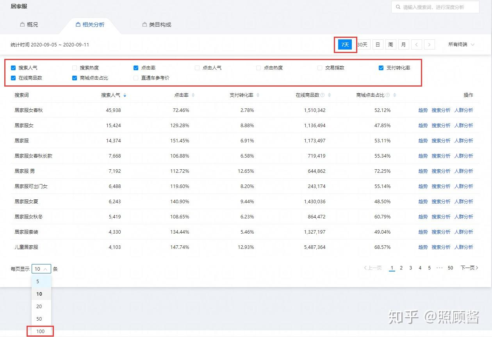
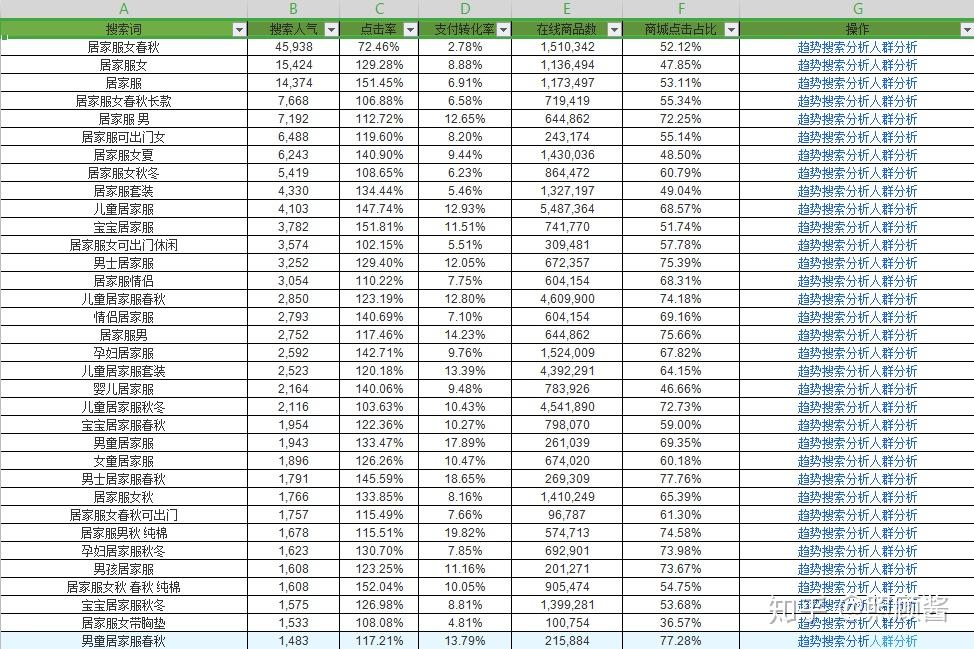
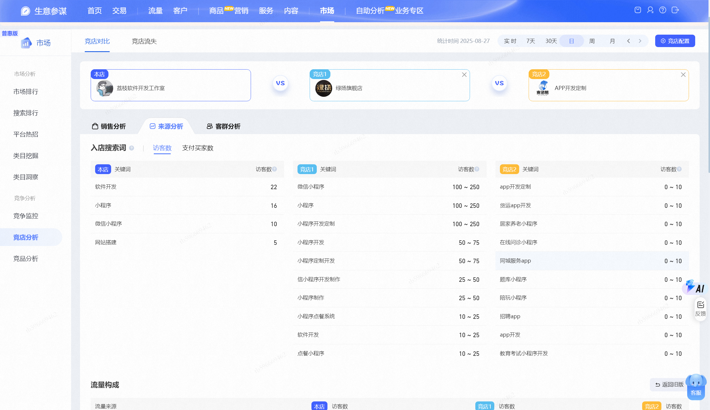
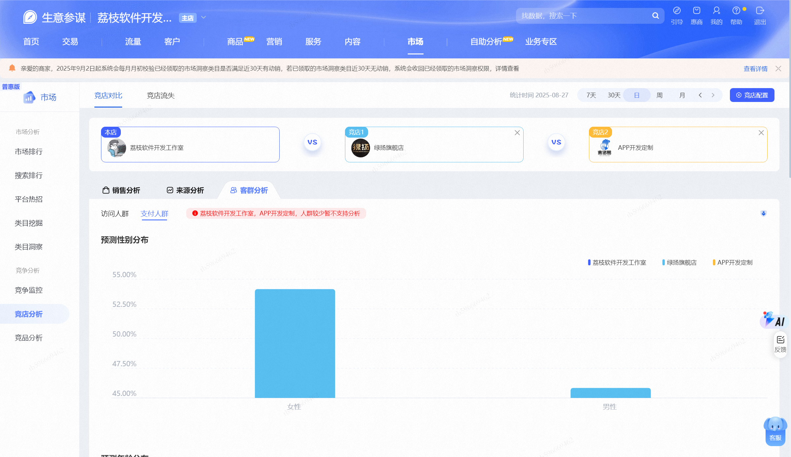

[TOC]

# 产品

## 标题拟定核心技巧

### 一、先避坑：拒绝 “复制爆款标题”

- **新手核心误区**：直接复制同类目高销量（如 5 万 + 付款）爆款标题，认为能蹭流量。
- **弊端**：① 爆款已积累高权重，复制后你的产品会被 “压在排名底层”，甚至刷单时找不到自己的关键词；② 丧失对关键词数据的掌控权，无法针对性优化。

### 二、标题拟定三步骤：寻词→筛词→组合（全流程实操）

#### 第一部分：寻词 —— 找到 “买家真的会搜” 的词

##### 1. 免费渠道（适合 0 成本起步）

- 淘宝搜索下拉框：搜索产品核心词（如 “连衣裙”），提取下拉推荐词（如 “连衣裙女夏”“连衣裙小个子”），手动录入 Excel。

- 缺点：无数据支撑（不知道搜索量、转化率），仅作 “初步词库储备”。

  

##### 2. 付费 / 半付费渠道（数据精准，优先选）

| 工具             | 操作路径                             | 优势                                 | 不足                          | 补充建议                                             |
| ---------------- | ------------------------------------ | ------------------------------------ | ----------------------------- | ---------------------------------------------------- |
| 直通车流量解析   | 千牛→营销中心→直通车→工具→流量解析   | 可直接下载词表，看点击率、转化率     | 无 “市场搜索人气” 数据        | 适合初步筛选 “有转化潜力” 的词                       |
| 生意参谋市场洞察 | 千牛→生意参谋→市场→市场洞察→相关分析 | 数据最全（含搜索人气、在线商品数等） | 需店铺 1 钻以上，年费 1188 元 | 新手可闲鱼租 “查词版”（几十元 / 月），但官方版更稳定 |

#### 第二部分：筛词 —— 只留 “高价值精准词”（5 个核心数据）

##### 核心筛选逻辑：先在生意参谋勾选以下数据（时间选 7 天，显示 100 页），导出 Excel 后筛选

| 数据指标       | 筛选标准                                                   | 背后逻辑                                                     |
| -------------- | ---------------------------------------------------------- | ------------------------------------------------------------ |
| 搜索人气       | 一般类目≥3000（冷门类目除外）                              | 人气低 = 没人搜，即使排第一也没流量                          |
| 支付转化率     | 优先选转化率高的（如 10% 转化率的词，比 3% 的词更易出单）  | 转化率高 = 词更精准，买家需求明确                            |
| 在线商品数     | 越少越好（竞争小，易做排名）                               | 类比 “5000 客流的街，仅 2 家卖早餐”，竞争小则起量快          |
| 商城点击占比   | C 店优先选≤50% 的；猫店也可选低占比（天猫店少，竞争小）    | 占比高 = 天猫店多，C 店难竞争                                |
| 产品属性匹配度 | 必须与产品完全一致（如卖 “雪纺连衣裙”，不选 “棉麻连衣裙”） | 不匹配 = 流量不精准，转化率极低（搜 “连衣裙” 出 “充气娃娃”，没人买） |

#### 总结 “五不选”

搜索人气太低不选、转化率太低不选、在线商品数太高不选、商城占比太高不选、属性不匹配不选。

#### 第三部分：组合 ——30 字（60 字符）最大化引流

##### 1. 先改新手常见错误

- 错误示例：「连衣裙女韩版修身显瘦女连衣裙包邮雪纺连衣裙」
  - 问题：① 关键词重复（“连衣裙”“女” 多次出现，浪费位置）；② 无意义营销词（“包邮” 多数类目无搜索数据）。
  - 改正：先对筛选出的词 “去重”（如 “连衣裙女”“连衣裙女春秋”→ 合并为 “连衣裙女春秋”）。

##### 2. 3 个组合原则（关键！）

| 原则         | 操作方法                                                     | 效果                                                         |
| ------------ | ------------------------------------------------------------ | ------------------------------------------------------------ |
| 紧密优先原则 | 不拆分 “高人气关键词组合”（如 “连衣裙女韩版”，不拆成 “韩版连衣裙女”） | 权重相同时，平台会优先展示 “关键词顺序与搜索词一致” 的产品，提升曝光 |
| 双头原则     | 把重点词（如 “雪纺连衣裙”“韩版连衣裙”）放在标题头尾          | 淘宝搜索从 “头尾向中间检索”，头尾词更易被识别                |
| 多主词布局   | 选 3 个高人气主词（如 “灭蚊灯”“灭蚊神器”“驱蚊神器”），穿插长尾词组合 | 覆盖多类搜索需求，比如用户搜 “灭蚊神器” 也能找到你的 “灭蚊灯” 产品 |

##### 组合示例：

主词：雪纺连衣裙、韩版连衣裙、连衣裙女夏
长尾词：小个子、显瘦、2024 新款
组合后：「雪纺连衣裙女夏 2024 新款小个子韩版显瘦连衣裙」（30 字，无重复，重点词在头尾）

### 三、收尾关键：词表留存

筛选 + 组合后的关键词表格别丢！后续做 “关键词排名优化”（如刷单计划）时，需参考表格中的搜索人气、转化率数据，制定精准操作方案。

## 做淘宝必须理解的 3 大底层逻辑

淘宝运营的核心逻辑可拆解为**曝光→点击→转化**的闭环，三个环节环环相扣，任一环节脱节都会导致 “有曝光没流量、有流量没转化” 等问题。只有每个环节都优化到位，店铺才能进入良性循环。

### 一、底层逻辑 1：曝光 —— 让产品 “被看到”（流量的前提）

### 本质

曝光是 “让目标用户看到你的产品”，是获取流量的第一步。淘宝主流曝光方式分 3 类，需根据店铺阶段选择：

#### 1. 自然搜索排名（免费流量核心）

- **核心逻辑**：买家搜索关键词时，你的产品排名越靠前，被看到的概率越高；排名取决于**UV 价值、千次展现价值、人气值**（细分为销量、销售额、点击率、转化率、收藏加购率等）。
- 新店破零方法
  - 初期可通过 “极低价格让利 + 直通车曝光” 快速破零；
  - 若不愿让利，需靠 “优质主图 + 详情页设计 + 精准直通车运营”，无需刷单也能积累基础销量（避免擦边球风险）。

#### 2. 付费渠道投放（快速获曝光）

- 共性逻辑：所有付费工具（直通车、超级推荐、极速推、万相台等）的核心都是 **花钱买展示位置**
- 直通车：对关键词出价，价越高排名越靠前（但点击成本也高）；
- 超级推荐：投放到 “猜你喜欢”（针对浏览过同类产品的用户）；
- 钻展：投放到淘宝首页大屏等核心位置。
- **关键提醒**：付费曝光能否转化为价值，取决于**产品内功**（主图、评价、详情页），否则就是 “白烧钱”。

#### 3. 手淘推荐（被动流量补充）

- **核心逻辑**：淘宝根据用户 “历史购物类目、近期浏览行为” 打标签，再在 “猜你喜欢、每日好店” 等位置推荐匹配产品（例：搜索并停留 “人参” 页面后，首页会推荐人参）。
- **入池技巧**：无需手动刷推荐（麻烦且低效），只需做好 “白底图 + 提交详情页素材”（卖家后台操作），即可大幅提高平台抓取概率，获取推荐曝光。

#### 补充：站外推广

可通过抖音、小红书等平台做内容引流，但需适配站外平台玩法，非淘宝运营核心，暂不展开。

### 二、底层逻辑 2：点击 —— 让看到的人 “进来”（流量的关键）

### 本质

点击是 “将曝光转化为流量” 的核心，决定流量大小的关键指标是**点击率**—— 类比 “线下店开在步行街（曝光），但没人进店（无点击）”，流量自然为零。

#### 核心操作：主图设计（抓人群痛点，做差异化）

- 避坑：不要在主图上堆砌所有卖点（相当于没有卖点），需针对 “精准人群” 做单点突破，例：
  - 手机行业：商务人士关注 “待机长”，学生关注 “音乐 / 拍照”，针对性卖点能吸引对应人群点击；
  - 微波炉：女性人群关注 “高颜值”，家庭用户关注 “超大容量 / 10 秒速热”，差异化卖点可避开标品价格战。
- 方法：
  1. 初期可 “模仿同类目高点击率主图”（快速起步）；
  2. 长期需 “研究人群需求”：避免 “线下思维”（只觉得 “产品好就卖得好”），要让 “产品卖点” 匹配 “人群痛点”（例：标品也能做出非标品玩法，靠功能差异吸引点击）。

### 三、底层逻辑 3：转化 —— 让进来的人 “下单”（盈利的核心）

### 本质

转化是 “将流量转化为订单” 的关键，核心是 “抓住买家决策痛点”，影响因素集中在 “信任背书 + 需求刺激”。

#### 1. 核心影响因素

| 维度            | 标品（如家电、口红）                   | 非标品（如服饰、小众饰品）                       |
| --------------- | -------------------------------------- | ------------------------------------------------ |
| 基础销量 / 评价 | 依赖度高（用户看 “销量 / 品牌” 决策）  | 依赖度低（用户看 “款式” 决策，20-30 单即可起量） |
| 详情页设计      | 需突出 “功能差异化”（例：智能变频）    | 需突出 “款式细节 / 风格”                         |
| 核心逻辑        | 避免价格战，靠 “功能卖点” 吸引精准人群 | 靠 “款式独特性” 降低对销量的依赖                 |

- 共性要求：评价、“问大家” 需铺垫真实反馈（降低用户顾虑）；详情页需 “围绕单点卖点设计”（一张图一个卖点，避免杂乱）。

#### 2. 淘宝的底层规则

平台会根据 “产品承接流量的能力” 分配更多流量 —— 若你的产品转化率高、用户停留时间长（真实反馈），平台会判定 “你的产品更受用户喜欢”，进而推送更多曝光；反之，若靠刷单制造虚假反馈，平台极易识别，反而会限制流量。

### 四、核心总结：内功比 “曝光技巧” 更重要

1. 闭环思维：曝光是 “基础”，但点击（主图）和转化（详情页 / 评价）才是 “关键”—— 即使靠付费拿到大量曝光，若主图没吸引力、详情页没刺激点，最终还是 “白花钱”。
2. 消费者心理是核心：无论是主图设计还是转化优化，本质是 “搞懂目标人群需要什么”—— 公司运营中 “设计 / 美工数量多于运营”，正是因为 “内功做好了，人群找准了，后续运营会更简单”。
3. 拒绝捷径：不要迷恋 “刷单、低价冲量” 等短期操作，这些方法无法积累精准人群，反而会让店铺陷入 “低价没利润、提价没流量” 的恶性循环；唯有吃透 “曝光→点击→转化” 的底层逻辑，才能稳定盈利。

## 爆品定位全流程 SOP（7 步走）

### 第一步：像 “门外汉” 一样吃透产品（解决 “知识的诅咒”）

​	很多时候产品卖不动，问题不在产品本身，而在 “产品表达”。今天给大家讲讲我们公司做爆品定位的 SOP，第一步也是最关键的一步 —— 像 “门外汉” 一样了解产品。别觉得这个名字土，之前给很多大企业培训时，连他们的市场策划人员都觉得很有启发。这一步主要是为了解决 “知识的诅咒”：一旦我们掌握了某个知识，就很难再体会 “不懂这个知识的人是什么感受”。

​	比如外卖员去你小区送东西，你说 “一进门右转直走到头，左边第三个楼”，你觉得路线很清晰，但在外卖员眼里，整个小区的路况可能一团乱。这种情况在科技产品里特别常见，比如宣传 “手机用 XX 纳米芯片，图像处理速度 XX 毫秒”，普通用户根本听不懂 —— 问题就出在 “没站在用户视角拆解产品” 这一步。

具体要走 5 个流程：

1. **资料收集**：收集产品所有相关资料，逐字逐句仔细读（这是很多人会忽略的关键环节）；
2. **列举疑问**：把不懂的问题全列出来 —— 产品优势是什么？核心卖点、功能功效有哪些？专业名词是什么意思？比如我们之前做枕头产品时，遇到 “超细纤维 0.8” 这个参数，一开始完全不懂，问了客户才知道 “是指一公里长的纤维，重量只有 0.8 克”。所有不理解、能量化的地方，都要列成疑问；
3. **拆解 “0 到 1” 的诞生过程**：为了避免遗漏产品亮点，要问客户 “产品从原材料到成品，整个过程是怎样的？” 比如 “棉花种在什么地方？品种是什么？年日照时间多少？日照对棉花品质有什么影响？纺织过程中有没有先进技术？” 从原材料到送到消费者手里，每个环节都要问透；
4. **问题清单答疑**：把列好的问题交给客户解答，过程中如果产生新问题，当场解决；
5. **整理产品特性清单**：答疑后最终形成的清单，必须是 “事实” 而非 “观点”。比如 “严选品质” 是观点，而 “15 道严选工序” 就是事实 —— 这些事实后续会直接用在文案、产品介绍里，甚至影响产品定位。

### 第二步：竞品研究（摸透市场与对手）

第二步是做竞品研究，主要有 3 个目的：

1. **了解市场竞争难度**：判断这个市场好不好做，为后期企业投入资源、制定差异化策略提供依据；
2. **分析对手优劣势**：搞清楚竞品的长处和短板；
3. **学习借鉴**：看竞品哪些地方表达得好、遇到问题是怎么巧妙解决的，甚至可以借鉴 “非同类但有相似问题的产品” 的做法。

要分析三类竞品：

- **直接竞争对手**：卖和你完全相同的产品，只是品牌不同（比如你卖乌龙茶，他也卖乌龙茶）；
- **品类竞争对手**：不卖相同产品，但属于同一大类（比如你卖乌龙茶，他卖绿茶、红茶）；
- **参照品牌**：行业内做得好、有亮点的品牌，哪怕不是同行，只要遇到过相似问题，都可以参考。

确定竞品后，要收集这些信息：竞品的定位、广告语、核心卖点、目标人群、使用场景、推广方式；然后分析其优势、劣势、核心战略方向、未来可能的动作，甚至要预测 “如果我们的产品上市后威胁到它，它可能会怎么反击”。

### 第三步：消费者研究（抓准需求与语言习惯）

消费者研究主要关注 3 个核心点：

1. **电商评价分析**：从评价里找 “用户满意的点” 和 “不满意的点”，更重要的是抓 “用户的语言习惯”—— 比如用户说 “产品脆”，会用哪些口语化的词？用户不像文案或广告从业者，表达都很直白，但这些口语化表达对写文案、广告语特别有用，因为 “语言越口语，传播障碍越低”。
2. **小红书等内容平台分析**：小红书上有大量真实的消费者声音，重点看 “有没有未被满足的需求”，同时用 “关键词密度法” 分析 —— 用户评价、分享里，哪些关键词出现频率高（可能是正向、中性或负向的），这些关键词能反映用户的核心关注点。
3. **观察行为而非 “理性提问”**：很多国际调研公司会问 “你感受到这个品牌的 XX 精神了吗？” 这种问题其实是把企业该做的决策丢给了用户，得不到对卖货有用的答案。调研的关键是 “观察用户行为”：比如用户在货架前走什么路线、先看什么后看什么、拿起产品看价签后是否放下…… 这些行为能反映真实偏好。

我们之前做调研时，会设计巧妙的问题引导用户 “第一反应作答”。比如不说 “你觉得哪个产品更好”，而是问 “这两个产品，你觉得哪个更贵？”—— 其实是想知道 “哪些词能让用户觉得产品更有价值”，靠第一反应拿到最真实的答案。

### 第四步：爆品定位的 4 个核心方法（前期准备到位，定位更简单）

很多人觉得 “爆品定位” 是最关键的一步，但其实前面三步（产品吃透、竞品研究、消费者研究）才是核心 —— 准备功课做足了，定位反而只需要掌握方法就行。前面三步总结下来，其实就是日本战略家大前研一的 “3C 模型”：自家产品的优势、竞品的优劣势与主打概念、消费者的真实需求与消费场景。

爆品定位有 4 个方法：

1. **用户任务法（Jobs to be Done）**：用户买这个产品，是为了 “完成什么任务”？不能只看表面（比如 “买零食是为了解馋”），要用 “五外分析法” 层层追问：比如 “用户为什么买透气的凉鞋？”→“夏天脚热难受”→“为什么怕脚热？”→“脚热容易臭，不舒服”。一个产品可能对应多个用户任务，这时要 “抓大头”—— 选需求人数最多、对用户影响最大的任务，做取舍（比如确定主打 “防臭” 还是 “轻便”）。很多场景化定位，本质都是从 “用户任务” 延伸来的（比如 “运动时穿的鞋”，核心任务是 “运动时脚舒服”）。

   比如我们分析足力健用户的 “任务” 时，先描述行为：“夏天买鞋，希望透气、轻便、凉爽、好看、舒服”——“夏天买鞋” 是核心任务，“透气、轻便” 等是完成任务的 “指标”。

2. **价值曲线分析法（从竞争角度切入）**：横坐标是 “竞争要素”（用户买这个产品时在意的点，比如颜值、价格、功能），纵坐标是 “表现得分”（自家产品和竞品在每个要素上的得分）。比如 “颜值” 上，竞品得 9 分，自家得 5 分；“价格” 上，自家得 8 分，竞品得 5 分 —— 打分后画出价值曲线，找到 “自家与竞品得分差异最大的点”，然后 “取舍聚焦”：把资源集中在这个差异点上，做到 “让喜欢的人爱死，不喜欢的人恨死”。差异化往往就是这么来的。

3. **重新定位竞争对手**：找到竞品的 “劣势点”，然后让自家产品成为 “竞品劣势的反义词”。比如我们之前给云南一个小茶村做品牌，客户觉得 “比不过连锁大品牌”，但我们发现 “连锁品牌做不到茶农直供”—— 于是把定位定为 “400 年茶村，茶农直供”，形成 “茶农直供 vs 连锁品牌” 的对立，给竞品贴上 “非源头直供” 的隐性标签。再比如 “死亡之水” 矿泉水，发现 “音乐节上乐队觉得拿矿泉水瓶喝不酷”，于是把包装做成啤酒瓶样式，定位 “酷的水”，隐性给其他矿泉水贴上 “娘炮” 的标签 —— 这种方法在历史上很常见，也很有效。

4. **聚焦产品差异化特性**：找到 “竞品没提过，但用户很在意” 的产品特性，以此做定位。比如我们之前做鹅绒枕，当时竞品都在比 “鹅绒含量”“面料细腻度”，但通过消费者研究发现 “有人喜欢硬枕，有人喜欢软枕”，而喜欢软枕的用户最在意 “包裹感、拥抱感”，进一步发现 “蓬松度” 是影响软枕体验的关键特性 —— 于是就以 “高蓬松度软枕” 做定位，精准击中这类用户的需求。前提是 “这个特性必须是用户真正在意的，能影响购买决策的”。

这 4 个方法可以结合用，比如用 “用户任务法” 找需求，再用 “价值曲线法” 验证差异，最终确定定位。

### 第五步：爆品广告语（文案三要素：注意力、效率、效果）

第五步是写爆品广告语，核心是把 “企业想传递的信息” 用文字准确传递给用户。从信息传播角度，要做好三点：**注意力（让用户看到）、效率（让用户快速懂）、效果（让用户想买）**。

#### 1. 抓注意力：4 个常用方法

- **用负面词**：比如 “怕跌倒，穿足力健”——“怕” 字一出现，能瞬间刺激用户，调动本能反应（注意力往往在思考之前，是本能的）；
- **唤醒后果（恐惧心理）**：比如 “得了灰指甲，一个传染俩”“看不见的细菌才最可怕”—— 把负面后果摆出来，让用户产生警惕；
- **词语杂交（非正常搭配）**：把形容 A 事物的词用来形容 B，比如 “一口下去，恶补维 C”——“恶补” 原本是 “考前补习” 的意思，用在 “补维 C” 上，搭配少见，更容易抓眼球；
- **制造冲突**：比如 “洗了这么多年头，你洗过头皮吗？”“喝果汁不如喝水果”—— 用前后反差的信息，调动用户的好奇心（人类对 “反常信息” 的注意力，是进化来的生存本能）。

#### 2. 提效率：降低信息理解障碍

- **说大白话（口语化）**：平时怎么聊天就怎么写，用户理解起来没难度；
- **押韵**：读起来顺口、朗朗上口，信息传递更顺；
- **用具体场景**：比如足力健 “艾草健步鞋”，原宣传 “走路多脚不累”，不够具体 —— 发现 “微信运动 1 万步后步数会变黄，用户会有成就感”，于是改成 “走 1 万步脚不累”，用户能瞬间 get 到 “什么是走路多”；
- **用实物词（有画面感）**：比如 “枯藤、老树、昏鸦、小桥、流水”，全是实物词，能快速构建画面；避免用抽象概念（比如 “拉格朗日中值定律”，用户没直观印象）；
- **借原有记忆**：用用户已经熟悉的句子，比如给瓜子写 “大吉大利大瓜子，吃大瓜子过大年”——“大吉大利” 是春节常用词，用户扫一眼就懂，还容易记。

#### 3. 保效果：重点是 “说服力”

- **用事实**：事实比观点更有说服力；
- **用数字**：数字自带 “科学、准确” 的属性，比如 “15 道严选工序” 比 “严选品质” 可信；
- **找证据**：比如 “怕跌倒，穿足力健 —— 走路更稳更安全”，“走路更稳更安全” 就是 “怕跌倒” 的解决方案证据。

### 第六步：卖点文案梳理（FBA 模型 + 成交逻辑，核心杀手锏）

这一步是我们的 “保命绝技”，之所以敢分享，是因为很多企业要么没时间组织团队，要么没精力花 1-2 个月细致梳理 —— 但这一步对卖货至关重要。

#### 1. 用 FBA 模型解决 “关我屁事”

很多人用 FBA（Feature-Benefit-Advantage）觉得没效果，是因为翻译错了：

- **F（Feature）= 特性**：产品的事实属性（比如 “鹅绒枕蓬松度 800”）；
- **A（Action）= 作用**：这个特性能带来什么效果（比如 “蓬松度 800，能更好地包裹头部”）；
- **B（Benefit）= 好处**：这个作用能给用户带来什么实际价值（比如 “包裹头部，睡起来更舒服，脖子不酸”）。

用户在意的不是 “产品有什么特性”，而是 “这个特性对我有什么好处”—— 所以写卖点时，必须把 “好处” 说清楚。比如企业别只说 “我们有大工厂、上市公司”，要告诉用户 “大工厂生产，品控更严，你买得更放心”。

#### 2. 电商详情页的成交逻辑（AIDA 模型）

详情页不是 “介绍产品”，而是 “说服用户下单”，要跟着用户的决策路径来：

- **A（Attention：注意）**：放产品核心定位、广告语，或核心信任状（比如 “10 年品牌”“百万用户选择”），抓住用户眼球；
- **I（Interest：兴趣）**：讲 “痛点 + 卖点”—— 产品能解决用户什么麻烦，能带来什么好处；
- **D（Desire：欲望）**：用 “心理所有权效应”—— 让用户觉得 “拥有这个产品会很好”，比如描写 “穿上这双鞋，跳广场舞时脚不酸”“枕这个枕头，躺下就能感受到包裹感”，调动用户的拥有欲（苹果店不让店员帮用户操作手机，就是怕用户失去 “拥有感”）；
- **T（Trust：信任）**：放信任状 —— 品牌成立时间、国际奖项、高复购率、好评率，让用户觉得 “下单不会踩坑”；
- **A（Action：行动）**：用 “限时 / 限量” 刺激下单，比如 “限时优惠，售完即止”，提升用户的紧迫感。

另外，产品说明要 “照顾新手”：比如粘钩明明很简单，却要写 “揭开→贴墙→挂袋” 三步 —— 一是照顾不会用的人，二是让用户提前 “感受使用场景”。

### 第七步：卖点口语化 + 短视频成交（适配直播 / 短视频场景）

现在很多产品靠直播、短视频卖，所以 “卖点口语化” 越来越重要。

#### 1. 卖点口语化：多场景拆分

一个卖点可以对应多个场景，比如 “走路不累”，可以拆成 “跳广场舞时脚不累”“旅游逛景点脚不累”“带孙子出门脚不累”“逛迪士尼、遛狗、买菜、爬山脚不累”—— 场景越具体，用户越容易代入。哪怕只有一个卖点，也能靠 “多场景” 让用户感受到价值；同时可以 “卖点 + 痛点” 结合说，比如 “衣服修身显瘦，不会把小肚子露出来”，看似废话，实则能击中用户的顾虑。

#### 2. 短视频成交逻辑

和电商详情页逻辑类似，围绕 “吸引兴趣→激发欲望→建立信任→促成成交” 展开，不用严格按顺序，可以穿插。关键是 “增加说服时间”—— 测试发现，看视频时间越久，成交几率越大：30 秒、40 秒、50 秒的视频成交率，远高于超短视频；甚至 2-3 分钟的视频（比如卖书的视频），成交效果更好。

# 运营

## 刷单和搜索的逻辑

### 一、核心认知：厘清刷单与搜索的关系（避免操作误区）

1. 核心结论

   **刷单≠搜索**，刷单只是达成目标的 “手段”，而非搜索本身

   - 解释：很多人误以为 “做搜索就是刷单”，实际搜索是获取流量的结果，刷单只是实现该结果的其中一种方法，需先明确目的再用手段，避免盲目操作。

2. 刷单的 2 个核心目的（决定操作方式）

   - 目的 1：冲搜索排名、拿曝光
     解释：通过控制刷单的入口（如精准搜索词）、人群标签，让平台判定产品受欢迎，从而提升搜索排名，获得更多用户看到产品的机会。
   - 目的 2：做基础销量 / 评价 / 买家秀 / 问大家，提转化
     解释：用户购物时会看 “别人买得怎么样”，基础销量和优质评价能降低用户顾虑，提高点击后的购买率。

3. “非收入口成交” 的正确用法（破除绝对化认知）

   - 核心逻辑：选不选非收入口，看目的
     - 若目标是 “做基础销量”：优先用非收入口（如店铺首页、购物车），因为更安全，不易被平台判定为违规刷单。
     - 若目标是 “冲搜索排名”：非收入口帮助小，因为搜索排名依赖 “搜索入口的成交数据”，非搜索入口的成交不直接关联搜索权重。

4. 当前稳妥组合：直通车 + 非收入口刷单

   - 解释：直通车负责 “精准获取曝光”（直接触达目标用户），非收入口刷单负责 “铺垫基础销量 / 评价”（提高转化）；
   - 反驳 “开车费钱”：不是直通车贵，是不会精准定位人群、控制出价，导致钱花在无效流量上。

### 二、做手淘搜索的 4 种核心手段（附适用场景）

| 手段            | 核心操作                            | 关键解释（适用场景 / 注意点）                                |
| --------------- | ----------------------------------- | ------------------------------------------------------------ |
| 1. 刷单拉搜索   | 精准搜索入口成交 + 控制人群标签数据 | 依赖 “大量精准成交数据”，让平台认为产品符合搜索用户需求，从而提升搜索排名；适合需要快速起搜索权重的产品。 |
| 2. 直通车拉搜索 | 精准定位人群 + 控制关键词出价       | 和刷单逻辑一致，但更精准（可直接筛选年龄、消费层级等人群），后续会讲详细操作；适合有一定预算、想可控起量的商家。 |
| 3. 精准词拟标题 | 抓用户常搜的 “入口词” 写标题        | 不刷单也可能有流量，但 “佛系” 且看类目：小众类目（竞争小）只要标题包含用户搜索词，就能被找到；大众类目单靠标题难起量。 |
| 4. 放访客来搜索 | 引导访客通过搜索入口进入成交        | 仅适用于 “冲动消费型非标品”（如小众饰品、特色服饰），这类产品用户决策快、对基础销量要求低，访客搜索成交能带动权重。 |

### 三、实操建议

- **优先选择**：“直通车 + 刷单” 组合，是目前最稳妥的方式（兼顾曝光精准度和权重提升，同时降低违规风险）。

- **刷单平台**：https://d58.noqiang.com/

## 如何控制搜索流量

### 一、核心定义：数据控制 = 单量控制

数据控制的核心是**上架初期通过 “递增单量” 启动动销、拉动搜索流量**，单量的配置需结合类目、店铺层级，且需参考市场 / 竞品数据，而非固定模板。

### 二、上架初期单量递增：基础模板 + 类目 / 层级差异

### 1. 通用基础递增模板（保底不犯错）

| 上架天数 | 基础单量（示例） |
| -------- | ---------------- |
| 第 1 天  | 3 单             |
| 第 2 天  | 6 单             |
| 第 3 天  | 10 单            |
| 第 4 天  | 15 单            |
| 第 5 天  | 20 单            |

- **解释**：这是 “不知道竞品数据时的安全模板”—— 按此操作不会因单量异常（如骤增骤减）被平台判定违规，但效果可能一般，仅用于 “避免踩坑”，而非 “追求最优效果”。

#### 2. 关键差异：类目不同，单量不同

- **标品＞非标品**

  标品（如家电、3C 配件）竞争更激烈，初期需要更多单量才能突破流量阈值；非标品（如服饰）对基础销量要求低，单量可更少（示例：服饰类初期递增为 1 单→3 单→5 单→7 单→8 单）。

- **解释**

  标品用户更看重 “销量排名”（比如买充电宝优先选销量高的），需多单量冲排名；非标品用户更看重 “款式、风格”，少量基础单量 + 优质视觉即可转化，无需大量堆单。

#### 3. 关键差异：店铺层级不同，单量不同

- **层级越高，单量需求越少**

  高层级店铺本身有稳定的流量和订单基础，无需靠大量新单 “撬动” 搜索；低层级店铺需更多单量打破流量僵局。

- **解释**

  平台对高层级店铺有 “流量倾斜”，其现有订单已能维持基础权重，新单只需 “辅助递增”；低层级店铺权重低、自然流量少，需靠更多新单证明 “产品受欢迎”，才能获得平台更多搜索推荐。

### 三、科学单量配置：以竞品为核心参考（最优方案）

#### 1. 核心逻辑：竞品是最好的老师

- **操作步骤**

  1. 分析 “同类目新起链接” 的初期单量（看竞品上架前 5-7 天的订单递增规律）；
  2. 用 “生意参谋” 查自己要操作的 “关键词市场数据”（如该关键词下 top 产品的日均单量）；
  3. 参考以上数据，确定自己的单量（建议为竞品单量的**1.2-1.3 倍**）。

- **解释**

  竞品的单量是 “经过市场验证的有效数据”—— 竞品能靠该单量起流量，说明符合平台对 “该类目 / 关键词” 的权重判定标准；比竞品多 10%-30%，是因为市场实时变化，若完全复刻竞品单量，可能因 “同质化竞争” 无法超越，稍多单量能更快抢占排名。

#### 2. 特殊情况：冷门类目无竞品参考怎么办？

- **操作**

  先用 “通用基础递增模板” 测试，再根据 “流量反馈” 调整（比如按模板操作 3 天，若没流量就适当增加单量，若有流量但转化低则维持单量、优化其他环节）。

- **解释**

  冷门类目竞争小，平台对单量的 “阈值要求低”，基础模板足够启动测试；后续靠 “实时数据反馈” 调整，比盲目堆单更高效（避免单量过多导致违规，或过少无法起量）。

### 四、关键提醒：单量测试需足够周期

- **核心结论**

  最少测试**24 轮**（可理解为 24 天，或按 “递增周期” 循环 24 次），才能测出精准的单量配置。

- **解释**

  搜索流量是 “实时调整的动态过程”，短期（如 3-5 天）数据可能受偶然因素影响（如某天竞品突然降价、平台临时流量波动），无法反映真实效果；24 轮测试能覆盖 “不同流量波动周期”，排除偶然因素，找到稳定起量的单量规律，避免 “因短期数据误判而调整失误”。

### 五、参考单量控制

| 操作项目                      | 第一天 | 第二天 | 第三天 | 第四天 | 第五天 | 第六天 | 第七天 |
| ----------------------------- | ------ | ------ | ------ | ------ | ------ | ------ | ------ |
| 单品总访客 - 商品人气         | 40     | 60     | 40     | 80     | 100    | 60     | 100    |
| 淘口令 / 商品链接（成交方式） | 1      | 0      | 0      | 1      | 0      | 0      | 1      |
| 加入购物车隔天成交            | 0      | 1      | 0      | 1      | 1      | 1      | 0      |
| 大额退款单                    | 1      | 0      | 0      | 0      | 0      | 0      | 0      |
| 商品精准长尾词                | 0      | 0      | 0      | 0      | 1      | 1      | 1      |
| 旺信                          | 1      | 0      | 0      | 1      | 0      | 1      | 0      |
| 拍立淘【用商品主图搜索成交】  | 0      | 0      | 0      | 0      | 1      | 0      | 1      |
| 搜索惊喜码                    | 0      | 2      | 1      | 2      | 2      | 0      | 1      |
| 操作总单量                    | 2      | 3      | 2      | 4      | 5      | 3      | 5      |

## 引流词不精准怎么办

### 一、核心认知：引流词需 “提前规划”

- 核心结论

  操作前必须定好精准引流词，不同关键词对应不同产品属性、市场数据，最终带来的流量精准度天差地别。

- 解释

  比如 “贴小卡片”，在酒店贴（对应精准关键词）能触达有需求的人，在沙漠贴（对应不精准关键词）则无效；关键词选不对，后续再操作也难获精准流量，更别提高转化。

- 引流词怎么找？？？？

  当前我自己的方法是竞店分析

### 二、处理引流词不精准的核心操作（分步骤）

#### 1. 第一步：锁定 “精准核心词”，以此为中心拓展

- 操作

  先确定产品的核心精准词（如卖 “吊带连衣裙”，核心词就是 “吊带连衣裙”）。

- 解释

  核心词是产品的 “身份标签”，必须和产品属性完全匹配（比如卖 “甜辣风吊带裙”，核心词不能是 “通勤吊带裙”），后续所有操作都围绕它展开，避免偏离产品定位。

2. #### 第二步：找 “高价值长尾词”，放进标题

- 操作
  1. 用 “生意商品” 工具，搜索核心词（如 “吊带连衣裙”）相关的长尾词；
  2. 筛选标准：**搜索人气较好 + 支付转化率较高 + 和产品属性完全匹配**（如 “女吊带甜辣连衣裙”“吊带炸街连衣裙”）；
  3. 将筛选出的长尾词全部放进产品标题。
- 解释
  - 长尾词比短词（如 “吊带连衣裙”）更精准，能直接定位 “有明确需求的用户”（比如搜 “甜辣吊带连衣裙” 的用户，就是想要甜辣风格，而非通勤、森系）；
  - 标题是关键词权重的基础，只有词在标题里，后续操作才能积累该词的权重，否则操作了也没用。

#### 3. 第三步：干预长尾词成交数据，叠加权重

- 操作

  按之前分享的搜索流量操作方法，持续干预标题中这些精准长尾词的成交数据（比如通过对应长尾词的搜索入口成交）。

- 解释

  平台判定关键词是否有价值，核心看 “该词的成交数据”（比如用户搜 “炸街吊带连衣裙” 后买了你的产品，平台会认为你的产品符合这个词的需求，慢慢给这个词更高权重）；当多个精准长尾词权重提升，产品的 “精准标签” 会越来越清晰，进来的流量自然更精准、转化更高。

### 三、新店特殊情况：权重低搜不到短词怎么办？

- 操作

  优先选 “更精准的长尾词” 操作（比如搜 “吊带连衣裙” 找不到，就用 “甜辣吊带连衣裙女”），且必须是标题里有的词。

- 解释

  新店初始权重低，短词（搜索人气高、竞争大）排名靠后，根本搜不到；而更精准的长尾词竞争小，更容易让目标用户找到，既能积累基础销量，又能逐步叠加权重，为后续操作短词打基础；若用标题外的词，平台无法识别该词与你产品的关联，操作等于白费。

### 四、进阶逻辑：从长尾词到短词，循环叠加

- 操作

  用精准长尾词积累一定基础权重后，再慢慢操作 “更短的词”（比如从 “甜辣吊带连衣裙女” 过渡到 “吊带连衣裙女”），反复循环。

- 解释

  长尾词帮你打好 “精准流量 + 基础权重” 的底子后，再攻短词（搜索范围更广、流量更多），既能拿到更多流量，又能保证流量精准度（因为前期标签已定型）；只要前期标题、长尾词等 “基础内功” 做好，后续流量的转化率就有保障。

## 人群标签核心逻辑与矫正方法

### 一、核心认知：为什么人群标签很重要？

1. **平台标签体系成熟**：淘宝数据库已对用户人群标签进行精细化分类（如 “时尚达人”“铲屎官” 等），标签基于用户历史购物类目、行为偏好生成；刷手账号同样有 “刷手属性标签”，平台可识别。
2. **刷单对标签的影响**：若靠非精准刷手（非目标客群）刷单起量，后期平台会优先推送 “刷手属性人群”，导致流量不精准、转化低 —— 这是很多人 “流量起来但不转化” 的核心原因之一（另一个原因是引流词不精准）。

#### 二、关键逻辑：平台推送人群的依据

- **核心规则**

  平台根据 “店铺近期成交人群的属性比例” 推送流量。

- **示例**

  若近期店铺成交人群中 90% 是低客单价、10% 是高客单价，平台会默认你 “适合低客单价人群”，后续主要推送低客单价流量；反之，若高客单价成交占比提升，高客单价流量会增多。

- **前提条件**

  矫正人群前必须先明确 “类目精准人群”（如女装类目精准人群可能是 “25-35 岁、月均消费 500-1000 元女性”），否则会越矫正越歪，无法提升转化。

### 三、人群标签矫正：核心手段（直通车精选人群投放）

#### 1. 操作步骤（分 4 步）

| 步骤 | 具体操作                                                     | 目的 / 解释                                                  |
| ---- | ------------------------------------------------------------ | ------------------------------------------------------------ |
| 1    | 打开直通车→新建计划→选择需推广的宝贝链接→确定产品精准词      | 精准词是人群匹配的基础，确保后续投放的人群与产品需求对应     |
| 2    | 进入 “更多精选人群”→选择 “自定义添加”→仅关注 “基础属性人群” 下的**人口属性**（如性别、年龄）和**身份属性**（如月均消费额度） | 这两类属性已覆盖核心人群特征，智能组合人群（如 “25-35 岁 + 女性 + 高消费”）不利于后续单独优化调整 |
| 3    | 按核心属性批量组合人群（示例：性别 2 个选项 + 年龄 6 个选项 + 月均消费 7 个选项，共组合 84 个人群），初始人群溢价设为**50%-100%** | 全覆盖目标人群属性，高溢价优先触达精准人群，避免初期因溢价过低无法获取数据 |
| 4    | 根据人群数据反馈调整（保留数据好的人群、优化或删除数据差的），后期侧重投放高转化人群 | 通过数据筛选出 “真正精准的客群”，持续强化该人群标签，让平台后续优先推送 |

#### 2. 关键前提（必须满足）

产品需先具备**基础销量和评价**，否则即使通过直通车触达精准人群，也因 “无信任背书” 无法转化，人群标签无法有效矫正。

### 四、延伸建议：刷单 + 直通车的搭配逻辑

- 刷单的 2 个核心目的：①冲搜索排名拿曝光；②做基础销量 / 评价提转化。
- 稳妥组合：**直通车负责精准曝光（触达目标人群）+ 刷单负责铺垫基础销量（建立信任）**，仅靠刷单风险高（易被识别、人群标签乱），学会直通车逻辑（精准投放、人群控制），可适用于多数能开直通车的类目。

## 直通车核心逻辑与关键前提（避免白烧油）

### 一、直通车本质：花钱买曝光，非 “花钱买成交”

- **核心类比**

  开直通车像相亲网站开 VIP—— 平台仅负责 “把你的产品（资料）推到更多潜在用户（异性）面前”，或把更多用户（异性）推给你，**不保证最终成交**。

- **关键认知**

  直通车的作用仅限 “获取展现位置、增加产品曝光”（比如把产品推到搜索结果页靠前位置），曝光后用户是否点击、点击后是否成交，与直通车本身基本无关，取决于产品自身竞争力。

### 二、曝光后能否成交：看 2 大核心能力（直通车外的关键）

#### 1. 产品基础建设（决定用户信任度）

必须先做好以下基础，否则曝光再多也难转化：

- 基础销量无销量的产品，用户会因 “没人买” 犹豫，难以下单；
- 评价 / 买家秀：用户购物会参考他人反馈，优质评价、真实买家秀能降低决策顾虑；
- 营销活动：如限时折扣、满减等活动，可刺激用户即时下单，提升转化概率。

#### 2. 人群精准度（决定曝光是否 “有效”）

- **核心逻辑**

  若人群投放不精准（比如把 “高端护肤品” 推给 “追求 9.9 元包邮” 的用户），即使曝光量大，也几乎没人点击、成交，最终只会 “白白浪费钱”。

- **关键关联**

  人群精准度与产品属性强相关（如标品和非标品的人群玩法不同），需先明确产品的精准人群，再做直通车投放。

### 三、前提：先判断产品是否适合开车 + 做好基础

- **适合性判断**

  不是所有产品都适合开直通车，需结合类目属性（如标品竞争激烈，可能需要直通车突破流量；部分小众非标品靠标题、自然流量即可起量，无需过早开车）；

- **核心前提**

  必须先完成 “产品基础建设（销量、评价、买家秀）+ 明确精准人群”，再开直通车。否则即使直通车能带来曝光，也会因 “产品没信任度”“人群不匹配” 导致转化低，陷入 “白烧油” 的困境。

## 直通车底层逻辑与避坑指南

### 一、新手开直通车易翻车的核心原因

- **认知误区**：多数人将直通车等同于 “花钱做推广”，认为花钱就该有流量、有订单，一旦没效果就否定工具（觉得 “直通车是骗人的”），忽略 “工具用法决定效果”。
- **类比参考**：像第一次考驾照 —— 若不懂离合、油门原理（对应直通车底层逻辑），仅靠盲目尝试（对应乱花钱推广），大概率频繁 “熄火”（翻车）；只有先理解工具本质，才能少走弯路。

### 二、直通车本质：不是 “推广”，是 “买曝光位置”

1. **核心功能（平台赋予）**：仅通过付费，让宝贝在**固定的直通车展示位**（如搜索结果页特定区域）曝光，只要产品被展示，直通车的 “使命就已完成”。
2. 关键区分
   - 直通车不负责 “带来流量”：流量需要 “用户看到后点击” 才能获取，点击与否取决于**主图吸引力**（与直通车无关）；
   - 直通车不负责 “带来订单”：点击后是否下单，取决于**产品基础内功**（如销量、评价、痛点营销，与直通车无关）。

### 三、开好直通车的底层逻辑：围绕 “降本增效” 做 3 件事

#### 1. 第一步：优化车图，提升点击率

- **核心作用**：点击率直接影响 “质量得分”（直通车关键指标），点击率越高，质量得分越高，后续出价成本越低。
- **实操方法**：若缺乏设计思路，可借鉴 “同类目高点击率主图”（参考其构图、卖点突出方式），确保主图能快速抓住用户注意力（如突出核心卖点、差异化优势）。

#### 2. 第二步：精准投放人群，提升点击率 + 转化率

- **核心逻辑**：人群越精准，用户对产品需求越匹配，点击意愿（点击率）和购买意愿（转化率）越高，同时进一步推高质量得分。
- **实操步骤**
  1. 按 “性别 + 年龄 + 消费层级” 组合新建多个人群计划（如 “25-35 岁女性 + 月均消费 500-1000 元”）；
  2. 根据数据反馈筛选 “点击率高、转化率高” 的人群计划，后续侧重投放，放弃数据差的人群。

3. 第三步：通过 “高点击率 + 高转化率” 降出价、提 ROI

- **逻辑链**：
  高点击率→高质量得分→降低出价（相同排名下，质量得分高的账户出价更低）→用更少的钱获得更多曝光→ROI（投入产出比）提升；
- **关键澄清**：所谓 “一毛钱上首页” 等技巧都是噱头，所有高效操盘都离不开上述逻辑 —— 本质是通过优化车图、人群提高数据，进而降低成本，而非靠 “奇技淫巧”。

### 四、提升 ROI 的唯一可行路径（新手必懂）

- **ROI 公式**：ROI = 利润 / 投入，提升 ROI 只有 2 种方式：①提高利润（压缩成本）；②降低投入（降低直通车出价）。
- **现实选择**：厂家成本难以压缩（能压早压），因此**降低出价是唯一可行路径**—— 而通过 “优化车图 + 精准人群” 提升点击率、转化率，正是降低出价的核心方法（呼应第三步逻辑）。

### 五、新手实操建议

- 先理解底层逻辑（曝光→点击→转化的关联，及点击率、人群对成本的影响），再带着明确目的试错（如 “本次实操目标是测试 3 组人群的点击率”）；
- 后续运营像 “开车调速”：根据数据反馈（如某人群点击率下降、某关键词出价过高）实时调整（如暂停低质人群、降低低效关键词出价），而非一成不变。